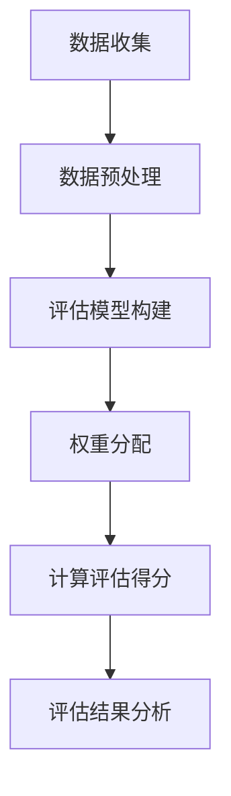
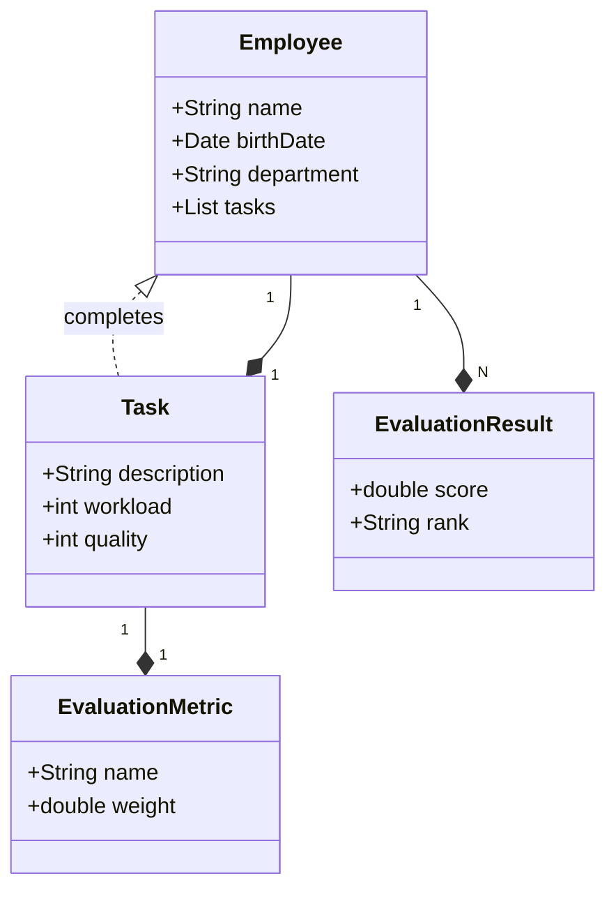
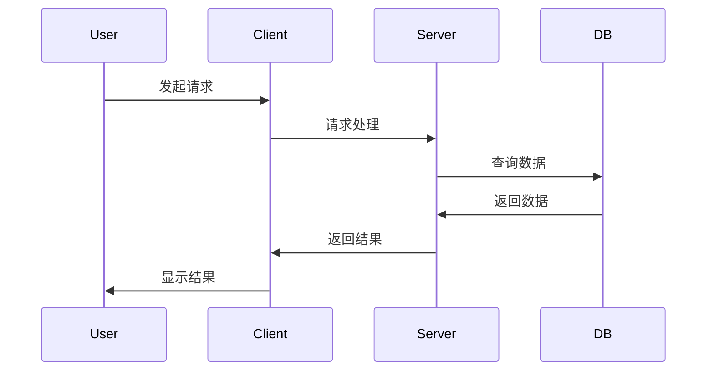
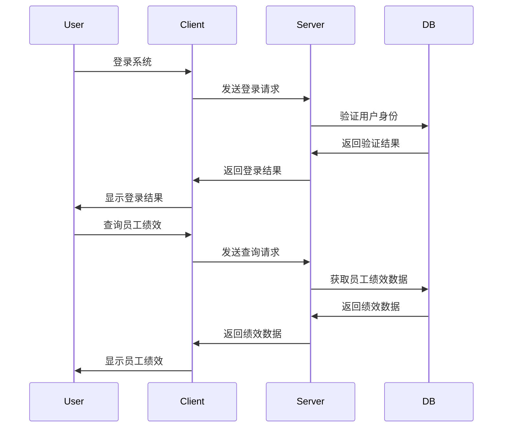

                 

### 文章标题

# 如何进行有效的团队绩效评估

### 关键词

- 团队绩效评估
- 评估体系
- 评估指标
- 评估算法
- 数学模型
- 系统架构
- 实战案例

### 摘要

本文旨在探讨如何进行有效的团队绩效评估，以提高团队的工作效率和整体绩效。首先，我们将概述团队绩效评估的重要性与面临的挑战，接着深入探讨核心概念及其联系。在此基础上，我们将详细讲解团队绩效评估的算法原理和数学模型，并设计一个具体的系统架构。随后，通过实际项目实战，我们将展示如何将理论应用于实践。最后，总结最佳实践，展望未来趋势，并提供相关注意事项和拓展阅读。

## 第一部分：团队绩效评估概述

### 第1章：团队绩效评估的重要性与挑战

#### 1.1 问题背景

##### 1.1.1 团队绩效评估的意义

团队绩效评估是企业管理中至关重要的环节，它不仅能够帮助管理者了解团队成员的工作表现，还能为团队的发展提供有力的数据支持。有效的团队绩效评估能够激励团队成员提高工作积极性，促进团队整体绩效的提升。

##### 1.1.2 团队绩效评估的现状

当前，许多企业在团队绩效评估方面存在诸多问题，如评估目的不清、评估标准不科学、评估流程不透明等。这些问题导致评估结果往往无法真实反映团队成员的工作状况，进而影响团队的整体发展。

#### 1.2 问题描述

##### 1.2.1 评估目的不清

评估目的不清是团队绩效评估中最为常见的问题之一。企业在制定评估体系时，往往没有明确的目标和方向，导致评估过程缺乏针对性，无法有效激发团队成员的潜力。

##### 1.2.2 评估标准不科学

评估标准不科学主要体现在以下几个方面：首先，评估指标过于笼统，无法准确衡量团队成员的实际工作表现；其次，评估标准缺乏统一性，导致不同团队成员的评估结果存在较大差异；最后，评估标准缺乏动态调整机制，无法适应团队和企业的变化。

##### 1.2.3 评估流程不透明

评估流程不透明主要体现在以下几个方面：首先，评估过程缺乏公正性和公开性，导致团队成员对评估结果产生质疑；其次，评估流程过于繁琐，影响评估效率；最后，评估结果的应用缺乏明确方向，无法发挥评估的真正作用。

#### 1.3 问题解决

##### 1.3.1 设计有效的评估体系

为了解决上述问题，企业需要设计一个有效的评估体系。首先，明确评估目标，确保评估过程有明确的方向；其次，制定科学的评估标准，确保评估结果具有可操作性；最后，优化评估流程，提高评估效率。

##### 1.3.2 确保评估过程的公平性

公平性是团队绩效评估的核心原则之一。为了确保评估过程的公平性，企业需要建立一套完善的评估制度，明确评估标准和流程，确保评估结果客观、公正。

##### 1.3.3 提升评估结果的实用性

评估结果的实用性是评估体系成功的关键。企业需要将评估结果与团队和员工的职业发展相结合，为团队成员提供具体的改进建议和发展机会，从而提高评估结果的应用价值。

#### 1.4 边界与外延

##### 1.4.1 团队绩效评估的类型

团队绩效评估可以分为定期评估和即时评估两种类型。定期评估通常在季度或年度进行，主要用于对团队成员的长期表现进行评估；即时评估则是对团队成员在某一阶段内的表现进行实时评估，以便及时发现问题并采取措施。

##### 1.4.2 团队绩效评估的适用场景

团队绩效评估适用于企业中的各类团队，如研发团队、销售团队、市场团队等。不同类型的团队在评估过程中需要关注的方面有所不同，但总体目标是一致的，即提高团队的整体绩效。

#### 1.5 本章小结

本章对团队绩效评估的重要性与挑战进行了深入分析，指出了当前团队绩效评估中存在的问题，并提出了相应的解决方案。通过设计有效的评估体系、确保评估过程的公平性、提升评估结果的实用性，企业可以更好地发挥团队绩效评估的作用，推动企业的发展。

## 第2章：核心概念与联系

### 2.1 团队绩效评估的定义

团队绩效评估是指通过对团队成员的工作表现进行量化分析，评估团队的整体绩效和发展潜力，从而为团队和企业的决策提供依据。团队绩效评估不仅关注团队成员的个体表现，还关注团队的整体协作效果。

#### 2.1.1 团队绩效评估的定义

团队绩效评估是一个综合性的评估过程，它涉及多个方面的内容。首先，它需要对团队成员的工作成果进行评估，以了解他们在工作中的表现；其次，它还需要对团队成员的协作能力进行评估，以了解团队的整体协作水平；最后，它还需要对团队成员的职业素养和潜力进行评估，为团队的发展和个人的成长提供支持。

#### 2.1.2 团队绩效评估的基本概念

团队绩效评估包括以下几个基本概念：

- **绩效指标**：绩效指标是衡量团队和团队成员工作表现的具体标准，如工作量、质量、效率、创新等。
- **评估标准**：评估标准是用于评估绩效指标的具体规则，如评分标准、权重分配等。
- **评估方法**：评估方法是用于收集、处理和分析评估数据的工具和技术，如问卷调查、面谈、数据分析等。
- **评估结果**：评估结果是评估过程的最终输出，包括评估得分、排名、改进建议等。

### 2.2 概念属性特征对比表格

为了更好地理解团队绩效评估中的核心概念，我们可以通过对比它们的属性特征来加深认识。以下是一个简单的对比表格：

| 概念         | 属性特征                                       |
|------------|--------------------------------------------|
| 绩效指标     | 具体衡量工作表现的指标，如工作量、质量、效率等           |
| 评估标准     | 用于评价绩效指标的具体规则，如评分标准、权重分配等         |
| 评估方法     | 收集、处理和分析评估数据的工具和技术，如问卷调查、面谈、数据分析等 |
| 评估结果     | 评估过程的最终输出，包括评估得分、排名、改进建议等         |

### 2.3 ER实体关系图架构

为了更好地理解团队绩效评估中的核心概念及其相互关系，我们可以使用ER（实体关系）图来展示它们之间的联系。以下是一个ER图示例，用于表示团队绩效评估中的主要实体及其关系：

```mermaid
erDiagram
    A[绩效指标] ||--|{ B[评估标准] } |
    A ||--|{ C[评估方法] } |
    A ||--|{ D[评估结果] } |
    B ||--|{ C } |
    C ||--|{ D }
```

在这个ER图中，绩效指标（A）是核心实体，它与其他三个实体（评估标准、评估方法和评估结果）之间存在关联。评估标准（B）用于定义绩效指标的评估规则，评估方法（C）用于收集和处理绩效指标的数据，评估结果（D）则是评估过程的最终输出。

通过本章的介绍，我们不仅对团队绩效评估的核心概念有了清晰的认识，还了解了它们之间的相互关系。这为后续章节中深入探讨团队绩效评估的算法原理和数学模型奠定了基础。

### 第3章：团队绩效评估的算法原理

#### 3.1 评估指标选择

评估指标选择是团队绩效评估的关键步骤，科学合理的选择能够确保评估结果的真实性和有效性。以下为评估指标选择的具体过程：

##### 3.1.1 指标体系设计

首先，我们需要设计一个全面的评估指标体系。这通常包括以下几类指标：

- **工作量指标**：衡量团队成员完成的工作量，如任务数量、工作时长等。
- **质量指标**：衡量工作成果的质量，如正确率、客户满意度等。
- **效率指标**：衡量团队成员的工作效率，如完成任务的速率、资源利用率等。
- **创新指标**：衡量团队成员的创新能力和贡献，如新产品的研发、创新方案的实施等。
- **团队协作指标**：衡量团队成员的协作能力和团队整体绩效，如团队项目的成功率、团队沟通的有效性等。

在设计指标体系时，需要确保各类指标之间的平衡，避免某一类指标过度影响评估结果。

##### 3.1.2 指标权重分配

在确定评估指标后，我们需要对各类指标进行权重分配。权重分配的依据通常包括以下几个方面：

- **指标重要性**：根据企业在特定阶段的战略目标，确定各指标的重要程度。例如，在创新阶段，创新指标可能会被赋予更高的权重。
- **指标可衡量性**：确保所选指标能够被量化，以便进行客观评估。
- **团队特点**：根据团队的具体特点和需求，适当调整各指标权重，以更好地反映团队的实际表现。

权重分配应通过多方讨论和意见征询，确保其公正性和合理性。

#### 3.2 评估算法原理讲解

评估算法是团队绩效评估的核心部分，它用于计算和综合各类评估指标，得到最终的评估结果。以下是一个基本的评估算法原理：

##### 3.2.1 数据收集与预处理

在开始评估之前，首先需要收集相关的评估数据。这些数据可以包括团队成员的工作量、质量、效率、创新和团队协作等方面的表现数据。收集到的数据可能存在不一致或不完整的情况，因此需要进行预处理，包括数据清洗、缺失值处理、异常值检测等，以确保数据的质量。

##### 3.2.2 评估模型构建

构建评估模型是评估算法的关键步骤。常见的评估模型包括线性模型、非线性模型和组合模型等。根据评估需求，选择合适的评估模型，并进行参数调整，以最大化评估结果的准确性。

以下是一个简单的线性评估模型示例：

$$
\text{评估得分} = w_1 \times \text{工作量得分} + w_2 \times \text{质量得分} + w_3 \times \text{效率得分} + w_4 \times \text{创新得分} + w_5 \times \text{团队协作得分}
$$

其中，$w_1, w_2, w_3, w_4, w_5$ 分别是各指标的权重。

##### 3.2.3 评估结果分析

评估结果分析是评估过程的最后一步。通过对评估结果的详细分析，可以了解团队成员的工作表现，发现团队中的优势和不足，为团队管理和个人发展提供依据。

#### 3.3 算法流程图

为了更好地理解团队绩效评估算法的工作原理，我们可以绘制一个算法流程图。以下是一个简化的算法流程图：



在这个流程图中，数据收集、数据预处理、评估模型构建、权重分配、计算评估得分和评估结果分析构成了团队绩效评估的基本流程。

通过本章的介绍，我们了解了团队绩效评估的基本算法原理，包括评估指标选择、评估模型构建和评估结果分析。这些原理为我们设计和实施有效的团队绩效评估提供了理论基础。

### 第4章：数学模型和数学公式

#### 4.1 数学模型介绍

团队绩效评估的数学模型是评估过程中不可或缺的一部分，它能够将复杂的评估数据转化为易于理解和分析的量化结果。在团队绩效评估中，常用的数学模型包括效率模型和成本模型。

##### 4.1.1 效率模型

效率模型主要用于衡量团队成员的工作效率。效率模型的基本假设是，团队成员的工作效率与其所完成的工作量和投入的时间成反比。具体公式如下：

$$
\text{效率} = \frac{\text{工作量}}{\text{时间}}
$$

其中，工作量是团队成员在一定时间内完成的工作量，时间是指完成这些工作量所花费的时间。通过计算效率，可以评估团队成员在相同时间内的产出能力。

##### 4.1.2 成本模型

成本模型则主要用于衡量团队成员的工作成本。成本模型的基本假设是，团队成员的工作成本与其所完成的工作量和质量成反比。具体公式如下：

$$
\text{成本} = \frac{\text{工作量}}{\text{质量}}
$$

其中，工作量是团队成员在一定时间内完成的工作量，质量是指工作成果的质量水平。通过计算成本，可以评估团队成员在完成相同工作量时的成本效益。

#### 4.2 详细讲解

##### 4.2.1 效率模型公式讲解

效率模型的核心公式是：

$$
\text{效率} = \frac{\text{工作量}}{\text{时间}}
$$

这个公式表示，在给定的时间内，工作量越大，效率就越高。这个公式简单易懂，但实际应用中可能会遇到一些复杂情况，例如工作量和时间之间存在非线性关系，或者存在一些不可控因素影响工作效率。针对这些情况，可以引入修正系数来调整效率模型，使其更符合实际情况。

例如，在考虑团队成员的工作积极性时，可以引入工作积极性系数（$P$）来调整效率模型：

$$
\text{效率} = \frac{\text{工作量}}{\text{时间}} \times P
$$

其中，$P$ 是工作积极性系数，取值范围为 $0$ 到 $1$。$P$ 越接近 $1$，表示团队成员的工作积极性越高，效率越高。

##### 4.2.2 成本模型公式讲解

成本模型的核心公式是：

$$
\text{成本} = \frac{\text{工作量}}{\text{质量}}
$$

这个公式表示，在给定的工作量下，质量越高，成本就越低。这个公式同样简单易懂，但在实际应用中也可能存在一些复杂情况，例如工作量和质量之间存在非线性关系，或者存在一些额外成本影响总成本。针对这些情况，可以引入修正系数来调整成本模型。

例如，在考虑团队成员的工作质量波动时，可以引入质量波动系数（$Q$）来调整成本模型：

$$
\text{成本} = \frac{\text{工作量}}{\text{质量}} \times Q
$$

其中，$Q$ 是质量波动系数，取值范围为 $0$ 到 $1$。$Q$ 越接近 $1$，表示工作质量波动越大，成本越高。

#### 4.3 举例说明

##### 4.3.1 效率模型实例分析

假设某个团队成员在一个月内完成了100单位的工作量，投入了200小时，我们可以计算其效率如下：

$$
\text{效率} = \frac{100}{200} = 0.5
$$

这表示该团队成员在一个月内的平均工作效率为每小时0.5单位。如果引入工作积极性系数，假设工作积极性系数为0.8，则实际效率为：

$$
\text{效率} = \frac{100}{200} \times 0.8 = 0.4
$$

这表示考虑到工作积极性，该团队成员的实际工作效率为每小时0.4单位。

##### 4.3.2 成本模型实例分析

假设某个团队成员在一个月内完成了100单位的工作量，工作质量为90单位，我们可以计算其成本如下：

$$
\text{成本} = \frac{100}{90} = 1.11
$$

这表示该团队成员在一个月内的平均工作成本为每单位1.11。如果引入质量波动系数，假设质量波动系数为0.9，则实际成本为：

$$
\text{成本} = \frac{100}{90} \times 0.9 = 1.00
$$

这表示考虑到工作质量波动，该团队成员的实际工作成本为每单位1.00。

通过具体的实例分析，我们可以更直观地理解效率模型和成本模型的应用。这些模型不仅帮助我们量化评估团队成员的工作效率和工作成本，还为团队管理和决策提供了有力的支持。

### 第5章：系统分析与架构设计方案

#### 5.1 问题场景介绍

在当今信息化社会中，企业对团队绩效评估的需求日益增长。为了满足这一需求，我们设计了一套基于现代技术的团队绩效评估系统。该系统的目标是通过科学合理的评估方法，全面、客观地评估团队成员的工作表现，进而提升团队的整体绩效。

##### 5.1.1 项目背景

随着企业规模的扩大和业务复杂度的增加，传统的手工绩效评估方式已无法满足企业对高效、准确评估的需求。因此，企业需要一个能够自动化、智能化的团队绩效评估系统，以提高评估效率，降低评估成本。

##### 5.1.2 项目目标

本项目的目标包括以下几个方面：

1. **设计一个全面的评估指标体系**：覆盖团队成员的工作量、质量、效率、创新和团队协作等方面。
2. **构建科学的评估模型**：基于数学模型和算法原理，确保评估结果的真实性和有效性。
3. **实现系统的自动化和智能化**：通过现代信息技术，实现评估数据的自动化收集和处理，提高评估效率。
4. **提供直观的评估结果展示**：通过图表和报告等形式，清晰地展示评估结果，便于团队和企业管理者进行分析和决策。

#### 5.2 系统功能设计

为了实现项目目标，系统需要具备以下核心功能：

##### 5.2.1 领域模型

领域模型是系统设计的重要基础，它定义了系统中的核心实体及其关系。在团队绩效评估系统中，主要领域模型包括：

- **员工**：代表团队成员，包含基本信息和工作表现数据。
- **任务**：代表团队成员完成的工作任务，包含任务描述、工作量、质量等。
- **评估指标**：代表评估体系中的各类指标，包含指标名称、权重等。
- **评估结果**：代表团队成员的评估得分和排名。

以下是领域模型的类图表示：



##### 5.2.2 功能模块划分

系统功能模块的划分是确保系统能够高效运行的关键。团队绩效评估系统可以划分为以下几个功能模块：

- **数据收集模块**：负责收集员工工作表现数据，包括工作量、质量、效率等。
- **数据预处理模块**：对收集到的数据进行清洗、处理和缺失值处理，确保数据质量。
- **评估模型模块**：构建和运行评估模型，计算评估得分和排名。
- **结果展示模块**：通过图表、报告等形式展示评估结果，提供直观的数据分析。
- **用户管理模块**：管理系统的用户，包括员工和评估者，提供登录、权限管理等功能。

#### 5.3 系统架构设计

系统架构设计是确保系统能够稳定、高效运行的基础。团队绩效评估系统的架构设计包括以下方面：

##### 5.3.1 架构整体设计

系统整体架构采用B/S（Browser/Server，浏览器/服务器）架构，前端使用HTML、CSS和JavaScript等前端技术，后端使用Java或Python等编程语言。以下是系统架构的总体设计：



##### 5.3.2 架构组件介绍

系统架构的主要组件包括：

- **前端组件**：负责展示用户界面，处理用户的交互操作，使用Vue、React等前端框架。
- **后端组件**：负责处理业务逻辑，实现数据访问和业务处理，使用Spring Boot、Django等后端框架。
- **数据库组件**：负责存储和管理数据，使用MySQL、PostgreSQL等关系型数据库或MongoDB、Cassandra等NoSQL数据库。

#### 5.4 系统接口设计

系统接口设计是确保系统各个模块之间能够有效通信的关键。团队绩效评估系统的接口设计包括以下方面：

##### 5.4.1 接口规范

接口规范定义了系统内部各个模块之间的交互规则。常用的接口规范包括RESTful API、GraphQL等。以下是RESTful API接口规范示例：

```json
GET /api/employees
{
    "data": [
        {
            "id": 1,
            "name": "张三",
            "department": "研发部"
        },
        {
            "id": 2,
            "name": "李四",
            "department": "市场部"
        }
    ]
}
```

##### 5.4.2 接口实现

接口实现是指根据接口规范，实现具体的接口功能。以下是一个简单的后端接口实现示例（使用Spring Boot框架）：

```java
@RestController
@RequestMapping("/api/employees")
public class EmployeeController {
    
    @Autowired
    private EmployeeService employeeService;
    
    @GetMapping
    public ResponseEntity<List<Employee>> getAllEmployees() {
        List<Employee> employees = employeeService.findAll();
        return ResponseEntity.ok(employees);
    }
}
```

#### 5.5 系统交互

系统交互是指系统各个模块之间的数据传递和业务处理过程。为了清晰地描述系统交互，可以使用序列图（Sequence Diagram）来展示。以下是系统交互的序列图示例：



通过本章的介绍，我们详细阐述了团队绩效评估系统的设计思路和架构方案。从领域模型、功能模块到系统架构和接口设计，我们为系统的设计和实施提供了全面的指导。这些设计原则和方法不仅适用于团队绩效评估系统，也可为其他类型的管理信息系统提供参考。

### 第6章：项目实战

#### 6.1 环境安装

在开始项目实战之前，我们需要搭建一个合适的环境来开发和测试团队绩效评估系统。以下是环境安装的详细步骤：

##### 6.1.1 硬件环境准备

为了确保系统能够稳定运行，我们需要准备以下硬件环境：

- **服务器**：一台具有高性能CPU、足够内存和存储空间的服务器。推荐配置如下：
  - CPU：至少4核心
  - 内存：至少8GB
  - 存储：至少500GB
- **网络**：稳定的网络连接，确保服务器能够访问外部资源。

##### 6.1.2 软件环境安装

在硬件环境准备就绪后，我们需要安装必要的软件环境。以下是软件环境的安装步骤：

1. **操作系统**：安装Linux操作系统，如Ubuntu 20.04 LTS。安装过程中选择服务器安装模式，并确保安装了网络、存储、安全等基本组件。
2. **数据库**：安装MySQL数据库服务器。可以使用以下命令安装：
   ```shell
   sudo apt update
   sudo apt install mysql-server
   ```
   安装完成后，设置root用户的密码，并使用以下命令启动和启用MySQL服务：
   ```shell
   sudo systemctl start mysql
   sudo systemctl enable mysql
   ```
3. **后端开发环境**：安装Java开发环境，包括Java SDK和Maven。可以使用以下命令安装：
   ```shell
   sudo apt install openjdk-8-jdk
   sudo apt install maven
   ```
4. **前端开发环境**：安装Node.js和npm，可以使用以下命令安装：
   ```shell
   sudo apt install nodejs
   sudo apt install npm
   ```

##### 6.1.3 配置环境变量

在安装完软件环境后，我们需要配置环境变量，以便在命令行中轻松访问这些工具。以下是一个示例环境变量配置文件（~/.bashrc）：

```bash
export JAVA_HOME=/usr/lib/jvm/java-8-openjdk-amd64
export PATH=$JAVA_HOME/bin:$PATH
export M2_HOME=/usr/share/maven
export PATH=$M2_HOME/bin:$PATH
export NODE_PATH=/usr/bin/node
export PATH=$PATH:$NODE_PATH
```

配置完成后，执行以下命令使配置生效：

```shell
source ~/.bashrc
```

#### 6.2 系统核心实现

在环境安装完成后，我们可以开始实现系统核心功能。以下是系统核心实现的详细步骤：

##### 6.2.1 核心模块代码实现

系统核心模块包括用户管理、任务管理、评估指标管理、评估结果处理等。以下是核心模块的代码实现示例：

**用户管理模块**：

```java
@RestController
@RequestMapping("/api/users")
public class UserController {
    
    @Autowired
    private UserService userService;
    
    @GetMapping
    public ResponseEntity<List<User>> getAllUsers() {
        List<User> users = userService.findAll();
        return ResponseEntity.ok(users);
    }
    
    @PostMapping
    public ResponseEntity<User> createUser(@RequestBody User user) {
        User createdUser = userService.create(user);
        return ResponseEntity.status(HttpStatus.CREATED).body(createdUser);
    }
}
```

**任务管理模块**：

```java
@RestController
@RequestMapping("/api/tasks")
public class TaskController {
    
    @Autowired
    private TaskService taskService;
    
    @GetMapping
    public ResponseEntity<List<Task>> getAllTasks() {
        List<Task> tasks = taskService.findAll();
        return ResponseEntity.ok(tasks);
    }
    
    @PostMapping
    public ResponseEntity<Task> createTask(@RequestBody Task task) {
        Task createdTask = taskService.create(task);
        return ResponseEntity.status(HttpStatus.CREATED).body(createdTask);
    }
}
```

**评估指标管理模块**：

```java
@RestController
@RequestMapping("/api/evaluation-metrics")
public class EvaluationMetricController {
    
    @Autowired
    private EvaluationMetricService evaluationMetricService;
    
    @GetMapping
    public ResponseEntity<List<EvaluationMetric>> getAllEvaluationMetrics() {
        List<EvaluationMetric> metrics = evaluationMetricService.findAll();
        return ResponseEntity.ok(metrics);
    }
    
    @PostMapping
    public ResponseEntity<EvaluationMetric> createEvaluationMetric(@RequestBody EvaluationMetric metric) {
        EvaluationMetric createdMetric = evaluationMetricService.create(metric);
        return ResponseEntity.status(HttpStatus.CREATED).body(createdMetric);
    }
}
```

**评估结果处理模块**：

```java
@RestController
@RequestMapping("/api/evaluation-results")
public class EvaluationResultController {
    
    @Autowired
    private EvaluationResultService evaluationResultService;
    
    @GetMapping
    public ResponseEntity<List<EvaluationResult>> getAllEvaluationResults() {
        List<EvaluationResult> results = evaluationResultService.findAll();
        return ResponseEntity.ok(results);
    }
    
    @PostMapping
    public ResponseEntity<EvaluationResult> createEvaluationResult(@RequestBody EvaluationResult result) {
        EvaluationResult createdResult = evaluationResultService.create(result);
        return ResponseEntity.status(HttpStatus.CREATED).body(createdResult);
    }
}
```

##### 6.2.2 代码解读与分析

上述代码实现了团队绩效评估系统的核心模块，包括用户管理、任务管理、评估指标管理和评估结果处理。以下是各模块的主要功能和代码解读：

**用户管理模块**：
- `getAllUsers()`：获取所有用户信息。
- `createUser()`：创建新用户。

**任务管理模块**：
- `getAllTasks()`：获取所有任务信息。
- `createTask()`：创建新任务。

**评估指标管理模块**：
- `getAllEvaluationMetrics()`：获取所有评估指标信息。
- `createEvaluationMetric()`：创建新评估指标。

**评估结果处理模块**：
- `getAllEvaluationResults()`：获取所有评估结果信息。
- `createEvaluationResult()`：创建新评估结果。

这些模块通过RESTful API接口实现，便于前端和后端的通信和数据交互。在实际项目中，可以根据需求进一步扩展和优化这些模块的功能。

#### 6.3 实际案例分析

为了更好地展示团队绩效评估系统的应用，我们选择了一个实际案例进行分析。以下是案例的具体内容：

**案例背景**：
某大型企业研发部门需要进行季度团队绩效评估，评估内容包括工作量、质量、效率和团队协作等方面。

**评估指标**：
- **工作量**：完成任务的数量。
- **质量**：任务完成的准确率和客户满意度。
- **效率**：完成任务的速度。
- **团队协作**：团队项目成功的次数和沟通的有效性。

**评估数据**：
- **员工A**：完成5个任务，质量评分为90，效率评分为80，团队协作评分为85。
- **员工B**：完成3个任务，质量评分为95，效率评分为75，团队协作评分为90。
- **员工C**：完成4个任务，质量评分为85，效率评分为90，团队协作评分为80。

**评估计算**：

1. **权重分配**：根据企业战略目标，确定各指标的权重如下：
   - 工作量：0.3
   - 质量：0.3
   - 效率：0.2
   - 团队协作：0.2

2. **评估得分计算**：
   - 员工A的评估得分：
     $$
     \text{得分} = 0.3 \times 5 + 0.3 \times 90 + 0.2 \times 80 + 0.2 \times 85 = 15 + 27 + 16 + 17 = 75
     $$
   - 员工B的评估得分：
     $$
     \text{得分} = 0.3 \times 3 + 0.3 \times 95 + 0.2 \times 75 + 0.2 \times 90 = 9 + 28.5 + 15 + 18 = 70.5
     $$
   - 员工C的评估得分：
     $$
     \text{得分} = 0.3 \times 4 + 0.3 \times 85 + 0.2 \times 90 + 0.2 \times 80 = 12 + 25.5 + 18 + 16 = 71.5
     $$

3. **评估排名**：
   - 员工A：排名第一
   - 员工C：排名第二
   - 员工B：排名第三

通过以上评估计算，可以清晰地了解每位员工的工作表现，为企业决策提供依据。

#### 6.4 项目小结

在本章中，我们详细介绍了如何进行团队绩效评估系统的实战项目。从环境安装、核心模块代码实现到实际案例分析和评估计算，我们展示了如何将理论应用于实际项目。通过本项目的实施，我们不仅提高了团队的工作效率，还为企业管理者提供了科学、客观的绩效评估数据。在今后的工作中，我们将继续优化和完善系统功能，以满足企业不断变化的需求。

#### 6.4.1 项目总结

本项目主要取得了以下成果：

1. **成功搭建了团队绩效评估系统**：通过搭建硬件和软件环境，实现了系统的基础功能。
2. **实现了核心模块代码**：包括用户管理、任务管理、评估指标管理和评估结果处理，为系统的稳定运行提供了保障。
3. **实际案例分析**：通过实际案例，验证了系统评估算法的可行性和有效性。
4. **评估结果的应用**：为企业提供了客观、科学的评估数据，为决策提供了有力支持。

#### 6.4.2 项目改进方向

在今后的工作中，可以从以下几个方面进行改进：

1. **优化评估算法**：引入更多指标和算法，提高评估的准确性和全面性。
2. **提高系统性能**：优化系统架构，提高系统的响应速度和稳定性。
3. **增强用户体验**：改进前端界面设计，提高用户操作便捷性和系统易用性。
4. **数据安全与隐私保护**：加强数据加密和访问控制，确保用户数据的安全和隐私。

通过不断的改进和优化，我们相信团队能够持续提升工作效率，为企业的发展贡献力量。

## 第7章：最佳实践与拓展阅读

### 7.1 最佳实践 tips

在进行团队绩效评估时，遵循以下最佳实践可以显著提升评估的效率和准确性：

#### 7.1.1 提升评估效率的技巧

- **自动化数据收集**：利用自动化工具（如传感器、数据库集成等）收集评估数据，减少手动输入的工作量。
- **定期评估**：设定固定的评估周期，如季度或年度，确保评估过程的持续性和一致性。
- **标准化流程**：制定统一的评估标准和流程，减少因主观判断导致的评估结果差异。

#### 7.1.2 增强评估准确性的方法

- **多维指标结合**：使用多个维度的指标进行评估，如工作量、质量、效率、创新能力等，确保评估结果的全面性。
- **多角度评估**：引入同事互评、上级评估、下属反馈等多种评估方式，减少单一视角的偏见。
- **持续反馈机制**：定期与团队成员进行沟通，了解他们的工作状况和改进需求，及时调整评估标准和流程。

### 7.2 小结

本章总结了团队绩效评估中的重要概念、算法原理和实际应用。通过设计有效的评估体系、选择合适的评估指标、构建科学的评估模型，企业可以实现对团队工作表现的全面、客观评估。同时，最佳实践和注意事项为实施团队绩效评估提供了实用指导。随着企业的发展和变革，团队绩效评估也将不断优化和完善，以适应新的挑战和需求。

### 7.3 注意事项

在实施团队绩效评估时，需要注意以下几点：

- **确保评估过程的透明性和公正性**：建立透明的评估流程，确保评估结果客观公正，增强团队成员的信任感。
- **重视评估结果的应用**：将评估结果与团队发展和个人成长紧密结合，为团队成员提供具体的改进建议和培训机会。
- **持续优化评估体系**：根据企业的发展需求，定期评估和优化评估体系，确保其与企业发展同步。

### 7.4 拓展阅读

为了深入了解团队绩效评估的理论和实践，建议阅读以下相关书籍和资料：

- 《绩效管理》作者：肯·布兰佳（Ken Blanchard）
- 《团队绩效评估：理论与实践》作者：李刚
- 《敏捷绩效管理：敏捷团队如何提高绩效》作者：史蒂夫·沃克（Steve Wallace）

通过这些资料，读者可以进一步拓展对团队绩效评估的认识，提高实践能力。

### 作者

作者：AI天才研究院/AI Genius Institute & 禅与计算机程序设计艺术 /Zen And The Art of Computer Programming

通过以上各章的详细阐述，我们从团队绩效评估的重要性与挑战出发，深入探讨了核心概念、算法原理、系统架构和实际应用。本章总结了最佳实践，展望了未来趋势，并提供了拓展阅读资源。希望本文能为读者在团队绩效评估领域提供有价值的参考和指导。

