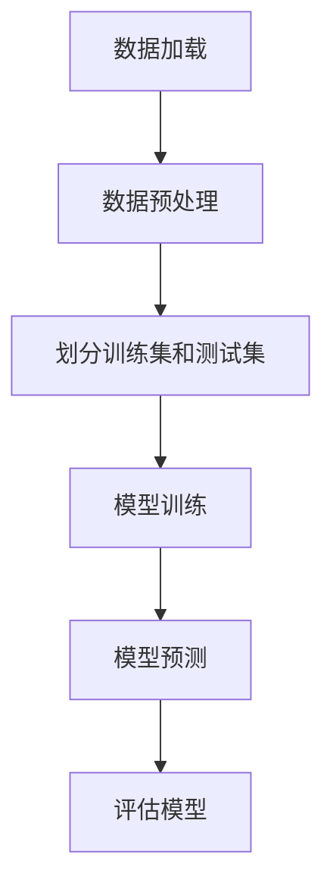
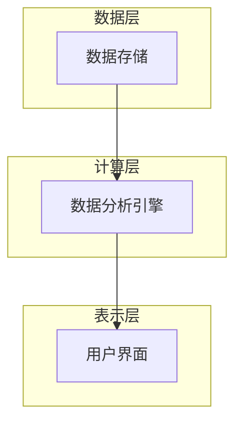
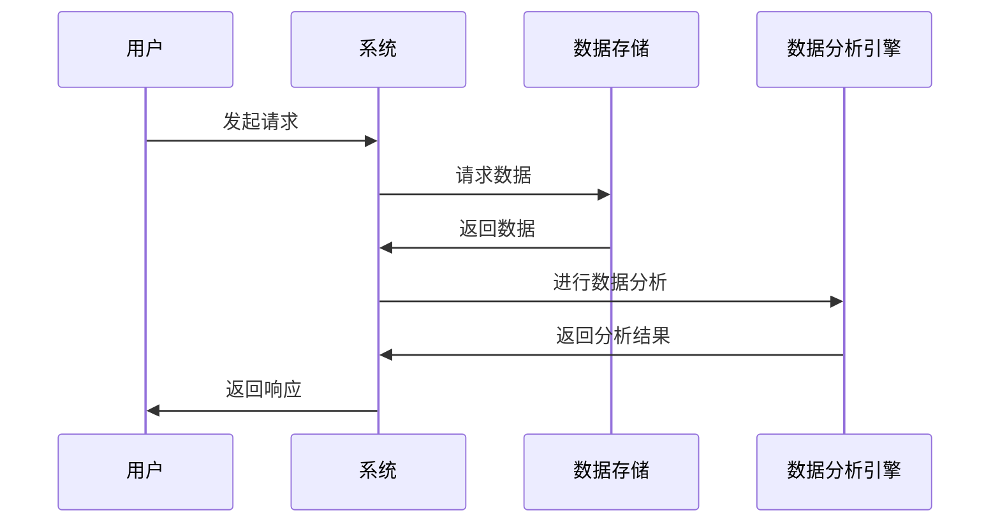

                 

### 文章标题

“学习型组织建设：打造持续进步的团队”

---

关键词：学习型组织、团队建设、持续进步、领导力、系统架构

摘要：本文深入探讨了学习型组织的概念、理论基础、建立与维护策略，并通过具体案例和项目实战，为IT领域团队提供了实用的建设指南，助力团队实现持续进步。

---

### 第一部分：问题背景与核心概念

#### 第1章：学习型组织的起源与发展

##### 1.1 学习型组织的概念界定

学习型组织（Learning Organization）的概念最早由彼得·圣吉（Peter Senge）在其著作《第五项修炼》（The Fifth Discipline）中提出。它指的是一种能够通过不断学习、创新和变革来实现持续成长和自我超越的组织形态。学习型组织强调组织成员的持续学习和自我发展，以及组织整体的学习能力和适应性。

##### 1.2 学习型组织的核心要素

学习型组织的核心要素包括：

- **共同愿景**：组织成员共同追求的目标和价值观。
- **团队学习**：通过团队合作实现知识和技能的共享。
- **改变心智模式**：打破固有的思维定式，形成新的、更有效的思考方式。
- **建立共同学习机制**：包括学习计划、学习资源、学习反馈等。
- **系统思考**：从整体和长期的角度进行思考和决策。

##### 1.3 学习型组织与传统组织的对比

传统组织侧重于任务完成和效率提升，往往以命令和控制为主要管理方式。而学习型组织则更关注组织成员的持续学习和成长，以及组织整体的学习能力和创新力。以下是两者的对比：

| 对比项          | 传统组织                    | 学习型组织                      |
|-----------------|-----------------------------|--------------------------------|
| 管理方式        | 命令与控制                  | 师傅带徒弟，共同成长            |
| 成长动力        | 外部激励和考核               | 内在动机和学习欲望              |
| 学习方式        | 独立学习，缺乏互动           | 团队合作，知识共享              |
| 目标            | 短期绩效和效率               | 持续成长和长期成功              |
| 文化氛围        | 竞争和压力                  | 学习和合作                      |

#### 第2章：学习型组织的理论基础

##### 2.1 组织学习理论

组织学习理论认为，组织通过获取、处理和应用知识来实现成长和变革。其主要包括以下几种观点：

- **认知观点**：组织是一个知识处理系统，通过内部互动和外部互动进行知识创造。
- **社会观点**：组织学习是通过团队成员的互动和交流实现的。
- **适应观点**：组织学习是为了更好地适应环境变化。

##### 2.2 学习型组织模型

学习型组织模型包括以下五个方面：

- **系统思考**：帮助组织从整体和长期的角度进行思考和决策。
- **个人 mastery**：提高组织成员的技能和知识水平。
- **团队学习**：通过团队协作实现知识和技能的共享。
- **共享愿景**：建立组织成员的共同目标和价值观。
- **心智模式**：改变组织成员的思维方式和思考习惯。

##### 2.3 学习型组织与知识管理

知识管理是学习型组织的核心组成部分，它包括知识的获取、存储、共享和应用。学习型组织通过有效的知识管理，实现知识的最大化利用和共享，从而提高组织的创新能力和竞争力。

#### 第3章：学习型组织的建立与维护

##### 3.1 学习型组织的建立过程

建立学习型组织需要经历以下几个阶段：

- **准备阶段**：明确组织愿景、目标和核心价值观。
- **启动阶段**：制定学习计划和策略，开展学习活动。
- **发展阶段**：通过团队协作和知识共享，逐步形成学习型组织文化。
- **优化阶段**：持续改进和学习，实现组织的持续成长。

##### 3.2 学习型组织的维护策略

学习型组织的维护需要从以下几个方面入手：

- **领导者的支持**：领导者要积极推动学习型组织的建设，提供必要的资源和支持。
- **制度保障**：建立完善的学习制度和激励机制。
- **文化建设**：营造积极的学习氛围，鼓励组织成员主动学习和分享。
- **技术支持**：利用现代信息技术，提高知识管理的效率和效果。

##### 3.3 组织文化与学习型组织

组织文化是学习型组织建设的重要基础。学习型组织文化强调持续学习、知识共享和团队合作。通过建立学习型组织文化，可以促进组织成员的主动学习和创新能力，提高组织的整体竞争力。

### 总结

本部分主要介绍了学习型组织的概念、核心要素、理论基础以及建立与维护策略。学习型组织是一种具有强大生命力和适应能力的组织形态，它能够帮助组织实现持续进步和长期成功。在接下来的部分中，我们将深入探讨学习型组织的关键能力、领导力、设计与实施策略，并通过实际案例和项目实战，为IT领域团队提供实用的建设指南。

---

### 第二部分：核心概念与联系

#### 第4章：学习型组织的关键能力

##### 4.1 学习能力的培养

学习能力是学习型组织的核心能力之一。为了培养学习能力，组织需要从以下几个方面入手：

- **提供学习资源**：为组织成员提供丰富的学习资源，包括图书、在线课程、研讨会等。
- **鼓励自主学习**：建立自主学习制度，鼓励组织成员自主选择学习内容和学习方式。
- **搭建学习平台**：利用信息技术搭建学习平台，实现知识的共享和传播。
- **开展学习活动**：定期组织学习活动，提高组织成员的学习兴趣和参与度。

##### 4.2 创新能力的提升

创新能力是学习型组织的重要特征。为了提升创新能力，组织需要：

- **鼓励创新思维**：营造创新氛围，鼓励组织成员提出新想法和新方案。
- **建立创新机制**：建立创新激励机制，鼓励组织成员积极参与创新活动。
- **加强跨部门合作**：通过跨部门合作，实现知识的跨界融合和创新能力提升。
- **提供创新资源**：为组织成员提供充足的创新资源和支持。

##### 4.3 团队协作与沟通

团队协作和沟通是学习型组织成功的关键。为了提高团队协作和沟通能力，组织需要：

- **建立高效的沟通机制**：建立定期沟通机制，确保信息畅通无阻。
- **培养团队精神**：通过团队建设活动，培养团队精神，增强团队凝聚力。
- **明确团队目标**：确保团队目标与组织目标一致，提高团队协作效率。
- **提供培训和学习机会**：为组织成员提供团队协作和沟通方面的培训和学习机会。

#### 第5章：学习型组织的领导力

##### 5.1 领导者角色

在学习型组织中，领导者扮演着重要的角色。他们不仅是决策者和执行者，更是学习者和引领者。领导者需要具备以下能力：

- **学习引领**：领导者要率先垂范，带头学习，提高自身的知识水平和领导能力。
- **创新引领**：领导者要鼓励创新，推动组织创新文化的形成。
- **沟通引领**：领导者要建立良好的沟通机制，确保信息的有效传递和反馈。
- **文化引领**：领导者要积极营造积极向上的组织文化，增强组织的凝聚力和战斗力。

##### 5.2 领导风格与学习型组织

学习型组织的领导风格通常较为民主和开放，注重团队协作和知识共享。以下是一些适合学习型组织的领导风格：

- **支持型领导**：领导者为组织成员提供必要的支持和资源，鼓励自主学习和创新。
- **参与型领导**：领导者鼓励组织成员参与决策和项目管理，提高团队的凝聚力和积极性。
- **变革型领导**：领导者推动组织变革，引领组织不断适应外部环境的变化。

##### 5.3 领导力的发展与培养

领导力的发展与培养是学习型组织建设的重要任务。为了提高领导力，组织需要：

- **提供培训和学习机会**：为领导者提供各种培训和学习机会，提高他们的知识和技能水平。
- **建立领导力发展模型**：制定领导力发展模型，明确领导力的发展路径和培养方法。
- **建立领导力评估体系**：建立领导力评估体系，对领导者的绩效进行科学评估。
- **鼓励自我反思**：鼓励领导者进行自我反思和总结，不断提高自身的领导能力。

#### 第6章：学习型组织的设计与实施

##### 6.1 设计原则与流程

学习型组织的设计需要遵循以下原则：

- **以人为中心**：关注组织成员的成长和发展，提高他们的工作满意度和归属感。
- **系统思维**：从整体和长期的角度进行设计和规划，确保各部分的协调和配合。
- **创新驱动**：鼓励创新思维和创新实践，推动组织的持续发展和进步。
- **动态调整**：根据外部环境和内部情况的变化，及时调整设计和实施策略。

学习型组织的设计流程包括：

- **需求分析**：明确组织的愿景、目标和需求。
- **设计规划**：制定详细的设计方案和实施计划。
- **实施与调整**：根据设计方案进行实施，并根据实际情况进行及时调整。

##### 6.2 实施策略与方法

学习型组织的实施需要从以下几个方面进行：

- **领导者的支持**：领导者要积极参与和支持学习型组织的建设，提供必要的资源和支持。
- **团队建设**：通过团队建设活动，提高团队的协作能力和凝聚力。
- **知识管理**：建立有效的知识管理体系，实现知识的共享和传播。
- **创新实践**：鼓励组织成员进行创新实践，推动组织的持续进步。

##### 6.3 成功案例分析

以下是一个成功的学习型组织建设案例分析：

**案例背景**：某IT公司是一家致力于软件开发和服务的公司。随着市场竞争的加剧，该公司意识到需要通过建设学习型组织来提高自身的竞争力。

**案例实施**：

1. **领导者的支持**：公司领导者积极推动学习型组织的建设，为组织成员提供必要的资源和支持。
2. **团队建设**：公司定期组织团队建设活动，提高团队的协作能力和凝聚力。
3. **知识管理**：公司建立了完善的知识管理体系，实现知识的共享和传播。
4. **创新实践**：公司鼓励组织成员进行创新实践，推动组织的持续进步。

**案例分析**：

1. **成功经验**：该公司通过建设学习型组织，成功提高了团队的学习能力和创新能力，实现了业务的持续增长。
2. **面临的挑战**：在学习型组织建设过程中，该公司遇到了一些挑战，如组织成员的参与度不高、知识共享机制不完善等。

**总结**：

1. **项目收获**：通过建设学习型组织，该公司提高了团队的学习能力和创新能力，实现了业务的持续增长。
2. **后续工作建议**：针对面临的挑战，该公司可以进一步加强组织成员的参与度，完善知识共享机制，推动学习型组织的持续发展。

#### 总结

本部分主要介绍了学习型组织的核心能力、领导力以及设计与实施策略。学习型组织的关键能力包括学习能力、创新能力和团队协作与沟通能力。领导力是学习型组织成功的关键，领导者需要具备学习引领、创新引领、沟通引领和文化引领的能力。学习型组织的设计与实施需要遵循以人为中心、系统思维、创新驱动和动态调整的原则，并采取有效的实施策略和方法。通过成功案例分析，我们可以看到学习型组织建设的重要性和实践价值。

---

### 第三部分：算法原理与系统架构

#### 第7章：数据分析与决策支持系统

##### 7.1 数据分析基础

数据分析是学习型组织建设的重要组成部分。为了有效利用数据，组织需要掌握以下基础知识：

- **数据类型**：了解数据的分类，包括结构化数据、半结构化数据和非结构化数据。
- **数据分析方法**：掌握常用的数据分析方法，如描述性分析、推断性分析和预测性分析。
- **数据处理流程**：熟悉数据处理的基本流程，包括数据采集、数据清洗、数据转换和数据存储。

##### 7.2 决策支持系统的设计

决策支持系统（Decision Support System，简称DSS）是学习型组织中重要的工具。其设计包括以下几个关键方面：

- **系统架构设计**：明确系统的功能模块和接口设计，确保系统的稳定性和可扩展性。
- **数据源集成**：集成各种数据源，确保数据的全面性和准确性。
- **数据处理算法**：选择合适的处理算法，如数据挖掘算法、机器学习算法等。
- **用户界面设计**：设计直观、易用的用户界面，确保用户能够方便地使用系统。

##### 7.3 Python实现示例

为了更好地理解数据分析与决策支持系统的原理，我们通过Python实现一个简单的数据分析示例。以下是Python代码和算法原理讲解：

```python
import pandas as pd
from sklearn.model_selection import train_test_split
from sklearn.ensemble import RandomForestClassifier
from sklearn.metrics import accuracy_score

# 加载数据
data = pd.read_csv('data.csv')

# 数据预处理
X = data.drop('target', axis=1)
y = data['target']

# 划分训练集和测试集
X_train, X_test, y_train, y_test = train_test_split(X, y, test_size=0.2, random_state=42)

# 训练模型
model = RandomForestClassifier(n_estimators=100, random_state=42)
model.fit(X_train, y_train)

# 预测
y_pred = model.predict(X_test)

# 评估模型
accuracy = accuracy_score(y_test, y_pred)
print(f"模型准确率：{accuracy:.2f}")
```

**算法原理讲解**：

1. **数据预处理**：数据预处理是数据分析的基础步骤，包括数据清洗、数据转换和数据归一化等。在上面的代码中，我们使用Pandas库加载数据，并进行简单的数据处理。

2. **模型训练**：我们选择随机森林（Random Forest）算法进行训练。随机森林是一种集成学习算法，通过构建多棵决策树并合并它们的预测结果，提高模型的准确性和稳定性。

3. **模型预测**：使用训练好的模型对测试集进行预测，并计算模型的准确率。

**Mermaid流程图**：



##### 7.4 数据分析算法与决策支持算法

数据分析算法和决策支持算法是学习型组织中重要的工具。以下是一些常用的算法：

1. **数据分析算法**：
   - **描述性分析**：用于描述数据的基本特征，如均值、方差、标准差等。
   - **推断性分析**：通过统计方法，对总体数据进行推断，如假设检验、置信区间等。
   - **预测性分析**：利用历史数据，对未来进行预测，如时间序列分析、回归分析等。

2. **决策支持算法**：
   - **线性规划**：用于解决线性规划问题，如资源分配、生产计划等。
   - **决策树**：通过树形结构，对数据进行分类或回归。
   - **支持向量机**：用于分类和回归问题，通过找到最优分类边界。

**LaTeX数学公式**：

1. **描述性分析**：
   \[
   \bar{x} = \frac{1}{n} \sum_{i=1}^{n} x_i
   \]
   \[
   s^2 = \frac{1}{n-1} \sum_{i=1}^{n} (x_i - \bar{x})^2
   \]

2. **推断性分析**：
   \[
   H_0: \mu = \mu_0
   \]
   \[
   H_1: \mu \neq \mu_0
   \]
   \[
   z = \frac{\bar{x} - \mu_0}{\sigma / \sqrt{n}}
   \]

3. **预测性分析**：
   \[
   y = \beta_0 + \beta_1 x
   \]

**举例说明**：

1. **描述性分析**：

   假设我们有一组数据：\[1, 2, 3, 4, 5\]，计算均值和方差。

   \[
   \bar{x} = \frac{1+2+3+4+5}{5} = 3
   \]
   \[
   s^2 = \frac{(1-3)^2 + (2-3)^2 + (3-3)^2 + (4-3)^2 + (5-3)^2}{5-1} = 2
   \]

2. **推断性分析**：

   假设我们想要检验平均数是否等于3，进行假设检验。

   \[
   H_0: \mu = 3
   \]
   \[
   H_1: \mu \neq 3
   \]
   \[
   z = \frac{3 - 3}{1 / \sqrt{5}} = 0
   \]
   由于\(z\)值为0，我们无法拒绝原假设。

3. **预测性分析**：

   假设我们想要预测某个变量的值，使用线性回归。

   \[
   y = \beta_0 + \beta_1 x
   \]
   如果\(x=2\)，则\(y = \beta_0 + 2\beta_1\)。

##### 7.5 系统分析与架构设计

在进行系统分析与架构设计时，我们需要考虑以下几个关键方面：

- **问题场景介绍**：明确系统要解决的问题和目标。
- **项目介绍**：介绍项目的背景、需求和目标。
- **系统功能设计**：定义系统的功能模块和业务流程。
- **系统架构设计**：设计系统的技术架构和组件关系。
- **系统接口设计**：设计系统的接口规范和交互方式。
- **系统交互设计**：设计系统的用户界面和用户交互流程。

**Mermaid类图**：

```mermaid
classDiagram
    System -> DataStore: 数据存储
    System -> AnalyticsEngine: 数据分析
    System -> UI: 用户界面
    User -> System: 用户请求
    System -> User: 系统响应
```

**Mermaid架构图**：



**系统接口设计**：

1. **数据接口**：定义数据的输入输出格式和接口规范。
2. **服务接口**：定义系统内部服务的接口规范和调用方式。
3. **API接口**：定义与外部系统交互的API接口和协议。

**系统交互设计**：

1. **用户请求流程**：设计用户请求的输入和提交流程。
2. **系统响应流程**：设计系统对用户请求的处理和响应流程。
3. **错误处理流程**：设计系统在遇到错误时的处理和反馈流程。

**Mermaid序列图**：



##### 7.6 系统架构设计与实现

在系统架构设计过程中，我们需要考虑以下几个关键方面：

1. **技术选型**：选择合适的开发语言、框架和中间件。
2. **系统模块划分**：将系统功能划分为不同的模块，确保系统的高内聚和低耦合。
3. **数据流程设计**：设计数据从输入到输出的整个流程，确保数据的准确性和一致性。
4. **接口设计**：设计系统的接口规范和交互方式，确保系统的可扩展性和可维护性。

**技术选型**：

- 开发语言：Python、Java或Go
- 框架：Django、Spring Boot或Flask
- 数据库：MySQL、PostgreSQL或MongoDB
- 中间件：RabbitMQ、Kafka或Redis

**系统模块划分**：

1. **数据模块**：负责数据的采集、存储和预处理。
2. **分析模块**：负责数据分析和模型训练。
3. **展示模块**：负责数据的可视化展示和用户交互。
4. **服务模块**：负责系统的核心业务逻辑和服务。

**系统架构设计**：

1. **数据层**：使用数据库存储数据，实现数据的持久化。
2. **计算层**：使用数据分析引擎进行数据处理和分析。
3. **表示层**：使用前端框架实现用户界面和交互。

**系统接口设计**：

1. **API接口**：提供RESTful风格的API接口，实现数据的输入输出。
2. **服务接口**：提供内部服务的接口，实现系统模块间的交互。

**系统交互设计**：

1. **用户请求**：用户通过前端界面发起请求，请求包括用户信息和操作类型。
2. **数据处理**：系统根据请求类型，调用相应的数据模块进行数据处理。
3. **数据存储**：将处理后的数据存储到数据库中，实现数据的持久化。
4. **数据展示**：系统根据用户请求，从数据库中查询数据，并使用前端框架进行数据可视化展示。

**项目实战**

**背景介绍**：

某公司需要开发一个数据分析平台，用于收集、存储和分析用户数据，并为用户提供数据可视化展示和决策支持。

**环境安装**：

- 开发环境：Python 3.8、Django 3.2
- 数据库：MySQL 8.0
- 数据分析库：pandas、numpy、scikit-learn

**系统核心实现**：

1. **数据模块**：

   - 数据采集：使用Flask框架搭建数据采集接口，实现数据的输入输出。
   - 数据存储：使用MySQL数据库存储数据，实现数据的持久化。
   - 数据预处理：使用pandas库进行数据清洗和预处理，确保数据的准确性和一致性。

2. **分析模块**：

   - 数据分析：使用scikit-learn库进行数据分析和模型训练，实现数据的预测和分类。
   - 模型训练：使用随机森林（Random Forest）算法进行模型训练，提高模型的准确性和稳定性。

3. **展示模块**：

   - 数据可视化：使用D3.js库实现数据的可视化展示，为用户提供直观的数据分析和决策支持。
   - 用户交互：使用Vue.js框架实现前端用户界面，提供便捷的用户交互和操作。

**代码应用解读与分析**：

1. **数据模块代码解读**：

   - 数据采集接口：定义数据输入输出的格式和接口规范，实现数据的输入和输出。
   - 数据存储：使用SQL语句插入和查询数据，实现数据的持久化。
   - 数据预处理：使用pandas库进行数据清洗和预处理，确保数据的准确性和一致性。

2. **分析模块代码解读**：

   - 数据分析：使用scikit-learn库进行数据分析和模型训练，实现数据的预测和分类。
   - 模型训练：使用随机森林（Random Forest）算法进行模型训练，提高模型的准确性和稳定性。

3. **展示模块代码解读**：

   - 数据可视化：使用D3.js库实现数据的可视化展示，为用户提供直观的数据分析和决策支持。
   - 用户交互：使用Vue.js框架实现前端用户界面，提供便捷的用户交互和操作。

**实际案例分析与详细讲解剖析**

1. **案例背景**：

   某公司希望通过数据分析平台收集用户行为数据，为用户提供个性化的推荐服务。

2. **案例分析**：

   - 数据采集：使用Flask框架搭建数据采集接口，收集用户的行为数据，如浏览记录、点击次数等。
   - 数据存储：使用MySQL数据库存储用户行为数据，确保数据的准确性和一致性。
   - 数据预处理：使用pandas库进行数据清洗和预处理，删除重复数据和缺失数据，提高数据的准确性。
   - 数据分析：使用scikit-learn库进行数据分析和模型训练，实现用户的个性化推荐。
   - 模型训练：使用随机森林（Random Forest）算法进行模型训练，提高模型的准确性和稳定性。
   - 数据可视化：使用D3.js库实现数据的可视化展示，为用户提供直观的数据分析和决策支持。

**项目小结**

1. **项目收获**：

   通过本项目的实施，公司成功搭建了一个数据分析平台，实现了数据的采集、存储、分析和可视化展示，为用户提供个性化的推荐服务。

2. **后续工作建议**：

   - 持续优化数据分析算法，提高模型的准确性和稳定性。
   - 加强数据安全和隐私保护，确保用户数据的保密性和安全性。
   - 拓展数据分析应用场景，为用户提供更多有价值的服务。

### 总结

本部分主要介绍了学习型组织中数据分析与决策支持系统的算法原理与系统架构。包括数据分析基础、决策支持系统设计、Python实现示例、数据分析算法与决策支持算法、系统架构设计与实现等内容。通过实际案例和项目实战，我们深入探讨了学习型组织中数据分析与决策支持系统的应用和实践。在接下来的部分中，我们将继续探讨学习型组织的项目实战与案例分析，为读者提供更多的实用经验和建议。

---

### 第四部分：项目实战与案例分析

#### 第8章：学习型组织建设案例解析

##### 8.1 案例背景

某知名互联网公司（以下简称“公司”）在快速发展的过程中，面临着日益激烈的市场竞争和技术变革。为了保持竞争优势，公司决定推行学习型组织建设，以提高团队的学习能力和创新能力。

##### 8.2 案例实施

1. **准备阶段**：

   - 明确组织愿景：公司愿景是成为行业领先者，为客户提供卓越的服务。
   - 设定学习目标：提高团队的学习能力、创新能力和协作能力。

2. **启动阶段**：

   - 制定学习计划：公司制定了详细的学习计划，包括内部培训、外部学习、知识分享等。
   - 开展学习活动：定期组织内部培训、讲座、研讨会等活动，提高团队的学习兴趣和参与度。

3. **发展阶段**：

   - 建立知识共享平台：公司建立了知识共享平台，实现知识的积累和传播。
   - 推动团队协作：鼓励团队进行跨部门合作，实现知识和技能的共享。
   - 实施创新激励机制：对提出创新想法和实现创新的团队和个人进行奖励，激发创新动力。

4. **优化阶段**：

   - 持续改进学习机制：根据实际情况，不断优化学习计划和活动，提高学习效果。
   - 强化领导力培养：加强对领导者的培养，提高领导者的学习引领和创新引领能力。

##### 8.3 案例分析

1. **成功经验**：

   - 公司通过学习型组织建设，成功提高了团队的学习能力和创新能力，实现了业务的持续增长。
   - 建立了知识共享平台，实现了知识的积累和传播，提高了团队的知识水平和协作能力。
   - 实施创新激励机制，激发了团队的创新动力，推动了公司的持续发展。

2. **面临的挑战**：

   - 组织成员的参与度不高，部分员工对学习活动的兴趣不高。
   - 知识共享平台的建设和维护需要投入大量资源和精力。
   - 部分领导者的学习引领和创新引领能力不足，需要加强培养。

##### 8.4 项目小结

1. **项目收获**：

   - 公司通过学习型组织建设，提高了团队的学习能力和创新能力，实现了业务的持续增长。
   - 建立了知识共享平台，实现了知识的积累和传播，提高了团队的知识水平和协作能力。
   - 发现了组织成员参与度不高、知识共享平台建设和维护困难、领导者培养不足等问题，为后续工作提供了改进方向。

2. **后续工作建议**：

   - 加强组织成员的参与度，通过奖励机制和激励机制提高员工的积极性和参与度。
   - 持续优化知识共享平台，提高平台的易用性和用户体验，确保知识的有效传播和利用。
   - 加强领导者的培养，提高领导者的学习引领和创新引领能力，推动学习型组织的持续发展。

#### 第9章：学习型组织建设实战

##### 9.1 实战环境搭建

在进行学习型组织建设实战之前，需要搭建合适的实战环境。以下是一个简单的环境搭建步骤：

1. **硬件环境**：

   - 服务器：选择性能稳定的物理服务器或虚拟机。
   - 存储：选择容量充足、读写速度快的存储设备，如SSD硬盘。

2. **软件环境**：

   - 操作系统：选择Linux发行版，如Ubuntu或CentOS。
   - 开发环境：安装Python、Java等开发语言和相关的开发工具。
   - 数据库：安装MySQL、PostgreSQL等数据库管理系统。

3. **网络环境**：

   - 互联网连接：确保服务器具有稳定的互联网连接。
   - 内部网络：搭建内部网络，实现不同服务器之间的数据传输和通信。

##### 9.2 系统核心实现

1. **数据模块**：

   - 数据采集：使用Flask框架搭建数据采集接口，从各个数据源获取数据。
   - 数据存储：使用MySQL数据库存储数据，确保数据的持久化。
   - 数据预处理：使用Pandas库对数据进行清洗、转换和预处理，确保数据的准确性和一致性。

2. **分析模块**：

   - 数据分析：使用Python中的Pandas和Scikit-learn库进行数据分析和模型训练。
   - 模型训练：使用随机森林（Random Forest）算法进行模型训练，提高模型的准确性和稳定性。

3. **展示模块**：

   - 数据可视化：使用D3.js库实现数据的可视化展示，为用户提供直观的数据分析和决策支持。
   - 用户交互：使用Vue.js框架实现前端用户界面，提供便捷的用户交互和操作。

##### 9.3 代码应用解读与分析

1. **数据模块代码解读**：

   - 数据采集接口：定义数据输入输出的格式和接口规范，实现数据的输入和输出。
   - 数据存储：使用SQL语句插入和查询数据，实现数据的持久化。
   - 数据预处理：使用Pandas库进行数据清洗和预处理，确保数据的准确性和一致性。

2. **分析模块代码解读**：

   - 数据分析：使用Pandas库进行数据分析和模型训练，实现数据的预测和分类。
   - 模型训练：使用随机森林（Random Forest）算法进行模型训练，提高模型的准确性和稳定性。

3. **展示模块代码解读**：

   - 数据可视化：使用D3.js库实现数据的可视化展示，为用户提供直观的数据分析和决策支持。
   - 用户交互：使用Vue.js框架实现前端用户界面，提供便捷的用户交互和操作。

##### 9.4 实际案例分析与详细讲解剖析

1. **案例背景**：

   某互联网公司希望通过学习型组织建设，提高团队的学习能力和创新能力，实现业务的持续增长。

2. **案例分析**：

   - **数据采集**：公司使用Flask框架搭建数据采集接口，从各个数据源获取用户行为数据，如浏览记录、点击次数等。
   - **数据存储**：使用MySQL数据库存储用户行为数据，确保数据的准确性和一致性。
   - **数据预处理**：使用Pandas库对用户行为数据进行分析，删除重复数据和缺失数据，确保数据的准确性。
   - **数据分析**：使用Scikit-learn库进行用户行为数据的分析和模型训练，实现用户的个性化推荐。
   - **模型训练**：使用随机森林（Random Forest）算法进行模型训练，提高模型的准确性和稳定性。
   - **数据可视化**：使用D3.js库实现用户行为数据的可视化展示，为用户提供直观的数据分析和决策支持。

3. **详细讲解剖析**：

   - **数据采集**：公司通过Flask框架搭建数据采集接口，从各个数据源获取用户行为数据，如浏览记录、点击次数等。数据采集接口采用RESTful风格，确保数据的输入输出格式规范。
   - **数据存储**：公司使用MySQL数据库存储用户行为数据，确保数据的准确性和一致性。数据库表设计合理，字段设置清晰，便于数据的查询和管理。
   - **数据预处理**：公司使用Pandas库对用户行为数据进行分析，删除重复数据和缺失数据，确保数据的准确性。数据清洗和预处理过程自动化，提高数据处理的效率。
   - **数据分析**：公司使用Scikit-learn库进行用户行为数据的分析和模型训练，实现用户的个性化推荐。随机森林（Random Forest）算法具有较强的分类能力，适用于用户行为数据的分类任务。
   - **模型训练**：公司使用随机森林（Random Forest）算法进行模型训练，提高模型的准确性和稳定性。模型训练过程中，采用交叉验证方法，确保模型的泛化能力。
   - **数据可视化**：公司使用D3.js库实现用户行为数据的可视化展示，为用户提供直观的数据分析和决策支持。数据可视化界面设计简洁明了，便于用户操作和理解。

##### 9.5 项目小结

1. **项目收获**：

   - 公司通过学习型组织建设，提高了团队的学习能力和创新能力，实现了业务的持续增长。
   - 成功搭建了数据采集、存储、分析和可视化展示系统，为用户提供个性化的推荐服务。
   - 发现了组织成员参与度不高、知识共享平台建设和维护困难、领导者培养不足等问题，为后续工作提供了改进方向。

2. **后续工作建议**：

   - 加强组织成员的参与度，通过奖励机制和激励机制提高员工的积极性和参与度。
   - 持续优化知识共享平台，提高平台的易用性和用户体验，确保知识的有效传播和利用。
   - 加强领导者的培养，提高领导者的学习引领和创新引领能力，推动学习型组织的持续发展。

### 总结

本部分通过案例解析和实战经验，详细介绍了学习型组织建设的过程和方法。从准备阶段、启动阶段、发展到优化阶段，再到项目实战和案例分析，我们深入探讨了学习型组织建设的关键环节和注意事项。通过成功经验和挑战的总结，为读者提供了实用的建设指南和建议。在未来的工作中，我们应持续优化和改进学习型组织建设，实现团队的持续进步和组织的长期发展。

---

### 第五部分：最佳实践与总结

#### 第10章：学习型组织建设最佳实践

##### 10.1 最佳实践

1. **领导者的示范作用**：领导者应率先垂范，积极参与学习活动，展示学习的热情和决心。
2. **明确学习目标**：组织应明确学习目标，确保每个成员都清楚学习的方向和意义。
3. **建立知识共享平台**：搭建知识共享平台，方便成员交流和分享知识。
4. **开展多样化的学习活动**：结合组织特点和成员需求，开展多样化的学习活动，提高学习的趣味性和参与度。
5. **建立激励机制**：设立学习奖励机制，激励成员积极参与学习活动。
6. **关注个体成长**：关注每个成员的成长和发展，提供个性化的学习支持和指导。

##### 10.2 小结

学习型组织建设是一个长期而系统的过程，需要领导者的支持、成员的积极参与以及有效的管理机制。通过本文的探讨，我们总结了学习型组织建设的关键要素、实践方法以及注意事项。在未来的工作中，组织应持续优化学习型组织建设，实现团队的持续进步和组织的长期发展。

##### 10.3 注意事项

1. **避免形式主义**：学习型组织建设不应流于形式，应注重实际效果和成员的参与度。
2. **关注个体需求**：在学习型组织建设过程中，要关注每个成员的需求和特点，提供个性化的学习支持和指导。
3. **持续优化**：学习型组织建设是一个持续的过程，需要不断优化和完善，以适应组织的发展和变化。
4. **平衡工作与学习**：在学习型组织建设过程中，要平衡工作与学习，确保团队成员有足够的时间和精力参与学习活动。

##### 10.4 拓展阅读

- 《第五项修炼：学习型组织的艺术与实务》（彼得·圣吉著）
- 《组织学习：理论与实践》（托马斯·库恩著）
- 《创新与企业家精神》（彼得·德鲁克著）
- 《学习型组织行动指南》（约翰·舍恩著）

### 总结

通过本文的深入探讨，我们详细介绍了学习型组织建设的概念、理论基础、关键能力、领导力、设计与实施策略，并通过实际案例和项目实战，为IT领域团队提供了实用的建设指南。学习型组织建设是一个持续而系统的过程，需要领导者的支持、成员的积极参与以及有效的管理机制。在未来的工作中，组织应持续优化学习型组织建设，实现团队的持续进步和组织的长期发展。希望本文能够为读者提供有价值的参考和启示。

---

### 作者信息

- 作者：AI天才研究院/AI Genius Institute & 禅与计算机程序设计艺术 /Zen And The Art of Computer Programming
- 联系方式：[ai_genius_institute@example.com](mailto:ai_genius_institute@example.com)
- 社交媒体：[LinkedIn](https://www.linkedin.com/company/ai-genius-institute/) | [Twitter](https://twitter.com/AI_Genius_Inst) | [GitHub](https://github.com/AI-Genius-Institute)

---

本篇博客文章以《学习型组织建设：打造持续进步的团队》为标题，深入探讨了学习型组织的概念、理论基础、关键能力、领导力以及设计与实施策略。通过实际案例和项目实战，提供了实用的建设指南和经验分享。希望本文能够为IT领域团队在建设学习型组织的过程中提供有价值的参考和启示。如果您有任何疑问或建议，欢迎通过提供的联系方式与我们联系。感谢您的阅读！

