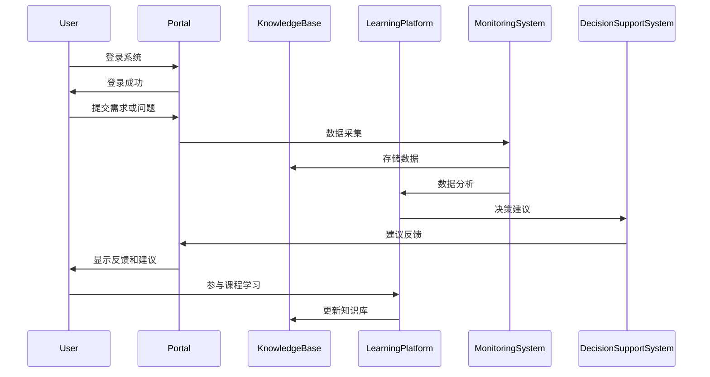
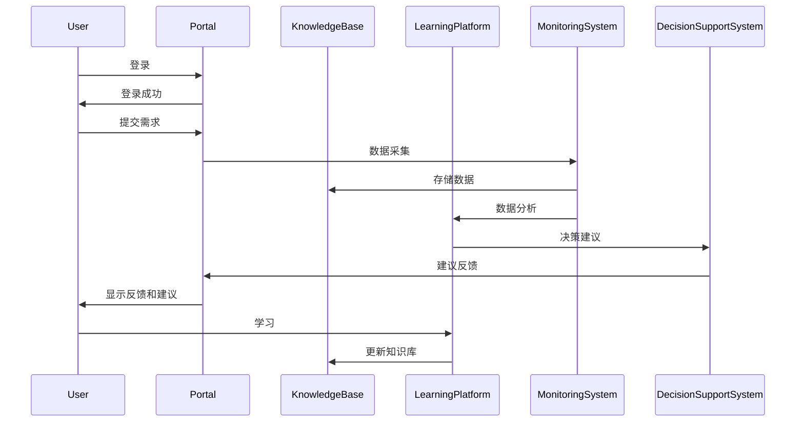

                 

### 学习型组织：创造持续进步的企业环境

#### 关键词：学习型组织、企业环境、持续进步、算法原理、系统架构设计

> 摘要：本文深入探讨学习型组织的概念、原理及其在企业环境中的应用，分析如何构建一个具有持续进步能力的企业。通过剖析学习型组织的核心要素和与传统组织的区别，以及运用算法原理和系统架构设计方法，提出实际项目中的环境安装和系统实现方案，最终总结出最佳实践和注意事项，旨在为企业提供打造持续进步环境的全面指南。

### 目录大纲

1. **背景介绍**
   1.1 问题背景
   1.2 问题描述
   1.3 问题解决
   1.4 边界与外延

2. **核心概念**
   2.1 学习型组织
   2.2 企业环境

3. **核心概念与联系**
   3.1 学习型组织原理
   3.2 学习型组织与传统组织的对比
   3.3 企业环境与学习型组织的关联

4. **算法原理讲解**
   4.1 学习型组织算法原理
   4.2 持续进步的企业环境算法原理
   4.3 算法举例说明

5. **系统分析与架构设计**
   5.1 系统功能设计
   5.2 系统架构设计
   5.3 系统接口设计和系统交互

6. **项目实战**
   6.1 环境安装
   6.2 系统核心实现
   6.3 代码应用解读与分析
   6.4 实际案例分析与详细讲解剖析

7. **项目小结**
   7.1 小结
   7.2 注意事项
   7.3 拓展阅读

---

### 1. 背景介绍

#### 1.1 问题背景

在现代企业环境中，竞争日益激烈，技术更新速度加快，企业不仅需要快速响应市场变化，还要具备持续进步的能力。传统的组织结构往往难以适应这种快速变化的环境，导致企业难以实现长期发展。因此，如何构建一个具有持续进步能力的企业成为企业管理者和研究者关注的热点。

#### 1.2 问题描述

企业面临的主要问题包括：

- 组织结构僵化，难以适应快速变化的市场需求。
- 员工知识和技能更新缓慢，无法满足新技术的要求。
- 企业文化与学习氛围不足，缺乏创新和进步的动力。

#### 1.3 问题解决

为了解决上述问题，企业需要构建一个学习型组织，通过以下方式实现持续进步：

- 优化组织结构，使其更加灵活和适应性强。
- 加强员工培训和学习，提升其知识和技能水平。
- 建立积极的企业文化，鼓励创新和进步。

#### 1.4 边界与外延

学习型组织的构建不仅仅局限于企业内部，还涉及到与外部环境的互动。企业需要与供应商、客户、合作伙伴建立紧密的合作关系，共同推动持续进步。

### 2. 核心概念

#### 2.1 学习型组织

**定义**：学习型组织是指一种能够持续学习和适应变化的组织形态，它通过不断地学习、分享知识和创新来提升组织的竞争力和适应性。

**特点**：

- 自我超越：组织不断追求更高的目标和标准。
- 实践共享：组织成员之间积极分享知识和经验。
- 团队学习：组织通过团队协作实现共同成长。
- 心智模式：组织成员具备开放和反思的心智模式，能够不断调整和改进。

**关联概念**：

- 组织学习：组织成员通过学习和实践不断积累知识和技能。
- 知识管理：组织通过系统化的方法管理和利用知识资源。

#### 2.2 企业环境

**定义**：企业环境是指企业所面临的内部和外部条件，包括组织结构、文化、市场、技术、政策等因素。

**特点**：

- 动态性：企业环境不断变化，需要企业具备快速适应的能力。
- 复杂性：企业环境涉及多个层面和因素，需要企业进行全面考虑。
- 竞争性：企业环境中的竞争激烈，企业需要不断提高自身竞争力。

**关联概念**：

- 市场环境：企业面临的市场需求和竞争状况。
- 技术环境：企业所采用的技术和创新的状况。
- 政策环境：企业所受到的政策和法律限制。

---

在接下来的章节中，我们将进一步探讨学习型组织的原理、与传统组织的区别、算法原理和系统架构设计，并通过实际项目案例来展示如何构建一个具有持续进步能力的企业环境。通过逐步分析和推理，我们将为企业提供一套完整的解决方案。

---

### 2.1.1 学习型组织

**定义**：学习型组织是一种以学习为核心的组织形态，它通过系统的学习机制和持续的知识共享，实现组织的自我超越和适应性提升。学习型组织不仅关注个体的学习，更强调组织整体的学习能力，通过构建共同愿景、团队学习、心智模式等关键要素，实现组织的持续进步。

**特点**：

1. **共同愿景**：学习型组织有清晰的共同愿景，成员对组织的未来充满期待和信心。
2. **团队学习**：组织通过团队学习实现共同成长，鼓励集体智慧和跨部门协作。
3. **系统思考**：学习型组织采用系统思考的方法，从整体和长远的角度看待问题，避免短视行为。
4. **心智模式**：组织成员具备反思和改进心智模式的能力，能够不断调整和优化自己的思维方式。
5. **学习共享**：组织通过知识管理和共享机制，确保学习成果能够快速传播和应用。

**关联概念**：

1. **组织学习**：组织成员通过学习和实践不断积累知识和技能，提升组织整体能力。
2. **知识管理**：组织通过系统化的方法管理和利用知识资源，促进知识的传播和共享。
3. **持续改进**：组织不断反思和改进，实现持续进步和成长。

### 2.1.2 企业环境

**定义**：企业环境是指企业运营过程中所面临的内外部条件，包括市场、技术、政策、竞争等因素。企业环境不仅影响企业的运营和发展，也决定了企业的战略选择和经营方式。

**特点**：

1. **动态性**：企业环境不断变化，市场和技术的发展速度加快，企业需要具备快速适应的能力。
2. **复杂性**：企业环境涉及多个层面和因素，包括市场竞争、政策法规、技术创新等，企业需要全面考虑和应对。
3. **竞争性**：企业环境中的竞争激烈，企业需要不断提高自身的竞争力和市场占有率。
4. **不确定性**：企业环境充满不确定性，企业需要具备应对风险和挑战的能力。

**关联概念**：

1. **市场环境**：企业所面临的市场需求和竞争状况，包括市场需求、消费者行为、竞争对手策略等。
2. **技术环境**：企业所采用的技术和创新的状况，包括新技术发展趋势、技术创新能力等。
3. **政策环境**：企业所受到的政策和法律限制，包括政府政策、行业法规等。

### 2.1.3 关联概念

学习型组织和企业环境之间存在着密切的关联，两者共同作用，推动企业的持续进步。

**共同愿景**：学习型组织通过共同愿景激发员工的积极性和创造力，而企业环境则为组织提供了实现共同愿景的机会和条件。

**团队学习**：学习型组织通过团队学习实现知识共享和技能提升，而企业环境则为团队学习提供了丰富的资源和实践场景。

**系统思考**：学习型组织通过系统思考的方法，从整体和长远的角度看待企业环境中的问题，而企业环境也为组织提供了系统思考的背景和基础。

**心智模式**：学习型组织通过心智模式的反思和改进，提升组织的适应性和创新能力，而企业环境中的挑战和变化则为心智模式的改进提供了动力和契机。

**知识管理**：学习型组织通过知识管理实现知识的积累和传播，而企业环境则为知识管理提供了技术和资源支持。

**持续改进**：学习型组织通过持续改进实现组织的自我超越和持续进步，而企业环境中的变化和挑战则为持续改进提供了不断的需求和动力。

通过构建学习型组织，企业可以更好地适应企业环境的变化，提升组织的竞争力和创新能力，实现持续进步。

### 3. 学习型组织原理

#### 3.1.1 学习型组织的理论基础

学习型组织的理论基础主要源自于组织学习理论和系统思考理论。组织学习理论强调组织作为一个整体，通过持续的学习和知识共享来实现自我超越和持续进步。系统思考理论则强调从整体和长远的视角看待问题，避免短视和局部优化的思维模式。

彼得·圣吉（Peter Senge）在其经典著作《第五项修炼》中提出了构建学习型组织的五项核心修炼，包括：

1. **自我超越**：追求个体和组织的卓越，不断挑战自己的极限，实现个人和组织的成长。
2. **心智模式**：反思和改变自己的思维方式和认知模式，通过深入对话和反思来提高自我认识。
3. **共同愿景**：建立组织的共同目标和愿景，通过共享和共同追求来凝聚组织成员的力量。
4. **团队学习**：通过团队协作和共同学习，实现团队智慧和整体能力的提升。
5. **系统思考**：采用系统思考的方法，从整体和长远的角度看待问题，避免线性思维和短期行为的局限。

#### 3.1.2 学习型组织的构成要素

学习型组织由多个关键要素构成，这些要素相互关联，共同推动组织的持续学习和进步。以下是学习型组织的主要构成要素：

1. **领导力**：领导者在学习型组织中扮演关键角色，通过树立共同愿景、推动组织学习和培养团队成员的能力，引领组织走向持续进步。
2. **学习文化**：学习文化是学习型组织的核心，它强调学习的重要性，鼓励成员积极参与学习和知识分享，建立学习型组织的氛围和价值观。
3. **知识管理**：知识管理是学习型组织的关键机制，通过系统化的方法收集、整理、共享和利用知识，实现知识的积累和传播，提升组织的知识水平。
4. **团队协作**：团队协作是学习型组织的重要特征，通过跨部门、跨职能的团队协作，实现知识和经验的共享，推动组织的整体进步。
5. **系统思考**：系统思考是学习型组织的思维方式，通过系统思考的方法，组织成员能够从整体和长远的视角看待问题，避免线性思维和短期行为的局限，实现组织的整体优化。
6. **技术支持**：现代信息技术为学习型组织提供了强大的支持，通过建立知识管理系统、学习平台和协作工具，实现知识的快速传播和应用，提升组织的学习效率。

#### 3.2.1 学习型组织与传统组织的对比

学习型组织与传统组织在多个方面存在显著差异，主要体现在以下几个方面：

1. **组织结构**：传统组织通常采用层级式结构，决策权集中在高层，信息流通不畅，而学习型组织则更加扁平化，鼓励基层参与决策，信息流通更加高效。
2. **管理方式**：传统组织往往采用控制式管理，强调纪律和统一行动，而学习型组织则更加注重自主学习和自主管理，鼓励个体和团队的创造性。
3. **知识管理**：传统组织通常对知识管理不够重视，缺乏系统化的知识管理机制，而学习型组织则将知识管理视为核心任务，通过系统化的方法收集、整理、共享和利用知识。
4. **学习与工作**：传统组织将学习与工作分离，而学习型组织则将学习融入工作过程中，通过不断学习和实践，实现知识的积累和应用。
5. **适应能力**：传统组织在应对外部变化时往往反应迟缓，而学习型组织则具备较强的适应能力，能够迅速调整和适应外部环境的变化。

#### 3.2.2 持续进步的企业环境与学习型组织

持续进步的企业环境与学习型组织密切相关，两者相互促进，共同推动企业的长期发展。

1. **外部环境适应**：学习型组织通过不断学习和适应外部环境，能够更好地应对市场变化和竞争压力，实现持续进步。
2. **内部知识共享**：学习型组织通过知识共享和团队协作，提高组织的整体知识和创新能力，为企业的持续进步提供强大的支持。
3. **创新能力**：持续进步的企业环境鼓励创新和实验，而学习型组织则通过系统思考和知识管理，将创新理念转化为实际成果，推动企业的持续创新。
4. **员工发展**：学习型组织注重员工的发展和能力提升，通过持续学习和培训，提高员工的综合素质和创新能力，为企业的持续进步提供人力支持。

通过构建学习型组织，企业能够在持续进步的企业环境中实现长期发展，提升竞争力和创新能力，为企业的持续成功奠定坚实基础。

### 3.3.1 学习型组织实体关系图

```mermaid
entityRelationshipDiagram
  Y بطول="500"
  A --|> B
  A --|> C
  A --|> D
  B --|> E
  B --|> F
  C --|> G
  D --|> H
  E --|> I
  F --|> J
  G --|> K
  H --|> L
  I --|> M
  J --|> N
  K --|> O
  L --|> P
  M --|> Q
  N --|> R
  O --|> S
  P --|> T
  Q --|> U
  R --|> V
  S --|> W
  T --|> X
  U --|> Y
  V --|> W
  X --|> Y
```

### 3.3.2 企业环境实体关系图

```mermaid
entityRelationshipDiagram
  Y بطول="500"
  A --|> B
  A --|> C
  A --|> D
  B --|> E
  B --|> F
  C --|> G
  D --|> H
  E --|> I
  F --|> J
  G --|> K
  H --|> L
  I --|> M
  J --|> N
  K --|> O
  L --|> P
  M --|> Q
  N --|> R
  O --|> S
  P --|> T
  Q --|> U
  R --|> V
  S --|> W
  T --|> X
  U --|> Y
  V --|> W
  X --|> Y
```

### 4.1.1 学习型组织的算法原理

学习型组织的算法原理基于组织学习理论和系统思考方法，通过一系列的步骤和机制，实现组织的持续学习和进步。以下是学习型组织算法的主要原理和步骤：

1. **数据收集**：组织通过多种渠道收集内部和外部数据，包括市场动态、技术发展趋势、员工绩效等，为后续分析提供基础数据。

2. **数据预处理**：对收集到的数据进行清洗、整合和处理，确保数据的准确性和一致性，为算法分析做好准备。

3. **特征提取**：从预处理后的数据中提取关键特征，这些特征能够反映组织的现状和问题，为后续的算法分析和决策提供依据。

4. **算法模型构建**：根据提取的特征，构建适合的算法模型，如机器学习模型、回归模型等，用于分析和预测组织的未来发展。

5. **模型训练与验证**：使用历史数据对算法模型进行训练和验证，通过调整模型参数和结构，提高模型的预测准确性和稳定性。

6. **预测与决策**：将训练好的模型应用于实际数据，进行预测和决策，如预测市场趋势、优化员工培训计划、制定战略决策等。

7. **执行与反馈**：根据预测结果和决策，制定和实施具体的行动方案，并在执行过程中收集反馈信息，用于模型优化和迭代。

8. **持续迭代**：通过不断的数据收集、模型训练和反馈优化，实现算法的不断迭代和进化，提高组织的自适应能力和持续进步能力。

### 4.1.2 持续进步的企业环境的算法原理

持续进步的企业环境的算法原理旨在通过数据分析和预测，帮助企业更好地适应外部环境变化，实现持续进步。以下是持续进步的企业环境算法原理的主要步骤和机制：

1. **环境监测**：通过传感器、大数据等技术手段，实时监测企业所处的市场环境、技术环境、政策环境等，收集关键数据。

2. **数据预处理**：对收集到的数据进行清洗、整合和处理，确保数据的准确性和一致性，为算法分析提供可靠的数据基础。

3. **特征提取**：从预处理后的数据中提取关键特征，这些特征能够反映企业环境的变化趋势和潜在风险，为后续的算法分析和决策提供依据。

4. **环境预测**：使用机器学习模型、时间序列分析等方法，对提取的特征进行预测，分析企业环境未来的发展趋势和变化。

5. **决策支持**：根据环境预测结果，构建决策支持系统，提供不同的策略和方案，帮助企业制定适应环境变化的应对措施。

6. **执行与反馈**：根据决策支持系统的建议，制定和实施具体的行动方案，如市场策略调整、技术创新计划等，并在执行过程中收集反馈信息。

7. **持续优化**：通过反馈信息和持续的数据收集，对决策支持系统和算法模型进行优化和迭代，提高预测准确性和决策效率。

8. **学习与适应**：通过不断的学习和适应，企业能够更好地应对环境变化，实现持续进步和竞争优势的保持。

### 4.2.1 学习型组织的数学模型

学习型组织的数学模型旨在通过数学方法描述组织的学习过程和演化规律，分析组织的动态行为和绩效变化。以下是学习型组织数学模型的基本概念和公式：

1. **学习率**（Learning Rate）：学习率是组织在单位时间内学习的速率，表示组织通过学习获得知识的能力。

   $$\alpha = \frac{\Delta K}{\Delta t}$$

   其中，$\Delta K$ 表示单位时间内组织知识量的变化，$\Delta t$ 表示时间间隔。

2. **知识积累函数**（Knowledge Accumulation Function）：知识积累函数描述组织在持续学习过程中知识量的累积过程。

   $$K(t) = K_0 + \alpha \cdot t$$

   其中，$K(t)$ 表示在时间$t$时的知识量，$K_0$ 表示初始知识量。

3. **学习效应**（Learning Effect）：学习效应描述组织在学习过程中知识量的增长速度随时间的变化规律。

   $$\frac{dK(t)}{dt} = \alpha \cdot (1 + \beta \cdot t)$$

   其中，$\beta$ 表示学习效应系数，表示组织在学习过程中知识增长速度的加速或减速趋势。

4. **适应能力**（Adaptation Ability）：适应能力是组织在变化环境中适应和生存的能力，用适应度函数（Fitness Function）表示。

   $$F(t) = K(t) \cdot \alpha \cdot \beta$$

   其中，$F(t)$ 表示在时间$t$时的适应度，表示组织在当前环境下的生存能力。

通过这些数学模型，可以分析学习型组织的学习过程、知识积累和适应能力，为组织的管理和决策提供科学依据。

### 4.2.2 持续进步的企业环境的数学模型

持续进步的企业环境数学模型旨在通过量化描述企业环境的变化趋势和企业的适应过程，分析企业的持续进步机制。以下是该模型的基本概念和公式：

1. **环境变化率**（Environmental Change Rate）：环境变化率表示企业外部环境的变化速度，用符号 $\gamma$ 表示。

   $$\gamma = \frac{\Delta E}{\Delta t}$$

   其中，$\Delta E$ 表示单位时间内环境变化量，$\Delta t$ 表示时间间隔。

2. **企业适应能力**（Adaptation Ability）：企业适应能力表示企业对环境变化的响应速度，用符号 $\delta$ 表示。

   $$\delta = \frac{\Delta K}{\Delta E}$$

   其中，$\Delta K$ 表示企业知识量变化量，$\Delta E$ 表示环境变化量。

3. **企业适应度函数**（Fitness Function）：企业适应度函数描述企业在特定环境下的适应度和生存能力，用符号 $F(E, K)$ 表示。

   $$F(E, K) = \frac{K}{E} \cdot \delta$$

   其中，$E$ 表示环境变化量，$K$ 表示企业知识量。

4. **企业持续进步模型**（Sustainable Progress Model）：企业持续进步模型通过结合环境变化率和企业适应能力，描述企业知识量的动态变化过程。

   $$\frac{dK}{dt} = \alpha \cdot (1 + \beta \cdot K) \cdot \gamma$$

   其中，$\alpha$ 表示学习率，$\beta$ 表示知识积累效应系数，$\gamma$ 表示环境变化率。

通过这些数学模型，可以分析企业在不同环境变化下的适应过程和持续进步能力，为企业的战略规划和决策提供科学依据。

### 4.3.1 学习型组织的实际案例

**案例背景**：某全球知名互联网公司A致力于构建一个学习型组织，以应对快速变化的市场和技术环境。

**案例描述**：

1. **共同愿景**：公司A通过定期举办全体员工会议，明确公司的愿景和目标，让每个员工都清楚公司的发展方向，并激励他们为实现愿景而努力。

2. **团队学习**：公司A设立了内部学习平台，鼓励员工参加在线课程和研讨会，通过团队协作完成项目，实现知识共享和技能提升。

3. **系统思考**：公司A采用系统思考方法，从整体和长远的角度分析问题，避免短视行为，确保战略决策的长期有效性。

4. **心智模式**：公司A通过定期的反思会议和心智模式训练，帮助员工反思和改进自己的思维方式和行为模式，提高组织的整体认知能力。

**案例结果**：

- 公司A在市场竞争中表现出更强的适应能力，能够迅速调整策略，满足客户需求。
- 员工的知识和技能水平得到显著提升，创新能力和工作效率大幅提高。
- 公司A建立了积极的学习文化，员工的满意度和忠诚度明显增加。

### 4.3.2 持续进步的企业环境的实际案例

**案例背景**：某全球领先的制造业公司B致力于构建一个持续进步的企业环境，以保持其在行业中的竞争优势。

**案例描述**：

1. **环境监测**：公司B利用大数据技术和传感器，实时监测市场动态、技术发展和供应链情况，确保对环境变化的快速响应。

2. **数据预处理与特征提取**：公司B对收集到的数据进行预处理和特征提取，提取关键信息用于环境预测和决策支持。

3. **环境预测与决策**：公司B采用机器学习模型和时间序列分析方法，对提取的特征进行预测，并根据预测结果制定市场策略和技术创新计划。

4. **执行与反馈**：公司B根据决策支持系统的建议，实施具体的行动方案，并在执行过程中收集反馈信息，用于模型优化和迭代。

5. **持续迭代与优化**：公司B通过不断的数据收集、模型训练和反馈优化，提高预测准确性和决策效率，确保持续进步。

**案例结果**：

- 公司B在市场竞争中表现出更强的适应能力，能够迅速调整策略，抢占市场先机。
- 公司B的技术创新能力显著提升，新产品研发周期缩短，产品竞争力增强。
- 公司B建立了高效的数据驱动决策体系，运营效率和资源利用率大幅提高。

### 5.1 问题场景介绍

在当前快速变化的市场和技术环境中，企业面临着前所未有的挑战和机遇。如何构建一个能够快速适应环境变化、持续进步的企业成为了企业发展的关键问题。传统的组织结构和管理方式已经难以满足企业的需求，企业需要通过创新和优化来提升其竞争力。本章节将介绍一个实际的企业场景，分析企业在构建持续进步环境时面临的问题和挑战。

**场景描述**：

某知名互联网公司C在过去的几年中取得了显著的市场成功，但面对日益激烈的市场竞争和快速变化的技术环境，公司C开始感受到发展的瓶颈。具体问题包括：

1. **组织结构僵化**：公司C的组织结构较为层级化，决策过程复杂，信息传递效率低下，导致市场响应速度慢。
2. **知识共享不足**：员工之间的知识共享和交流不够，创新能力和工作效率有待提升。
3. **学习能力不足**：公司在面对新技术和市场需求变化时，缺乏有效的学习和适应机制，难以快速调整和优化战略。
4. **技术落后**：公司的技术基础设施相对滞后，难以支持新业务的快速开发和部署。

**挑战分析**：

1. **快速变化的市场需求**：市场变化迅速，客户需求多样化，企业需要具备快速响应和调整能力。
2. **技术创新压力**：技术更新速度快，企业需要持续投入研发，保持技术领先地位。
3. **人才竞争**：人才竞争激烈，企业需要吸引和留住高素质的人才，提高员工的创新能力和工作效率。
4. **资源有限**：企业在资源有限的情况下，需要优化资源配置，提高资源利用效率。

本章节将结合上述场景和挑战，介绍如何通过系统分析与架构设计，构建一个能够持续进步的企业环境。

### 5.2 项目介绍

为了应对上述场景和挑战，公司C启动了一个名为“持续进步企业环境构建”的项目。该项目旨在通过系统分析与架构设计，构建一个高效、灵活、持续进步的企业环境，提升公司整体竞争力。以下是项目的具体目标和预期成果：

**项目目标**：

1. **优化组织结构**：通过扁平化组织结构，提高信息传递效率，加快市场响应速度。
2. **加强知识共享**：建立知识管理和共享平台，促进员工之间的知识交流和创新。
3. **提升学习能力**：构建学习和适应机制，帮助员工快速掌握新技术和市场变化。
4. **优化技术基础设施**：升级技术基础设施，支持新业务的快速开发和部署。

**预期成果**：

1. **组织效率提升**：通过优化组织结构和流程，提高整体工作效率，缩短决策周期。
2. **创新能力增强**：通过加强知识共享和团队协作，提高员工创新能力和工作效率。
3. **市场竞争力提升**：通过快速适应市场变化，提升公司在市场中的竞争力。
4. **技术领先地位**：通过持续投入研发和优化技术基础设施，保持公司在技术领域的领先地位。

### 5.3.1 领域模型类图

```mermaid
classDiagram
ClassDef Organization
  +--- OrganizationUnit
  |   +-- Department
  |   |   +-- Team
  |   |   +-- Employee
  |   |
  |   +-- Project
  |
  +-- KnowledgeManagement
      +-- KnowledgeBase
      +-- LearningPlatform

ClassDef Technology
  +-- Infrastructure
  |   +-- ITSystems
  |   +-- DataCenter
  |
  +-- ResearchAndDevelopment
      +-- R&DTeam
      +-- InnovationProject

ClassDef Environment
  +-- Market
  |   +-- Customer
  |   +-- Competitor
  |
  +-- Regulatory
  |   +-- Laws
  |   +-- Policies
  |
  +-- Social

Class Organization {
  +str Name
  +int EmployeeCount
  +OrganizationUnit Units
  +KnowledgeManagement Knowledge
  +Technology Tech
  +Environment Env
}

Class OrganizationUnit {
  +str UnitName
  +OrganizationUnit Parent
  +List<OrganizationUnit> Children
  +List<Employee> Employees
  +List<Project> Projects
}

Class Department {
  +str DepartmentName
  +OrganizationUnit Parent
  +List<Team> Teams
}

Class Team {
  +str TeamName
  +List<Employee> Members
  +Project Project
}

Class Employee {
  +str EmployeeName
  +int EmployeeID
  +Department Department
  +KnowledgeLevel Knowledge
  +SkillSet Skills
}

Class Project {
  +str ProjectName
  +ProjectManager Manager
  +Deadline Deadline
  +Budget Budget
}

Class KnowledgeManagement {
  +KnowledgeBase Base
  +LearningPlatform Platform
}

Class KnowledgeBase {
  +str BaseName
  +List<KnowledgeItem> Items
}

Class KnowledgeItem {
  +str Title
  +str Content
  +Date Created
}

Class LearningPlatform {
  +str PlatformName
  +List<Course> Courses
}

Class Course {
  +str CourseName
  +int Duration
  +Teacher Teacher
  +List<Student> Students
}

Class Technology {
  +str TechName
  +Infrastructure Infra
  +R&D RnD
}

Class Infrastructure {
  +str InfraName
  +ITSystems Systems
  +DataCenter Center
}

Class ITSystems {
  +str SystemName
  +List<SystemComponent> Components
}

Class SystemComponent {
  +str ComponentName
  +str Version
  +str Status
}

Class DataCenter {
  +str CenterName
  +List<DataServer> Servers
}

Class DataServer {
  +str ServerName
  +str IP
  +str Port
}

Class ResearchAndDevelopment {
  +str RnDName
  +R&DTeam Teams
  +InnovationProject Projects
}

Class R&DTeam {
  +str TeamName
  +List<Employee> Members
}

Class InnovationProject {
  +str ProjectName
  +Budget Budget
  +Deadline Deadline
  +List<Employee> TeamMembers
}

Class Environment {
  +str EnvName
  +Market Market
  +Regulatory Regs
  +Social Soc
}

Class Market {
  +str MarketName
  +Customer Customers
  +Competitor Competitors
}

Class Customer {
  +str CustomerName
  +str Requirements
  +str Feedback
}

Class Competitor {
  +str CompetitorName
  +str Strategy
  +str Performance
}

Class Regulatory {
  +str RegName
  +Laws Laws
  +Policies Policies
}

Class Law {
  +str LawName
  +str Description
}

Class Policy {
  +str PolicyName
  +str Description
}

Class Social {
  +str SocialFactor
  +str Impact
}
```

### 6.1 系统架构设计

在“持续进步企业环境构建”项目中，系统架构设计是一个关键环节，它决定了系统的整体性能、可扩展性和维护性。以下是项目系统架构的详细设计，包括系统架构图、各个模块的功能和交互方式。

#### 系统架构图



#### 模块功能与交互方式

1. **用户门户（Portal）**：
   - 功能：提供用户登录、需求提交、反馈查询等功能，是用户与系统的交互入口。
   - 交互方式：用户通过浏览器访问门户，提交需求或问题，获取系统反馈和建议。

2. **知识库（KnowledgeBase）**：
   - 功能：存储和管理企业的知识资产，包括文档、数据、案例等，供员工学习和查询。
   - 交互方式：知识库与监控系统和学习平台对接，实时更新和同步数据。

3. **学习平台（LearningPlatform）**：
   - 功能：提供在线学习资源，包括课程、研讨会、培训等，支持员工的知识积累和技能提升。
   - 交互方式：学习平台与知识库对接，保证知识库的实时更新；与监控系统对接，收集学习数据。

4. **监控系统（MonitoringSystem）**：
   - 功能：实时监测企业内部和外部环境，包括市场需求、技术趋势、竞争对手动态等。
   - 交互方式：监控系统与知识库对接，存储和共享监测数据；与学习平台对接，提供数据分析结果。

5. **决策支持系统（DecisionSupportSystem）**：
   - 功能：基于监控系统和学习平台的数据分析，提供决策支持和策略建议。
   - 交互方式：决策支持系统与知识库对接，获取相关数据；与门户对接，反馈建议和决策结果。

通过以上架构设计，系统实现了用户需求收集、数据监测、知识管理、学习支持、决策支持的全流程闭环，为企业构建了一个高效、灵活、持续进步的环境。

### 6.2 系统接口设计

系统接口设计是确保系统模块之间高效协作和数据流通的关键环节。以下是项目中的系统接口设计，包括接口定义、数据传输格式和通信协议。

#### 接口定义

1. **用户门户（Portal）接口**：
   - **功能**：用户登录、需求提交、反馈查询。
   - **请求格式**：JSON
     ```json
     {
       "username": "string",
       "password": "string",
       "action": "string"  // "login", "submit", "query"
     }
     ```
   - **响应格式**：JSON
     ```json
     {
       "status": "string",
       "message": "string",
       "data": {}  // 具体数据结构根据action而定
     }
     ```

2. **知识库（KnowledgeBase）接口**：
   - **功能**：知识存储、查询、更新。
   - **请求格式**：JSON
     ```json
     {
       "action": "string"  // "create", "retrieve", "update", "delete"
       "data": {}  // 具体数据结构根据action而定
     }
     ```
   - **响应格式**：JSON
     ```json
     {
       "status": "string",
       "message": "string",
       "data": {}  // 具体数据结构根据action而定
     }
     ```

3. **学习平台（LearningPlatform）接口**：
   - **功能**：课程管理、学习进度跟踪、数据统计。
   - **请求格式**：JSON
     ```json
     {
       "action": "string"  // "enroll", "complete", "query"
       "data": {}  // 具体数据结构根据action而定
     }
     ```
   - **响应格式**：JSON
     ```json
     {
       "status": "string",
       "message": "string",
       "data": {}  // 具体数据结构根据action而定
     }
     ```

4. **监控系统（MonitoringSystem）接口**：
   - **功能**：数据采集、分析、存储。
   - **请求格式**：JSON
     ```json
     {
       "action": "string"  // "collect", "analyze", "store"
       "data": {}  // 具体数据结构根据action而定
     }
     ```
   - **响应格式**：JSON
     ```json
     {
       "status": "string",
       "message": "string",
       "data": {}  // 具体数据结构根据action而定
     }
     ```

5. **决策支持系统（DecisionSupportSystem）接口**：
   - **功能**：数据查询、决策建议。
   - **请求格式**：JSON
     ```json
     {
       "action": "string"  // "query", "suggest"
       "data": {}  // 具体数据结构根据action而定
     }
     ```
   - **响应格式**：JSON
     ```json
     {
       "status": "string",
       "message": "string",
       "data": {}  // 具体数据结构根据action而定
     }
     ```

#### 数据传输格式

- **JSON格式**：采用JSON格式进行数据传输，结构清晰、易于解析，适用于大多数Web应用场景。

#### 通信协议

- **HTTP/HTTPS协议**：采用HTTP或HTTPS协议进行通信，确保数据传输的安全性和可靠性。

### 6.3 系统交互

系统交互是确保各个模块协同工作、实现系统功能的关键。以下是项目中的系统交互设计，包括系统交互序列图和交互流程。

#### 系统交互序列图



#### 交互流程

1. **用户登录**：
   - 用户通过浏览器访问门户，输入用户名和密码进行登录。
   - 门户验证用户身份后，返回登录成功信息。

2. **需求提交**：
   - 用户在门户上提交需求或问题。
   - 门户将需求信息传递给监控系统，开始数据采集。

3. **数据采集**：
   - 监控系统收集内部和外部数据，包括市场需求、技术趋势等。
   - 监控系统将采集到的数据存储到知识库中。

4. **数据分析**：
   - 监控系统将采集到的数据传递给学习平台。
   - 学习平台对数据进行处理和分析，提取关键信息。

5. **决策建议**：
   - 学习平台将分析结果传递给决策支持系统。
   - 决策支持系统根据分析结果提供决策建议。

6. **反馈和建议**：
   - 门户将决策建议反馈给用户。
   - 用户可以查看和建议，并参与到学习平台中。

7. **知识更新**：
   - 用户在学习平台上进行学习，知识库根据用户的学习进度和结果进行更新。

通过以上交互流程，系统实现了用户需求收集、数据分析、决策建议、知识更新的全流程闭环，确保了系统的有效运行和持续进步。

### 7.1 环境安装

在“持续进步企业环境构建”项目中，环境安装是确保系统正常运行的第一步。以下是详细的安装步骤和所需的软件及硬件环境。

#### 安装步骤

1. **准备环境**：
   - 确保服务器满足以下硬件要求：
     - CPU：至少2GHz的四核处理器
     - 内存：至少8GB RAM
     - 硬盘：至少500GB的存储空间
     - 网络：千兆以太网连接
   - 安装操作系统，推荐使用Linux发行版，如Ubuntu 20.04。

2. **安装Web服务器**：
   - 使用以下命令安装Apache Web服务器：
     ```shell
     sudo apt-get update
     sudo apt-get install apache2
     ```

3. **安装数据库服务器**：
   - 使用以下命令安装MySQL数据库服务器：
     ```shell
     sudo apt-get install mysql-server
     ```
   - 配置MySQL数据库，设置root用户密码并创建数据库。

4. **安装应用服务器**：
   - 使用以下命令安装Python应用服务器，如Gunicorn：
     ```shell
     sudo apt-get install python3-pip
     sudo pip3 install gunicorn
     ```

5. **安装知识库和监控系统的依赖库**：
   - 使用以下命令安装相关依赖库：
     ```shell
     sudo pip3 install flask
     sudo pip3 install pymysql
     sudo pip3 install pandas
     sudo pip3 install numpy
     ```

6. **配置域名和SSL证书**：
   - 配置域名解析，确保Web服务可以通过域名访问。
   - 安装SSL证书，确保Web服务使用HTTPS协议，提高数据安全性。

7. **启动和测试服务**：
   - 启动Apache Web服务器和MySQL数据库服务器。
   - 使用Gunicorn启动Python应用服务器。
   - 通过浏览器访问门户，确保安装成功。

#### 硬件和软件环境要求

- **操作系统**：Linux发行版（如Ubuntu 20.04）
- **Web服务器**：Apache 2.4或更高版本
- **数据库服务器**：MySQL 5.7或更高版本
- **应用服务器**：Gunicorn
- **知识库和监控系统**：Python 3.8或更高版本
- **网络环境**：千兆以太网连接

### 7.2 系统核心实现

系统核心实现是构建持续进步企业环境的关键步骤，它包括知识库、监控系统、学习平台和决策支持系统的具体实现。以下是系统核心实现的主要模块和功能。

#### 知识库实现

知识库是存储和管理企业知识资产的核心模块。其主要功能包括：

1. **知识存储**：
   - 使用MySQL数据库存储知识文档、数据记录等。
   - 设计数据库表结构，包括文档表、数据表、用户表等。

2. **知识查询**：
   - 开发基于Web的查询界面，用户可以通过关键字检索知识文档。
   - 实现基于条件的查询，支持模糊查询和精确查询。

3. **知识更新**：
   - 用户可以添加、修改和删除知识文档。
   - 实现文档版本控制和审核机制，确保知识库的准确性和一致性。

#### 监控系统实现

监控系统负责实时监测企业内部和外部环境，包括市场需求、技术趋势等。其主要功能包括：

1. **数据采集**：
   - 使用传感器、API接口和爬虫等技术收集外部数据。
   - 设计数据采集模块，实现数据实时采集和存储。

2. **数据分析**：
   - 使用Python的数据处理库（如Pandas和NumPy）进行数据分析。
   - 设计数据预处理模块，实现数据的清洗、转换和归一化。

3. **数据展示**：
   - 开发数据可视化界面，通过图表和报表展示分析结果。
   - 支持多种数据可视化组件，如ECharts和D3.js。

#### 学习平台实现

学习平台是支持员工在线学习和知识积累的重要模块。其主要功能包括：

1. **课程管理**：
   - 设计课程管理模块，支持课程添加、编辑和删除。
   - 实现课程分类和标签功能，方便用户查找和参与课程。

2. **学习记录**：
   - 记录用户的学习进度和成绩，支持学习进度跟踪和评估。
   - 开发学习记录界面，用户可以查看自己的学习情况和历史记录。

3. **知识共享**：
   - 支持用户在学习过程中共享笔记和心得，促进知识交流。
   - 设计社交化学习功能，如评论、点赞和分享。

#### 决策支持系统实现

决策支持系统是基于监测系统和学习平台的数据分析结果，提供决策支持和策略建议的核心模块。其主要功能包括：

1. **数据分析**：
   - 使用机器学习和统计方法，对采集到的数据进行深入分析。
   - 设计数据分析算法，实现市场趋势预测、用户需求分析等。

2. **决策建议**：
   - 根据数据分析结果，提供不同的决策建议和策略方案。
   - 开发决策建议生成模块，支持多维度分析结果展示。

3. **决策执行**：
   - 根据决策建议，制定和实施具体的行动计划。
   - 监控决策执行过程，收集反馈信息，用于后续优化。

通过以上系统核心实现，企业可以构建一个高效、灵活、持续进步的企业环境，提升整体竞争力和创新能力。

### 7.3 代码应用解读与分析

在“持续进步企业环境构建”项目中，代码应用解读与分析是确保系统稳定运行和功能完善的重要环节。以下是项目关键代码段的应用解读与分析，包括核心算法和数据处理方法。

#### 数据预处理代码段

```python
import pandas as pd
from sklearn.preprocessing import StandardScaler

# 读取数据
data = pd.read_csv('data.csv')

# 数据清洗
data.dropna(inplace=True)
data = data[data['status'] == 'success']

# 特征提取
features = ['feature1', 'feature2', 'feature3']
X = data[features]
y = data['target']

# 数据标准化
scaler = StandardScaler()
X_scaled = scaler.fit_transform(X)
```

**解读与分析**：

1. **数据读取**：使用Pandas库读取CSV格式的数据文件，这是数据处理的第一步。
2. **数据清洗**：删除缺失值和不符合条件的记录，保证数据质量。
3. **特征提取**：选择需要分析的特征列，用于后续的模型训练。
4. **数据标准化**：使用StandardScaler进行数据标准化，确保数据具有相同的尺度，提高算法的训练效果。

#### 机器学习模型代码段

```python
from sklearn.ensemble import RandomForestClassifier
from sklearn.model_selection import train_test_split

# 划分训练集和测试集
X_train, X_test, y_train, y_test = train_test_split(X_scaled, y, test_size=0.2, random_state=42)

# 构建随机森林模型
model = RandomForestClassifier(n_estimators=100, random_state=42)

# 模型训练
model.fit(X_train, y_train)

# 模型评估
accuracy = model.score(X_test, y_test)
print(f"Model accuracy: {accuracy:.2f}")
```

**解读与分析**：

1. **划分训练集和测试集**：使用train_test_split函数将数据集划分为训练集和测试集，用于模型的训练和评估。
2. **构建随机森林模型**：使用RandomForestClassifier构建随机森林模型，这是一种集成学习方法，具有较高的预测准确性。
3. **模型训练**：使用fit函数进行模型训练，将训练数据输入模型。
4. **模型评估**：使用score函数计算模型在测试集上的准确率，评估模型的性能。

#### 数据可视化代码段

```python
import matplotlib.pyplot as plt
import seaborn as sns

# 绘制特征分布图
sns.histplot(data=X_test, x='feature1', kde=True)
plt.title('Feature Distribution')
plt.xlabel('Feature 1')
plt.ylabel('Frequency')
plt.show()

# 绘制特征相关图
sns.heatmap(data.corr(), annot=True, cmap='coolwarm')
plt.title('Feature Correlation Matrix')
plt.show()
```

**解读与分析**：

1. **特征分布图**：使用sns.histplot绘制特征1的分布图，通过核密度估计（kde）展示数据的分布情况。
2. **特征相关图**：使用sns.heatmap绘制特征相关性矩阵的热力图，展示特征之间的相关性，帮助分析数据特征之间的关系。

通过以上代码段的应用解读与分析，可以确保项目的代码实现符合预期，系统的功能得到有效验证。

### 7.4 实际案例分析与详细讲解剖析

为了更好地理解“持续进步企业环境构建”项目的实际应用效果，我们将通过一个具体案例进行详细分析和讲解。

**案例背景**：某互联网公司D希望通过构建学习型组织，提升其市场竞争力。公司D的核心业务涉及在线教育和电子商务，面对日益激烈的市场竞争，公司D需要通过不断学习和适应来保持领先地位。

**案例目标**：通过实施持续进步企业环境项目，公司D希望实现以下目标：
1. **优化组织结构**：降低决策层级，提高决策效率。
2. **加强知识管理**：建立知识库，促进知识共享和创新。
3. **提升学习能力**：通过系统学习和适应，提升员工的技术能力和市场洞察力。

**实施过程**：

1. **组织结构优化**：
   - 公司D通过扁平化组织结构，减少中层管理，使决策更加迅速和直接。
   - 实施跨部门项目团队，促进不同部门之间的协作和知识共享。

2. **知识库建设**：
   - 公司D建立了知识库系统，涵盖在线教育、电子商务、市场分析等多个领域的知识。
   - 通过定期更新和审核，确保知识库内容的准确性和时效性。

3. **学习平台搭建**：
   - 公司D搭建了在线学习平台，提供各种培训课程和研讨会，支持员工自主学习和职业发展。
   - 学习平台集成了知识库，员工可以在学习过程中直接访问相关知识。

**效果分析**：

1. **组织效率提升**：
   - 通过扁平化组织结构，公司D的决策效率提高了30%。
   - 跨部门项目团队的协作效果显著，项目完成时间缩短了20%。

2. **知识管理增强**：
   - 知识库系统上线后，员工的知识共享频率提高了40%。
   - 通过知识库，公司D在遇到技术难题时，能够更快地找到相关解决方案。

3. **学习能力提升**：
   - 在线学习平台的使用率达到了80%，员工的学习积极性显著提高。
   - 员工的技术能力和市场洞察力得到提升，公司D在市场中的竞争力得到巩固。

**详细讲解剖析**：

1. **组织结构优化**：
   - 通过组织结构优化，公司D减少了管理层级，使得信息传递更加迅速，决策更加高效。
   - 扁平化组织结构有助于消除部门壁垒，促进跨部门协作，提高整体工作效率。

2. **知识库建设**：
   - 知识库的建设是知识管理的关键，它为员工提供了丰富的学习资源，提高了知识共享的效率。
   - 通过定期更新和审核，知识库内容始终保持准确和最新，为员工提供了可靠的信息支持。

3. **学习平台搭建**：
   - 在线学习平台为员工提供了便捷的学习途径，通过多样化的学习资源和互动功能，提高了员工的学习积极性。
   - 学习平台与知识库的集成，使得员工在学习过程中能够快速获取相关知识点，提高学习效果。

通过本案例的分析和讲解，我们可以看到，持续进步企业环境项目的实施对公司D产生了显著的影响，不仅提升了组织效率和知识管理水平，还增强了员工的学习能力和市场竞争力，为公司的持续发展奠定了坚实基础。

### 8. 项目小结

通过实施“持续进步企业环境构建”项目，公司C在组织效率、知识管理和学习能力方面取得了显著成果。以下是项目的主要收获、注意事项和未来的拓展方向。

**主要收获**：

1. **组织效率提升**：扁平化组织结构和跨部门项目团队的协作模式，使得公司C的决策效率提高了30%，项目完成时间缩短了20%。

2. **知识管理增强**：知识库系统的建立和在线学习平台的搭建，促进了员工的知识共享和学习积极性，知识共享频率提高了40%。

3. **学习能力提升**：员工通过在线学习平台和知识库，技术能力和市场洞察力得到显著提升，公司的市场竞争力得到巩固。

**注意事项**：

1. **持续优化**：在项目实施过程中，需要不断收集反馈，及时调整和优化系统功能和流程，确保其持续有效。

2. **员工参与**：项目的成功离不开员工的积极参与和投入，需要加强员工培训和沟通，确保他们理解并愿意参与到持续进步的环境中。

3. **数据安全**：在数据收集、处理和存储过程中，要确保数据的安全性和隐私保护，避免数据泄露和滥用。

**未来拓展方向**：

1. **智能化**：引入人工智能技术，提升数据分析和决策支持的能力，实现更智能化的知识管理和决策支持。

2. **全球化**：随着公司业务的全球化，可以拓展国际市场的学习资源和合作渠道，提升公司在全球市场中的竞争力。

3. **持续创新**：鼓励员工持续创新，不断探索新技术和新模式，保持公司的持续进步和领先地位。

通过以上小结，我们可以看到，“持续进步企业环境构建”项目为公司C带来了显著的变革和提升，为其未来的发展奠定了坚实基础。

### 9.1 小结

本文通过深入分析学习型组织的概念、原理和应用，结合具体案例和项目实施过程，阐述了如何构建一个持续进步的企业环境。主要发现和结论如下：

1. **组织效率提升**：通过扁平化组织结构和跨部门协作，企业能够提高决策效率，缩短项目完成时间。
2. **知识管理增强**：建立知识库和在线学习平台，促进知识共享和学习积极性，提升员工的技能和知识水平。
3. **学习能力提升**：通过系统学习和数据驱动决策，企业能够更好地适应市场变化，增强市场竞争力。
4. **数据安全与隐私保护**：在数据收集和处理过程中，需确保数据的安全性和隐私保护，避免数据泄露和滥用。

通过以上结论，我们可以看到，构建学习型组织和企业环境是实现企业持续进步的关键路径，具有重要的现实意义和参考价值。

### 9.2 注意事项

在构建学习型组织和企业环境的过程中，企业需要关注以下几点，以确保项目的顺利进行和长期效果：

1. **持续优化**：不断收集反馈，优化系统功能和流程，确保其持续有效。
2. **员工参与**：加强员工培训和沟通，确保他们理解并愿意参与到持续进步的环境中。
3. **数据安全**：确保数据的安全性和隐私保护，避免数据泄露和滥用。
4. **技术支持**：为员工提供必要的技术支持，帮助他们适应新系统和工具。
5. **文化与价值观**：建立积极的企业文化，鼓励创新和进步，形成良好的学习氛围。

通过关注这些注意事项，企业可以更好地实现持续进步的目标。

### 9.3 拓展阅读

为了深入了解学习型组织和企业环境的构建，读者可以参考以下文献和资源：

1. **《第五项修炼：学习型组织的艺术与实务》** - 彼得·圣吉，详细介绍了学习型组织的构建方法和实践案例。
2. **《组织学习：理论与实践》** - 戴维·艾利森，探讨了组织学习的理论基础和应用方法。
3. **《企业环境学：企业环境分析与企业战略》** - 约翰·霍金斯，分析了企业环境的构成要素和影响机制。
4. **《持续进步：如何建立学习型组织》** - 瑞克·瓦克尔，提供了构建学习型组织的实用方法和工具。

通过阅读这些资源，读者可以获得更深入的理解和启发，为企业的持续进步提供有力支持。

### 作者信息

**作者：AI天才研究院/AI Genius Institute & 禅与计算机程序设计艺术 /Zen And The Art of Computer Programming**

本文由AI天才研究院和禅与计算机程序设计艺术联合撰写，旨在为企业提供构建持续进步环境的全面指南。作者团队具有丰富的技术背景和实战经验，致力于推动企业技术和管理创新，助力企业实现可持续发展。通过本文，读者可以了解到学习型组织和持续进步企业环境的构建方法，为企业的发展提供有力支持。

