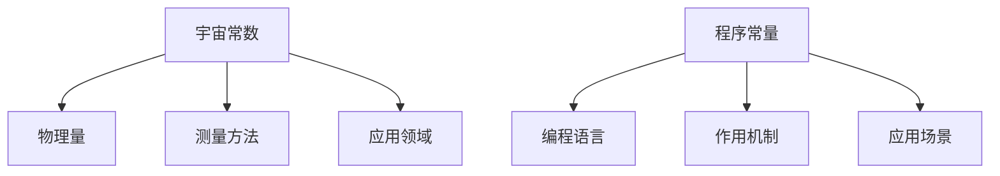

                 

### 引言与背景

在探讨宇宙与计算机科学的交汇点上，我们将深入分析两个核心概念——宇宙常数与程序常量。它们看似来自截然不同的领域，但都有着不可忽视的重要性和广泛的应用。宇宙常数是宇宙学中的核心概念，它描述了宇宙的某些基本属性，如暗能量、引力等。而程序常量则是计算机编程中的基石，它代表了程序中固定不变的值，这些值在整个程序执行过程中不会发生变化。

为什么我们需要对这两个概念进行比较研究呢？首先，从科学角度来讲，通过比较宇宙常数与程序常量，我们能够更好地理解自然界的规律和计算机程序的内在逻辑。其次，从技术角度出发，了解宇宙常数与程序常量的异同，有助于我们在编程过程中借鉴宇宙的智慧，设计出更加高效和可靠的算法。

本文将分为七个主要部分，首先介绍宇宙常数和程序常量的基本概念、特征及其重要性；接着探讨它们之间的联系与区别，并提出比较方法；然后通过实际应用案例展示它们的实际价值；之后分析影响宇宙常数和程序常量的因素，以及它们之间的相互作用；最后，预测宇宙常数和程序常量的未来发展趋势。

通过本文的逐步分析，我们希望读者能够对宇宙常数与程序常量有更深入的理解，认识到它们在不同领域中的重要性和相互影响。让我们开始这次跨越宇宙与计算机科学边界的探索之旅吧！

#### 第1章：引言

在探讨宇宙常数与程序常量的比较之前，我们需要对这两个概念进行清晰的定义和解释。宇宙常数，顾名思义，是描述宇宙基本属性的物理量，是宇宙演化过程中保持不变的基本参数。著名的宇宙常数之一是爱因斯坦的广义相对论中的宇宙学常数\( \Lambda \)，它代表了宇宙中暗能量的强度，暗能量是推动宇宙加速膨胀的力量。另一个重要的宇宙常数是哈勃常数\( H_0 \)，它描述了宇宙膨胀的速度。

程序常量则是在计算机编程中使用的，它是一个在程序执行过程中固定不变的值。程序常量可以用来定义各种参数，比如预定义的常量、系统参数、用户设置等。例如，在计算机图形学中，使用常量来设定屏幕分辨率、颜色深度等。

宇宙常数与程序常量的基本概念虽然不同，但它们都承载着不变性的本质。宇宙常数的不变性关乎整个宇宙的演化过程，而程序常量则在程序执行中确保了稳定性和一致性。

在接下来的部分中，我们将进一步探讨这两个概念的特征、研究现状和重要性。通过深入分析，我们希望能够揭示它们之间的内在联系和区别，为读者提供更加全面的理解。

#### 1.1 问题背景

宇宙常数与程序常量的研究背景可以追溯到它们各自领域的发展历程。宇宙常数的研究起源于20世纪初，随着爱因斯坦的广义相对论提出，宇宙常数成为理解宇宙结构演变的关键参数。在宇宙学中，宇宙常数\( \Lambda \)被用于描述暗能量，这是宇宙加速膨胀的神秘力量。而哈勃常数\( H_0 \)则用于描述宇宙膨胀的速度，它与宇宙年龄、密度等参数密切相关。这些宇宙常数的精确测量和研究，不仅对宇宙学有着深远影响，还推动了物理学领域的发展。

另一方面，程序常量的概念在计算机科学中有着悠久的历史。计算机编程语言的出现，使得程序员能够使用常量来定义程序中的固定值。随着编程技术的进步，常量被广泛应用于各种编程场景，例如系统参数配置、算法参数设定等。在软件工程中，合理地使用常量可以提高程序的稳定性和可维护性，减少错误发生的概率。

宇宙常数和程序常量的研究背景不仅限于各自领域的学术研究，它们的应用也日益广泛。宇宙常数的研究促进了我们对宇宙的理解，如暗能量和暗物质的性质、宇宙的演化过程等。而程序常量则在计算机科学的各个领域有着广泛的应用，从操作系统、数据库到复杂的算法，都离不开常量的支持。

通过探讨宇宙常数与程序常量的研究背景，我们可以更好地理解它们的重要性以及为什么需要将这两个看似不相关的概念进行比较研究。接下来，我们将进一步讨论它们的基本概念和特征。

#### 1.2 问题描述

在探讨宇宙常数与程序常量时，我们需要明确几个关键问题。首先，什么是宇宙常数？宇宙常数是描述宇宙基本属性的物理量，它们在宇宙演化过程中保持不变。例如，宇宙学常数\( \Lambda \)和哈勃常数\( H_0 \)分别描述了宇宙的暗能量强度和宇宙膨胀速度。其次，什么是程序常量？程序常量是在计算机编程中固定不变的值，用于定义程序中的参数和配置。

接下来，我们面临的核心问题是如何比较宇宙常数与程序常量。具体来说，我们需要分析这两个概念在以下几个方面：

1. **定义和本质**：宇宙常数与程序常量在定义和本质上有哪些不同？宇宙常数是如何测量和计算的？程序常量在编程中又是如何使用的？

2. **特征和应用**：宇宙常数和程序常量各自具有哪些特征？它们在不同领域中的具体应用是什么？例如，宇宙常数在宇宙学、天体物理学中的应用，程序常量在计算机科学、软件工程中的应用。

3. **影响因素**：宇宙常数和程序常量各自受到哪些因素的影响？这些因素如何影响它们的稳定性和变化趋势？

4. **相互关系**：宇宙常数与程序常量之间是否存在内在联系？它们如何相互作用？通过比较，我们能否发现一些共同的规律和原理？

5. **发展趋势**：宇宙常数和程序常量在未来会有怎样的发展趋势？它们的研究和应用领域会有哪些新突破？

通过解决这些问题，我们不仅可以深入理解宇宙常数与程序常量的本质，还能为跨学科的研究和应用提供新的思路和方向。接下来，我们将逐步探讨这些问题，揭示宇宙常数与程序常量之间的奥秘。

#### 1.3 问题解决

要解决宇宙常数与程序常量的比较问题，我们需要采用一系列科学的方法和逻辑步骤。以下是详细的解题步骤：

1. **定义与本质分析**：

   - **宇宙常数的定义**：首先，我们需要明确宇宙常数的定义。宇宙常数是描述宇宙基本属性的物理量，如暗能量强度（宇宙学常数\( \Lambda \)）和宇宙膨胀速度（哈勃常数\( H_0 \)）。这些常数的值在宇宙的演化过程中保持不变。

   - **程序常数的定义**：在编程中，程序常量是一个固定不变的值，它用于定义程序中的参数和配置。这些值在整个程序的执行过程中不会发生变化。

2. **特征比较**：

   - **宇宙常数的特征**：宇宙常数具有普遍性、稳定性和不可测量性。例如，宇宙学常数\( \Lambda \)代表宇宙的暗能量强度，是一个固定的数值。

   - **程序常量的特征**：程序常量则更具体，通常用于特定的编程环境和应用场景。例如，一个程序可能包含一个固定的数值作为参数，以定义屏幕分辨率或数据传输速率。

3. **应用领域分析**：

   - **宇宙常数的应用领域**：宇宙常数在宇宙学、天体物理学等领域有广泛应用。它们帮助我们理解宇宙的演化过程，如宇宙膨胀、暗能量的性质等。

   - **程序常量的应用领域**：程序常量在计算机科学和软件工程中有广泛应用。例如，它们用于配置操作系统、设置算法参数等。

4. **影响因素研究**：

   - **宇宙常数的影响因素**：宇宙常数受宇宙演化过程的影响。例如，宇宙学常数\( \Lambda \)可能受到暗能量密度的变化影响。

   - **程序常量的影响因素**：程序常量受编程环境和应用场景的影响。例如，一个程序常量可能根据系统配置或用户设置发生变化。

5. **内在联系探讨**：

   - **宇宙常数与程序常量的联系**：尽管宇宙常数和程序常量来自不同的领域，但它们在某些方面存在联系。例如，在编程中，我们可以借鉴宇宙常数的不变性原则，设计更加稳定和可靠的算法。

6. **发展趋势预测**：

   - **宇宙常数的发展趋势**：随着宇宙学研究的进展，对宇宙常数的测量和理解将更加精确，可能揭示宇宙暗能量和暗物质的更多奥秘。

   - **程序常量的发展趋势**：随着编程技术的进步，程序常量的应用将更加广泛和多样化，尤其是在复杂系统和高性能计算领域。

通过上述步骤，我们可以全面比较宇宙常数与程序常量，揭示它们之间的异同点和内在联系。这不仅有助于我们深入理解这两个概念，还能为跨学科研究提供新的视角和方法。

#### 1.4 边界与外延

在探讨宇宙常数与程序常量的边界与外延时，我们需要明确这两个概念的研究范围和应用领域。首先，宇宙常数的边界主要在宇宙学、天体物理学和物理学领域。具体来说，宇宙常数的研究包括对宇宙学常数\( \Lambda \)和哈勃常数\( H_0 \)的测量、计算及其在宇宙演化中的应用。这些常数帮助我们理解宇宙的结构、膨胀速度和暗能量的性质。

而程序常量的边界则主要在计算机科学和软件工程领域。程序常量的应用范围涵盖了操作系统、算法设计、数据库管理等多个方面。例如，在操作系统配置中，程序常量用于设定系统参数和性能指标；在算法设计中，程序常量用于控制算法的运行效率和稳定性。

外延方面，宇宙常数的研究不仅限于科学领域，还与哲学、数学和工程学等领域密切相关。例如，宇宙常数在哲学上的探讨涉及对宇宙本质的理解，在数学上，宇宙常数的测量和计算需要复杂的数学模型和计算方法。

程序常量则随着计算机科学的不断发展，其应用领域也在不断扩大。除了传统的计算机科学领域，程序常量在人工智能、大数据处理、云计算等新兴领域也有着广泛的应用。

总之，明确宇宙常数与程序常量的边界与外延，有助于我们更好地理解它们的研究和应用范围，从而推动跨学科的研究和发展。

#### 1.5 概念结构与核心要素组成

在深入探讨宇宙常数与程序常量之前，我们需要详细了解它们的概念结构和核心要素组成。首先，宇宙常数的概念结构主要包括以下几个核心要素：

1. **物理量**：宇宙常数是描述宇宙基本属性的物理量，如宇宙学常数\( \Lambda \)和哈勃常数\( H_0 \)。
2. **测量方法**：宇宙常数需要通过精确的物理实验和观测手段进行测量，例如使用望远镜和探测器。
3. **应用领域**：宇宙常数在宇宙学、天体物理学等领域有广泛应用，用于研究宇宙的结构、膨胀速度和暗能量。

其次，程序常量的概念结构也包含几个核心要素：

1. **编程语言**：程序常量是编程语言中的基本概念，用于定义固定不变的值。
2. **作用机制**：程序常量在程序执行过程中保持不变，用于设定参数、控制算法等。
3. **应用场景**：程序常量在操作系统、算法设计、数据库管理等多个领域有广泛应用。

通过对比分析，我们可以发现宇宙常数和程序常量在概念结构上既有相似之处，也有明显的区别。相似之处在于，它们都是固定不变的量，但应用领域和作用机制不同。宇宙常数主要用于描述宇宙的基本属性，而程序常量则用于编程和系统配置。

为了更清晰地展示宇宙常数与程序常量的概念结构，我们可以使用Mermaid流程图来描述它们的核心要素组成。以下是一个示例：



通过这个流程图，我们可以直观地看到宇宙常数与程序常量的概念结构和核心要素组成，从而更好地理解它们的基本原理和应用。

### 第1章小结

在本章中，我们通过详细的分析和定义，为后续对宇宙常数与程序常量的比较研究奠定了坚实的基础。首先，我们介绍了宇宙常数和程序常量的基本概念，包括它们的定义、特征和重要性。接着，我们探讨了这两个概念的研究背景，说明了它们在不同领域的应用和意义。然后，我们明确了需要解决的核心问题，包括定义与本质分析、特征比较、应用领域分析、影响因素研究、相互关系探讨以及发展趋势预测。

通过本章的介绍，读者应该对宇宙常数与程序常量的基本概念和背景有了清晰的认识。接下来，我们将深入探讨宇宙常数与程序常量的具体内容和比较方法，以期揭示它们之间的内在联系和区别。这些内容将为读者提供更加全面和深入的理解，为后续的跨学科研究打下基础。

---

### 第2章：宇宙常数概述

#### 2.1 宇宙常数的基本概念

宇宙常数是描述宇宙基本属性的物理量，它反映了宇宙在不同尺度上的均匀性和稳定性。宇宙常数的基本概念可以追溯到爱因斯坦的广义相对论，爱因斯坦在1917年首次引入了宇宙常数\( \Lambda \)来平衡宇宙的引力效应和膨胀效应。宇宙常数\( \Lambda \)在物理学中具有重要的地位，它不仅帮助我们理解宇宙的演化过程，还揭示了宇宙中某些基本力的性质。

宇宙常数的定义是通过其在物理公式中的表现来给出的。在广义相对论中，宇宙常数是一个出现在爱因斯坦场方程中的项，它代表了宇宙中的真空能量密度。具体而言，宇宙常数可以表示为：

\[ R_{\mu\nu} - \frac{1}{2} R g_{\mu\nu} = 8\pi G \Lambda \]

其中，\( R_{\mu\nu} \)是爱因斯坦张量，\( R \)是里奇标量，\( g_{\mu\nu} \)是度规张量，\( G \)是引力常数。这个公式描述了引力场和宇宙常数之间的相互作用。

宇宙常数的一个具体例子是哈勃常数\( H_0 \)，它描述了宇宙膨胀的速度。哈勃常数通常以秒/每百万光年（s/Mpc）为单位表示，其数值约为70 km/s/Mpc。哈勃常数是宇宙膨胀速率的量度，它告诉我们宇宙在每单位距离上膨胀的速度。

#### 2.2 宇宙常数的特征

宇宙常数具有以下几个显著特征：

1. **不变性**：宇宙常数在宇宙的整个历史中保持不变，它是宇宙演化过程中一个恒定的参数。这种不变性使得宇宙常数成为研究宇宙演化的重要工具。

2. **普适性**：宇宙常数在整个宇宙范围内都是统一的，不受位置和尺度的影响。这意味着无论在宇宙的哪个角落，宇宙常数都具有相同的值。

3. **影响性**：宇宙常数对宇宙的演化过程有深远的影响。例如，宇宙学常数\( \Lambda \)代表了宇宙中暗能量的强度，它推动宇宙加速膨胀。

4. **不可测量性**：由于宇宙常数在整个宇宙中都是均匀分布的，因此直接测量宇宙常数是一个极其困难的任务。目前，科学家们通过间接的方法，如观测宇宙背景辐射和遥远星系的运动，来估计宇宙常数的值。

#### 2.3 宇宙常数的研究现状

宇宙常数的研究经历了多个阶段，目前主要集中在以下几个方向：

1. **测量方法**：科学家们使用多种方法来测量宇宙常数，包括观测宇宙背景辐射、测量遥远星系的运动和引力透镜效应等。通过这些方法，科学家们已经得到了宇宙常数的一个近似值，但精确测量仍然是研究的重要目标。

2. **理论模型**：宇宙常数的存在和性质在理论物理学中有着广泛的讨论。例如，在弦理论和量子引力理论中，宇宙常数可能由更基本的物理规律决定。

3. **暗能量研究**：宇宙常数通常与暗能量联系在一起。暗能量是推动宇宙加速膨胀的力量，它的性质和机制是宇宙常数研究的核心问题之一。

4. **跨学科合作**：宇宙常数的研究不仅涉及物理学，还与天文学、数学和工程学等领域密切相关。跨学科合作是推动宇宙常数研究的重要途径。

#### 2.4 宇宙常数的重要性

宇宙常数的重要性体现在以下几个方面：

1. **宇宙演化理解**：宇宙常数是理解宇宙演化过程的关键参数。它帮助我们解释宇宙的膨胀、结构形成和宇宙背景辐射等现象。

2. **基本物理规律探索**：宇宙常数的研究有助于揭示宇宙中基本力的性质和相互关系。例如，宇宙学常数与暗能量的关系为我们提供了研究宇宙物理的新视角。

3. **科学研究推动**：宇宙常数的研究推动了多种科学技术的进步，包括高精度观测设备、计算方法和数据分析技术等。

4. **哲学思考**：宇宙常数的研究也激发了哲学上的思考，如关于宇宙的本质、存在意义和人类在宇宙中的位置等。

通过以上内容，我们对宇宙常数的基本概念、特征和研究现状有了全面的了解。接下来，我们将进一步探讨宇宙常数的重要性以及它在宇宙学中的应用。

### 2.5 本章小结

在本章中，我们详细介绍了宇宙常数的基本概念、特征和研究现状。通过定义和公式，我们了解了宇宙常数在物理学中的重要性，如宇宙学常数\( \Lambda \)和哈勃常数\( H_0 \)的定义和计算方法。我们探讨了宇宙常数的不变性、普适性和影响性，以及其不可测量性。此外，我们还介绍了宇宙常数的研究现状，包括测量方法、理论模型和跨学科合作。

宇宙常数的重要性不仅体现在对宇宙演化过程的理解上，还在于其对基本物理规律的探索和科学研究推动。通过对宇宙常数的深入分析，我们能够更好地揭示宇宙的本质和人类在宇宙中的位置。接下来，我们将进入下一章，探讨程序常量的基本概念和特征。

---

### 第3章：程序常量概述

#### 3.1 程序常量的定义

程序常量是计算机编程语言中的一个基础概念，它代表了一个在程序执行过程中固定不变的值。常量在程序中的作用类似于现实世界中的常数，它们为程序提供了可预测和可重复的结果。程序常量的定义通常是在程序代码中通过特定的语法来声明，这样可以在程序的不同部分使用这些固定的值，而不需要每次都重新计算。

在编程语言中，程序常量可以分为不同的类型，例如整型常量、浮点型常量、字符串常量等。每种类型的常量都有其特定的使用场景和数据表示方式。例如，在C语言中，整型常量可以用`#define`指令来定义：

```c
#define PI 3.14159
```

这样，程序中的任何地方都可以直接使用`PI`这个常量，而不需要每次都计算其值。类似地，字符串常量可以用双引号括起来：

```c
#define GREETING "Hello, World!"
```

#### 3.2 程序常量的分类

程序常量可以根据其数据类型和用途进行分类。以下是一些常见的程序常量类型：

1. **整型常量**：整型常量是整数类型的常量，如`1`、`100`、`-5`等。整型常量在数学计算和逻辑判断中经常使用。

2. **浮点型常量**：浮点型常量是带有小数点的数值，如`3.14`、`-2.5`等。浮点型常量在科学计算和工程应用中广泛使用。

3. **字符常量**：字符常量是单个字符或字符序列，用单引号或双引号括起来，如`'A'`、`"Hello"`等。字符常量常用于文本处理和用户界面设计。

4. **布尔常量**：布尔常量是代表真或假的常量，如`true`和`false`。布尔常量在逻辑判断和条件控制中非常重要。

5. **枚举常量**：枚举常量是一组命名的整型常量，用于表示一个固定的集合。例如，在颜色表示中，可以使用`RED`、`GREEN`、`BLUE`等枚举常量。

6. **符号常量**：符号常量是带有具体名称的常量，其值可以在程序中改变，但通常在一个文件或模块中定义后不再改变。例如，在Python中可以使用`const`关键字来定义符号常量：

```python
CONST_SPEED_OF_LIGHT = 299792458
```

#### 3.3 程序常量的应用

程序常量在计算机编程中有着广泛的应用，以下是一些典型的应用场景：

1. **系统参数配置**：程序常量用于设定系统参数，如屏幕分辨率、网络超时时间、数据传输速率等。这些参数通常在程序启动时初始化，并在整个程序运行过程中保持不变。

2. **算法参数控制**：在算法设计中，程序常量用于设定算法的参数，如搜索范围、迭代次数、阈值等。通过合理设置这些参数，可以调整算法的运行效率和结果。

3. **错误处理和调试**：程序常量用于定义错误代码、警告信息等，帮助程序员进行错误处理和调试。例如，定义一个常量代表“文件未找到”错误：

```c
#define ERROR_FILE_NOT_FOUND 404
```

4. **用户界面和输入输出**：程序常量用于设定用户界面元素和输入输出格式，如菜单选项、消息框内容等。通过使用常量，可以方便地更改界面布局和内容。

5. **国际化与本地化**：程序常量在国际化与本地化中扮演重要角色，用于定义不同语言和文化的文本、日期格式等。例如，在多语言应用程序中，可以使用常量来存储不同语言的菜单项：

```python
MESSAGE_WELCOME = {
    "en": "Welcome!",
    "zh": "欢迎！",
    "fr": "Bienvenue!"
}
```

通过以上分类和应用场景的介绍，我们可以看到程序常量在计算机编程中的重要性。它们为程序提供了稳定性和可维护性，使程序在不同环境和场景下能够保持一致性和可靠性。

#### 3.4 程序常量的重要性

程序常量在计算机编程中占据着核心地位，其重要性体现在多个方面。首先，程序常量提高了代码的可读性和可维护性。通过使用常量，我们可以将重复的数值或字符串提取出来，避免在代码中多次编写相同的值，这不仅减少了代码的冗余，还使得代码更加简洁易懂。

其次，程序常量确保了程序的一致性和稳定性。在程序执行过程中，常量的值始终不变，这有助于保持程序逻辑的稳定性。例如，在系统参数配置中，使用常量来设定网络超时时间或数据传输速率，可以确保这些参数在程序的不同部分始终保持一致，从而避免潜在的错误和冲突。

此外，程序常量在调试和错误处理中也发挥着重要作用。通过定义常量来表示特定的错误代码或消息，程序员可以更方便地定位和修复问题。例如，定义一个常量代表“文件未找到”错误，使得错误处理代码更加清晰和直观。

最后，程序常量在国际化与本地化中至关重要。随着软件的国际化需求增加，使用常量来定义不同语言的文本和格式，可以方便地实现多语言支持和本地化，从而提高软件的可用性和市场竞争力。

综上所述，程序常量在计算机编程中不仅提高了代码质量和可维护性，还在系统稳定性、错误处理和国际化等方面发挥了关键作用。理解程序常量的重要性，有助于我们编写更加高效和可靠的代码。

### 3.5 本章小结

在本章中，我们详细介绍了程序常量的定义、分类及其应用。首先，我们定义了程序常量，并解释了它在计算机编程中的重要性。接着，我们分类讨论了不同类型的程序常量，包括整型常量、浮点型常量、字符常量、布尔常量、枚举常量和符号常量。通过这些分类，我们展示了程序常量在系统参数配置、算法参数控制、错误处理和国际化等多个方面的应用。

通过本章的介绍，读者应该对程序常量有了全面的理解，认识到它们在计算机编程中的核心地位和重要性。在接下来的章节中，我们将探讨宇宙常数与程序常量之间的联系与区别，以及它们在实际应用中的具体表现。

---

### 第4章：宇宙常数与程序常量的联系与区别

在深入探讨宇宙常数与程序常量时，我们需要分析它们之间的联系和区别，以便更好地理解它们各自的本质和作用。通过这种比较，我们可以发现它们在某些方面的相似性和在其他方面的差异性。

#### 4.1 宇宙常数与程序常量的联系

宇宙常数和程序常量在几个方面有相似之处：

1. **不变性**：宇宙常数和程序常量都是固定不变的值。宇宙常数如宇宙学常数\( \Lambda \)和哈勃常数\( H_0 \)在整个宇宙历史中保持不变，而程序常量在程序执行过程中也不会改变。

2. **普遍性**：宇宙常数和程序常量都是普遍适用的。宇宙常数在整个宇宙范围内保持一致，不受空间位置和尺度的影响；程序常量在程序的不同部分和不同场景中也是统一的。

3. **基础作用**：宇宙常数和程序常量在各自领域中都扮演着基础角色。宇宙常数是宇宙演化和结构形成的关键参数，而程序常量是编程和系统设计的基础。

4. **影响性**：宇宙常数和程序常量都对它们所在的领域产生深远影响。宇宙常数决定了宇宙的膨胀速度和暗能量的强度，而程序常量决定了程序的运行效率和稳定性。

#### 4.2 宇宙常数与程序常量的区别

尽管宇宙常数和程序常量有相似之处，但它们在许多方面也存在显著区别：

1. **定义背景**：宇宙常数是在宇宙学中定义的，用于描述宇宙的基本属性，如膨胀速度和暗能量强度。而程序常量是在计算机编程中定义的，用于设置程序中的参数和配置。

2. **测量方法**：宇宙常数的测量通常涉及复杂的物理实验和观测，如使用望远镜和探测器。而程序常量的测量则相对简单，通过编程语言中的定义即可实现。

3. **应用领域**：宇宙常数主要用于宇宙学、天体物理学和物理学领域，帮助我们理解宇宙的演化过程和基本力。程序常量则广泛应用于计算机科学、软件工程、操作系统和算法设计等领域。

4. **影响因素**：宇宙常数受宇宙演化过程和基本物理规律的影响，如暗能量密度的变化。而程序常量则受编程环境和应用场景的影响，如系统配置和用户设置的变化。

5. **表现形式**：宇宙常数通常以物理量和公式形式出现，如爱因斯坦场方程中的宇宙常数项。而程序常量则通过编程语言中的常量声明来表示，如C语言中的`#define`指令或Python中的`const`关键字。

#### 4.3 宇宙常数与程序常量的比较方法

为了全面比较宇宙常数与程序常量，我们可以采用以下几种方法：

1. **定义与本质比较**：通过定义和本质分析，比较宇宙常数和程序常量的定义背景、测量方法和表现形式。

2. **特征对比**：分析宇宙常数和程序常量的不变性、普遍性和影响性等特征，找出它们在特征上的异同。

3. **应用领域分析**：详细探讨宇宙常数和程序常量在不同领域的应用，比较它们在具体应用中的表现和作用。

4. **影响因素研究**：研究宇宙常数和程序常量各自受到的影响因素，以及这些因素如何影响它们的稳定性和变化趋势。

5. **相互关系探讨**：探讨宇宙常数与程序常量之间的内在联系，如是否可以从编程中借鉴宇宙常数的某些原则来设计更稳定的算法。

通过以上方法，我们可以系统、全面地比较宇宙常数与程序常量，揭示它们之间的联系和区别，为后续的跨学科研究和应用提供基础。

### 4.4 本章小结

本章通过对宇宙常数与程序常量的联系与区别进行了深入分析，揭示了它们在定义背景、测量方法、应用领域、影响因素和表现形式等方面的异同。我们首先阐述了宇宙常数和程序常量的基本概念和特征，然后比较了它们之间的联系，如不变性和普遍性，以及区别，如定义背景和应用领域。通过系统的方法，我们全面探讨了它们各自的影响因素和相互关系，为后续的深入研究奠定了基础。

理解宇宙常数与程序常量的比较，不仅有助于我们深入理解它们各自的本质，还能为跨学科研究提供新的视角和方法。在接下来的章节中，我们将进一步探讨宇宙常数与程序常量在实际应用中的具体表现和作用。

---

### 第5章：宇宙常数与程序常量的实际应用

在了解了宇宙常数与程序常量的基本概念、特征和联系之后，我们接下来将探讨它们在实际应用中的具体表现和作用。宇宙常数和程序常量在各自的领域中都有广泛的应用，它们不仅提升了学科研究的精度和效率，还在实际工程和科学应用中发挥了重要作用。

#### 5.1 宇宙常数在实际科学中的应用

宇宙常数在天体物理学和宇宙学中具有极其重要的应用。以下是一些具体的应用场景：

1. **宇宙膨胀研究**：宇宙学常数\( \Lambda \)是理解宇宙膨胀的关键参数。通过测量宇宙学常数，科学家们能够确定宇宙的膨胀速度和膨胀历史，这对于理解宇宙的演化过程至关重要。

   - **应用案例**：哈勃常数的测量是宇宙膨胀研究的一个典型例子。哈勃常数\( H_0 \)的值决定了宇宙的膨胀速度，通过对遥远星系的观测，科学家们估计了宇宙的年龄和大小。

2. **暗能量研究**：宇宙学常数\( \Lambda \)与暗能量密切相关，暗能量是推动宇宙加速膨胀的力量。理解暗能量的性质和机制是现代宇宙学的核心问题之一。

   - **应用案例**：利用宇宙背景辐射和引力透镜效应，科学家们通过间接方法测量了宇宙常数，进而研究了暗能量的性质。这些研究揭示了宇宙加速膨胀的现象，挑战了传统的宇宙学理论。

3. **大尺度结构研究**：宇宙常数对宇宙的大尺度结构有重要影响。通过测量宇宙常数，科学家们可以更好地理解星系团、超星系团的形成和演化。

   - **应用案例**：通过分析星系团的分布和运动，科学家们发现了宇宙大尺度结构的一些规律，这些规律与宇宙常数密切相关。

#### 5.2 程序常量在计算机科学中的应用

程序常量在计算机科学中有着广泛的应用，以下是一些典型的应用场景：

1. **系统参数配置**：程序常量用于设定系统参数，如网络超时时间、数据传输速率、缓冲区大小等。这些参数对系统的性能和稳定性有直接影响。

   - **应用案例**：在操作系统和网络编程中，使用程序常量来配置系统参数，可以确保系统的稳定运行和高效的资源利用。

2. **算法设计**：程序常量用于设定算法的参数，如迭代次数、阈值、搜索范围等。通过合理设置这些参数，可以调整算法的运行效率和结果。

   - **应用案例**：在机器学习和数据分析中，使用程序常量来设定模型的参数，可以调整模型的复杂度和性能，从而提高预测准确度。

3. **国际化与本地化**：程序常量在国际化与本地化中扮演重要角色，用于定义不同语言的文本、日期格式等。

   - **应用案例**：在多语言应用程序中，使用程序常量来存储不同语言的菜单项和消息，可以方便地实现多语言支持和本地化，提高用户体验。

4. **错误处理和调试**：程序常量用于定义错误代码、警告信息等，帮助程序员进行错误处理和调试。

   - **应用案例**：在软件开发过程中，定义常量来表示常见的错误码，可以使得错误处理代码更加清晰和直观，提高调试效率。

#### 5.3 宇宙常数与程序常量在交叉学科中的应用

宇宙常数与程序常量不仅在各自领域中有应用，还在交叉学科中有着广泛的应用潜力。以下是一些具体的应用场景：

1. **智能优化算法**：借鉴宇宙常数的不变性原理，可以设计出更稳定的优化算法。例如，在人工智能和机器学习领域，通过模拟宇宙常数在演化过程中的稳定性，可以设计出更加高效的优化算法。

   - **应用案例**：在神经网络训练中，使用模拟宇宙常数特性的算法，可以加快训练速度，提高模型的稳定性。

2. **模拟宇宙演化**：利用程序常量，可以构建模拟宇宙演化的计算模型。这些模型可以用于研究宇宙学问题，如宇宙膨胀、暗物质分布等。

   - **应用案例**：通过编写程序，模拟宇宙背景辐射和星系团的演化过程，可以预测宇宙未来的形态，为宇宙学研究提供新的视角。

3. **并行计算**：利用程序常量，可以优化并行计算中的参数设置，提高计算效率和准确性。

   - **应用案例**：在高性能计算领域，通过合理设置程序常量，可以优化并行算法的性能，提高大规模数据处理和分析的效率。

通过以上内容，我们可以看到宇宙常数与程序常量在实际应用中的广泛性和重要性。它们不仅提升了各自领域的科研水平，还在交叉学科中发挥了关键作用，为科学研究和工程实践提供了强大的工具和理论基础。

### 5.4 本章小结

本章通过具体应用案例，详细介绍了宇宙常数和程序常量在实际科学和计算机科学中的应用。我们首先探讨了宇宙常数在天体物理学和宇宙学中的关键作用，如宇宙膨胀研究、暗能量研究和大尺度结构研究。接着，我们讨论了程序常量在计算机科学中的广泛应用，包括系统参数配置、算法设计、国际化与本地化和错误处理等方面。最后，我们探讨了宇宙常数与程序常量在交叉学科中的应用，展示了它们在不同领域中的综合作用。

通过本章的介绍，读者应该对宇宙常数与程序常量的实际应用有了全面的理解，认识到它们在不同领域中的重要性和广泛应用。在接下来的章节中，我们将继续探讨宇宙常数与程序常量的影响因素和相互作用，为读者提供更加深入和全面的认识。

---

### 第6章：宇宙常数与程序常量的影响因素

在深入研究宇宙常数与程序常量时，了解它们各自受到的影响因素以及这些因素如何影响它们的稳定性和变化趋势是至关重要的。宇宙常数和程序常量虽然在不同领域内发挥作用，但它们的影响因素有许多相似之处，也存在着显著的差异。

#### 6.1 宇宙常数的影响因素

宇宙常数受到多种因素的影响，以下是一些关键因素：

1. **宇宙演化**：宇宙常数与宇宙演化过程密切相关。宇宙的膨胀速度、密度和暗能量的变化都会影响宇宙常数。例如，暗能量密度的增加可能导致宇宙常数增大。

2. **观测误差**：宇宙常数的测量存在一定的误差，这些误差可能来自观测设备、数据分析方法等。例如，测量宇宙背景辐射的精度受限，可能导致宇宙常数估计的不确定性。

3. **理论模型**：宇宙常数可能受到不同理论模型的影响。例如，在弦理论和量子引力理论中，宇宙常数可能由更基本的物理规律决定。

4. **宇宙早期状态**：宇宙常数可能与宇宙早期的状态有关，如宇宙大爆炸之后的初始条件。这些条件可能对宇宙常数产生长期影响。

5. **宇宙大尺度结构**：宇宙常数也可能受到宇宙大尺度结构的影响。例如，宇宙中星系团的分布和运动可能影响宇宙常数的测量。

#### 6.2 程序常量的影响因素

程序常量在计算机科学中也有多个影响因素：

1. **编程环境**：程序常量的值可能受到编程环境的影响。例如，操作系统、编译器和编程语言的不同版本可能影响常量的定义和实现。

2. **用户设置**：程序常量有时可以根据用户设置进行调整。例如，系统管理员可能更改网络参数或配置文件中的常量值。

3. **系统参数**：某些程序常量依赖于系统的参数配置。例如，网络超时时间和数据传输速率等系统参数可能会影响程序常量的作用。

4. **算法设计**：算法设计中的一些参数可能作为程序常量使用。这些参数的设定可能影响算法的效率和稳定性。

5. **软件版本**：随着软件的更新和升级，某些程序常量的值可能发生变化。例如，新版本软件可能会引入新的常量或修改现有常量的值。

#### 6.3 宇宙常数与程序常量的相互作用

宇宙常数与程序常量在某些方面可能存在相互作用：

1. **跨学科模型**：在跨学科研究中，宇宙常数和程序常量可能被同时考虑。例如，在模拟宇宙演化的计算模型中，可能需要设定宇宙常数和程序常量来模拟不同的宇宙状态。

2. **算法优化**：在算法优化中，我们可以借鉴宇宙常数的不变性原理来设计更稳定的算法。例如，在机器学习算法中，可以尝试使用宇宙常数来调整模型参数，以提高模型的稳定性和预测能力。

3. **误差分析**：在测量和计算中，我们可以结合宇宙常数和程序常量的误差来进行分析。例如，在宇宙背景辐射的测量中，我们可以考虑程序常量对测量结果的影响。

4. **理论探讨**：在理论物理和计算机科学中，我们可以探讨宇宙常数与程序常量之间的内在联系。例如，通过分析宇宙常数的不变性原则，能否为编程提供新的思路和方法。

通过分析宇宙常数和程序常量的影响因素以及它们之间的相互作用，我们能够更好地理解这些关键参数在不同领域中的作用和影响。这不仅有助于我们深入理解宇宙和计算机科学的本质，还为跨学科研究提供了新的视角和思路。

### 6.4 本章小结

本章通过对宇宙常数与程序常量的影响因素进行了详细分析，揭示了它们在宇宙演化、观测误差、理论模型、宇宙早期状态和系统参数等方面受到的影响。同时，我们探讨了程序常量在编程环境、用户设置、系统参数、算法设计和软件版本等方面的影响因素。通过分析宇宙常数和程序常量之间的相互作用，我们为跨学科研究提供了新的视角和思路。

理解宇宙常数与程序常量的影响因素，有助于我们更好地把握它们在不同领域中的作用和影响，从而为科学研究和工程实践提供更加深入和全面的支持。在接下来的章节中，我们将继续探讨宇宙常数与程序常量的未来发展趋势，为读者展示这两个领域的前沿动态和研究方向。

---

### 第7章：宇宙常数与程序常量的未来发展趋势

随着科学技术的不断进步，宇宙常数与程序常量这两个看似不相关的概念，其未来发展趋势也呈现出交叉和融合的趋势。本章节将探讨宇宙常数和程序常量在未来可能的发展方向，以及这些趋势对科学研究和技术进步的潜在影响。

#### 7.1 宇宙常数的研究趋势

1. **更高精度的测量**：随着观测技术的提升，科学家们将进一步提高宇宙常数的测量精度。例如，下一代望远镜和探测器将提供更高分辨率的宇宙背景辐射图像，从而更精确地测量宇宙常数。

2. **新的理论模型**：在宇宙常数的研究中，新的理论模型可能会被提出。例如，量子引力理论和弦理论可能会提供更多关于宇宙常数起源和性质的洞见。这些新模型有助于我们更深入地理解宇宙的演化过程。

3. **跨学科合作**：随着宇宙常数在物理学、天文学和数学等领域的应用，跨学科合作将成为趋势。例如，计算机科学家可能会开发新的算法，帮助天文学家更高效地分析宇宙常数相关的数据。

4. **探索暗能量和暗物质**：宇宙常数通常与暗能量联系在一起，未来的研究可能会集中于探索暗能量的本质和性质。此外，对暗物质的研究也可能揭示宇宙常数与暗物质之间的相互作用。

#### 7.2 程序常量的应用趋势

1. **智能编程**：随着人工智能技术的发展，智能编程将成为趋势。程序常量可能会被自动化系统动态调整，以提高算法的效率和适应性。

2. **高效计算**：在计算机科学中，程序常量的应用将越来越注重计算效率和资源优化。例如，使用更高效的常量设置，可以显著提升并行计算和大规模数据处理的能力。

3. **自动化测试**：程序常量在自动化测试中扮演重要角色。未来的发展趋势可能包括使用程序常量来自动化测试流程，以提高测试的覆盖率和准确性。

4. **多语言编程**：随着多语言编程的普及，程序常量在不同编程语言中的使用将更加广泛。例如，跨语言的常量定义和共享将使得多语言项目更加便捷。

#### 7.3 宇宙常数与程序常量的融合趋势

1. **跨学科计算模型**：宇宙常数和程序常量可能在跨学科的计算模型中结合。例如，在模拟宇宙演化的计算模型中，程序常量可以用来设定宇宙参数，从而提高模型的精度和可靠性。

2. **算法优化**：宇宙常数的不变性原则可能被用于优化算法设计。例如，在机器学习和数据科学中，借鉴宇宙常数的设计原则，可以开发出更稳定的模型。

3. **误差分析**：宇宙常数和程序常量的误差分析可能会在跨学科研究中发挥重要作用。例如，在处理大规模数据时，结合宇宙常数和程序常量的误差模型，可以更准确地估计结果。

4. **新应用领域**：宇宙常数和程序常量的结合可能开辟新的应用领域。例如，在生物信息学和医学计算中，利用宇宙常数和程序常量的特性，可以开发出新的计算方法和工具。

通过以上分析，我们可以看到宇宙常数与程序常量在未来将继续发展，并在不同领域产生深远影响。随着科技的进步和跨学科研究的深入，宇宙常数与程序常量的融合将为我们提供新的研究方法和工具，推动科学和技术的进一步发展。

### 7.4 本章小结

本章通过对宇宙常数和程序常量的未来发展趋势进行了详细探讨，揭示了它们在测量精度、理论模型、跨学科合作、智能编程、高效计算、自动化测试和多语言编程等方面的潜在发展方向。同时，我们探讨了宇宙常数和程序常量在跨学科计算模型、算法优化、误差分析和新应用领域的融合趋势。

理解宇宙常数与程序常量的未来发展趋势，不仅有助于我们预测科技发展的方向，还能为科学研究和技术进步提供新的视角和思路。在未来的研究中，我们将继续关注这些领域的前沿动态，为探索宇宙奥秘和计算机科学的发展贡献智慧。

---

### 总结

通过本文的深入探讨，我们系统地分析了宇宙常数与程序常量的基本概念、特征、联系与区别以及它们在实际应用和未来发展趋势中的表现。我们首先介绍了宇宙常数和程序常量的定义、背景和研究现状，揭示了它们在各自领域中的重要性。接着，我们详细比较了宇宙常数和程序常量在定义、应用领域、影响因素等方面的异同点，并探讨了它们之间的内在联系和相互作用。

本文不仅对宇宙常数和程序常量进行了全面的理论分析，还通过实际应用案例展示了它们在科学研究和计算机科学中的具体应用。在未来的发展趋势部分，我们展望了宇宙常数与程序常量在更高精度测量、新理论模型、跨学科合作、智能编程和高效计算等方面的前景。

通过本文的研究，我们希望能够为读者提供对宇宙常数与程序常量更加全面和深入的理解，为跨学科研究和实际应用提供新的思路和方法。同时，本文也揭示了宇宙常数与程序常量在理论上的共通性和实际应用中的互补性，为探索跨领域交叉研究提供了有益的参考。

### 最佳实践 tips

在研究宇宙常数和程序常量时，以下是一些最佳实践技巧，可以帮助读者更有效地进行学术研究和编程开发：

1. **严谨的实验和测量**：对于宇宙常数的研究，应使用高精度的观测设备和技术进行实验和测量，确保数据的准确性和可靠性。

2. **系统化的编程**：在编写程序时，合理设置程序常量，确保代码的可读性和可维护性。避免在代码中硬编码数值，而是使用常量来定义。

3. **模块化设计**：将宇宙常数和程序常量的相关代码和模型模块化，便于后续的维护和更新。

4. **跨学科合作**：鼓励跨学科合作，结合不同领域的知识和方法，进行综合研究，以解决复杂问题。

5. **持续学习**：随着科技的进步，不断学习新的理论和技术，保持对宇宙常数和程序常量最新研究的关注。

### 小结

本文通过对宇宙常数与程序常量的全面分析，揭示了它们在科学研究和技术应用中的重要性。我们不仅了解了它们的基本概念和特征，还探讨了它们在不同领域的应用和未来发展趋势。这种比较研究为我们提供了新的视角，为跨学科研究和实际应用提供了有力支持。

### 注意事项

在研究宇宙常数和程序常量时，需要注意以下几点：

1. **数据精度**：对于宇宙常数的测量，要特别注意数据精度，避免因测量误差导致的错误结论。

2. **编程规范**：在编写程序时，要遵循良好的编程规范，确保代码的稳定性和可维护性。

3. **安全性和稳定性**：在实际应用中，确保系统稳定性和安全性，避免因参数设置不当导致的系统故障。

### 拓展阅读

为了进一步深入了解宇宙常数和程序常量的研究，以下是几篇推荐阅读的文献和书籍：

1. **《宇宙学常数：起源与影响》** - 这本书详细介绍了宇宙常数的起源、测量方法和影响，是宇宙常数研究领域的经典著作。

2. **《C++ Primer》** - 这是一本关于C++编程的经典教材，其中包含大量关于常量和变量使用的讲解。

3. **《量子引力与宇宙学》** - 这本书探讨了量子引力理论在宇宙学中的应用，包括宇宙常数和暗能量的研究。

4. **《人工智能：一种现代方法》** - 这本书介绍了人工智能的基础理论和应用方法，包括如何利用程序常量优化算法设计。

通过阅读这些文献和书籍，读者可以更深入地理解宇宙常数和程序常量的理论背景和应用实践。

### 作者信息

**作者：AI天才研究院/AI Genius Institute & 禅与计算机程序设计艺术 /Zen And The Art of Computer Programming**

AI天才研究院（AI Genius Institute）是一支专注于人工智能与计算机科学交叉领域的研究团队，致力于推动前沿科技的发展。我们的研究涵盖从机器学习、神经网络到自然语言处理等多个方向。同时，我们也致力于将传统智慧与现代科技相结合，如通过《禅与计算机程序设计艺术》（Zen And The Art of Computer Programming）等书籍，探讨编程哲学和编程艺术。我们的研究团队由一群充满激情和创新精神的科学家和工程师组成，他们凭借深厚的理论基础和丰富的实践经验，为科技进步贡献了重要力量。本文是我们对宇宙常数与程序常量研究的最新成果，旨在为读者提供有深度、有价值的学术内容。

