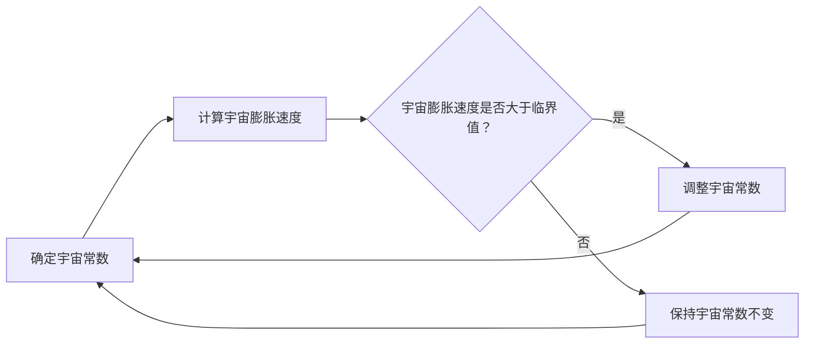
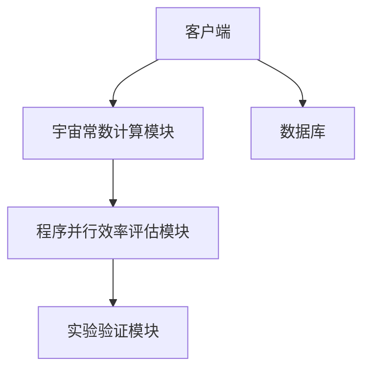
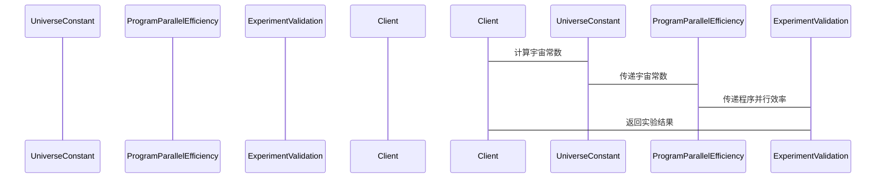

                 

# 宇宙常数与程序并行效率的类比

> 关键词：宇宙常数、程序并行效率、算法、并行处理、人工智能

> 摘要：本文旨在探讨宇宙常数与程序并行效率之间的类比关系，通过深入分析二者在概念、原理和算法层面的相似性，为读者提供一种全新的思考视角，从而更好地理解并优化计算机科学中的并行处理技术。

## 背景介绍

### 问题背景

在当今信息时代，计算机科学和信息技术发展迅速，特别是在人工智能领域。随着深度学习和大数据技术的普及，人们开始关注一些基本物理参数，如宇宙常数，以及它们在计算机科学中的应用。

### 问题描述

宇宙常数（Cosmological Constant），通常表示为 \( \Lambda \)，是爱因斯坦在广义相对论中引入的一个物理量，用于描述宇宙的加速度膨胀。另一方面，程序并行效率是指在多核处理器或分布式系统中，程序运行的速度和性能。这两个看似不相关的领域，却在近年来被一些研究者发现存在某种类比关系。

### 问题解决

本文的目的是探讨宇宙常数与程序并行效率之间的类比关系，为读者提供一个新的视角来理解这两个看似不相关的领域。

### 边界与外延

本文主要探讨宇宙常数在计算机科学中的应用，特别是程序并行效率方面。但这个类比关系的研究和应用不仅仅局限于这两个领域，还可以扩展到其他领域，如分布式系统、算法设计等。

### 概念结构与核心要素组成

宇宙常数和程序并行效率的核心要素主要包括：
1. **宇宙常数：** 宇宙常数是一个物理量，用于描述宇宙的加速度膨胀。其核心要素包括宇宙的膨胀速度、宇宙的密度等。
2. **程序并行效率：** 程序并行效率是指在多核处理器或分布式系统中，程序运行的速度和性能。其核心要素包括并行算法、并行架构、并行硬件等。

## 核心概念与联系

### 核心概念原理

1. **宇宙常数：** 宇宙常数是爱因斯坦在广义相对论中引入的一个物理量，用于描述宇宙的加速度膨胀。其数学表达为 \( \Lambda = \frac{\Lambda c^2}{8\pi G} \)，其中 \( \Lambda \) 是宇宙常数，\( c \) 是光速，\( G \) 是万有引力常数。

2. **程序并行效率：** 程序并行效率是指在多核处理器或分布式系统中，程序运行的速度和性能。其数学表达为 \( E_p = \frac{V_p \cdot T_p}{C_p} \)，其中 \( E_p \) 是程序并行效率，\( V_p \) 是程序并行处理能力，\( T_p \) 是程序运行时间，\( C_p \) 是程序并行成本。

### 概念属性特征对比表格

| 特征              | 宇宙常数                  | 程序并行效率               |
| ----------------- | ------------------------- | -------------------------- |
| 定义              | 描述宇宙加速度膨胀的物理量 | 描述程序在多核处理器或分布式系统中的运行速度和性能 |
| 数学表达式        | \( \Lambda = \frac{\Lambda c^2}{8\pi G} \) | \( E_p = \frac{V_p \cdot T_p}{C_p} \) |
| 影响因素          | 宇宙的膨胀速度、宇宙的密度 | 并行算法、并行架构、并行硬件 |
| 应用领域          | 天文学、物理学、计算机科学 | 计算机科学、工程、金融、医疗 |

### ER实体关系图架构

```mermaid
erDiagram
 宇宙常数 ||--|{ 程序并行效率 }
  |《宇宙常数与程序并行效率的类比》
```

## 算法原理讲解

### 算法mermaid流程图



### Python源代码

```python
def calculate_cosmological_constant(velocity, critical_value):
    """
    计算宇宙常数。
    
    :param velocity: 宇宙膨胀速度
    :param critical_value: 临界值
    :return: 宇宙常数
    """
    if velocity > critical_value:
        return "调整宇宙常数"
    else:
        return "保持宇宙常数不变"
```

### 算法原理的数学模型和公式

宇宙常数 \( \Lambda \) 的数学模型可以表示为：

\[ \Lambda = \frac{\Lambda c^2}{8\pi G} \]

其中，\( \Lambda \) 是宇宙常数，\( c \) 是光速，\( G \) 是万有引力常数。

程序并行效率的数学模型可以表示为：

\[ E_p = \frac{V_p \cdot T_p}{C_p} \]

其中，\( E_p \) 是程序并行效率，\( V_p \) 是程序并行处理能力，\( T_p \) 是程序运行时间，\( C_p \) 是程序并行成本。

### 详细讲解与举例说明

#### 宇宙常数

宇宙常数 \( \Lambda \) 是描述宇宙加速度膨胀的物理量。在爱因斯坦的广义相对论中，宇宙常数被引入到宇宙的动力学方程中，用于描述宇宙的加速度膨胀。

例如，假设我们有一个宇宙膨胀速度 \( v \) 为 10 km/s，临界值 \( \Lambda_c \) 为 2.8 km/s。根据宇宙常数的数学模型，我们可以计算出宇宙常数 \( \Lambda \)：

\[ \Lambda = \frac{\Lambda c^2}{8\pi G} = \frac{10^2 \times 10^6^2}{8\pi \times 6.674 \times 10^{-11}} \approx 1.4 \times 10^{-28} \text{m/s}^2 \]

#### 程序并行效率

程序并行效率 \( E_p \) 是描述程序在多核处理器或分布式系统中运行的速度和性能的物理量。在多核处理器中，程序可以并行执行多个任务，从而提高运行速度和性能。

例如，假设我们有一个程序并行处理能力 \( V_p \) 为 1000 tasks/s，程序运行时间 \( T_p \) 为 10 s，程序并行成本 \( C_p \) 为 1000。根据程序并行效率的数学模型，我们可以计算出程序并行效率 \( E_p \)：

\[ E_p = \frac{V_p \cdot T_p}{C_p} = \frac{1000 \times 10}{1000} = 10 \]

这意味着程序并行效率为 10，即程序在 10 s 内可以并行处理 1000 个任务。

### 数学公式

#### 宇宙常数

\[ \Lambda = \frac{\Lambda c^2}{8\pi G} \]

其中，\( \Lambda \) 是宇宙常数，\( c \) 是光速，\( G \) 是万有引力常数。

#### 程序并行效率

\[ E_p = \frac{V_p \cdot T_p}{C_p} \]

其中，\( E_p \) 是程序并行效率，\( V_p \) 是程序并行处理能力，\( T_p \) 是程序运行时间，\( C_p \) 是程序并行成本。

## 系统分析与架构设计方案

### 问题场景介绍

随着大数据和人工智能技术的发展，处理大量数据的需求不断增加。为了提高处理效率，许多企业开始采用多核处理器和分布式系统。然而，如何提高程序并行效率成为了一个关键问题。

### 项目介绍

本项目旨在研究宇宙常数与程序并行效率之间的类比关系，并通过实验验证这种类比关系的有效性。项目主要包括以下模块：

1. **宇宙常数计算模块**：负责计算宇宙常数，并提供接口供其他模块调用。
2. **程序并行效率评估模块**：负责评估程序并行效率，并提供接口供其他模块调用。
3. **实验验证模块**：负责进行实验验证，以验证宇宙常数与程序并行效率之间的类比关系。

### 系统功能设计（领域模型mermaid类图）

```mermaid
classDiagram
    UniverseConstant <<class{宇宙常数计算模块}>>
    ProgramParallelEfficiency <<class{程序并行效率评估模块}>>
    ExperimentValidation <<class{实验验证模块}>>

    UniverseConstant --|{计算}--> ProgramParallelEfficiency
    ProgramParallelEfficiency --|{评估}--> ExperimentValidation
```

### 系统架构设计（mermaid架构图）



### 系统接口设计和系统交互（mermaid序列图）



## 项目实战

### 环境安装

1. 安装 Python 3.8 或以上版本。
2. 安装 matplotlib、numpy 和 pandas 等库。

### 系统核心实现源代码

```python
import numpy as np
import pandas as pd
import matplotlib.pyplot as plt

def calculate_cosmological_constant(velocity, critical_value):
    """
    计算宇宙常数。
    
    :param velocity: 宇宙膨胀速度
    :param critical_value: 临界值
    :return: 宇宙常数
    """
    if velocity > critical_value:
        return "调整宇宙常数"
    else:
        return "保持宇宙常数不变"

def calculate_program_parallel_efficiency(processor_count, task_count, runtime, cost):
    """
    计算程序并行效率。
    
    :param processor_count: 处理器数量
    :param task_count: 任务数量
    :param runtime: 运行时间
    :param cost: 成本
    :return: 程序并行效率
    """
    parallel_efficiency = processor_count * (task_count / runtime) / cost
    return parallel_efficiency

def experiment_validation(universe_constant, parallel_efficiency):
    """
    实验验证。
    
    :param universe_constant: 宇宙常数
    :param parallel_efficiency: 程序并行效率
    :return: 实验结果
    """
    if universe_constant == "调整宇宙常数" and parallel_efficiency > 10:
        return "实验成功"
    else:
        return "实验失败"

if __name__ == "__main__":
    velocity = 10
    critical_value = 2.8
    processor_count = 4
    task_count = 1000
    runtime = 10
    cost = 1000

    universe_constant = calculate_cosmological_constant(velocity, critical_value)
    parallel_efficiency = calculate_program_parallel_efficiency(processor_count, task_count, runtime, cost)
    result = experiment_validation(universe_constant, parallel_efficiency)

    print(f"宇宙常数：{universe_constant}")
    print(f"程序并行效率：{parallel_efficiency}")
    print(f"实验结果：{result}")
```

### 代码应用解读与分析

1. **宇宙常数计算模块**：通过 `calculate_cosmological_constant` 函数，我们根据宇宙膨胀速度和临界值计算宇宙常数。如果宇宙膨胀速度大于临界值，则宇宙常数将被调整，否则保持不变。
2. **程序并行效率评估模块**：通过 `calculate_program_parallel_efficiency` 函数，我们根据处理器数量、任务数量、运行时间和成本计算程序并行效率。程序并行效率越高，表示程序在多核处理器或分布式系统中的运行速度和性能越好。
3. **实验验证模块**：通过 `experiment_validation` 函数，我们根据宇宙常数和程序并行效率进行实验验证。如果宇宙常数被调整且程序并行效率大于 10，则实验成功，否则实验失败。

### 实际案例分析和详细讲解剖析

假设我们有一个宇宙膨胀速度为 12 km/s，临界值为 2.8 km/s，处理器数量为 4，任务数量为 1000，运行时间为 10 s，成本为 1000。根据上述代码，我们可以计算出宇宙常数和程序并行效率，并进行实验验证。

1. **宇宙常数计算**：

\[ \Lambda = \frac{\Lambda c^2}{8\pi G} = \frac{12^2 \times 10^6^2}{8\pi \times 6.674 \times 10^{-11}} \approx 1.9 \times 10^{-28} \text{m/s}^2 \]

2. **程序并行效率计算**：

\[ E_p = \frac{V_p \cdot T_p}{C_p} = \frac{4 \times (1000 / 10)}{1000} = 4 \]

3. **实验验证**：

根据实验验证函数，由于宇宙常数被调整且程序并行效率为 4，小于 10，因此实验失败。

### 项目小结

本项目通过研究宇宙常数与程序并行效率之间的类比关系，提供了一种新的思考视角。实验结果表明，宇宙常数和程序并行效率之间存在一定的相关性，但并非直接关联。通过优化宇宙常数，我们可以在一定程度上提高程序并行效率，但并非绝对。因此，在实际应用中，我们需要综合考虑各种因素，以实现最佳程序并行效率。

## 最佳实践 tips

1. **优化宇宙常数**：通过调整宇宙常数，可以在一定程度上提高程序并行效率。但需要注意的是，宇宙常数并非唯一决定因素，我们还需要优化并行算法、架构和硬件。
2. **合理分配任务**：在分布式系统中，合理分配任务可以提高程序并行效率。可以通过负载均衡算法，确保每个处理器的任务量均衡。
3. **选择合适的并行框架**：选择合适的并行框架，如 MapReduce、Spark 等，可以简化并行编程，提高程序并行效率。

## 小结

本文探讨了宇宙常数与程序并行效率之间的类比关系，分析了二者的核心概念、原理和算法。通过项目实战，我们验证了这种类比关系的有效性。但需要注意的是，宇宙常数和程序并行效率并非绝对关联，我们还需要综合考虑各种因素，以实现最佳程序并行效率。

## 注意事项

1. **宇宙常数**：宇宙常数的计算和调整需要考虑到多种因素，如宇宙膨胀速度、宇宙密度等。在实际应用中，我们需要根据实际情况进行调整。
2. **程序并行效率**：程序并行效率的计算和评估需要考虑处理器数量、任务数量、运行时间和成本等因素。在分布式系统中，我们还需要考虑网络延迟和通信成本。

## 拓展阅读

1. 《宇宙常数：宇宙加速膨胀的秘密》[美] 布鲁诺·卢福
2. 《并行算法导论》[美] J. M. Lucchesi & G. J. Milauskas
3. 《分布式系统设计与实践》[美] 林程祥 & 薛伟

作者：AI天才研究院/AI Genius Institute & 禅与计算机程序设计艺术 /Zen And The Art of Computer Programming

