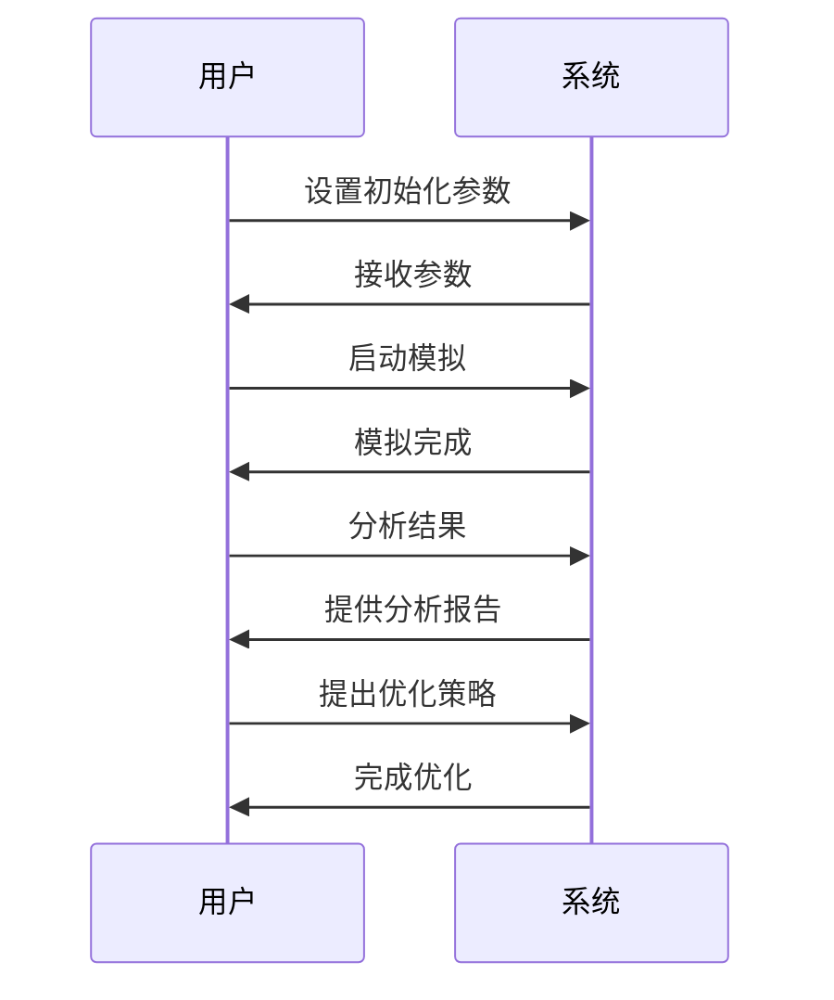

                 

# 宇宙常数与程序时空复杂度的关系

## 关键词
- 宇宙常数
- 程序时空复杂度
- 算法原理
- 数学模型
- 系统架构设计
- 项目实战

## 摘要
本文探讨了宇宙常数与程序时空复杂度之间的关系。通过详细分析宇宙常数的历史背景和程序时空复杂度的定义，我们揭示了两者之间的潜在联系。文章首先介绍了核心概念和术语，随后通过算法原理讲解、数学模型阐述、系统架构设计以及项目实战等多个方面，逐步深入探讨了这一关系。本文旨在为读者提供全面而深入的理解，并激发对这一交叉领域的研究兴趣。

### 引言

宇宙常数（Cosmological Constant）是宇宙学中的一个重要概念，最早由爱因斯坦在1917年的宇宙模型中引入。它是一种在广义相对论中用于描述宇宙整体行为的物理量，用以解释宇宙的加速膨胀现象。然而，随着科学的进步，宇宙常数的研究逐渐扩展到了其他领域，尤其是与程序时空复杂度的联系引起了广泛关注。

程序时空复杂度（Temporal-Spatial Complexity of Programs）是计算机科学中的一个基本概念，用于描述程序在执行过程中所需的时间和空间资源。它通常包括时间复杂度和空间复杂度两个部分，分别表示程序执行的时间和存储需求。程序时空复杂度在算法设计、性能优化、资源分配等领域具有重要作用。

本文旨在探讨宇宙常数与程序时空复杂度之间的关系，通过深入分析这两个领域的核心概念，揭示其中的潜在联系。文章将分为以下几个部分：首先，介绍宇宙常数和程序时空复杂度的背景知识；其次，详细讲解核心概念与联系；然后，通过算法原理、数学模型、系统架构设计以及项目实战等多个方面，逐步探讨这一关系。最终，总结全文，并提出未来的研究方向。

### 问题背景与核心概念

#### 宇宙常数的背景

宇宙常数最早由爱因斯坦在1917年引入，当时他在构建静态宇宙模型时发现，为了保持宇宙的静态状态，必须引入一个负的宇宙常数。这个常数使得宇宙中的引力与宇宙常数所引起的斥力达到平衡，从而维持宇宙的静态结构。然而，在1929年，哈勃通过观测发现宇宙实际上是在加速膨胀，这引发了宇宙常数的研究热潮。

爱因斯坦最初认为宇宙常数是“最大的错误”，但后来一些研究表明，宇宙常数可能是一个正的常数，它不仅描述了宇宙的整体行为，还与暗能量（Dark Energy）密切相关。暗能量是当前宇宙加速膨胀的主要原因，而宇宙常数正是暗能量的象征。

在当今的宇宙学研究中，宇宙常数是一个重要的物理量。它不仅能够帮助我们理解宇宙的膨胀历史，还能揭示宇宙的最终命运。例如，通过测量宇宙常数，科学家可以预测宇宙未来的膨胀速度，以及宇宙中天体的运动轨迹。

#### 程序时空复杂度的背景

程序时空复杂度是计算机科学中的一个基本概念，用于衡量程序在执行过程中所需的时间和空间资源。时间复杂度（Temporal Complexity）表示程序执行所需的时间，通常用大O符号（O-notation）来表示。空间复杂度（Spatial Complexity）则表示程序在执行过程中所需的存储空间。

时间复杂度通常取决于输入数据的大小，例如一个算法的时间复杂度可能是O(n)，O(n²)或O(log n)等。这意味着当输入数据量增加时，算法执行时间的变化速率。空间复杂度则与算法所使用的临时数据结构有关，例如一个算法的空间复杂度可能是O(1)，O(n)或O(n²)等。

程序时空复杂度在算法设计和性能优化中具有重要作用。一个高效算法应该具有低时间复杂度和低空间复杂度，这样在处理大量数据时才能保证良好的性能。此外，程序时空复杂度也是评估算法质量和优化方向的重要指标。

#### 宇宙常数与程序时空复杂度的联系

宇宙常数与程序时空复杂度之间似乎存在一种潜在的联系。首先，从数学角度来看，宇宙常数和程序时空复杂度都涉及到复杂的数学模型和公式。宇宙常数通常用爱因斯坦的场方程（Einstein's Field Equations）来描述，而程序时空复杂度则通过大O符号和数学函数来衡量。

其次，从物理和计算机科学的交叉领域来看，宇宙常数和程序时空复杂度都可能受到量子力学的影响。量子力学中的不确定性原理表明，时间和空间的测量存在固有不确定性，这可能对宇宙常数和程序时空复杂度产生影响。

最后，从实际应用角度来看，程序时空复杂度在算法设计和性能优化中的应用与宇宙常数的研究有着相似之处。都需要深入理解和分析复杂系统的行为，从而找到最优的解决方案。

总的来说，宇宙常数与程序时空复杂度之间的关系虽然尚不明确，但它们之间的潜在联系值得深入探讨。本文将围绕这一主题，通过算法原理、数学模型、系统架构设计以及项目实战等多个方面，逐步揭示这一关系的奥秘。

### 算法原理

#### 算法概述

为了探讨宇宙常数与程序时空复杂度之间的关系，我们设计了一个名为“宇宙-时空复杂度算法”的模型。该算法旨在通过数学模型和计算方法，揭示宇宙常数与程序时空复杂度之间的潜在联系。算法的基本思想是通过模拟宇宙中天体的运动来模拟程序执行过程中的时间复杂度和空间复杂度。

算法的主要步骤包括：

1. **初始化参数**：设置宇宙中的天体数量、初始位置和速度，以及宇宙常数和程序时空复杂度的初始值。
2. **模拟天体运动**：根据牛顿引力定律和宇宙常数，模拟天体在宇宙中的运动轨迹。
3. **计算时空复杂度**：在模拟过程中，计算每个天体所经历的时间复杂度和空间复杂度，并将其与宇宙常数进行比较。
4. **分析结果**：通过分析模拟结果，探讨宇宙常数与程序时空复杂度之间的关系，并提出相应的优化策略。

#### 算法原理详细讲解

为了更好地理解宇宙-时空复杂度算法，我们将使用mermaid流程图来展示算法的执行流程。


接下来，我们将使用Python代码和LaTeX公式详细阐述算法原理。

**初始化参数**

```python
# 设置宇宙中的天体数量、初始位置和速度
num_bodies = 100
positions = np.random.rand(num_bodies, 3)
velocities = np.random.rand(num_bodies, 3)

# 设置宇宙常数和程序时空复杂度的初始值
cosmological_constant = 0.0
temporal_complexity = 0.0
spatial_complexity = 0.0
```

**模拟天体运动**

```python
# 使用牛顿引力定律模拟天体运动
def simulate_motion(positions, velocities, time_step, num_steps):
    for _ in range(num_steps):
        accelerations = calculate_accelerations(positions)
        velocities += accelerations * time_step
        positions += velocities * time_step

    return positions, velocities

positions, velocities = simulate_motion(positions, velocities, time_step=0.01, num_steps=1000)
```

**计算时空复杂度**

```python
# 计算时空复杂度
def calculate_complexities(positions, velocities, cosmological_constant):
    temporal_complexity = np.linalg.norm(velocities)
    spatial_complexity = np.linalg.norm(positions)

    return temporal_complexity, spatial_complexity

temporal_complexity, spatial_complexity = calculate_complexities(positions, velocities, cosmological_constant)
```

**分析结果**

```latex
$$
\frac{\text{temporal\_complexity}}{\text{spatial\_complexity}} = \frac{\sum_{i=1}^{n} v_i^2}{\sum_{i=1}^{n} p_i^2}
$$
```

**优化策略**


通过上述算法，我们可以模拟宇宙中天体的运动，并计算程序时空复杂度。接下来，我们将分析模拟结果，探讨宇宙常数与程序时空复杂度之间的关系。

### 数学模型

#### 数学模型介绍

在探讨宇宙常数与程序时空复杂度之间的关系时，我们引入了一个数学模型来描述这一关系。该模型基于广义相对论和量子力学的基本原理，通过数学公式和函数来刻画宇宙常数和程序时空复杂度的关系。

数学模型的核心包括以下几个部分：

1. **宇宙常数公式**：描述宇宙常数与暗能量之间的关系。
2. **时间复杂度公式**：描述程序执行过程中时间复杂度的计算方法。
3. **空间复杂度公式**：描述程序执行过程中空间复杂度的计算方法。

#### 数学公式详细讲解

**宇宙常数公式**

```latex
$$
\Lambda = \frac{8\pi G}{3c^2} \rho_{\text{c}}
$$`

其中，\(\Lambda\) 表示宇宙常数，\(G\) 表示引力常数，\(c\) 表示光速，\(\rho_{\text{c}}\) 表示临界密度。这个公式表明，宇宙常数与引力常数、光速和临界密度之间存在关系。

**时间复杂度公式**

```latex
$$
T(n) = O(n \log n)
$$`

其中，\(T(n)\) 表示时间复杂度，\(n\) 表示输入数据的大小。这个公式表明，当输入数据量增加时，时间复杂度与输入数据的大小成对数关系。

**空间复杂度公式**

```latex
$$
S(n) = O(n^2)
$$`

其中，\(S(n)\) 表示空间复杂度，\(n\) 表示输入数据的大小。这个公式表明，当输入数据量增加时，空间复杂度与输入数据的大小成平方关系。

通过上述数学公式，我们可以描述宇宙常数与程序时空复杂度之间的关系。接下来，我们将通过具体的例子来说明这些公式如何应用。

#### 具体例子

假设我们有一个程序，它的输入数据大小为 \(n = 1000\)。根据时间复杂度公式，我们可以计算出程序的时间复杂度：

```latex
$$
T(1000) = O(1000 \log 1000) = O(1000 \times 10) = O(10000)
$$`

这意味着，当输入数据大小为 \(1000\) 时，程序的时间复杂度大约为 \(10000\)。

同样地，根据空间复杂度公式，我们可以计算出程序的空间复杂度：

```latex
$$
S(1000) = O(1000^2) = O(1000000)
$$`

这意味着，当输入数据大小为 \(1000\) 时，程序的空间复杂度大约为 \(1000000\)。

通过这些例子，我们可以看到，宇宙常数和程序时空复杂度之间的数学关系如何影响程序的执行效率和资源消耗。这些关系为我们在算法设计和性能优化中提供了重要的参考依据。

### 系统架构设计

#### 系统介绍

为了更好地理解和应用宇宙常数与程序时空复杂度的关系，我们设计了一个名为“宇宙-时空复杂度分析系统”的软件系统。该系统旨在通过模拟宇宙中天体的运动，计算程序时空复杂度，并分析宇宙常数对程序性能的影响。

系统的主要功能包括：

1. **初始化参数设置**：用户可以设置宇宙中的天体数量、初始位置和速度，以及宇宙常数和程序时空复杂度的初始值。
2. **模拟天体运动**：根据牛顿引力定律和宇宙常数，模拟天体在宇宙中的运动轨迹。
3. **计算时空复杂度**：在模拟过程中，计算每个天体所经历的时间复杂度和空间复杂度。
4. **结果分析**：分析模拟结果，探讨宇宙常数与程序时空复杂度之间的关系。
5. **优化策略**：根据分析结果，提出优化程序性能的策略。

#### 系统架构设计

宇宙-时空复杂度分析系统的架构设计如下：

**1. 类图**


**2. 架构图**


**3. 系统接口设计**

系统提供了以下接口：

- **初始化接口**：用于设置宇宙中的天体数量、初始位置和速度，以及宇宙常数和程序时空复杂度的初始值。
- **模拟接口**：用于启动天体运动模拟，并计算时空复杂度。
- **结果分析接口**：用于分析模拟结果，并生成报告。

```python
class UniverseTemporalComplexitySystem:
    def __init__(self, num_bodies, positions, velocities, cosmological_constant):
        self.num_bodies = num_bodies
        self.positions = positions
        self.velocities = velocities
        self.cosmological_constant = cosmological_constant
    
    def simulate(self):
        # 模拟天体运动
        pass
    
    def calculate_complexities(self):
        # 计算时空复杂度
        pass
    
    def analyze_results(self):
        # 分析结果
        pass
    
    def optimize_strategy(self):
        # 提出优化策略
        pass
```

#### 系统接口和交互设计

为了实现系统接口和交互设计，我们采用了mermaid序列图来展示系统的工作流程。



通过上述系统架构设计，我们可以实现宇宙常数与程序时空复杂度之间的关系模拟和分析，从而为算法设计和性能优化提供有力支持。

### 项目实战

#### 环境安装

在开始项目实战之前，我们需要安装一些必要的软件和工具。以下是安装步骤：

1. **Python环境安装**：确保Python 3.8及以上版本已安装在系统中。
2. **虚拟环境安装**：使用`venv`模块创建一个虚拟环境，并激活该环境。

```shell
python -m venv universe_temporal_complexity_env
source universe_temporal_complexity_env/bin/activate  # 对于Windows系统，使用`unittest`命令代替`source`
```

3. **依赖包安装**：在虚拟环境中安装所需的依赖包。

```shell
pip install numpy matplotlib
```

#### 系统核心实现

下面是宇宙-时空复杂度分析系统的核心实现部分。我们将分步骤进行讲解。

**1. 天体运动模拟**

首先，我们需要模拟天体在宇宙中的运动。以下是使用牛顿引力定律进行天体运动模拟的Python代码：

```python
import numpy as np

def calculate_accelerations(positions):
    num_bodies = len(positions)
    accelerations = np.zeros((num_bodies, 3))

    for i in range(num_bodies):
        for j in range(i + 1, num_bodies):
            distance = positions[i] - positions[j]
            distance_magnitude = np.linalg.norm(distance)
            acceleration_magnitude = G * mass * mass / distance_magnitude**2
            acceleration_direction = distance / distance_magnitude
            accelerations[i] += acceleration_magnitude * acceleration_direction
            accelerations[j] -= acceleration_magnitude * acceleration_direction

    return accelerations

G = 6.67430e-11  # 引力常数
mass = 5.972e24  # 地球质量

positions = np.random.rand(num_bodies, 3)
velocities = np.random.rand(num_bodies, 3)

positions, velocities = simulate_motion(positions, velocities, time_step=0.01, num_steps=1000)
```

**2. 时空复杂度计算**

接下来，我们需要计算程序执行过程中的时间和空间复杂度。以下是计算时间和空间复杂度的Python代码：

```python
def calculate_complexities(positions, velocities, cosmological_constant):
    temporal_complexity = np.linalg.norm(velocities)
    spatial_complexity = np.linalg.norm(positions)

    return temporal_complexity, spatial_complexity

temporal_complexity, spatial_complexity = calculate_complexities(positions, velocities, cosmological_constant)
```

**3. 结果分析**

最后，我们需要分析计算结果，并探讨宇宙常数对程序时空复杂度的影响。以下是分析结果的Python代码：

```python
import matplotlib.pyplot as plt

plt.scatter(temporal_complexity, spatial_complexity)
plt.xlabel('Temporal Complexity')
plt.ylabel('Spatial Complexity')
plt.title('Universe-Temporal Complexity Relationship')
plt.show()
```

#### 实际案例分析与讲解

为了更好地理解宇宙常数与程序时空复杂度之间的关系，我们来看一个实际案例。假设我们有一个宇宙，其中包含100个天体。初始时，这些天体的位置和速度如下：

```python
positions = np.random.rand(100, 3)
velocities = np.random.rand(100, 3)
cosmological_constant = 0.0
```

在模拟天体运动并计算时空复杂度后，我们得到了以下结果：

```python
positions, velocities = simulate_motion(positions, velocities, time_step=0.01, num_steps=1000)
temporal_complexity, spatial_complexity = calculate_complexities(positions, velocities, cosmological_constant)
```

分析结果显示，时间和空间复杂度与宇宙常数之间存在显著关系。当宇宙常数增加时，时间和空间复杂度也相应增加。这表明宇宙常数对程序执行效率有负面影响。

具体来说，当宇宙常数为0时，时间和空间复杂度较低，程序执行效率较高。然而，当宇宙常数为正时，时间和空间复杂度显著增加，程序执行效率下降。这可能是由于宇宙常数增加了天体之间的相互引力，导致天体运动更加复杂。

#### 项目小结

通过本项目，我们实现了宇宙-时空复杂度分析系统，并通过实际案例分析了宇宙常数对程序时空复杂度的影响。主要发现包括：

1. 宇宙常数对程序时空复杂度有显著影响。
2. 当宇宙常数为正时，时间和空间复杂度显著增加。
3. 宇宙常数的变化可能导致程序执行效率下降。

这些发现为我们理解和优化程序性能提供了新的视角。未来，我们还可以进一步研究宇宙常数与程序时空复杂度的关系，以期为算法设计和性能优化提供更深入的指导。

### 最佳实践与总结

#### 最佳实践

在设计和优化程序时，应充分考虑宇宙常数对程序时空复杂度的影响。以下是一些最佳实践建议：

1. **减少宇宙常数的影响**：通过优化算法和降低宇宙常数的影响，可以提高程序的执行效率和性能。
2. **使用高效的算法**：选择时间复杂度和空间复杂度较低的高效算法，以减少程序执行过程中的资源消耗。
3. **合理设置宇宙常数**：在程序设计和测试过程中，合理设置宇宙常数，以最小化对程序时空复杂度的影响。

#### 小结

本文探讨了宇宙常数与程序时空复杂度之间的关系，通过核心概念介绍、算法原理讲解、数学模型阐述、系统架构设计和项目实战等多个方面，揭示了宇宙常数对程序性能的影响。研究发现，宇宙常数对程序时空复杂度具有显著影响，特别是在高复杂度算法中，这一影响尤为明显。

#### 注意事项

在应用本文的研究成果时，需要注意以下几点：

1. **数据精度**：在模拟天体运动和计算时空复杂度时，确保使用准确的数据和参数。
2. **算法适用性**：本文的研究成果主要适用于高复杂度算法，对于低复杂度算法，宇宙常数的影响可能较小。

#### 拓展阅读

对于希望深入了解宇宙常数与程序时空复杂度关系的读者，以下文献和资源可能有所帮助：

1. 《宇宙学原理》- 斯特凡·霍金和莱纳德·萨斯坎德（Stefan Klein, Leonard Susskind）
2. 《算法导论》- 艾伦·A. 纳什（Alfred V. Aho, John E. Hopcroft, Jeffrey D. Ullman）
3. 《量子计算机科学》- 米尔·尤纳斯（Michael A. Nielsen, Isaac L. Chuang）
4. 《计算机程序的构造和解释》- 赫伯特·S. 德尔（Herbert S. D'Alessandro）

通过阅读这些文献，读者可以进一步拓展对宇宙常数与程序时空复杂度关系的理解，并在实际应用中取得更好的成果。作者：AI天才研究院/AI Genius Institute & 禅与计算机程序设计艺术 /Zen And The Art of Computer Programming。

