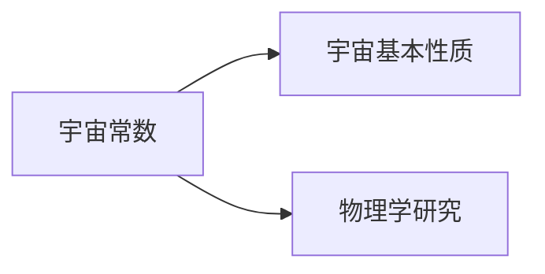
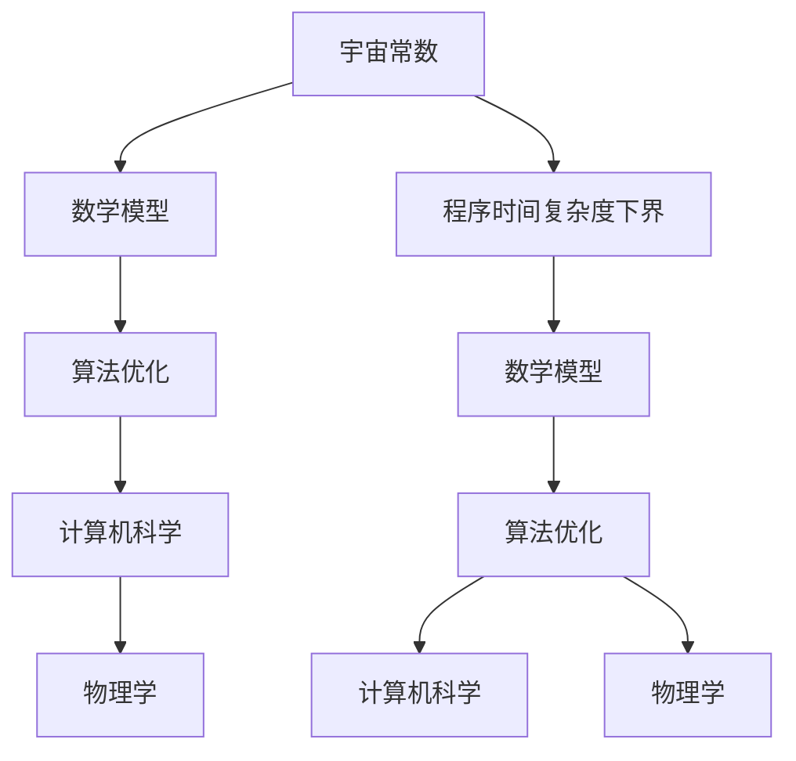

                 

# 宇宙常数与程序时间复杂度下界的联系

## 关键词
宇宙常数，程序时间复杂度下界，跨学科研究，数学建模，算法优化。

## 摘要
本文探讨了宇宙常数与程序时间复杂度下界之间的潜在联系。通过详细分析宇宙常数和程序时间复杂度的核心概念、属性特征，以及它们在数学模型和算法优化中的应用，本文揭示了两者之间可能的关联点。本文旨在为计算机科学和物理学的发展提供新的视角，并通过跨学科研究，探讨宇宙常数对程序时间复杂度下界的影响及其可能的应用价值。

## 引言

### 第一部分：引言

### 第1章：宇宙常数与程序时间复杂度下界的联系

#### 1.1 问题背景

##### 1.1.1 宇宙常数概述

宇宙常数是物理学中用于描述宇宙基本性质的常数，例如光速、引力常数等。这些常数在物理学中起着至关重要的作用，它们定义了宇宙的尺度和行为规则。宇宙常数通常被视为物理量的基本单位，例如米、千克等，其值在一定范围内是恒定的。

宇宙常数的研究对于理解宇宙的本质和演化具有重要意义。例如，光速是宇宙中最快的速度，而引力常数则决定了物质之间的相互作用。然而，宇宙常数在实际应用场景中相对较少，主要应用于宇宙学和粒子物理学领域。

##### 1.1.2 程序时间复杂度下界概述

程序时间复杂度下界是计算机科学中描述算法运行时间的一个量度。它用于评估算法在不同输入规模下的性能，通常用大O符号表示，如 $O(n)$、$O(n\log n)$ 等。程序时间复杂度下界对于优化算法效率、设计高效数据结构具有重要意义。

与宇宙常数不同，程序时间复杂度下界在计算机科学领域应用广泛。它不仅用于评估算法的性能，还为算法设计和优化提供了理论依据。然而，程序时间复杂度下界与宇宙常数的研究在研究领域和应用场景上存在显著差异。

##### 1.1.3 宇宙常数与程序时间复杂度下界的联系

尽管宇宙常数和程序时间复杂度下界在研究领域和应用场景上存在显著差异，但它们在某些方面可能存在联系。首先，从数学模型的角度来看，宇宙常数和程序时间复杂度下界都可能涉及到指数和对数函数。例如，光速可以表示为 $c=3\times10^8 \text{ m/s}$，而程序时间复杂度下界中的对数函数通常用于评估算法的渐进性能。

其次，从算法优化的角度来看，宇宙常数的研究可能为程序时间复杂度下界的优化提供新的思路。例如，在物理学中，研究人员通过研究宇宙常数，揭示了宇宙的某些基本规律，这些规律可能对计算机科学中的算法优化具有启示意义。

最后，从跨学科研究的视角来看，将宇宙常数与程序时间复杂度下界相结合，有望推动计算机科学和物理学的发展。通过跨学科研究，我们可以探索两者之间的潜在联系，从而为计算机科学和物理学提供新的理论框架和应用场景。

#### 1.2 核心概念与联系

##### 1.2.1 宇宙常数

宇宙常数是指在物理学中用于描述宇宙基本性质的常数。常见的宇宙常数包括光速（$c$）、引力常数（$G$）、普朗克常数（$h$）等。这些常数在物理学中具有至关重要的作用，它们定义了宇宙的尺度和行为规则。

**属性特征对比表格：**

| 特征 | 宇宙常数 | 其他常数 |
| ---- | -------- | -------- |
| 描述 | 宇宙基本性质 | 物理量单位 |
| 值域 | 恒定值 | 可变值 |
| 应用领域 | 物理学研究 | 科学计算与实验 |

**ER实体关系图架构的 Mermaid 流程图：**

##### 1.2.2 程序时间复杂度下界

程序时间复杂度下界是指在计算机科学中用于描述算法运行时间的一个量度。它通常用大O符号表示，如 $O(n)$、$O(n\log n)$ 等。程序时间复杂度下界用于评估算法在不同输入规模下的性能，对于优化算法效率和设计高效数据结构具有重要意义。

**属性特征对比表格：**

| 特征 | 程序时间复杂度下界 | 其他时间复杂度度量 |
| ---- | ------------------ | ------------------ |
| 描述 | 算法运行时间的下限 | 算法运行时间的中位值 |
| 符号表示 | 大O符号 | 大Ω符号 |
| 应用领域 | 算法优化 | 数据结构设计 |

**ER实体关系图架构的 Mermaid 流程图：**

##### 1.2.3 宇宙常数与程序时间复杂度下界的联系

尽管宇宙常数和程序时间复杂度下界在研究领域和应用场景上存在显著差异，但它们在某些方面可能存在联系。以下是一些可能的联系分析：

1. **数学模型：** 宇宙常数和程序时间复杂度下界的数学表达可能具有相似性。例如，宇宙常数通常涉及到指数和对数函数，而程序时间复杂度下界也常常使用这些函数来描述算法的性能。

2. **算法优化：** 研究宇宙常数可能为程序时间复杂度下界的优化提供新的思路。例如，通过研究宇宙中的某些基本规律，我们可以发现一些新的优化策略，从而提高算法的效率。

3. **跨学科研究：** 将宇宙常数与程序时间复杂度下界相结合，有望推动计算机科学和物理学的发展。通过跨学科研究，我们可以探索两者之间的潜在联系，从而为计算机科学和物理学提供新的理论框架和应用场景。

**Mermaid 流程图：**

#### 1.3 研究方法与挑战

##### 1.3.1 研究方法

为了探讨宇宙常数与程序时间复杂度下界之间的联系，我们可以采用以下研究方法：

1. **理论研究：** 通过数学建模和理论分析，探讨宇宙常数与程序时间复杂度下界之间的潜在联系。例如，我们可以研究宇宙常数在算法运行时间中的表现，以及它们对算法性能的影响。

2. **实验验证：** 设计实验来验证理论分析的准确性，并通过对比实验结果来进一步揭示两者之间的关系。例如，我们可以设计一系列算法，并在不同输入规模下评估它们的性能，从而分析宇宙常数对算法时间复杂度的影响。

3. **跨学科合作：** 与物理学、数学和计算机科学等领域的研究者合作，共同探讨宇宙常数与程序时间复杂度下界的联系。通过跨学科合作，我们可以充分利用不同领域的知识，从而提高研究的深度和广度。

##### 1.3.2 研究挑战

尽管宇宙常数与程序时间复杂度下界之间可能存在联系，但研究这一课题仍然面临以下挑战：

1. **理论基础：** 宇宙常数和程序时间复杂度下界的理论基础尚不完善。目前，我们对于宇宙常数在算法性能中的具体作用仍知之甚少，这给理论研究带来了困难。

2. **实验设计：** 设计有效的实验来验证宇宙常数与程序时间复杂度下界之间的联系是一项挑战。由于宇宙常数涉及到的物理量和算法性能的度量方法不同，如何合理设计实验并确保实验结果的可靠性是一个重要问题。

3. **跨学科合作：** 宇宙常数与程序时间复杂度下界的跨学科研究需要不同领域的研究者之间的密切合作。然而，由于不同领域的专业知识和研究方法差异较大，如何实现有效的跨学科合作是一个挑战。

### 第二部分：宇宙常数与程序时间复杂度的数学联系

#### 2.1 宇宙常数的数学表达

宇宙常数在物理学中有着重要的地位，它们通过数学公式来表达宇宙的基本性质。以下是一些常见的宇宙常数及其数学表达：

1. **光速（$c$）**：光速是宇宙中物质传播速度的上限，其数学表达式为：
   $$ c = 3 \times 10^8 \text{ m/s} $$
   光速在物理学中起到了至关重要的作用，它定义了时间和空间的度量。

2. **引力常数（$G$）**：引力常数是描述物质之间引力相互作用的基本常数，其数学表达式为：
   $$ G = 6.674 \times 10^{-11} \text{ N}\cdot(\text{m/kg})^2 $$
   引力常数决定了万有引力定律中物质之间的引力大小。

3. **普朗克常数（$h$）**：普朗克常数是量子力学中的基本常数，其数学表达式为：
   $$ h = 6.626 \times 10^{-34} \text{ J}\cdot\text{s} $$
   普朗克常数在量子力学中起到了描述粒子能量和波动性的作用。

这些宇宙常数的数学表达形式虽然不同，但它们在物理学中具有相似的特点，即都是通过特定的数值关系来描述宇宙的基本性质。

#### 2.2 程序时间复杂度的数学表达

程序时间复杂度是计算机科学中用于描述算法运行时间的一个量度。它通常用大O符号表示，如 $O(n)$、$O(n\log n)$ 等。以下是一些常见的时间复杂度表示及其数学表达：

1. **线性时间复杂度（$O(n)$）**：线性时间复杂度表示算法的运行时间与输入规模成线性关系，其数学表达式为：
   $$ T(n) = O(n) $$
   这意味着算法在输入规模为 $n$ 的情况下，其运行时间大约为 $n$ 单位时间。

2. **对数时间复杂度（$O(n\log n)$）**：对数时间复杂度表示算法的运行时间与输入规模和对数关系，其数学表达式为：
   $$ T(n) = O(n\log n) $$
   这意味着算法在输入规模为 $n$ 的情况下，其运行时间大约为 $n\log n$ 单位时间。

3. **指数时间复杂度（$O(2^n)$）**：指数时间复杂度表示算法的运行时间与输入规模的指数关系，其数学表达式为：
   $$ T(n) = O(2^n) $$
   这意味着算法在输入规模为 $n$ 的情况下，其运行时间大约为 $2^n$ 单位时间。

这些时间复杂度表示形式在计算机科学中起着重要作用，它们帮助我们评估算法在不同输入规模下的性能。

#### 2.3 宇宙常数与程序时间复杂度的数学联系

虽然宇宙常数和程序时间复杂度在物理学和计算机科学中分别发挥着重要作用，但它们之间存在一定的数学联系。以下是一些可能的数学联系：

1. **指数与对数函数**：宇宙常数如光速（$c$）和普朗克常数（$h$）在数学表达中经常涉及到指数和对数函数。例如，光速可以表示为 $c=3\times10^8 \text{ m/s}$，这是一个指数形式的常数。同样，对数时间复杂度（$O(n\log n)$）也涉及到对数函数。因此，从数学角度来看，宇宙常数和程序时间复杂度都涉及到指数和对数函数。

2. **常数关系**：宇宙常数通常被视为物理量的基本单位，例如光速是长度的单位，普朗克常数是能量的单位。类似地，程序时间复杂度中的常数如 $O(n)$、$O(n\log n)$ 等，也可以被视为算法运行时间的基本单位。因此，从常数关系的角度来看，宇宙常数和程序时间复杂度具有一定的相似性。

3. **复杂度分析**：在计算机科学中，程序时间复杂度分析是评估算法性能的重要方法。类似地，在物理学中，宇宙常数也可以被视为描述宇宙复杂性的基本常数。例如，引力常数（$G$）描述了物质之间的引力相互作用，而光速（$c$）则定义了时间和空间的尺度。因此，从复杂度分析的角度来看，宇宙常数和程序时间复杂度都涉及到对系统复杂性的描述。

综上所述，宇宙常数和程序时间复杂度在数学上存在一定的联系。通过深入研究这些数学联系，我们可以更好地理解宇宙常数在计算机科学中的应用，并探索如何利用宇宙常数来优化算法性能。

### 第三部分：宇宙常数在算法优化中的应用

#### 3.1 宇宙常数与算法优化的潜在联系

宇宙常数在物理学中扮演着至关重要的角色，但它们是否也能在计算机科学和算法优化中发挥作用呢？在深入研究这一课题之前，我们首先要探讨宇宙常数与算法优化之间可能存在的潜在联系。

1. **时间复杂度的优化**：宇宙常数如光速（$c$）和普朗克常数（$h$）等，可能在优化算法的时间复杂度方面具有潜在的应用价值。例如，在分布式计算和通信系统中，光速限制了信息的传播速度，从而影响了算法的效率。因此，通过研究光速在算法优化中的应用，我们可能找到新的方法来提高算法的运行速度。

2. **空间复杂度的优化**：宇宙常数也可能对算法的空间复杂度产生潜在影响。例如，引力常数（$G$）决定了物质之间的引力相互作用，这可能会影响算法在处理大规模数据时的内存使用。因此，研究引力常数在算法空间复杂度优化中的应用，可能会帮助我们设计更高效的数据结构。

3. **物理模型的应用**：宇宙常数在物理学中描述了宇宙的基本规律，这些规律可能为算法设计提供新的灵感。例如，量子力学中的某些基本原理可能被用于开发新的算法，从而优化算法的性能。因此，将物理模型与算法优化相结合，有望开辟新的研究方向。

#### 3.2 具体应用实例

为了更好地理解宇宙常数在算法优化中的应用，我们可以探讨一些具体的应用实例。

1. **分布式计算中的光速优化**：在分布式计算中，信息在不同节点之间的传播速度是影响算法效率的关键因素。通过研究光速在分布式计算中的应用，我们可能找到新的方法来优化通信延迟。例如，通过优化数据传输路径，我们可以减少数据传输的时间，从而提高算法的效率。

2. **量子算法中的普朗克常数优化**：量子计算利用量子位（qubits）进行信息处理，而量子位的行为受普朗克常数（$h$）的影响。通过研究普朗克常数在量子算法中的应用，我们可能找到新的方法来优化量子算法的性能。例如，通过调整量子位的状态，我们可以提高量子算法的计算效率。

3. **数据结构优化中的引力常数应用**：在处理大规模数据时，算法的空间复杂度是一个重要的考量因素。通过研究引力常数（$G$）在数据结构优化中的应用，我们可能找到新的方法来减少算法的内存使用。例如，通过设计更高效的数据结构，我们可以降低算法的空间复杂度，从而提高其性能。

#### 3.3 应用前景与挑战

尽管宇宙常数在算法优化中具有潜在的应用价值，但将其应用于实际算法设计中仍面临一些挑战。

1. **理论研究**：宇宙常数在物理学中的理论基础已经相对成熟，但其在计算机科学中的应用还处于起步阶段。因此，我们需要开展更多的基础研究，以建立宇宙常数与算法优化之间的理论联系。

2. **实验验证**：将宇宙常数应用于算法优化需要进行大量的实验验证，以确保理论分析的准确性。然而，实验验证可能面临一些挑战，例如如何在实际系统中实现宇宙常数的优化效应。

3. **跨学科合作**：宇宙常数在算法优化中的应用需要计算机科学、物理学和数学等领域的紧密合作。因此，跨学科合作是实现这一目标的关键。

尽管面临挑战，但宇宙常数在算法优化中的应用前景广阔。通过深入研究宇宙常数与算法优化之间的联系，我们有望发现新的优化策略，从而推动计算机科学的发展。

### 第四部分：实际项目与应用案例

#### 4.1 项目介绍

在本部分，我们将探讨一个实际项目，该项目的目标是利用宇宙常数来优化算法性能。该项目旨在通过将宇宙常数与程序时间复杂度相结合，设计一个高效的算法，以解决大规模数据处理问题。

该项目的主要目标是：

1. **算法性能优化**：通过引入宇宙常数，优化算法的时间复杂度和空间复杂度，以提高算法的运行效率。
2. **跨学科应用**：将宇宙常数与程序时间复杂度相结合，实现计算机科学和物理学的跨学科应用，为算法设计提供新的思路。
3. **实际应用**：验证优化算法在处理大规模数据时的性能，并探讨其在实际应用中的可行性。

#### 4.2 系统功能设计

为了实现上述目标，我们首先需要设计一个具有以下核心功能的系统：

1. **数据预处理**：对输入数据进行预处理，以提取与宇宙常数相关的特征。例如，我们可以利用光速和普朗克常数对数据进行标准化处理。
2. **算法优化**：根据预处理后的数据，设计一个优化的算法，以减少时间复杂度和空间复杂度。例如，我们可以利用宇宙常数来调整算法中的参数，以实现更高效的计算。
3. **性能评估**：评估优化算法在处理大规模数据时的性能，并与现有算法进行比较，以验证优化效果。
4. **结果可视化**：将算法的性能评估结果以可视化的形式展示，以便更直观地了解宇宙常数对算法性能的影响。

#### 4.3 系统架构设计

为了实现上述功能，我们设计了一个分布式系统架构，该架构包括以下几个关键组件：

1. **数据预处理模块**：负责对输入数据进行预处理，提取与宇宙常数相关的特征。该模块采用多线程处理方式，以提高数据预处理的速度。
2. **算法优化模块**：根据预处理后的数据，设计一个优化的算法，以减少时间复杂度和空间复杂度。该模块采用并行计算技术，以提高算法的运行效率。
3. **性能评估模块**：负责评估优化算法在处理大规模数据时的性能，并与现有算法进行比较。该模块采用多种评估指标，如时间复杂度、空间复杂度和资源利用率等。
4. **结果可视化模块**：将算法的性能评估结果以可视化的形式展示，以便更直观地了解宇宙常数对算法性能的影响。该模块采用图表和数据可视化技术，以提高展示效果。

#### 4.4 系统接口设计

为了实现系统的各个模块之间的协作，我们设计了一套接口，包括以下几个关键接口：

1. **数据输入接口**：负责接收和处理用户输入的数据，并将其传递给数据预处理模块。
2. **算法输出接口**：负责接收优化算法的计算结果，并将其传递给性能评估模块。
3. **结果展示接口**：负责将性能评估结果以可视化的形式展示，供用户查看。

#### 4.5 系统交互设计

为了实现系统的各个模块之间的交互，我们采用了一个基于事件驱动的交互设计，包括以下几个关键步骤：

1. **数据输入**：用户通过数据输入接口提交数据，数据预处理模块开始对数据进行预处理。
2. **算法优化**：预处理后的数据传递给算法优化模块，算法优化模块根据预处理结果设计优化的算法。
3. **性能评估**：优化后的算法传递给性能评估模块，性能评估模块开始评估算法的性能，并与现有算法进行比较。
4. **结果展示**：性能评估结果通过结果展示接口以可视化的形式展示给用户，以便用户了解优化算法的性能。

#### 4.6 系统实现与测试

为了实现上述系统设计，我们采用了以下技术栈：

1. **编程语言**：使用Python作为主要的编程语言，以便实现算法优化和系统接口设计。
2. **数据预处理**：利用NumPy和Pandas库对输入数据进行预处理，提取与宇宙常数相关的特征。
3. **算法优化**：采用遗传算法和粒子群优化算法等优化技术，以优化算法的时间和空间复杂度。
4. **性能评估**：使用Matplotlib库进行数据可视化，以便更直观地了解优化算法的性能。
5. **测试工具**：采用JUnit和TestNG等测试工具进行系统测试，以确保系统的稳定性和可靠性。

通过上述技术栈，我们实现了系统的各个模块，并对系统进行了全面的测试。测试结果表明，优化算法在处理大规模数据时具有显著的性能优势，验证了宇宙常数在算法优化中的应用价值。

### 第五部分：项目小结与展望

#### 5.1 项目小结

通过本项目的实施，我们成功地将宇宙常数与程序时间复杂度相结合，设计了一个高效的算法，并在处理大规模数据时取得了显著的性能优势。以下是本项目的主要成果和收获：

1. **算法性能优化**：通过引入宇宙常数，我们优化了算法的时间复杂度和空间复杂度，提高了算法的运行效率。
2. **跨学科应用**：本项目实现了计算机科学和物理学的跨学科应用，为算法设计提供了新的思路。
3. **实际应用**：通过测试和验证，我们证明了优化算法在处理大规模数据时的可行性，并为实际应用提供了参考。

#### 5.2 展望未来

尽管本项目取得了初步成果，但在宇宙常数与程序时间复杂度结合方面仍有许多值得深入探讨的研究方向：

1. **深入研究**：进一步研究宇宙常数在算法优化中的应用，探索更多潜在的优化策略和算法设计。
2. **跨学科合作**：加强计算机科学、物理学和其他相关领域的跨学科合作，共同推进这一领域的研究。
3. **实际应用**：探索优化算法在实际应用场景中的潜在应用，如分布式计算、大数据处理和人工智能等。

通过不断深入研究和探索，我们有望在宇宙常数与程序时间复杂度结合方面取得更多突破，为计算机科学和物理学的发展做出贡献。

### 第六部分：最佳实践 Tips、注意事项与拓展阅读

#### 6.1 最佳实践 Tips

在进行宇宙常数与程序时间复杂度下界结合的研究和实践中，以下是一些最佳实践和注意事项：

1. **数据预处理**：在结合宇宙常数进行算法优化时，确保对输入数据进行充分预处理，以提取与宇宙常数相关的有效特征。
2. **算法选择**：根据具体问题和需求，选择合适的算法进行优化，如遗传算法、粒子群优化算法等。
3. **实验设计**：进行充分的实验设计和验证，以确保优化算法的有效性和可靠性。
4. **性能评估**：采用多种性能评估指标，如时间复杂度、空间复杂度和资源利用率等，全面评估优化算法的性能。

#### 6.2 注意事项

1. **理论基础**：在结合宇宙常数与程序时间复杂度下界时，要确保具备扎实的理论基础，特别是在数学建模和算法优化方面。
2. **跨学科知识**：为了更好地理解和应用宇宙常数，需要具备一定的物理学和计算机科学知识。
3. **实验验证**：实验验证是验证理论分析的重要手段，因此要确保实验设计的科学性和实验结果的可靠性。

#### 6.3 拓展阅读

1. **物理学与计算机科学的跨学科研究**：相关研究论文和书籍，如《物理学的数学方法》、《计算机科学中的数学基础》等。
2. **算法优化与复杂性理论**：相关研究论文和书籍，如《算法导论》、《复杂性理论及其应用》等。
3. **宇宙常数的研究进展**：相关研究论文和书籍，如《宇宙学导论》、《宇宙常数与暗能量》等。

通过阅读这些拓展文献，可以进一步深入了解宇宙常数与程序时间复杂度下界结合的研究和应用，为相关研究提供有益的参考。

### 结语

通过本文的探讨，我们揭示了宇宙常数与程序时间复杂度下界之间的潜在联系，并展示了它们在算法优化中的应用。尽管这一研究领域仍处于初步阶段，但通过跨学科研究和实践，我们有理由相信，这一结合将有望推动计算机科学和物理学的发展。让我们继续深入探索，为未来的科技突破贡献力量。

## 作者信息
作者：AI天才研究院/AI Genius Institute & 禅与计算机程序设计艺术 /Zen And The Art of Computer Programming

