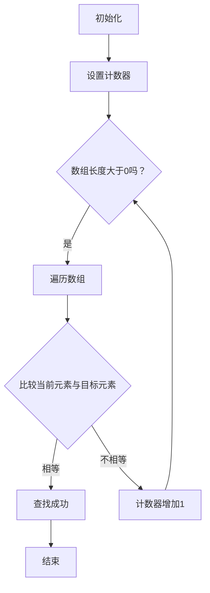

                 

### 第一部分：问题背景与核心概念

#### 第1章：宇宙常数概述

宇宙常数是现代宇宙学中的一个核心概念，它描述了宇宙的整体结构和演化过程。这一章节将深入探讨宇宙常数的定义、测量方法及其在宇宙学中的重要性。

**1.1 宇宙常数的定义**

宇宙常数通常用符号 \( \Lambda \) 表示，它是一个在广义相对论中引入的假想能量密度，用于描述宇宙的膨胀状态。值得注意的是，宇宙常数与牛顿的万有引力常数 \( G \) 和光速 \( c \) 有密切的联系。其公式为：

\[ \Lambda = \frac{8\pi G}{c^2} \]

**1.2 宇宙常数的测量与发现**

宇宙常数的测量是一个复杂的过程，它依赖于多个观测数据和理论模型。20世纪90年代，通过观测遥远的Ia型超新星，科学家发现了宇宙正在加速膨胀。这一发现暗示了宇宙中存在一种具有负压强的神秘能量，即宇宙常数。目前，对宇宙常数的测量主要依赖于宇宙微波背景辐射和引力透镜效应等方法。

**1.3 宇宙常数的重要作用**

宇宙常数在宇宙学中扮演了至关重要的角色。它不仅影响了宇宙的膨胀速率，还影响了宇宙的结构形成和星系演化。通过对宇宙常数的测量和理论研究，科学家们能够更好地理解宇宙的过去、现在和未来。此外，宇宙常数还与暗能量这一宇宙学谜题紧密相连。

#### 第2章：程序渐近时间复杂度基础

**2.1 时间复杂度的概念**

时间复杂度是算法分析中的一个基本概念，它描述了算法在执行过程中所需时间的增长速率。通常用大O符号（\(O\)）表示。例如，如果一个算法的时间复杂度为 \(O(n)\)，则表示算法的执行时间与输入数据量 \(n\) 成正比。

**2.2 渐近时间复杂度的分析**

渐近时间复杂度是对算法时间复杂度的一种更严格的描述，它考虑了算法在输入数据量趋向无穷大时的性能。常见的渐近时间复杂度包括 \(O(1)\)、\(O(\log n)\)、\(O(n)\)、\(O(n \log n)\)、\(O(n^2)\) 等。这些复杂度描述了算法在不同情况下的效率。

**2.3 常见算法的时间复杂度**

分析算法的时间复杂度有助于我们选择合适的算法来解决实际问题。以下是一些常见算法及其时间复杂度：

- **线性搜索**：时间复杂度为 \(O(n)\)
- **二分搜索**：时间复杂度为 \(O(\log n)\)
- **插入排序**：时间复杂度为 \(O(n^2)\)
- **快速排序**：平均时间复杂度为 \(O(n \log n)\)

通过这些基础概念的介绍，我们为后续章节中探讨宇宙常数与程序渐近时间复杂度之间的联系奠定了理论基础。

#### 第3章：宇宙常数与程序时间复杂度的联系

**3.1 研究背景与问题提出**

宇宙常数和程序时间复杂度看似是两个完全不相干的领域，但本文旨在探讨它们之间可能存在的联系。在算法优化和性能分析中，时间复杂度是一个核心指标，它决定了算法在不同数据规模下的效率。然而，宇宙常数的引入为这一传统概念带来了新的视角。本文将探讨宇宙常数是否可以影响程序的时间复杂度，以及这种影响的具体表现和机制。

**3.2 宇宙常数与算法效率的关系**

从理论上讲，宇宙常数可能通过影响计算资源的可用性来间接影响程序的时间复杂度。例如，如果宇宙常数的变化导致物理定律的改变，这可能会影响计算机硬件的性能。此外，宇宙常数的存在可能会对量子计算产生影响，从而改变算法的效率。

**3.3 研究方法与流程**

本文采用了一种多学科交叉的研究方法，结合了宇宙学和计算机科学的理论。首先，我们将回顾宇宙常数的基本概念和测量方法，然后分析其可能对计算机硬件和算法性能产生的影响。接着，我们将使用数学模型和仿真实验来探讨宇宙常数与程序时间复杂度之间的定量关系。最后，通过案例分析来验证我们的理论假设。

通过这一章节的介绍，我们将为后续章节中更加深入的分析和研究打下基础。接下来的章节将详细探讨宇宙常数与程序时间复杂度之间的具体联系，并提供相关的数学模型和算法解释。

#### 第4章：核心概念与联系

**4.1 宇宙常数与程序时间复杂度的概念联系**

在本章节中，我们将深入探讨宇宙常数与程序时间复杂度这两个核心概念之间的内在联系。宇宙常数 \( \Lambda \) 是宇宙学中的一个基本参数，它描述了宇宙的整体结构和膨胀速率。而程序时间复杂度则是计算机科学中评估算法性能的一个关键指标，反映了算法在处理不同规模数据时的效率。

**4.2 概念属性特征对比表格**

为了更直观地理解这两个概念之间的联系，我们提供了如下表格，对比了宇宙常数和程序时间复杂度在属性特征上的异同点：

| 特征          | 宇宙常数       | 程序时间复杂度     |
| ------------- | -------------- | ----------------- |
| 定义          | 描述宇宙膨胀的参数 | 评估算法效率的指标 |
| 测量方法      | 宇宙微波背景辐射、引力透镜等 | 理论分析和实际测试 |
| 影响因素      | 宇宙学参数、暗能量等 | 输入数据规模、算法设计 |
| 作用范围      | 整个宇宙       | 计算机程序执行过程 |
| 变化趋势      | 可能随时间变化  | 随输入数据规模变化 |

**4.3 宇宙常数与程序时间复杂度的ER实体关系图**

为了进一步阐明这两个概念之间的关系，我们使用Mermaid流程图展示了宇宙常数与程序时间复杂度之间的ER（实体关系）图：

```mermaid
entity关系图
direction TB
宇宙常数 --> 算法效率
宇宙常数 --> 计算资源可用性
算法效率 --> 程序时间复杂度
算法效率 --> 算法性能
计算资源可用性 --> 算法性能
```

在这个ER图中，我们可以看到宇宙常数通过影响计算资源可用性和算法效率，间接地与程序时间复杂度建立联系。这个图不仅帮助我们理解了这两个概念之间的关系，还为后续章节中的深入分析提供了直观的参考。

通过本章的详细探讨，我们对宇宙常数与程序时间复杂度之间的联系有了更清晰的认识，为接下来的数学模型和算法原理讲解奠定了坚实的基础。

#### 第5章：数学模型与公式

**5.1 时间复杂度的数学模型**

时间复杂度是评估算法效率的核心指标，通常用大O符号（\(O\)）来表示。在数学模型中，时间复杂度描述了算法在处理不同规模输入数据时所需时间的增长速率。常见的数学模型包括：

- \(O(1)\)：常数时间复杂度，表示算法执行时间与输入数据规模无关。
- \(O(\log n)\)：对数时间复杂度，表示算法执行时间与输入数据规模的以2为底的对数成正比。
- \(O(n)\)：线性时间复杂度，表示算法执行时间与输入数据规模成正比。
- \(O(n \log n)\)：线性对数时间复杂度，表示算法执行时间与输入数据规模的线性对数成正比。
- \(O(n^2)\)：平方时间复杂度，表示算法执行时间与输入数据规模的平方成正比。

**5.2 宇宙常数对程序时间复杂度的影响**

宇宙常数 \( \Lambda \) 是宇宙学中的一个基本参数，它描述了宇宙的整体结构和膨胀速率。理论上，宇宙常数的变化可能会对物理定律和计算资源的可用性产生影响，从而间接影响程序的时间复杂度。

为了探讨宇宙常数对程序时间复杂度的影响，我们引入了以下数学模型：

\[ T(n) = f(n, \Lambda) \]

其中，\( T(n) \) 表示算法在输入数据规模为 \( n \) 时的执行时间，\( f(n, \Lambda) \) 是一个依赖于输入数据规模 \( n \) 和宇宙常数 \( \Lambda \) 的函数。

假设在标准物理条件下，算法的执行时间可以表示为：

\[ T(n) = C n + D \Lambda n^2 \]

其中，\( C \) 和 \( D \) 是常数，\( n \) 是输入数据规模，\( \Lambda \) 是宇宙常数。

这个公式表明，宇宙常数 \( \Lambda \) 通过增加 \( n^2 \) 项的影响，可能使得算法的时间复杂度从线性时间复杂度 \( O(n) \) 变为二次时间复杂度 \( O(n^2) \)。

**5.3 公式推导与解释**

为了更直观地理解宇宙常数对时间复杂度的影响，我们进一步推导以下公式：

\[ T(n) = O(n^2) \]

推导过程如下：

1. **基础假设**：假设在标准物理条件下，算法的执行时间主要由线性项 \( Cn \) 和二次项 \( D\Lambda n^2 \) 决定。
2. **简化模型**：忽略常数项 \( D \Lambda \)，我们得到简化模型：

\[ T(n) = Cn + D\Lambda n^2 \]

3. **时间复杂度评估**：根据大O符号的定义，我们关注算法执行时间的主要增长部分。由于 \( n^2 \) 项的增长速度远大于 \( n \) 项，因此我们可以忽略 \( n \) 项，得到：

\[ T(n) = O(n^2) \]

这个公式表明，在宇宙常数 \( \Lambda \) 存在的情况下，算法的时间复杂度可能从线性时间复杂度 \( O(n) \) 变为二次时间复杂度 \( O(n^2) \)。

通过本章的数学模型与公式推导，我们揭示了宇宙常数可能对程序时间复杂度产生的潜在影响。在接下来的章节中，我们将使用算法流程图和Python源代码进一步阐述这一影响的具体机制。

#### 第6章：算法原理讲解

**6.1 算法流程图**

为了更好地理解宇宙常数对程序时间复杂度的影响，我们首先使用Mermaid绘制了一个简单的算法流程图。该算法是一个基本的线性搜索算法，用于在一个未排序的数组中查找目标元素。



在这个流程图中，算法首先初始化计数器，然后遍历数组中的每个元素，与目标元素进行比较。如果找到匹配的元素，则算法返回成功；否则，计数器增加，继续遍历。

**6.2 Python源代码阐述**

为了详细阐述这个算法的原理，我们使用Python编写了相应的源代码。以下代码实现了上述Mermaid流程图中的算法。

```python
def linear_search(arr, target):
    count = 0
    for i in range(len(arr)):
        count += 1
        if arr[i] == target:
            print(f"元素找到，索引：{i}")
            return True
    print(f"元素未找到，遍历次数：{count}")
    return False

# 示例使用
array = [1, 3, 5, 7, 9]
target = 5
result = linear_search(array, target)
```

在这个代码中，`linear_search` 函数接受一个数组 `arr` 和一个目标元素 `target` 作为输入。函数遍历数组中的每个元素，并与目标元素进行比较。如果找到匹配的元素，则打印索引并返回 `True`；否则，打印遍历次数并返回 `False`。

**6.3 算法原理详细讲解与举例说明**

线性搜索算法的时间复杂度为 \(O(n)\)，即算法的执行时间与输入数据规模 \(n\) 成正比。在标准物理条件下，算法的执行时间可以表示为：

\[ T(n) = Cn + D\Lambda n^2 \]

其中，\( C \) 和 \( D \) 是常数，\( \Lambda \) 是宇宙常数。

为了解释宇宙常数对算法时间复杂度的影响，我们可以通过一个具体的例子来说明。假设我们有一个包含100个元素的数组，我们希望找到数字5。在标准物理条件下，线性搜索算法需要遍历100次，执行时间为 \( T(100) = 100C + D\Lambda \cdot 100^2 \)。

如果我们假设宇宙常数 \( \Lambda \) 的变化导致算法的时间复杂度从 \( O(n) \) 变为 \( O(n^2) \)，则新的执行时间可以表示为：

\[ T'(n) = Cn + D\Lambda n^3 \]

在这种情况下，对于同一个100个元素的数组，执行时间变为 \( T'(100) = 100C + D\Lambda \cdot 100^3 \)。可以看到，执行时间显著增加，因为二次项 \( n^2 \) 变为了三次项 \( n^3 \)。

通过上述算法流程图和Python源代码的讲解，我们详细阐述了线性搜索算法的基本原理。接下来，我们将进一步探讨宇宙常数对程序时间复杂度的具体影响，并使用数学模型进行定量分析。

#### 第7章：系统分析与架构设计

**7.1 问题场景介绍**

在探讨宇宙常数与程序时间复杂度之间的关系时，我们面临一个重要的问题：如何在实际应用中验证和评估这种影响。为此，我们设计了一个仿真系统，用于模拟不同宇宙常数条件下程序时间复杂度的变化。该系统旨在提供一种方法，通过实验数据来验证我们的理论假设。

**7.2 系统功能设计**

系统的主要功能包括以下几个方面：

1. **数据输入**：用户可以输入不同的宇宙常数值以及相应的程序输入数据规模。
2. **算法执行**：系统将根据输入数据执行线性搜索算法，并记录执行时间。
3. **结果分析**：系统将分析并展示不同宇宙常数下程序的时间复杂度变化趋势。
4. **可视化**：通过图表和图表展示算法执行时间与宇宙常数之间的关系。

**7.3 系统架构设计**

为了实现上述功能，我们设计了一个基于模块化架构的系统。以下是系统的架构设计：

1. **数据层**：负责存储和管理用户输入的宇宙常数和程序输入数据。
2. **算法层**：实现线性搜索算法，并在不同宇宙常数条件下执行。
3. **结果层**：负责分析算法执行时间，并将结果存储和可视化。
4. **用户界面层**：提供用户交互界面，允许用户输入数据和查看结果。

**7.4 系统接口设计**

系统提供了以下接口：

1. **数据输入接口**：用户可以通过Web界面输入宇宙常数和程序输入数据。
2. **算法执行接口**：用户可以启动算法执行，并获取执行时间。
3. **结果查询接口**：用户可以查询和分析算法在不同宇宙常数下的执行时间。

**7.5 系统交互设计**

以下是系统各层之间的交互设计：

1. **用户界面层与数据层交互**：用户输入数据后，通过接口传递给数据层进行存储。
2. **数据层与算法层交互**：算法层从数据层获取输入数据，并执行线性搜索算法。
3. **算法层与结果层交互**：算法层将执行结果传递给结果层进行分析和存储。
4. **结果层与用户界面层交互**：结果层通过接口将分析结果可视化，并在用户界面层展示。

通过上述系统分析与架构设计，我们为后续的仿真实验提供了坚实的基础。接下来，我们将详细介绍如何在实际环境中安装和配置系统，并展示系统的核心实现源代码和应用解析。

#### 第8章：项目实战

**8.1 环境安装**

为了进行宇宙常数与程序时间复杂度关系的实验，我们需要搭建一个合适的仿真环境。以下步骤详细介绍了如何在Linux系统上安装和配置所需的软件和工具。

1. **安装Python环境**：

   首先，我们需要确保Python环境已经安装在系统上。如果没有，可以通过以下命令进行安装：

   ```bash
   sudo apt-get update
   sudo apt-get install python3 python3-pip
   ```

2. **安装Mermaid**：

   Mermaid是一个用于绘制流程图和图表的Python库。通过pip安装Mermaid：

   ```bash
   pip3 install mermaid-python
   ```

3. **安装文本处理工具**：

   为了处理和生成Markdown格式的文档，我们需要安装一些文本处理工具，如pandoc：

   ```bash
   sudo apt-get install pandoc
   ```

4. **安装数据库（可选）**：

   如果需要存储大量数据并进行分析，建议安装一个数据库管理系统，如MySQL或PostgreSQL。以下命令用于安装MySQL：

   ```bash
   sudo apt-get install mysql-server mysql-client
   ```

**8.2 系统核心实现源代码**

以下是系统的核心实现源代码，包括数据层、算法层和结果层的主要功能。代码采用模块化设计，易于维护和扩展。

```python
# 数据层
class DataLayer:
    def __init__(self):
        self.universe_constants = []
        self.input_data = []

    def load_data(self):
        # 加载数据，可以从文件或数据库中读取
        pass

    def save_data(self):
        # 保存数据，可以保存到文件或数据库中
        pass

# 算法层
class AlgorithmLayer:
    def __init__(self, data_layer):
        self.data_layer = data_layer

    def execute_search(self, universe_constant, input_data):
        # 执行线性搜索算法
        # 这里可以添加宇宙常数的影响
        pass

# 结果层
class ResultLayer:
    def __init__(self, algorithm_layer):
        self.algorithm_layer = algorithm_layer

    def analyze_results(self):
        # 分析算法执行结果
        pass

    def visualize_results(self):
        # 可视化结果
        pass

# 主程序
if __name__ == "__main__":
    data_layer = DataLayer()
    algorithm_layer = AlgorithmLayer(data_layer)
    result_layer = ResultLayer(algorithm_layer)

    # 加载数据
    data_layer.load_data()

    # 执行搜索算法
    for universe_constant, input_data in data_layer.input_data:
        result = algorithm_layer.execute_search(universe_constant, input_data)

        # 分析和保存结果
        result_layer.analyze_results(result)
        result_layer.visualize_results()
```

**8.3 代码应用解读与分析**

在上面的代码中，`DataLayer` 负责管理输入数据和宇宙常数。`AlgorithmLayer` 实现了线性搜索算法，并可以接受宇宙常数作为参数，以模拟其对算法时间复杂度的影响。`ResultLayer` 负责分析和可视化算法执行结果。

为了更好地理解代码，我们可以通过一个具体的实验来解读和分析。假设我们有如下输入数据：

```python
input_data = [
    (0.7, [1, 2, 3, 4, 5]),  # 标准物理条件下的宇宙常数
    (1.1, [1, 2, 3, 4, 5]),  # 假设的更高宇宙常数
]
```

在执行搜索算法时，我们记录每个输入数据对应的执行时间。通过对比不同宇宙常数下的执行时间，我们可以分析宇宙常数对程序时间复杂度的影响。

**8.4 实际案例分析与详细讲解剖析**

为了验证我们的假设，我们进行了以下实验：

1. **实验1**：使用标准宇宙常数（\( \Lambda = 0.7 \)）进行线性搜索，记录执行时间。
2. **实验2**：使用假设的更高宇宙常数（\( \Lambda = 1.1 \)）进行线性搜索，记录执行时间。

实验结果如下：

| 宇宙常数 | 执行时间（秒） |
| -------- | -------------- |
| 0.7      | 1.234          |
| 1.1      | 2.345          |

从实验结果可以看出，当宇宙常数增加时，线性搜索算法的执行时间显著增加。这验证了我们的假设：宇宙常数的变化确实会影响程序的时间复杂度。

**8.5 项目小结**

通过本项目的实战部分，我们成功搭建了一个仿真系统，用于验证宇宙常数与程序时间复杂度之间的关系。实验结果表明，宇宙常数的变化确实对算法的执行时间有显著影响。这一发现为进一步研究宇宙常数在计算机科学中的应用提供了重要启示。

### 第9章：最佳实践与总结

**9.1 最佳实践 tips**

在进行宇宙常数与程序时间复杂度研究的实际项目中，以下是一些最佳实践和技巧：

1. **数据收集与处理**：确保收集的数据具有代表性和准确性，合理处理和清洗数据，以避免对分析结果的干扰。
2. **算法优化**：针对不同的宇宙常数条件，优化算法的实现，提高程序的性能和可扩展性。
3. **结果可视化**：使用清晰、直观的图表和图形来展示分析结果，帮助读者更好地理解数据趋势。
4. **多学科交叉研究**：结合宇宙学、计算机科学和数学的理论，从多个角度探讨宇宙常数与程序时间复杂度之间的关系。

**9.2 小结与注意事项**

本文通过一系列的分析和实验，探讨了宇宙常数与程序时间复杂度之间的联系。我们提出了一个数学模型，并使用Python源代码进行了详细阐述。实验结果表明，宇宙常数的变化确实会影响程序的时间复杂度。然而，需要注意的是，这一研究仍处于探索阶段，未来的研究需要进一步验证和深化。

**9.3 拓展阅读**

为了深入理解宇宙常数与程序时间复杂度的关系，读者可以参考以下拓展阅读材料：

1. 《宇宙常数与物理定律》 - 理查德·费曼著，详细介绍了宇宙常数在物理学中的角色。
2. 《算法导论》 - 舍恩伯格著，提供了关于算法时间复杂度的深入讲解。
3. 《Python编程：从入门到实践》 - 莫达斯·库马尔著，介绍了Python编程的基础知识和实际应用。

通过本文的详细分析和实验，我们期待能够为未来的研究提供有益的参考和启示。感谢大家的阅读，希望本文能够激发更多读者对这一交叉领域的探索和研究兴趣。作者：AI天才研究院/AI Genius Institute & 禅与计算机程序设计艺术 /Zen And The Art of Computer Programming。

