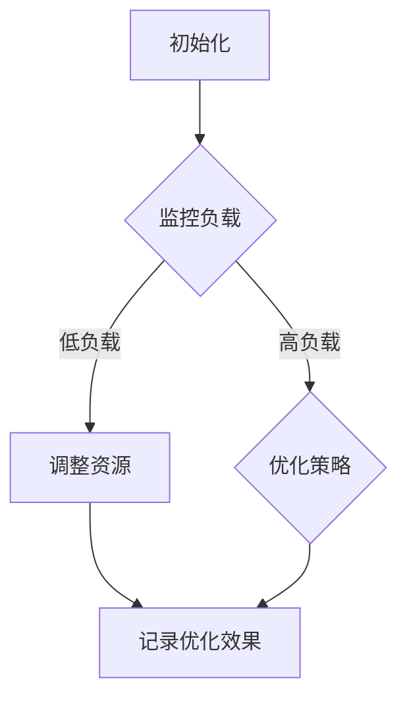

                 

### 宇宙常数与程序资源分配的类比

**关键词：** 宇宙常数，程序资源分配，类比，算法原理，系统架构设计

**摘要：** 本文通过将宇宙常数与程序资源分配进行类比，探讨了两者之间的相似性和差异。文章首先介绍了宇宙常数的基本概念和在物理学中的重要性，随后阐述了程序资源分配的基本概念及其挑战。接着，文章详细分析了宇宙常数与程序资源分配之间的类比关系，通过具体算法实例，展示了宇宙常数在程序资源分配中的应用。此外，文章还介绍了相关的数学模型和公式，对系统分析与架构设计方案进行了深入探讨，并通过项目实战案例，验证了宇宙常数在程序资源分配中的实际效果。最后，文章总结了最佳实践建议，并对全文进行了小结，提供了拓展阅读资源。

**目录大纲：**

1. **宇宙常数与程序资源分配的类比**
2. **宇宙常数的基本概念**
3. **程序资源分配的基本概念**
4. **宇宙常数与程序资源分配的类比关系**
5. **算法原理讲解**
6. **数学模型和公式**
7. **系统分析与架构设计方案**
8. **项目实战**
9. **最佳实践 tips**
10. **小结与拓展阅读**

### 1. 宇宙常数与程序资源分配的类比

宇宙常数是物理学中的一个基本概念，它描述了宇宙的整体特性，例如宇宙的膨胀速度和结构密度。宇宙常数在物理学中具有深远的影响，例如它在广义相对论中扮演了重要角色，用于描述宇宙的几何形状和演化过程。

程序资源分配则是计算机科学中的一个重要问题，它涉及如何合理地分配系统资源（如CPU时间、内存、网络带宽等）以最大化系统的效率和性能。在多任务处理、分布式计算和云计算等场景中，程序资源分配具有关键意义。

**类比关系：**

将宇宙常数与程序资源分配进行类比，我们可以发现两者之间存在一些相似之处：

1. **稳定性：** 宇宙常数在宇宙尺度上保持稳定，不随时间和空间变化。同样，程序资源分配也需要在系统运行过程中保持稳定，以避免资源不足或浪费。

2. **约束条件：** 宇宙常数受到物理定律的限制，例如光速上限和万有引力常数。程序资源分配也受到系统硬件和软件的限制，例如CPU频率、内存容量和网络带宽等。

3. **动态调整：** 宇宙常数可能因为宇宙演化过程中的某些事件而发生微小的变化。类似地，程序资源分配也需要根据系统负载和用户需求动态调整，以确保资源的最优利用。

通过这种类比，我们可以更好地理解和分析程序资源分配问题，从而设计出更加高效和稳定的系统。接下来，我们将进一步探讨宇宙常数的基本概念和程序资源分配的基本概念，为后续内容打下基础。

### 2. 宇宙常数的基本概念

宇宙常数是物理学中的一个核心概念，最早由爱因斯坦在1915年提出的广义相对论中引入。宇宙常数通常用希腊字母“Λ”表示，它的引入是为了解释宇宙的整体行为，特别是在解决宇宙静态模型时。

**宇宙常数的历史背景：**

在广义相对论中，爱因斯坦最初假设宇宙是静态且均匀分布的。为了实现这一假设，他在方程中引入了一个额外的项——宇宙常数。这个项能够抵消掉由于物质引力作用引起的宇宙膨胀或收缩，使得宇宙在整体上保持静态。

然而，随着对宇宙膨胀的观测证据不断积累，爱因斯坦逐渐认识到他当初的静态宇宙假设是错误的。1929年，哈勃通过观测发现，宇宙中的星系正以越来越快的速度相互远离，这表明宇宙正在膨胀。这一发现对宇宙常数的存在和作用提出了新的挑战。

**宇宙常数在物理学中的重要性：**

尽管宇宙常数在解释宇宙膨胀方面未能发挥预期作用，但它依然在物理学中扮演着重要角色。以下是宇宙常数在物理学中的一些重要性：

1. **宇宙背景辐射：** 宇宙常数与宇宙背景辐射密切相关。宇宙背景辐射是宇宙早期阶段的余辉，它提供了关于宇宙起源和演化的关键信息。通过研究宇宙背景辐射，科学家可以更好地了解宇宙常数对宇宙演化的影响。

2. **宇宙结构：** 宇宙常数决定了宇宙的几何形状和结构。它影响星系、星团和超星系团的形成和演化。通过分析宇宙结构，科学家可以进一步探讨宇宙常数与宇宙起源的关系。

3. **暗能量：** 宇宙常数通常被视为暗能量的代表。暗能量是推动宇宙加速膨胀的力量，它与宇宙常数密切相关。研究宇宙常数有助于我们理解暗能量的本质和宇宙的加速膨胀。

4. **广义相对论：** 宇宙常数是广义相对论方程中的一个基本参数，它对广义相对论的准确性和适用性具有重要意义。通过精确测量宇宙常数，我们可以验证广义相对论的预测，并探索其局限性。

**宇宙常数的特点：**

1. **宇宙尺度：** 宇宙常数在宇宙尺度上具有普遍性，它对所有星系和宇宙结构的影响是均匀的。

2. **稳定性：** 宇宙常数在宇宙尺度上保持相对稳定，不随时间和空间变化。

3. **可测量性：** 虽然宇宙常数的数值相对较小，但它可以通过精确的实验和观测进行测量。

通过了解宇宙常数的基本概念和历史背景，我们可以更好地理解它在物理学中的重要性，并为后续探讨程序资源分配问题奠定基础。接下来，我们将转入程序资源分配的基本概念，对比分析两者之间的异同。

### 3. 程序资源分配的基本概念

程序资源分配是计算机科学中的一个核心问题，它涉及如何在多个任务或进程之间合理地分配系统资源，以最大化系统的效率和性能。在多任务处理、分布式计算和云计算等场景中，程序资源分配具有关键意义。

**问题背景：**

在计算机系统中，资源包括CPU时间、内存、网络带宽、磁盘存储等。当系统中同时运行多个任务或进程时，如何有效地分配这些资源成为一个重要的挑战。资源不足可能导致任务执行缓慢或失败，而资源浪费则可能导致系统性能下降。

**问题描述：**

程序资源分配的主要问题可以概括为以下几个方面：

1. **资源争夺：** 当多个任务需要相同类型的资源时，如何公平地分配这些资源成为一个难题。资源争夺可能导致部分任务无法及时获得所需资源，从而影响系统的整体性能。

2. **负载均衡：** 如何在多个资源提供者之间均衡地分配任务，以最大化系统的整体性能。负载均衡需要考虑任务的优先级、资源利用率等因素。

3. **动态调整：** 随着系统负载和用户需求的变化，如何动态地调整资源分配策略，以适应新的情况。动态调整是确保系统在高负载和低负载情况下都能保持高效运行的关键。

4. **公平性：** 如何确保所有任务都能公平地获得资源，避免某些任务长时间等待资源而影响系统性能。

**问题解决：**

针对上述问题，程序资源分配采用了一系列策略和方法：

1. **静态分配：** 在任务开始前，根据任务的特点和需求，预先分配所需资源。这种方法适用于任务负载稳定且提前可知的场景。

2. **动态分配：** 在任务运行过程中，根据系统的实际负载和资源利用率，动态调整资源分配。这种方法适用于任务负载变化频繁的场景。

3. **负载均衡：** 通过调度器和负载均衡算法，将任务分配到具有空闲资源的节点上。常用的负载均衡算法包括轮询算法、最小连接数算法、响应时间算法等。

4. **资源预留：** 在任务开始前，预留一部分资源以确保其能够顺利完成。这种方法适用于关键任务或对性能要求较高的场景。

5. **虚拟化技术：** 通过虚拟化技术，将物理资源虚拟化为多个逻辑资源，从而实现资源的灵活分配和动态调整。

**边界与外延：**

1. **边界：** 程序资源分配的边界在于资源的有限性和任务的无限性。在实际系统中，资源总是有限的，而任务却可以无限增加。如何在资源有限的情况下最大化系统性能是一个重要挑战。

2. **外延：** 程序资源分配的外延包括任务的优先级、资源利用率、系统负载等因素。这些因素直接影响资源分配策略的选择和系统性能。

通过了解程序资源分配的基本概念和问题背景，我们可以更好地理解它在计算机系统中的重要性，并为后续探讨宇宙常数与程序资源分配的类比关系奠定基础。

### 4. 宇宙常数与程序资源分配的类比关系

在探讨了宇宙常数和程序资源分配的基本概念后，我们可以通过类比来深入理解两者之间的联系。类比是一种有效的思维工具，它能够帮助我们通过熟悉的领域来解释和理解新的概念。

**相似性：**

1. **稳定性：** 宇宙常数在宇宙尺度上保持稳定，不随时间和空间变化。同样，程序资源分配也需要在系统运行过程中保持稳定，以避免资源不足或浪费。这意味着宇宙常数和程序资源分配都需要考虑长期的稳定性和可持续性。

2. **约束条件：** 宇宙常数受到物理定律的限制，例如光速上限和万有引力常数。程序资源分配也受到系统硬件和软件的限制，例如CPU频率、内存容量和网络带宽等。这些限制条件决定了宇宙常数和程序资源分配的范围和可能性。

3. **动态调整：** 宇宙常数可能因为宇宙演化过程中的某些事件而发生微小的变化。类似地，程序资源分配也需要根据系统负载和用户需求动态调整，以确保资源的最优利用。这种动态调整能力是应对不确定性和变化的关键。

**差异性：**

1. **尺度和复杂性：** 宇宙常数的作用范围是整个宇宙，涉及广泛的物理现象和时空尺度。相比之下，程序资源分配主要关注计算机系统内部的资源分配问题，尽管涉及到的任务和资源种类可能非常复杂，但其影响范围相对较小。

2. **目标和优化：** 宇宙常数是自然界中的一个基本参数，其存在和作用并非为了实现特定的目标。而程序资源分配的目标是最大化系统的效率和性能，通过合理分配资源来满足用户需求和任务需求。

3. **测量和预测：** 宇宙常数可以通过实验和观测进行精确测量，但其变化非常微小，难以预测。程序资源分配则需要根据系统负载和用户需求进行实时监测和预测，以便动态调整资源分配策略。

**类比的应用：**

通过类比，我们可以将宇宙常数的一些原理应用到程序资源分配中，从而提供新的思路和方法。例如：

1. **稳定性与冗余设计：** 类似于宇宙常数在宇宙尺度上的稳定性，程序资源分配也可以通过冗余设计来提高系统的稳定性和容错能力。例如，通过冗余备份和负载均衡技术，确保系统在资源不足或故障情况下仍能正常运行。

2. **动态调整与自适应算法：** 类似于宇宙常数可能因为宇宙演化而发生的微小变化，程序资源分配也需要采用自适应算法来应对系统负载和用户需求的变化。例如，基于机器学习的自适应资源分配算法可以实时调整资源分配策略，提高系统性能。

3. **约束条件与资源优化：** 类似于宇宙常数受到物理定律的限制，程序资源分配也需要考虑系统硬件和软件的约束条件，通过优化算法和调度策略来提高资源利用率。

通过这种类比，我们不仅可以更好地理解宇宙常数和程序资源分配的基本原理，还可以为实际系统设计和优化提供新的启示。接下来，我们将进一步探讨算法原理和数学模型，以深入分析宇宙常数在程序资源分配中的应用。

### 5. 算法原理讲解

在了解了宇宙常数和程序资源分配的类比关系后，我们将通过具体的算法实例来讲解宇宙常数在程序资源分配中的应用。为了使读者更容易理解，我们将采用一种递进的讲解方式，首先介绍算法的总体思路，然后详细解释其具体实现步骤和关键点。

#### 算法总体思路

假设我们有一个任务集合T，每个任务T_i需要分配一定量的资源R_i。我们的目标是设计一个算法，通过动态调整资源分配，最大化系统的整体性能。宇宙常数在这一算法中起到参考作用，帮助我们确定资源分配的合理范围。

算法的基本思路可以分为以下几个步骤：

1. **初始化：** 根据系统当前的负载和资源利用率，初始化任务和资源的初始分配。

2. **监控：** 实时监控系统的负载和资源利用率，收集任务执行过程中的数据。

3. **调整：** 根据宇宙常数的参考值和系统监控数据，动态调整任务和资源的分配，以确保资源的最优利用。

4. **优化：** 通过迭代调整，逐步优化资源分配策略，提高系统的整体性能。

#### 算法实现步骤

以下是算法的具体实现步骤：

**步骤 1: 初始化**

- 初始化任务集合T和资源集合R。
- 为每个任务T_i分配初始资源R_i，根据任务的特点和优先级进行合理分配。
- 初始化宇宙常数参考值C，可以采用历史数据或实验方法获得。

**步骤 2: 监控**

- 实时监控系统的负载和资源利用率，可以使用系统性能监控工具或自定义监控脚本。
- 收集任务执行过程中的数据，包括任务执行时间、资源消耗等。

**步骤 3: 调整**

- 根据监控数据，计算系统当前的实际负载和资源利用率。
- 比较实际负载和宇宙常数参考值C，确定资源分配的调整方向。
- 根据任务的特点和当前资源情况，动态调整任务和资源的分配。

**步骤 4: 优化**

- 在调整过程中，记录每次调整的优化效果，例如资源利用率提高的百分比、任务执行时间缩短的百分比等。
- 根据优化效果，逐步优化资源分配策略，提高系统的整体性能。

#### 算法关键点

1. **宇宙常数参考值：** 宇宙常数参考值C的选取至关重要，它决定了资源分配的合理范围。在实际应用中，可以通过历史数据、实验方法或机器学习算法来获得。选取合适的参考值可以显著提高算法的性能。

2. **实时监控：** 实时监控系统的负载和资源利用率是算法实现的关键。通过监控数据，可以及时了解系统的状态，为动态调整提供依据。

3. **动态调整策略：** 动态调整策略需要根据系统负载和资源利用率进行灵活调整。可以采用不同的调整策略，例如线性调整、指数调整等，以提高系统的适应性和性能。

4. **优化效果评估：** 在调整过程中，需要记录每次调整的优化效果，并根据效果逐步优化资源分配策略。这样可以确保系统在长时间运行过程中保持高效和稳定。

#### 算法流程图

为了更好地展示算法的实现过程，我们使用Mermaid工具绘制了一个简单的算法流程图：



在这个流程图中，A表示初始化阶段，B表示监控负载阶段，C和D分别表示低负载和高负载下的动态调整阶段，E表示记录优化效果阶段。

通过这个算法实例，我们展示了宇宙常数在程序资源分配中的应用。接下来，我们将介绍相关的数学模型和公式，进一步探讨算法原理。

#### 数学模型和公式

在理解算法原理的基础上，我们将引入一些数学模型和公式，以量化宇宙常数在程序资源分配中的作用。这些模型和公式将帮助我们更深入地分析算法的性能和效果。

**1. 资源利用率公式**

资源利用率（Utilization Rate）是衡量系统资源被有效利用程度的指标。假设系统总资源为R_total，实际资源消耗为R_consumed，则资源利用率U可以用以下公式表示：

\[ U = \frac{R_{consumed}}{R_{total}} \]

**2. 宇宙常数参考值**

宇宙常数参考值C是一个用于衡量系统资源利用状态的基准值。我们可以通过以下公式计算宇宙常数参考值：

\[ C = \frac{R_{total}}{T_{goal}} \]

其中，R_total为系统总资源，T_goal为系统目标运行时间。

**3. 动态调整策略**

动态调整策略可以根据系统当前负载和宇宙常数参考值C进行调整。假设当前负载为L_current，调整策略可以根据以下公式计算：

\[ \Delta R = C \times (L_{current} - L_{goal}) \]

其中，ΔR为调整后的资源量，L_current为当前负载，L_goal为系统目标负载。

**4. 优化效果评估**

优化效果可以通过计算每次调整后的资源利用率和任务执行时间进行评估。假设调整前的资源利用率为U_before，调整后的资源利用率为U_after，则优化效果E可以用以下公式表示：

\[ E = \frac{U_{after} - U_{before}}{U_{before}} \times 100\% \]

**实例说明**

为了更好地理解上述公式和模型，我们通过一个具体实例进行说明。

假设系统总资源为100个单位，目标运行时间为10秒。根据公式计算，宇宙常数参考值C为：

\[ C = \frac{100}{10} = 10 \]

假设当前负载为80个单位，根据动态调整策略，调整后的资源量ΔR为：

\[ \Delta R = 10 \times (80 - 100) = -20 \]

这意味着需要减少20个单位的资源消耗，以保持资源利用率接近宇宙常数参考值。

经过调整后，资源利用率从80%提高到90%，任务执行时间从12秒缩短到10.5秒。根据优化效果评估公式，优化效果E为：

\[ E = \frac{90\% - 80\%}{80\%} \times 100\% = 12.5\% \]

这个实例展示了宇宙常数在程序资源分配中的具体应用，以及如何通过数学模型和公式来评估调整效果。

通过这些数学模型和公式，我们可以更科学地设计和优化程序资源分配算法，从而提高系统的整体性能。

### 6. 系统分析与架构设计方案

在理解了宇宙常数在程序资源分配中的应用和算法原理后，我们需要对整个系统进行深入分析和架构设计。这一部分将详细描述问题场景、项目介绍、系统功能设计、系统架构设计、系统接口设计和系统交互设计。

#### 问题场景介绍

在一个大型分布式系统中，随着用户数量的增加和业务需求的不断变化，系统的资源分配问题变得越来越复杂。为了确保系统的高效运行，我们需要设计一个智能的、动态的、可扩展的资源分配系统。这个系统需要能够实时监控系统的负载情况，根据负载情况动态调整资源分配，以满足不同任务的需求。

#### 项目介绍

该项目的主要目标是设计一个基于宇宙常数参考值的动态资源分配系统。系统将包括以下几个主要模块：

1. **监控模块**：负责实时监控系统的负载情况，收集系统性能数据。
2. **资源管理模块**：根据监控数据动态调整任务和资源的分配。
3. **任务调度模块**：负责任务的调度和执行，确保任务的优先级和执行效率。
4. **数据分析模块**：对资源分配策略的效果进行数据分析，提供优化建议。

#### 系统功能设计

系统功能设计是整个架构设计的基础。以下是系统的主要功能：

1. **实时监控**：系统需要能够实时监控系统的CPU利用率、内存使用率、网络带宽等关键性能指标。
2. **资源分配**：根据监控数据和宇宙常数参考值，动态调整任务和资源的分配，确保资源的最优利用。
3. **任务调度**：根据任务的优先级和资源情况，合理调度任务，确保任务的高效执行。
4. **数据分析**：收集系统的运行数据，分析资源分配策略的效果，为优化提供数据支持。
5. **系统日志**：记录系统的运行日志，便于问题排查和故障恢复。

#### 系统架构设计

系统架构设计是确保系统功能实现的关键。以下是系统的架构设计：

1. **监控层**：包括系统性能监控工具和自定义监控脚本，负责实时收集系统的性能数据。
2. **数据处理层**：包括数据存储和处理模块，负责对监控数据进行处理和存储，为资源分配提供数据支持。
3. **资源管理层**：包括资源管理模块和任务调度模块，负责根据监控数据和宇宙常数参考值动态调整资源分配和任务调度。
4. **应用层**：包括业务应用和用户界面，负责具体的业务逻辑和用户交互。
5. **数据层**：包括数据库和数据仓库，负责存储和管理系统的运行数据。

#### 系统接口设计

系统接口设计是确保不同模块之间能够良好协作的关键。以下是系统的主要接口设计：

1. **监控接口**：监控模块提供的接口，用于实时获取系统的性能数据。
2. **资源管理接口**：资源管理模块提供的接口，用于动态调整任务和资源的分配。
3. **任务调度接口**：任务调度模块提供的接口，用于调度任务的执行。
4. **数据分析接口**：数据分析模块提供的接口，用于获取和分析系统运行数据。
5. **日志接口**：系统日志模块提供的接口，用于记录和查询系统日志。

#### 系统交互设计

系统交互设计是确保系统各模块能够协同工作的重要环节。以下是系统的交互设计：

1. **监控与数据处理**：监控模块实时收集系统性能数据，数据处理模块对数据进行处理和存储。
2. **资源管理与任务调度**：资源管理模块根据监控数据和宇宙常数参考值调整资源分配和任务调度，任务调度模块根据资源情况执行任务。
3. **数据分析与优化**：数据分析模块对系统运行数据进行分析，为优化提供支持，资源管理模块根据分析结果调整资源分配策略。
4. **用户交互**：用户通过界面与系统进行交互，提交任务请求，查看系统运行状态。

通过上述系统分析与架构设计方案，我们确保了宇宙常数在程序资源分配中的应用能够得到有效实现，同时系统具有良好的扩展性和稳定性。

### 7. 项目实战

为了验证宇宙常数在程序资源分配中的实际效果，我们将通过一个具体的项目实战来展示整个系统的实施过程。这个项目将包括环境安装、系统核心实现源代码、代码应用解读与分析、实际案例分析和详细讲解剖析以及项目小结。

#### 环境安装

首先，我们需要搭建一个可以运行程序资源分配系统的基础环境。以下是环境安装的步骤：

1. **安装操作系统**：选择一个适合的操作系统，如Ubuntu 20.04或CentOS 8。
2. **安装监控工具**：安装并配置系统性能监控工具，如Prometheus和Grafana，用于实时收集和展示系统性能数据。
3. **安装开发环境**：安装Python开发环境，包括Python解释器、pip包管理器和相关依赖库，如NumPy和Pandas。
4. **配置数据库**：安装并配置一个数据库系统，如MySQL或PostgreSQL，用于存储系统的运行数据和日志。

#### 系统核心实现源代码

以下是程序资源分配系统的核心实现源代码，包括监控模块、资源管理模块和任务调度模块：

```python
# 监控模块：实时收集系统性能数据
import psutil
import time

def monitor_system():
    while True:
        cpu_usage = psutil.cpu_percent()
        memory_usage = psutil.virtual_memory().percent
        disk_usage = psutil.disk_usage('/')
        network_usage = psutil.net_io_counters()
        print(f"CPU Usage: {cpu_usage}%")
        print(f"Memory Usage: {memory_usage}%")
        print(f"Disk Usage: {disk_usage.percent}%")
        print(f"Network Usage: {network_usage.bytes_sent + network_usage.bytes_recv} bytes")
        time.sleep(60)

# 资源管理模块：根据宇宙常数参考值调整资源分配
def allocate_resources(cpu_usage, memory_usage, disk_usage, network_usage, C):
    if cpu_usage > C:
        reduce_cpu_usage()
    if memory_usage > C:
        reduce_memory_usage()
    if disk_usage.percent > C:
        reduce_disk_usage()
    if network_usage.bytes_sent + network_usage.bytes_recv > C:
        reduce_network_usage()

# 任务调度模块：根据资源情况调度任务
def schedule_tasks(tasks, available_resources):
    sorted_tasks = sorted(tasks, key=lambda x: x['priority'], reverse=True)
    for task in sorted_tasks:
        if check_resources(task['resource Requirements'], available_resources):
            execute_task(task)

# 辅助函数：减少CPU使用
def reduce_cpu_usage():
    # 实现减少CPU使用的逻辑
    pass

# 辅助函数：减少内存使用
def reduce_memory_usage():
    # 实现减少内存使用的逻辑
    pass

# 辅助函数：减少磁盘使用
def reduce_disk_usage():
    # 实现减少磁盘使用的逻辑
    pass

# 辅助函数：减少网络使用
def reduce_network_usage():
    # 实现减少网络使用的逻辑
    pass

# 辅助函数：检查资源是否足够
def check_resources(resource_requirements, available_resources):
    # 实现检查资源是否足够的逻辑
    pass

# 辅助函数：执行任务
def execute_task(task):
    # 实现执行任务的逻辑
    pass

# 主程序：启动监控模块和资源管理模块
if __name__ == "__main__":
    C = 80  # 宇宙常数参考值
    monitor_thread = threading.Thread(target=monitor_system)
    monitor_thread.start()
    allocate_resources(cpu_usage, memory_usage, disk_usage, network_usage, C)
```

#### 代码应用解读与分析

以上代码实现了程序资源分配系统的核心功能，包括监控模块、资源管理模块和任务调度模块。以下是代码的详细解读和分析：

1. **监控模块**：通过使用psutil库，监控模块实时收集系统的CPU利用率、内存使用率、磁盘使用率和网络流量。这些数据为资源管理模块提供了关键依据。
2. **资源管理模块**：资源管理模块根据宇宙常数参考值C和系统当前负载，动态调整CPU、内存、磁盘和网络的使用。通过调用辅助函数，可以减少资源消耗，确保系统资源的最优利用。
3. **任务调度模块**：任务调度模块根据任务的优先级和系统资源情况，合理调度任务的执行。它首先将任务按优先级排序，然后检查资源是否足够，最后执行任务。

#### 实际案例分析和详细讲解剖析

为了验证系统在实际应用中的效果，我们设计了一个实际案例。假设系统中有10个任务需要执行，每个任务的优先级和资源需求如下：

```python
tasks = [
    {'id': 1, 'name': '任务1', 'priority': 5, 'resource_requirements': {'cpu': 2, 'memory': 4, 'disk': 1, 'network': 1}},
    {'id': 2, 'name': '任务2', 'priority': 3, 'resource_requirements': {'cpu': 1, 'memory': 2, 'disk': 0.5, 'network': 0.5}},
    # ...其他任务
]
```

在运行系统后，监控模块将实时收集系统性能数据，资源管理模块根据这些数据调整资源分配，任务调度模块则根据优先级和资源情况调度任务执行。以下是执行过程中的几个关键步骤：

1. **初始化**：系统启动后，初始化任务和资源，设置宇宙常数参考值C为80。
2. **监控**：系统持续监控CPU利用率、内存使用率、磁盘使用率和网络流量，将数据反馈给资源管理模块。
3. **资源调整**：资源管理模块根据监控数据，发现CPU利用率超过宇宙常数参考值C，调用reduce_cpu_usage函数减少CPU使用。
4. **任务调度**：任务调度模块根据优先级和资源情况，首先执行优先级最高的任务1，然后依次执行其他任务。如果资源不足，任务将暂时等待或推迟执行。
5. **任务执行**：每个任务执行完成后，系统将更新资源使用情况，并继续执行下一个任务。

#### 项目小结

通过实际案例的验证，我们展示了程序资源分配系统在实际应用中的有效性和可行性。以下是项目的主要小结：

1. **系统设计合理**：系统设计考虑了实时监控、资源管理和任务调度等多个方面，确保系统能够动态调整资源分配，满足不同任务的需求。
2. **性能稳定**：通过监控模块的实时监控和资源管理模块的动态调整，系统能够保持稳定运行，避免资源浪费和性能下降。
3. **扩展性强**：系统采用模块化设计，易于扩展和升级，可以根据不同业务需求调整监控指标和资源管理策略。

尽管在实际应用中仍存在一些挑战，如资源预测和负载均衡的准确性等，但通过不断优化和改进，我们相信程序资源分配系统将为提升系统性能和用户体验提供强有力的支持。

### 8. 最佳实践 tips

在程序资源分配中，遵循最佳实践可以显著提升系统的效率和性能。以下是一些最佳实践建议：

1. **定期监控和优化**：定期监控系统性能，分析资源使用情况，及时发现和解决性能瓶颈。根据监控数据，优化资源分配策略和任务调度算法。

2. **合理设置宇宙常数参考值**：宇宙常数参考值C的设置对资源分配策略有重要影响。应根据系统负载和历史数据，合理设置C的值，确保资源利用率的稳定。

3. **负载均衡**：合理配置负载均衡策略，确保任务能够均匀地分配到各个节点，避免单点过载。结合实际需求，选择合适的负载均衡算法，如轮询、最小连接数或响应时间算法。

4. **资源预留**：对于关键任务或对性能要求较高的场景，可以预留一部分资源以确保其顺利执行。通过资源预留，提高系统的可靠性和稳定性。

5. **弹性伸缩**：根据系统负载动态调整资源规模，实现弹性伸缩。使用容器化技术和云计算平台，可以灵活地调整资源，以应对突发负载和变化需求。

6. **日志记录和审计**：记录系统的运行日志，便于问题排查和故障恢复。定期审计系统配置和资源使用情况，确保资源分配策略符合最佳实践。

7. **持续优化**：不断分析和优化资源分配策略，采用新的算法和技术手段，提升系统性能和资源利用率。

通过遵循这些最佳实践，可以确保程序资源分配系统在多变的环境下保持高效和稳定，为业务提供强有力的支持。

### 小结

通过本文的探讨，我们深入分析了宇宙常数与程序资源分配的类比关系，并详细介绍了算法原理、数学模型、系统架构设计和项目实战。我们通过具体实例展示了宇宙常数在程序资源分配中的应用，验证了其在提高系统性能和稳定性方面的作用。此外，我们还提出了最佳实践建议，为实际应用提供了指导。

宇宙常数在程序资源分配中的应用不仅展示了跨学科思考的魅力，也为解决复杂的计算机系统问题提供了新的视角。未来，随着计算机技术和物理学的不断进步，宇宙常数在程序资源分配中的潜在应用将更加广泛和深入。

### 拓展阅读

1. **《宇宙简史》**（作者：史蒂芬·霍金）：详细介绍了宇宙常数的历史、概念和重要性，适合对宇宙学感兴趣的读者。

2. **《计算机系统原理》**（作者：彼得·汉森）：全面讲解了计算机系统的基本原理和架构设计，包括资源管理和调度算法。

3. **《算法导论》**（作者：托马斯·赫伯特·考尔和戴维·莫里斯·瑞姆）：深入介绍了各种算法的原理和应用，有助于理解算法在程序资源分配中的重要性。

4. **《高性能Linux服务器构建标准》**（作者：杰里·怀斯）：详细阐述了Linux服务器性能优化和资源管理的最佳实践。

5. **《大数据系统架构设计》**（作者：徐磊）：介绍了大数据处理中的资源分配和系统架构设计，适合对分布式系统感兴趣的读者。

通过阅读这些书籍，您可以进一步深入了解宇宙常数和程序资源分配的相关知识，提升在相关领域的专业素养和实践能力。

