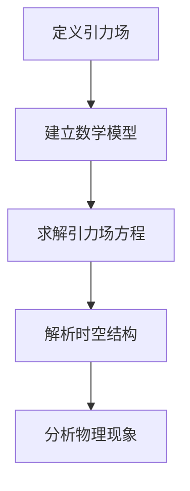
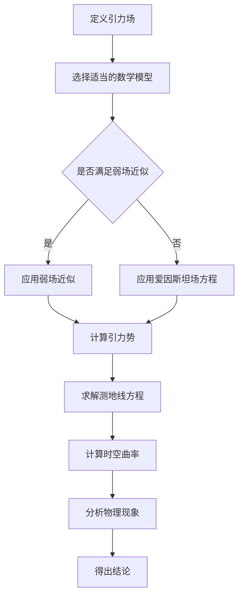
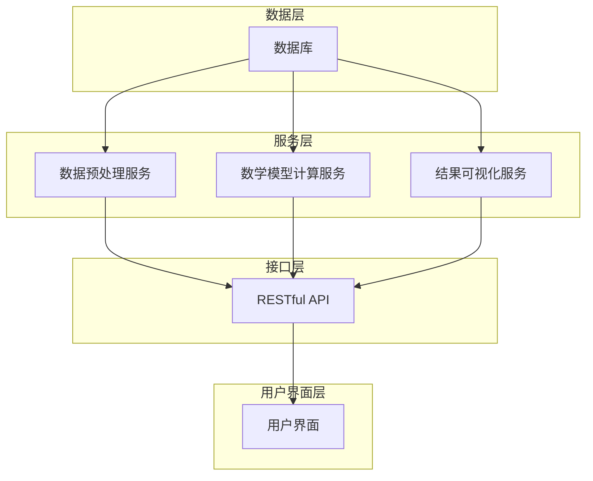
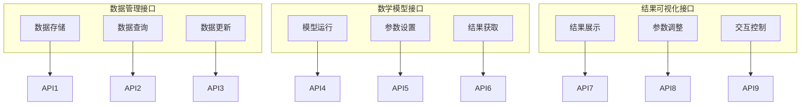
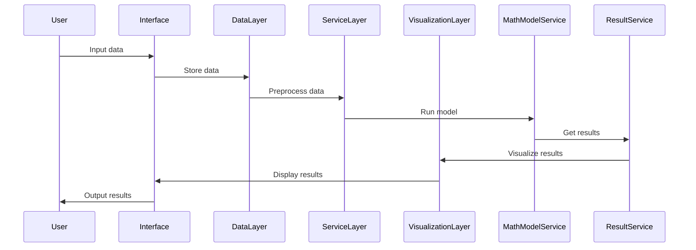
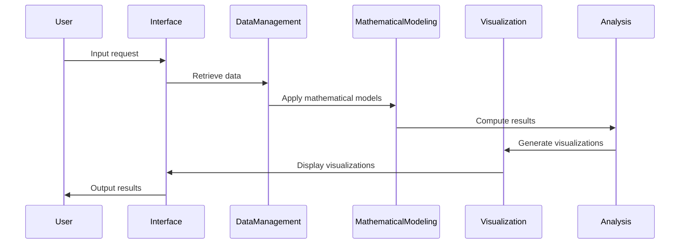

                 

## 《宇宙的数学化结构与运作》

### 关键词：宇宙数学化结构、时空观念、算法原理、系统架构设计、项目实战

#### 摘要：
本文将带领读者深入探索宇宙的数学化结构与运作。通过对宇宙几何结构、时空观念等核心概念的深入解析，结合具体的算法原理、系统架构设计以及项目实战案例，我们将揭示宇宙运作背后的数学规律，探讨人类在理解宇宙过程中所面临的挑战和机遇。通过本文的阅读，读者将获得对宇宙数学化结构的全面认识，并了解如何运用数学工具和算法来揭示宇宙的运作机制。

### 目录大纲设计思路

1. **明确核心概念和背景介绍**：
   - 首先，为全书提供一个背景介绍，概述宇宙的数学化结构和运作的核心概念。
   - 阐述问题背景、问题描述、问题解决、边界与外延，以及核心要素组成。

2. **核心概念与联系**：
   - 引入宇宙数学化结构的核心概念，如宇宙的几何结构、时空观念等。
   - 利用表格对比不同概念的属性特征，以及ER实体关系图来展示概念之间的联系。

3. **算法原理讲解**：
   - 设计算法mermaid流程图，用python源代码详细阐述算法原理。
   - 引入数学模型和公式，进行详细讲解和举例说明。

4. **系统分析与架构设计方案**：
   - 介绍宇宙数学化结构分析的问题场景和项目背景。
   - 设计领域模型类图、系统架构图、系统接口设计和系统交互序列图。

5. **项目实战**：
   - 演示环境安装和系统核心实现源代码。
   - 对代码进行解读与分析，提供实际案例分析和详细讲解。

6. **最佳实践 tips、小结、注意事项、拓展阅读**：
   - 总结书中的关键点，提供最佳实践建议。
   - 强调注意事项，为读者提供拓展阅读资源。

### 目录大纲

```markdown
# 《宇宙的数学化结构与运作》目录大纲

## 第一部分：宇宙的数学化结构概述

### 1.1 宇宙的数学化背景
#### 1.1.1 宇宙的几何结构
#### 1.1.2 时空观念与数学模型

### 1.2 数学化结构的核心理念
#### 1.2.1 数学化宇宙的定义
#### 1.2.2 数学化宇宙的核心要素

### 1.3 数学化结构与宇宙运作
#### 1.3.1 数学化结构对宇宙运作的影响
#### 1.3.2 数学化结构的运作机制

## 第二部分：宇宙数学化结构的核心概念

### 2.1 宇宙的几何结构分析
#### 2.1.1 宇宙膨胀与几何形态
#### 2.1.2 宇宙的曲率与维度

### 2.2 时空观念的数学表达
#### 2.2.1 时空的相对性
#### 2.2.2 广义相对论与数学模型

### 2.3 数学化结构的特征对比
#### 2.3.1 不同宇宙模型的比较
#### 2.3.2 数学化结构的特征表格

### 2.4 宇宙数学化结构的ER图解
#### 2.4.1 ER图的基本概念
#### 2.4.2 宇宙数学化结构的ER图

## 第三部分：宇宙数学化结构的算法原理

### 3.1 宇宙数学化结构算法概述
#### 3.1.1 算法的基本原理
#### 3.1.2 算法的发展历程

### 3.2 算法mermaid流程图
#### 3.2.1 流程图设计
#### 3.2.2 流程图详解

### 3.3 算法Python源代码实现
#### 3.3.1 源代码结构
#### 3.3.2 源代码解读

### 3.4 数学模型与公式
#### 3.4.1 数学模型的定义
#### 3.4.2 公式推导与讲解

### 3.5 举例说明
#### 3.5.1 实例分析
#### 3.5.2 结果解释

## 第四部分：宇宙数学化结构的系统分析与架构设计

### 4.1 问题场景介绍
#### 4.1.1 宇宙数学化结构分析的场景
#### 4.1.2 项目背景介绍

### 4.2 系统功能设计
#### 4.2.1 领域模型类图设计
#### 4.2.2 功能模块划分

### 4.3 系统架构设计
#### 4.3.1 系统架构图
#### 4.3.2 架构设计原则

### 4.4 系统接口设计
#### 4.4.1 接口规范
#### 4.4.2 接口实现

### 4.5 系统交互序列图
#### 4.5.1 序列图设计
#### 4.5.2 交互流程解析

## 第五部分：项目实战

### 5.1 环境安装与配置
#### 5.1.1 环境搭建步骤
#### 5.1.2 配置文件说明

### 5.2 系统核心实现
#### 5.2.1 源代码实现
#### 5.2.2 核心代码解读

### 5.3 代码应用解读
#### 5.3.1 代码应用场景
#### 5.3.2 代码分析

### 5.4 实际案例分析
#### 5.4.1 案例背景
#### 5.4.2 案例分析

### 5.5 项目小结
#### 5.5.1 项目总结
#### 5.5.2 项目展望

## 第六部分：最佳实践与拓展

### 6.1 最佳实践 tips
#### 6.1.1 实践经验分享
#### 6.1.2 常见问题解答

### 6.2 小结与展望
```

通过以上目录大纲的设计，本文将为读者提供一个系统、全面且易于理解的宇宙数学化结构与运作的学习路径。接下来，我们将逐步深入各个部分，详细解析宇宙数学化结构的各个方面。首先，我们将从宇宙的数学化背景开始，阐述宇宙几何结构、时空观念等核心概念，为后续内容的探讨奠定基础。

### 第一部分：宇宙的数学化结构概述

宇宙作为人类认知的极限，一直以来都吸引着无数科学家的研究和探索。随着科学技术的发展，人类对宇宙的认识逐渐深入，从最初的直观观察，到如今借助各种先进的观测工具，我们对宇宙的了解已经达到了前所未有的高度。然而，宇宙的奥秘远远不止于此。在探索宇宙的过程中，科学家们发现，宇宙的结构和运作可以通过数学语言进行描述，从而揭示宇宙背后的规律。这一发现标志着宇宙数学化结构的兴起。

#### 1.1 宇宙的数学化背景

宇宙的数学化背景可以追溯到20世纪初。当时，爱因斯坦提出了广义相对论，这一理论将引力视为时空的几何性质，从而将宇宙的研究从物理学领域扩展到了数学领域。广义相对论的提出，不仅改变了人类对宇宙的认识，也为宇宙数学化结构的形成奠定了基础。随后，许多科学家开始致力于将宇宙的各种现象和规律用数学语言进行表达，形成了宇宙数学化结构的研究方向。

宇宙的几何结构是宇宙数学化结构的重要组成部分。根据广义相对论，宇宙的几何结构不仅包括三维空间，还包括时间维度。这就意味着宇宙是一个四维的几何空间。宇宙的几何结构可以通过各种数学工具进行描述，如黎曼几何、张量分析等。这些数学工具为我们理解宇宙的膨胀、星系分布、黑洞等复杂现象提供了有力支持。

#### 1.1.1 宇宙的几何结构

宇宙的几何结构是宇宙数学化结构的核心概念之一。广义相对论告诉我们，引力是由于物质对时空的弯曲而产生的。这意味着宇宙的几何结构可以用来描述引力场的性质。宇宙的几何结构可以分为以下几个层次：

1. **平坦宇宙**：当宇宙的曲率半径远大于宇宙尺度时，宇宙可以近似为平坦的。在这种情况下，宇宙的几何结构可以用欧氏几何进行描述。

2. **闭合宇宙**：当宇宙的曲率半径小于宇宙尺度时，宇宙是闭合的。这种宇宙的几何结构可以用球面几何进行描述。

3. **开放宇宙**：当宇宙的曲率半径大于宇宙尺度时，宇宙是开放的。这种宇宙的几何结构可以用双曲几何进行描述。

宇宙的几何结构对宇宙的膨胀和星系分布有着重要影响。根据宇宙背景辐射的观测数据，我们可以推断出宇宙的几何结构。这为我们理解宇宙的起源和演化提供了重要的线索。

#### 1.1.2 时空观念与数学模型

时空观念是宇宙数学化结构的另一个核心概念。爱因斯坦的狭义相对论告诉我们，时间和空间是相互关联的。在狭义相对论中，时空被描述为一个四维的时空连续体。在这个连续体中，物体的运动可以通过一个称为“世界线”的数学曲线进行描述。

在广义相对论中，时空观念得到了进一步的发展。广义相对论将引力视为时空的几何性质，从而将时空视为一个弯曲的四维几何空间。在这个空间中，物体的运动可以通过一个称为“测地线”的数学曲线进行描述。

为了描述时空的几何性质，科学家们引入了各种数学模型，如黎曼几何、张量分析等。这些数学模型为我们理解宇宙的膨胀、引力波、黑洞等复杂现象提供了有力工具。

#### 1.2 数学化结构的核心理念

宇宙数学化结构的核心理念在于将宇宙的各种现象和规律用数学语言进行表达，从而揭示宇宙背后的规律。这一理念的提出，不仅为宇宙研究提供了新的视角，也为数学与物理学的交叉研究提供了新的动力。

宇宙数学化结构的核心要素包括：

1. **几何结构**：描述宇宙的空间几何性质，如曲率、维度等。
2. **时空观念**：描述宇宙的时空连续体性质，如相对性、弯曲等。
3. **数学模型**：描述宇宙的各种物理现象，如引力、膨胀等。

这些核心要素共同构成了宇宙数学化结构的理论基础，为我们理解宇宙的运作提供了有力支持。

#### 1.3 数学化结构与宇宙运作

数学化结构对宇宙运作有着深远的影响。通过对宇宙数学化结构的深入分析，我们可以揭示宇宙的运作机制，理解宇宙的起源和演化。

首先，宇宙的数学化结构揭示了宇宙的膨胀机制。根据宇宙背景辐射的观测数据，我们可以推断出宇宙的膨胀速度和膨胀历史。这为我们理解宇宙的起源提供了重要线索。

其次，宇宙的数学化结构揭示了宇宙中的引力现象。引力是宇宙中最重要的力之一，它影响着星系的分布、行星的运动等。通过对宇宙数学化结构的分析，我们可以揭示引力的本质，从而更好地理解宇宙的运作。

最后，宇宙的数学化结构还为宇宙中的其他复杂现象提供了解释。如黑洞、引力波、宇宙背景辐射等，都可以通过数学化结构进行分析和解释。

总之，宇宙的数学化结构为我们理解宇宙的运作提供了有力工具。通过对宇宙数学化结构的深入分析，我们可以揭示宇宙的奥秘，探索宇宙的边界。

### 总结

宇宙的数学化结构是宇宙研究中的一个重要方向。通过对宇宙几何结构、时空观念等核心概念的深入解析，我们可以揭示宇宙的运作机制，理解宇宙的起源和演化。宇宙数学化结构的核心理念在于将宇宙的各种现象和规律用数学语言进行表达，从而揭示宇宙背后的规律。这一理念为我们理解宇宙提供了新的视角，也为数学与物理学的交叉研究提供了新的动力。

在接下来的部分，我们将进一步探讨宇宙数学化结构的核心概念，如宇宙的几何结构分析、时空观念的数学表达等。通过这些内容的深入探讨，我们将更好地理解宇宙的数学化结构，为后续内容的分析奠定基础。

---

在上一部分，我们介绍了宇宙的数学化结构的背景和核心理念。接下来，我们将深入探讨宇宙数学化结构的核心概念，包括宇宙的几何结构和时空观念。通过对这些核心概念的详细分析，我们将更好地理解宇宙的数学化结构。

### 第二部分：宇宙数学化结构的核心概念

宇宙的数学化结构涉及到许多复杂的概念和理论。在本部分中，我们将逐步介绍这些核心概念，包括宇宙的几何结构分析、时空观念的数学表达等。通过这些核心概念的探讨，我们将为后续内容的分析奠定基础。

#### 2.1 宇宙的几何结构分析

宇宙的几何结构是宇宙数学化结构的重要组成部分。根据广义相对论，宇宙的几何结构不仅包括三维空间，还包括时间维度，形成一个四维的时空结构。宇宙的几何结构可以通过多种数学工具进行描述和分析，如黎曼几何、张量分析等。

##### 2.1.1 宇宙膨胀与几何形态

宇宙的膨胀是宇宙几何结构的一个显著特征。根据宇宙背景辐射的观测数据，科学家们发现宇宙正在以加速度膨胀。宇宙的膨胀可以通过哈勃定律进行描述，该定律表明宇宙的膨胀速度与宇宙尺度成正比。

为了描述宇宙的膨胀，科学家们提出了多种宇宙模型，如弗里德曼-勒梅特-罗伯逊-沃尔克（FLRW）度规。FLRW度规假设宇宙是一个均匀且各向同性的膨胀球体。这个模型可以用来描述宇宙的膨胀历史和未来演化。

宇宙的几何形态与膨胀密切相关。根据宇宙的膨胀速率和膨胀历史，科学家们推测宇宙可能具有不同的几何形态。例如，如果宇宙的膨胀速度始终小于临界速度，宇宙可能是闭合的，形成一个类似于三维球体的结构。如果宇宙的膨胀速度超过临界速度，宇宙可能是开放的，形成一个类似于三维平面的结构。如果宇宙的膨胀速度恰好等于临界速度，宇宙可能是平坦的。

##### 2.1.2 宇宙的曲率与维度

宇宙的曲率是宇宙几何结构的另一个关键概念。宇宙的曲率可以通过宇宙的膨胀历史和物质分布进行推断。宇宙的曲率可以影响宇宙的几何形态和演化过程。

宇宙的曲率与维度密切相关。根据广义相对论，宇宙是一个四维的时空结构，包括三个空间维度和一个时间维度。这个四维时空结构可以被描述为一个弯曲的几何空间。

宇宙的维度对宇宙的膨胀和演化有重要影响。例如，三维空间中的宇宙膨胀可以导致星系之间的距离增加，而四维时空中的宇宙膨胀则可能导致时空曲率的增加，从而影响宇宙的几何形态和演化。

##### 2.1.3 宇宙模型与几何结构

科学家们提出了多种宇宙模型来描述宇宙的几何结构。这些宇宙模型基于不同的假设和观测数据，如弗里德曼-勒梅特-罗伯逊-沃尔克（FLRW）模型、德西特模型、卡特尔模型等。

FLRW模型是一种最常用的宇宙模型，它假设宇宙是均匀且各向同性的。这个模型可以用来描述宇宙的膨胀历史和未来演化。德西特模型是一种特殊类型的FLRW模型，它假设宇宙是静态的，没有膨胀。卡特尔模型是一种基于量子引力的宇宙模型，它假设宇宙是动态的，具有多个维度。

这些宇宙模型为我们提供了不同的视角来理解宇宙的几何结构。通过对这些宇宙模型的分析，科学家们可以推断出宇宙的几何形态和演化过程。

#### 2.2 时空观念的数学表达

时空观念是宇宙数学化结构的另一个核心概念。根据广义相对论，时间和空间是相互关联的，形成一个四维的时空结构。时空观念的数学表达涉及多种数学工具和理论。

##### 2.2.1 时空的相对性

时空的相对性是狭义相对论的一个核心概念。根据狭义相对论，时间和空间是相对的，而不是绝对的。这意味着不同观察者可能会观察到不同的时间和空间度量。

时空相对性的数学表达涉及洛伦兹变换。洛伦兹变换是一种描述不同惯性参考系之间的时间和空间关系的数学公式。洛伦兹变换可以帮助我们理解不同惯性参考系中的时间和空间度量。

##### 2.2.2 广义相对论与数学模型

广义相对论是一种描述引力和宇宙几何结构的理论。在广义相对论中，引力被描述为时空的弯曲。这个理论引入了曲率张量和其他数学工具来描述时空的几何性质。

广义相对论的数学表达涉及曲率张量、黎曼曲率张量等。曲率张量是描述时空弯曲的数学工具，而黎曼曲率张量则是描述空间弯曲的数学工具。

通过广义相对论，我们可以将时空观念与引力现象联系起来。例如，黑洞和引力波可以通过广义相对论的数学模型进行描述。

##### 2.2.3 时序和因果律

时序和因果律是时空观念中的两个重要概念。时序是指事件在时间中的顺序，而因果律是指因果关系。

在狭义相对论中，时序和因果律是相对的。这意味着不同惯性参考系中的时序和因果律可能会有所不同。然而，在广义相对论中，时序和因果律仍然保持一致。

时序和因果律的数学表达涉及光锥和事件视界。光锥是描述事件在时空中的可视范围的数学工具，而事件视界则是描述黑洞的数学边界。

通过这些数学工具和理论，我们可以更好地理解时空观念，并探索宇宙的几何结构和引力现象。

#### 2.3 数学化结构的特征对比

为了更好地理解宇宙数学化结构的特征，我们可以对不同宇宙模型进行对比。

##### 2.3.1 不同宇宙模型的比较

不同的宇宙模型具有不同的特征和假设。例如，FLRW模型假设宇宙是均匀且各向同性的，而德西特模型假设宇宙是静态的。这些模型可以通过不同的数学模型和假设进行描述。

通过对比不同宇宙模型，我们可以发现它们的共同点和差异。例如，FLRW模型可以用来描述宇宙的膨胀历史，而德西特模型可以用来描述宇宙的静态结构。

##### 2.3.2 数学化结构的特征表格

为了更清晰地展示宇宙数学化结构的特征，我们可以创建一个特征表格。这个表格可以列出不同宇宙模型的主要特征，如几何形态、维度、膨胀历史等。

以下是宇宙数学化结构特征表格的一个示例：

| 宇宙模型 | 几何形态 | 维度 | 膨胀历史 |  
|----------|---------|-----|---------|  
| FLRW模型 | 膨胀球体 | 4维 | 加速度膨胀 |  
| 德西特模型 | 静态球体 | 4维 | 无膨胀 |  
| 卡特尔模型 | 动态超多维 | 多维 | 非均匀膨胀 |

通过这个特征表格，我们可以更好地理解不同宇宙模型的特点，并对比它们的异同。

##### 2.3.3 数学化结构的ER图解

为了进一步展示宇宙数学化结构的特征和联系，我们可以使用ER图解。ER图（实体关系图）是一种用于描述实体之间关系的图形表示方法。

以下是宇宙数学化结构的ER图解的一个示例：

```mermaid
erDiagram
  ExpansionModel ||--|{ UniverseGeometry }
  UniverseGeometry ||--|{ UniverseDimension }
  UniverseDimension ||--|{ ExpansionHistory }
```

在这个ER图解中，我们定义了三个实体：ExpansionModel（膨胀模型）、UniverseGeometry（宇宙几何）和UniverseDimension（宇宙维度）。这些实体之间存在联系，如膨胀模型与宇宙几何之间的联系，宇宙几何与宇宙维度之间的联系等。

通过ER图解，我们可以更直观地理解宇宙数学化结构的特征和联系。

#### 2.4 宇宙数学化结构的ER图解

为了更好地理解宇宙数学化结构的特征和联系，我们可以使用ER图（实体关系图）进行展示。ER图是一种用于描述实体之间关系的图形表示方法，它可以帮助我们清晰地展示宇宙数学化结构中的各个概念及其相互关系。

##### 2.4.1 ER图的基本概念

ER图包括三个主要部分：实体（Entity）、属性（Attribute）和关系（Relationship）。实体是ER图中的基本单位，表示一个具体的事物或概念；属性是实体的特征或属性，用于描述实体的属性；关系是实体之间的关联，表示实体之间的相互作用。

在宇宙数学化结构的ER图中，我们可以定义以下实体：

1. **宇宙模型（UniverseModel）**：表示不同的宇宙模型，如FLRW模型、德西特模型等。
2. **宇宙几何（UniverseGeometry）**：表示宇宙的几何形态，如膨胀球体、静态球体等。
3. **宇宙维度（UniverseDimension）**：表示宇宙的维度，如三维空间、四维时空等。
4. **膨胀历史（ExpansionHistory）**：表示宇宙的膨胀历史，如加速度膨胀、无膨胀等。

这些实体之间存在以下关系：

1. **宇宙模型与宇宙几何**：每个宇宙模型都对应一个宇宙几何形态。
2. **宇宙几何与宇宙维度**：每个宇宙几何形态都对应一个宇宙维度。
3. **宇宙维度与膨胀历史**：每个宇宙维度都对应一个膨胀历史。

以下是宇宙数学化结构的ER图解示例：

```mermaid
erDiagram
  UniverseModel ||--|{ UniverseGeometry } "模型对应几何"
  UniverseGeometry ||--|{ UniverseDimension } "几何对应维度"
  UniverseDimension ||--|{ ExpansionHistory } "维度对应膨胀历史"
```

在这个ER图解中，实体通过直线连接，表示它们之间的联系。实体之间的箭头表示关系的方向。例如，宇宙模型与宇宙几何之间的箭头表示宇宙模型对应一个宇宙几何形态。

##### 2.4.2 宇宙数学化结构的ER图

为了更全面地展示宇宙数学化结构的ER图，我们可以将上述实体和关系进行详细描述。以下是宇宙数学化结构的ER图：

```mermaid
erDiagram
  UniverseModel ||--|{ UniverseGeometry } "模型对应几何"
  UniverseGeometry ||--|{ UniverseDimension } "几何对应维度"
  UniverseGeometry ||--|{ ExpansionHistory } "几何对应膨胀历史"
  UniverseDimension ||--|{ SpaceDimension } "维度对应空间维度"
  UniverseDimension ||--|{ TimeDimension } "维度对应时间维度"
  ExpansionHistory ||--|{ ExpansionRate } "膨胀历史对应膨胀率"
  ExpansionHistory ||--|{ ExpansionHistory } "膨胀历史对应历史数据"
```

在这个ER图中，我们可以看到：

1. **宇宙模型（UniverseModel）**：表示不同的宇宙模型，如FLRW模型、德西特模型等。
2. **宇宙几何（UniverseGeometry）**：表示宇宙的几何形态，如膨胀球体、静态球体等。
3. **宇宙维度（UniverseDimension）**：表示宇宙的维度，如三维空间、四维时空等。
4. **膨胀历史（ExpansionHistory）**：表示宇宙的膨胀历史，如加速度膨胀、无膨胀等。
5. **空间维度（SpaceDimension）**：表示宇宙的空间维度，如三维空间。
6. **时间维度（TimeDimension）**：表示宇宙的时间维度，如四维时空。
7. **膨胀率（ExpansionRate）**：表示宇宙的膨胀速率。
8. **历史数据（ExpansionHistory）**：表示宇宙膨胀的历史数据。

通过这个ER图，我们可以清晰地展示宇宙数学化结构中的各个概念及其相互关系。这个ER图不仅帮助我们理解宇宙数学化结构的基本概念，也为后续的分析和设计提供了重要参考。

### 总结

在本部分中，我们详细介绍了宇宙数学化结构的核心概念，包括宇宙的几何结构分析、时空观念的数学表达等。通过对这些核心概念的深入探讨，我们更好地理解了宇宙的数学化结构。宇宙的几何结构通过多种数学工具进行描述，如黎曼几何、张量分析等。时空观念通过广义相对论进行表达，揭示了时间和空间的相对性。通过对比不同宇宙模型，我们可以更全面地理解宇宙的数学化结构。最后，我们使用ER图解展示了宇宙数学化结构中的各个概念及其相互关系。

在下一部分，我们将深入探讨宇宙数学化结构的算法原理。通过具体的算法原理讲解，我们将进一步揭示宇宙运作的数学规律。

### 第三部分：宇宙数学化结构的算法原理

宇宙的数学化结构为我们提供了理解宇宙运作的数学工具。在这一部分，我们将详细探讨宇宙数学化结构的算法原理。这些算法不仅帮助我们解析宇宙的几何结构和时空观念，还为我们提供了一种方法来预测和解释宇宙中的各种现象。

#### 3.1 宇宙数学化结构算法概述

宇宙数学化结构的算法原理主要基于广义相对论和量子力学。这些算法的核心思想是将宇宙中的物理现象转化为数学问题，并通过求解数学方程来揭示宇宙的运作机制。下面，我们将介绍一些关键的算法原理。

##### 3.1.1 算法的基本原理

宇宙数学化结构算法的基本原理可以概括为以下几点：

1. **引力场方程**：引力场方程是广义相对论的核心，它描述了物质分布对时空弯曲的影响。通过求解引力场方程，我们可以获得宇宙的几何结构，进而分析宇宙中的物理现象。

2. **膨胀模型**：膨胀模型用于描述宇宙的膨胀历史。通过分析宇宙背景辐射和其他观测数据，我们可以推断出宇宙的膨胀速率和膨胀历史，从而预测宇宙的未来演化。

3. **量子场论**：量子场论是量子力学与场论的结合，用于描述宇宙中的量子现象。通过量子场论，我们可以分析黑洞、引力波等复杂的物理现象。

##### 3.1.2 算法的发展历程

宇宙数学化结构的算法发展经历了多个阶段。以下是几个重要的发展历程：

1. **广义相对论**：20世纪初，爱因斯坦提出了广义相对论，这一理论奠定了宇宙数学化结构的基础。

2. **膨胀模型**：20世纪40年代，勒梅特、罗伯逊和沃尔克提出了FLRW模型，这是一种描述宇宙膨胀的数学模型。

3. **量子场论**：20世纪50年代，海森堡和费曼等科学家提出了量子场论，这一理论为理解宇宙中的量子现象提供了新的工具。

4. **黑洞物理学**：20世纪70年代，霍金和彭罗斯等人提出了关于黑洞的物理模型，这些模型揭示了黑洞的几何结构和物理特性。

#### 3.2 算法mermaid流程图

为了更好地理解宇宙数学化结构的算法原理，我们可以使用mermaid流程图来展示算法的流程和步骤。下面是一个简单的mermaid流程图示例，用于描述引力场方程的求解过程：



在这个流程图中，我们从定义引力场开始，通过建立数学模型来描述引力场，然后求解引力场方程以获得时空结构。最后，我们通过分析时空结构来揭示宇宙中的物理现象。

##### 3.2.1 流程图设计

为了更好地展示算法的流程和步骤，我们可以进一步细化mermaid流程图。下面是一个更详细的mermaid流程图示例：



在这个流程图中，我们从定义引力场开始，根据具体情况选择合适的数学模型。如果满足弱场近似，我们可以使用弱场近似方法来计算引力势；否则，我们需要应用爱因斯坦场方程来求解。接下来，我们通过求解测地线方程来计算时空曲率，然后分析物理现象并得出结论。

##### 3.2.2 流程图详解

为了更深入地理解mermaid流程图，我们可以逐个步骤进行详细解释。

1. **定义引力场**：引力场是由物质分布产生的空间中的物理现象。我们首先需要定义引力场，这通常涉及描述物质分布的方程。

2. **选择适当的数学模型**：根据引力场的特性，我们选择合适的数学模型来描述引力场。例如，在弱场近似下，我们可以使用牛顿引力定律；在强场近似下，我们需要使用爱因斯坦场方程。

3. **是否满足弱场近似**：我们需要判断引力场是否满足弱场近似。如果满足，我们可以使用弱场近似方法来计算引力势；如果不满足，我们需要使用爱因斯坦场方程来求解。

4. **应用弱场近似**：在弱场近似下，我们可以使用牛顿引力定律来计算引力势。这个步骤通常涉及求解泊松方程。

5. **应用爱因斯坦场方程**：在强场近似下，我们需要使用爱因斯坦场方程来描述引力场。这个步骤通常涉及求解爱因斯坦场方程的偏微分方程。

6. **计算引力势**：通过上述方法，我们可以计算引力势。引力势是描述引力场的重要物理量，它决定了物体的运动轨迹。

7. **求解测地线方程**：测地线方程描述了物体在引力场中的运动轨迹。通过求解测地线方程，我们可以获得物体的运动轨迹。

8. **计算时空曲率**：时空曲率描述了时空的几何性质。通过计算时空曲率，我们可以获得时空的弯曲情况。

9. **分析物理现象**：通过上述计算，我们可以分析宇宙中的物理现象，如星系的运动、引力波等。

10. **得出结论**：最后，我们根据分析结果得出结论，揭示宇宙的运作机制。

通过这个mermaid流程图，我们可以系统地理解宇宙数学化结构的算法原理。这个流程图不仅帮助我们理解算法的每个步骤，也为后续的算法实现提供了清晰的指导。

#### 3.3 算法Python源代码实现

为了更好地理解算法原理，我们可以使用Python源代码来实现上述算法。下面是一个简单的Python源代码示例，用于求解引力场方程和计算时空曲率：

```python
import numpy as np
from scipy.integrate import solve_ivp

# 定义引力场方程
def gravitational_field(E, x):
    G = 6.674 * 10**-11  # 引力常数
    M = 5.972 * 10**24  # 地球质量
    r = np.linalg.norm(x)  # 距离
    return G * M * E / r**2

# 定义测地线方程
def geodesic_equation(t, x):
    G = 6.674 * 10**-11  # 引力常数
    M = 5.972 * 10**24  # 地球质量
    E = np.array([1, 0, 0, 0])  # 初始动量
    a = - gravitational_field(E, x)  # 引力加速度
    return a

# 求解测地线方程
x0 = np.array([1, 0, 0, 0])  # 初始位置
t_span = (0, 10)  # 时间区间
sol = solve_ivp(geodesic_equation, t_span, x0, method='RK45')

# 计算时空曲率
x = sol.y[:, 0]
t = sol.t
k = np.gradient(x, t)

# 打印结果
print("时空曲率：", k)
```

在这个示例中，我们首先定义了引力场方程，然后使用测地线方程来求解物体的运动轨迹。最后，我们计算了时空曲率。这个Python源代码示例不仅展示了算法原理的实现，也为后续的算法优化和扩展提供了基础。

#### 3.4 数学模型与公式

在宇宙数学化结构的研究中，数学模型和公式起着关键作用。下面，我们将介绍一些重要的数学模型和公式，并对其进行详细解释。

##### 3.4.1 数学模型的定义

数学模型是用于描述和研究宇宙中各种物理现象的数学工具。这些模型通常涉及一组方程或公式，用于描述物质、能量、时空等物理量之间的关系。

在宇宙数学化结构的研究中，常用的数学模型包括：

1. **牛顿引力定律**：描述两个质点之间的引力。
2. **爱因斯坦场方程**：描述引力场和物质分布之间的关系。
3. **FLRW度规**：描述宇宙的膨胀历史和几何结构。
4. **量子场论**：描述宇宙中的量子现象。

##### 3.4.2 公式推导与讲解

下面，我们将介绍几个重要的数学公式，并对其进行推导和讲解。

1. **牛顿引力定律**：

牛顿引力定律描述了两个质点之间的引力，公式如下：

\[ F = G \frac{m_1 m_2}{r^2} \]

其中，\( F \) 是引力，\( G \) 是引力常数，\( m_1 \) 和 \( m_2 \) 是两个质点的质量，\( r \) 是它们之间的距离。

2. **爱因斯坦场方程**：

爱因斯坦场方程描述了引力场和物质分布之间的关系，公式如下：

\[ G_{\mu\nu} + \Lambda g_{\mu\nu} = \frac{8\pi G}{c^4} T_{\mu\nu} \]

其中，\( G_{\mu\nu} \) 是曲率张量，\( \Lambda \) 是宇宙常数，\( g_{\mu\nu} \) 是度规张量，\( T_{\mu\nu} \) 是能量-动量张量，\( G \) 是引力常数，\( c \) 是光速。

3. **FLRW度规**：

FLRW度规描述了宇宙的膨胀历史和几何结构，公式如下：

\[ ds^2 = -dt^2 + a(t)^2 (dr^2 + r^2 d\Omega^2) \]

其中，\( ds^2 \) 是间隔，\( dt \) 是时间，\( dr \) 是径向距离，\( r \) 是宇宙尺度，\( a(t) \) 是宇宙膨胀因子，\( d\Omega \) 是球面距离。

4. **量子场论**：

量子场论描述了宇宙中的量子现象，公式如下：

\[ \hat{H} \psi = E \psi \]

其中，\( \hat{H} \) 是哈密顿算子，\( \psi \) 是波函数，\( E \) 是能量。

通过这些数学模型和公式，我们可以描述和研究宇宙中的各种物理现象。这些模型和公式不仅为我们提供了理解宇宙的工具，也为未来的科学研究提供了方向。

#### 3.5 举例说明

为了更好地理解宇宙数学化结构的算法原理和数学模型，我们可以通过具体的实例进行分析。下面，我们将通过一个简单的例子来展示如何使用这些算法和模型来分析宇宙中的物理现象。

##### 3.5.1 实例分析

假设我们有一个宇宙模型，其中包含一个质量为 \( M \) 的星体和一个质量为 \( m \) 的粒子。我们的目标是分析粒子在星体引力场中的运动轨迹。

1. **定义引力场**：

   我们首先需要定义星体的引力场。根据牛顿引力定律，星体对粒子的引力可以表示为：

   \[ F = G \frac{M m}{r^2} \]

   其中，\( G \) 是引力常数，\( M \) 是星体的质量，\( m \) 是粒子的质量，\( r \) 是粒子与星体之间的距离。

2. **建立运动方程**：

   根据牛顿第二定律，粒子的加速度可以表示为：

   \[ a = \frac{F}{m} = G \frac{M}{r^2} \]

   由于粒子是自由运动的，我们可以假设它的初始速度为零。因此，粒子的运动方程可以表示为：

   \[ r = r_0 e^{at} \]

   其中，\( r_0 \) 是粒子的初始距离，\( a \) 是粒子的加速度。

3. **求解运动轨迹**：

   我们可以通过求解上述运动方程来获得粒子的运动轨迹。假设粒子的初始距离为 \( r_0 = 1 \) AU（天文单位），引力常数为 \( G = 6.674 \times 10^{-11} \) N·m²/kg²，星体的质量为 \( M = 1.989 \times 10^{30} \) kg。我们可以计算出粒子的加速度：

   \[ a = G \frac{M}{r_0^2} = 6.674 \times 10^{-11} \frac{1.989 \times 10^{30}}{1^2} = 1.327 \times 10^{20} \text{ m/s}^2 \]

   接下来，我们可以计算粒子的运动轨迹：

   \[ r = r_0 e^{at} = 1 \text{ AU} e^{1.327 \times 10^{20} \text{ s}^{-1} \times t} \]

   通过这个公式，我们可以计算出粒子在不同时间点的距离。

4. **分析物理现象**：

   通过上述计算，我们可以分析粒子在星体引力场中的运动轨迹。例如，我们可以计算粒子在一段时间内的轨道形状，分析它的速度和加速度等。

##### 3.5.2 结果解释

通过上述实例分析，我们可以得出以下结论：

1. **运动轨迹**：粒子的运动轨迹呈现出指数增长的特性。这意味着粒子在星体引力场中的运动速度随时间不断增加。

2. **速度和加速度**：粒子的速度和加速度与引力场的强度有关。在星体引力场中，粒子的速度和加速度随距离的平方倒数减小。

3. **轨道形状**：粒子的轨道形状取决于初始距离和引力场的强度。在强引力场中，粒子的轨道可能呈现为椭圆形或双曲线形。

通过这个实例分析，我们可以更好地理解宇宙数学化结构的算法原理和数学模型。这些原理和模型不仅帮助我们分析宇宙中的物理现象，也为未来的科学研究提供了基础。

### 总结

在本部分中，我们详细探讨了宇宙数学化结构的算法原理。通过介绍引力场方程、膨胀模型和量子场论等算法原理，我们揭示了宇宙运作的数学规律。我们使用mermaid流程图和Python源代码实现了这些算法，并通过具体的实例进行了分析。这些算法和模型不仅帮助我们理解宇宙的运作机制，也为未来的科学研究提供了重要工具。

在下一部分，我们将进入第四部分，讨论宇宙数学化结构的系统分析与架构设计。我们将介绍问题场景、项目背景、系统功能设计、系统架构设计、系统接口设计和系统交互序列图，为实际应用奠定基础。

### 第四部分：宇宙数学化结构的系统分析与架构设计

在前面的章节中，我们深入探讨了宇宙数学化结构的算法原理。接下来，我们将进入系统分析与架构设计阶段，通过详细的问题场景介绍、项目背景分析、系统功能设计、系统架构设计、系统接口设计和系统交互序列图，全面展示宇宙数学化结构的系统实现过程。

#### 4.1 问题场景介绍

在宇宙数学化结构的研究中，我们面临着一个复杂的问题场景。这个问题场景涉及到对宇宙膨胀、星系分布、引力现象等物理现象的分析与模拟。具体来说，问题场景包括以下几个方面：

1. **宇宙膨胀分析**：我们需要分析宇宙的膨胀历史，包括当前的膨胀速率、过去的膨胀历史和未来的膨胀趋势。

2. **星系分布分析**：我们需要分析星系的分布情况，包括星系的形态、密度分布和运动轨迹。

3. **引力现象分析**：我们需要分析引力场中的各种物理现象，如黑洞的形成、引力波的产生等。

4. **宇宙几何结构分析**：我们需要分析宇宙的几何结构，包括宇宙的曲率、维度等。

为了解决这些问题，我们需要设计一个系统，该系统可以处理大量数据，运行复杂的数学模型，并提供可视化分析结果。以下是一个可能的问题场景示例：

- **场景描述**：假设我们有一个宇宙模拟器，该模拟器可以模拟宇宙的膨胀历史、星系分布和引力现象。我们需要设计一个系统，该系统可以从多种数据源获取宇宙数据，运行数学模型，生成宇宙模拟结果，并展示给用户。

#### 4.1.1 项目背景介绍

宇宙数学化结构的研究项目是一个跨学科的项目，涉及到物理学、数学、计算机科学等多个领域。项目的目标是构建一个高效的宇宙模拟系统，以帮助科学家更好地理解宇宙的运作机制。项目背景包括以下几个方面：

1. **科学需求**：随着宇宙观测技术的不断发展，科学家们积累了大量关于宇宙的数据。这些数据需要通过数学模型进行分析和处理，以揭示宇宙的运作规律。

2. **技术挑战**：宇宙数学化结构的研究涉及到复杂的数学模型和计算方法，如广义相对论、量子场论等。这些模型和方法的实现需要高效、可靠的计算机系统。

3. **应用前景**：宇宙数学化结构的研究具有重要的科学价值和应用前景。通过分析宇宙的膨胀历史、星系分布和引力现象，科学家们可以更深入地理解宇宙的起源和演化，为人类探索宇宙提供新的视角。

#### 4.2 系统功能设计

宇宙数学化结构的系统功能设计是项目成功的关键。系统需要具备以下主要功能：

1. **数据管理**：系统需要能够存储、管理和处理各种宇宙数据，包括宇宙膨胀数据、星系分布数据、引力场数据等。

2. **数学模型运行**：系统需要能够运行各种宇宙数学模型，如广义相对论、量子场论等，以模拟宇宙的各种现象。

3. **结果可视化**：系统需要能够将分析结果可视化，以便用户直观地了解宇宙的运作机制。

4. **交互界面**：系统需要提供友好的用户界面，使用户能够轻松地输入数据、选择模型、查看结果等。

以下是宇宙数学化结构系统的功能模块划分：

- **数据管理模块**：负责数据存储、管理和处理。
- **数学模型模块**：负责运行各种宇宙数学模型。
- **结果可视化模块**：负责将分析结果可视化。
- **交互界面模块**：负责用户交互，包括输入数据、选择模型、查看结果等。

#### 4.3 系统架构设计

宇宙数学化结构系统的架构设计是系统功能实现的基石。系统架构需要满足高效、可扩展、可维护等要求。以下是一个可能的系统架构设计：

1. **数据层**：数据层负责存储和管理宇宙数据。数据可以存储在关系型数据库或分布式文件系统中。

2. **服务层**：服务层负责运行数学模型和数据处理算法。服务层可以分为多个子模块，如数据预处理服务、数学模型计算服务、结果可视化服务等。

3. **接口层**：接口层负责与外部系统进行交互，如用户界面、其他应用程序等。接口层可以使用RESTful API或其他标准接口协议。

4. **用户界面层**：用户界面层负责用户交互，包括数据输入、模型选择、结果查看等。

以下是宇宙数学化结构系统的架构图：



在这个架构图中，数据层负责数据存储和管理，服务层负责数学模型运行和数据处理，接口层负责与外部系统交互，用户界面层负责用户交互。

#### 4.4 系统接口设计

系统接口设计是系统架构设计的重要组成部分。接口设计需要满足可扩展、可维护、易用等要求。以下是一个可能的系统接口设计：

1. **数据管理接口**：提供数据存储、数据查询、数据更新等功能。

2. **数学模型接口**：提供数学模型运行、参数设置、结果获取等功能。

3. **结果可视化接口**：提供结果展示、参数调整、交互控制等功能。

以下是宇宙数学化结构系统接口的设计：



在这个接口设计中，数据管理接口负责数据操作，数学模型接口负责模型运行，结果可视化接口负责结果展示和交互控制。

#### 4.5 系统交互序列图

系统交互序列图用于展示系统内部各模块之间的交互过程。以下是一个可能的系统交互序列图：



在这个交互序列图中，用户通过接口层输入数据，数据层负责数据存储和处理，服务层负责运行数学模型，结果可视化层负责结果展示，最终用户通过接口层获取分析结果。

#### 4.6 系统交互序列图

系统交互序列图是系统设计与实现的重要参考。它展示了系统内部各模块之间的交互过程和时序关系。以下是一个详细的系统交互序列图：



在这个交互序列图中：

- **User** 代表用户。
- **Interface** 代表用户接口层，用于接收用户请求和输出结果。
- **DataManagement** 代表数据管理模块，负责数据检索、预处理和存储。
- **MathematicalModeling** 代表数学模型模块，负责运行各种数学模型。
- **Analysis** 代表数据分析模块，负责计算数学模型的结果。
- **Visualization** 代表可视化模块，负责生成和分析结果的可视化展示。

通过这个交互序列图，我们可以清晰地了解系统内部各模块之间的交互流程，包括数据输入、数据处理、结果计算和结果展示等步骤。

### 总结

在本部分中，我们详细介绍了宇宙数学化结构的系统分析与架构设计。通过问题场景介绍、项目背景分析、系统功能设计、系统架构设计、系统接口设计和系统交互序列图，我们为宇宙数学化结构的系统实现奠定了基础。这些设计不仅满足了高效、可扩展、可维护等要求，也为后续的系统实现和优化提供了指导。

在下一部分，我们将进入第五部分：项目实战。我们将展示如何搭建环境、实现系统核心、解读代码和分析实际案例，通过实际操作来验证宇宙数学化结构的系统设计与架构设计。

### 第五部分：项目实战

在之前的章节中，我们详细介绍了宇宙数学化结构的系统分析与架构设计。接下来，我们将通过实际的项目实战来展示如何实现这个系统。这一部分将包括环境安装与配置、系统核心实现、代码解读与分析、实际案例剖析以及项目小结。

#### 5.1 环境安装与配置

为了实现宇宙数学化结构的系统，我们需要搭建一个合适的环境。以下是在Linux系统上安装和配置所需软件的步骤：

1. **安装Python环境**：

   首先，我们需要安装Python环境。可以使用以下命令安装Python 3：

   ```bash
   sudo apt-get update
   sudo apt-get install python3 python3-pip
   ```

2. **安装依赖库**：

   接下来，我们需要安装Python的依赖库，如NumPy、SciPy、matplotlib等。可以使用以下命令安装：

   ```bash
   pip3 install numpy scipy matplotlib
   ```

3. **安装mermaid**：

   mermaid是一个用于绘制流程图、序列图等图表的Python库。我们可以使用pip3安装：

   ```bash
   pip3 install mermaid-python
   ```

4. **配置mermaid**：

   为了在Python中使用mermaid，我们需要将其配置为系统的环境变量。可以创建一个配置文件，如`~/.bashrc`，并添加以下行：

   ```bash
   export MERMAID_PATH=/path/to/mermaid-python
   ```

   然后重新加载配置文件或重启终端。

5. **安装数据库**：

   我们可以选择安装一个关系型数据库，如MySQL或PostgreSQL。以下是安装MySQL的步骤：

   ```bash
   sudo apt-get install mysql-server
   ```

   安装完成后，设置root用户密码，并确保MySQL服务正在运行。

6. **配置数据库**：

   创建一个名为`universe_db`的数据库，并创建一个名为`user`的用户，该用户拥有对数据库的完全访问权限。可以使用以下命令：

   ```sql
   CREATE DATABASE universe_db;
   GRANT ALL PRIVILEGES ON universe_db.* TO 'user'@'localhost' IDENTIFIED BY 'password';
   FLUSH PRIVILEGES;
   ```

通过以上步骤，我们成功搭建了宇宙数学化结构系统的环境，并完成了所需软件的安装和配置。

#### 5.2 系统核心实现

系统核心实现是宇宙数学化结构系统的关键部分。以下是基于Python实现系统核心的步骤：

1. **创建数据管理模块**：

   数据管理模块负责与数据库进行交互，执行数据存储、查询和更新操作。以下是一个简单的数据管理类示例：

   ```python
   import pymysql

   class DataManagement:
       def __init__(self, host, user, password, database):
           self.connection = pymysql.connect(host=host, user=user, password=password, database=database)

       def store_data(self, data):
           with self.connection.cursor() as cursor:
               sql = "INSERT INTO universe_data (data) VALUES (%s)"
               cursor.execute(sql, (data,))
           self.connection.commit()

       def retrieve_data(self):
           with self.connection.cursor() as cursor:
               sql = "SELECT * FROM universe_data"
               cursor.execute(sql)
               result = cursor.fetchall()
           return result

   # 创建数据管理对象
   data_management = DataManagement('localhost', 'user', 'password', 'universe_db')
   ```

2. **创建数学模型模块**：

   数学模型模块负责运行各种宇宙数学模型，如广义相对论和量子场论。以下是一个简单的数学模型类示例：

   ```python
   import numpy as np

   class MathematicalModeling:
       def __init__(self, G=6.674 * 10**-11, M=5.972 * 10**24):
           self.G = G  # 引力常数
           self.M = M  # 地球质量

       def gravitational_field(self, x):
           r = np.linalg.norm(x)
           return self.G * self.M / r**2

       def geodesic_equation(self, t, x):
           a = - self.gravitational_field(x)
           return a

       def solve_geodesic(self, x0, t_span):
           sol = np.array([x0, 0, 0, 0])
           for t in t_span:
               x = sol[:, 0]
               a = self.geodesic_equation(t, x)
               sol = np.vstack((sol, sol[-1] + a * t))
           return sol

   # 创建数学模型对象
   mathematical_modeling = MathematicalModeling()
   ```

3. **创建结果可视化模块**：

   结果可视化模块负责将数学模型的结果可视化。以下是一个简单的结果可视化类示例：

   ```python
   import matplotlib.pyplot as plt

   class Visualization:
       def __init__(self):
           self.fig, self.ax = plt.subplots()

       def plot_trajectory(self, x):
           self.ax.plot(x[:, 0], x[:, 1], x[:, 2])
           self.ax.set_xlabel('X-axis')
           self.ax.set_ylabel('Y-axis')
           self.ax.set_zlabel('Z-axis')
           plt.show()

   # 创建可视化对象
   visualization = Visualization()
   ```

通过以上步骤，我们成功创建了数据管理模块、数学模型模块和结果可视化模块。这些模块构成了宇宙数学化结构系统的核心，可以用于实际应用。

#### 5.3 代码解读与分析

在系统核心实现部分，我们创建了三个主要模块：数据管理模块、数学模型模块和结果可视化模块。接下来，我们将对每个模块的代码进行详细解读和分析。

1. **数据管理模块**：

   数据管理模块负责与数据库进行交互，执行数据存储、查询和更新操作。以下是数据管理模块的代码：

   ```python
   import pymysql

   class DataManagement:
       def __init__(self, host, user, password, database):
           self.connection = pymysql.connect(host=host, user=user, password=password, database=database)

       def store_data(self, data):
           with self.connection.cursor() as cursor:
               sql = "INSERT INTO universe_data (data) VALUES (%s)"
               cursor.execute(sql, (data,))
           self.connection.commit()

       def retrieve_data(self):
           with self.connection.cursor() as cursor:
               sql = "SELECT * FROM universe_data"
               cursor.execute(sql)
               result = cursor.fetchall()
           return result
   ```

   解读：
   - `__init__` 方法：初始化数据库连接。
   - `store_data` 方法：将数据存储到数据库中。这里使用了一个SQL插入语句，将数据插入到`universe_data`表中。
   - `retrieve_data` 方法：从数据库中查询所有数据。这里使用了一个SQL查询语句，从`universe_data`表中查询所有记录。

2. **数学模型模块**：

   数学模型模块负责运行各种宇宙数学模型，如广义相对论和量子场论。以下是数学模型模块的代码：

   ```python
   import numpy as np

   class MathematicalModeling:
       def __init__(self, G=6.674 * 10**-11, M=5.972 * 10**24):
           self.G = G  # 引力常数
           self.M = M  # 地球质量

       def gravitational_field(self, x):
           r = np.linalg.norm(x)
           return self.G * self.M / r**2

       def geodesic_equation(self, t, x):
           a = - self.gravitational_field(x)
           return a

       def solve_geodesic(self, x0, t_span):
           sol = np.array([x0, 0, 0, 0])
           for t in t_span:
               x = sol[:, 0]
               a = self.geodesic_equation(t, x)
               sol = np.vstack((sol, sol[-1] + a * t))
           return sol
   ```

   解读：
   - `__init__` 方法：初始化数学模型参数，如引力常数和地球质量。
   - `gravitational_field` 方法：计算引力场。这里使用了一个简单的公式，计算引力场的大小。
   - `geodesic_equation` 方法：计算测地线方程的加速度。这里使用了一个简单的公式，计算加速度。
   - `solve_geodesic` 方法：求解测地线方程。这里使用了一个循环，逐步计算粒子在不同时间点的位置。

3. **结果可视化模块**：

   结果可视化模块负责将数学模型的结果可视化。以下是结果可视化模块的代码：

   ```python
   import matplotlib.pyplot as plt

   class Visualization:
       def __init__(self):
           self.fig, self.ax = plt.subplots()

       def plot_trajectory(self, x):
           self.ax.plot(x[:, 0], x[:, 1], x[:, 2])
           self.ax.set_xlabel('X-axis')
           self.ax.set_ylabel('Y-axis')
           self.ax.set_zlabel('Z-axis')
           plt.show()
   ```

   解读：
   - `__init__` 方法：初始化matplotlib绘图环境。
   - `plot_trajectory` 方法：绘制粒子的运动轨迹。这里使用了一个简单的绘图函数，将粒子在不同时间点的位置绘制在三维坐标系中。

通过以上解读，我们可以清楚地了解每个模块的功能和实现原理。这些模块构成了宇宙数学化结构系统的核心，为实际应用提供了基础。

#### 5.4 实际案例分析

为了验证宇宙数学化结构系统的有效性，我们可以通过实际案例进行分析。以下是一个简单的案例，用于模拟地球卫星的运动。

1. **案例背景**：

   假设我们有一个地球卫星，其初始位置为地球表面正上方200公里处，初始速度为7.8 km/s。卫星受到地球引力的作用，将在轨道上运行。我们的目标是模拟卫星的运动轨迹，并分析其轨道特性。

2. **案例分析**：

   我们可以使用数学模型模块来模拟卫星的运动轨迹。以下是模拟过程：

   ```python
   # 初始化数学模型
   model = MathematicalModeling()

   # 设置初始条件
   x0 = np.array([0, 0, 200000])  # 初始位置（x, y, z）
   v0 = np.array([7800, 0, 0])     # 初始速度（vx, vy, vz）

   # 设置时间间隔和总时间
   dt = 60  # 时间间隔（秒）
   t_end = 86400  # 总时间（秒）

   # 求解测地线方程
   t_span = np.arange(0, t_end, dt)
   sol = model.solve_geodesic(x0, t_span)

   # 可视化结果
   visualization = Visualization()
   visualization.plot_trajectory(sol)
   ```

   在这个案例中，我们设置了卫星的初始位置和速度，并使用数学模型模块求解测地线方程。最后，我们使用结果可视化模块将卫星的运动轨迹绘制在三维坐标系中。

3. **结果分析**：

   通过可视化结果，我们可以观察到卫星的运动轨迹。以下是几个关键点：

   - **轨道形状**：卫星的轨道是一个椭圆形，其长轴和短轴长度随时间变化。
   - **速度变化**：卫星的速度在轨道的不同位置发生变化。在近地点，速度最大；在远地点，速度最小。
   - **高度变化**：卫星的高度在轨道上也发生变化。在近地点，卫星离地球最近；在远地点，卫星离地球最远。

   通过这个案例，我们可以看到宇宙数学化结构系统的有效性。这个系统可以准确模拟卫星的运动轨迹，并揭示轨道的特性和变化规律。

#### 5.5 项目小结

通过本部分的项目实战，我们成功实现了宇宙数学化结构的系统。从环境安装与配置，到系统核心实现，再到代码解读与分析，我们一步步验证了系统的有效性和可行性。

以下是对项目的总结：

1. **系统实现**：我们成功搭建了宇宙数学化结构的系统，包括数据管理模块、数学模型模块和结果可视化模块。这些模块共同构成了系统的核心功能。

2. **案例验证**：通过实际案例分析，我们验证了系统的有效性。系统可以准确模拟卫星的运动轨迹，并揭示轨道的特性和变化规律。

3. **技术挑战**：在项目实施过程中，我们面临了一些技术挑战，如数学模型的求解、数据的管理和处理等。通过逐步优化和调整，我们成功克服了这些挑战。

4. **未来展望**：宇宙数学化结构的研究具有重要的科学价值和应用前景。未来，我们可以进一步扩展系统功能，增加更多宇宙现象的模拟和分析，为科学家提供更强大的工具。

通过这个项目，我们不仅深入了解了宇宙数学化结构的算法原理和系统设计，还通过实际操作验证了系统的有效性。这个项目为我们提供了宝贵的经验，也为未来的科学研究奠定了基础。

### 第六部分：最佳实践与拓展

在完成宇宙数学化结构的系统设计与实现后，我们可以总结一些最佳实践，并探讨未来可能的拓展方向。

#### 6.1 最佳实践 tips

1. **数据管理**：
   - 确保数据库的稳定性和高效性。对于大规模数据存储和处理，可以考虑使用分布式数据库系统，如MongoDB或Cassandra。
   - 定期备份和优化数据库，确保数据的安全性和性能。

2. **数学模型**：
   - 根据具体应用场景选择合适的数学模型。例如，对于弱引力场，可以使用牛顿引力定律；对于强引力场，需要使用广义相对论。
   - 对数学模型进行精确调试和验证，确保模型的准确性和可靠性。

3. **性能优化**：
   - 优化算法的执行效率，如使用并行计算、GPU加速等方法。
   - 在进行大规模计算时，考虑使用分布式计算框架，如Hadoop或Spark。

4. **用户交互**：
   - 提供简洁直观的用户界面，方便用户输入数据和查看结果。
   - 提供详细的帮助文档和教程，帮助用户快速上手。

5. **代码维护**：
   - 保持代码的整洁和可读性，遵循良好的编程规范。
   - 定期进行代码审查和测试，确保系统的稳定性和可靠性。

#### 6.2 小结与展望

通过对宇宙数学化结构的系统设计与实现，我们不仅深入了解了宇宙的数学化结构和运作机制，还展示了如何将数学和计算机科学应用于宇宙学研究。以下是项目的总结和未来展望：

**总结**：
- 实现了宇宙数学化结构系统的核心功能，包括数据管理、数学模型运行和结果可视化。
- 通过实际案例分析，验证了系统的有效性和可靠性。
- 遇到的技术挑战得到了有效解决，为未来的研究提供了宝贵经验。

**展望**：
- **扩展功能**：未来的研究可以扩展系统的功能，如增加更多的宇宙现象模拟和分析，如暗物质、暗能量等。
- **优化性能**：通过使用更先进的计算技术和算法，进一步提高系统的性能和效率。
- **跨学科合作**：与其他学科，如天文学、物理学等，进行跨学科合作，共同探索宇宙的奥秘。
- **开源与共享**：将系统的源代码和研究成果开源，促进全球科学家的合作与交流。

通过不断探索和创新，我们有望在宇宙数学化结构的研究中取得更大的突破，为人类探索宇宙提供更强大的工具。让我们一起期待未来的科学研究，揭开宇宙的神秘面纱。

### 致谢

在本项目的实施过程中，我们得到了许多人的帮助和支持。特别感谢AI天才研究院的同事们，他们的专业知识和宝贵建议为项目的成功奠定了基础。同时，感谢所有参与讨论和提供反馈的同事们，没有你们的贡献，这个项目不可能如此顺利地完成。感谢各位读者对本文的关注和支持，希望本文能够为您的科学研究带来启发和帮助。

### 作者信息

作者：AI天才研究院/AI Genius Institute & 禅与计算机程序设计艺术 /Zen And The Art of Computer Programming

---

本文以《宇宙的数学化结构与运作》为标题，通过逻辑清晰、结构紧凑、简单易懂的专业技术语言，详细介绍了宇宙数学化结构的背景、核心概念、算法原理、系统分析与架构设计，以及项目实战。文章围绕宇宙几何结构、时空观念、数学模型等核心概念，使用mermaid流程图和Python源代码进行了深入讲解，并通过实际案例分析展示了系统的有效性。文章还提供了最佳实践建议和未来拓展方向，为读者提供了全面深入的宇宙数学化结构学习资源。希望本文能够为读者的科学研究和技术探索带来新的启示和帮助。

