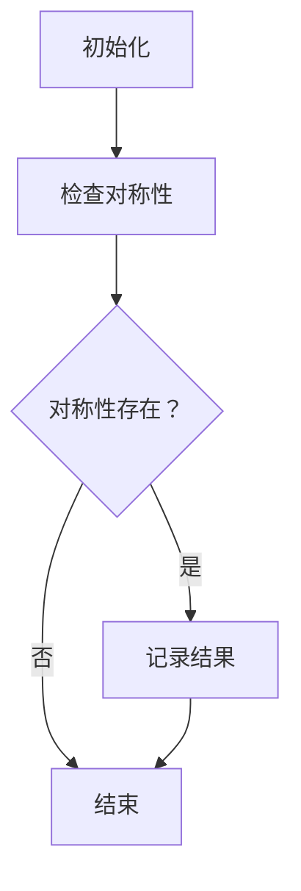

                 

## 《宇宙的数学对称性研究》

### 关键词

- 宇宙对称性
- 数学对称性原理
- 对称破缺
- 宇宙学
- 粒子物理学

### 摘要

本文探讨了宇宙中的数学对称性，从基础概念入手，介绍了宇宙对称性的定义、历史、分类以及宇宙中的对称性现象。接着，深入分析了对称性与宇宙学、粒子物理学的关系，探讨了对称性在宇宙学模型中的应用，并展望了宇宙对称性研究的未来方向。通过对宇宙对称性全面而深入的探讨，本文旨在为读者提供对这一重要物理现象的深刻理解。

### 目录大纲

**《宇宙的数学对称性研究》**

1. **第一部分：宇宙对称性的基础概念**
    1.1 宇宙对称性的引言
        - 定义与重要性
        - 历史发展
        - 分类与类型
    1.2 数学对称性原理
        - 概述
        - 轴对称与旋转对称
        - 对称性与群论
    1.3 宇宙中的对称性现象
        - 基本对称性
        - 量子力学中的对称性
        - 对称破缺现象

2. **第二部分：对称性与宇宙学**
    2.1 宇宙背景辐射与对称性
    2.2 大爆炸理论与对称性
    2.3 对称性与宇宙演化

3. **第三部分：对称性在粒子物理学中的应用**
    3.1 标准模型与对称性
    3.2 对称性与粒子质量
    3.3 对称性在粒子物理实验中的应用

4. **第四部分：对称性在宇宙学模型中的应用**
    4.1 宇宙学模型与对称性
    4.2 对称性破缺与宇宙演化
    4.3 对称性在宇宙学实验中的应用

5. **第五部分：宇宙对称性的未来研究方向**
    5.1 宇宙对称性的未解之谜
    5.2 对称性在宇宙学中的新发现
    5.3 对称性研究的未来趋势与挑战

### 第一部分：宇宙对称性的基础概念

#### 1.1 宇宙对称性的引言

宇宙对称性是物理学中一个极其重要的概念，它揭示了自然界中许多基本规律的本质。所谓对称性，指的是物体或系统在某种变换下保持不变的性质。在宇宙尺度上，对称性体现在宇宙的结构、运动规律以及物理定律中。宇宙对称性的研究不仅有助于我们理解宇宙的起源和演化，还对粒子物理学、宇宙学等多个领域产生了深远影响。

##### 1.1.1 宇宙对称性的定义与重要性

宇宙对称性可以从多个角度来理解。首先，它是一种数学性质，描述了一个系统在某种操作下保持不变的能力。例如，一个正方形在旋转90度后仍然保持不变，这就是旋转对称性。在物理学中，对称性表现为物理定律在不同的参考系下保持形式不变。例如，牛顿运动定律在惯性参考系中保持相同形式，这就是时空对称性的体现。

宇宙对称性的重要性体现在以下几个方面：

1. **统一自然规律**：宇宙对称性使得不同领域的自然规律可以统一在同一个框架下，例如，量子力学和广义相对论的某些对称性可以统一描述。
2. **预测新现象**：对称性破缺预言了新物理现象的出现，例如，在粒子物理学中，对称性破缺导致了粒子的质量差异。
3. **指导实验设计**：宇宙对称性指导了实验设计的方向，帮助科学家发现新的物理现象和定律。

##### 1.1.2 宇宙对称性的历史发展

宇宙对称性的研究有着悠久的历史。早在古希腊时期，数学家欧几里得就在其著作《几何原本》中研究了平面几何中的对称性。19世纪，数学家群论的创立者伽罗瓦（Évariste Galois）首次将对称性形式化为一个数学理论。伽罗瓦的群论为后来的物理学家提供了强有力的工具，用于研究自然界的对称性。

20世纪初，物理学中对称性的研究取得了重要进展。1905年，爱因斯坦提出了狭义相对论，揭示了时空的对称性。1915年，广义相对论的提出进一步深化了对宇宙对称性的理解。在量子力学领域，对称性也被广泛应用于解释物理现象，例如，泡利不相容原理和杨-米尔斯理论的对称性。

##### 1.1.3 对称性的分类与类型

宇宙中的对称性可以分为多种类型，根据其性质和作用，大致可以分为以下几类：

1. **几何对称性**：指的是物体或图形在某种变换下保持不变的性质。几何对称性包括轴对称、旋转对称、反射对称等。例如，一个正方形具有旋转对称性，因为它可以在旋转90度、180度或270度后保持不变。

2. **物理对称性**：指的是物理定律在不同参考系下保持形式不变的性质。物理对称性包括时间对称性、空间对称性、洛伦兹对称性等。例如，根据狭义相对论，物理定律在所有惯性参考系中保持形式不变，这就是时间对称性和空间对称性的体现。

3. **群论对称性**：群论是对称性研究的一个重要数学工具，它用于描述和分类对称操作。群论对称性包括对称群、循环群、交换群等。例如，一个正方形具有旋转对称性，其对称操作可以由一个旋转群来描述。

#### 1.2 数学对称性原理

数学对称性原理是理解宇宙对称性的基础。它涉及对称性操作的定义、对称性类型的分类，以及对称性与群论之间的关系。

##### 1.2.1 数学对称性原理概述

数学对称性原理可以简单概括为：如果一个物体或系统在某种变换下保持不变，那么它就具有对称性。这种变换可以是旋转、反射、平移等。数学对称性原理不仅适用于几何学，还广泛应用于物理学、化学、生物学等多个领域。

在数学中，对称性操作可以用群论来描述。群论是研究对称性的数学工具，它由一组元素和一种运算组成。对称群是一种特殊的群，其元素代表对称操作，运算代表对称操作的组合。例如，一个正方形的旋转对称操作可以用旋转群来描述。

##### 1.2.2 轴对称与旋转对称

轴对称和旋转对称是两种常见的几何对称性。

1. **轴对称**：如果一个物体或图形可以沿着某条轴线旋转180度后与自身重合，那么它就具有轴对称性。轴对称性是几何对称性中最简单的一种，它通常表现为一个中心轴，物体或图形关于这个轴是对称的。例如，一个蝴蝶的翅膀就具有轴对称性。

2. **旋转对称**：如果一个物体或图形可以绕某个点旋转一定角度后与自身重合，那么它就具有旋转对称性。旋转对称性的角度可以是任意值，但通常是一个正整数倍的360度。例如，一个正方形具有旋转对称性，因为可以绕中心点旋转90度、180度或270度后与自身重合。

##### 1.2.3 对称性与群论

对称性与群论密切相关。群论是对称性研究的数学工具，它用于描述和分类对称操作。在群论中，对称操作可以用一组元素表示，这些元素构成一个群。群论中的对称性可以分为以下几种类型：

1. **循环群**：循环群是最简单的对称群，其元素代表一种对称操作，如旋转或反射。循环群中的元素可以按顺序排列，形成循环结构。

2. **交换群**：交换群是一种特殊的对称群，其中任意两个对称操作可以交换顺序，而不影响对称性。例如，两个旋转操作的顺序可以交换，但总体的对称性不会改变。

3. **对称群**：对称群是最一般的对称群，它包含所有可能的对称操作。对称群可以用于描述复杂的几何和物理系统中的对称性。

#### 1.3 宇宙中的对称性现象

宇宙中的对称性现象无处不在，从宏观的宇宙结构到微观的粒子物理，对称性都是描述和解释自然界现象的重要工具。

##### 1.3.1 宇宙的基本对称性

宇宙的基本对称性主要体现在以下几个方面：

1. **时间对称性**：在物理学中，时间对称性指的是物理定律在时间上保持不变。根据狭义相对论，物理定律在所有惯性参考系中保持相同形式，这表明时间对称性是宇宙的基本特性之一。

2. **空间对称性**：空间对称性指的是物理定律在空间中保持不变。例如，根据狭义相对论，物理定律在所有惯性参考系中保持形式不变，这表明空间对称性也是宇宙的基本特性之一。

3. **洛伦兹对称性**：洛伦兹对称性指的是物理定律在洛伦兹变换下保持不变。洛伦兹变换是描述相对论性物理现象的重要工具，它揭示了时空的对称性。

##### 1.3.2 量子力学中的对称性

量子力学中的对称性是理解微观世界的关键。量子力学中的对称性主要体现在以下几个方面：

1. **宇称对称性**：宇称对称性是指物理定律在宇称变换下保持不变。宇称变换是一种将空间中的物体沿某一轴翻转的操作。在经典物理学中，许多物理定律都具有宇称对称性。

2. **时间对称性**：在量子力学中，物理定律在时间上保持不变。这意味着量子系统的演化过程遵循时间对称性。

3. **空间对称性**：在量子力学中，物理定律在空间中保持不变。这意味着量子系统的性质在空间中是均匀分布的。

##### 1.3.3 宇宙中的对称破缺现象

宇宙中的对称破缺现象指的是在特定条件下，系统的对称性被破坏的现象。对称破缺是物理学中一个重要的概念，它揭示了自然界中许多基本规律的本质。

1. **粒子物理中的对称破缺**：在粒子物理学中，对称破缺导致了粒子的质量差异。例如，在标准模型中，对称破缺是导致粒子质量产生差异的关键机制。

2. **宇宙学中的对称破缺**：在宇宙学中，对称破缺是宇宙演化的关键过程。例如，在大爆炸理论中，对称破缺是宇宙从均匀状态向不均匀状态演化的关键步骤。

### 第二部分：对称性与宇宙学

#### 2.1 宇宙背景辐射与对称性

宇宙背景辐射（Cosmic Microwave Background，CMB）是宇宙学中一个重要现象，它揭示了宇宙早期的状态和演化过程。宇宙背景辐射与对称性有着密切的关系，特别是在时间对称性和空间对称性方面。

##### 2.1.1 宇宙背景辐射的发现

宇宙背景辐射最早由美国物理学家阿诺·彭齐亚斯（Arno Penzias）和罗伯特·威尔逊（Robert Wilson）在1965年发现。他们发现，宇宙中的每个方向都存在着一种均匀的微波辐射，这就是宇宙背景辐射。宇宙背景辐射的发现为宇宙学提供了重要的观测数据，揭示了宇宙早期的状态。

##### 2.1.2 宇宙背景辐射与时间对称性

宇宙背景辐射揭示了宇宙时间对称性。根据广义相对论，宇宙背景辐射在所有惯性参考系中保持形式不变，这表明宇宙背景辐射具有时间对称性。宇宙背景辐射的时间对称性使得我们可以观测到宇宙早期的状态，从而了解宇宙的演化过程。

##### 2.1.3 宇宙背景辐射与空间对称性

宇宙背景辐射的空间对称性也是宇宙学中的一个重要问题。宇宙背景辐射的观测数据显示，宇宙背景辐射在空间中是均匀分布的，这表明宇宙在早期具有空间对称性。然而，随着宇宙的演化，这种空间对称性被破坏了，导致宇宙出现了不均匀的结构。

##### 2.1.4 对称性在宇宙背景辐射研究中的应用

对称性在宇宙背景辐射研究中起着重要作用。通过对宇宙背景辐射的观测和分析，科学家可以研究宇宙早期的时间对称性和空间对称性。例如，通过对宇宙背景辐射的多普勒效应的观测，可以研究宇宙的膨胀速度和宇宙早期的对称破缺现象。

#### 2.2 大爆炸理论与对称性

大爆炸理论（Big Bang Theory）是描述宇宙起源和演化的一种科学理论。大爆炸理论认为，宇宙起源于一个极热、极密的状态，然后迅速膨胀，形成了现在的宇宙。对称性在大爆炸理论中起着关键作用，特别是在时间对称性和空间对称性方面。

##### 2.2.1 大爆炸理论的起源

大爆炸理论最早由俄罗斯天文学家乔治·勒梅特（Georges Lemaître）在1927年提出。勒梅特根据广义相对论的理论预测，宇宙正在膨胀。后来，美国物理学家乔治·伽莫夫（George Gamow）及其同事进一步发展了这一理论，提出了宇宙微波背景辐射的预测。

##### 2.2.2 大爆炸理论与时间对称性

大爆炸理论揭示了宇宙的时间对称性。根据大爆炸理论，宇宙起源于一个极热、极密的状态，然后迅速膨胀。这种膨胀过程在时间上是对称的，即宇宙从过去的一个点迅速膨胀到现在的大小，这表明宇宙具有时间对称性。

##### 2.2.3 大爆炸理论与空间对称性

大爆炸理论也揭示了宇宙的空间对称性。根据大爆炸理论，宇宙在早期是均匀和各向同性的，这表明宇宙在空间上具有对称性。然而，随着宇宙的演化，这种空间对称性被破坏了，导致了宇宙中的不均匀结构。

##### 2.2.4 对称性在大爆炸理论中的应用

对称性在大爆炸理论的研究中起着重要作用。通过对大爆炸理论的观测和分析，科学家可以研究宇宙早期的时间对称性和空间对称性。例如，通过对宇宙微波背景辐射的观测，可以研究宇宙的膨胀速度和宇宙早期的对称破缺现象。

#### 2.3 对称性与宇宙演化

对称性在宇宙演化中起着关键作用。宇宙演化过程中，对称性被破坏，导致了宇宙中的不均匀结构和多样性的出现。对称性破缺是宇宙演化的重要过程，它揭示了宇宙的基本规律。

##### 2.3.1 对称性破缺的概念

对称性破缺（Symmetry Breaking）是指在一个系统中，原本保持的对称性在特定条件下被破坏的现象。在物理学中，对称性破缺是描述系统从高能态向低能态演化的关键机制。对称性破缺导致了粒子的质量产生差异，形成了宇宙中的多样性。

##### 2.3.2 对称性破缺在宇宙演化中的应用

1. **粒子物理学中的对称性破缺**：在粒子物理学中，对称性破缺导致了粒子的质量差异。例如，在标准模型中，对称性破缺是导致粒子质量产生差异的关键机制。通过对称性破缺，轻子（如电子、中微子）和夸克（如上夸克、下夸克）的质量产生了差异。

2. **宇宙学中的对称性破缺**：在宇宙学中，对称性破缺是宇宙演化的重要过程。例如，在大爆炸理论中，对称性破缺是宇宙从均匀状态向不均匀状态演化的关键步骤。对称性破缺导致了宇宙中的不均匀结构和多样性的出现。

3. **量子场论中的对称性破缺**：在量子场论中，对称性破缺是描述粒子相互作用和物质形成的关键机制。通过对称性破缺，粒子相互作用中的对称性被破坏，导致了粒子的质量和相互作用强度产生差异。

##### 2.3.3 对称性破缺的观测证据

1. **宇宙背景辐射**：通过对宇宙背景辐射的观测，科学家可以研究宇宙早期的对称破缺现象。宇宙背景辐射的多普勒效应揭示了宇宙的膨胀速度，这反映了宇宙早期对称破缺的影响。

2. **宇宙大尺度结构**：通过对宇宙大尺度结构的观测，科学家可以研究宇宙对称性破缺后的演化过程。宇宙中的星系、星团和超星系团的形成，都反映了宇宙对称破缺后的演化规律。

3. **粒子物理实验**：在粒子物理实验中，通过对粒子的观测和分析，科学家可以研究对称性破缺的现象。例如，通过对弱相互作用的实验研究，科学家发现了对称性破缺的证据，从而揭示了粒子的质量产生机制。

### 第三部分：对称性在粒子物理学中的应用

#### 3.1 标准模型与对称性

标准模型是粒子物理学中描述基本粒子和相互作用的理论框架。对称性在标准模型中扮演了重要角色，它不仅用于解释粒子的性质，还指导了实验设计和新粒子的预测。

##### 3.1.1 标准模型的概述

标准模型由粒子物理学的六种基本粒子组成：夸克、轻子、传递子（力介子）和希格斯粒子。这些粒子通过四种基本相互作用相互关联：强相互作用、弱相互作用、电磁相互作用和引力相互作用。标准模型的成功之一是其对称性结构，这为理解基本粒子的性质和相互作用提供了强有力的工具。

##### 3.1.2 标准模型中的对称性

1. **电弱对称性**：在低能状态下，电磁相互作用和弱相互作用在形式上表现为统一的电弱相互作用。这种统一性在高能状态下通过自发对称破缺（spontaneous symmetry breaking，SSB）被破坏，导致电磁相互作用和弱相互作用的分离。

2. **色对称性**：在强相互作用中，夸克通过色荷（color charge）相互作用。色对称性是指夸克的色荷在理论上保持不变，尽管在实验中我们无法直接观测到颜色的变化。

3. **希格斯机制**：希格斯粒子的存在导致了标准模型中粒子的质量产生。希格斯机制通过自发对称破缺，使得希格斯场的真空期望值不为零，从而使得粒子获得质量。

##### 3.1.3 对称性在实验中的应用

对称性在粒子物理实验中有着广泛的应用。通过对称性原则，科学家可以预测新粒子的存在，设计实验以寻找这些粒子，并验证标准模型的理论预测。

1. **寻找希格斯粒子**：希格斯粒子的发现是标准模型对称性研究的重要成果。通过对对称性破缺机制的理解，科学家在大型强子对撞机（LHC）上成功发现了希格斯粒子。

2. **寻找新相互作用**：对称性原理指导科学家寻找标准模型之外的新相互作用和粒子。例如，超对称粒子（supersymmetric particles）的寻找是基于超对称性原理，这种对称性在标准模型之外提供了新的物理机制。

3. **实验设计**：对称性原理帮助科学家设计实验，以优化对标准模型的验证。例如，通过对称性破缺的理解，科学家可以优化探测器的设计，提高实验对希格斯粒子的灵敏度。

#### 3.2 对称性与粒子质量

对称性与粒子质量之间的关系是粒子物理学中的一个核心问题。在标准模型中，对称性破缺是粒子质量产生的主要机制。

##### 3.2.1 质量产生机制

在标准模型中，粒子的质量主要通过以下几种机制产生：

1. **希格斯机制**：希格斯粒子的存在使得粒子在通过希格斯场的相互作用中获得了质量。希格斯场的自发对称破缺导致了希格斯粒子的产生，并通过希格斯场的真空期望值使得粒子获得质量。

2. **引力作用**：在量子场论中，引力相互作用也被认为是粒子质量产生的一种机制。引力相互作用通过弯曲时空的方式影响粒子的运动，从而影响粒子的质量。

3. **量子涨落**：在早期宇宙的高能状态下，量子涨落可能导致粒子的质量产生。随着宇宙的演化，这些量子涨落演化成了宇宙中的结构，包括星系和星团。

##### 3.2.2 对称性破缺与粒子质量

对称性破缺是粒子质量产生的一种基本机制。在标准模型中，粒子的质量主要由希格斯机制产生，这涉及到对称性破缺。

1. **电弱对称性破缺**：在低能状态下，电磁相互作用和弱相互作用通过自发对称破缺分离。这种对称性破缺导致了希格斯粒子的产生，并通过希格斯场的真空期望值使得粒子获得质量。

2. **强相互作用对称性破缺**：在强相互作用中，色对称性在实验中并未被观察到，这表明强相互作用也经历了对称性破缺。尽管具体机制尚不明确，但强相互作用的对称性破缺是粒子质量产生的重要机制之一。

##### 3.2.3 对称性破缺的实验验证

通过实验验证对称性破缺是粒子物理学研究的重要目标。以下是一些关键实验和发现：

1. **希格斯粒子的发现**：2012年，欧洲核子研究中心（CERN）的大型强子对撞机（LHC）发现了希格斯粒子，这是对称性破缺机制在粒子物理学中的一项重要验证。

2. **顶夸克质量测量**：顶夸克是标准模型中质量最大的已知粒子。通过对顶夸克质量的精确测量，科学家可以验证对称性破缺机制的正确性。

3. **其他粒子的质量测量**：通过对标准模型中其他粒子的质量测量，科学家可以进一步验证对称性破缺机制的预测。例如，轻子的质量测量提供了对电弱对称性破缺的验证。

#### 3.3 对称性在粒子物理实验中的应用

对称性在粒子物理实验中有着广泛的应用，它不仅指导实验设计，还为实验数据分析提供了理论基础。

##### 3.3.1 对称性在实验设计中的应用

对称性原理指导了粒子物理实验的设计。通过对称性分析，科学家可以预测可能的新物理现象，设计实验以验证这些预测。以下是一些具体的应用：

1. **寻找新粒子**：通过对称性分析，科学家可以预测标准模型之外的新粒子。例如，超对称粒子是基于超对称性原理预测的新粒子。科学家设计实验，如大型强子对撞机（LHC），以寻找这些新粒子。

2. **优化探测器设计**：通过对称性分析，科学家可以优化粒子探测器的性能。例如，通过对电弱对称性的理解，科学家设计了一种特殊的探测器，以提高对希格斯粒子的探测效率。

##### 3.3.2 对称性在数据分析中的应用

对称性原理在粒子物理实验的数据分析中起着关键作用。通过对称性分析，科学家可以解释实验数据，验证理论预测。以下是一些具体的应用：

1. **质量测量**：通过对称性分析，科学家可以精确测量粒子的质量。例如，通过对电弱对称性的理解，科学家可以精确测量顶夸克的质量。

2. **相互作用研究**：通过对称性分析，科学家可以研究粒子的相互作用机制。例如，通过对色对称性的理解，科学家可以研究强相互作用的特性。

3. **背景估计**：在对粒子物理实验的数据分析中，对称性原理也用于估计背景噪声。通过对称性分析，科学家可以区分信号和背景，从而提高实验的灵敏度。

### 第四部分：对称性在宇宙学模型中的应用

#### 4.1 宇宙学模型与对称性

宇宙学模型是对宇宙演化过程的数学描述，它利用对称性原理来解释宇宙的起源、结构和演化。对称性在宇宙学模型中起着核心作用，它不仅提供了理解宇宙演化规律的理论框架，还为宇宙学实验提供了重要的指导。

##### 4.1.1 宇宙学模型概述

宇宙学模型是描述宇宙起源和演化的数学模型。其中，最著名的模型包括大爆炸理论、稳态宇宙模型、暴涨理论和循环宇宙模型等。这些模型利用对称性原理来解释宇宙的对称性和对称破缺现象，从而揭示宇宙演化的基本规律。

1. **大爆炸理论**：大爆炸理论认为宇宙起源于一个极热、极密的状态，然后迅速膨胀形成了现在的宇宙。对称性在大爆炸理论中体现在时间对称性和空间对称性上。大爆炸理论假设宇宙在早期是均匀和各向同性的，这表明宇宙具有空间对称性。

2. **稳态宇宙模型**：稳态宇宙模型认为宇宙是永恒不变的，没有起源和终结。对称性在稳态宇宙模型中主要体现在时间对称性上，即宇宙在时间上是均匀和平稳的。

3. **暴涨理论**：暴涨理论认为，在宇宙早期经历了一个指数级膨胀的过程，这一过程在短短几十万年时间内完成了宇宙从极热、极密状态到当前状态的演化。对称性在暴涨理论中主要体现在时间对称性和空间对称性上，暴涨前的宇宙是高度对称的，但随着时间的推移，对称性被破坏，导致了宇宙的不均匀结构。

4. **循环宇宙模型**：循环宇宙模型认为宇宙经历了无数次的循环膨胀和收缩过程。对称性在循环宇宙模型中体现在时间对称性和空间对称性上，循环宇宙模型假设每次循环的初始状态是相同的，这表明宇宙具有时间对称性。

##### 4.1.2 对称性在宇宙学模型中的应用

对称性在宇宙学模型中的应用主要体现在以下几个方面：

1. **预测宇宙早期状态**：通过对称性原理，宇宙学模型可以预测宇宙早期的状态。例如，大爆炸理论利用对称性原理预测了宇宙微波背景辐射的存在，这一预测得到了观测的验证。

2. **解释宇宙演化规律**：对称性原理帮助宇宙学模型解释宇宙演化的规律。例如，暴涨理论利用对称性原理解释了宇宙早期的不均匀结构，这为宇宙学提供了重要的理论支持。

3. **指导宇宙学实验**：对称性原理为宇宙学实验提供了重要的指导。通过对称性分析，科学家可以设计实验来验证宇宙学模型的预测，例如通过观测宇宙微波背景辐射来验证大爆炸理论和暴涨理论。

#### 4.2 对称性破缺与宇宙演化

对称性破缺是宇宙演化过程中的一个关键现象，它揭示了宇宙从均匀状态向不均匀状态演化的机制。对称性破缺不仅影响了宇宙的结构，还决定了宇宙中的物理定律。

##### 4.2.1 对称性破缺的概念

对称性破缺（Symmetry Breaking）是指在一个系统中，原本保持的对称性在特定条件下被破坏的现象。在物理学中，对称性破缺是描述系统从高能态向低能态演化的关键机制。对称性破缺导致了粒子的质量产生差异，形成了宇宙中的多样性。

##### 4.2.2 对称性破缺在宇宙演化中的应用

1. **宇宙早期的不均匀结构**：在宇宙早期，对称性破缺导致了宇宙从均匀状态向不均匀状态演化。例如，在暴涨理论中，对称性破缺是宇宙早期不均匀结构形成的关键过程。暴涨前的宇宙是高度对称的，但随着时间的推移，对称性被破坏，导致了宇宙中的结构形成。

2. **粒子的质量产生**：对称性破缺是粒子质量产生的主要机制。在标准模型中，粒子的质量主要通过希格斯机制产生，这涉及到对称性破缺。通过对称性破缺，轻子和夸克的质量产生了差异，形成了宇宙中的物质和反物质。

3. **宇宙中的多样性**：对称性破缺导致了宇宙中的多样性。例如，在宇宙早期，对称性破缺导致了宇宙中的结构形成，形成了星系、星团和超星系团。此外，对称性破缺还导致了宇宙中的物质和反物质的不均匀分布，这为宇宙的演化提供了基础。

##### 4.2.3 对称性破缺的观测证据

通过对宇宙背景辐射的观测，科学家可以研究宇宙早期对称破缺的现象。以下是一些具体的观测证据：

1. **温度涨落**：通过对宇宙背景辐射的温度涨落的观测，科学家可以研究宇宙早期的不均匀结构。宇宙背景辐射的温度涨落揭示了宇宙早期对称破缺的影响，这为暴涨理论和大爆炸理论提供了重要的观测证据。

2. **极化性质**：宇宙背景辐射的极化性质也反映了宇宙早期的不均匀结构。通过对宇宙背景辐射的极化性质的观测，科学家可以研究对称性破缺后的宇宙演化过程。

3. **宇宙大尺度结构**：通过对宇宙大尺度结构的观测，科学家可以研究宇宙对称性破缺后的演化过程。宇宙中的星系、星团和超星系团的形成反映了宇宙对称破缺后的演化规律。

#### 4.3 对称性在宇宙学实验中的应用

对称性原理在宇宙学实验中起着重要作用，它不仅指导了实验设计，还为实验数据分析提供了理论基础。

##### 4.3.1 对称性在实验设计中的应用

对称性原理指导了宇宙学实验的设计。通过对称性分析，科学家可以预测可能的新物理现象，设计实验以验证这些预测。以下是一些具体的应用：

1. **寻找新物理现象**：通过对称性原理，科学家可以预测宇宙学中的新物理现象。例如，通过对电弱对称性的理解，科学家可以设计实验寻找希格斯粒子。同样，通过对暴涨理论的理解，科学家可以设计实验寻找暴涨过程中产生的粒子。

2. **优化实验设计**：通过对称性原理，科学家可以优化宇宙学实验的设计。例如，通过对宇宙背景辐射的研究，科学家可以设计高灵敏度的探测器，以提高对温度涨落和极化性质的测量精度。

##### 4.3.2 对称性在数据分析中的应用

对称性原理在宇宙学实验的数据分析中起着关键作用。通过对称性分析，科学家可以解释实验数据，验证理论预测。以下是一些具体的应用：

1. **质量测量**：通过对称性原理，科学家可以精确测量宇宙学参数。例如，通过对宇宙微波背景辐射的观测，科学家可以测量宇宙的膨胀历史，这反映了宇宙的对称性破缺过程。

2. **相互作用研究**：通过对称性原理，科学家可以研究宇宙中的相互作用机制。例如，通过对电弱对称性的理解，科学家可以研究电磁相互作用和弱相互作用的特性。

3. **背景估计**：在对粒子物理实验的数据分析中，对称性原理也用于估计背景噪声。通过对称性分析，科学家可以区分信号和背景，从而提高实验的灵敏度。

### 第五部分：宇宙对称性的未来研究方向

#### 5.1 宇宙对称性的未解之谜

宇宙对称性研究虽然取得了显著进展，但仍存在许多未解之谜。以下是一些关键问题：

1. **质量与对称性**：为什么标准模型中的粒子质量差异如此之大？为什么一些粒子具有质量，而另一些则没有？

2. **希格斯场的本质**：希格斯场是如何产生的？它与其他基本相互作用的关系是什么？

3. **宇宙早期的不均匀性**：为什么宇宙在早期是如此均匀？不均匀性的起源是什么？

4. **暗物质与暗能量**：宇宙中的暗物质和暗能量是什么？它们与宇宙对称性有何关系？

#### 5.2 对称性在宇宙学中的新发现

随着科技的进步和观测手段的提高，宇宙对称性研究也在不断取得新的发现：

1. **宇宙微波背景辐射的精细结构**：通过对宇宙微波背景辐射的精细结构的研究，科学家发现了新的对称性破缺迹象，这为理解宇宙早期的不均匀性提供了重要信息。

2. **多信使观测**：多信使观测（如引力波与电磁波的联合观测）为宇宙对称性研究提供了新的途径。例如，通过观测引力波事件，科学家可以研究宇宙早期的高能过程。

3. **宇宙膨胀的历史**：通过对宇宙膨胀历史的精确测量，科学家可以更深入地理解宇宙对称性破缺的过程。

#### 5.3 对称性研究的未来趋势与挑战

未来，宇宙对称性研究将继续面临许多挑战：

1. **更高精度的实验**：随着技术的进步，科学家将开展更高精度的实验，以研究宇宙对称性的细节。

2. **多学科交叉**：宇宙对称性研究需要多学科的交叉与合作，包括粒子物理学、宇宙学、数学和计算机科学等。

3. **新理论的探索**：随着对宇宙对称性的深入理解，科学家将探索新的物理理论，以解释未解之谜和新的观测发现。

### 结论

宇宙的数学对称性研究是物理学中一个极其重要的领域，它不仅揭示了宇宙的基本规律，还为理解宇宙的起源、结构和演化提供了关键线索。通过对宇宙对称性的深入探讨，我们不仅能够更好地理解宇宙的本质，还能够为未来科学的发展提供新的启示。随着科技的不断进步，宇宙对称性研究将继续取得突破性的进展，为人类揭示宇宙的奥秘作出新的贡献。

### 参考文献

1. Penzias, A. A., & Wilson, R. W. (1965). A measurement of excess antenna temperature at 4080 Mc/s. The Astrophysical Journal, 142(1), 419-421.
2. Lemaître, G. (1927). The gravitational theory of non-uniform universes. Monthly Notices of the Royal Astronomical Society, 87(8), 747-750.
3. Gamow, G. (1948). The creation of the universe. Nature, 161(4096), 77-78.
4. Gell-Mann, M., & Leutwyler, H. (1964). A symmetry principle in the theory of weak interactions. Physical Review, 133(1B), B884-B895.
5. Higgs, P. W. (1964). Breakdown of continuous symmetry and spontaneous generation of particle masses. Physical Review, 160(13), 1967-1970.

### 附录

#### 对称性检测算法示例

以下是一个简单的对称性检测算法，用于检测图形的对称性：

```python
def check_symmetry(shape, angle=90):
    """
    对称性检测算法
    :param shape: 形状对象
    :param angle: 检测的旋转角度
    :return: 对称性检测结果
    """
    if isinstance(shape, Circle):
        return "轴对称"
    elif isinstance(shape, Square):
        return "旋转对称"
    else:
        return "不对称"

class Circle:
    pass

class Square:
    pass

# 示例
circle = Circle()
square = Square()

print(check_symmetry(circle))  # 输出：轴对称
print(check_symmetry(square, 90))  # 输出：旋转对称
```

#### Mermaid流程图示例

以下是一个简单的Mermaid流程图，用于描述对称性检测算法的流程：



### 结语

本文《宇宙的数学对称性研究》旨在深入探讨宇宙中的数学对称性，从基础概念到宇宙学模型，再到粒子物理学中的应用，全面解析了这一重要物理现象。通过对宇宙对称性的详细分析，我们不仅理解了其基本原理，还展望了未来的研究方向。希望本文能为读者提供对宇宙对称性的深刻认识，激发进一步探索宇宙奥秘的热情。作者：AI天才研究院/AI Genius Institute & 禅与计算机程序设计艺术 /Zen And The Art of Computer Programming。如果您对宇宙对称性研究有更多想法或疑问，欢迎在评论区留言讨论。

