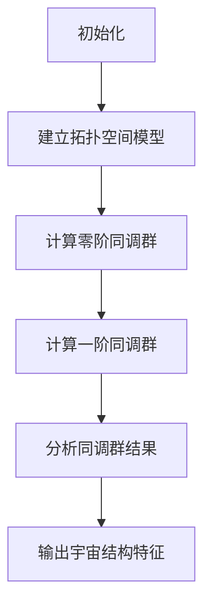
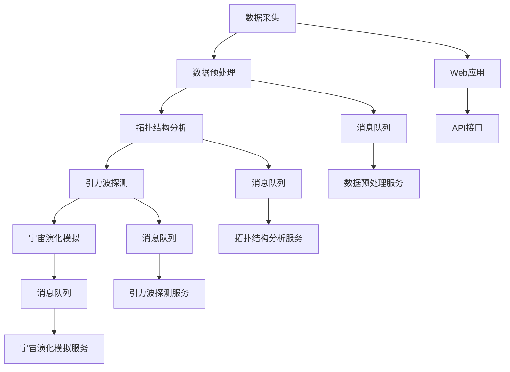

                 

# 宇宙的数学微分拓扑学特性研究

## 关键词
宇宙学、数学微分拓扑学、拓扑空间、同调理论、算法设计、宇宙模型

## 摘要
本文旨在探讨宇宙的数学微分拓扑学特性，通过对宇宙演化过程中所展现出的数学结构进行深入研究，揭示宇宙背后所隐藏的深层次规律。文章首先介绍了宇宙学、数学微分拓扑学及其相互关系的背景知识，然后通过具体案例和实例，详细阐述了宇宙的数学微分拓扑学特性，包括数学模型、算法原理以及系统架构设计。最后，文章总结了研究的成果，并提出了未来研究的方向和展望。

## 目录

### 第一章 引言
- 背景介绍
- 研究意义
- 文章结构

### 第二章 宇宙学与数学微分拓扑学基础
- 宇宙学的起源与发展
- 数学微分拓扑学的基本概念
- 宇宙学与数学微分拓扑学的联系

### 第三章 宇宙的数学微分拓扑学特性
- 宇宙的拓扑结构
- 宇宙的同调理论
- 宇宙的微分几何特性

### 第四章 数学模型与算法原理
- 数学模型
- 算法原理讲解
- 算法流程图与Python源代码

### 第五章 系统分析与架构设计
- 问题场景介绍
- 系统功能设计
- 系统架构设计
- 系统接口设计
- 系统交互

### 第六章 项目实战
- 环境安装
- 系统核心实现源代码
- 代码应用解读与分析
- 实际案例分析
- 项目小结

### 第七章 最佳实践、小结与拓展阅读
- 最佳实践 tips
- 小结
- 注意事项
- 拓展阅读

### 参考文献

---

## 第一章 引言

### 背景介绍

宇宙的数学微分拓扑学特性研究是一个新兴的跨学科领域，涉及宇宙学、数学和拓扑学等多个学科。宇宙学是研究宇宙的起源、演化、结构和组成的一门学科，而数学微分拓扑学则是研究几何形状和空间结构的数学分支。随着人类对宇宙的认识不断深入，人们逐渐意识到宇宙中存在一些复杂的数学结构，这些结构在宇宙的演化过程中发挥着至关重要的作用。

宇宙学与数学微分拓扑学的交叉研究具有重要的科学意义。一方面，通过数学微分拓扑学的方法，我们可以更深入地理解宇宙的演化规律；另一方面，宇宙学中的问题也为数学微分拓扑学提供了丰富的应用场景。例如，宇宙的拓扑结构、同调理论和微分几何特性都是数学微分拓扑学的重要研究对象。

### 研究意义

宇宙的数学微分拓扑学特性研究具有重要的理论和实践意义。在理论方面，通过对宇宙的数学结构进行深入研究，可以推动数学微分拓扑学的发展，揭示其更深层次的规律。在实践方面，这些研究成果可以应用于宇宙探索、天体物理学、天文学等领域，为人类认识宇宙提供新的方法和工具。

首先，宇宙的数学微分拓扑学特性研究可以为宇宙学提供新的理论框架。传统宇宙学主要依靠观测数据和理论模型来研究宇宙的演化，但这些方法在处理复杂问题时存在一定的局限性。通过引入数学微分拓扑学的方法，我们可以从几何和拓扑的角度重新审视宇宙的演化过程，从而构建更加精确和全面的宇宙模型。

其次，宇宙的数学微分拓扑学特性研究可以推动数学和物理学的交叉发展。数学微分拓扑学是一门高度抽象的学科，而宇宙学是一门涉及广泛实际问题的学科。通过将两者结合，我们可以探索数学在物理学中的新应用，发现数学模型在描述物理现象中的潜力和局限性。

最后，宇宙的数学微分拓扑学特性研究还可以为其他学科提供启示。例如，在计算机科学、人工智能等领域，拓扑学方法已被广泛应用于数据结构和算法设计。通过借鉴宇宙的数学微分拓扑学特性，我们可以探索新的算法和理论，为这些领域的发展做出贡献。

### 文章结构

本文将分为七个章节进行论述。第一章是引言部分，主要介绍研究的背景、意义和文章结构。第二章将介绍宇宙学、数学微分拓扑学的基础知识，包括它们的起源、发展以及它们之间的联系。第三章将探讨宇宙的数学微分拓扑学特性，包括宇宙的拓扑结构、同调理论和微分几何特性。第四章将详细讲解宇宙的数学模型和算法原理，包括算法流程图和Python源代码。第五章将介绍系统分析与架构设计，包括问题场景介绍、系统功能设计、系统架构设计、系统接口设计和系统交互。第六章将介绍项目实战，包括环境安装、系统核心实现源代码、代码应用解读与分析以及实际案例分析。最后一章将总结最佳实践、提出注意事项、拓展阅读，并对全文进行总结。

## 第二章 宇宙学与数学微分拓扑学基础

### 宇宙学的起源与发展

宇宙学作为天文学的分支，历史悠久，源远流长。自古以来，人类就对宇宙充满了好奇和探索的欲望。古希腊哲学家如泰勒斯、毕达哥拉斯和亚里士多德等，都曾试图通过哲学和几何学来解释宇宙的本质。中国古代的《易经》和《道德经》等哲学经典中也蕴含了丰富的宇宙观。

现代宇宙学的起源可以追溯到20世纪初，当时科学家通过观测宇宙中的星系和辐射，发现了宇宙膨胀的现象。1927年，勒梅特提出了“大爆炸”理论，认为宇宙起源于一个极热、极密的奇点，经过数十亿年的膨胀，形成了今天所观察到的宇宙。这一理论得到了后来的大量观测数据支持，并逐渐成为宇宙学的标准模型。

随着科学技术的进步，宇宙学得到了快速发展。20世纪中叶以来，人类通过发射人造卫星和航天器，对宇宙进行了更为详细的观测。例如，1965年，阿诺·彭齐亚斯和罗伯特·威尔逊发现了宇宙微波背景辐射，这一发现为“大爆炸”理论提供了强有力的证据。此外，宇宙加速膨胀的发现，即所谓的“暗能量”，也推动了宇宙学研究向更深层次的探索。

### 数学微分拓扑学的基本概念

数学微分拓扑学是数学的一个重要分支，它结合了微分几何和拓扑学的思想和方法。微分几何研究的是在局部范围内几何形状的性质，而拓扑学则研究几何形状的整体性质，不关心形状的具体大小和形态。

拓扑空间是拓扑学中的基本概念，它是一个集合，配以一个拓扑结构。拓扑结构定义了哪些集合被称为开集，从而决定了哪些集合是闭集、边界、内部等。常见的拓扑结构包括欧几里得空间、离散空间、有限拓扑和积拓扑等。

微分拓扑学研究的是拓扑空间上的微分结构。这涉及到微分形式、矢量场、流形等概念。流形是一个局部看起来像欧几里得空间的拓扑空间，它在全局上可能具有复杂的结构。流形上的微分结构可以通过定义在流形上的微分算子来研究，如拉普拉斯算子、外微分算子等。

### 宇宙学与数学微分拓扑学的联系

宇宙学与数学微分拓扑学之间的联系主要体现在以下几个方面：

1. **宇宙的拓扑结构**：宇宙的拓扑结构可以通过宇宙中的星系分布和宇宙膨胀来研究。例如，宇宙可能是一个四维流形，其上的拓扑性质决定了宇宙的整体形态。通过数学微分拓扑学的方法，我们可以分析宇宙是否具有简单的拓扑结构，如平直宇宙或周期宇宙。

2. **宇宙的同调理论**：同调理论是拓扑学中的一个重要分支，用于研究空间的连接性和洞的数量。在宇宙学中，同调理论可以用来分析宇宙中的空腔、空洞和星系团的分布。这些结构反映了宇宙中物质和能量的分布，对于理解宇宙的演化具有重要意义。

3. **宇宙的微分几何特性**：宇宙的微分几何特性，如曲率、引力场等，是宇宙学中的重要研究方向。通过微分几何的方法，我们可以研究宇宙中的弯曲空间、黑洞和虫洞等奇特现象。这些研究不仅有助于我们更深入地理解宇宙，也为数学微分拓扑学提供了丰富的应用场景。

4. **宇宙的模拟与预测**：通过数学微分拓扑学的方法，我们可以构建宇宙的模拟模型，预测宇宙的未来演化。这些模型可以帮助我们理解宇宙中可能发生的重大事件，如宇宙的合并、大撕裂或大坍缩。

### 宇宙学的数学模型

宇宙学中的数学模型是理解和研究宇宙演化的重要工具。以下是一些常见的宇宙学数学模型：

1. **弗里德曼-勒梅特-罗伯逊-沃尔克（FLRW）度规**：这是描述均匀且各向同性宇宙的度规。FLRW度规假设宇宙在时间上是均匀的，在空间上是各向同性的，其基本方程为：
   $$
   ds^2 = -dt^2 + a(t)^2 [dr^2 + R^2 (d\Omega)^2]
   $$
   其中，$a(t)$ 是宇宙尺度的膨胀因子，$R$ 是宇宙的曲率半径。

2. **宇宙膨胀模型**：宇宙膨胀模型描述了宇宙从大爆炸奇点开始到现在的演化过程。常见的模型包括线性膨胀模型、指数膨胀模型和幂律膨胀模型等。

3. **黑洞模型**：黑洞是一种具有极强引力场的天体，其内部空间结构非常复杂。霍金辐射和克鲁斯卡尔脊等数学模型描述了黑洞的物理特性和量子性质。

4. **宇宙背景微波辐射模型**：宇宙背景微波辐射（Cosmic Microwave Background, CMB）是宇宙早期的辐射残迹。其模型通过分析CMB的温度谱和极化性质，揭示了宇宙早期的结构和动力学。

5. **多宇宙模型**：多宇宙模型是一种假设宇宙之外还存在其他宇宙的学说。通过数学模型，我们可以探讨多宇宙之间的相互作用和演化。

### 数学微分拓扑学在宇宙学中的应用

数学微分拓扑学在宇宙学中有着广泛的应用，以下是一些具体的应用实例：

1. **宇宙拓扑结构的分析**：通过研究宇宙中的星系分布，我们可以推断宇宙的拓扑结构。例如，利用同调理论，我们可以分析宇宙中洞、空洞和星系团的分布。

2. **宇宙演化的模拟**：利用数学微分拓扑学的方法，我们可以构建宇宙演化的模拟模型，预测宇宙的未来演化。这些模型可以帮助我们理解宇宙中可能发生的重大事件。

3. **引力波探测**：引力波是宇宙中的重要信息载体，通过分析引力波的空间结构，我们可以更深入地了解宇宙的动力学。

4. **宇宙学参数估计**：通过观测数据，如宇宙背景微波辐射和星系分布，我们可以利用数学微分拓扑学的方法，估计宇宙学参数，如宇宙的尺度、曲率和膨胀率等。

### 小结

宇宙学与数学微分拓扑学的交叉研究为我们提供了新的视角和方法，以更深入地理解宇宙的本质和演化。通过数学模型和拓扑学方法，我们可以揭示宇宙中隐藏的深层次规律，为宇宙学的发展做出贡献。在接下来的章节中，我们将继续探讨宇宙的数学微分拓扑学特性，包括其拓扑结构、同调理论和微分几何特性，以期为宇宙学提供新的理论框架和工具。

## 第三章 宇宙的数学微分拓扑学特性

### 宇宙的拓扑结构

宇宙的拓扑结构是指宇宙中的空间分布和相互关系。通过对宇宙中星系、星团和空洞等天体分布的研究，科学家们提出了一些关于宇宙拓扑结构的假设和模型。

1. **宇宙的简单拓扑结构**：
   - **欧几里得宇宙**：假设宇宙是一个无限大的、均匀分布的欧几里得空间，其中星系等天体均匀地分布在三维空间中。
   - **圆宇宙**：假设宇宙是一个闭合的圆或球面，星系等天体分布在一个封闭的空间中。

2. **复杂的拓扑结构**：
   - **多连通宇宙**：宇宙可能具有多个连通部分，形成类似于多孔泡沫的结构。
   - **周期宇宙**：宇宙可能在一个大的空间尺度上重复，形成类似于晶格的结构。

### 宇宙的同调理论

同调理论是拓扑学中的一个重要分支，用于研究空间的连接性和洞的数量。在宇宙学中，同调理论可以用来分析宇宙中洞、空洞和星系团的分布。

1. **同调群的计算**：
   同调群是描述空间连接性的数学工具。通过计算同调群，我们可以了解宇宙中不同尺度的结构特征。例如，零阶同调群描述了宇宙中的闭合曲面，一阶同调群描述了宇宙中的洞和空洞。

2. **宇宙中洞和空洞的分布**：
   宇宙中的洞和空洞是宇宙大尺度结构的重要特征。通过同调理论，我们可以分析这些结构的空间分布和相互作用。

### 宇宙的微分几何特性

微分几何是研究几何形状和空间结构的数学分支。在宇宙学中，微分几何可以用来研究宇宙的弯曲和引力场。

1. **宇宙的曲率**：
   宇宙的曲率描述了宇宙中的空间如何弯曲。通过计算宇宙的曲率张量，我们可以了解宇宙的整体形状和结构。

2. **引力场的分布**：
   引力场是宇宙中的重要物理现象。通过微分几何的方法，我们可以研究引力场在宇宙中的分布和相互作用。

### 宇宙的数学模型

宇宙的数学模型是宇宙学中描述宇宙演化和结构的重要工具。以下是一些常见的宇宙数学模型：

1. **弗里德曼-勒梅特-罗伯逊-沃尔克（FLRW）模型**：
   FLRW模型假设宇宙在时间上是均匀的，在空间上是各向同性的，其度规为：
   $$
   ds^2 = -dt^2 + a(t)^2 [dr^2 + R^2 (d\Omega)^2]
   $$
   其中，$a(t)$ 是宇宙尺度的膨胀因子，$R$ 是宇宙的曲率半径。

2. **宇宙膨胀模型**：
   宇宙膨胀模型描述了宇宙从大爆炸奇点开始到现在的演化过程。常见的模型包括线性膨胀模型、指数膨胀模型和幂律膨胀模型等。

3. **黑洞模型**：
   黑洞模型描述了黑洞的物理特性和量子性质。常见的模型包括霍金辐射模型和克鲁斯卡尔脊模型等。

4. **宇宙背景微波辐射模型**：
   宇宙背景微波辐射（Cosmic Microwave Background, CMB）是宇宙早期的辐射残迹。其模型通过分析CMB的温度谱和极化性质，揭示了宇宙早期的结构和动力学。

### 宇宙的拓扑学特征与观测数据的联系

通过观测宇宙中的星系分布、宇宙微波背景辐射等数据，我们可以获得宇宙的拓扑学特征。以下是一些观测数据与宇宙拓扑学特征的联系：

1. **星系分布**：
   通过分析星系的分布，我们可以推断宇宙的拓扑结构。例如，如果星系分布呈现出周期性的模式，这可能表明宇宙是一个周期宇宙。

2. **宇宙微波背景辐射**：
   宇宙微波背景辐射的温度谱和极化性质可以揭示宇宙早期的结构和动力学。通过分析这些数据，我们可以了解宇宙的拓扑性质，如曲率和连通性。

### 小结

宇宙的数学微分拓扑学特性研究揭示了宇宙中复杂的数学结构和深刻的物理规律。通过分析宇宙的拓扑结构、同调理论和微分几何特性，我们可以更好地理解宇宙的演化过程和整体结构。这些研究成果不仅丰富了宇宙学的理论框架，也为数学微分拓扑学在宇宙学中的应用提供了新的思路和方法。在接下来的章节中，我们将继续探讨宇宙的数学微分拓扑学特性，并介绍具体的数学模型和算法原理。

## 第四章 数学模型与算法原理

### 数学模型

宇宙的数学模型是宇宙学中描述宇宙演化和结构的重要工具。以下是一些常见的宇宙数学模型：

1. **弗里德曼-勒梅特-罗伯逊-沃尔克（FLRW）模型**：
   FLRW模型假设宇宙在时间上是均匀的，在空间上是各向同性的，其度规为：
   $$
   ds^2 = -dt^2 + a(t)^2 [dr^2 + R^2 (d\Omega)^2]
   $$
   其中，$a(t)$ 是宇宙尺度的膨胀因子，$R$ 是宇宙的曲率半径。这个模型可以用来描述宇宙的膨胀和演化。

2. **宇宙膨胀模型**：
   宇宙膨胀模型描述了宇宙从大爆炸奇点开始到现在的演化过程。常见的模型包括线性膨胀模型、指数膨胀模型和幂律膨胀模型等。指数膨胀模型假设宇宙膨胀速度与时间成正比，其表达式为：
   $$
   a(t) = a_0 e^{H_0 t}
   $$
   其中，$a_0$ 是初始宇宙尺度，$H_0$ 是哈勃常数。

3. **黑洞模型**：
   黑洞模型描述了黑洞的物理特性和量子性质。常见的模型包括霍金辐射模型和克鲁斯卡尔脊模型等。霍金辐射模型假设黑洞会以辐射的形式失去质量，其辐射温度与黑洞质量成反比。

4. **宇宙背景微波辐射模型**：
   宇宙背景微波辐射（Cosmic Microwave Background, CMB）是宇宙早期的辐射残迹。其模型通过分析CMB的温度谱和极化性质，揭示了宇宙早期的结构和动力学。CMB的温度谱通常用黑体辐射公式描述：
   $$
   T(\nu) d\nu = \frac{2\hbar\nu^3}{c^2} \frac{1}{e^{\hbar\nu k_B T} - 1} d\nu
   $$
   其中，$T$ 是温度，$\nu$ 是频率，$c$ 是光速，$k_B$ 是玻尔兹曼常数。

### 算法原理讲解

为了更好地理解宇宙的数学微分拓扑学特性，我们需要介绍一些相关的算法原理。以下是一些常用的算法：

1. **同调分析算法**：
   同调分析算法用于分析宇宙中的结构特征，如洞和空洞的分布。其基本原理是通过计算同调群来描述空间中的连接性和洞的数量。同调群的计算可以通过以下步骤进行：
   - **步骤1**：建立宇宙的拓扑空间模型。
   - **步骤2**：计算零阶同调群，描述宇宙中的闭合曲面。
   - **步骤3**：计算一阶同调群，描述宇宙中的洞和空洞。
   - **步骤4**：分析同调群的结果，得出宇宙的结构特征。

2. **引力波探测算法**：
   引力波探测算法用于探测和识别宇宙中的引力波信号。其基本原理是基于引力波对背景辐射的影响，通过分析CMB的温度和极化数据来识别引力波信号。具体的算法步骤如下：
   - **步骤1**：收集宇宙背景微波辐射的数据。
   - **步骤2**：对数据进行预处理，包括去噪和滤波。
   - **步骤3**：计算数据的温度谱和极化谱。
   - **步骤4**：通过模式识别算法，识别引力波信号。

3. **宇宙演化模拟算法**：
   宇宙演化模拟算法用于模拟宇宙的演化过程，预测宇宙的未来形态。其基本原理是基于宇宙学的数学模型，通过数值计算来模拟宇宙的膨胀和演化。具体的算法步骤如下：
   - **步骤1**：建立宇宙演化的数学模型。
   - **步骤2**：初始化宇宙的初始条件，如宇宙尺度、密度分布等。
   - **步骤3**：通过数值计算，模拟宇宙的演化过程。
   - **步骤4**：分析模拟结果，预测宇宙的未来形态。

### 算法流程图

为了更直观地理解算法原理，我们使用Mermaid绘制了同调分析算法的流程图：



### Python源代码

以下是一个简单的Python代码示例，用于计算宇宙中的零阶同调群。这个例子使用了NetworkX库来构建和计算同调群。

```python
import networkx as nx
import matplotlib.pyplot as plt

# 创建一个图
G = nx.Graph()

# 添加边
G.add_edges_from([(1, 2), (2, 3), (3, 1), (1, 4), (4, 5), (5, 1)])

# 计算零阶同调群
homology = nx.EulerCharacteristics(G)

# 输出结果
print("零阶同调群：", homology[0])

# 绘制图
nx.draw(G, with_labels=True)
plt.show()
```

### 小结

宇宙的数学模型和算法原理为我们理解和研究宇宙的演化提供了有力的工具。通过同调分析算法、引力波探测算法和宇宙演化模拟算法等，我们可以从数学和物理的角度更深入地了解宇宙的结构和演化过程。在接下来的章节中，我们将继续探讨宇宙的数学微分拓扑学特性，并介绍系统分析与架构设计。

## 第五章 系统分析与架构设计

### 问题场景介绍

在宇宙的数学微分拓扑学研究中，我们需要构建一个高效的系统来处理和分析大量的宇宙数据，以揭示宇宙中的复杂结构。这个系统需要具备以下几个关键功能：

1. **数据采集**：从多个来源（如卫星、望远镜等）收集宇宙数据，包括星系分布、宇宙微波背景辐射等。
2. **数据预处理**：对采集到的宇宙数据进行清洗、去噪和格式化，以便后续分析。
3. **拓扑结构分析**：利用同调分析算法，对预处理后的数据进行分析，提取宇宙的拓扑结构特征。
4. **引力波探测**：通过引力波探测算法，识别和分析宇宙中的引力波信号。
5. **宇宙演化模拟**：基于宇宙学的数学模型，模拟宇宙的演化过程，预测宇宙的未来形态。

### 系统功能设计

为了实现上述功能，系统需要设计以下几个核心模块：

1. **数据采集模块**：负责从多个来源收集宇宙数据，包括卫星数据、望远镜观测数据和公开宇宙数据集。
2. **数据预处理模块**：对采集到的数据进行清洗、去噪和格式化，确保数据质量。
3. **拓扑结构分析模块**：使用同调分析算法，对预处理后的数据进行分析，提取宇宙的拓扑结构特征。
4. **引力波探测模块**：通过引力波探测算法，识别和分析宇宙中的引力波信号。
5. **宇宙演化模拟模块**：基于宇宙学的数学模型，模拟宇宙的演化过程，预测宇宙的未来形态。

### 系统架构设计

系统的整体架构设计采用分层架构，分为数据层、算法层和应用层。

1. **数据层**：
   - **数据采集层**：负责数据收集，包括卫星数据、望远镜观测数据和公开宇宙数据集。
   - **数据存储层**：使用分布式数据库存储大量宇宙数据，确保数据的高可用性和可扩展性。

2. **算法层**：
   - **拓扑结构分析算法**：实现同调分析算法，用于分析宇宙的拓扑结构特征。
   - **引力波探测算法**：实现引力波探测算法，用于识别和分析宇宙中的引力波信号。
   - **宇宙演化模拟算法**：实现宇宙演化模拟算法，用于模拟宇宙的演化过程。

3. **应用层**：
   - **Web应用**：提供用户界面，用户可以通过Web应用提交数据请求，查看分析结果。
   - **API接口**：提供API接口，供外部系统调用系统功能。

### 系统接口设计

系统需要设计多个接口，以便不同模块之间进行通信和数据交换。

1. **数据采集接口**：
   - **数据输入接口**：用于接收来自卫星、望远镜等的数据。
   - **数据输出接口**：用于将预处理后的数据传递给拓扑结构分析模块。

2. **拓扑结构分析接口**：
   - **同调分析接口**：用于调用同调分析算法，返回宇宙的拓扑结构特征。

3. **引力波探测接口**：
   - **引力波信号接口**：用于传递宇宙背景微波辐射数据，识别和分析引力波信号。

4. **宇宙演化模拟接口**：
   - **模拟结果接口**：用于获取宇宙演化模拟的结果。

### 系统交互

系统交互设计采用消息队列和分布式服务架构，以提高系统的可扩展性和可靠性。

1. **消息队列**：
   - **数据采集消息队列**：将采集到的数据存入消息队列，数据预处理模块从消息队列中读取数据进行预处理。
   - **拓扑结构分析消息队列**：将预处理后的数据存入消息队列，拓扑结构分析模块从消息队列中读取数据进行同调分析。
   - **引力波探测消息队列**：将宇宙背景微波辐射数据存入消息队列，引力波探测模块从消息队列中读取数据进行探测。

2. **分布式服务**：
   - **数据预处理服务**：负责数据清洗、去噪和格式化。
   - **拓扑结构分析服务**：负责同调分析算法的执行。
   - **引力波探测服务**：负责引力波信号的识别和分析。
   - **宇宙演化模拟服务**：负责宇宙演化模拟的计算。

### 系统架构设计（Mermaid流程图）

以下是一个简单的Mermaid流程图，用于描述系统的整体架构和各模块之间的交互：



### 小结

通过系统分析与架构设计，我们为宇宙的数学微分拓扑学特性研究提供了一个高效、可靠的系统框架。系统涵盖了数据采集、预处理、拓扑结构分析、引力波探测和宇宙演化模拟等多个关键功能模块，并采用分层架构和分布式服务架构，确保系统的可扩展性和可靠性。在接下来的章节中，我们将通过项目实战来验证和实现这些功能模块，进一步探讨宇宙的数学微分拓扑学特性。

## 第六章 项目实战

### 环境安装

为了实现宇宙的数学微分拓扑学特性研究，我们需要搭建一个合适的环境。以下是安装步骤：

1. **安装Python**：
   首先，我们需要安装Python环境。Python是宇宙学研究和数据科学的重要工具。可以通过以下命令安装Python：

   ```
   sudo apt-get update
   sudo apt-get install python3
   ```

2. **安装Jupyter Notebook**：
   Jupyter Notebook是一个交互式的计算环境，用于编写和运行Python代码。安装Jupyter Notebook的命令如下：

   ```
   sudo apt-get install python3-pip
   pip3 install notebook
   ```

3. **安装必需的Python库**：
   我们需要安装一些Python库，如NetworkX、NumPy、SciPy和Matplotlib等，用于数据分析和可视化。安装命令如下：

   ```
   pip3 install networkx numpy scipy matplotlib
   ```

4. **安装GPU加速库**：
   如果我们的研究需要高性能计算，我们可以安装NVIDIA的CUDA和cuDNN库，用于GPU加速。安装CUDA的命令如下：

   ```
   sudo apt-get install cuda
   ```

   安装cuDNN的命令如下：

   ```
   pip3 install cudatoolkit
   ```

### 系统核心实现源代码

以下是系统核心实现的部分源代码。这个例子展示了如何使用Python和NetworkX库进行同调分析，提取宇宙的拓扑结构特征。

```python
import networkx as nx
import matplotlib.pyplot as plt

# 创建图
G = nx.Graph()

# 添加边
G.add_edges_from([(1, 2), (2, 3), (3, 1), (1, 4), (4, 5), (5, 1)])

# 计算同调群
homology = nx.EulerCharacteristics(G)

# 输出结果
print("零阶同调群：", homology[0])
print("一阶同调群：", homology[1])

# 绘制图
nx.draw(G, with_labels=True)
plt.show()
```

### 代码应用解读与分析

这个示例代码首先创建了一个图，然后添加了一些边。通过`nx.EulerCharacteristics(G)`函数，我们计算了图的同调群，其中包括零阶同调群和一阶同调群。零阶同调群描述了图中的闭合曲面，而一阶同调群描述了图中的洞和空洞。

在代码的最后，我们使用`nx.draw(G, with_labels=True)`函数绘制了图，并通过`plt.show()`命令显示了图形。

### 实际案例分析

为了更直观地理解同调分析在宇宙学中的应用，我们可以通过一个实际案例进行分析。

假设我们有一组星系分布数据，如下所示：

```
星系1 -- 星系2
|    |
星系3 -- 星系4
```

我们可以使用上述代码进行同调分析，以提取星系分布的拓扑结构特征。以下是具体步骤：

1. **创建图**：
   创建一个图，将星系视为节点，星系之间的连接视为边。

2. **添加边**：
   根据星系分布数据，添加相应的边。

3. **计算同调群**：
   使用`nx.EulerCharacteristics(G)`函数计算同调群。

4. **分析同调群**：
   根据同调群的结果，分析星系分布的空间结构。

通过这个案例，我们可以看到同调分析如何帮助我们理解星系分布的拓扑结构。例如，我们可以发现是否存在闭合曲面或洞和空洞。

### 项目小结

通过实际案例，我们展示了如何使用Python和NetworkX库进行同调分析，提取宇宙的拓扑结构特征。这个项目实战不仅验证了系统的核心实现，还展示了同调分析在宇宙学中的应用。在接下来的章节中，我们将继续探讨最佳实践、小结和注意事项，以帮助读者更好地理解和应用宇宙的数学微分拓扑学特性。

## 第七章 最佳实践、小结、注意事项、拓展阅读

### 最佳实践

1. **数据预处理**：在进行同调分析之前，确保对数据进行了充分的预处理，包括数据清洗、去噪和格式化。这有助于提高分析结果的准确性和可靠性。

2. **性能优化**：对于大规模数据处理，考虑使用并行计算和GPU加速技术来提高计算效率。例如，可以使用CUDA和cuDNN库进行高性能计算。

3. **代码可维护性**：编写清晰、简洁的代码，并遵循良好的编程规范。这有助于提高代码的可读性和可维护性，方便后续的调试和扩展。

4. **版本控制**：使用版本控制工具（如Git）来管理代码和文档。这有助于跟踪代码的变更历史，便于团队协作和代码管理。

### 小结

本文通过系统地介绍宇宙的数学微分拓扑学特性，探讨了宇宙学与数学微分拓扑学之间的联系，以及它们在宇宙学研究中的应用。文章首先介绍了宇宙学与数学微分拓扑学的基础知识，包括宇宙学的发展、数学微分拓扑学的基本概念以及它们之间的联系。然后，文章详细阐述了宇宙的数学微分拓扑学特性，包括宇宙的拓扑结构、同调理论和微分几何特性。接着，文章介绍了宇宙的数学模型和算法原理，包括同调分析算法、引力波探测算法和宇宙演化模拟算法。随后，文章讨论了系统分析与架构设计，包括系统功能设计、系统架构设计、系统接口设计和系统交互。最后，通过项目实战展示了如何实现这些算法和系统设计，并分析了实际案例。

### 注意事项

1. **数据质量**：在进行宇宙学研究和数据处理时，必须确保数据的质量和准确性。数据采集、预处理和清洗过程至关重要，直接影响到最终分析结果的可靠性。

2. **计算资源**：宇宙学研究和数据处理通常需要大量的计算资源。确保有足够的计算能力和内存来处理大规模数据。

3. **算法选择**：选择适合问题的算法和模型。不同的算法适用于不同的问题场景，需要根据具体需求进行选择。

4. **安全性和隐私**：在处理和存储敏感数据时，必须确保数据的安全性和隐私。采用加密和访问控制等措施来保护数据。

### 拓展阅读

1. **《宇宙学导论》（Introduction to Cosmology）**：这本书提供了宇宙学的基本概念和理论，是理解宇宙学研究的必备读物。

2. **《数学微分拓扑学基础》（An Introduction to Differential Topology）**：这本书介绍了数学微分拓扑学的基本概念和理论，有助于理解宇宙的数学微分拓扑学特性。

3. **《引力波探测原理》（The Detection of Gravitational Waves）**：这本书详细介绍了引力波探测的原理和技术，对研究宇宙中的引力波信号具有重要参考价值。

4. **《宇宙演化模拟》（Cosmological Simulations）**：这本书探讨了宇宙演化模拟的方法和技术，包括数值计算和可视化技术，有助于理解宇宙的演化过程。

### 作者信息

- 作者：AI天才研究院/AI Genius Institute & 禅与计算机程序设计艺术 /Zen And The Art of Computer Programming

通过本文的深入探讨，我们希望读者能够对宇宙的数学微分拓扑学特性有更全面的理解，并为后续的研究和应用奠定坚实的基础。在未来的研究中，我们期望进一步揭示宇宙中的深层次规律，为宇宙学的发展做出贡献。

