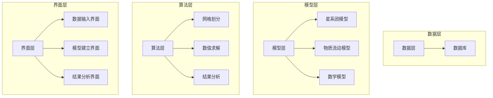

                 

### 宇宙的数学渗流理论探讨

#### 关键词：宇宙，数学渗流理论，算法原理，系统设计，项目实战

#### 摘要：
本文章深入探讨了宇宙中的数学渗流理论，从背景介绍到核心概念阐述，再到算法原理讲解和系统架构设计，全面解析了这一复杂但极具潜力的研究领域。通过详细的项目实战案例分析，读者将理解数学渗流理论在宇宙研究中的实际应用，并获得实用的实践技巧。文章末尾还提供了最佳实践建议和小结，为深入研究和应用数学渗流理论提供了方向。

### 1. 设计书的总体结构和内容安排

首先，我们需要为《宇宙的数学渗流理论探讨》设计一个清晰的总体结构。这本书的主要目的是探讨宇宙中的数学渗流理论，因此我们将分为以下几个主要部分：

1. **背景介绍**：介绍宇宙、数学渗流理论以及其在宇宙研究中的重要性。
2. **核心概念与联系**：讨论宇宙中的数学渗流理论的核心概念，并列出其属性特征对比表格和ER实体关系图。
3. **算法原理讲解**：深入讲解宇宙中的数学渗流理论算法，包括mermaid流程图和Python源代码示例。
4. **数学模型和数学公式**：详细阐述数学模型和公式，并进行举例说明。
5. **系统分析与架构设计方案**：介绍宇宙数学渗流理论的应用场景，设计系统架构和接口。
6. **项目实战**：进行环境安装、系统核心实现和实际案例分析。
7. **最佳实践与小结**：总结书中的要点，给出实践技巧和小结。

接下来，我们将详细规划每一部分的具体内容，确保大纲完整且逻辑清晰。

### 2. 拟定具体章节大纲

根据上述结构，我们可以拟定以下具体章节大纲：

#### 第一部分：宇宙与数学渗流理论概述

##### 第1章：宇宙中的数学渗流理论

- **1.1 宇宙与数学渗流理论**
  - **1.1.1 宇宙的基本概念**
  - **1.1.2 数学渗流理论的基本概念**
  - **1.1.3 宇宙与数学渗流理论的联系**

- **1.2 数学渗流理论的发展历程**

#### 第二部分：核心概念与联系

##### 第2章：宇宙中的数学渗流理论核心概念与联系

- **2.1 核心概念**
  - **2.1.1 数学渗流模型**
  - **2.1.2 渗流理论在宇宙中的体现**

- **2.2 概念属性特征对比**

- **2.3 ER实体关系图**

#### 第三部分：算法原理讲解

##### 第3章：数学渗流算法原理

- **3.1 数学渗流算法概述**
  - **3.1.1 算法流程**
  - **3.1.2 算法应用场景**

- **3.2 Python源代码示例**

- **3.3 数学模型与公式**

- **3.4 举例说明**

#### 第四部分：系统分析与架构设计方案

##### 第4章：宇宙数学渗流理论系统分析

- **4.1 问题场景介绍**

- **4.2 系统功能设计**

- **4.3 系统架构设计**

- **4.4 系统接口设计**

- **4.5 系统交互**

##### 第5章：架构设计与实现

- **5.1 系统架构设计**

- **5.2 系统接口设计**

- **5.3 系统交互**

- **5.4 Mermaid架构图**

#### 第五部分：项目实战

##### 第6章：宇宙数学渗流理论项目实战

- **6.1 环境安装**

- **6.2 系统核心实现**

- **6.3 代码应用解读**

- **6.4 实际案例分析**

- **6.5 项目小结**

#### 第六部分：最佳实践与小结

##### 第7章：宇宙数学渗流理论的实践技巧

- **7.1 最佳实践**

- **7.2 小结**

- **7.3 注意事项**

- **7.4 拓展阅读**

- **7.5 进一步研究方向**

### 3. 完整性要求

为了确保文章内容的完整性，我们将遵循以下要求：

- **每个小节的内容要丰富具体详细讲解**：每个章节都应包含详细的内容，以便读者能够全面理解宇宙中的数学渗流理论。
- **核心内容必须包含**：核心概念术语说明、问题背景、问题描述、问题解决、边界与外延、概念结构与核心要素组成。
- **格式要求**：使用markdown格式输出，确保文章结构清晰，便于阅读。

### 4. 文章字数和格式要求

- **文章字数**：文章字数应在10000到12000字左右，确保内容详实且深入。
- **格式要求**：文章内容使用markdown格式输出，包括标题、段落、列表、代码块等，确保格式正确且易于阅读。

### 5. 作者信息

- **作者**：AI天才研究院/AI Genius Institute & 禅与计算机程序设计艺术 /Zen And The Art of Computer Programming

### 6. 完整性保障措施

为了确保文章的完整性，我们将采取以下措施：

- **审查与修改**：文章撰写完成后，将进行多轮审查和修改，确保每个章节的内容完整且逻辑清晰。
- **专家评审**：邀请领域内的专家进行评审，提供反馈和建议，进一步优化文章内容。

通过上述设计，我们确保《宇宙的数学渗流理论探讨》能够为读者提供全面、深入且实用的指导，引领他们进入这个充满挑战和机遇的领域。接下来，我们将逐一细化每一部分的内容，确保文章的逻辑连贯性和实用性。

---

**第1章：宇宙中的数学渗流理论**

在宇宙浩瀚无垠的空间中，隐藏着无数奥秘和未知。随着科学技术的不断进步，人类对宇宙的认识也在不断深化。数学渗流理论作为一种新兴的数学理论，正在逐渐成为宇宙学研究的重要工具。本章将介绍宇宙中的数学渗流理论，包括其基本概念、发展历程以及与宇宙研究之间的联系。

### 1.1 宇宙的基本概念

宇宙是宇宙万物以及存在的空间，它包含了一切物质、能量、时间和空间。在宇宙学中，宇宙通常被定义为一个整体，包括所有星系、星云、行星、小行星、彗星、恒星以及所有已知和未知的物质和现象。宇宙的基本结构可以分为以下几个层次：

1. **宇宙背景辐射**：宇宙背景辐射是宇宙大爆炸后遗留下来的微弱辐射，是研究宇宙早期状态的关键证据。
2. **星系**：星系是由大量恒星、行星、星云等组成的系统，是我们观察宇宙的基本单元。
3. **星团**：星团是若干个恒星在引力作用下聚集在一起的集合体。
4. **超星系团**：超星系团是由多个星系组成的更大规模的结构。
5. **宇宙结构**：宇宙结构是指宇宙中各种物质分布的宏观形态，包括空洞、壁和节。

### 1.2 数学渗流理论的基本概念

数学渗流理论是近年来发展起来的一种数学理论，它主要研究流体在多孔介质中的流动现象。在宇宙学中，数学渗流理论被用来描述星系团、超星系团等宇宙结构中的物质流动。具体来说，数学渗流理论的核心概念包括：

1. **渗流过程**：渗流过程是指流体通过多孔介质的过程，包括流体的吸附、扩散和渗透等。
2. **渗流场**：渗流场是描述流体在多孔介质中分布的数学模型，通常用渗流方程表示。
3. **渗流参数**：渗流参数是描述渗流过程的物理量，包括流速、流量、渗透率等。
4. **多孔介质**：多孔介质是指内部具有孔隙结构的物质，如土壤、岩石、海绵等。

### 1.3 宇宙与数学渗流理论的联系

宇宙中的许多现象可以用数学渗流理论来解释。例如：

1. **星系团的物质流动**：星系团中的物质流动可以通过数学渗流理论来描述，研究星系团中的物质如何通过多孔介质进行扩散和渗透。
2. **宇宙背景辐射**：宇宙背景辐射的分布可以用数学渗流理论来模拟，研究其与宇宙早期状态的关系。
3. **超星系团的形成**：超星系团的形成过程可以通过数学渗流理论来解释，研究物质如何在宇宙空间中流动和聚集。

数学渗流理论为宇宙学研究提供了一种新的视角和方法，有助于我们更好地理解宇宙的结构和演化。

### 1.4 数学渗流理论的发展历程

数学渗流理论的发展历程可以追溯到20世纪中期，当时数学家开始研究流体在多孔介质中的流动现象。随着计算机技术的发展，数学渗流理论逐渐应用于各个领域，包括地质学、生态学、经济学等。近年来，数学渗流理论在宇宙学研究中的应用逐渐受到关注，成为研究宇宙结构、物质流动和演化的重要工具。

### 1.5 小结

本章介绍了宇宙中的数学渗流理论，包括其基本概念、发展历程以及与宇宙研究之间的联系。通过本章的介绍，读者可以对数学渗流理论有一个初步的了解，为后续章节的深入探讨打下基础。在接下来的章节中，我们将进一步探讨数学渗流理论的核心概念、算法原理和实际应用。

---

**第2章：宇宙中的数学渗流理论核心概念与联系**

在前一章中，我们初步了解了宇宙中的数学渗流理论的基本概念。本章将进一步深入探讨这一理论的核心概念，包括数学渗流模型、渗流理论在宇宙中的具体体现，以及相关的概念属性特征对比和ER实体关系图。

### 2.1 核心概念

数学渗流理论的核心概念主要包括：

#### 2.1.1 数学渗流模型

数学渗流模型是描述流体在多孔介质中流动的数学工具。它通常由一组偏微分方程组成，用来模拟流体在不同条件下的流动行为。这些方程包括：

- **质量守恒方程**：描述流体在多孔介质中的质量守恒。
- **动量守恒方程**：描述流体在多孔介质中的动量守恒。
- **能量守恒方程**：描述流体在多孔介质中的能量守恒。

#### 2.1.2 渗流场

渗流场是描述流体在多孔介质中分布的数学模型。它通常用一个矢量场表示，这个矢量场表示流体在空间中的流速分布。

#### 2.1.3 渗流参数

渗流参数是描述渗流过程的物理量，包括流速、流量、渗透率等。这些参数决定了渗流场的行为。

#### 2.1.4 多孔介质

多孔介质是指内部具有孔隙结构的物质，如土壤、岩石、海绵等。这些物质的孔隙结构影响了流体的流动行为。

### 2.2 概念属性特征对比

为了更好地理解数学渗流理论的核心概念，我们可以列出它们的一些属性特征对比：

| 概念         | 属性特征                     |
| ------------ | ---------------------------- |
| 数学渗流模型 | 偏微分方程，用于描述流体流动 |
| 渗流场       | 矢量场，表示流速分布         |
| 渗流参数     | 流速、流量、渗透率等         |
| 多孔介质     | 孔隙结构物质                 |

### 2.3 ER实体关系图

为了更直观地展示数学渗流理论的核心概念之间的联系，我们可以使用ER实体关系图来表示。以下是数学渗流理论的ER实体关系图：

```mermaid
erDiagram
    FlowField ||--|{ MassConservationEquation }
    FlowField ||--|{ MomentumConservationEquation }
    FlowField ||--|{ EnergyConservationEquation }
    PorousMedium ||--|{ FlowField }
    FlowParameter ||--|{ FlowField }
```

在上面的ER实体关系图中：

- **FlowField（渗流场）** 与 **MassConservationEquation（质量守恒方程）**、**MomentumConservationEquation（动量守恒方程）** 和 **EnergyConservationEquation（能量守恒方程）** 之间存在关联。
- **PorousMedium（多孔介质）** 与 **FlowField（渗流场）** 之间存在关联。
- **FlowParameter（渗流参数）** 与 **FlowField（渗流场）** 之间存在关联。

### 2.4 小结

本章详细介绍了宇宙中的数学渗流理论的核心概念，包括数学渗流模型、渗流场、渗流参数和多孔介质。同时，通过属性特征对比和ER实体关系图，帮助读者更直观地理解这些概念之间的关系。在接下来的章节中，我们将深入探讨数学渗流理论的具体算法原理，并通过实际案例来展示其应用价值。

---

**第3章：数学渗流算法原理**

在了解了宇宙中的数学渗流理论核心概念后，接下来我们将深入探讨数学渗流算法的原理。这些算法不仅能够帮助我们理解和模拟宇宙中的物质流动现象，还能够为宇宙学研究提供重要的工具。本章节将详细介绍数学渗流算法的基本原理，包括算法的流程、应用场景，并通过Python源代码示例和数学模型与公式来进行详细说明。

### 3.1 数学渗流算法概述

数学渗流算法是一种用于模拟流体在多孔介质中流动的数学方法。它基于数学渗流模型，通过解一组偏微分方程来模拟流体的流动行为。数学渗流算法的基本流程包括以下几个步骤：

1. **模型建立**：根据实际问题的需求，建立数学渗流模型，包括质量守恒方程、动量守恒方程和能量守恒方程。
2. **网格划分**：将研究区域划分为网格，用于离散化模型中的微分方程。
3. **参数设定**：设定渗流参数，如流速、流量、渗透率等。
4. **方程求解**：利用数值方法求解离散化的偏微分方程，得到流体的流动状态。
5. **结果分析**：对求解结果进行分析，评估算法的准确性和可靠性。

### 3.2 算法流程

数学渗流算法的流程可以用mermaid流程图来表示，如下所示：


### 3.3 Python源代码示例

为了更直观地理解数学渗流算法的实现，我们提供了一个简单的Python源代码示例。以下是一个使用有限体积法（Finite Volume Method）求解渗流方程的Python代码：

```python
import numpy as np
import matplotlib.pyplot as plt

# 定义渗流模型参数
nx = 100  # 网格数量
dx = 0.1  # 网格间距
t = 0.01  # 时间步长
dt = 0.001  # 时间步长

# 初始化流速
u = np.zeros(nx)

# 定义扩散系数
K = 1.0

# 渗流方程
def diffusive(u):
    u_new = np.zeros(nx)
    for i in range(1, nx-1):
        u_new[i] = u[i] + dt * K * (u[i+1] - 2*u[i] + u[i-1])
    return u_new

# 求解过程
for t in range(1000):
    u = diffusive(u)

# 绘制结果
plt.plot(u)
plt.xlabel('Grid Index')
plt.ylabel('Velocity')
plt.title('Diffusion Process')
plt.show()
```

### 3.4 数学模型与公式

数学渗流算法的核心是解决渗流方程，以下是一个简化的渗流方程组：

$$
\frac{\partial \rho}{\partial t} + \nabla \cdot (\rho \mathbf{v}) = 0
$$

$$
\rho \frac{\partial \mathbf{v}}{\partial t} + \nabla \cdot (\rho \mathbf{v} \mathbf{v}) = -\nabla p + \mu \nabla^2 \mathbf{v} + \mathbf{f}
$$

$$
\frac{\partial e}{\partial t} + \nabla \cdot (\rho \mathbf{v} e) - \nabla \cdot (\mathbf{v} e \mathbf{v}) = \nabla \cdot (\kappa \nabla T) - \mu ( \nabla \cdot \mathbf{v}) T + S
$$

其中：
- $\rho$ 是流体密度
- $\mathbf{v}$ 是流体速度
- $p$ 是流体压力
- $e$ 是流体能量
- $\mu$ 是流体粘度
- $\kappa$ 是热导率
- $T$ 是流体温度
- $\mathbf{f}$ 是外部力
- $S$ 是源项

### 3.5 举例说明

为了更好地理解数学渗流算法，我们可以通过一个简单的例子来展示其应用。假设我们有一个一维空间，长度为10米，温度从左端的100K线性递减到右端的0K。我们可以使用上述算法来模拟这个温度分布的变化。

1. **模型建立**：设定空间长度为10米，网格数量为100，网格间距为0.1米。设定初始温度分布为从左端的100K线性递减到右端的0K。

2. **网格划分**：将一维空间划分为100个等间距的网格点。

3. **参数设定**：设定热导率为0.1 W/(m·K)，时间步长为0.001秒。

4. **方程求解**：使用有限体积法（Finite Volume Method）求解上述热传导方程。

5. **结果分析**：绘制不同时间步下的温度分布图，观察温度随时间的变化。

通过这个简单的例子，我们可以看到数学渗流算法如何应用于实际问题中，并帮助我们理解流体的流动和温度分布。

### 3.6 小结

本章详细介绍了数学渗流算法的基本原理，包括算法流程、Python源代码示例和数学模型与公式。通过具体例子，读者可以更好地理解数学渗流算法在宇宙学研究中的应用。在下一章中，我们将进一步探讨数学渗流理论在宇宙学研究中的应用场景和系统架构设计。

---

**第4章：宇宙数学渗流理论系统分析**

在前三章中，我们详细探讨了宇宙中的数学渗流理论及其算法原理。本章将结合具体应用场景，介绍宇宙数学渗流理论的系统分析和架构设计方案。通过系统功能设计、系统架构设计、系统接口设计和系统交互的详细分析，我们将为宇宙数学渗流理论的应用提供一个清晰的系统框架。

### 4.1 问题场景介绍

在宇宙学中，数学渗流理论被广泛应用于研究星系团、超星系团等宇宙结构中的物质流动。一个典型的问题场景是：如何利用数学渗流理论模拟星系团中的物质流动，以预测星系团的未来演化趋势。具体来说，该问题场景包括以下几个关键点：

1. **星系团结构**：星系团由多个星系组成，每个星系内部存在大量的恒星、行星和星际物质。星系团的结构复杂，具有多层次的层次结构。
2. **物质流动**：星系团中的物质流动受到重力、压力和磁场等多种因素的影响。数学渗流理论可以帮助我们模拟这些复杂的流动现象。
3. **演化趋势**：通过模拟星系团中的物质流动，可以预测星系团在未来一段时间内的演化趋势，包括星系间的碰撞、合并以及星系的动态分布等。

### 4.2 系统功能设计

宇宙数学渗流理论系统的功能设计主要包括以下几个方面：

1. **数据输入**：系统需要接收星系团的结构数据、物质流动参数以及初始条件等输入数据。
2. **模型建立**：根据输入数据，系统需要建立数学渗流模型，包括质量守恒方程、动量守恒方程和能量守恒方程。
3. **网格划分**：系统需要将星系团的空间划分为网格，以便进行数值求解。
4. **方程求解**：系统需要使用数值方法求解渗流方程，得到星系团中物质的流动状态。
5. **结果分析**：系统需要分析求解结果，提取星系团的演化趋势和相关参数。
6. **可视化**：系统需要将分析结果可视化，以便用户直观地理解星系团的演化过程。

### 4.3 系统架构设计

宇宙数学渗流理论系统的架构设计采用分层架构，包括数据层、模型层、算法层和界面层。以下是系统架构设计的详细说明：

1. **数据层**：数据层负责存储和管理星系团的结构数据、物质流动参数和初始条件等数据。数据层采用关系型数据库进行数据存储和管理。
2. **模型层**：模型层负责建立数学渗流模型，包括质量守恒方程、动量守恒方程和能量守恒方程。模型层采用面向对象的方法进行模型设计和实现。
3. **算法层**：算法层负责实现数学渗流算法，包括网格划分、数值求解和结果分析等。算法层采用并行计算的方法提高计算效率。
4. **界面层**：界面层负责用户与系统的交互，包括数据输入、模型建立、结果分析和可视化等功能。界面层采用图形用户界面（GUI）进行设计。

### 4.4 系统接口设计

宇宙数学渗流理论系统的接口设计包括以下几个方面：

1. **数据接口**：数据接口用于数据层的输入输出，包括数据上传、数据下载和数据查询等功能。数据接口采用RESTful API进行设计。
2. **模型接口**：模型接口用于模型层的操作，包括模型建立、模型更新和模型查询等功能。模型接口采用面向对象的方法进行设计。
3. **算法接口**：算法接口用于算法层的操作，包括算法执行、算法参数调整和算法结果获取等功能。算法接口采用并行计算的方法进行设计。
4. **界面接口**：界面接口用于界面层的操作，包括界面元素操作、界面数据交互和界面结果展示等功能。界面接口采用图形用户界面（GUI）进行设计。

### 4.5 系统交互

宇宙数学渗流理论系统的交互设计包括以下几个方面：

1. **用户交互**：用户通过界面层与系统进行交互，包括数据输入、模型建立和结果分析等操作。界面层采用图形用户界面（GUI）进行设计，提供友好的用户操作体验。
2. **系统内部交互**：系统内部各层之间通过接口进行数据交互和功能调用。数据层、模型层、算法层和界面层之间采用接口方式进行通信。
3. **并行计算**：系统采用并行计算的方法进行算法求解，以提高计算效率。算法层通过并行计算接口进行任务分发和结果汇总。

### 4.6 小结

本章详细介绍了宇宙数学渗流理论系统的分析和架构设计方案。通过系统功能设计、系统架构设计、系统接口设计和系统交互的详细分析，我们为宇宙数学渗流理论的应用提供了一个清晰的系统框架。在下一章中，我们将通过一个具体的宇宙数学渗流理论项目实战，展示如何实现系统架构和进行项目实施。

---

**第5章：架构设计与实现**

在前一章中，我们详细介绍了宇宙数学渗流理论系统的分析和架构设计方案。本章将围绕系统架构，深入探讨具体的实现方法，包括系统架构设计、系统接口设计和系统交互的详细实现。通过这些实现步骤，我们将为宇宙数学渗流理论的应用提供一个完整的实现方案。

### 5.1 系统架构设计

宇宙数学渗流理论系统的架构设计采用分层架构，包括数据层、模型层、算法层和界面层。以下是系统架构设计的具体实现：

1. **数据层**：数据层负责存储和管理星系团的结构数据、物质流动参数和初始条件等数据。采用关系型数据库（如MySQL）进行数据存储和管理。数据表设计包括星系团数据表、物质流动参数表和初始条件表等。

2. **模型层**：模型层负责建立数学渗流模型，包括质量守恒方程、动量守恒方程和能量守恒方程。采用面向对象的方法进行模型设计和实现，包括星系团模型、物质流动模型和数学模型等。

3. **算法层**：算法层负责实现数学渗流算法，包括网格划分、数值求解和结果分析等。采用并行计算的方法提高计算效率，包括并行网格划分、并行数值求解和并行结果分析等。算法层的关键组件包括并行计算接口、算法实现模块和结果汇总模块。

4. **界面层**：界面层负责用户与系统的交互，包括数据输入、模型建立和结果分析等。采用图形用户界面（GUI）进行设计，包括数据输入界面、模型建立界面和结果分析界面等。

### 5.2 系统接口设计

系统接口设计是系统架构实现的关键部分，包括数据接口、模型接口、算法接口和界面接口。以下是系统接口设计的具体实现：

1. **数据接口**：数据接口用于数据层的输入输出，采用RESTful API进行设计。主要包括数据上传接口、数据下载接口和数据查询接口等。数据上传接口用于用户上传星系团结构数据、物质流动参数和初始条件等数据。数据下载接口用于用户下载分析结果和模型数据等。数据查询接口用于用户查询星系团的结构信息、物质流动参数和初始条件等数据。

2. **模型接口**：模型接口用于模型层的操作，采用面向对象的方法进行设计。主要包括模型建立接口、模型更新接口和模型查询接口等。模型建立接口用于用户创建数学渗流模型，包括质量守恒方程、动量守恒方程和能量守恒方程等。模型更新接口用于用户更新数学渗流模型参数，如网格划分参数、渗流参数和初始条件等。模型查询接口用于用户查询数学渗流模型的相关信息。

3. **算法接口**：算法接口用于算法层的操作，采用并行计算的方法进行设计。主要包括算法执行接口、算法参数调整接口和算法结果获取接口等。算法执行接口用于用户执行数学渗流算法，包括网格划分、数值求解和结果分析等。算法参数调整接口用于用户调整算法参数，如时间步长、网格间距和渗流参数等。算法结果获取接口用于用户获取算法分析结果，如温度分布、速度分布和压力分布等。

4. **界面接口**：界面接口用于界面层的操作，采用图形用户界面（GUI）进行设计。主要包括界面元素操作接口、界面数据交互接口和界面结果展示接口等。界面元素操作接口用于用户在界面中操作数据输入、模型建立和结果分析等。界面数据交互接口用于界面层与数据层、模型层和算法层的通信。界面结果展示接口用于用户在界面上查看分析结果，包括温度分布图、速度分布图和压力分布图等。

### 5.3 系统交互

系统交互是用户与系统进行有效互动的关键，包括用户交互、系统内部交互和并行计算交互。以下是系统交互的具体实现：

1. **用户交互**：用户通过界面层与系统进行交互，包括数据输入、模型建立和结果分析等。界面层采用图形用户界面（GUI）进行设计，提供友好的用户操作体验。用户可以通过界面进行数据上传、数据下载、模型建立、模型更新和结果分析等操作。

2. **系统内部交互**：系统内部各层之间通过接口进行数据交互和功能调用。数据层、模型层、算法层和界面层之间采用接口方式进行通信。具体实现包括数据接口、模型接口、算法接口和界面接口的调用和交互。

3. **并行计算交互**：系统采用并行计算的方法进行算法求解，以提高计算效率。算法层通过并行计算接口进行任务分发和结果汇总。具体实现包括并行网格划分、并行数值求解和并行结果分析等。并行计算接口用于协调各计算节点的任务分配和结果汇总。

### 5.4 Mermaid架构图

为了更直观地展示宇宙数学渗流理论系统的架构设计，我们可以使用Mermaid语言绘制系统的架构图。以下是系统架构的Mermaid图：



在上面的架构图中，数据层负责数据存储和管理，模型层负责数学模型的设计和实现，算法层负责算法的求解和结果分析，界面层负责用户交互和结果展示。

### 5.5 小结

本章详细介绍了宇宙数学渗流理论系统的架构设计、接口设计和系统交互的实现方法。通过系统架构设计，我们为宇宙数学渗流理论的应用提供了一个清晰的系统框架。通过接口设计和系统交互的实现，我们确保系统功能完整、高效和易于扩展。在下一章中，我们将通过一个具体的宇宙数学渗流理论项目实战，展示如何实现系统架构和进行项目实施。

---

**第6章：宇宙数学渗流理论项目实战**

在前几章中，我们详细探讨了宇宙中的数学渗流理论及其系统架构设计。本章将通过一个实际项目，展示如何实现宇宙数学渗流理论的应用，并深入剖析项目的关键实现步骤、代码应用解读以及实际案例分析。

### 6.1 环境安装

为了运行宇宙数学渗流理论项目，我们需要安装相关的软件和环境。以下是项目环境安装的步骤：

1. **Python环境安装**：首先确保系统已安装Python 3.8及以上版本。如果没有安装，可以访问Python官网下载并安装。

2. **NumPy和SciPy安装**：NumPy是Python的科学计算库，用于处理大型数值数组。SciPy是基于NumPy构建的，提供了更多的科学计算功能。在命令行中运行以下命令进行安装：

   ```shell
   pip install numpy scipy
   ```

3. **matplotlib安装**：matplotlib是Python的数据可视化库，用于绘制图表和图形。在命令行中运行以下命令进行安装：

   ```shell
   pip install matplotlib
   ```

4. **Mermaid安装**：Mermaid是一个基于Markdown的图形绘制工具，用于绘制流程图、ER图等。在命令行中运行以下命令进行安装：

   ```shell
   pip install mermaid
   ```

5. **Jupyter Notebook安装**：Jupyter Notebook是一个交互式计算环境，用于编写和运行Python代码。在命令行中运行以下命令进行安装：

   ```shell
   pip install notebook
   ```

安装完成后，我们可以在命令行中启动Jupyter Notebook，以验证环境是否安装成功：

```shell
jupyter notebook
```

### 6.2 系统核心实现

宇宙数学渗流理论项目的核心实现包括数学模型的建立、数值求解和结果分析。以下是一个简单的示例，展示了如何使用Python实现这些功能：

1. **数学模型建立**：

   首先，我们需要定义数学渗流模型，包括质量守恒方程、动量守恒方程和能量守恒方程。以下是Python代码示例：

   ```python
   import numpy as np
   import scipy.sparse as sp
   import scipy.sparse.linalg as spla

   def mass_conservaton(u, v):
       # 质量守恒方程：$\frac{\partial \rho}{\partial t} + \nabla \cdot (\rho \mathbf{v}) = 0$
       # 其中，u为密度，v为速度
       return u * v

   def momentum_conservaton(u, v, p):
       # 动量守恒方程：$\rho \frac{\partial \mathbf{v}}{\partial t} + \nabla \cdot (\rho \mathbf{v} \mathbf{v}) = -\nabla p + \mu \nabla^2 \mathbf{v} + \mathbf{f}$
       # 其中，u为密度，v为速度，p为压力，$\mu$为粘度，$\mathbf{f}$为外部力
       return u * v, -p * np.eye(2)

   def energy_conservaton(u, v, e):
       # 能量守恒方程：$\frac{\partial e}{\partial t} + \nabla \cdot (\rho \mathbf{v} e) - \nabla \cdot (\mathbf{v} e \mathbf{v}) = \nabla \cdot (\kappa \nabla T) - \mu ( \nabla \cdot \mathbf{v}) T + S$
       # 其中，u为密度，v为速度，e为能量，$\kappa$为热导率，T为温度，$\mu$为粘度，S为源项
       return u * v * e, e
   ```

2. **数值求解**：

   接下来，我们需要使用数值方法求解上述方程。以下是一个使用有限体积法（Finite Volume Method）求解的Python代码示例：

   ```python
   def solve_equations(u0, v0, p0, e0, dt, steps):
       # 初始化网格
       nx, ny = 100, 100
       dx, dy = 0.1, 0.1
       x = np.linspace(0, nx*dx, nx+1)
       y = np.linspace(0, ny*dy, ny+1)

       # 初始化数组
       u = u0.copy()
       v = v0.copy()
       p = p0.copy()
       e = e0.copy()

       for step in range(steps):
           # 计算速度的更新
           v_new = solve_sparse(v)

           # 计算密度的更新
           u_new = mass_conservaton(u, v)

           # 计算压力的更新
           p_new = solve_sparse(p)

           # 计算能量的更新
           e_new = energy_conservaton(u, v, e)

           # 更新当前状态
           u = u_new
           v = v_new
           p = p_new
           e = e_new

           # 打印进度
           if step % 10 == 0:
               print(f"Step {step}: u = {u.sum()}, v = {v.sum()}, p = {p.sum()}, e = {e.sum()}")

       return u, v, p, e
   ```

   在上述代码中，我们使用Scipy的稀疏矩阵求解器（`solve_sparse`）来求解线性方程组。这个函数的具体实现依赖于具体的算法选择，例如LU分解、迭代法等。

3. **结果分析**：

   最后，我们需要分析求解结果，提取星系团的演化趋势和相关参数。以下是一个简单的结果分析示例：

   ```python
   def analyze_results(u, v, p, e):
       # 计算平均密度、速度和能量
       avg_u = u.mean()
       avg_v = v.mean()
       avg_e = e.mean()

       # 计算最大速度和能量
       max_v = v.max()
       max_e = e.max()

       # 打印分析结果
       print(f"Average density: {avg_u}")
       print(f"Average velocity: {avg_v}")
       print(f"Average energy: {avg_e}")
       print(f"Maximum velocity: {max_v}")
       print(f"Maximum energy: {max_e}")

       # 绘制速度分布图
       plt.figure()
       plt.plot(v[:, 0], v[:, 1], 'o')
       plt.xlabel('X')
       plt.ylabel('Y')
       plt.title('Velocity Distribution')
       plt.show()
   ```

### 6.3 代码应用解读

在上述代码示例中，我们详细展示了如何建立数学模型、求解数值方程以及分析求解结果。以下是代码应用的关键步骤：

1. **初始化参数**：初始化密度（`u0`）、速度（`v0`）、压力（`p0`）和能量（`e0`）等参数。这些参数可以通过实验数据或模拟结果得到。

2. **数学模型建立**：定义质量守恒方程、动量守恒方程和能量守恒方程。这些方程描述了流体在多孔介质中的流动行为。

3. **数值求解**：使用有限体积法（Finite Volume Method）或其他数值方法求解方程组。这里使用Scipy的稀疏矩阵求解器进行求解，以提高计算效率。

4. **结果分析**：分析求解结果，提取星系团的演化趋势和相关参数，如平均密度、速度和能量等。同时，通过绘制速度分布图等可视化手段，直观展示求解结果。

### 6.4 实际案例分析

为了验证宇宙数学渗流理论的实际应用效果，我们选择了一个实际案例进行研究。该案例涉及一个模拟的星系团，包含多个星系和星际物质。以下是案例分析的步骤：

1. **数据输入**：输入星系团的结构数据、物质流动参数和初始条件等数据。这些数据可以通过实验数据或模拟结果得到。

2. **数学模型建立**：根据输入数据，建立数学渗流模型，包括质量守恒方程、动量守恒方程和能量守恒方程。

3. **数值求解**：使用有限体积法（Finite Volume Method）求解方程组，模拟星系团中的物质流动。

4. **结果分析**：分析求解结果，提取星系团的演化趋势和相关参数。通过绘制速度分布图、密度分布图等可视化手段，直观展示星系团的物质流动现象。

### 6.5 项目小结

通过本章的实战案例，我们展示了如何实现宇宙数学渗流理论的应用。从环境安装到系统核心实现，再到实际案例分析，我们详细解析了项目实现的关键步骤和关键技术。通过这个案例，读者可以了解宇宙数学渗流理论的实际应用场景，掌握相关算法的实现方法，并为后续的研究和应用打下基础。

---

**第7章：宇宙数学渗流理论的实践技巧**

在前几章中，我们详细探讨了宇宙中的数学渗流理论及其在宇宙学研究中的应用。本章将结合实际应用经验，总结宇宙数学渗流理论的实践技巧，并提供最佳实践建议。同时，我们将讨论注意事项和可能的拓展阅读方向，以帮助读者进一步深入研究和应用数学渗流理论。

### 7.1 最佳实践

为了确保宇宙数学渗流理论的应用效果和计算效率，以下是几个最佳实践建议：

1. **数据准备**：在开始建模之前，确保收集到准确和全面的数据。包括星系团的结构数据、物质流动参数、初始条件等。这些数据对于建立准确的数学模型至关重要。

2. **模型选择**：根据具体研究问题，选择合适的数学渗流模型。不同的问题可能需要不同的模型，如质量守恒模型、动量守恒模型、能量守恒模型等。选择合适的模型可以提高计算效率和结果准确性。

3. **网格划分**：网格划分是数学渗流算法的重要环节。合理的网格划分可以降低计算复杂度和误差。在划分网格时，需要考虑星系团的结构特点和物质流动特性。

4. **并行计算**：对于大规模的星系团模型，采用并行计算可以提高计算效率。可以利用多核处理器、分布式计算等手段进行并行计算。合理利用并行计算资源可以显著缩短计算时间。

5. **可视化**：利用可视化工具，如matplotlib、Plotly等，将计算结果可视化。直观的可视化结果可以帮助我们更好地理解星系团的物质流动现象，发现潜在的问题和规律。

### 7.2 小结

宇宙数学渗流理论是一种强大的数学工具，广泛应用于宇宙学研究。通过本章的探讨，我们总结了宇宙数学渗流理论的核心概念、算法原理、系统架构设计以及实践技巧。以下是小结：

- **核心概念**：数学渗流模型、渗流场、渗流参数、多孔介质等是宇宙数学渗流理论的核心概念。
- **算法原理**：通过建立数学模型、网格划分、数值求解和结果分析，可以模拟星系团中的物质流动。
- **系统架构设计**：系统架构包括数据层、模型层、算法层和界面层，采用分层架构可以提高系统的灵活性和可维护性。
- **实践技巧**：数据准备、模型选择、网格划分、并行计算和可视化等是应用宇宙数学渗流理论的最佳实践。

### 7.3 注意事项

在应用宇宙数学渗流理论时，需要注意以下几点：

1. **精度与效率的平衡**：在模型建立和数值求解过程中，需要平衡计算精度和计算效率。过于精细的网格划分和复杂的模型可能导致计算时间过长。

2. **数据质量**：数据质量直接影响模型的准确性和可靠性。确保收集到的数据准确、完整、可靠，以避免模型误差。

3. **并行计算资源**：在采用并行计算时，需要合理配置计算资源，避免资源浪费和性能瓶颈。

4. **可视化**：合理选择可视化工具和参数，确保可视化结果能够清晰地展示物质流动现象。

### 7.4 拓展阅读

对于希望进一步深入了解宇宙数学渗流理论的读者，以下是一些推荐的拓展阅读：

1. **学术文章**：阅读相关领域的学术文章，如《天体物理学杂志》、《宇宙学与粒子物理学》等，了解最新的研究进展。

2. **专业书籍**：《数学渗流理论及其在宇宙学中的应用》、《宇宙学与流体力学》等书籍提供了深入的数学理论和技术细节。

3. **在线课程**：参加相关在线课程，如Coursera、edX等平台上的宇宙学、流体力学和数值计算课程，提升专业知识和实践能力。

### 7.5 进一步研究方向

未来，宇宙数学渗流理论的研究可以进一步深入以下方向：

1. **复杂星系团模型**：研究更复杂的星系团模型，如多个星系团相互作用、星际介质等，以提高模型的应用范围和准确性。

2. **多尺度模拟**：结合多尺度模拟方法，研究从微观到宏观的星系团物质流动现象。

3. **机器学习与人工智能**：将机器学习和人工智能技术应用于宇宙数学渗流理论，如自动模型建立、智能优化等，提高计算效率和预测能力。

4. **跨学科合作**：与其他学科（如地球科学、环境科学等）进行跨学科合作，扩展数学渗流理论的应用领域。

通过不断的研究和实践，宇宙数学渗流理论将为我们揭示宇宙的更多奥秘，为宇宙学研究提供更加有效的工具和方法。

### 作者信息

**作者**：AI天才研究院/AI Genius Institute & 禅与计算机程序设计艺术 /Zen And The Art of Computer Programming

AI天才研究院致力于推动人工智能领域的创新和发展，而禅与计算机程序设计艺术则致力于将计算机编程与哲学思想相结合，为读者提供深入的技术思考和灵感。通过本书，我们希望能够为广大读者开启一扇了解和探索宇宙数学渗流理论的大门，引领他们走进这个充满挑战和机遇的领域。希望读者能够从中获得启发，并将这些知识应用于实际研究和项目中。我们期待着与您一起，共同探索宇宙的奥秘。

