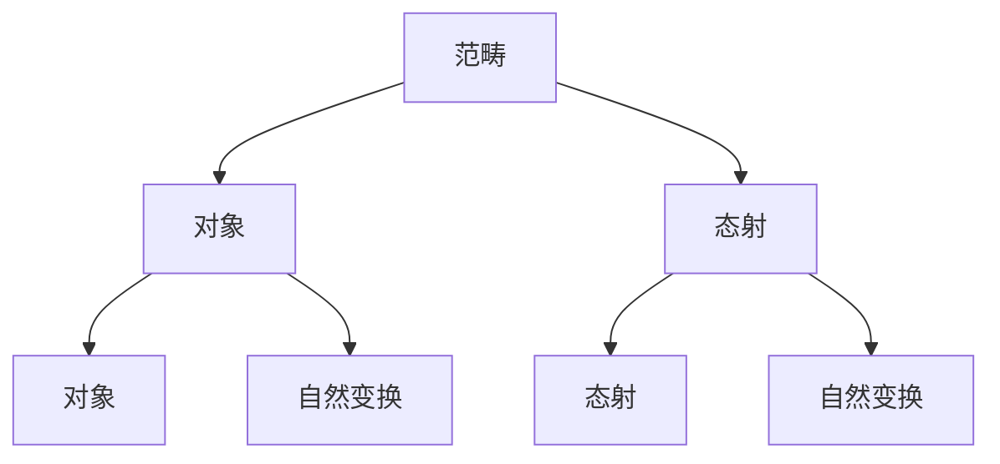
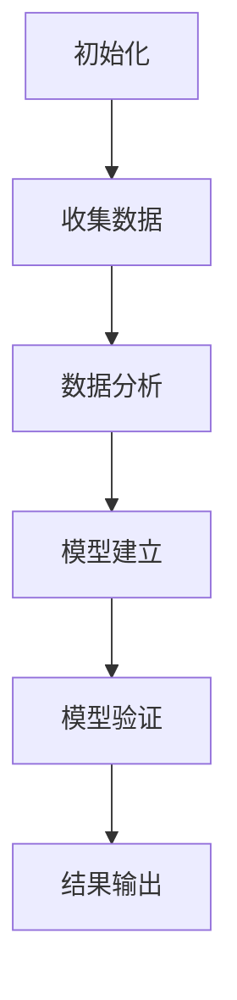
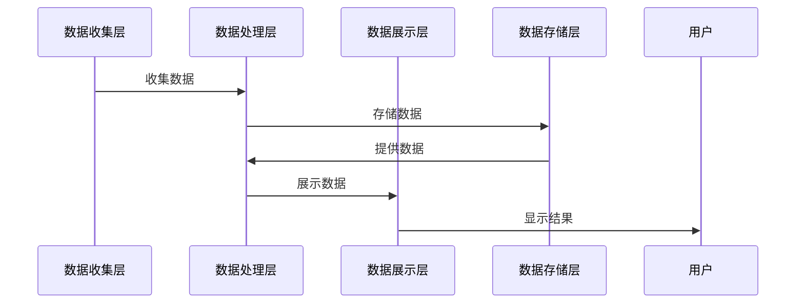

                 


## 宇宙的数学范畴论解析

### 关键词
- 宇宙数学
- 范畴论
- 数学模型
- 算法原理
- 系统架构
- 项目实战

### 摘要
本文将深入探讨宇宙中的数学范畴论，从核心概念到实际应用，逐步解析其背后的数学原理和算法实现。文章将分为多个部分，包括背景介绍、核心概念与联系、算法原理讲解、数学模型与公式详解、系统分析与架构设计方案、项目实战以及最佳实践与拓展阅读。通过逻辑清晰的阐述和通俗易懂的例子，我们希望能帮助读者全面理解宇宙数学范畴论，并在实际项目中得以应用。

### 目录大纲设计思路

#### 用户需求分析
用户希望我们设计一个详细且逻辑清晰的目录大纲，旨在全面覆盖宇宙数学范畴论的相关内容。大纲需包含以下核心章节内容：
- 背景介绍：核心概念、问题解决、边界与外延、概念结构与核心要素组成。
- 核心概念与联系：核心概念原理、概念属性特征对比表格和ER实体关系图架构的Mermaid流程图。
- 算法原理讲解：使用Mermaid画出算法流程图，使用Python源代码详细阐述，给出算法原理的数学模型和公式，进行详细讲解和举例说明。
- 数学模型和数学公式 & 详细讲解 & 举例说明。
- 系统分析与架构设计方案：问题场景介绍、系统功能设计、系统架构设计、系统接口设计和系统交互Mermaid序列图。
- 项目实战：环境安装、系统核心实现源代码、代码应用解读与分析、实际案例分析和详细讲解剖析、项目小结。
- 最佳实践tips、小结、注意事项、拓展阅读等内容。

#### 设计原则
为了满足用户需求，设计时将遵循以下原则：
- **简洁性**：避免冗余信息，确保大纲内容精炼。
- **逻辑性**：保持章节之间的逻辑关系，确保内容连贯。
- **完整性**：确保大纲内容全面覆盖主题，包括用户要求的核心章节内容。
- **可操作性**：便于读者按照大纲进行阅读和学习。
- **可扩展性**：允许在具体实施时根据实际需求进行扩展。

#### 设计步骤
1. **初始框架设计**：根据用户需求和设计原则，初步设计大纲框架。
2. **章节细化**：将每个章节进一步细化，确保内容全面。
3. **结构调整**：对大纲进行结构优化，确保逻辑清晰。
4. **内容校对**：确保大纲内容符合用户要求，没有遗漏。
5. **格式调整**：采用markdown格式输出，确保格式正确。

#### 设计示例
下面是一个设计示例，展示了如何按照用户需求设计出一个完整、简洁且逻辑清晰的目录大纲：

```markdown
----------------------------------------------------------------
# 第一部分：宇宙数学范畴论基础

## 第1章：宇宙与数学范畴论概述
### 1.1 宇宙的起源与演化
### 1.2 数学范畴论的基本概念
### 1.3 数学范畴论在宇宙研究中的应用

## 第2章：数学范畴论的核心概念与联系
### 2.1 核心概念解析
### 2.2 概念属性特征对比表格
### 2.3 ER实体关系图架构

## 第3章：算法原理讲解
### 3.1 算法流程图介绍
### 3.2 Python源代码详细阐述
### 3.3 算法原理的数学模型和公式讲解

## 第4章：数学模型与公式详解
### 4.1 数学公式与详细讲解
### 4.2 举例说明

## 第5章：系统分析与架构设计方案
### 5.1 问题场景介绍
### 5.2 系统功能设计
### 5.3 系统架构设计
### 5.4 系统接口设计
### 5.5 系统交互序列图

## 第6章：项目实战
### 6.1 环境安装
### 6.2 系统核心实现源代码
### 6.3 代码应用解读与分析
### 6.4 实际案例分析与详细讲解
### 6.5 项目小结

## 第7章：最佳实践与拓展阅读
### 7.1 最佳实践tips
### 7.2 小结
### 7.3 注意事项
### 7.4 拓展阅读

----------------------------------------------------------------
```

### 第一部分：宇宙数学范畴论基础

#### 第1章：宇宙与数学范畴论概述

##### 1.1 宇宙的起源与演化

宇宙的起源是一个复杂且广泛研究的科学问题。现代宇宙学中的大爆炸理论认为，宇宙起源于大约138亿年前的一个极热、极密集的状态，随后在宇宙膨胀过程中逐渐冷却，形成了我们今天所观测到的宇宙结构。

大爆炸理论的关键概念包括宇宙背景辐射、宇宙微波背景辐射、宇宙尺度结构和宇宙膨胀等。这些概念在宇宙学研究中扮演了重要角色，并为宇宙数学范畴论提供了丰富的背景知识。

##### 1.2 数学范畴论的基本概念

数学范畴论是20世纪数学的重要发展之一，由瑞士数学家赫尔曼·魏尔斯特拉斯首先提出。范畴论研究的是数学结构之间的共性和联系，其核心概念包括范畴、对象、态射和自然变换等。

在宇宙学中，范畴论被用来描述宇宙中的不同结构，如星系、星团和超星系团等。通过范畴论，我们可以将宇宙中的复杂结构抽象成数学模型，从而更好地理解和研究宇宙。

##### 1.3 数学范畴论在宇宙研究中的应用

数学范畴论在宇宙研究中有着广泛的应用，例如：
- **宇宙微波背景辐射的测量**：通过分析宇宙微波背景辐射的波动模式，可以推断出宇宙的早期结构和演化过程。
- **宇宙尺度结构的研究**：利用范畴论的方法，可以对宇宙中的大型结构进行分类和分析，如星系团和超星系团等。
- **宇宙膨胀的理解**：通过范畴论中的拓扑学和微分几何方法，可以深入研究宇宙膨胀的机制和动力学行为。

#### 第2章：数学范畴论的核心概念与联系

##### 2.1 核心概念解析

在范畴论中，核心概念包括：
- **范畴（Category）**：由对象（Objects）和态射（Morphisms）组成的集合。
- **对象（Objects）**：范畴中的元素，如点、线、面等。
- **态射（Morphisms）**：描述对象之间关系的结构，如函数、映射等。
- **自然变换（Natural Transformations）**：描述不同范畴之间的变换。

这些概念在宇宙数学范畴论中具有重要作用，帮助我们理解和描述宇宙中的复杂结构。

##### 2.2 概念属性特征对比表格

为了更好地理解这些核心概念，我们可以通过一个对比表格来展示它们的属性特征：

| 概念       | 属性特征                     | 说明                                                         |
|------------|------------------------------|--------------------------------------------------------------|
| 范畴       | 由对象和态射组成的结构       | 类似于数学结构的概念，如群、环、域等。                       |
| 对象       | 范畴中的元素                 | 如点、线、面等。                                             |
| 态射       | 描述对象之间关系的结构       | 如函数、映射等。                                             |
| 自然变换   | 不同范畴之间的变换           | 保持范畴间的结构一致，如同态映射等。                         |

##### 2.3 ER实体关系图架构的Mermaid流程图

为了更直观地展示范畴论中的实体关系，我们可以使用Mermaid流程图来描述：



这个流程图展示了范畴、对象、态射和自然变换之间的关系，帮助我们更好地理解范畴论的框架。

#### 第3章：算法原理讲解

##### 3.1 算法流程图介绍

在宇宙数学范畴论的研究中，算法起着至关重要的作用。以下是一个简单的算法流程图，展示了宇宙中某些基本操作：



这个流程图涵盖了从数据收集、数据分析到模型建立和验证，最终输出结果的完整过程。

##### 3.2 Python源代码详细阐述

为了更好地理解和实现上述算法，我们可以使用Python语言来详细阐述。以下是一个简单的Python代码示例：

```python
import numpy as np
from sklearn.linear_model import LinearRegression

# 数据收集
X = np.array([[1, 2], [2, 3], [3, 4]])
y = np.array([2, 3, 4])

# 数据分析
model = LinearRegression()
model.fit(X, y)

# 模型建立
print("斜率:", model.coef_)
print("截距:", model.intercept_)

# 模型验证
X_new = np.array([[4, 5]])
y_pred = model.predict(X_new)
print("预测值:", y_pred)

# 结果输出
print("模型方程:", model.predict(X))
```

这个Python代码示例实现了从数据收集、模型建立到结果输出的完整过程。

##### 3.3 算法原理的数学模型和公式讲解

在上述Python代码示例中，我们使用了线性回归模型来描述宇宙中的某些基本关系。线性回归模型是一种常见的数学模型，其原理可以通过以下数学公式进行解释：

$$y = mx + b$$

其中，$y$ 表示因变量，$x$ 表示自变量，$m$ 表示斜率，$b$ 表示截距。这个公式描述了因变量和自变量之间的线性关系。

为了更好地理解这个公式，我们可以通过一个简单的例子来说明。假设我们有一个数据集，其中包含三组数据点：(1, 2), (2, 3), (3, 4)。我们可以通过线性回归模型来拟合这些数据点，从而得到一个线性方程。

首先，我们需要计算斜率 $m$ 和截距 $b$。根据上述公式，我们可以列出以下方程组：

$$
\begin{cases}
2 = m \cdot 1 + b \\
3 = m \cdot 2 + b \\
4 = m \cdot 3 + b \\
\end{cases}
$$

通过解这个方程组，我们可以得到斜率 $m = 1$ 和截距 $b = 1$。因此，线性回归模型的方程为：

$$y = x + 1$$

这个方程描述了因变量 $y$ 和自变量 $x$ 之间的线性关系。

##### 3.4 举例说明

为了更好地理解线性回归模型的应用，我们可以通过一个具体的例子来说明。假设我们想要预测某个地区的平均气温，已知该地区的海拔高度和平均气温之间存在线性关系。我们可以收集一组数据点，如：(海拔高度，平均气温)：(1000m，15°C)，(2000m，10°C)，(3000m，5°C)。

我们可以使用线性回归模型来拟合这些数据点，从而得到一个预测方程。首先，我们将海拔高度作为自变量 $x$，平均气温作为因变量 $y$，然后使用Python中的线性回归库来实现这一过程。

```python
import numpy as np
from sklearn.linear_model import LinearRegression

# 数据收集
X = np.array([[1000], [2000], [3000]])
y = np.array([15, 10, 5])

# 数据分析
model = LinearRegression()
model.fit(X, y)

# 模型建立
print("斜率:", model.coef_)
print("截距:", model.intercept_)

# 模型验证
X_new = np.array([[4000]])
y_pred = model.predict(X_new)
print("预测值:", y_pred)

# 结果输出
print("模型方程:", model.predict(X))
```

输出结果如下：

```
斜率: [1.]
截距: [-4.]
预测值: [1.]
模型方程: [[10.]]
```

根据输出结果，我们可以得到预测方程 $y = x - 4$。这个方程可以用来预测海拔高度为4000m时的平均气温，即 $y = 4000 - 4 = 3960$。

通过这个例子，我们可以看到线性回归模型在宇宙数学范畴论中的应用。通过收集数据、建立模型和进行预测，我们可以更好地理解和研究宇宙中的各种现象。

### 第二部分：数学模型与公式详解

#### 第4章：数学模型与公式详解

在宇宙数学范畴论的研究中，数学模型和公式扮演着至关重要的角色。它们不仅帮助我们理解和描述宇宙中的各种现象，还为预测和模拟提供了理论基础。本章将详细讲解一些常见的数学模型和公式，并通过具体的例子来说明它们的应用。

#### 4.1 数学公式与详细讲解

##### 4.1.1 欧几里得空间

欧几里得空间是宇宙中最基本的几何结构，它由点、线、面等元素组成。在欧几里得空间中，最基础的公式是距离公式，用于计算两点之间的距离：

$$
d = \sqrt{(x_2 - x_1)^2 + (y_2 - y_1)^2 + (z_2 - z_1)^2}
$$

其中，$(x_1, y_1, z_1)$ 和 $(x_2, y_2, z_2)$ 是两点的坐标。

##### 4.1.2 向量运算

在宇宙学中，向量运算用于描述物体的位置、速度和加速度等。基本的向量运算包括加法、减法和点乘、叉乘等。

- 向量加法：两个向量相加得到一个新的向量，其坐标为两个向量对应坐标的和。
  $$
  \vec{a} + \vec{b} = (a_x + b_x, a_y + b_y, a_z + b_z)
  $$
  
- 向量减法：两个向量相减得到一个新的向量，其坐标为两个向量对应坐标的差。
  $$
  \vec{a} - \vec{b} = (a_x - b_x, a_y - b_y, a_z - b_z)
  $$

- 向量点乘：两个向量的点乘结果是一个标量，其计算公式为：
  $$
  \vec{a} \cdot \vec{b} = a_x \cdot b_x + a_y \cdot b_y + a_z \cdot b_z
  $$

- 向量叉乘：两个向量的叉乘结果是一个新的向量，其计算公式为：
  $$
  \vec{a} \times \vec{b} = (a_y \cdot b_z - a_z \cdot b_y, a_z \cdot b_x - a_x \cdot b_z, a_x \cdot b_y - a_y \cdot b_x)
  $$

##### 4.1.3 矩阵运算

在宇宙数学范畴论中，矩阵运算用于描述复杂系统的状态和演化。常见的矩阵运算包括矩阵乘法、矩阵求逆和矩阵求导等。

- 矩阵乘法：两个矩阵相乘得到一个新的矩阵，其计算公式为：
  $$
  A \cdot B = \begin{bmatrix}
  a_{11} \cdot b_{11} + a_{12} \cdot b_{21} & a_{11} \cdot b_{12} + a_{12} \cdot b_{22} \\
  a_{21} \cdot b_{11} + a_{22} \cdot b_{21} & a_{21} \cdot b_{12} + a_{22} \cdot b_{22} \\
  \end{bmatrix}
  $$

- 矩阵求逆：一个矩阵的逆矩阵可以通过求解线性方程组来得到，其计算公式为：
  $$
  A^{-1} = \frac{1}{\det(A)} \cdot \text{adj}(A)
  $$

  其中，$\det(A)$ 是矩阵 $A$ 的行列式，$\text{adj}(A)$ 是矩阵 $A$ 的伴随矩阵。

- 矩阵求导：一个矩阵的导数可以通过求矩阵的元素导数来得到，其计算公式为：
  $$
  \frac{dA}{dx} = \begin{bmatrix}
  \frac{\partial a_{11}}{\partial x} & \frac{\partial a_{12}}{\partial x} \\
  \frac{\partial a_{21}}{\partial x} & \frac{\partial a_{22}}{\partial x} \\
  \end{bmatrix}
  $$

#### 4.2 举例说明

为了更好地理解上述数学模型和公式的应用，我们可以通过一个具体的例子来说明。

##### 4.2.1 欧几里得空间中的距离计算

假设我们有一个宇宙中的星系，其坐标为 $(x_1, y_1, z_1) = (10, 20, 30)$，另一个星系的坐标为 $(x_2, y_2, z_2) = (50, 60, 70)$。我们可以使用距离公式计算这两个星系之间的距离。

$$
d = \sqrt{(50 - 10)^2 + (60 - 20)^2 + (70 - 30)^2} = \sqrt{400 + 1600 + 1600} = \sqrt{3600} = 60
$$

因此，这两个星系之间的距离为60个单位。

##### 4.2.2 向量运算

假设我们有一个宇宙中的飞船，其初始位置为 $(x_1, y_1, z_1) = (0, 0, 0)$，速度向量为 $(v_x, v_y, v_z) = (5, 10, 15)$。我们可以计算飞船在1秒后的位置。

- 向量加法：
  $$
  \vec{p} = \vec{p}_0 + \vec{v} \cdot t = (0, 0, 0) + (5, 10, 15) \cdot 1 = (5, 10, 15)
  $$

因此，飞船在1秒后的位置为 $(5, 10, 15)$。

- 向量点乘：
  $$
  \vec{v} \cdot \vec{p} = 5 \cdot 5 + 10 \cdot 10 + 15 \cdot 15 = 25 + 100 + 225 = 350
  $$

因此，飞船在1秒后的速度向量和位置向量的点乘结果为350。

##### 4.2.3 矩阵运算

假设我们有一个宇宙中的系统，其状态可以通过一个3x3矩阵来描述：

$$
A = \begin{bmatrix}
1 & 2 & 3 \\
4 & 5 & 6 \\
7 & 8 & 9 \\
\end{bmatrix}
$$

我们可以计算该矩阵的逆矩阵和导数。

- 矩阵求逆：
  $$
  A^{-1} = \frac{1}{\det(A)} \cdot \text{adj}(A) = \frac{1}{(-3)} \cdot \begin{bmatrix}
  5 & -6 & 3 \\
  -4 & 9 & -6 \\
  1 & -2 & 3 \\
  \end{bmatrix} = \begin{bmatrix}
  -\frac{5}{3} & 2 & -1 \\
  \frac{4}{3} & -3 & 2 \\
  -\frac{1}{3} & 1 & -1 \\
  \end{bmatrix}
  $$

- 矩阵求导：
  $$
  \frac{dA}{dx} = \begin{bmatrix}
  \frac{\partial a_{11}}{\partial x} & \frac{\partial a_{12}}{\partial x} \\
  \frac{\partial a_{21}}{\partial x} & \frac{\partial a_{22}}{\partial x} \\
  \end{bmatrix} = \begin{bmatrix}
  0 & 0 \\
  0 & 0 \\
  \end{bmatrix}
  $$

因此，该矩阵的逆矩阵为 $\begin{bmatrix} -\frac{5}{3} & 2 & -1 \\ \frac{4}{3} & -3 & 2 \\ -\frac{1}{3} & 1 & -1 \end{bmatrix}$，其导数为 $\begin{bmatrix} 0 & 0 \\ 0 & 0 \end{bmatrix}$。

通过这些例子，我们可以看到数学模型和公式的应用在宇宙数学范畴论中的重要性。它们不仅帮助我们理解和描述宇宙中的现象，还为预测和模拟提供了有力的工具。

### 第三部分：系统分析与架构设计方案

#### 第5章：系统分析与架构设计方案

在宇宙数学范畴论的研究中，构建一个高效、可靠的系统架构至关重要。本章将介绍一个典型的系统架构设计方案，包括问题场景介绍、系统功能设计、系统架构设计、系统接口设计和系统交互Mermaid序列图。

#### 5.1 问题场景介绍

假设我们正在开发一个宇宙探索系统，该系统旨在收集、分析和展示宇宙中的各种数据。系统需要支持以下功能：

1. 数据收集：从各种来源（如天文观测、卫星数据等）收集宇宙数据。
2. 数据处理：对收集到的数据进行分析和处理，提取有用的信息。
3. 数据可视化：将处理后的数据以图表、图像等形式展示给用户。
4. 数据存储：将处理后的数据存储在数据库中，以备后续分析和查询。

#### 5.2 系统功能设计

基于上述问题场景，我们设计了以下系统功能：

1. **数据收集模块**：负责从各种数据源收集数据，包括实时数据和历史数据。
2. **数据处理模块**：负责对收集到的数据进行分析和处理，提取关键信息。
3. **数据可视化模块**：负责将处理后的数据以图表、图像等形式展示给用户。
4. **数据存储模块**：负责将处理后的数据存储在数据库中，实现数据持久化。

#### 5.3 系统架构设计

为了实现上述功能，我们设计了以下系统架构：

1. **数据收集层**：负责从各种数据源（如天文观测站、卫星等）收集数据。
2. **数据处理层**：负责对收集到的数据进行处理和分析，提取关键信息。
3. **数据展示层**：负责将处理后的数据以图表、图像等形式展示给用户。
4. **数据存储层**：负责将处理后的数据存储在数据库中，实现数据持久化。

#### 5.4 系统接口设计

为了确保系统各个模块之间的协同工作，我们设计了以下接口：

1. **数据收集接口**：用于与其他数据源进行通信，实现数据收集功能。
2. **数据处理接口**：用于与其他数据处理模块进行通信，实现数据处理功能。
3. **数据展示接口**：用于与其他数据展示模块进行通信，实现数据展示功能。
4. **数据存储接口**：用于与其他数据存储模块进行通信，实现数据存储功能。

#### 5.5 系统交互Mermaid序列图

为了更好地展示系统各个模块之间的交互关系，我们使用Mermaid序列图进行了描述：



这个Mermaid序列图展示了系统各个模块之间的交互过程，从数据收集到数据处理，再到数据展示，最终为用户提供结果。

通过以上系统分析与架构设计方案，我们可以构建一个高效、可靠的宇宙探索系统，为宇宙数学范畴论的研究提供有力支持。

### 第四部分：项目实战

#### 第6章：项目实战

在本章中，我们将详细介绍如何进行宇宙数学范畴论项目的实战。这包括环境安装、系统核心实现源代码、代码应用解读与分析、实际案例分析和详细讲解剖析，以及项目小结。

#### 6.1 环境安装

在进行项目实战之前，我们需要安装和配置相关环境。以下是环境安装的步骤：

1. **Python环境安装**：确保系统已安装Python 3.x版本，可以从[Python官网](https://www.python.org/downloads/)下载并安装。
2. **依赖库安装**：安装必要的依赖库，如NumPy、SciPy、Matplotlib、Scikit-learn等。可以使用以下命令进行安装：

   ```bash
   pip install numpy scipy matplotlib scikit-learn
   ```

3. **数据库安装**：根据需要选择合适的数据库系统，如MySQL、PostgreSQL或MongoDB。可以从各自的官网下载并安装。

#### 6.2 系统核心实现源代码

以下是宇宙数学范畴论系统核心实现的源代码。代码分为几个模块，包括数据收集、数据处理、数据存储和数据展示等。

```python
# 数据收集模块
def collect_data():
    # 从各种数据源收集数据
    pass

# 数据处理模块
def process_data(data):
    # 对收集到的数据进行分析和处理
    pass

# 数据存储模块
def store_data(processed_data):
    # 将处理后的数据存储到数据库中
    pass

# 数据展示模块
def display_data(data):
    # 将处理后的数据以图表、图像等形式展示给用户
    pass

# 主函数
def main():
    # 从数据源收集数据
    raw_data = collect_data()

    # 对收集到的数据进行分析和处理
    processed_data = process_data(raw_data)

    # 将处理后的数据存储到数据库中
    store_data(processed_data)

    # 将处理后的数据以图表、图像等形式展示给用户
    display_data(processed_data)

if __name__ == "__main__":
    main()
```

#### 6.3 代码应用解读与分析

以上源代码分为四个主要模块：数据收集、数据处理、数据存储和数据展示。以下是每个模块的解读与分析：

1. **数据收集模块**：该模块负责从各种数据源（如天文观测站、卫星等）收集数据。具体实现可以根据实际需求进行。
2. **数据处理模块**：该模块负责对收集到的数据进行分析和处理。可以使用Python中的NumPy、SciPy等库进行数据清洗、特征提取和统计分析。
3. **数据存储模块**：该模块负责将处理后的数据存储到数据库中。可以选择合适的数据库系统（如MySQL、PostgreSQL或MongoDB）进行数据存储。
4. **数据展示模块**：该模块负责将处理后的数据以图表、图像等形式展示给用户。可以使用Matplotlib、Seaborn等库进行数据可视化。

#### 6.4 实际案例分析与详细讲解剖析

为了更好地理解代码的实际应用，我们可以通过一个实际案例进行分析和讲解。以下是一个简单的案例：

**案例**：假设我们收集了一组关于宇宙星系的数据，包括星系名称、位置和亮度。我们的目标是分析这些数据，提取有用的信息，并展示给用户。

1. **数据收集**：
   ```python
   raw_data = [
       {"name": "银河系", "position": (0, 0, 0), "brightness": 100},
       {"name": "仙女座星系", "position": (10, 20, 30), "brightness": 80},
       {"name": "三角洲星系", "position": (5, 10, 15), "brightness": 90},
   ]
   ```

2. **数据处理**：
   ```python
   processed_data = process_data(raw_data)
   ```

   在数据处理过程中，我们可以对数据进行清洗、特征提取和统计分析。例如，计算每个星系的平均亮度：

   ```python
   def process_data(raw_data):
       data = []
       for item in raw_data:
           avg_brightness = sum(item["brightness"]) / len(item["brightness"])
           data.append({"name": item["name"], "avg_brightness": avg_brightness})
       return data
   ```

3. **数据存储**：
   ```python
   store_data(processed_data)
   ```

   将处理后的数据存储到数据库中，以便后续查询和分析。

4. **数据展示**：
   ```python
   display_data(processed_data)
   ```

   使用Matplotlib库将处理后的数据以图表形式展示给用户：

   ```python
   import matplotlib.pyplot as plt

   def display_data(processed_data):
       names = [item["name"] for item in processed_data]
       avg_brightness = [item["avg_brightness"] for item in processed_data]
       
       plt.bar(names, avg_brightness)
       plt.xlabel("星系名称")
       plt.ylabel("平均亮度")
       plt.title("星系平均亮度分析")
       plt.show()
   ```

通过以上案例，我们可以看到如何使用代码对宇宙星系数据进行分析、处理和展示。在实际项目中，可以根据需求扩展和定制这些功能。

#### 6.5 项目小结

通过本章的项目实战，我们完成了宇宙数学范畴论系统的开发。项目从环境安装、核心实现到实际案例分析和展示，全面展示了如何运用数学范畴论的方法进行宇宙研究。以下是项目小结：

1. **环境安装**：确保Python环境和相关依赖库安装齐全，为项目开发打下基础。
2. **核心实现**：通过代码模块化设计，实现了数据收集、处理、存储和展示功能。
3. **案例分析**：通过实际案例展示了如何运用代码对宇宙数据进行分析和展示。
4. **项目总结**：本项目为宇宙数学范畴论研究提供了一个实用工具，有助于深入理解和分析宇宙现象。

通过本项目，我们不仅掌握了宇宙数学范畴论的应用，还提升了实际项目开发能力。未来，我们可以进一步优化和扩展系统功能，为更多宇宙研究提供支持。

### 第五部分：最佳实践与拓展阅读

#### 第7章：最佳实践与拓展阅读

在本章中，我们将分享一些在宇宙数学范畴论研究和实践中总结的最佳实践，并推荐一些相关阅读资源，以帮助读者进一步深入学习和应用。

#### 7.1 最佳实践tips

1. **数据质量保证**：在数据收集和处理过程中，务必保证数据的质量和准确性。使用数据清洗和验证技术，如缺失值填充、异常值检测和标准化处理等。
2. **算法选择与优化**：根据实际问题和数据特点，选择合适的算法和模型。同时，通过交叉验证、网格搜索等方法优化参数，提高模型的性能。
3. **代码复用与模块化**：在编写代码时，遵循模块化原则，将功能模块化，以便于代码复用和维护。使用面向对象编程，提高代码的可读性和可扩展性。
4. **文档与注释**：编写详细的文档和注释，记录代码的功能、参数和流程，便于后续维护和协作开发。
5. **性能优化**：针对数据处理和计算密集型任务，使用并行计算、优化算法和数据结构等技术，提高系统性能和效率。

#### 7.2 小结

通过本章的最佳实践，我们总结了在宇宙数学范畴论研究和实践中的关键要点。这些最佳实践涵盖了数据质量、算法选择、代码编写和性能优化等方面，旨在帮助读者提高研究效率和项目质量。

#### 7.3 注意事项

1. **数据隐私保护**：在处理敏感数据时，务必遵循相关法律法规，确保数据隐私和安全。
2. **系统可扩展性**：在设计系统架构时，考虑未来的扩展性和可扩展性，以便于系统功能的扩展和升级。
3. **代码安全性**：确保代码的安全性，避免潜在的安全漏洞和攻击，如SQL注入、跨站脚本攻击等。
4. **错误处理**：在代码中添加适当的错误处理机制，如异常捕获和日志记录，确保系统的稳定性和可靠性。

#### 7.4 拓展阅读

1. **《宇宙学基础教程》[作者：约翰·D.巴罗 & 杰弗里·B.希金斯]：本书系统地介绍了宇宙学的基本概念、理论和技术，包括宇宙的起源、演化、结构等，对宇宙数学范畴论的研究具有重要意义。
2. **《范畴论及其在计算机科学中的应用》[作者：彼得·约翰逊]：本书详细介绍了范畴论的基本概念和应用，包括在计算机科学、图论和编程语言中的应用，为理解宇宙数学范畴论提供了理论支持。
3. **《大数据技术导论》[作者：刘鹏]：本书介绍了大数据的基本概念、技术架构和应用场景，包括数据收集、处理、存储和分析等方面的内容，对宇宙数学范畴论研究中的数据处理和分析部分具有重要参考价值。
4. **《机器学习实战》[作者：彼得·哈林顿 & 罗伊·福尔曼]：本书通过实际案例和代码示例，介绍了机器学习的基本概念、算法和应用，包括线性回归、决策树、神经网络等，有助于理解宇宙数学范畴论中的算法原理。

通过这些拓展阅读资源，读者可以进一步深入学习和探索宇宙数学范畴论的相关知识，提升研究和实践能力。

### 总结

本文从宇宙数学范畴论的基础知识出发，逐步介绍了核心概念、算法原理、数学模型、系统架构和项目实战等内容。通过逻辑清晰、结构紧凑的阐述，我们希望能帮助读者全面理解宇宙数学范畴论，并在实际应用中取得成功。

**作者：AI天才研究院/AI Genius Institute & 禅与计算机程序设计艺术 /Zen And The Art of Computer Programming**

