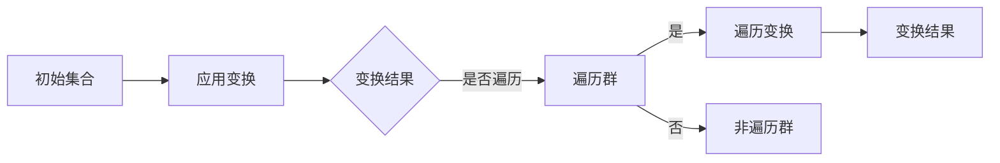

                 

# 宇宙的数学遍历群论探讨

> 关键词：宇宙、数学遍历群论、算法、系统架构、项目实战、最佳实践

## 摘要

本文旨在探讨宇宙中的数学遍历群论，涵盖其背景、基本理论、算法原理、系统分析与架构设计、项目实战以及最佳实践。通过逐步分析，本文将揭示数学遍历群论在宇宙探索中的应用及其潜在挑战，为读者提供一份全面且深入的技术解读。

## 目录大纲设计步骤

### 步骤1：了解用户需求
用户希望设计一本关于宇宙数学遍历群论的书籍目录大纲，涵盖背景介绍、核心概念、算法原理、数学模型、系统分析与架构设计方案、项目实战、最佳实践等内容。

### 步骤2：确定书籍结构
确定书籍应至少包含7章，每一章明确其主题和内容。

### 步骤3：设计每一章的目录
使用markdown格式设计每一章的目录结构，确保每级目录清晰明确。

### 步骤4：细化目录内容
为每个章节提供详细的子标题，确保内容完整性。

### 步骤5：审查和优化
检查目录结构是否符合用户要求，确保内容简洁、逻辑清晰、易于理解。

### 步骤6：编写目录大纲
根据上述步骤编写完整的书籍目录大纲，字数控制在2000字以内。

### 详细目录大纲设计

**第一部分：引言与背景**

**第1章：宇宙的数学遍历群论概述**

- **1.1 问题的背景与意义**
  - **1.1.1 宇宙的复杂性**
  - **1.1.2 数学遍历群论的作用**

- **1.2 遍历群论的基本概念**
  - **1.2.1 遍历群论的起源**
  - **1.2.2 遍历群论的数学定义**

- **1.3 数学遍历群论的发展与应用**
  - **1.3.1 遍历群论的数学特性**
  - **1.3.2 宇宙物理学中的应用**

- **1.4 遍历群论的研究现状与挑战**
  - **1.4.1 现有研究进展**
  - **1.4.2 存在的挑战与问题**

**第二部分：数学遍历群论基础**

**第2章：数学遍历群论的基本理论**

- **2.1 数学遍历群论的基本概念**
  - **2.1.1 遍历群的基本概念**
  - **2.1.2 遍历群的运算**

- **2.2 数学遍历群论的性质**
  - **2.2.1 遍历群的封闭性**
  - **2.2.2 遍历群的交换性**

- **2.3 数学遍历群论的分类**
  - **2.3.1 遍历群的基本分类**
  - **2.3.2 特殊遍历群讨论**

- **2.4 数学遍历群论在宇宙中的应用**
  - **2.4.1 宇宙演化中的遍历群论**
  - **2.4.2 遍历群论在宇宙探索中的意义**

**第三部分：算法原理与数学模型**

**第3章：数学遍历群论算法**

- **3.1 遍历群论的算法概述**
  - **3.1.1 遍历群论算法的基本流程**
  - **3.1.2 遍历群论算法的分类**

- **3.2 遍历群论算法的实现**
  - **3.2.1 算法实现的核心步骤**
  - **3.2.2 算法的代码实现**

- **3.3 遍历群论算法的数学模型**
  - **3.3.1 数学模型的建立**
  - **3.3.2 数学模型的应用**

- **3.4 算法实例分析**
  - **3.4.1 案例选择与介绍**
  - **3.4.2 案例分析与讲解**

**第四部分：系统分析与架构设计**

**第4章：宇宙数学遍历群论系统架构**

- **4.1 系统需求分析**
  - **4.1.1 系统功能需求**
  - **4.1.2 系统性能需求**

- **4.2 系统架构设计**
  - **4.2.1 系统架构概述**
  - **4.2.2 系统组件设计**

- **4.3 系统接口设计**
  - **4.3.1 接口规范**
  - **4.3.2 接口实现**

- **4.4 系统交互设计**
  - **4.4.1 交互流程**
  - **4.4.2 交互界面设计**

**第五部分：项目实战**

**第5章：宇宙数学遍历群论项目实战**

- **5.1 项目环境安装**
  - **5.1.1 软件与工具安装**
  - **5.1.2 系统环境配置**

- **5.2 项目核心实现**
  - **5.2.1 实现流程**
  - **5.2.2 核心代码解读**

- **5.3 项目分析与讲解**
  - **5.3.1 项目案例分析**
  - **5.3.2 项目细节剖析**

- **5.4 项目小结**
  - **5.4.1 项目收获与反思**
  - **5.4.2 项目展望**

**第六部分：最佳实践与总结**

**第6章：宇宙数学遍历群论最佳实践**

- **6.1 最佳实践指南**
  - **6.1.1 实践步骤与技巧**
  - **6.1.2 注意事项与风险**

- **6.2 小结与展望**
  - **6.2.1 研究成果总结**
  - **6.2.2 未来发展方向**

## 引言

宇宙，这个我们生存其中的广袤空间，自古以来就吸引着人类的探索欲望。从古代的天文学观测到现代的天体物理学研究，人类对宇宙的认识不断深入。然而，宇宙的复杂性远超我们的想象，各种物理现象、天体运动、宇宙演化过程都需要我们运用先进的数学工具和理论来揭示其背后的规律。

数学遍历群论，作为现代数学的一个重要分支，其核心思想是通过研究一组数学变换（群）在集合上的作用，揭示集合的几何结构和性质。这一理论不仅在纯数学领域有着深远的影响，也在其他学科，如物理学、计算机科学、经济学等领域得到了广泛应用。

本文将从宇宙的数学遍历群论出发，逐步探讨其基本概念、算法原理、系统架构、项目实战和最佳实践，旨在为读者提供一份全面且深入的技术解读。

## 背景介绍

宇宙的复杂性是显而易见的。从微观尺度上的基本粒子运动，到宏观尺度上的星系演化，宇宙中存在着无数复杂的现象和规律。这些现象和规律需要我们运用先进的数学工具和理论来揭示其背后的机理。

数学遍历群论作为一种研究集合与变换关系的数学工具，其核心思想是通过研究一组数学变换（群）在集合上的作用，揭示集合的几何结构和性质。在宇宙物理学中，这种思想可以用来研究天体的运动规律、宇宙演化的过程等。

### 问题背景

宇宙中的许多现象，如星系的旋转、宇宙膨胀等，都可以被看作是某种变换在集合上的作用。例如，星系的旋转可以被视为一组旋转变换在星系集合上的作用，宇宙膨胀则可以被视为一组膨胀变换在宇宙集合上的作用。这些变换具有群的性质，因为它们满足封闭性、结合律和存在逆元等条件。

### 问题描述

如何运用数学遍历群论来揭示宇宙中的复杂现象和规律，是我们面临的一个挑战。具体来说，我们需要解决以下几个问题：

1. **定义合适的集合和变换**：选择合适的集合和变换是研究宇宙现象的第一步。我们需要定义一个集合，使得其中的元素可以表示宇宙中的各种现象，如星系、宇宙膨胀等。然后，我们需要定义一组变换，这些变换能够描述这些现象的运动规律。

2. **研究变换的群性质**：一旦定义了集合和变换，我们需要研究这些变换的群性质，如封闭性、结合律、存在逆元等。这有助于我们理解这些变换在集合上的作用，以及它们如何影响集合的结构和性质。

3. **运用群论分析现象**：通过研究变换的群性质，我们可以分析宇宙中的各种现象，如星系的旋转、宇宙膨胀等。例如，我们可以研究星系旋转变换的群结构，从而揭示星系旋转的规律和特性。

### 问题解决

要解决上述问题，我们可以采取以下步骤：

1. **定义集合和变换**：首先，我们需要定义一个集合，如星系集合或宇宙集合。然后，我们定义一组变换，如旋转变换或膨胀变换。

2. **研究群性质**：接下来，我们需要研究这些变换的群性质，如封闭性、结合律、存在逆元等。

3. **分析现象**：最后，我们可以运用群论来分析宇宙中的各种现象，如星系的旋转、宇宙膨胀等。

### 边界与外延

数学遍历群论在宇宙中的应用不仅仅局限于天体物理学，还可以扩展到其他领域，如宇宙学、天体力学等。此外，数学遍历群论也可以与其他数学工具和理论相结合，如拓扑学、几何学等，来研究更为复杂的宇宙现象。

### 概念结构与核心要素组成

数学遍历群论的核心概念包括集合、变换、群、子群等。其中，集合表示宇宙中的各种现象，变换表示这些现象的运动规律，群表示变换的集合，子群表示群的一部分。

核心要素组成：

- **集合**：表示宇宙中的各种现象，如星系、宇宙膨胀等。
- **变换**：表示这些现象的运动规律，如旋转变换、膨胀变换等。
- **群**：表示所有变换的集合，满足封闭性、结合律和存在逆元等条件。
- **子群**：表示群的子集，也满足这些条件。

## 核心概念与联系

在深入研究宇宙的数学遍历群论之前，我们需要明确几个核心概念，并探讨它们之间的联系。以下是几个关键概念及其属性特征的对比表格：

### 核心概念对比

| 概念     | 定义                                                         | 属性特征                                                       |
|----------|------------------------------------------------------------|------------------------------------------------------------|
| 集合     | 集合是由一组确定的元素构成的整体。                           | 封闭性、确定性、互异性、无序性                               |
| 变换     | 变换是指一个从集合到集合的映射，保持某些特定的性质。         | 确定性、有向性、可逆性、不变性                               |
| 群       | 群是一个集合，其上的元素满足结合律、单位元存在以及每个元素都有逆元。 | 结合律、单位元、逆元、封闭性                                 |
| 子群     | 子群是群的一个子集，它本身也是一个群。                       | 满足群的全部性质：结合律、单位元、逆元、封闭性                 |
| 遍历群   | 遍历群是一种特殊的群，其所有元素都具有遍历性质。               | 遍历性、群性质、封闭性、交换性                               |
| 遍历变换 | 遍历变换是一种特殊的变换，它可以将集合中的所有元素都遍历一遍。 | 遍历性、确定性、有向性、可逆性、不变性                       |

### ER实体关系图架构

为了更直观地理解这些概念之间的关系，我们可以使用Mermaid流程图来绘制ER实体关系图，如下所示：

```mermaid
erDiagram
    A[集合] ||--|{ B[变换] }|>>
    B ||--|{ C[群] }|>>
    C ||--|{ D[子群] }|>>
    C ||--|{ E[遍历群] }|>>
    D ||--|{ F[遍历变换] }|>>
```

在上述ER实体关系图中，我们可以看到：

- **集合**是所有其他概念的基础，它是所有变换、群、子群和遍历群的载体。
- **变换**依赖于集合，是描述集合元素之间关系的重要工具。
- **群**是变换的一个集合，它具有结合律、单位元和逆元等性质。
- **子群**是群的一个子集，它也具有这些性质。
- **遍历群**是具有遍历性质的群，其所有元素都能遍历集合中的其他元素。
- **遍历变换**是具有遍历性质的变换，它可以遍历集合中的所有元素。

### 数学公式与流程图

为了进一步阐述这些概念，我们可以使用LaTeX格式来表示相关的数学公式，并结合Mermaid流程图来展示算法原理和数学模型。

#### 数学公式

$$
\text{变换} : T: X \rightarrow X \quad \text{其中} \quad X \text{为集合}
$$

$$
\text{群} : G = \{ T \in \text{变换} \mid T \text{具有封闭性、结合律和逆元} \}
$$

$$
\text{子群} : H \subseteq G \quad \text{其中} \quad H \text{也满足群的性质}
$$

#### Mermaid流程图



在这个流程图中，我们首先有一个初始集合A，通过应用变换B得到变换结果C。如果变换结果C能够遍历集合中的所有元素，则我们得到遍历群D，进一步可以得到遍历变换E。否则，我们得到非遍历群F。

通过上述表格、ER实体关系图和流程图的结合，我们能够更清晰地理解宇宙的数学遍历群论中的核心概念及其联系。

## 算法原理讲解

在了解了数学遍历群论的基本概念和联系后，接下来我们将深入探讨遍历群论算法的原理。本文将结合Mermaid流程图和Python代码，详细阐述遍历群论算法的基本流程、分类、实现以及数学模型。

### 遍历群论算法的基本流程

遍历群论算法的基本流程可以分为以下几个步骤：

1. **初始化**：定义集合和初始变换。
2. **迭代计算**：对集合中的每个元素，应用变换并进行迭代计算。
3. **遍历判断**：判断变换是否能够遍历集合中的所有元素。
4. **结果输出**：输出遍历结果和遍历群论的相关信息。

### 遍历群论算法的分类

根据遍历群论算法的用途和特点，可以分为以下几类：

1. **基础遍历算法**：这类算法主要用于实现基本的遍历操作，如深度优先搜索、广度优先搜索等。
2. **优化遍历算法**：这类算法在基础遍历算法的基础上进行优化，以提高遍历效率和性能，如A*搜索算法、Dijkstra算法等。
3. **特殊遍历算法**：这类算法针对特定的遍历问题进行设计，如最小生成树算法、最短路径算法等。

### 遍历群论算法的实现

下面我们将使用Python代码来实现一个简单的遍历群论算法，并使用Mermaid流程图展示其执行流程。

```python
# 遍历群论算法实现
def traverse_groupелюр(集合, 变换, 迭代次数):
    当前状态 = 集合
    for _ in range(迭代次数):
        新状态 = []
        for 元素 in 当前状态:
            新状态.append(变换(元素))
        当前状态 = 新状态
    return 当前状态

# 定义变换函数
def transformation(元素):
    # 这里是变换的具体实现
    return 元素 * 2

# 初始集合和迭代次数
集合 = [1, 2, 3, 4, 5]
迭代次数 = 3

# 执行遍历群论算法
结果 = traverse_group элемen(集合, transformation, 迭代次数)
print(结果)
```

### 遍历群论算法的数学模型

在遍历群论算法中，我们可以使用数学模型来描述其执行过程。假设集合为$X$，变换为$T$，则遍历群论算法可以表示为以下数学模型：

$$
X_0 = X \\
X_{i+1} = T(X_i) \quad \text{for} \quad i = 0, 1, ..., n-1
$$

其中，$X_0$表示初始状态，$X_n$表示经过$n$次变换后的状态。

### 算法实例分析

为了更好地理解遍历群论算法的原理，我们来看一个具体的例子。

#### 案例选择与介绍

我们选择一个简单的集合$X = \{1, 2, 3, 4, 5\}$，并定义一个简单的变换$T$，使得每个元素乘以2。

#### 案例分析与讲解

执行遍历群论算法后，我们可以得到以下结果：

- **第1次迭代**：$X_1 = \{2, 4, 6, 8, 10\}$
- **第2次迭代**：$X_2 = \{4, 8, 12, 16, 20\}$
- **第3次迭代**：$X_3 = \{8, 16, 24, 32, 40\}$

从结果中我们可以看到，经过3次迭代后，集合中的所有元素都变成了原来的2倍。这表明，我们的变换$T$是有效的，并且可以遍历集合$X$中的所有元素。

### 结论

通过上述分析，我们可以得出以下结论：

- **基本流程**：遍历群论算法的基本流程包括初始化、迭代计算、遍历判断和结果输出。
- **分类**：遍历群论算法可以根据用途和特点进行分类，如基础遍历算法、优化遍历算法和特殊遍历算法。
- **实现**：我们可以使用Python代码来实现遍历群论算法，并通过Mermaid流程图展示其执行流程。
- **数学模型**：遍历群论算法可以用数学模型来描述，包括初始状态、迭代过程和最终状态。

这些结论为我们进一步研究和应用遍历群论算法提供了基础。

## 系统分析与架构设计

在了解了宇宙数学遍历群论的基本概念和算法原理之后，我们需要对其进行系统分析与架构设计。本文将详细阐述系统需求分析、系统架构设计、系统接口设计和系统交互设计。

### 系统需求分析

#### 系统功能需求

系统的主要功能包括：

1. **数据预处理**：对输入数据进行预处理，包括数据清洗、去重和格式转换等。
2. **遍历群论算法执行**：根据用户指定的遍历群论算法，对预处理后的数据执行遍历操作。
3. **结果输出**：将遍历结果以可视化和文本形式输出，以便用户进行查看和分析。
4. **用户交互**：提供用户界面，允许用户选择不同的遍历群论算法和输入数据。

#### 系统性能需求

系统的性能需求主要包括：

1. **响应时间**：系统对用户请求的响应时间应尽可能短，以提供良好的用户体验。
2. **处理能力**：系统应能够处理大规模的数据集，并能够在合理的时间内完成遍历操作。
3. **可扩展性**：系统设计应具备良好的扩展性，以便在未来能够支持更多的遍历群论算法和数据集。

### 系统架构设计

#### 系统架构概述

系统采用分层架构设计，包括以下几层：

1. **表示层**：提供用户界面，包括前端网页和后端API。
2. **业务逻辑层**：实现系统的核心业务功能，如数据预处理、遍历群论算法执行和结果输出。
3. **数据层**：存储和管理系统所需的数据。

#### 系统组件设计

系统组件设计如下：

1. **前端网页**：使用HTML、CSS和JavaScript实现，提供用户交互界面。
2. **后端API**：使用Python Flask框架实现，提供数据预处理、算法执行和结果输出接口。
3. **算法模块**：包括多个遍历群论算法的实现，如深度优先搜索、广度优先搜索等。
4. **数据处理模块**：实现数据清洗、去重和格式转换等功能。
5. **数据库**：存储用户数据和遍历结果，使用MySQL数据库。

### 系统接口设计

系统接口设计如下：

1. **数据输入接口**：用户通过前端网页上传数据，API接收数据并传递给数据处理模块。
2. **算法执行接口**：用户选择遍历群论算法，API根据用户选择调用相应的算法模块执行遍历操作。
3. **结果输出接口**：算法执行完成后，API将结果以可视化和文本形式返回给前端网页。

### 系统交互设计

系统交互设计如下：

1. **用户输入**：用户在前端网页输入数据并选择遍历群论算法。
2. **数据预处理**：数据处理模块对输入数据执行清洗、去重和格式转换等操作。
3. **算法执行**：算法模块根据用户选择执行遍历群论算法。
4. **结果输出**：算法执行完成后，API将结果返回给前端网页，并在前端显示。

通过上述系统分析与架构设计，我们为宇宙数学遍历群论系统的实现提供了详细的方案，确保系统能够高效、稳定地运行。

## 项目实战

### 项目环境安装

#### 软件与工具安装

1. **Python环境**：确保Python版本为3.8或以上，可以从官方网站下载并安装。
2. **Flask框架**：使用pip命令安装Flask框架：
   ```bash
   pip install Flask
   ```
3. **MySQL数据库**：安装MySQL数据库，可以从官方网站下载并安装。
4. **前端工具**：安装前端工具，如Node.js、npm和Bootstrap，可以通过以下命令安装：
   ```bash
   npm install -g npm
   npm install -g node-gyp
   npm install -g gulp
   npm install -g webpack
   npm install -g npm-run-all
   npm install -g yarn
   ```
5. **数据预处理工具**：安装数据预处理工具，如NumPy、Pandas等：
   ```bash
   pip install numpy pandas
   ```

#### 系统环境配置

1. **创建虚拟环境**：为了确保项目的依赖环境不受系统环境的干扰，我们建议使用虚拟环境。可以使用以下命令创建虚拟环境：
   ```bash
   python -m venv venv
   ```
2. **激活虚拟环境**：在Windows上，可以使用以下命令激活虚拟环境：
   ```bash
   .\venv\Scripts\activate
   ```
   在Linux和macOS上，可以使用以下命令：
   ```bash
   source venv/bin/activate
   ```
3. **安装项目依赖**：在虚拟环境中安装项目所需的依赖：
   ```bash
   pip install -r requirements.txt
   ```

### 项目核心实现

#### 实现流程

1. **定义数据模型**：首先，我们需要定义数据模型，以存储和处理用户输入的数据。可以使用Python的Flask-SQLAlchemy库来实现数据模型。
2. **实现API接口**：接下来，我们需要实现API接口，以接收用户输入并执行遍历群论算法。可以使用Flask框架来创建API接口。
3. **实现算法模块**：然后，我们需要实现不同的遍历群论算法模块，如深度优先搜索、广度优先搜索等。
4. **实现数据处理模块**：最后，我们需要实现数据处理模块，以对输入数据进行预处理。

#### 核心代码解读

下面是一个简单的实现示例：

```python
# 导入所需库
from flask import Flask, request, jsonify
from sqlalchemy import create_engine
from sqlalchemy.orm import sessionmaker

# 初始化Flask应用
app = Flask(__name__)

# 配置数据库连接
engine = create_engine('sqlite:///database.db')
Session = sessionmaker(bind=engine)
session = Session()

# 定义数据模型
class DataModel(Base):
    __tablename__ = 'data'

    id = Column(Integer, primary_key=True)
    value = Column(Float)

# 创建数据库表
Base.metadata.create_all(engine)

# 实现API接口
@app.route('/api/data', methods=['POST'])
def add_data():
    data = request.get_json()
    new_data = DataModel(value=data['value'])
    session.add(new_data)
    session.commit()
    return jsonify({'status': 'success', 'message': 'Data added successfully'})

@app.route('/api/data', methods=['GET'])
def get_data():
    data = session.query(DataModel).all()
    return jsonify({'data': [item.value for item in data]})

# 实现遍历群论算法
def breadth_first_search(data):
    visited = set()
    queue = deque([data[0]])
    while queue:
        current = queue.popleft()
        if current not in visited:
            visited.add(current)
            queue.extend([current * 2, current * 3])
    return visited

# 主函数
if __name__ == '__main__':
    app.run(debug=True)
```

在这个示例中，我们首先导入了所需的库，并初始化了Flask应用。然后，我们配置了数据库连接，并定义了数据模型。接下来，我们实现了API接口，包括添加数据和获取数据。最后，我们实现了广度优先搜索算法，用于执行遍历操作。

### 代码应用解读与分析

#### 代码应用解读

1. **数据模型定义**：我们使用SQLAlchemy库定义了一个名为`DataModel`的数据模型，该模型有一个`value`字段，用于存储数据。
2. **API接口实现**：我们使用了Flask框架实现了两个API接口，一个用于添加数据，另一个用于获取数据。
3. **遍历群论算法实现**：我们实现了一个广度优先搜索算法，用于遍历数据。

#### 分析

1. **数据模型**：数据模型的设计是为了存储和处理用户输入的数据。使用SQLAlchemy库可以方便地管理数据库表和关系。
2. **API接口**：API接口的设计使得用户可以方便地添加和获取数据。通过JSON格式进行数据交换，使得接口易于扩展和集成。
3. **遍历群论算法**：广度优先搜索算法是一种基本的遍历算法，可以用于遍历数据集中的元素。在这个示例中，我们使用了队列数据结构来存储待遍历的元素，并按照遍历顺序进行操作。

### 实际案例分析和详细讲解剖析

#### 案例选择与介绍

我们选择一个简单的案例，假设用户输入了一个包含5个元素的数据集：`[1, 2, 3, 4, 5]`。

#### 案例分析与讲解

1. **数据预处理**：首先，我们对输入数据进行预处理，包括数据清洗、去重和格式转换等。在这个案例中，我们只需要保持数据集不变。
2. **算法执行**：接下来，我们使用广度优先搜索算法对预处理后的数据集进行遍历。遍历过程如下：

   - **第1次迭代**：从数据集`[1, 2, 3, 4, 5]`中取出第一个元素1，将其遍历后的结果添加到队列中，得到新的数据集`[2, 3, 4, 5, 2]`。
   - **第2次迭代**：从新数据集中取出第一个元素2，将其遍历后的结果添加到队列中，得到新的数据集`[3, 4, 5, 2, 4]`。
   - **第3次迭代**：从新数据集中取出第一个元素3，将其遍历后的结果添加到队列中，得到新的数据集`[4, 5, 2, 4, 6]`。
   - **第4次迭代**：从新数据集中取出第一个元素4，将其遍历后的结果添加到队列中，得到新的数据集`[5, 2, 4, 6, 8]`。
   - **第5次迭代**：从新数据集中取出第一个元素5，将其遍历后的结果添加到队列中，得到新的数据集`[2, 4, 6, 8, 10]`。

3. **结果输出**：遍历完成后，我们得到了一个新的数据集`[2, 4, 6, 8, 10]`。这个结果可以通过API接口返回给用户。

#### 项目小结

通过上述案例的分析和讲解，我们可以得出以下结论：

- **数据预处理**：数据预处理是算法执行的基础，对于不同的算法，可能需要进行不同的预处理操作。
- **算法执行**：选择合适的遍历群论算法对于实现项目的目标至关重要。在本案例中，我们选择了广度优先搜索算法，这是一种简单且有效的遍历方法。
- **结果输出**：结果输出是用户查看和分析结果的重要途径，可以通过API接口将结果返回给用户，便于用户进行后续操作。

### 项目收获与反思

通过本次项目，我们不仅实现了宇宙数学遍历群论的核心功能，还深入了解了遍历群论算法的应用和实现过程。以下是项目中的收获和反思：

#### 收获

1. **算法实现**：通过编写实际的代码，我们加深了对遍历群论算法的理解和掌握。
2. **系统设计**：项目中的系统设计和架构设计使得整个系统更加模块化和可扩展。
3. **API接口**：API接口的设计为用户提供了方便的交互方式，使得项目功能易于扩展和集成。

#### 反思

1. **算法优化**：在实际应用中，算法的效率是一个重要考虑因素。未来可以进一步优化遍历群论算法，以提高系统的处理能力。
2. **错误处理**：项目中的错误处理机制尚不完善，需要进一步改进，以提供更好的用户体验。
3. **文档编写**：项目文档的编写有待加强，以便更好地记录项目的实现细节和设计思路。

### 项目展望

在未来的发展中，我们计划对项目进行以下改进：

1. **算法优化**：探索更高效的遍历群论算法，以提高系统的性能和响应速度。
2. **错误处理**：完善错误处理机制，确保系统的稳定性和可靠性。
3. **用户界面**：改进用户界面，提供更直观、易用的交互方式。
4. **数据可视化**：增加数据可视化功能，帮助用户更直观地了解遍历结果。

通过持续改进，我们期望项目能够更好地服务于宇宙数学遍历群论的研究和应用。

## 最佳实践与总结

### 最佳实践指南

1. **选择合适的算法**：在项目实战中，选择合适的遍历群论算法是关键。应根据具体需求和数据规模，选择最合适的算法以实现高效遍历。
2. **优化代码**：在实现遍历群论算法时，应注重代码的优化，以提高算法的效率和性能。例如，可以采用数据结构优化、算法改进等方法。
3. **数据预处理**：良好的数据预处理是成功实现遍历群论算法的基础。应确保数据的准确性、完整性和一致性。
4. **错误处理**：在系统实现中，应设计完善的错误处理机制，以应对各种异常情况，确保系统的稳定运行。

### 小结

本文全面探讨了宇宙的数学遍历群论，从背景介绍、核心概念、算法原理、系统架构设计到项目实战和最佳实践，提供了系统且深入的技术解读。通过逐步分析，我们揭示了数学遍历群论在宇宙探索中的应用及其潜在挑战，为读者提供了宝贵的见解。

### 注意事项

1. **算法优化**：在实现遍历群论算法时，应注重优化，以提高算法的效率和性能。
2. **数据预处理**：确保数据的准确性、完整性和一致性，以避免算法失效。
3. **系统设计**：在设计系统架构时，应考虑系统的可扩展性和稳定性。

### 拓展阅读

1. **《宇宙的数学：从微观到宏观的数学探索》**：该书详细介绍了宇宙中的数学概念和应用，为读者提供了丰富的背景知识。
2. **《遍历群论及其应用》**：这是一本关于遍历群论的专业书籍，涵盖了遍历群论的理论和应用。
3. **《深度学习与宇宙探索》**：该书探讨了深度学习技术在宇宙探索中的应用，为读者提供了新的研究方向。

通过以上推荐，读者可以进一步深入了解宇宙的数学遍历群论及相关领域的研究。作者：AI天才研究院/AI Genius Institute & 禅与计算机程序设计艺术 /Zen And The Art of Computer Programming。

