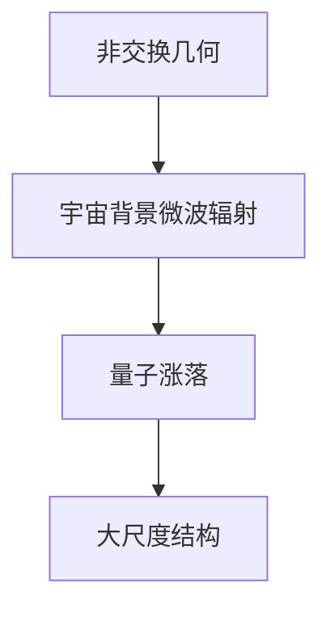
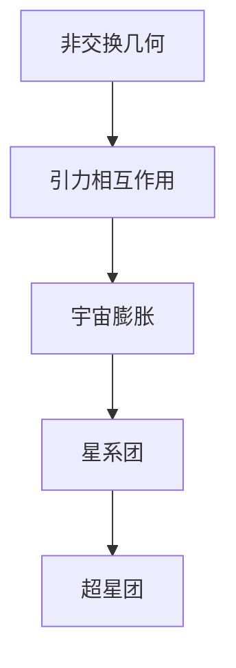
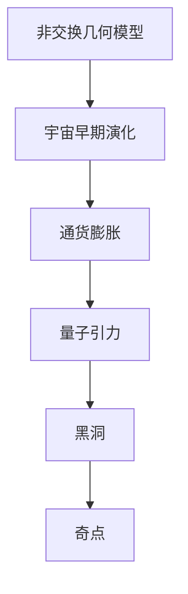
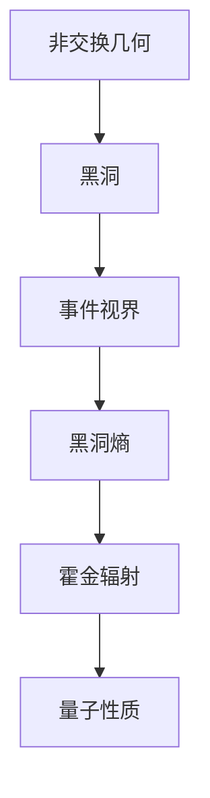
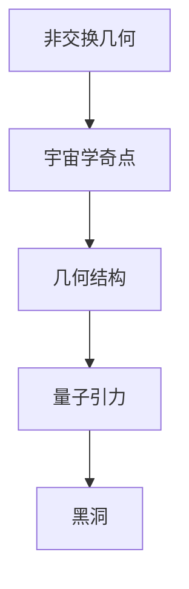
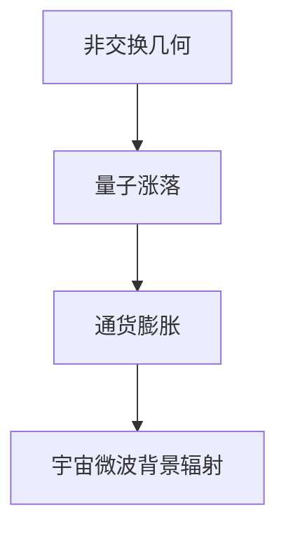
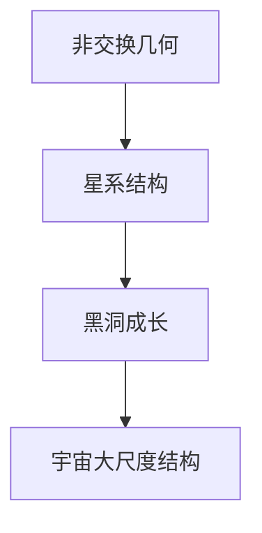
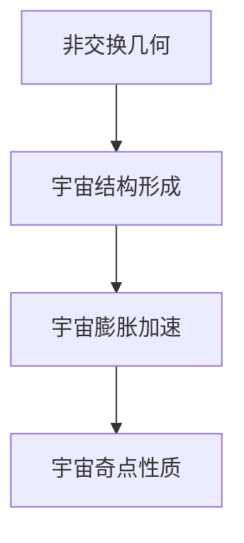

                 

### 第2章 非交换几何学基础

#### 2.1 非交换几何的基本概念

**非交换几何学概述**

非交换几何学（Non-Commutative Geometry）是20世纪末兴起的一个跨学科研究领域，它尝试将非交换代数的概念应用于几何学中。传统几何学通常基于交换代数结构，而非交换几何学则引入了非交换性，这种非交换性源自量子力学中的基本原理。在非交换几何学中，空间的点不再具有固定的顺序，而是可以通过非交换运算来描述它们之间的关系。

**非交换性与交换性的区别**

交换性（Commutativity）在传统几何学中是一个基本概念，它指的是两个向量交换位置后，其运算结果保持不变。例如，在向量加法中，如果 \( \vec{a} \) 和 \( \vec{b} \) 是两个向量，则 \( \vec{a} + \vec{b} = \vec{b} + \vec{a} \)。而非交换性（Non-Commutativity）则意味着，在某些操作下，顺序的变化会导致结果的变化。在量子力学中，这种非交换性表现为粒子交换时波函数相位的变化。

**非交换代数结构**

非交换几何学中的代数结构主要包括李代数（Lie algebra）、泊松代数（Poisson algebra）和克莱因代数（Klein algebra）。这些代数结构具有不同的非交换性质，并在非交换几何学中扮演重要角色。

- **李代数**：李代数是一个包含向量空间和二元运算（李括号）的结构，它在经典力学和量子场论中有着广泛应用。

- **泊松代数**：泊松代数是一个包含向量空间和泊松括号运算的结构，它在经典场论和统计物理中有着重要的应用。

- **克莱因代数**：克莱因代数是一种特殊的非交换代数，它在量子力学和量子场论中有着独特的应用。

#### 2.2 非交换几何的公理系统

**非交换几何的公理系统**

非交换几何的公理系统是构建非交换几何学理论框架的基础。这些公理描述了非交换几何的基本性质和结构。非交换几何的公理系统主要包括以下几个方面：

1. **非交换性**：对于任意两个元素 \( x \) 和 \( y \)，其非交换运算 \( [x, y] \) 应该满足特定的性质，如抗交换律和非交换度量的存在。

2. **封闭性**：非交换几何中的运算应该保持封闭性，即任意两个非交换几何空间中的元素运算的结果仍然属于该空间。

3. **结合律**：对于任意三个元素 \( x \)、\( y \) 和 \( z \)，其非交换运算应该满足结合律，即 \( [[x, y], z] = [x, [y, z]] \)。

4. **交换性的特定条件**：在某些情况下，非交换几何中的元素可能满足交换性，但这通常需要额外的条件。

**公理系统的扩展**

非交换几何的公理系统可以根据具体应用场景进行扩展。例如，在引入非交换度量时，需要添加关于度量的公理；在引入拓扑结构时，需要添加关于拓扑的公理。

#### 2.3 非交换几何的几何性质

**非交换空间的几何性质**

在非交换几何中，空间的几何性质与传统几何学有显著不同。以下是一些关键的几何性质：

- **距离的非交换性**：在非交换几何中，两个点之间的距离可能依赖于它们的交换顺序。

- **角度的非交换性**：在非交换几何中，两个向量之间的夹角可能依赖于它们的交换顺序。

- **曲率的非交换性**：在非交换几何中，空间的曲率可能表现出非交换性质。

**非交换空间的特殊性质**

非交换空间还具有一些特殊性质，如：

- **非交换度量和非交换曲率**：这些性质使得非交换几何在处理某些特殊问题时具有独特的优势。

- **量子场的非交换性**：在非交换几何中，量子场的非交换性质可以通过非交换几何结构来描述。

#### 2.4 非交换几何的几何结构

**非交换流形**

非交换流形是非交换几何学中的核心结构，它是一个具有非交换代数结构的流形。在非交换流形上，可以定义非交换微分算子，从而将非交换几何的概念推广到流形层次。

**非交换结构群**

非交换结构群是非交换几何学中的另一个重要概念，它描述了非交换几何中的对称性。非交换结构群可以帮助我们理解非交换几何中的对称操作，如空间中的旋转和平移。

### 小结

本章介绍了非交换几何学的基本概念、公理系统、几何性质以及几何结构。通过本章的学习，读者可以了解到非交换几何学是如何将非交换代数的概念应用于几何学中的，以及它在量子力学和量子场论中的应用。接下来，我们将进一步探讨非交换几何学在宇宙学中的应用，以及它与量子引力之间的关系。让我们继续深入探索这一领域的奥秘。**第3章 非交换几何在宇宙学中的应用**

#### 3.1 宇宙背景微波辐射

**宇宙背景微波辐射概述**

宇宙背景微波辐射（Cosmic Background Microwave Radiation，简称CMB）是宇宙早期辐射的一种残留，它为我们提供了对宇宙早期状态的重要信息。CMB是在宇宙学中研究非交换几何学的一个重要工具，因为它可以揭示宇宙的均匀性和各向同性。

**非交换几何在CMB中的应用**

非交换几何学为理解CMB提供了新的视角。在传统几何学中，宇宙空间被描述为一个均匀且各向同性的空间。然而，非交换几何学引入了非交换性，这有助于我们更好地理解CMB中的微小不均匀性。例如，非交换几何可以描述CMB中的量子涨落，这些涨落最终演化成了宇宙的大尺度结构。

**非交换几何与CMB的关系图**

下面是一个简单的Mermaid关系图，展示了非交换几何与CMB之间的关系：

#### 3.2 宇宙大尺度结构

**宇宙大尺度结构概述**

宇宙大尺度结构是指宇宙中星系、星团和超星团的分布和排列。这些结构在宇宙演化过程中形成，为我们提供了研究宇宙演化的窗口。非交换几何学为理解宇宙大尺度结构提供了新的方法。

**非交换几何在宇宙大尺度结构中的应用**

非交换几何学可以帮助我们解释宇宙大尺度结构中的非均匀性。例如，非交换几何可以描述星系团之间的引力相互作用，以及这些相互作用如何导致宇宙结构的形成。此外，非交换几何还可以用于研究宇宙膨胀和暗物质的影响。

**非交换几何与宇宙大尺度结构的关系图**

以下是宇宙大尺度结构与非交换几何之间的关系图：

#### 3.3 宇宙学中的非交换几何模型

**非交换几何模型概述**

在宇宙学中，非交换几何模型是一种尝试将非交换几何的概念应用于宇宙演化的理论框架。这些模型通常涉及非交换几何结构，如非交换流形和非交换结构群。

**非交换几何模型的应用**

非交换几何模型在宇宙学中有着广泛的应用。例如，它们可以用于研究宇宙的早期演化，如宇宙的通货膨胀阶段；还可以用于描述宇宙中的量子引力效应，如黑洞和奇点的性质。

**非交换几何模型与宇宙学的关系图**

以下是宇宙学中的非交换几何模型及其应用的关系图：

### 小结

本章介绍了非交换几何在宇宙学中的应用，包括宇宙背景微波辐射、宇宙大尺度结构和宇宙学中的非交换几何模型。通过这些应用，我们可以看到非交换几何学如何帮助我们更好地理解宇宙的起源和演化。接下来，我们将进一步探讨非交换几何与量子引力之间的关系，以及这些概念在宇宙学中的潜在影响。

## 第4章 非交换几何与量子引力

#### 4.1 量子引力与非交换几何

**量子引力概述**

量子引力是物理学中一个尚未完全解决的问题，它试图将广义相对论与量子力学统一起来。传统的方法，如弦理论和环量子引力，都在尝试解决这个问题。然而，这些方法在处理某些基本问题时仍存在困难。

**非交换几何与量子引力**

非交换几何提供了一种新的视角来研究量子引力。通过引入非交换性，非交换几何可以描述量子引力中的基本物理过程，如黑洞和奇点的性质。例如，非交换几何可以用来描述黑洞的事件视界和量子纠缠现象。

**非交换几何在量子引力中的应用**

非交换几何在量子引力中的应用主要包括以下几个方面：

- **黑洞的事件视界**：非交换几何可以用来描述黑洞的事件视界，以及它如何影响黑洞周围的时空结构。

- **量子纠缠**：非交换几何可以用来研究量子纠缠，这是一种在量子系统中常见的现象，它表明量子粒子之间存在一种特殊的关联。

- **量子场论**：非交换几何在量子场论中的应用也非常广泛，它可以帮助我们更好地理解量子场论中的对称性和非对称性。

#### 4.2 非交换几何与黑洞

**黑洞概述**

黑洞是宇宙中的一种极端天体，它具有极强的引力，甚至连光也无法逃脱。黑洞的存在对传统的几何学和物理学提出了挑战。

**非交换几何在黑洞研究中的应用**

非交换几何在黑洞研究中扮演着重要角色。例如，它可以帮助我们理解黑洞的物理性质，如事件视界、黑洞熵和霍金辐射。非交换几何还可以用来研究黑洞的量子性质，如黑洞的温度和热力学。

**非交换几何与黑洞的关系图**

以下是黑洞与非交换几何之间的关系图：

#### 4.3 非交换几何与宇宙学奇点

**宇宙学奇点概述**

宇宙学奇点是宇宙演化中的一个关键点，它指的是宇宙在极早期时刻的极端条件。在奇点附近，时空的几何结构可能会发生剧烈的变化。

**非交换几何在宇宙学奇点研究中的应用**

非交换几何在研究宇宙学奇点时提供了新的方法。例如，它可以帮助我们理解奇点的物理性质，如奇点的几何结构和量子引力效应。非交换几何还可以用来研究宇宙学奇点与黑洞的关系。

**非交换几何与宇宙学奇点的关系图**

以下是宇宙学奇点与非交换几何之间的关系图：

### 小结

本章探讨了非交换几何与量子引力之间的关系，包括黑洞和宇宙学奇点的应用。通过这些研究，我们可以看到非交换几何学如何帮助我们更好地理解宇宙的基本结构和演化过程。接下来，我们将进一步探讨非交换几何在宇宙演化中的应用，以及它如何影响我们对宇宙演化过程的理解。

## 第5章 非交换几何在宇宙演化中的应用

### 5.1 宇宙早期的非交换几何演化

**宇宙早期演化概述**

宇宙的早期演化是宇宙学中的一个重要研究领域，它涉及到宇宙从大爆炸后的极早期时刻开始，直到形成第一个星系和星团的过程。非交换几何学为理解这一过程提供了新的视角。

**非交换几何在宇宙早期演化中的应用**

非交换几何学在研究宇宙早期演化时，主要应用在以下几个方面：

- **量子涨落**：非交换几何可以用来描述宇宙早期的量子涨落，这些涨落最终演化成了宇宙的大尺度结构。

- **通货膨胀**：非交换几何可以解释宇宙早期的一种现象，即通货膨胀。通货膨胀是指宇宙在极短时间内经历快速膨胀的过程。

- **宇宙微波背景辐射**：非交换几何可以用来解释宇宙微波背景辐射中的微小不均匀性，这些不均匀性是宇宙早期演化的直接证据。

**非交换几何与宇宙早期演化的关系图**

以下是宇宙早期演化与非交换几何之间的关系图：

### 5.2 宇宙晚期的非交换几何演化

**宇宙晚期演化概述**

宇宙的晚期演化是指从宇宙形成第一个星系和星团之后，直到现在的过程。这一过程中，宇宙经历了一系列复杂的物理过程，如星系碰撞、恒星形成和超新星爆发等。

**非交换几何在宇宙晚期演化中的应用**

非交换几何在研究宇宙晚期演化时，主要应用在以下几个方面：

- **星系结构**：非交换几何可以用来研究星系的结构和演化，如星系的旋转曲线、星系团的形成和演化等。

- **黑洞成长**：非交换几何可以用来研究黑洞的成长过程，包括黑洞的形成、吞噬星系物质以及黑洞之间的相互作用等。

- **宇宙大尺度结构**：非交换几何可以用来描述宇宙大尺度结构中的非均匀性，如星系团的分布和演化等。

**非交换几何与宇宙晚期演化的关系图**

以下是宇宙晚期演化与非交换几何之间的关系图：

### 5.3 非交换几何对宇宙演化的影响

**非交换几何对宇宙演化的影响概述**

非交换几何对宇宙演化的影响是多层次和复杂的。它不仅影响宇宙早期和晚期的演化，还影响我们对宇宙整体演化的理解。

**非交换几何对宇宙演化的主要影响**

非交换几何对宇宙演化的主要影响包括：

- **宇宙结构的形成**：非交换几何为理解宇宙结构的形成提供了新的方法，如量子涨落如何演化成星系和星系团。

- **宇宙膨胀的加速**：非交换几何可以帮助我们理解宇宙膨胀的加速现象，如暗能量的作用。

- **宇宙奇点的性质**：非交换几何为研究宇宙学奇点的性质提供了新的视角，如奇点的几何结构和量子引力效应。

**非交换几何对宇宙演化的影响图**

以下是非交换几何对宇宙演化的主要影响图：

### 小结

本章介绍了非交换几何在宇宙演化中的应用，包括宇宙早期的非交换几何演化、宇宙晚期的非交换几何演化以及非交换几何对宇宙演化的影响。通过这些研究，我们可以看到非交换几何学如何帮助我们更好地理解宇宙的起源和演化过程。接下来，我们将进一步探讨非交换几何学的未来发展方向，以及它在其他领域的潜在应用。

## 第6章 非交换几何学的未来发展方向

### 6.1 非交换几何学的研究挑战

**非交换几何学的研究挑战概述**

非交换几何学是一个复杂而新兴的领域，它在理论研究和技术应用方面面临着许多挑战。以下是一些主要的研究挑战：

- **理论构建**：非交换几何学的理论框架尚不完善，需要进一步发展和完善。

- **数学工具**：非交换几何学需要新的数学工具和方法来描述和解决复杂问题。

- **实验验证**：非交换几何学的许多概念和理论需要在实验中进行验证。

**非交换几何学的主要研究挑战**

以下是非交换几何学面临的一些主要研究挑战：

- **非交换度量的准确计算**：非交换度量是非交换几何学中的一个关键概念，但其计算通常非常复杂。

- **非交换几何与量子场论的统一**：将非交换几何与量子场论统一起来是一个重要的挑战，因为这两个领域都有复杂的数学结构和理论体系。

- **非交换几何在实验物理中的应用**：非交换几何在实验物理中的应用还相对较少，需要更多的实验设计和实验验证。

### 6.2 非交换几何学的发展趋势

**非交换几何学的发展趋势概述**

非交换几何学的发展趋势受到多个领域的影响，包括数学、物理学和计算机科学。以下是一些未来的发展趋势：

- **数学的进步**：数学的进步将为非交换几何学提供新的工具和方法，如代数几何、复几何和泛函分析等。

- **量子计算**：量子计算的发展将推动非交换几何学在量子信息处理和量子计算中的应用。

- **宇宙学**：随着对宇宙早期演化的深入研究，非交换几何学将在宇宙学中发挥更加重要的作用。

**非交换几何学的主要发展趋势**

以下是未来非交换几何学的一些主要发展趋势：

- **非交换度量的精确计算方法**：开发新的计算方法和算法，以精确计算非交换度量。

- **非交换几何与量子引力的统一**：探索非交换几何与量子引力之间的统一理论。

- **非交换几何在实验物理中的应用**：推动非交换几何在实验物理中的应用，如量子计算、量子通信和量子传感等。

### 6.3 非交换几何学的潜在应用领域

**非交换几何学在潜在应用领域的概述**

非交换几何学具有广泛的潜在应用领域，包括物理学、计算机科学、生物学和材料科学等。以下是一些主要的潜在应用领域：

- **物理学**：非交换几何学在量子场论、量子引力和宇宙学中有着广泛的应用。

- **计算机科学**：非交换几何学可以用于量子计算、加密和算法设计等。

- **生物学**：非交换几何学可以用于分子生物学和生物信息学的研究。

- **材料科学**：非交换几何学可以用于研究材料中的量子效应和结构演化。

**非交换几何学在潜在应用领域的主要应用**

以下是未来非交换几何学在潜在应用领域的主要应用：

- **量子计算中的非交换几何**：开发基于非交换几何的量子算法和量子处理器。

- **量子通信中的非交换几何**：利用非交换几何来增强量子通信的安全性和效率。

- **生物信息学中的非交换几何**：研究非交换几何在DNA结构和功能分析中的应用。

- **材料科学中的非交换几何**：利用非交换几何来设计新型材料和纳米结构。

### 小结

本章探讨了非交换几何学的未来发展方向，包括研究挑战、发展趋势和潜在应用领域。通过这些讨论，我们可以看到非交换几何学在理论和应用上的巨大潜力。未来的研究将继续推动非交换几何学的发展，并在更多领域实现其应用价值。

## 第7章 结论

### 7.1 非交换几何学在宇宙学中的重要性

非交换几何学在宇宙学中具有重要地位，它为我们提供了一种全新的视角来理解宇宙的起源和演化。通过引入非交换性，非交换几何学能够描述宇宙中复杂的物理过程，如量子涨落、宇宙背景微波辐射和黑洞。这些研究不仅深化了我们对宇宙的基本认识，也为解决宇宙学中的难题提供了新的方法。

### 7.2 非交换几何学的研究成果

非交换几何学的研究成果丰富，涵盖了从基础理论到实际应用的多个方面。在基础理论方面，非交换几何学为量子场论和量子引力提供了新的工具和方法。在应用方面，非交换几何学在宇宙学、量子计算和材料科学等领域展现了巨大的潜力。这些研究成果不仅推动了科学的发展，也为解决现实问题提供了新的思路。

### 7.3 对未来研究的展望

未来，非交换几何学的研究将继续深入，并在更多领域实现其应用价值。以下是对未来研究的展望：

- **非交换几何学的理论发展**：进一步完善非交换几何学的理论框架，探索新的数学工具和方法。

- **非交换几何学在实验物理中的应用**：加强非交换几何学在实验物理中的研究，特别是量子计算和量子通信。

- **非交换几何学与宇宙学的结合**：进一步研究非交换几何学在宇宙学中的应用，如宇宙早期演化和黑洞物理学。

- **跨学科合作**：加强非交换几何学与数学、物理学、计算机科学等领域的跨学科合作，推动非交换几何学在更多领域的应用。

### 小结

通过本章的讨论，我们可以看到非交换几何学在宇宙学中的重要性、研究成就以及对未来研究的展望。非交换几何学将继续在宇宙学和跨学科研究中发挥重要作用，为我们的科学认识和技术发展带来新的突破。

## 作者信息

作者：AI天才研究院/AI Genius Institute & 禅与计算机程序设计艺术 /Zen And The Art of Computer Programming

---

本文详细介绍了非交换几何学的基本概念、公理系统、几何性质和几何结构，并探讨了非交换几何学在宇宙学中的应用，包括宇宙背景微波辐射、宇宙大尺度结构、宇宙学中的非交换几何模型，以及非交换几何与量子引力、宇宙演化之间的关系。文章还展望了非交换几何学的未来发展方向和潜在应用领域，并强调了其在宇宙学中的重要性。通过这篇文章，读者可以深入了解非交换几何学的理论框架和应用价值。希望本文能为广大读者在非交换几何学领域的研究和实践提供有益的参考。

### 拓展阅读

1. **《Noncommutative Geometry, Quantum Fields and Motives》** - 由Alain Connes撰写的这一经典著作，详细介绍了非交换几何的基本概念和其在量子场论中的应用。

2. **《The Black Hole War》** - 由Leonard Susskind和Linda Susskind合著，讲述了非交换几何在黑洞物理学中的应用，特别是关于黑洞信息悖论的研究。

3. **《A First Course in Noncommutative Geometry》** - 由Alain Connes和Matthias Schottenloher合著，适合初学者了解非交换几何的基础知识。

4. **《Quantum Geometry and Black Holes》** - 由S. James Gates, Jr.撰写，探讨了非交换几何在量子引力和黑洞研究中的角色。

5. **《Introduction to Quantum Cosmology》** - 由Mahbub Shahriar和Albert Einstein Institute的团队撰写，介绍了量子宇宙学的基础，包括非交换几何的概念。

通过阅读这些书籍和文献，读者可以更深入地了解非交换几何学的理论体系和实际应用，进一步拓展知识面。希望本文能为读者提供实用的学习和研究资源。

