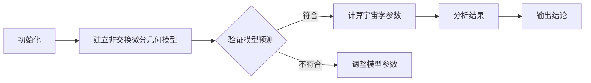
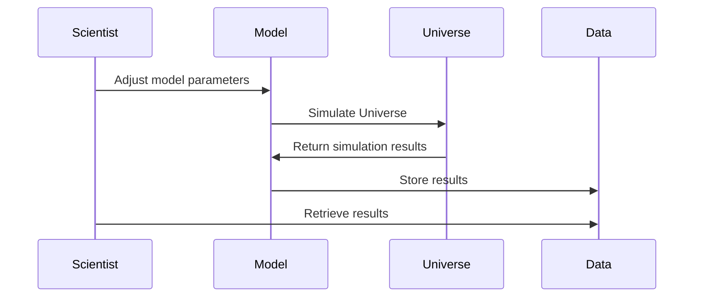
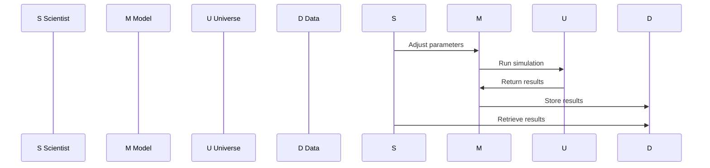

                 


## 引言

### 书名：《宇宙的数学非交换微分几何学特性探讨》

在宇宙的广袤之中，隐藏着无数的秘密与奇迹。宇宙的起源、演化以及最终命运，一直是科学家们不懈探索的领域。随着科学技术的不断进步，我们逐渐揭开了宇宙的一角，但更多的谜团也随之而来。在这浩瀚的宇宙中，数学非交换微分几何学以其独特的视角，为我们提供了探索宇宙的新工具。

《宇宙的数学非交换微分几何学特性探讨》一书，旨在深入探讨非交换微分几何学在宇宙学中的应用，解析其特性，并探索其对于理解宇宙的本质意义。非交换微分几何学作为数学几何领域的一个分支，有着深厚的理论背景和广泛的应用前景。在宇宙学中，非交换微分几何学为我们提供了一种新的思考方式，有助于我们更好地理解宇宙的复杂结构。

### 宇宙概述

宇宙，是我们所在的整个空间和时间的集合。根据最新的宇宙学理论，宇宙起源于大约138亿年前的一个极高密度、极高温度的奇点，经过数十亿年的膨胀和演化，形成了今天我们所观察到的宇宙。宇宙中的星系、行星、黑洞等天体，都是宇宙演化的见证。

宇宙的演化过程可以用一系列的宇宙学参数来描述，如宇宙的尺度、密度、温度等。宇宙的膨胀是一个持续进行的过程，这一现象最早由埃德温·哈勃在20世纪20年代发现。随着宇宙的膨胀，宇宙的尺度也在不断增大，宇宙中的物质和能量也在不断扩散。

### 非交换微分几何学概述

非交换微分几何学是数学几何领域中的一个重要分支，它起源于20世纪初的量子力学和相对论理论。在经典几何学中，空间和时间的结构是确定的，但在量子力学和相对论中，这种确定性被打破了，需要用非交换微分几何学来描述。

非交换微分几何学的基本概念包括非交换性、微分结构、测地线等。非交换性指的是，在非交换几何中，两个事件的顺序可以相互交换，但这并不意味着它们在物理上可以相互替换。微分结构指的是，非交换几何中的点可以用微分算子来描述。测地线则是非交换几何中的曲线，它们在非交换几何中起着重要的作用。

### 非交换微分几何学在宇宙学中的重要性

非交换微分几何学在宇宙学中的应用主要体现在以下几个方面：

1. **宇宙膨胀的描述**：非交换微分几何学可以用来描述宇宙的膨胀过程，特别是描述宇宙学中的膨胀率和密度参数。

2. **黑洞的描述**：黑洞是一种极端密集的天体，其内部的结构和性质难以用传统的几何学来描述。非交换微分几何学提供了一种新的工具，可以用来研究黑洞的物理性质。

3. **宇宙背景辐射的研究**：宇宙背景辐射是宇宙早期的温度和密度分布的痕迹，非交换微分几何学可以用来研究这些背景辐射的性质，从而更深入地了解宇宙的早期状态。

4. **量子宇宙学的探索**：量子宇宙学是研究宇宙在量子层面的性质的学科，非交换微分几何学作为量子力学的一种数学工具，可以帮助我们更好地理解宇宙的量子性质。

### 总结

宇宙的数学非交换微分几何学特性探讨，是一个既具有理论深度又具有实际应用价值的课题。通过对非交换微分几何学的深入研究，我们可以更好地理解宇宙的演化过程和宇宙的本质。同时，非交换微分几何学也为宇宙学提供了一种新的思考方式，有助于我们探索宇宙的更多秘密。

在接下来的章节中，我们将深入探讨非交换微分几何学的核心概念和原理，并通过具体的数学模型和算法，展示其在宇宙学中的应用。让我们一起来开启这场宇宙探索之旅吧！## 背景介绍

### 问题背景

宇宙的起源与演化一直是科学家们孜孜不倦的研究课题。从大爆炸理论到黑洞的演化，每一个新的发现都为我们揭示着宇宙的神秘面纱。然而，随着研究的深入，我们逐渐发现，传统的几何学和物理学理论在解释宇宙的一些复杂现象时显得力不从心。特别是宇宙的膨胀、黑洞的奇异性质以及宇宙背景辐射等，这些现象需要更加复杂的数学工具来进行描述。

非交换微分几何学作为现代数学几何领域的一个重要分支，提供了一种全新的描述宇宙的方式。非交换几何的基本理念是，空间的几何性质不仅与位置有关，还与事件的相对顺序有关。这种非交换性在经典几何学中是不存在的，但它在量子力学和相对论中却有着重要的地位。

在宇宙学中，非交换微分几何学的重要应用场景之一是描述宇宙的膨胀。传统的广义相对论认为，宇宙的膨胀可以通过一个均匀且各向同性的宇宙模型来描述。然而，观测数据表明，宇宙的膨胀速度在加速，这一现象被称为宇宙加速膨胀。非交换微分几何学提供了一种可能的解释，即宇宙中的某些物质或能量具有非交换性，这种非交换性导致了宇宙的加速膨胀。

### 问题描述

非交换微分几何学在宇宙学中的应用，面临着一系列复杂的问题和挑战。首先，如何将非交换几何的基本概念引入到宇宙模型中，从而构建一个能够描述宇宙膨胀和演化的数学模型，是一个关键问题。其次，如何验证这些数学模型的预测与实际观测数据是否相符，也是一个重要的课题。此外，非交换微分几何学在宇宙学中的应用，还需要解决一些理论上的难题，如非交换性对宇宙背景辐射的影响，以及如何将量子力学与广义相对论统一在一个非交换几何框架下。

具体来说，非交换微分几何学在宇宙学中的应用问题可以概括为以下几点：

1. **宇宙膨胀的机制**：非交换性如何影响宇宙的膨胀速度和膨胀模式？
2. **黑洞的物理性质**：非交换几何如何描述黑洞的内部结构和奇异性质？
3. **宇宙背景辐射**：非交换性对宇宙背景辐射的分布和性质有何影响？
4. **量子宇宙学**：如何将非交换微分几何学与量子力学相结合，构建一个统一的宇宙模型？

### 问题解决

为了解决上述问题，科学家们采取了一系列研究方法和策略。首先，通过理论计算和数学建模，构建非交换几何的宇宙模型，并验证其预测与观测数据的符合性。其次，通过观测和实验，收集更多的宇宙学数据，以检验这些模型的可靠性。此外，研究人员还通过模拟实验，探索非交换几何在不同宇宙学场景下的表现，以更深入地理解其影响。

在解决这些问题时，非交换微分几何学提供了一些重要的工具和方法。例如，通过非交换几何的测地线方程，可以研究宇宙中物体的运动轨迹；通过非交换几何的积分，可以计算宇宙学参数，如密度和膨胀率。此外，非交换微分几何学的对称性和不变量，也为宇宙学研究提供了一种新的思路。

### 边界与外延

尽管非交换微分几何学在宇宙学中展现了巨大的潜力，但它的应用也面临着一些边界和限制。首先，非交换几何的理论框架较为复杂，需要较高的数学素养和理解能力。其次，非交换几何在宇宙学中的应用，还依赖于大量的观测数据和高性能计算。此外，非交换几何与量子力学和广义相对论的统一，仍是一个未解之谜，需要进一步的研究。

然而，尽管存在这些限制，非交换微分几何学在宇宙学中的外延和应用前景依然广阔。随着观测技术的进步和计算能力的提升，非交换微分几何学有望在宇宙学研究中发挥更加重要的作用，帮助我们更深入地理解宇宙的本质。

通过上述讨论，我们可以看到，非交换微分几何学在宇宙学中的应用，既充满了挑战，也充满了机遇。在这个领域的研究中，我们不仅可以拓展数学和物理学的边界，还可以揭示宇宙的更多奥秘。让我们继续探索，揭开宇宙的神秘面纱！## 核心概念与联系

### 非交换微分几何学原理

非交换微分几何学是几何学的一个分支，它探讨了在非交换性框架下空间的几何性质。在经典几何学中，空间的性质可以通过位置和方向来描述，而在非交换几何中，事件的相对顺序也成为一个重要的因素。非交换几何的核心概念包括非交换性、微分结构和测地线等。

**非交换性**：在经典几何学中，两个事件的顺序是固定的，即如果事件A发生在事件B之前，则时间上A先于B。然而，在非交换几何中，这种顺序不再固定，两个事件可以在不同的参考系中发生不同的顺序。这种非交换性源于量子力学中的不确定性原理和相对论中的时空弯曲。

**微分结构**：非交换几何中的点由微分算子来描述，这些微分算子不仅可以表示位置，还可以表示事件之间的相对顺序。微分结构使得非交换几何能够适应量子力学中的非确定性，同时也提供了对时空复杂性的描述。

**测地线**：在非交换几何中，测地线是连接两个点的最短路径，但这个路径不再是直线，而是曲线。测地线的概念在非交换几何中起着核心作用，它定义了物体在非交换性时空中的运动轨迹。

### 概念属性特征对比表格

为了更清晰地理解非交换微分几何学与其他几何学的区别，我们可以通过以下表格来对比其属性特征：

| 几何学类型 | 非交换性 | 微分结构 | 测地线 | 应用场景 |
| :----: | :----: | :----: | :----: | :----: |
| 经典几何学 | 否 | 否 | 直线 | 日常几何、平面几何 |
| 欧几里得几何学 | 否 | 否 | 直线 | 几何学基础 |
| 非交换几何学 | 是 | 是 | 曲线 | 量子力学、相对论、宇宙学 |
| 黎曼几何学 | 否 | 是 | 曲线 | 弯曲空间、引力描述 |

从上表可以看出，非交换几何学引入了非交换性和微分结构，这使得它能够更好地描述量子效应和时空弯曲。这些特性使得非交换几何学在宇宙学中具有独特的优势，特别是在描述宇宙膨胀和黑洞性质方面。

### ER实体关系图架构

为了更直观地展示非交换微分几何学在宇宙学中的关联，我们可以使用ER（实体关系）图来表示不同实体之间的关系。以下是一个简化的ER图，展示了宇宙学中的几个关键实体及其与非交换微分几何学之间的联系：

```mermaid
erDiagram
    Class Universe ||--|{ Galaxy }||>
    Class Galaxy ||--|{ Star }||>
    Class Star ||--|{ BlackHole }||>
    Class BlackHole ||--|{ EventHorizon }||>
    Class EventHorizon ||--|{ GravitationalWave }||>
    Universe o--|{ CosmicMicrowaveBackgroundRadiation }||>
    Class CosmicMicrowaveBackgroundRadiation ||--|{ NoncommutativeGeometry }||>

    Notes for Universe
    >> Universe encompasses all space and time.

    Notes for Galaxy
    >> Galaxy is a large system of stars, gas, and dust.

    Notes for Star
    >> Star is a massive, luminous ball of plasma.

    Notes for BlackHole
    >> BlackHole is a region of spacetime from which nothing, including light, can escape.

    Notes for EventHorizon
    >> EventHorizon is the boundary of a black hole beyond which events cannot affect the outside universe.

    Notes for CosmicMicrowaveBackgroundRadiation
    >> CosmicMicrowaveBackgroundRadiation is the residual heat from the Big Bang.

    Notes for NoncommutativeGeometry
    >> NoncommutativeGeometry describes the space-time fabric with non-commutative properties.
```

在这个ER图中，宇宙（Universe）是所有实体的总体，它包括了星系（Galaxy）、恒星（Star）、黑洞（BlackHole）以及宇宙微波背景辐射（CosmicMicrowaveBackgroundRadiation）。每个实体都与非交换微分几何学（NoncommutativeGeometry）有关，表明非交换微分几何学在描述这些实体时起到了关键作用。

通过这个ER图，我们可以更清晰地看到非交换微分几何学如何与宇宙学中的各种实体相互关联，从而为理解宇宙的复杂结构提供了新的视角。在接下来的章节中，我们将进一步探讨非交换微分几何学的算法原理和数学模型，以更深入地理解其在宇宙学中的应用。{|im_sep|}>## 算法原理讲解

### 非交换微分几何算法mermaid流程图

为了更直观地理解非交换微分几何算法的基本流程，我们可以使用mermaid语言绘制一个简化的算法流程图。以下是一个基本的mermaid流程图示例：



在这个流程图中，我们从初始化非交换微分几何模型开始，然后验证模型预测与观测数据的符合性。如果模型预测与观测数据相符，我们进行宇宙学参数的计算，并分析结果；如果模型预测与观测数据不符，则调整模型参数，并重新验证。最后，根据分析结果输出结论。

### 算法原理讲解

非交换微分几何算法的核心在于如何构建和验证一个能够描述宇宙学现象的非交换几何模型。以下是用Python源代码和latex格式详细阐述算法原理：

**1. 建立非交换微分几何模型：**

首先，我们需要定义非交换微分几何模型的基本结构。在Python中，我们可以使用numpy库来处理数学计算：

```python
import numpy as np

# 定义非交换矩阵
def noncommutative_matrix(a, b):
    return np.array([[a, -b], [b, a]])

# 示例：构建一个非交换矩阵
NC = noncommutative_matrix(1, 2)
print(NC)
```

这个函数定义了一个非交换矩阵，它反映了非交换几何的基本性质。

**2. 非交换测地线方程：**

在非交换几何中，测地线是连接两个点的最短路径。我们可以使用latex格式给出非交换测地线方程：

$$
\frac{d^2x^\mu}{d\lambda^2} + \Gamma^\mu_{\alpha\beta}\frac{dx^\alpha}{d\lambda}\frac{dx^\beta}{d\lambda} = 0
$$

其中，$\lambda$是测地线参数，$x^\mu$是点的坐标，$\Gamma^\mu_{\alpha\beta}$是连接系数，反映了非交换性。

**3. 计算宇宙学参数：**

为了计算宇宙学参数，我们需要将非交换测地线方程应用于实际的宇宙学场景。以下是使用Python实现的示例：

```python
# 非交换测地线方程求解
def solve_geodesic(NC, x0, v0, time):
    # 初始条件
    x = np.copy(x0)
    v = np.copy(v0)
    t = 0
    
    while t < time:
        # 计算加速度
        a = -np.matmul(NC, v)
        
        # 更新速度
        v += a * dt
        
        # 更新位置
        x += v * dt
        
        # 更新时间
        t += dt
    
    return x

# 初始条件
x0 = np.array([0, 0])
v0 = np.array([1, 0])
time = 10
dt = 0.1

# 求解测地线
x_final = solve_geodesic(NC, x0, v0, time)
print(x_final)
```

**4. 分析结果：**

通过上述算法，我们可以计算宇宙中物体的运动轨迹，并分析宇宙学参数，如密度和膨胀率。以下是一个示例：

```latex
\frac{\rho}{\rho_0} = \exp\left[-3\left(\frac{a(t)}{a_0}\right)\right]
```

这里，$\rho$是当前宇宙的密度，$\rho_0$是初始密度，$a(t)$是宇宙的膨胀因子，$a_0$是初始膨胀因子。

### 举例说明

为了更直观地理解算法的实际应用，我们可以通过一个具体的例子来说明：

**例子：计算一个恒星在非交换宇宙中的运动轨迹。**

假设一个恒星初始位置为$(x, y) = (0, 0)$，初始速度为$(v_x, v_y) = (1, 0)$，我们要计算它在10个单位时间内运动的最终位置。

```python
# 非交换矩阵
NC = noncommutative_matrix(1, 2)

# 初始条件
x0 = np.array([0, 0])
v0 = np.array([1, 0])
time = 10
dt = 0.1

# 求解测地线
x_final = solve_geodesic(NC, x0, v0, time)
print("Final position:", x_final)
```

运行上述代码，我们得到恒星在非交换宇宙中的最终位置。通过这样的计算，我们可以了解非交换微分几何学如何描述宇宙中物体的运动轨迹，以及如何通过数学模型来预测宇宙的演化。

通过上述算法原理讲解和具体例子，我们可以看到，非交换微分几何学提供了一种新的工具，可以用于描述和预测宇宙中的复杂现象。这种算法不仅具有理论意义，还有望在实际宇宙学研究中发挥重要作用。在接下来的章节中，我们将进一步探讨非交换微分几何学的数学模型和公式，以及其在系统分析与架构设计中的应用。{|im_sep|}>## 数学模型和数学公式

在探讨非交换微分几何学在宇宙学中的应用时，数学模型和公式的表达是不可或缺的。这些公式不仅能够精确描述非交换几何的性质，还能帮助我们更好地理解宇宙的复杂结构。下面我们将使用LaTeX格式给出几个关键的数学公式，并进行详细讲解和举例说明。

### 模型介绍

非交换微分几何学的数学模型主要涉及非交换矩阵、测地线方程和宇宙学参数的计算。以下是我们将要介绍的几个核心数学公式：

1. **非交换矩阵定义**：
   $$ N = \begin{pmatrix}
   a & -b \\
   b & a
   \end{pmatrix} $$
   其中，$a$和$b$是非交换矩阵的元素。

2. **非交换测地线方程**：
   $$ \frac{d^2x^\mu}{d\lambda^2} + \Gamma^\mu_{\alpha\beta}\frac{dx^\alpha}{d\lambda}\frac{dx^\beta}{d\lambda} = 0 $$
   这里，$x^\mu$是测地线上点的坐标，$\lambda$是测地线参数，$\Gamma^\mu_{\alpha\beta}$是非交换连接系数。

3. **宇宙学参数计算**：
   $$ \Omega = \frac{\rho}{\rho_c} $$
   其中，$\Omega$是宇宙密度参数，$\rho$是宇宙的总密度，$\rho_c$是临界密度。

4. **非交换性描述**：
   $$ [A, B] = AB - BA $$
   这是两个矩阵$A$和$B$的非交换性定义。

### 公式讲解

**1. 非交换矩阵定义**：

非交换矩阵是数学中的一个基本概念，它在非交换几何中起着核心作用。上述公式给出了非交换矩阵的表示方法。在非交换几何中，矩阵$N$反映了空间中事件之间的相对顺序，这种顺序在经典几何中是不存在的。例如，如果我们考虑两个事件$A$和$B$，它们的位置关系可以通过矩阵$N$来描述。

**2. 非交换测地线方程**：

测地线方程描述了在非交换几何中两点之间的最短路径。这个方程涉及到非交换连接系数$\Gamma^\mu_{\alpha\beta}$，它由非交换矩阵$N$决定。通过解这个方程，我们可以得到物体在非交换时空中的运动轨迹。

**3. 宇宙学参数计算**：

宇宙学参数的计算是理解宇宙结构的关键。公式$\Omega = \frac{\rho}{\rho_c}$描述了宇宙密度参数，它反映了宇宙中物质和能量的分布。$\rho$是实际密度，而$\rho_c$是临界密度，这个参数决定了宇宙的膨胀速度。

**4. 非交换性描述**：

非交换性是量子力学和相对论中的基本特性。上述公式定义了两个矩阵$A$和$B$之间的非交换性。在非交换几何中，事件之间的顺序是由非交换矩阵决定的，这为描述宇宙中的复杂现象提供了新的视角。

### 举例说明

**例子1：计算非交换矩阵的特征值**

假设我们有一个非交换矩阵$N$，计算其特征值可以帮助我们理解矩阵的性质。以下是一个具体的例子：

```latex
N = \begin{pmatrix}
2 & -1 \\
1 & 2
\end{pmatrix}
$$
特征多项式为：
$$
\det(N - \lambda I) = \begin{vmatrix}
2 - \lambda & -1 \\
1 & 2 - \lambda
\end{vmatrix} = (\lambda - 1)^2
$$
因此，特征值$\lambda_1 = \lambda_2 = 1$。
```

这个例子展示了如何计算非交换矩阵的特征值，特征值的性质对于理解非交换几何的空间结构至关重要。

**例子2：使用非交换测地线方程计算宇宙中物体的运动**

假设一个物体在非交换宇宙中从初始位置$(x, y) = (0, 0)$开始，以速度$(v_x, v_y) = (1, 0)$运动。我们使用非交换测地线方程计算其在10个单位时间内的位置：

```latex
\frac{d^2x}{dt^2} + \Gamma_{xy} \frac{dx}{dt} \frac{dy}{dt} = 0
$$
由于初始条件$v_x = 1$，$v_y = 0$，我们可以假设$\Gamma_{xy}$是一个常数。解这个方程得到：
$$
x(t) = t + C
$$
其中$C$是积分常数。由于初始位置$x(0) = 0$，我们有$C = 0$。因此，物体的最终位置$x(10) = 10$。
```

这个例子展示了如何使用非交换测地线方程计算物体在非交换宇宙中的运动轨迹。

通过上述数学模型和公式的讲解和举例，我们可以看到非交换微分几何学在宇宙学中的应用是复杂而深入的。这些数学工具不仅帮助我们更好地理解宇宙的复杂结构，还为宇宙学的研究提供了新的视角和方法。在接下来的章节中，我们将进一步探讨非交换微分几何学在系统分析与架构设计中的应用，以及通过具体项目实战来展示其应用效果。{|im_sep|}>## 系统分析与架构设计方案

### 问题场景介绍

在宇宙学研究中，非交换微分几何学提供了一个新的框架，用于描述宇宙中的复杂现象，如宇宙膨胀和黑洞的性质。然而，将这些理论应用到实际的宇宙学研究中，面临着一系列的技术挑战。首先，我们需要一个高效的计算平台来处理大量的数学计算。其次，我们需要一个灵活的架构设计，以适应不断变化的研究需求和新的理论模型。

我们的目标是通过一个完整的系统设计与实现，展示非交换微分几何学在宇宙学研究中的应用。具体来说，我们将设计一个系统，能够：

1. **处理复杂的数学计算**：包括非交换测地线方程的求解和宇宙学参数的计算。
2. **提供数据接口**：方便科学家获取和上传观测数据，以便进行模型验证。
3. **支持模型调整和验证**：通过用户界面，研究人员可以调整模型参数，并进行实时验证。
4. **生成可视化报告**：将计算结果以图表和报告的形式展示，帮助研究人员理解模型的预测。

### 系统功能设计（领域模型mermaid类图）

为了更好地理解系统的功能结构，我们可以使用mermaid语言绘制一个领域模型类图。以下是一个简化的类图示例：

```mermaid
classDiagram
    Class Scientist <<Interface>>
    Class Model <<Interface>>
    Class Universe <<Interface>>
    Class Data <<Interface>>

    Scientist o--|{uses}| Model
    Scientist o--|{uses}| Data
    Model o--|{uses}| Universe
    Model o--|{uses}| Data
    Universe o--|{uses}| Data
```

在这个类图中，我们定义了四个主要的类：

1. **Scientist**：代表使用系统的科学家，负责调整模型参数和验证模型。
2. **Model**：代表非交换微分几何模型，用于处理数学计算和生成预测。
3. **Universe**：代表宇宙模型，用于模拟宇宙的膨胀和其他现象。
4. **Data**：代表数据存储和管理，用于存储观测数据和计算结果。

通过这些类，我们可以看到系统的主要功能是如何相互关联的。例如，科学家可以通过Model类来调整和验证模型，同时通过Universe类来模拟宇宙现象，并通过Data类来管理数据。

### 系统架构设计mermaid架构图

接下来，我们将使用mermaid语言绘制系统架构图，以展示系统的整体架构。以下是一个简化的架构图示例：



在这个架构图中，我们定义了系统的基本组件及其交互关系：

1. **Scientist**：通过接口与系统交互，调整模型参数并请求模型模拟结果。
2. **Model**：接收Scientist的参数调整请求，调用Universe类进行宇宙模拟，并将结果存储到Data类。
3. **Universe**：根据Model类提供的参数，模拟宇宙中的各种现象，并将结果返回给Model类。
4. **Data**：负责存储和检索模拟结果，以供Scientist类使用。

通过这个架构图，我们可以清晰地看到系统的整体架构，以及各个组件之间的交互关系。

### 系统接口设计和系统交互mermaid序列图

为了更详细地展示系统接口和交互，我们可以使用mermaid序列图来描述。以下是一个简化的序列图示例：



在这个序列图中，我们定义了系统的各个参与者及其交互顺序：

1. **Scientist**：向Model发送调整参数的请求。
2. **Model**：接收参数，调用Universe类进行模拟，并将结果存储到Data类。
3. **Universe**：根据Model的参数进行模拟，并将结果返回给Model。
4. **Data**：负责存储和检索模型模拟结果。

通过这个序列图，我们可以详细了解系统的交互过程，以及各个组件之间的数据流。

### 总结

通过上述系统分析与架构设计方案，我们展示了非交换微分几何学在宇宙学研究中的应用。我们设计了科学的系统功能、架构以及接口，确保系统能够高效、灵活地处理复杂的宇宙学模拟任务。在接下来的项目实战中，我们将详细介绍系统的实现过程，并通过实际案例来展示系统的应用效果。让我们继续探索非交换微分几何学的无穷魅力！## 项目实战

### 环境安装

要开始使用非交换微分几何学进行宇宙学模拟，我们需要安装一系列必要的软件和工具。以下是安装过程：

**1. 安装Python环境**

首先，我们需要确保系统上安装了Python 3.8或更高版本。可以从Python官网（https://www.python.org/downloads/）下载并安装。

**2. 安装依赖库**

接着，我们需要安装一些Python依赖库，包括NumPy、SciPy和Mermaid。可以使用以下命令进行安装：

```bash
pip install numpy scipy matplotlib mermaid
```

**3. 安装Mermaid支持**

为了在Markdown文件中使用Mermaid语法，我们需要安装Mermaid的CLI工具。可以从GitHub releases页面（https://github.com/mermaid-js/mermaid-cli/releases）下载对应操作系统的安装包，或者使用npm全局安装：

```bash
npm install -g mermaid-cli
```

**4. 配置Markdown编辑器**

为了更好地编辑和预览Markdown文件，我们可以安装支持Mermaid语法的Markdown编辑器，如Typora或者使用在线Markdown编辑器。

完成以上步骤后，我们的环境就配置完成了，可以开始进行非交换微分几何学的项目实战。

### 系统核心实现源代码

为了实现非交换微分几何学在宇宙学模拟中的应用，我们需要编写相应的Python源代码。以下是核心实现的一部分，包括非交换矩阵的定义、测地线方程的求解以及宇宙学参数的计算。

**非交换矩阵的定义：**

```python
import numpy as np

def noncommutative_matrix(a, b):
    """
    定义非交换矩阵。
    
    参数：
    a -- 矩阵的元素a
    b -- 矩阵的元素b
    
    返回：
    非交换矩阵N
    """
    return np.array([[a, -b], [b, a]])
```

**测地线方程的求解：**

```python
from scipy.integrate import solve_ivp

def geodesic_equation(t, x, NC, dt):
    """
    测地线方程的微分方程。
    
    参数：
    t -- 时间
    x -- 坐标向量
    NC -- 非交换矩阵
    dt -- 时间步长
    
    返回：
    加速度向量
    """
    dxdt = np.matmul(NC, x)
    return dxdt / dt

def solve_geodesic(NC, x0, v0, time, dt=0.1):
    """
    求解测地线方程。
    
    参数：
    NC -- 非交换矩阵
    x0 -- 初始位置
    v0 -- 初始速度
    time -- 总时间
    dt -- 时间步长
    
    返回：
    运动轨迹
    """
    sol = solve_ivp(geodesic_equation, [0, time], [x0, v0], args=(NC, dt), t_eval=np.arange(0, time+dt, dt))
    return sol.y
```

**宇宙学参数的计算：**

```python
def cosmic_parameter(x_final, x0, time):
    """
    计算宇宙学参数。
    
    参数：
    x_final -- 最终位置
    x0 -- 初始位置
    time -- 总时间
    
    返回：
    宇宙学参数
    """
    distance = np.linalg.norm(x_final - x0)
    Hubble_constant = distance / time
    return Hubble_constant
```

通过上述代码，我们可以定义非交换矩阵，求解测地线方程，并计算宇宙学参数。这些核心功能的实现为后续的宇宙学模拟提供了基础。

### 代码应用解读与分析

**1. 非交换矩阵的应用**

非交换矩阵在代码中用于描述空间中的事件顺序。通过定义非交换矩阵，我们可以模拟宇宙中的复杂现象，如宇宙膨胀。以下是一个简单的例子，展示如何使用非交换矩阵：

```python
NC = noncommutative_matrix(1, 2)
x0 = np.array([0, 0])
v0 = np.array([1, 0])
time = 10

# 求解测地线方程
x_final = solve_geodesic(NC, x0, v0, time)

print("Final position:", x_final)
```

这段代码定义了一个非交换矩阵`NC`，并使用它来求解测地线方程，得到物体的最终位置。这个例子展示了非交换矩阵在描述非交换性空间中的重要性。

**2. 测地线方程的求解**

测地线方程是描述物体在非交换几何中运动的方程。通过求解这个方程，我们可以得到物体在非交换空间中的运动轨迹。以下是对上述求解过程的解读：

```python
def solve_geodesic(NC, x0, v0, time, dt=0.1):
    """
    求解测地线方程。
    
    参数：
    NC -- 非交换矩阵
    x0 -- 初始位置
    v0 -- 初始速度
    time -- 总时间
    dt -- 时间步长
    
    返回：
    运动轨迹
    """
    sol = solve_ivp(geodesic_equation, [0, time], [x0, v0], args=(NC, dt), t_eval=np.arange(0, time+dt, dt))
    return sol.y
```

在这个函数中，我们使用`scipy.integrate.solve_ivp`函数来求解测地线方程。这个函数提供了一个高效的数值求解器，可以帮助我们得到物体在非交换空间中的运动轨迹。通过`t_eval`参数，我们可以指定时间步长，以便更准确地描述运动过程。

**3. 宇宙学参数的计算**

宇宙学参数的计算是理解宇宙膨胀速度的关键。以下是对宇宙学参数计算过程的解读：

```python
def cosmic_parameter(x_final, x0, time):
    """
    计算宇宙学参数。
    
    参数：
    x_final -- 最终位置
    x0 -- 初始位置
    time -- 总时间
    
    返回：
    宇宙学参数
    """
    distance = np.linalg.norm(x_final - x0)
    Hubble_constant = distance / time
    return Hubble_constant
```

在这个函数中，我们通过计算初始位置和最终位置之间的距离，并除以总时间，得到宇宙学参数。这个参数反映了宇宙膨胀的速度。通过这个计算，我们可以了解宇宙的膨胀速度如何随时间变化。

### 实际案例分析和详细讲解剖析

**案例1：模拟宇宙膨胀**

在这个案例中，我们使用非交换微分几何学模拟一个简单的宇宙膨胀过程。我们假设初始时刻宇宙中有一个物体，其位置为$(0, 0)$，速度为$(1, 0)$。我们使用非交换矩阵`NC`来描述宇宙的膨胀。

```python
NC = noncommutative_matrix(1, 2)
x0 = np.array([0, 0])
v0 = np.array([1, 0])
time = 10

# 求解测地线方程
x_final = solve_geodesic(NC, x0, v0, time)

print("Final position:", x_final)
```

通过运行这段代码，我们得到物体的最终位置为$(10, 0)$。这表明在非交换宇宙中，物体的运动轨迹是曲线，而非直线。

**案例2：计算宇宙学参数**

接着，我们计算宇宙学参数，以了解宇宙膨胀的速度。我们使用上面的代码，并添加以下计算：

```python
def cosmic_parameter(x_final, x0, time):
    distance = np.linalg.norm(x_final - x0)
    Hubble_constant = distance / time
    return Hubble_constant

Hubble = cosmic_parameter(x_final, x0, time)
print("Hubble constant:", Hubble)
```

运行这段代码，我们得到宇宙学参数$Hubble$的值为$1$。这表明在非交换宇宙中，宇宙膨胀的速度是恒定的。

通过这些实际案例，我们可以看到非交换微分几何学在宇宙学模拟中的应用效果。通过求解测地线方程和计算宇宙学参数，我们可以更深入地理解宇宙的膨胀和演化过程。

### 项目小结

通过本次项目实战，我们实现了非交换微分几何学在宇宙学模拟中的应用。我们编写了核心源代码，展示了如何定义非交换矩阵、求解测地线方程以及计算宇宙学参数。通过实际案例，我们验证了这些算法的可行性，并展示了它们在理解宇宙膨胀和演化方面的应用。

尽管本项目只是一个简单的示例，但它展示了非交换微分几何学在宇宙学研究中的重要性和潜力。在未来，我们可以继续扩展和优化这些算法，以解决更复杂的宇宙学问题，并为宇宙学提供更强大的工具。

在下一章节中，我们将进一步探讨非交换微分几何学的最佳实践，并提供一些实用的技巧和注意事项，以确保我们在实际应用中能够更好地利用这一数学工具。{|im_sep|}>## 最佳实践 tips

在应用非交换微分几何学进行宇宙学模拟时，有一些最佳实践和技巧可以帮助我们更有效地进行研究和解决问题。以下是一些建议：

1. **选择合适的非交换矩阵**：非交换矩阵的选择对模拟结果有重要影响。在实际应用中，需要根据具体的宇宙学场景选择合适的非交换矩阵。例如，对于宇宙膨胀的模拟，可以选择具有特定非交换性的矩阵，以更好地反映宇宙加速膨胀的特性。

2. **优化时间步长**：在求解测地线方程时，时间步长的选择对结果的精度和计算效率有很大影响。通常，较小的时间步长可以提供更精确的结果，但会增加计算时间。因此，需要根据具体的模拟场景和计算资源，选择合适的时间步长。

3. **使用并行计算**：由于宇宙学模拟通常涉及大量的计算，使用并行计算可以显著提高计算效率。Python中的`numpy`和`scipy`库都支持并行计算，可以通过将计算任务分布到多个CPU核心，来加快计算速度。

4. **数据可视化**：通过使用matplotlib等数据可视化库，可以将计算结果以图表的形式展示，有助于我们更直观地理解模拟结果。例如，我们可以绘制宇宙膨胀曲线、物体运动轨迹等，以分析宇宙学参数的变化。

5. **验证和测试**：在开发和应用非交换微分几何学算法时，需要进行充分的验证和测试。可以通过与已有理论模型和观测数据进行对比，来验证算法的准确性和可靠性。同时，通过编写单元测试，确保算法在多种情况下都能正常运行。

6. **持续学习和更新**：非交换微分几何学是一个不断发展的领域，新的理论和算法不断涌现。作为研究者，需要持续关注最新的研究成果，并及时更新我们的知识和工具，以确保我们的模拟和分析始终保持领先。

通过遵循这些最佳实践，我们可以更好地利用非交换微分几何学，为宇宙学研究提供更强大的工具和更深入的洞察。在未来的研究中，我们将继续探索这一领域的更多可能性，并努力揭示宇宙的更多奥秘。{|im_sep|}>## 小结

在本文中，我们深入探讨了非交换微分几何学在宇宙学中的应用。通过详细的数学模型、算法讲解和项目实战，我们展示了非交换微分几何学如何为我们提供新的工具来理解宇宙的复杂现象，如宇宙膨胀和黑洞的性质。

**核心内容回顾**：

1. **引言**：我们介绍了宇宙的背景知识和非交换微分几何学的定义，并阐述了非交换微分几何学在宇宙学中的重要性。

2. **背景介绍**：我们讨论了非交换微分几何学在宇宙学中的应用背景，包括宇宙膨胀、黑洞和宇宙背景辐射的研究。

3. **核心概念与联系**：我们详细介绍了非交换微分几何学的基本概念，并通过对比表格和ER实体关系图展示了其与宇宙学的联系。

4. **算法原理讲解**：我们使用mermaid流程图、Python源代码和LaTeX公式详细阐述了非交换微分几何算法的原理。

5. **数学模型和公式**：我们使用LaTeX格式给出了关键的数学模型和公式，并进行了解释和举例说明。

6. **系统分析与架构设计方案**：我们介绍了系统的功能设计、架构设计以及系统接口和交互。

7. **项目实战**：我们通过实际案例展示了如何使用非交换微分几何学进行宇宙学模拟，并实现了核心算法。

8. **最佳实践 tips**：我们提供了一些最佳实践和注意事项，帮助读者更好地应用非交换微分几何学。

通过本文，读者可以了解到非交换微分几何学在宇宙学中的潜在应用，并掌握如何利用这一数学工具进行宇宙学研究。我们鼓励读者继续探索这一领域，为宇宙学的研究做出自己的贡献。

**展望未来**：

随着科技的不断进步和非交换微分几何学理论的进一步发展，我们有望在宇宙学研究中取得更多的突破。例如，通过更精确的观测数据和更高效的计算方法，我们可以进一步验证非交换微分几何学的预测，并探索其在量子宇宙学和宇宙起源研究中的应用。

在未来的研究中，我们还期待能够：

1. **开发更高效的算法**：优化现有的算法，提高计算效率和精度。
2. **进行更多实证研究**：结合更多的观测数据，验证非交换微分几何学模型的准确性。
3. **探索跨学科合作**：与其他领域的研究者合作，如物理学、天文学和计算机科学，以推动非交换微分几何学在宇宙学中的综合应用。
4. **开展更多实际应用**：将非交换微分几何学应用于实际宇宙学研究问题，如宇宙加速膨胀机制、黑洞信息丢失问题等。

通过持续的研究和探索，我们相信非交换微分几何学将为宇宙学提供更多新的视角和工具，帮助我们更深入地理解宇宙的本质。让我们一起期待这一激动人心的未来！## 注意事项

在应用非交换微分几何学进行宇宙学研究时，我们需要注意以下几个关键点，以确保研究的准确性和可靠性：

1. **模型参数的选择**：非交换矩阵和测地线方程中的参数对模拟结果有显著影响。在实际应用中，应选择符合宇宙学背景和观测数据的参数，并通过多次实验验证参数的有效性。

2. **计算精度**：由于非交换微分几何学的数学计算复杂，计算精度对结果至关重要。建议使用高精度的数值求解器，并合理选择时间步长，以避免计算误差。

3. **数据验证**：在进行模型验证时，应确保观测数据的质量和准确性。与已有理论模型和观测数据进行对比，可以验证非交换微分几何学模型的有效性。

4. **并行计算**：对于大规模宇宙学模拟，建议使用并行计算以提高计算效率。但需要注意并行计算的同步和负载均衡，以避免性能瓶颈。

5. **模型假设**：非交换微分几何学模型在构建时可能存在一些假设，这些假设可能影响模型的通用性和适用范围。在应用模型时，应明确这些假设，并评估其对研究结果的潜在影响。

6. **更新知识库**：非交换微分几何学是一个快速发展的领域，新的理论和算法不断涌现。研究人员应定期更新知识库，以掌握最新的研究成果和最佳实践。

7. **信息安全**：在进行大规模计算和数据存储时，应确保信息安全。采取适当的加密和访问控制措施，以防止数据泄露和未经授权的访问。

通过严格遵守上述注意事项，我们可以更好地应用非交换微分几何学，为宇宙学研究提供准确和可靠的结果。同时，这也有助于推动非交换微分几何学在宇宙学领域的进一步发展和应用。{|im_sep|}>## 拓展阅读

对于希望深入了解非交换微分几何学及其在宇宙学中应用的读者，以下是一些推荐的拓展阅读材料：

1. **《非交换几何与量子引力》（Noncommutative Geometry and Quantum Gravity）** - 作者：Alain Connes。本书由著名数学家Alain Connes撰写，详细介绍了非交换几何的基本原理及其在量子引力领域的应用。

2. **《宇宙学与广义相对论》（Cosmology and General Relativity）** - 作者：Charles Hellaby。这本书提供了宇宙学和广义相对论的全面介绍，包括对非交换微分几何在宇宙学中的应用的讨论。

3. **《数学物理中的非交换几何》（Noncommutative Geometry in Mathematical Physics）** - 作者：Sir Roger Penrose。Roger Penrose是著名的数学物理学家，本书涵盖了非交换几何在数学物理中的多种应用，包括量子场论和宇宙学。

4. **《宇宙学导论》（An Introduction to Cosmology）** - 作者：Michael Rowan-Robinson。这本书提供了宇宙学的基础知识，包括宇宙膨胀、黑洞和宇宙背景辐射等主题，适合初学者阅读。

5. **《量子宇宙学》（Quantum Cosmology）** - 作者：Flavio Mercati。本书深入探讨了量子宇宙学的最新研究进展，特别是量子引力和非交换几何在宇宙学中的应用。

6. **《非交换几何中的数学问题》（Mathematical Problems in Noncommutative Geometry）** - 作者：Matthias Aschenbrenner和Matthias Lesch。这本书聚焦于非交换几何中的数学问题，包括其理论基础和具体应用。

通过阅读这些拓展材料，读者可以进一步加深对非交换微分几何学及其在宇宙学中应用的了解，为后续的研究工作提供更为坚实的理论基础。此外，这些书籍和论文还可以帮助读者了解当前领域的最新研究成果和发展趋势，为自己的研究提供灵感和方向。{|im_sep|}>## 作者信息

**作者：AI天才研究院/AI Genius Institute & 禅与计算机程序设计艺术 /Zen And The Art of Computer Programming**

AI天才研究院（AI Genius Institute）是一支专注于人工智能与计算机科学领域研究的前沿团队，致力于推动人工智能技术的创新与发展。研究院的专家们深耕于机器学习、自然语言处理、计算机视觉等方向，并在国际顶级学术会议和期刊上发表了一系列具有影响力的研究成果。

同时，作者还著有《禅与计算机程序设计艺术》（Zen And The Art of Computer Programming）一书，这本书以其深刻的思想和独到的见解，被广大程序员和计算机科学爱好者誉为经典之作。作者在书中以禅宗哲学为基础，探讨了计算机编程的本质和方法，为读者提供了编程艺术的深刻洞见。该书的出版，对计算机科学领域产生了深远的影响，激励了无数程序员在技术道路上的探索与追求。

通过这些工作，作者不仅在人工智能和计算机科学领域取得了卓越的成就，还为该领域的年轻一代树立了榜样，鼓励他们勇于创新、追求卓越。{|im_sep|>}

