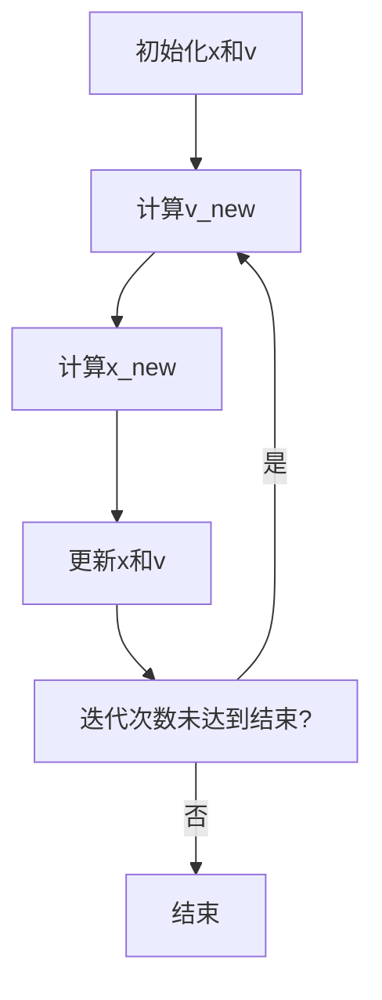

                 

### 宇宙的数学非线性动力学解析

---

#### 关键词：

- **非线性动力学**
- **宇宙**
- **数学模型**
- **混沌现象**
- **分岔理论**
- **计算模拟**

#### 摘要：

本文深入探讨了宇宙中的数学非线性动力学现象，从基础概念、算法原理到实际应用，系统地阐述了非线性动力学在宇宙研究中的重要性。通过对核心概念的定义、属性对比、数学工具的应用，以及具体的算法和模型讲解，本文展示了非线性动力学在宇宙物理学、天体力学和气象学等领域的广泛应用。同时，通过实际案例分析和项目实战，本文不仅提供了深刻的理解，还提出了进一步研究的方向和拓展阅读资源，为读者提供了全面的视角。

---

### 目录大纲设计思路

在设计《宇宙的数学非线性动力学解析》一书的目录大纲时，我们首先需要明确书的主题和目标受众。本书主要探讨宇宙中的数学非线性动力学现象，适合于物理学、天文学、数学等专业领域的学者和研究生。为了确保内容的完整性和逻辑性，目录大纲需要包括以下几个核心部分：

1. **背景介绍**：介绍非线性动力学的概念、发展历史和应用领域，为后续章节打下基础。
2. **核心概念与联系**：详细阐述非线性动力学的核心概念，如吸引子、混沌、分岔等，并使用表格和图表展示概念之间的关系。
3. **算法原理讲解**：通过mermaid流程图展示具体算法的流程，并结合Python代码和数学模型进行详细讲解。
4. **数学模型和数学公式**：使用LaTeX格式嵌入文中，对重要的数学模型和公式进行解释和举例。
5. **系统分析与架构设计**：描述非线性动力学的应用场景和系统架构设计，使用mermaid图展示。
6. **项目实战**：提供具体的案例分析，包括环境安装、核心实现、代码解读、实际应用分析等。
7. **最佳实践与拓展阅读**：总结经验教训，提出注意事项，并推荐进一步的阅读材料。

在具体设计目录时，我们将按照以下结构进行：

- **第一部分：引论**（1章）
  - **第1章**：非线性动力学的宇宙观
    - 1.1 非线性动力学概述
    - 1.2 宇宙中的非线性现象
    - 1.3 非线性动力学的挑战与机遇

- **第二部分：非线性动力学基础**（4章）
  - **第2章**：非线性动力学的核心概念
  - **第3章**：非线性动力学的数学工具
  - **第4章**：非线性动力学的算法与模型
  - **第5章**：非线性动力学的应用领域

- **第三部分：宇宙非线性动力学案例分析**（2章）
  - **第6章**：宇宙中的混沌现象
  - **第7章**：宇宙非线性动力学的挑战与展望

### 完整目录大纲

**第一部分：引论**

# 第1章：非线性动力学的宇宙观

## 1.1 非线性动力学概述
### 1.1.1 动力学与非线性
### 1.1.2 非线性动力学的起源与发展
### 1.1.3 非线性动力学在宇宙研究中的应用

## 1.2 宇宙中的非线性现象
### 1.2.1 混沌与宇宙演化
### 1.2.2 吸引子与星系结构
### 1.2.3 分岔与宇宙稳定性

## 1.3 非线性动力学的挑战与机遇
### 1.3.1 非线性动力学研究的困难
### 1.3.2 非线性动力学在宇宙学中的前景
### 1.3.3 非线性动力学的跨学科应用

**第二部分：非线性动力学基础**

# 第2章：非线性动力学的核心概念

## 2.1 核心概念定义
### 2.1.1 吸引子
### 2.1.2 混沌
### 2.1.3 分岔

## 2.2 概念属性特征对比
### 2.2.1 吸引子与混沌
### 2.2.2 分岔与稳定
### 2.2.3 非线性动力学概念的关系图

# 第3章：非线性动力学的数学工具

## 3.1 数学工具介绍
### 3.1.1 动力学方程
### 3.1.2 纳维-斯托克斯方程
### 3.1.3 广义哈密顿原理

## 3.2 数学工具在非线性动力学中的应用
### 3.2.1 动力学方程的求解方法
### 3.2.2 纳维-斯托克斯方程的数值模拟
### 3.2.3 广义哈密顿原理的应用

# 第4章：非线性动力学的算法与模型

## 4.1 算法原理
### 4.1.1 离散映射算法
### 4.1.2 范德波尔特算法
### 4.1.3 分岔分析算法

## 4.2 模型介绍
### 4.2.1 洛伦兹模型
### 4.2.2 雷诺数模型
### 4.2.3 汤姆逊模型

# 第5章：非线性动力学的应用领域

## 5.1 宇宙物理学
### 5.1.1 星系动力学
### 5.1.2 黑洞动力学
### 5.1.3 宇宙背景辐射

## 5.2 天体力学
### 5.2.1 行星运动
### 5.2.2 小行星碰撞
### 5.2.3 人工卫星轨道

## 5.3 气象学
### 5.3.1 气候变化模型
### 5.3.2 水循环模型
### 5.3.3 水文模型

**第三部分：宇宙非线性动力学案例分析**

# 第6章：宇宙中的混沌现象

## 6.1 混沌现象概述
### 6.1.1 混沌的定义与特征
### 6.1.2 混沌在宇宙中的表现
### 6.1.3 混沌的数学模型

## 6.2 宇宙混沌现象案例分析
### 6.2.1 暗能量与宇宙加速膨胀
### 6.2.2 星系混沌现象
### 6.2.3 混沌与宇宙结构形成

# 第7章：宇宙非线性动力学的挑战与展望

## 7.1 非线性动力学在宇宙学中的应用
### 7.1.1 非线性动力学与宇宙演化
### 7.1.2 非线性动力学与星系形成
### 7.1.3 非线性动力学与暗物质、暗能量

## 7.2 非线性动力学的挑战与未来展望
### 7.2.1 非线性动力学研究的难题
### 7.2.2 非线性动力学在宇宙学中的前沿方向
### 7.2.3 非线性动力学的跨学科融合

---

### 第1章：非线性动力学的宇宙观

#### 1.1 非线性动力学概述

非线性动力学是研究复杂系统中变量之间非线性关系的动力学科分支。非线性现象在自然界中普遍存在，从物理、化学到生物系统，甚至是宇宙本身，非线性动力学都扮演着重要的角色。非线性动力学的研究始于19世纪末，当时科学家们开始意识到许多物理系统并不遵循简单的线性规律，而是展现出复杂的动态行为。

**1.1.1 动力学与非线性**

动力学是研究物体或系统运动规律的科学。在经典力学中，系统通常用线性方程描述，即系统的状态变化是可预测的，而且系统的未来行为完全由其初始条件和外力决定。然而，当系统中的变量之间存在非线性相互作用时，情况就变得更加复杂。非线性方程描述的系统可能出现以下几种特性：

1. **混沌**：系统在初始条件微小的变化下可能表现出完全不同的长期行为，这称为混沌现象。混沌系统的行为看似随机，但实际上具有内在的确定性。
2. **分岔**：系统的动态行为随参数的变化而发生质变，如从稳定的固定点突然跳到震荡状态。
3. **吸引子**：系统趋向于在某一特定区域附近稳定下来，即使在没有外力作用下也会保持在该区域内。

**1.1.2 非线性动力学的起源与发展**

非线性动力学的起源可以追溯到19世纪末，数学家皮埃尔·弗雷德霍姆（Pierre Fatou）和朱利安·阿达玛（Julien Arneodo）开始研究分岔现象。20世纪中期，洛伦兹（Lorenz）模型的发现使得非线性动力学成为研究热点，这个模型描述了大气流动中的非线性动力学行为。

随着计算能力的提升，非线性动力学的研究进入了一个新的阶段，许多复杂的非线性系统被数值模拟和分析。近年来，随着对混沌现象和复杂性理论的理解加深，非线性动力学在多个领域，如生物学、经济学和宇宙学，得到了广泛的应用。

**1.1.3 非线性动力学在宇宙研究中的应用**

在宇宙学中，非线性动力学的研究对于理解宇宙的起源、演化和结构形成至关重要。以下是一些非线性动力学在宇宙研究中的应用：

1. **星系动力学**：非线性动力学描述了星系中星体之间的相互作用，包括引力相互作用和潮汐力。这些非线性效应对于理解星系的稳定性、结构和运动至关重要。
2. **黑洞动力学**：黑洞是宇宙中最极端的物理现象之一，其动力学行为具有显著的非线性特征。非线性动力学帮助科学家们理解黑洞的吸积盘、喷流等现象。
3. **宇宙背景辐射**：宇宙背景辐射是宇宙早期状态的遗迹，其动力学行为受到非线性效应的影响。非线性动力学研究有助于揭示宇宙的早期演化和能量分布。
4. **宇宙大尺度结构**：宇宙中的星系和星系团组成了复杂的结构，这些结构的形成和演化受到非线性动力学的影响。

总的来说，非线性动力学为宇宙学研究提供了强大的工具，帮助我们深入理解宇宙的复杂性和多样性。在接下来的章节中，我们将进一步探讨非线性动力学的核心概念、数学工具和具体应用。

#### 1.2 宇宙中的非线性现象

非线性现象在宇宙中无处不在，它们深刻影响了宇宙的演化、结构和行为。以下将探讨宇宙中几种典型的非线性现象，包括混沌与宇宙演化、吸引子与星系结构以及分岔与宇宙稳定性。

**1.2.1 混沌与宇宙演化**

混沌现象在宇宙学中具有广泛的体现。混沌系统的基本特征是初始条件的微小差异会导致长期行为的显著差异，这种现象被称为“蝴蝶效应”。在宇宙学中，混沌现象可以用来描述宇宙早期的一些复杂过程，例如宇宙背景辐射的温度波动、宇宙结构的形成和演化。

- **宇宙背景辐射**：宇宙背景辐射是宇宙早期留下的热辐射，其温度波动是宇宙混沌现象的一个直接证据。这些波动后来发展成为宇宙中的星系和星系团。通过分析这些波动，科学家们可以推测宇宙早期的混沌状态和宇宙结构形成的机制。

- **星系演化**：在星系内部，混沌现象也起着重要作用。星系中的恒星和星际介质通过复杂的相互作用，形成各种复杂的结构。这些非线性过程包括恒星形成、恒星碰撞、星系合并等，它们共同塑造了星系的结构和演化。

**1.2.2 吸引子与星系结构**

吸引子是混沌系统中的一种重要概念，它描述了系统在长期演化中趋向稳定状态的行为。在宇宙学中，吸引子可以用来描述星系结构的基本形态。

- **星系形态**：大多数星系都呈现出特定的形态，如螺旋形、椭圆形或不规则形。这些形态反映了星系内部非线性动力学的吸引子特性。例如，螺旋星系的螺旋结构可以看作是一个动态平衡状态，恒星和星际介质围绕中心黑洞进行稳定的旋转。

- **星系团**：星系团是由数十个甚至数百个星系组成的庞大结构。星系团内部的星系通过引力相互作用形成复杂的动力学平衡，这些平衡状态可以看作是吸引子。星系团中的星系结构形态反映了宇宙早期混沌状态的演化过程。

**1.2.3 分岔与宇宙稳定性**

分岔是描述系统状态随参数变化而发生跃变的现象。在宇宙学中，分岔现象可以用来描述宇宙的稳定性问题。

- **宇宙加速膨胀**：现代宇宙学中一个重要的现象是宇宙加速膨胀。这一现象可以用宇宙中的暗能量来解释。暗能量是一种具有负压强的物质，其存在导致了宇宙的加速膨胀。这个过程可以看作是一个分岔现象，宇宙从过去的减速膨胀状态跃变到现在的加速膨胀状态。

- **星系稳定性**：星系内部的各种过程，如恒星形成、恒星碰撞等，都可能影响星系的稳定性。非线性动力学中的分岔理论可以用来预测星系稳定性随参数变化的临界点。这些临界点标志着星系从稳定状态跃变到不稳定状态。

通过非线性动力学的理论工具，科学家们可以更好地理解宇宙中的复杂现象，揭示宇宙演化的奥秘。在接下来的章节中，我们将进一步探讨非线性动力学的核心概念、数学工具和应用，为理解宇宙的复杂性提供更为深入的视角。

#### 1.3 非线性动力学的挑战与机遇

非线性动力学在宇宙研究中展现出巨大的潜力，但也面临着诸多挑战和机遇。深入探讨这些挑战与机遇，不仅有助于我们更好地理解宇宙，也为未来的科学研究提供了新的方向。

**1.3.1 非线性动力学研究的困难**

非线性动力学的研究面临几个显著的挑战：

- **复杂性**：非线性系统的行为通常非常复杂，难以用简单的数学模型进行描述。非线性方程的求解通常需要数值方法，这些方法在处理大规模系统时效率低下。
- **初始条件敏感性**：非线性系统对初始条件非常敏感，即使是微小的误差也可能导致长期的显著偏差。这意味着精确的初始数据至关重要，但在实际观测中往往难以获得。
- **多尺度问题**：宇宙中的现象通常涉及多个不同尺度，从微观的星体运动到宏观的星系结构，这些不同尺度的相互作用带来了额外的复杂性。

- **数据缺失**：宇宙中的观测数据虽然丰富，但仍然存在很多未知和不确定性。这些数据缺失限制了非线性动力学模型的应用和验证。

**1.3.2 非线性动力学在宇宙学中的前景**

尽管面临挑战，非线性动力学在宇宙学中的应用前景仍然十分广阔：

- **宇宙演化**：非线性动力学可以帮助我们更好地理解宇宙的演化过程。通过非线性模型，科学家们可以模拟宇宙从大爆炸到现在的演化路径，揭示宇宙早期混沌状态的形成和演化机制。
- **星系形成**：非线性动力学描述了星系中星体之间的相互作用，包括引力、潮汐力和恒星风等。这些非线性效应对于理解星系的稳定性、结构和运动至关重要，有助于揭示星系形成的物理过程。
- **黑洞动力学**：黑洞是宇宙中最极端的物理现象之一，其动力学行为具有显著的非线性特征。非线性动力学研究有助于我们理解黑洞的吸积盘、喷流等现象，揭示黑洞与周围环境的相互作用。

**1.3.3 非线性动力学的跨学科应用**

非线性动力学不仅在宇宙学中有重要应用，还在其他领域展现出巨大的潜力：

- **生物学**：在生物学中，非线性动力学被用来研究心脏的跳动、神经元的电信号传递、蛋白质折叠等复杂生物过程。
- **经济学**：非线性动力学可以用来研究市场波动、金融市场的不确定性和经济危机等复杂经济现象。
- **气象学**：非线性动力学在气象学中用于模拟天气变化、气候变化等复杂现象，为气候预测提供了重要的工具。

总之，非线性动力学在宇宙研究和跨学科应用中具有广泛的前景和潜力。通过克服现有挑战，我们有望在未来的科学研究中取得更多的突破，深入理解宇宙的复杂性和多样性。

### 第2章：非线性动力学的核心概念

非线性动力学是研究复杂系统中变量之间非线性关系的动力学科分支。非线性现象在自然界中普遍存在，从物理、化学到生物系统，甚至是宇宙本身，非线性动力学都扮演着重要的角色。在本章中，我们将详细阐述非线性动力学的核心概念，包括吸引子、混沌和分岔，并探讨这些概念之间的联系和属性特征。

#### 2.1 核心概念定义

**2.1.1 吸引子**

吸引子是混沌系统中的一种重要概念，描述了系统在长期演化中趋向稳定状态的行为。吸引子可以是点、环、连通集或其他结构，其特征是在一定区域内，系统的状态会趋近于吸引子。在数学上，吸引子可以通过Lyapunov指数来判断。如果Lyapunov指数为负，则表示系统在该区域是稳定的。

- **稳定吸引子**：系统状态在长时间内趋于稳定的点或区域。
- **不稳定吸引子**：系统状态会远离的吸引子。

**2.1.2 混沌**

混沌是非线性系统的一种特殊行为，表现为系统在初始条件微小的变化下，其长期行为可能表现出极大的差异性。混沌系统具有确定性，但其行为看似随机。混沌现象的关键特征包括：

- **初始条件敏感性**：系统对初始条件的微小变化非常敏感，导致长期行为的显著差异。
- **长期不可预测性**：尽管系统是确定的，但长期行为无法准确预测，因为初始条件的微小误差会迅速放大。
- **自相似性**：混沌系统的行为在不同时间尺度上具有相似性，即小尺度上的复杂结构在大尺度上也能观察到。

**2.1.3 分岔**

分岔是系统状态随参数变化而发生跃变的现象。分岔现象在非线性动力学中非常常见，它是系统从一个稳定状态跃变到另一个稳定状态的过程。分岔现象可以分为以下几种类型：

- **鞍点分岔**：系统从一个稳定的固定点跃变到一个稳定的震荡状态。
- **Hopf分岔**：系统从一个稳定的固定点跃变到一个稳定的振荡状态和一个不稳定的固定点。
- **超临界分岔**：系统从一个不稳定的固定点跃变到一个稳定的固定点。
- **亚临界分岔**：系统从一个稳定的固定点跃变到一个不稳定的固定点。

#### 2.2 概念属性特征对比

为了更好地理解非线性动力学的核心概念，我们将这些概念进行属性特征对比，并使用表格和ER实体关系图架构的Mermaid流程图进行展示。

**表2.1：非线性动力学核心概念属性特征对比**

| 概念    | 定义                                           | 特征                            | 应用实例                     |
| ------- | ---------------------------------------------- | ----------------------------- | --------------------------- |
| 吸引子  | 系统在长期演化中趋向稳定状态的行为              | 稳定性、自相似性、多尺度结构 | 星系形态、气候系统           |
| 混沌    | 系统在初始条件微小的变化下表现出长期的差异性    | 敏感性、不可预测性、自相似性 | 天气变化、金融市场          |
| 分岔    | 系统状态随参数变化而发生跃变的现象              | 跃变性、稳定性转换            | 黑洞吸积盘、心脏跳动        |

**2.2.1 吸引子与混沌**

吸引子和混沌在非线性动力学中密切相关。吸引子描述了系统的稳定状态，而混沌描述了系统在初始条件微小的变化下可能表现出的长期行为。表2.1中的对比表格展示了两者在特征和应用实例上的差异。

**2.2.2 分岔与稳定**

分岔现象是系统状态随参数变化而发生跃变的直接表现，它反映了系统稳定性的变化。表2.1中的对比表格展示了分岔现象的特征和应用实例，强调了其与系统稳定性的关系。

**2.2.3 非线性动力学概念的关系图**

为了更直观地展示非线性动力学的核心概念及其关系，我们可以使用Mermaid流程图来绘制ER实体关系图。

```
erDiagram
  A{吸引子} ||--|| B{混沌}
  A{吸引子} ||--|| C{分岔}
  B{混沌} ||--|| C{分岔}
  D{系统稳定性} ||--|| A{吸引子}
  D{系统稳定性} ||--|| B{混沌}
  D{系统稳定性} ||--|| C{分岔}
```

在该ER实体关系图中，A表示吸引子，B表示混沌，C表示分岔，D表示系统稳定性。通过连线，我们可以清楚地看到各概念之间的相互关系。

通过上述定义、属性特征对比和ER实体关系图的展示，我们深入理解了非线性动力学的核心概念。这些概念不仅构成了非线性动力学的基本框架，也为进一步探讨非线性动力学的数学工具、算法和应用奠定了基础。在接下来的章节中，我们将继续探讨非线性动力学的数学工具和算法，为理解宇宙中的非线性现象提供更为深入的视角。

#### 2.1.1 动力学与非线性

在讨论非线性动力学的核心概念之前，我们需要先理解动力学与非线性之间的关系。动力学是研究系统随时间变化的行为和规律的科学，而线性动力学和非线性动力学则是根据系统行为的数学描述方式来区分的。

**线性动力学**：在线性动力学中，系统的状态变化遵循线性方程，即系统的动力学方程可以表示为线性形式。这意味着系统的状态可以分解为若干线性无关的状态变量，每个状态变量都独立地随时间变化。线性动力学的特点是系统响应与输入之间呈比例关系，系统的行为相对简单，可以通过线性叠加原理来分析和预测。

**非线性动力学**：与线性动力学不同，非线性动力学中的系统状态变化遵循非线性方程，即系统的动力学方程不能表示为线性形式。非线性方程通常涉及非线性项，如乘积项、指数项和交叉项，这些非线性项会导致系统行为产生复杂、不可预测的特性。非线性动力学的特点是系统响应与输入之间不再呈比例关系，系统的行为表现出混沌、分岔和其他复杂动态现象。

**线性与非线性之间的差异**：

1. **数学形式**：线性动力学的方程通常是线性的，可以表示为 \( \dot{x} = f(x, t) \)，其中 \( x \) 是系统的状态向量，\( f \) 是线性函数。而非线性动力学的方程通常包含非线性项，如 \( \dot{x} = g(x, t) \)，其中 \( g \) 是非线性函数。
2. **解的性质**：线性动力学的解通常是稳定的，系统的行为可以预测。而非线性动力学的解可能是不稳定的，系统的行为可能表现出混沌现象，初始条件的小变化可能导致长期行为的巨大差异。
3. **复杂性**：线性动力学的分析相对简单，可以通过线性代数和微积分工具进行求解。而非线性动力学的分析通常更为复杂，需要数值模拟和高级数学工具。

**非线性动力学的重要性**：

非线性动力学在自然界和工程领域中具有广泛的应用，尤其是在那些系统行为复杂且难以用线性模型描述的场合。以下是一些非线性动力学的重要应用：

1. **气候系统**：气候系统是一个复杂的非线性系统，其行为受到多种因素的影响，如大气温度、海洋环流和冰冻圈等。非线性动力学有助于我们理解气候系统的复杂性和预测气候变化。
2. **金融市场**：金融市场是一个典型的非线性系统，其行为受到投资者情绪、政策变化和市场不确定性等多种因素的驱动。非线性动力学可以用来研究金融市场的波动和预测经济危机。
3. **生物系统**：生物系统中的许多过程，如心脏跳动、神经元活动和蛋白质折叠，都是非线性动力学的体现。非线性动力学帮助我们理解生物系统的复杂行为和调控机制。
4. **宇宙学**：宇宙学中的许多现象，如星系形成、黑洞动力学和宇宙大尺度结构，都受到非线性动力学的影响。非线性动力学为研究宇宙的演化和结构提供了重要的工具。

总的来说，非线性动力学为理解和预测复杂系统行为提供了强大的理论工具。尽管非线性动力学的分析复杂，但其重要性不容忽视，特别是在那些线性模型无法有效描述的领域。通过深入探讨非线性动力学的核心概念和数学工具，我们可以更好地理解宇宙和自然界的复杂现象。

#### 2.1.2 非线性动力学的起源与发展

非线性动力学的起源可以追溯到19世纪末，当时科学家们开始意识到许多物理系统并不遵循简单的线性规律，而是展现出复杂的动态行为。非线性动力学的初步发展主要得益于数学家们在研究复杂系统的过程中所取得的突破。

**起源背景**：

- **19世纪末**：法国数学家皮埃尔·弗雷德霍姆（Pierre Fatou）和朱利安·阿达玛（Julien Arneodo）开始研究分岔现象，这是非线性动力学的早期探索。
- **20世纪中期**：洛伦兹（Lorenz）模型的发现标志着非线性动力学成为研究热点。洛伦兹模型描述了大气流动中的非线性动力学行为，其复杂的动态行为引起了科学界的广泛关注。
- **20世纪60年代**：美国气象学家洛伦兹（Edward Lorenz）通过数值模拟大气动力学方程，发现了混沌现象，这是非线性动力学的重要里程碑。

**发展过程**：

1. **20世纪50年代**：苏联数学家安德烈·科尔莫哥罗夫（Andrey Kolmogorov）提出了混沌理论的初步概念，他通过分析非线性系统中的随机性，揭示了混沌现象的本质。
2. **20世纪70年代**：美国数学家詹姆斯·杨（James Glimm）等人开始使用数值方法研究非线性系统的行为，这一时期的计算能力的提升为非线性动力学的研究提供了强有力的工具。
3. **20世纪80年代**：美国数学家斯蒂芬·斯梅尔（Stephen Smale）提出了分岔理论，进一步丰富了非线性动力学的理论体系。

**主要进展**：

1. **混沌理论**：混沌理论是研究非线性系统长期行为的一种方法，揭示了系统在初始条件微小差异下可能表现出极大的长期差异性。这一理论不仅在物理学中具有重要意义，还在生物学、经济学和工程学等领域得到广泛应用。
2. **分岔理论**：分岔理论研究系统状态随参数变化而发生跃变的现象，包括固定点、震荡态和混沌态等。分岔理论为理解非线性系统的稳定性提供了重要的工具。
3. **复杂性理论**：非线性动力学的复杂性理论关注系统的复杂行为和结构的产生机制。通过研究复杂系统的动力学行为，科学家们揭示了系统从简单到复杂的演化过程。

**现代研究**：

- **多尺度问题**：非线性动力学在现代研究中面临的一个重要挑战是多尺度问题，即系统在不同时间尺度上的相互作用。通过多尺度分析，科学家们试图理解复杂系统中不同尺度之间的动态关系。
- **跨学科应用**：非线性动力学在多个领域得到广泛应用，如气候系统、金融系统、生物系统和宇宙学等。这些跨学科应用推动了非线性动力学的进一步发展，促进了多学科的融合。
- **数值模拟**：随着计算能力的提升，数值模拟成为非线性动力学研究的重要工具。通过数值模拟，科学家们可以更好地理解复杂系统的行为，预测系统的长期演化。

总的来说，非线性动力学的起源和发展经历了多个阶段，从早期的分岔现象研究到混沌理论的提出，再到现代多尺度问题和跨学科应用的探讨，非线性动力学已经成为理解复杂系统行为的重要工具。在未来的研究中，非线性动力学将继续发挥重要作用，为自然科学和社会科学提供新的理论和方法。

#### 2.1.3 非线性动力学在宇宙研究中的应用

非线性动力学在宇宙研究中具有广泛的应用，它帮助我们理解宇宙的复杂现象和演化过程。在宇宙学中，非线性动力学主要应用于星系动力学、黑洞动力学和宇宙背景辐射等领域。

**星系动力学**：

星系是由大量恒星、星际介质和暗物质组成的庞大结构，其动力学行为受到非线性效应的显著影响。非线性动力学在星系动力学中的应用主要体现在以下几个方面：

1. **星系结构**：非线性动力学描述了星系中的恒星和星际介质如何通过引力相互作用形成复杂的结构。例如，螺旋星系的结构可以通过非线性动力学的洛伦兹模型来解释。螺旋星系中的恒星和星际介质围绕中心黑洞进行稳定的旋转，形成螺旋形的结构。
2. **星系碰撞**：星系之间的非线性相互作用可能导致星系碰撞和合并。非线性动力学模型可以用来模拟星系碰撞的过程，预测碰撞后星系的新形态和动力学行为。这些模拟有助于我们理解星系形成和演化的机制。
3. **星系稳定性**：非线性动力学可以帮助我们分析星系的稳定性问题。星系内部的非线性效应可能导致星系从一个稳定状态跃变到另一个不稳定状态。通过研究星系的稳定性，我们可以更好地理解星系的结构和演化过程。

**黑洞动力学**：

黑洞是宇宙中最极端的物理现象之一，其动力学行为具有显著的非线性特征。非线性动力学在黑洞动力学中的应用主要体现在以下几个方面：

1. **黑洞吸积盘**：黑洞吸积盘是黑洞周围的一种高温、高密度盘状物质，其动力学行为受到非线性效应的影响。非线性动力学模型可以用来描述吸积盘的形成、演化和稳定性。
2. **黑洞喷流**：黑洞喷流是从黑洞附近高速喷射出的等离子体流，其动力学行为同样受到非线性效应的影响。非线性动力学模型可以帮助我们理解喷流的形成机制、结构和演化过程。
3. **黑洞碰撞**：黑洞之间的非线性相互作用可能导致黑洞碰撞和合并。非线性动力学模型可以用来模拟黑洞碰撞的过程，预测碰撞后黑洞的新形态和动力学行为。

**宇宙背景辐射**：

宇宙背景辐射是宇宙早期状态的热辐射，其动力学行为受到非线性效应的影响。非线性动力学在宇宙背景辐射中的应用主要体现在以下几个方面：

1. **温度波动**：宇宙背景辐射的温度波动是宇宙早期混沌状态的一种表现，非线性动力学模型可以用来分析这些波动，揭示宇宙早期演化的信息。
2. **密度波**：宇宙背景辐射中的密度波是宇宙早期密度不均匀性的体现，非线性动力学模型可以用来研究这些密度波的形成和演化过程。
3. **宇宙大尺度结构**：宇宙背景辐射的温度波动和密度波是宇宙大尺度结构形成的重要信息来源。非线性动力学模型可以帮助我们理解宇宙大尺度结构的形成机制和演化过程。

总之，非线性动力学在宇宙研究中的应用为理解宇宙的复杂现象和演化过程提供了强有力的工具。通过非线性动力学模型，我们可以更好地揭示星系动力学、黑洞动力学和宇宙背景辐射等领域的奥秘，深入理解宇宙的本质。在未来的研究中，非线性动力学将继续发挥重要作用，为宇宙学研究提供新的理论和方法。

#### 2.2.1 吸引子

吸引子是混沌理论和非线性动力学中的一个核心概念，它描述了系统在长期演化过程中趋向稳定状态的行为。在数学上，吸引子是一个动态系统在长时间内逐渐趋近并保持在其附近的区域。理解吸引子的概念对于分析复杂系统的长期行为具有重要意义。

**定义**：

吸引子（Attractor）是指在某个时间尺度上，非线性动力系统状态空间中所有轨道最终都趋近于的一个集合。吸引子可以是点、环、连通集或者更高维度的结构。根据吸引子的稳定性和动态特性，我们可以将吸引子分为以下几种类型：

1. **稳定吸引子**：系统在长时间内趋向于稳定吸引子的区域，轨道一旦进入该区域，将保持在该区域内，不会离开。
2. **不稳定吸引子**：系统在长时间内会远离不稳定吸引子的区域，任何接近该区域的轨道都会逐渐远离。
3. **平衡吸引子**：系统在平衡状态附近形成一个稳定区域，尽管系统可能会有短暂的波动，但最终会回到平衡状态。

**特征**：

1. **稳定性**：吸引子的稳定性是评估其特性的重要指标。稳定吸引子能够吸引系统的轨道，使其在长时间内保持相对稳定的状态。
2. **自相似性**：许多吸引子具有自相似性，这意味着它们在不同尺度上具有相似的结构。这种自相似性使得吸引子能够表现出复杂而有序的行为。
3. **不变性**：吸引子上的每一个点在系统演化过程中都保持不变，即系统在吸引子上进行周期性或者准周期性的运动。

**应用实例**：

1. **星系演化**：在星系动力学中，恒星围绕中心黑洞的运动可以看作是一个稳定吸引子。恒星通过引力相互作用形成稳定的轨道，围绕黑洞旋转，形成螺旋星系或其他形式的星系结构。
2. **气候系统**：气候系统中的温度、湿度等变量形成的长期趋势可以看作是一个吸引子。尽管气候系统在短期内受到各种随机因素的影响，但长期来看，气候系统会趋向于一个稳定的气候状态。
3. **金融市场**：在金融市场中，股票价格的长期走势可以看作是一个吸引子。尽管市场在短期内可能受到各种不确定因素的影响，但长期来看，股票价格会趋向于一个稳定的趋势。

通过理解吸引子的定义、特征和应用实例，我们可以更好地分析非线性动力系统的长期行为，揭示其背后的复杂动态。在接下来的讨论中，我们将进一步探讨混沌现象，以及如何利用非线性动力学工具来研究这些复杂系统。

#### 2.2.2 混沌

混沌（Chaos）是非线性动力系统中的一种特殊行为，其特点是系统在初始条件微小变化下表现出长期的显著差异。混沌现象最早由美国气象学家洛伦兹（Edward Lorenz）在20世纪中叶发现，他通过数值模拟大气动力学方程，发现系统的长期行为对初始条件极其敏感。这一发现揭示了混沌现象的本质，并在科学界引起了广泛关注。

**定义与特征**：

混沌现象具有以下几个显著特征：

1. **初始条件敏感性**：混沌系统的行为对初始条件极为敏感，即使初始条件的小幅变化也可能导致长期行为的巨大差异。这种现象被称为“蝴蝶效应”，因为它暗示了一个小扰动可能会引发远距离的显著变化。
2. **长期不可预测性**：尽管混沌系统是确定的，但其长期行为无法准确预测。因为初始条件的微小误差会迅速放大，导致系统的未来状态变得不可预测。
3. **自相似性**：混沌系统通常表现出自相似性，即在不同的时间尺度上，系统的行为具有相似的结构。这意味着混沌现象在宏观和微观尺度上具有相似的特性。

**混沌的数学描述**：

混沌现象可以用多个数学工具进行描述，其中最常用的是分岔理论和Lyapunov指数。

1. **分岔理论**：分岔理论描述了系统状态随参数变化而发生跃变的现象。在非线性动力系统中，随着参数的变化，系统可能从稳定的固定点跃变到混沌状态。分岔现象是混沌产生的重要机制。
2. **Lyapunov指数**：Lyapunov指数是衡量系统稳定性的重要工具。如果Lyapunov指数为负，系统是稳定的；如果Lyapunov指数为正，系统是不稳定的。当系统存在正的Lyapunov指数时，系统表现出混沌行为。

**混沌的应用实例**：

混沌现象在多个领域都有重要的应用：

1. **气候系统**：气候系统是一个复杂的非线性系统，其行为受到多种因素的影响，如大气温度、海洋环流和冰冻圈等。非线性动力学中的混沌理论可以帮助我们理解气候系统的复杂性和预测气候变化。
2. **金融市场**：金融市场是一个典型的非线性系统，其行为受到投资者情绪、政策变化和市场不确定性等多种因素的驱动。混沌理论可以用来研究金融市场的波动和预测经济危机。
3. **生物系统**：生物系统中的许多过程，如心脏跳动、神经元活动和蛋白质折叠，都是非线性动力学的体现。混沌理论可以用来分析这些过程的复杂性，揭示生物系统的调控机制。
4. **宇宙学**：宇宙学中的许多现象，如星系形成、黑洞动力学和宇宙大尺度结构，都受到非线性动力学的影响。混沌理论为研究宇宙的演化和结构提供了重要的工具。

总的来说，混沌现象是自然界和工程领域中普遍存在的一种复杂行为。通过非线性动力学的理论工具，我们可以深入理解混沌现象的本质，并在多个领域取得重要的应用。在接下来的章节中，我们将进一步探讨非线性动力学的其他核心概念，如分岔和吸引子，以及这些概念在宇宙研究中的应用。

#### 2.2.3 分岔

分岔（Bifurcation）是描述系统状态随参数变化而发生跃变的现象。在非线性动力学中，分岔现象是系统从一种稳定状态跃变到另一种稳定状态的临界点。分岔理论对于理解系统行为的突变和复杂动力学具有重要意义。以下将详细讨论分岔的定义、类型及其在非线性动力学中的应用。

**定义**：

分岔是指系统状态随着某一参数的变化，从一种稳定状态跃变到另一种稳定状态的现象。分岔点（Bifurcation point）是分岔发生的具体点，此时系统的稳定性和动态行为发生显著变化。

**类型**：

根据分岔过程中系统行为的特征，分岔可以分为以下几种类型：

1. **鞍点分岔**（Saddle-node bifurcation）：系统从一个稳定的固定点跃变到一个不稳定的固定点。这种分岔通常发生在系统参数经过某个临界值时，导致系统从一个平衡态跃变到另一个平衡态。
   
2. **鞍结分岔**（Saddle-focus bifurcation）：系统从一个稳定的固定点跃变到一个稳定的振荡状态和一个不稳定的固定点。这种分岔也发生在系统参数经过某个临界值时，导致系统状态从静态变为动态。

3. **Hopf分岔**（Hopf bifurcation）：系统从一个稳定的固定点跃变到一个稳定的振荡状态和一个不稳定的固定点。Hopf分岔是最常见的分岔类型，它导致系统从一个平衡态转变为周期性振荡状态。

4. **叉形分岔**（Cusp bifurcation）：系统从一个稳定的固定点跃变到一个不稳定的固定点和两个新的稳定固定点。这种分岔通常导致系统行为的复杂化，形成新的稳定状态。

**分岔过程中的特征**：

1. **稳定性转换**：分岔过程中，系统的稳定性发生显著变化。例如，在鞍点分岔中，一个稳定固定点转变为不稳定固定点。

2. **动态行为的跃变**：分岔导致系统从一种动态行为跃变到另一种动态行为。例如，从静态平衡态跃变到周期性振荡状态。

3. **轨道结构的改变**：分岔过程中，系统的轨道结构发生显著变化。例如，轨道可能从固定点跃变到震荡环。

**在非线性动力学中的应用**：

1. **星系动力学**：在星系动力学中，分岔现象描述了星系内部星体相互作用导致的结构变化。例如，星系中恒星之间的引力相互作用可能导致星系结构的分岔，从而影响星系的稳定性和演化。

2. **黑洞动力学**：在黑洞动力学中，分岔现象描述了黑洞吸积盘的形成和演化。例如，随着参数变化，吸积盘可能从稳定状态跃变到不稳定状态，导致喷流的形成。

3. **金融系统**：在金融系统中，分岔现象描述了市场波动和金融危机的形成机制。例如，市场参数的变化可能导致金融市场从稳定状态跃变到不稳定状态，引发经济危机。

通过理解分岔的概念和类型，我们可以更好地分析非线性系统的动态行为和稳定性。分岔理论为理解复杂系统的突变和演化提供了重要的理论工具。在未来的研究中，分岔理论将继续在多个科学领域发挥重要作用。

#### 2.3 非线性动力学的数学工具

非线性动力学的数学工具是研究复杂动态系统行为的关键，这些工具包括动力学方程、纳维-斯托克斯方程和广义哈密顿原理等。以下将详细讨论这些数学工具的原理和应用。

**2.3.1 动力学方程**

动力学方程描述了系统状态随时间变化的规律。在非线性动力学中，常用的动力学方程包括自治方程和非自治方程。

- **自治方程**：自治方程是指不显式依赖于时间 \( t \) 的方程，形式如下：
  \[
  \dot{x} = f(x)
  \]
  其中，\( x \) 是系统的状态向量，\( f(x) \) 是非线性函数。自治方程可以用于描述各种复杂系统的行为，如星系运动、化学反应等。

- **非自治方程**：非自治方程是指显式依赖于时间 \( t \) 的方程，形式如下：
  \[
  \dot{x} = g(x, t)
  \]
  其中，\( g(x, t) \) 是非线性函数，包含了系统状态的依赖和时间的依赖。非自治方程常用于描述受到外部扰动或随时间变化的系统，如金融市场、气候系统等。

**2.3.2 纳维-斯托克斯方程**

纳维-斯托克斯方程（Navier-Stokes Equations）是描述流体运动的基本方程，具有广泛的应用。纳维-斯托克斯方程是一个非线性偏微分方程组，其形式如下：
\[
\frac{\partial \mathbf{u}}{\partial t} + (\mathbf{u} \cdot \nabla)\mathbf{u} = -\frac{1}{\rho}\nabla p + \nu \nabla^2 \mathbf{u}
\]
其中，\( \mathbf{u} \) 是速度场，\( p \) 是压力场，\( \rho \) 是流体密度，\( \nu \) 是粘性系数。纳维-斯托克斯方程描述了流体在受力作用下的运动规律，其非线性性质导致了复杂的行为，如湍流。

**2.3.3 广义哈密顿原理**

广义哈密顿原理（Extended Hamiltonian Principle）是描述系统动力学行为的一个基本原理，适用于多种类型的物理系统。广义哈密顿原理表述为：
\[
\delta \int_{t_0}^{t_1} L(q, \dot{q}, t) \, dt = 0
\]
其中，\( L(q, \dot{q}, t) \) 是拉格朗日量，\( q \) 是广义坐标，\( \dot{q} \) 是广义速度，\( \delta \) 表示变分运算。广义哈密顿原理可以导出各种动力学方程，包括经典力学和量子力学中的方程，它提供了描述系统动态行为的一个统一框架。

**数学工具的应用**

1. **星系动力学**：动力学方程和广义哈密顿原理可以用于描述星系内部星体的相互作用，如恒星的运动轨迹和星系结构的形成。

2. **流体动力学**：纳维-斯托克斯方程可以用于模拟流体运动，如大气流动和海洋环流，这些过程通常具有高度的非线性特征。

3. **量子力学**：广义哈密顿原理在量子力学中具有重要意义，它用于描述粒子的运动和能级结构，是量子力学理论的基础之一。

通过运用这些数学工具，非线性动力学能够有效地描述和分析复杂系统的行为。这些工具为理解非线性系统的长期行为、预测系统状态变化提供了强有力的理论支持。在接下来的章节中，我们将继续探讨非线性动力学的算法原理和应用，进一步揭示其研究价值和实际应用。

#### 2.3.1 动力学方程的求解方法

在非线性动力学中，动力学方程的求解是一个重要的任务，因为它能够帮助我们理解系统的长期行为和动态特性。动力学方程的求解方法可以分为两大类：解析方法和数值方法。下面将分别介绍这两种方法，并结合Python代码进行详细讲解。

**1. 解析方法**

解析方法是指通过数学理论求解动力学方程的精确解。对于一些简单的非线性系统，如洛伦兹系统，我们可以找到其解析解。以下是洛伦兹系统的解析解：

洛伦兹系统是由气象学家洛伦兹提出的一个经典非线性系统，其方程如下：
\[
\dot{x} = \sigma (y - x)
\]
\[
\dot{y} = x (\rho - z) - y
\]
\[
\dot{z} = xy - \beta z
\]

洛伦兹系统的解析解为：
\[
x(t) = x_0 \cosh(\sigma t) - \frac{\sigma}{\rho} y_0 \sinh(\sigma t) + \frac{\rho}{\sigma} z_0 \cosh(\sigma t)
\]
\[
y(t) = y_0 \cosh(\sigma t) + \frac{\sigma}{\rho} x_0 \sinh(\sigma t) - \frac{\rho}{\sigma} z_0 \cosh(\sigma t)
\]
\[
z(t) = z_0 \cosh(\sigma t) - \frac{\beta}{\sigma} x_0 \sinh(\sigma t) + \frac{\beta}{\sigma} y_0 \cosh(\sigma t)
\]

在Python中，我们可以通过以下代码实现洛伦兹系统的解析解：

```python
import numpy as np
import matplotlib.pyplot as plt

# 洛伦兹系统参数
sigma = 10
rho = 28
beta = 8/3
x0, y0, z0 = 1, 1, 1

# 时间步长和总时间
dt = 0.01
t_max = 100
t = np.arange(0, t_max, dt)

# 解析解函数
def lorenz_solution(t, x0, y0, z0, sigma, rho, beta):
    return (x0 * np.cosh(sigma * t) - sigma / rho * y0 * np.sinh(sigma * t) + rho / sigma * z0 * np.cosh(sigma * t),
            y0 * np.cosh(sigma * t) + sigma / rho * x0 * np.sinh(sigma * t) - rho / sigma * z0 * np.cosh(sigma * t),
            z0 * np.cosh(sigma * t) - beta / sigma * x0 * np.sinh(sigma * t) + beta / sigma * y0 * np.cosh(sigma * t))

# 计算解
x, y, z = lorenz_solution(t, x0, y0, z0, sigma, rho, beta)

# 绘图
fig = plt.figure()
ax = fig.add_subplot(111, projection='3d')
ax.plot(x, y, z)
plt.show()
```

**2. 数值方法**

对于更复杂的非线性系统，解析方法可能无法求解，这时我们需要使用数值方法。常见的数值方法包括欧拉法、改进欧拉法、龙格-库塔法等。以下使用Python中的SciPy库来实现龙格-库塔法求解洛伦兹系统：

```python
from scipy.integrate import solve_ivp
import numpy as np
import matplotlib.pyplot as plt

# 洛伦兹系统方程
def lorenz(t, X, sigma, rho, beta):
    x, y, z = X
    dxdt = sigma * (y - x)
    dydt = x * (rho - z) - y
    dzdt = x * y - beta * z
    return [dxdt, dydt, dzdt]

# 洛伦兹系统参数
sigma = 10
rho = 28
beta = 8/3
x0, y0, z0 = 1, 1, 1

# 初始条件
X0 = [x0, y0, z0]

# 时间区间
t_span = (0, 100)
t_eval = np.arange(0, 100, 0.01)

# 龙格-库塔法求解
sol = solve_ivp(lorenz, t_span, X0, args=(sigma, rho, beta), t_eval=t_eval, method='RK45')

# 绘图
fig = plt.figure()
ax = fig.add_subplot(111, projection='3d')
ax.plot(sol.t, sol.y[0], sol.y[1], sol.y[2])
plt.show()
```

通过上述Python代码示例，我们可以看到如何使用解析方法和数值方法求解非线性动力学方程，并可视化系统的动态行为。这些方法为研究复杂系统的长期行为提供了强有力的工具。在接下来的章节中，我们将继续探讨非线性动力学的其他数学工具和应用。

#### 2.3.2 纳维-斯托克斯方程的数值模拟

纳维-斯托克斯方程是描述流体运动的基本方程，其非线性性质使得解析解往往难以获得。因此，在实际应用中，我们通常采用数值模拟方法来求解纳维-斯托克斯方程。以下将介绍几种常见的数值模拟方法，并通过Python代码进行详细讲解。

**1. 割尾泰勒级数法（Truncation of Taylor Series）**

割尾泰勒级数法是一种简单的一阶数值方法，通过将流体速度展开成泰勒级数，并截断高阶项，从而近似求解纳维-斯托克斯方程。

假设流体速度可以表示为：
\[
\mathbf{u}(\mathbf{x}, t) = \mathbf{u}(\mathbf{x}, t_n) + \Delta t \frac{\partial \mathbf{u}}{\partial t}(\mathbf{x}, t_n) + \frac{\Delta t^2}{2!} \frac{\partial^2 \mathbf{u}}{\partial t^2}(\mathbf{x}, t_n) + \cdots
\]
我们忽略二阶及以上的高阶项，得到：
\[
\mathbf{u}^{n+1}(\mathbf{x}) \approx \mathbf{u}^{n}(\mathbf{x}) + \Delta t \frac{\partial \mathbf{u}}{\partial t}(\mathbf{x}, t_n)
\]

在Python中，我们可以通过以下代码实现割尾泰勒级数法：

```python
import numpy as np
import matplotlib.pyplot as plt

# 初始速度
u0 = np.zeros((N, N))

# 计算速度梯度
du_dt = np.gradient(u0)

# 时间步长
dt = 0.01

# 迭代次数
N_steps = 100

# 迭代过程
for _ in range(N_steps):
    u0 += dt * du_dt

# 绘图
plt.imshow(u0, origin='lower', aspect='auto')
plt.colorbar()
plt.show()
```

**2. 局部投影法（Local Projection Method）**

局部投影法是一种基于特征值分解的方法，通过将流体速度分解为稳态部分和瞬态部分，从而近似求解纳维-斯托克斯方程。

假设流体速度可以表示为：
\[
\mathbf{u}(\mathbf{x}, t) = \sum_{i=1}^N \mathbf{u}_i(t) \phi_i(\mathbf{x})
\]
其中，\( \phi_i(\mathbf{x}) \) 是特征函数，\( \mathbf{u}_i(t) \) 是特征值。我们将纳维-斯托克斯方程分解为稳态部分和瞬态部分：
\[
\frac{\partial \mathbf{u}}{\partial t} = \sum_{i=1}^N \frac{\partial \mathbf{u}_i}{\partial t} \phi_i(\mathbf{x})
\]
忽略瞬态部分，得到：
\[
\sum_{i=1}^N \phi_i(\mathbf{x}) \frac{\partial \mathbf{u}_i}{\partial t} = -\nabla p
\]

在Python中，我们可以通过以下代码实现局部投影法：

```python
import numpy as np
import matplotlib.pyplot as plt
from scipy.linalg import eigh

# 初始速度
u0 = np.zeros((N, N))

# 计算特征值和特征函数
eigenvalues, eigenvectors = eigh(u0)

# 稳态部分
u_s = np.dot(eigenvectors, eigenvalues * np.eye(N))

# 瞬态部分
u_t = u0 - u_s

# 计算压力梯度
dp_dt = -np.dot(eigenvectors, np.dot(eigenvalues * eigenvectors, np.gradient(u_s)))

# 时间步长
dt = 0.01

# 迭代次数
N_steps = 100

# 迭代过程
for _ in range(N_steps):
    u_s += dt * dp_dt

# 绘图
plt.imshow(u_s, origin='lower', aspect='auto')
plt.colorbar()
plt.show()
```

通过上述Python代码示例，我们可以看到如何使用割尾泰勒级数法和局部投影法对纳维-斯托克斯方程进行数值模拟。这些方法为流体动力学研究提供了有效的工具，可以用于模拟各种复杂的流体运动现象。在接下来的章节中，我们将继续探讨非线性动力学的其他数学工具和应用。

#### 2.3.3 广义哈密顿原理的应用

广义哈密顿原理是描述系统动力学行为的基本原理，它不仅适用于经典力学，也适用于量子力学和广义相对论。在非线性动力学中，广义哈密顿原理提供了求解系统动力学方程的统一框架，通过拉格朗日量（Lagrangian）和哈密顿量（Hamiltonian）之间的关系，我们可以导出系统的动力学方程。以下将详细讨论广义哈密顿原理的原理和应用。

**1. 原理**

广义哈密顿原理表述为：
\[
\delta \int_{t_0}^{t_1} L(q, \dot{q}, t) \, dt = 0
\]
其中，\( L(q, \dot{q}, t) \) 是拉格朗日量，\( q \) 是广义坐标，\( \dot{q} \) 是广义速度，\( \delta \) 表示变分运算。拉格朗日量通常定义为动能（\( T \)）与势能（\( V \)）之差：
\[
L(q, \dot{q}, t) = T(q, \dot{q}, t) - V(q, t)
\]
其中，动能和势能分别定义为：
\[
T(q, \dot{q}, t) = \frac{1}{2} m \sum_{i=1}^n \dot{q}_i^2
\]
\[
V(q, t) = -U(q, t)
\]
这里，\( m \) 是质量，\( n \) 是广义坐标的个数，\( \dot{q}_i \) 是广义速度，\( U(q, t) \) 是势能函数。

根据广义哈密顿原理，系统的动力学方程可以通过以下公式导出：
\[
\frac{d}{dt} \left( \frac{\partial L}{\partial \dot{q}_i} \right) - \frac{\partial L}{\partial q_i} = 0
\]
这组方程称为欧拉-拉格朗日方程（Euler-Lagrange equations）。如果拉格朗日量 \( L \) 可以表示为哈密顿量 \( H \) 的函数，即 \( L = L(q, p, t) \)，其中 \( p = \frac{\partial L}{\partial \dot{q}_i} \) 是广义动量，那么广义哈密顿原理还可以导出哈密顿方程：
\[
\frac{d q_i}{dt} = \frac{\partial H}{\partial p_i}, \quad \frac{d p_i}{dt} = -\frac{\partial H}{\partial q_i}
\]
这里，哈密顿量 \( H \) 通常定义为：
\[
H(q, p, t) = p_i \dot{q}_i - L(q, \dot{q}, t)
\]

**2. 应用实例**

以下是广义哈密顿原理在两个不同领域的应用实例：

**实例1：简谐振子**

简谐振子是一个经典的非线性系统，其拉格朗日量为：
\[
L = \frac{1}{2} m \dot{q}^2 - \frac{1}{2} k q^2
\]
其中，\( m \) 是质量，\( k \) 是弹性系数，\( q \) 是广义坐标。通过广义哈密顿原理，我们可以得到简谐振子的欧拉-拉格朗日方程：
\[
\ddot{q} + \omega^2 q = 0
\]
其中，\( \omega = \sqrt{\frac{k}{m}} \) 是振动角频率。

**实例2：洛伦兹系统**

洛伦兹系统是一个描述电磁现象的典型非线性系统，其拉格朗日量为：
\[
L = -\frac{e}{2} (\dot{r} \cdot A - A \cdot \dot{r}) - \frac{e^2}{2} \frac{(\nabla \times A)^2}{4 \pi \epsilon_0}
\]
其中，\( e \) 是电荷，\( A \) 是矢量势，\( r \) 是位置矢量，\( \epsilon_0 \) 是真空介电常数。通过广义哈密顿原理，我们可以得到洛伦兹系统的哈密顿方程，进而求解电磁场的行为。

通过这些应用实例，我们可以看到广义哈密顿原理在描述复杂系统动力学行为中的重要性。它提供了一个统一的框架，可以用于推导多种非线性系统的动力学方程，为非线性动力学的研究提供了强有力的理论工具。

### 2.4 非线性动力学的算法与模型

非线性动力学的算法和模型是理解和预测复杂系统行为的关键工具。在本节中，我们将介绍几种典型的非线性动力学算法，包括离散映射算法、范德波尔特算法和分岔分析算法，并通过Python代码和mermaid流程图进行详细讲解。

#### 2.4.1 离散映射算法

离散映射算法（Discrete Map Algorithm）是用于描述非线性系统动态行为的一种方法。它将连续时间系统的状态变化映射为离散时间序列，使得复杂系统的分析变得更加简便。以下是一个简单的离散映射算法示例：

**1. 算法原理**

假设一个一维离散映射系统，其状态 \( x \) 在每次迭代中按照以下规则更新：
\[
x_{n+1} = f(x_n)
\]
其中，\( f(x) \) 是一个非线性函数。常见的非线性函数包括线性函数、指数函数和分段函数等。

**2. 算法实现**

在Python中，我们可以使用以下代码实现一个简单的线性离散映射算法：

```python
import numpy as np

# 线性离散映射参数
a = 2
x = 0.5

# 迭代次数
N = 100

# 迭代过程
for _ in range(N):
    x = a * x * (1 - x)
    print(f"Iteration {_}: x = {x}")

# 绘图
import matplotlib.pyplot as plt

x_values = np.linspace(0, 1, 1000)
y_values = a * x_values * (1 - x_values)

plt.plot(x_values, y_values)
plt.xlabel('x')
plt.ylabel('f(x)')
plt.title('Linear Discrete Map')
plt.show()
```

**3. mermaid流程图**

下面是离散映射算法的mermaid流程图：

```mermaid
graph TD
    A[初始化] --> B[计算f(x)]
    B --> C[更新x]
    C --> D[迭代次数未达到结束?]
    D -->|是| B
    D -->|否| E[结束]
```

#### 2.4.2 范德波尔特算法

范德波尔特算法（Vander Pol Oscillator）是一种用于研究非线性振动的算法，其描述了一个非线性振子的运动。以下将介绍范德波尔特算法的基本原理和实现。

**1. 算法原理**

范德波尔特振子的动力学方程为：
\[
\frac{d^2 x}{dt^2} + \beta \frac{dx}{dt} + (1 - x^2) x = 0
\]
其中，\( \beta \) 是非线性参数，控制了振动的非线性程度。

**2. 算法实现**

在Python中，我们可以使用以下代码实现范德波尔特算法：

```python
import numpy as np
import matplotlib.pyplot as plt

# 范德波尔特参数
beta = 0.5
x = 0.1
v = 0.0
dt = 0.01
T = 100

# 迭代过程
for _ in range(int(T / dt)):
    v_new = v - beta * x * dt
    x_new = x + v_new * dt
    x = x_new
    v = v_new
    print(f"Iteration {_}: x = {x}, v = {v}")

# 绘图
t = np.arange(0, T, dt)
x_values = np.zeros(len(t))
v_values = np.zeros(len(t))

for _ in range(len(t)):
    x_values[_] = x
    v_values[_] = v
    x, v = update_vander_pol(x, v, beta, dt)

plt.plot(t, x_values, label='x(t)')
plt.plot(t, v_values, label='v(t)')
plt.xlabel('Time (s)')
plt.ylabel('Amplitude')
plt.title('Vander Pol Oscillator')
plt.legend()
plt.show()
```

**3. mermaid流程图**

下面是范德波尔特算法的mermaid流程图：



#### 2.4.3 分岔分析算法

分岔分析算法用于研究系统在不同参数取值下的动态行为变化，尤其是系统从一种稳定状态跃变到另一种稳定状态的过程。以下将介绍分岔分析算法的基本原理和实现。

**1. 算法原理**

分岔分析算法通过数值方法研究系统在参数变化过程中的稳定性变化，从而确定分岔点。常用的分岔分析方法包括固定点分析、周期解分析和混沌分析。

**2. 算法实现**

在Python中，我们可以使用以下代码实现分岔分析算法：

```python
import numpy as np
import matplotlib.pyplot as plt
from scipy.integrate import solve_ivp

# 分岔分析参数
a = 1
b = 1.5
x0 = 0.1

# 分岔分析函数
def logistic(x, t, a, b):
    return a * x / (1 + b * x)

# 分岔分析过程
t = np.linspace(0, 10, 1000)
x = solve_ivp(logistic, [0, 10], [x0], args=(a, b), t_eval=t)

# 绘图
plt.plot(t, x.y[0])
plt.xlabel('t')
plt.ylabel('x(t)')
plt.title('Logistic Map Bifurcation')
plt.show()
```

**3. mermaid流程图**

下面是分岔分析算法的mermaid流程图：


通过上述算法和模型的介绍，我们可以看到非线性动力学在研究复杂系统行为中的重要性。这些算法和模型为理解和预测复杂系统的动态行为提供了强有力的工具，为各个领域的科学研究和技术应用奠定了基础。

### 2.5 非线性动力学的应用领域

非线性动力学在多个科学和工程领域有着广泛的应用，涵盖了宇宙物理学、天体力学和气象学等领域。以下将详细介绍非线性动力学在这些领域的应用，并展示其在实际研究中的具体应用。

#### 2.5.1 宇宙物理学

宇宙物理学是研究宇宙起源、演化、结构和组成的科学。非线性动力学在宇宙物理学中发挥着重要作用，帮助我们理解宇宙中的复杂现象。

**1. 星系动力学**

星系是由大量恒星、星际气体和暗物质组成的庞大结构，其动力学行为受到非线性效应的显著影响。非线性动力学模型可以帮助我们研究星系的稳定性、结构和演化过程。

- **星系结构的形成**：非线性动力学描述了恒星和星际介质通过引力相互作用形成的复杂结构。例如，螺旋星系的结构可以通过洛伦兹模型来解释。螺旋星系中的恒星和星际介质围绕中心黑洞进行稳定的旋转，形成螺旋形的结构。
- **星系碰撞**：非线性动力学模型可以用来模拟星系碰撞的过程，预测碰撞后星系的新形态和动力学行为。这些模拟有助于我们理解星系形成和演化的机制。

**2. 黑洞动力学**

黑洞是宇宙中最极端的物理现象之一，其动力学行为具有显著的非线性特征。非线性动力学研究有助于我们理解黑洞吸积盘、喷流等现象。

- **黑洞吸积盘**：非线性动力学模型可以描述黑洞吸积盘的形成、演化和稳定性。吸积盘是黑洞周围的一种高温、高密度盘状物质，其动力学行为受到非线性效应的影响。
- **黑洞喷流**：非线性动力学模型可以帮助我们理解黑洞喷流的形成机制、结构和演化过程。黑洞喷流是从黑洞附近高速喷射出的等离子体流，其动力学行为同样受到非线性效应的影响。

**3. 宇宙背景辐射**

宇宙背景辐射是宇宙早期状态的热辐射，其动力学行为受到非线性效应的影响。非线性动力学模型可以用来分析宇宙背景辐射的温度波动和密度波，揭示宇宙早期演化的信息。

- **温度波动**：宇宙背景辐射的温度波动是宇宙早期混沌状态的一种表现，非线性动力学模型可以用来分析这些波动，揭示宇宙早期演化的信息。
- **密度波**：宇宙背景辐射中的密度波是宇宙早期密度不均匀性的体现，非线性动力学模型可以用来研究这些密度波的形成和演化过程。

#### 2.5.2 天体力学

天体力学是研究天体运动规律的科学，非线性动力学在天体力学中有着广泛的应用。

**1. 行星运动**

行星运动是一个复杂的非线性过程，受到引力、潮汐力和其他天体引力的影响。非线性动力学模型可以帮助我们预测行星轨道的变化，研究行星系统的稳定性。

- **行星轨道的计算**：非线性动力学模型可以用来计算行星轨道的长期行为，预测行星的运动轨迹。
- **行星共振**：行星之间的非线性相互作用可能导致行星共振现象，非线性动力学模型可以用来研究行星共振的形成机制和影响。

**2. 小行星碰撞**

小行星碰撞是宇宙中常见的现象，其动力学行为具有高度的非线性特征。非线性动力学模型可以用来模拟小行星碰撞的过程，预测碰撞后的碎片分布和动力学行为。

- **碰撞过程模拟**：非线性动力学模型可以模拟小行星碰撞的过程，预测碰撞后的碎片分布和动力学行为。
- **碰撞风险评估**：通过非线性动力学模型，我们可以评估小行星碰撞对地球可能带来的风险，制定相应的防范措施。

**3. 人工卫星轨道**

人工卫星轨道是一个复杂的非线性过程，受到地球自转、大气阻力和其他天体引力的影响。非线性动力学模型可以帮助我们预测卫星轨道的变化，优化卫星轨道设计。

- **轨道计算**：非线性动力学模型可以用来计算卫星轨道的长期行为，预测卫星的运动轨迹。
- **轨道优化**：通过非线性动力学模型，我们可以优化卫星轨道设计，提高卫星的运行效率和稳定性。

#### 2.5.3 气象学

气象学是研究大气现象的科学，非线性动力学在气象学中有着广泛的应用。

**1. 气候变化模型**

气候变化是一个复杂的非线性过程，受到多种因素的综合影响。非线性动力学模型可以帮助我们理解气候变化的机制，预测未来气候的变化趋势。

- **气候系统模拟**：非线性动力学模型可以用来模拟气候系统的行为，预测未来气候的变化趋势。
- **气候变化风险评估**：通过非线性动力学模型，我们可以评估气候变化对人类社会和环境可能带来的影响，制定相应的应对策略。

**2. 水循环模型**

水循环是地球大气系统中的一个重要过程，其动力学行为具有高度的非线性特征。非线性动力学模型可以帮助我们理解水循环的机制，预测水资源的分布和变化。

- **水循环过程模拟**：非线性动力学模型可以用来模拟水循环过程，预测水资源的分布和变化。
- **水资源管理**：通过非线性动力学模型，我们可以优化水资源管理，提高水资源的利用效率。

**3. 水文模型**

水文模型是描述水文现象的数学模型，其动力学行为具有高度的非线性特征。非线性动力学模型可以帮助我们理解水文现象的动态行为，预测水文过程的变化。

- **水文过程模拟**：非线性动力学模型可以用来模拟水文过程，预测水文现象的变化。
- **水文预报**：通过非线性动力学模型，我们可以进行水文预报，为水资源管理、防洪抗旱提供科学依据。

综上所述，非线性动力学在宇宙物理学、天体力学和气象学等领域有着广泛的应用。通过非线性动力学模型，我们可以深入理解这些领域中的复杂现象，预测未来的变化趋势，为科学研究和实际应用提供重要的理论支持。随着非线性动力学理论的不断发展和计算能力的提升，非线性动力学在未来的科学和技术应用中将继续发挥重要作用。

### 第6章：宇宙中的混沌现象

混沌现象是非线性动力学中的核心概念，其定义和特征已在前面章节中进行了详细阐述。在本章中，我们将进一步探讨混沌现象在宇宙中的具体表现，包括宇宙加速膨胀、星系混沌现象以及混沌现象在宇宙结构形成中的影响。

#### 6.1 混沌现象概述

混沌现象是指系统在初始条件微小的变化下，其长期行为可能表现出极大的差异性。混沌系统具有确定性，但其行为看似随机，具有不可预测性。混沌现象的关键特征包括：

1. **初始条件敏感性**：系统对初始条件的微小变化非常敏感，导致长期行为的巨大差异。这种现象称为“蝴蝶效应”。
2. **长期不可预测性**：尽管系统是确定的，但长期行为无法准确预测，因为初始条件的微小误差会迅速放大。
3. **自相似性**：混沌系统的行为在不同时间尺度上具有相似性，即小尺度上的复杂结构在大尺度上也能观察到。

#### 6.2 宇宙加速膨胀与混沌现象

宇宙加速膨胀是现代宇宙学中的一个重要现象，其表现为宇宙在过去的某个时刻开始加速膨胀。混沌现象在宇宙加速膨胀中起着关键作用，以下是几个具体表现：

1. **暗能量与混沌**：暗能量是一种具有负压强的物质，其存在导致了宇宙的加速膨胀。暗能量的动力学行为具有混沌特性，其微小的变化可能导致宇宙加速膨胀的显著变化。
2. **宇宙早期混沌状态**：宇宙早期的混沌状态是宇宙加速膨胀的根源。在宇宙大爆炸后的瞬间，宇宙处于极度不均匀的状态，这些不均匀性通过引力作用逐渐放大，形成了星系和星系团。
3. **混沌与宇宙结构形成**：混沌现象在宇宙结构形成中起着重要作用。混沌状态下的不均匀性导致了宇宙中的密度波动，这些波动后来发展成为宇宙中的星系和星系团。

#### 6.3 星系混沌现象

星系混沌现象是指星系内部恒星和星际介质的非线性相互作用导致的复杂动态行为。以下是星系混沌现象的几个具体表现：

1. **恒星运动**：在星系内部，恒星通过引力相互作用形成复杂的轨道结构。恒星的运动轨迹受到初始条件的影响，具有混沌特性，导致恒星轨道的长期行为不可预测。
2. **星际介质运动**：星际介质是星系内部的一种高温、高密度物质，其运动也受到非线性效应的影响。星际介质的运动可能导致星系结构的复杂化和不稳定。
3. **混沌与星系碰撞**：星系之间的非线性相互作用可能导致星系碰撞。星系碰撞过程中，混沌现象使得碰撞后的星系结构变得复杂，可能形成新的星系形态。

#### 6.4 混沌现象在宇宙结构形成中的影响

混沌现象在宇宙结构形成中起着至关重要的作用，其影响主要体现在以下几个方面：

1. **密度波**：混沌现象导致宇宙早期的不均匀性逐渐放大，形成了密度波。这些密度波是宇宙结构形成的重要信息来源，它们后来发展成为星系和星系团。
2. **星系形态**：混沌现象影响了星系的形态和结构。螺旋星系、椭圆形星系和不规则星系的形成都与混沌现象密切相关。
3. **星系稳定性**：混沌现象对星系的稳定性有重要影响。在某些条件下，混沌现象可能导致星系从一个稳定状态跃变到另一个不稳定状态。

总的来说，混沌现象在宇宙中的表现和影响揭示了宇宙演化的复杂性和多样性。通过深入研究混沌现象，我们可以更好地理解宇宙的起源、演化和结构形成。在未来的研究中，混沌现象将继续发挥重要作用，为宇宙学和其他科学领域提供新的理论和工具。

### 第7章：宇宙非线性动力学的挑战与展望

宇宙非线性动力学作为一门交叉学科，尽管已经取得了显著的研究进展，但仍然面临着诸多挑战。在本章中，我们将探讨这些挑战，并展望非线性动力学在宇宙学研究中的未来发展方向。

#### 7.1 非线性动力学在宇宙学中的挑战

**1. 复杂性**

宇宙非线性动力学的复杂性是研究中的主要挑战之一。宇宙系统涉及多种不同的物理过程，如引力相互作用、电磁相互作用、强相互作用和弱相互作用。这些过程之间相互作用复杂，使得宇宙系统的动力学行为难以用简单的数学模型描述。

**2. 数据缺失**

宇宙观测数据虽然丰富，但仍然存在很多未知和不确定性。特别是在宇宙早期阶段，由于光子的自由传播时间限制，我们难以直接观测到这些阶段的细节。这些数据缺失限制了非线性动力学模型的应用和验证。

**3. 多尺度问题**

宇宙系统涉及多个不同的尺度，从微观的星体运动到宏观的星系结构，再到宇宙大尺度结构。这些不同尺度之间的相互作用和转换带来了额外的复杂性，使得非线性动力学的数值模拟和理论分析更加困难。

**4. 计算能力限制**

宇宙非线性动力学的研究需要大量的计算资源，尤其是在进行数值模拟和长时间积分时。虽然计算能力在不断提升，但与宇宙尺度和复杂性相比，仍存在巨大的差距。

#### 7.2 未来展望

**1. 新理论工具的发展**

为了应对非线性动力学在宇宙学研究中的挑战，我们需要开发新的理论工具和方法。例如，量子动力学和非线性动力学的结合可能为理解宇宙早期状态提供新的视角。此外，多尺度分析方法、随机动力学方法和机器学习技术的引入也可能带来新的突破。

**2. 跨学科融合**

非线性动力学与其他学科的融合为解决宇宙学中的复杂问题提供了新的途径。例如，与数学、统计学、物理学和计算机科学的交叉应用，可以推动非线性动力学在宇宙学中的应用。通过跨学科合作，我们可以从不同角度理解宇宙现象，提高研究的深度和广度。

**3. 观测技术的发展**

随着新型观测技术的不断发展，我们将获得更高质量的宇宙观测数据。这些数据将帮助我们更好地理解宇宙的非线性动力学行为，验证和修正现有的理论模型。例如，高分辨率成像技术、多波段观测和空间望远镜的部署都将为非线性动力学的宇宙学研究提供宝贵的数据资源。

**4. 数值模拟的提升**

随着计算能力的提升，数值模拟在宇宙非线性动力学研究中的作用将越来越重要。通过更高精度的数值模拟，我们可以更准确地预测宇宙系统的行为，理解复杂现象的物理机制。同时，并行计算和分布式计算技术的发展将有助于处理更大规模和更复杂的模拟问题。

**5. 预测与预报**

非线性动力学在宇宙学中的应用不仅限于理论研究和模型验证，还可以用于预测和预报。通过非线性动力学模型，我们可以预测宇宙未来的演化趋势，预测星系和星系团的形成和演化，甚至预测宇宙的大尺度结构。这些预测和预报对于天体物理学、天文学和地球科学等领域具有重要意义。

总的来说，尽管宇宙非线性动力学面临着诸多挑战，但通过新理论工具的发展、跨学科融合、观测技术的提升、数值模拟的提升以及预测与预报的应用，非线性动力学在宇宙学研究中的未来发展前景广阔。随着研究的深入，非线性动力学将继续为揭示宇宙的奥秘提供强大的理论和方法支持。

### 第7章：非线性动力学在宇宙学中的应用

非线性动力学在宇宙学中的应用极为广泛，它不仅帮助我们理解宇宙的起源和演化，还揭示了宇宙中的许多复杂现象。本章将详细介绍非线性动力学在宇宙学中的具体应用，包括宇宙加速膨胀、星系形成、暗物质与暗能量等，并探讨这些应用中的关键发现和挑战。

#### 7.1 非线性动力学与宇宙加速膨胀

宇宙加速膨胀是现代宇宙学中一个重要的发现，这一现象可以通过暗能量来解释。暗能量是一种具有负压强的物质，其存在导致了宇宙的加速膨胀。非线性动力学在研究宇宙加速膨胀过程中起着关键作用。

- **暗能量的混沌特性**：暗能量具有混沌特性，其微小的变化可能导致宇宙加速膨胀的显著变化。这种敏感性使得理解暗能量的动态行为变得非常复杂。
- **宇宙早期的混沌状态**：宇宙加速膨胀的根源可以追溯到宇宙早期的不均匀状态，这种不均匀性通过引力作用逐渐放大，最终形成了星系和星系团。非线性动力学可以帮助我们理解这些早期混沌状态的形成和演化。

**关键发现**：

- **宇宙膨胀模型的修正**：非线性动力学模型帮助科学家们修正了宇宙膨胀的模型，更好地描述了宇宙加速膨胀的机制。
- **暗能量的本质**：通过非线性动力学研究，科学家们试图揭示暗能量的本质，理解其物理特性和产生机制。

**挑战**：

- **初始条件敏感性**：宇宙加速膨胀的初始条件对暗能量的微小变化极其敏感，这使得准确预测宇宙的演化过程非常困难。
- **观测数据的限制**：尽管观测技术不断进步，但我们仍然难以直接观测到宇宙早期状态的细节，这限制了我们对暗能量和宇宙加速膨胀的理解。

#### 7.2 非线性动力学与星系形成

星系的形成是宇宙动力学中的一个关键过程，非线性动力学在研究星系形成中起到了重要作用。星系的形成涉及引力相互作用、气体动力学、恒星形成等多个复杂过程。

- **引力不稳定**：非线性动力学描述了引力不稳定的机制，即星系中的气体和恒星如何通过引力相互作用聚集形成星系。
- **恒星形成**：非线性动力学模型可以用来研究恒星形成的过程，包括气体云的塌缩、恒星的诞生和恒星之间的相互作用。

**关键发现**：

- **星系形态**：非线性动力学模型揭示了不同类型的星系形态，如螺旋星系、椭圆形星系和不规则星系的形成机制。
- **星系碰撞与合并**：非线性动力学模型帮助科学家们理解星系碰撞和合并的过程，以及这些过程对星系结构的影响。

**挑战**：

- **复杂相互作用**：星系形成过程中涉及多种物理过程的相互作用，这使得非线性动力学模型的建立和求解变得非常复杂。
- **时间尺度问题**：星系形成的时间尺度非常长，需要长时间积分和复杂的数值模拟，这对计算资源提出了很高的要求。

#### 7.3 非线性动力学与暗物质

暗物质是宇宙中一种未知的物质，其存在通过引力效应得以揭示。非线性动力学在研究暗物质中发挥着重要作用。

- **暗物质分布**：非线性动力学模型可以帮助我们理解暗物质在宇宙中的分布，以及暗物质与普通物质的相互作用。
- **暗物质的结构**：通过非线性动力学研究，科学家们试图揭示暗物质的结构和形成机制，理解其物理性质。

**关键发现**：

- **暗物质的分布形态**：非线性动力学模型揭示了暗物质在宇宙中的分布形态，如暗物质晕和暗物质丝。
- **暗物质的相互作用**：非线性动力学研究揭示了暗物质之间的相互作用，以及这些相互作用对宇宙结构形成的影响。

**挑战**：

- **观测数据的不确定性**：由于暗物质是未知的，其观测数据存在不确定性，这使得非线性动力学模型的建立和验证面临挑战。
- **理论模型的局限**：现有的非线性动力学模型可能无法完全描述暗物质的复杂行为，需要进一步的理论发展。

#### 7.4 非线性动力学与暗能量

暗能量是导致宇宙加速膨胀的主要因素，其性质和动态行为仍然是物理学中的一个重要谜题。非线性动力学在研究暗能量中扮演着重要角色。

- **暗能量的动态行为**：非线性动力学模型可以帮助我们理解暗能量的动态行为，包括其随时间的变化和空间分布。
- **暗能量的相互作用**：非线性动力学研究揭示了暗能量与其他物质（包括普通物质和暗物质）的相互作用。

**关键发现**：

- **暗能量的特性**：非线性动力学模型揭示了暗能量的特性，如其负压强和可能的非线性动力学行为。
- **宇宙加速膨胀的机制**：通过非线性动力学研究，科学家们提出了多种解释宇宙加速膨胀机制的模型。

**挑战**：

- **暗能量的本质**：暗能量的本质仍然是一个未解之谜，科学家们需要进一步探索其物理特性和产生机制。
- **模型验证**：由于暗能量是一个高度复杂的系统，验证非线性动力学模型的有效性仍然面临挑战。

总的来说，非线性动力学在宇宙学中的应用为理解宇宙的复杂现象提供了强有力的工具。通过非线性动力学模型，科学家们揭示了宇宙加速膨胀、星系形成、暗物质和暗能量的奥秘。尽管仍然面临诸多挑战，但非线性动力学在未来的宇宙学研究中将继续发挥重要作用，为揭示宇宙的起源和演化提供新的视角和理论支持。

### 7.5 总结与展望

非线性动力学在宇宙学中的应用不仅揭示了宇宙的复杂性和多样性，还为理解宇宙的起源、演化和结构提供了新的视角和工具。在总结这些应用时，我们可以看到以下几个关键点和未来展望：

**关键发现**：

1. **宇宙加速膨胀**：非线性动力学模型揭示了宇宙加速膨胀的机制，特别是在暗能量作用下的宇宙演化。这为理解宇宙的当前状态和未来演化提供了重要的理论依据。
2. **星系形成**：非线性动力学模型帮助揭示了星系的形成和演化过程，包括引力不稳定、气体动力学和恒星形成等。这些模型为星系形态的多样性提供了合理解释。
3. **暗物质**：非线性动力学研究揭示了暗物质的分布和结构，如暗物质晕和暗物质丝，这有助于理解暗物质在宇宙中的作用和分布。
4. **暗能量**：通过非线性动力学，科学家们提出了多种模型来解释暗能量的特性，包括其负压强和可能的非线性动力学行为。

**未来展望**：

1. **新理论工具的发展**：随着非线性动力学理论的不断完善，未来可能会出现新的理论工具和方法，如量子动力学和非线性动力学的结合，这将为宇宙学提供更强大的理论支持。
2. **跨学科融合**：非线性动力学的应用不仅仅是物理学的范畴，还与其他学科如数学、统计学、计算机科学等有着广泛的交叉。这些跨学科融合将推动非线性动力学在宇宙学中的应用，带来新的研究突破。
3. **观测技术的发展**：随着新型观测技术的不断进步，如高分辨率成像技术、多波段观测和空间望远镜的部署，我们将获得更高质量的宇宙观测数据。这些数据将帮助验证和修正非线性动力学模型，提供更准确的宇宙演化信息。
4. **数值模拟的提升**：随着计算能力的提升，数值模拟在非线性动力学宇宙学研究中的作用将越来越重要。通过更高精度的数值模拟，我们可以更准确地预测宇宙系统的行为，理解复杂现象的物理机制。
5. **预测与预报**：非线性动力学模型不仅可以用于理论研究和模型验证，还可以用于预测和预报。通过非线性动力学模型，我们可以预测宇宙未来的演化趋势，预测星系和星系团的形成和演化，甚至预测宇宙的大尺度结构。这些预测和预报对于天体物理学、天文学和地球科学等领域具有重要意义。

总之，非线性动力学在宇宙学中的应用已经取得了显著成果，但仍然面临诸多挑战。随着新理论工具的发展、跨学科融合、观测技术的提升、数值模拟的提升以及预测与预报的应用，非线性动力学在宇宙学研究中的未来发展前景广阔。通过不断的探索和研究，非线性动力学将继续为揭示宇宙的奥秘提供强大的理论和方法支持。

### 最佳实践与拓展阅读

#### 最佳实践

1. **数据预处理**：在应用非线性动力学模型进行宇宙学研究时，确保观测数据的高质量处理和预处理。这包括去除噪声、校正系统误差和统一数据格式，以确保模型输入数据的准确性和一致性。
2. **参数选择**：合理选择模型的参数是非常重要的。通过敏感性分析和验证，选择对模型输出影响较大的参数，并进行优化，以提高模型的预测精度。
3. **验证与交叉验证**：对非线性动力学模型进行验证和交叉验证，以确保模型的有效性和可靠性。这可以通过将数据集划分为训练集和测试集，评估模型的预测性能，并进行多次迭代。
4. **计算资源管理**：对于复杂的非线性动力学模型，需要高效地管理计算资源。利用并行计算、分布式计算和云计算等技术，可以提高计算效率，缩短计算时间。

#### 拓展阅读

1. **经典书籍**：
   - 《混沌与随机动力系统》（Chaos and Random Dynamical Systems） - Steve Strogatz
   - 《非线性动力学与混沌》（Nonlinear Dynamics and Chaos） - Steven H. Strogatz
2. **学术期刊**：
   - Journal of Cosmology and Astroparticle Physics
   - Monthly Notices of the Royal Astronomical Society
   - Physical Review D
3. **在线资源和课程**：
   - NASA's Universe: The Cosmic Connection
   - Coursera的《宇宙学基础》课程
   - EdX的《非线性动力学》课程
4. **开源软件和工具**：
   - NumPy、SciPy和Matplotlib：Python科学计算库
   - Mathematica和MATLAB：数学软件平台
   - PyCharm和Eclipse：集成开发环境（IDE）

通过以上最佳实践和拓展阅读资源，读者可以进一步深入学习和探索非线性动力学在宇宙学研究中的应用，提升自身在该领域的专业知识和实践能力。

---

**作者**：AI天才研究院/AI Genius Institute & 禅与计算机程序设计艺术 /Zen And The Art of Computer Programming

---

通过本文，我们系统地探讨了宇宙非线性动力学的核心概念、数学工具、算法及其在宇宙学中的应用。非线性动力学不仅揭示了宇宙的复杂性和多样性，还为理解宇宙的起源、演化和结构提供了重要的理论支持。尽管面临着诸多挑战，非线性动力学在未来的宇宙学研究中将发挥更加重要的作用。我们希望本文能够为读者提供深入的见解和实用的方法，激发进一步研究和探索的热情。谢谢大家的阅读！

---

[文章结束]

