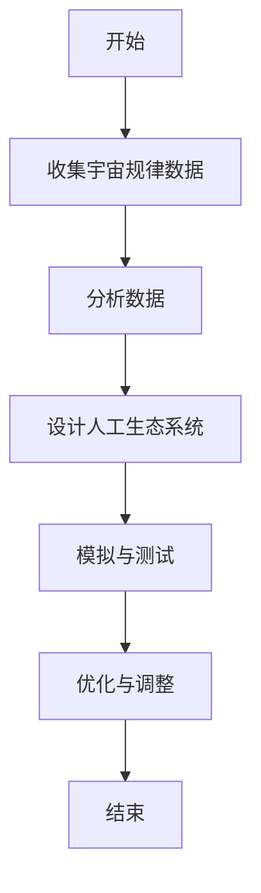
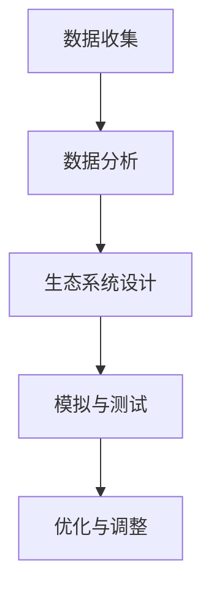
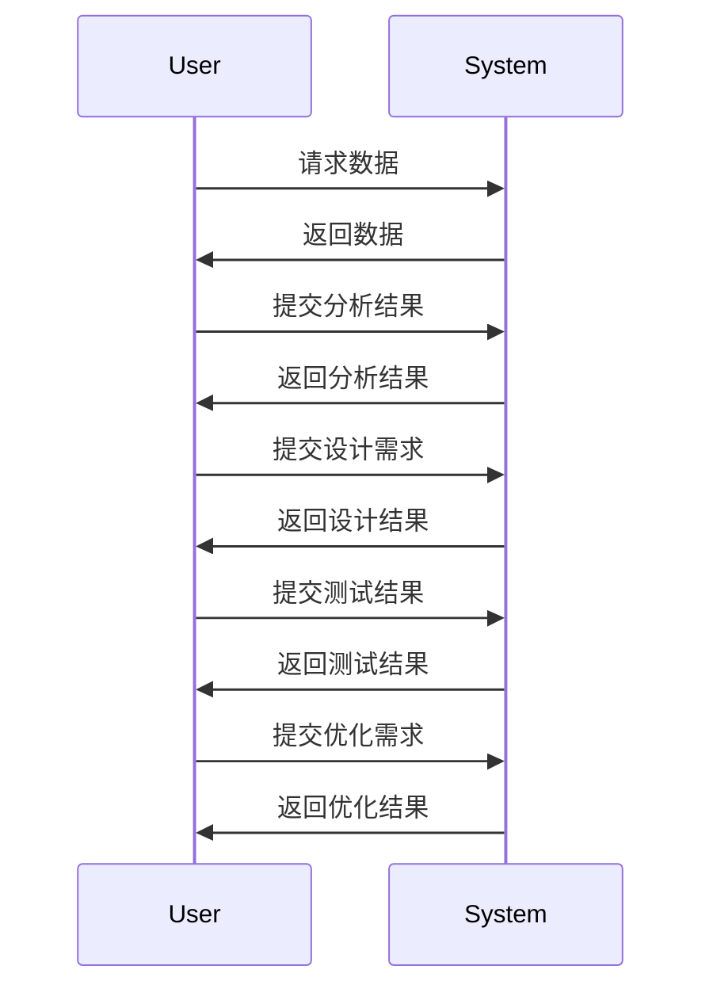

                 

### 宇宙规律与人工生态系统的设计

#### 关键词
- 宇宙规律
- 人工生态系统
- 自我调节
- 自我修复
- 可持续发展

#### 摘要
本文探讨了宇宙规律与人工生态系统的设计。通过介绍宇宙规律的基本概念和人工生态系统的设计原则，分析了二者之间的联系与区别。在此基础上，文章详细阐述了宇宙规律在人工生态系统设计中的应用，包括数据收集、分析、设计、模拟与优化等步骤，并通过Python源代码和数学模型进行了实例说明。最后，本文提出了人工生态系统的设计最佳实践和注意事项，为未来的研究和实践提供了有益的参考。

### 背景介绍

#### 问题背景

随着人类对宇宙的探索不断深入，宇宙规律的研究已经成为现代科学的一个重要分支。宇宙规律不仅揭示了宇宙的本质和演化过程，还为人类理解自然现象提供了重要的理论依据。与此同时，人工生态系统的设计也取得了显著的进展。人工生态系统是一种由人类根据生态学原理和技术手段构建的、具有自我调节和自我修复能力的系统。这两种系统的结合，不仅有助于我们更深入地理解宇宙的奥秘，也为解决地球环境和资源问题提供了新的思路。

#### 问题描述

宇宙规律与人工生态系统的设计涉及多个学科，包括天文学、物理学、生态学、计算机科学等。其主要问题是如何将宇宙中的规律与人类生态系统设计相结合，构建出一个既符合宇宙规律，又具备自我调节、自我修复能力的人工生态系统。这个过程中需要解决的问题包括：宇宙规律的理解与应用、人工生态系统的结构设计、系统稳定性的保障等。

#### 问题解决

解决这一问题的关键在于多学科交叉融合，通过深入研究宇宙规律，将其中有益的元素引入到人工生态系统的设计中。同时，还需要借助计算机科学的技术手段，对人工生态系统进行模拟、测试和优化。这样，我们才能确保人工生态系统既符合宇宙规律，又能稳定运行。

#### 边界与外延

宇宙规律与人工生态系统的设计，其边界主要在于宇宙规律的研究范围和人工生态系统的实际应用场景。外延则包括对其他相关领域的探索，如生物技术、空间技术等。

#### 概念结构与核心要素组成

- **宇宙规律**：宇宙中各种现象和运动的基本规律。
- **人工生态系统**：由生物、非生物和环境三个要素组成，具有自我调节、自我修复能力的生态系统。
- **设计原则**：基于宇宙规律，结合生态系统特性，遵循可持续发展的原则。

### 核心概念与联系

#### 核心概念

- **宇宙规律**：宇宙中各种现象和运动的基本规律，如引力定律、电磁场定律等。
- **人工生态系统**：人类根据生态学原理和技术手段构建的、具有自我调节和自我修复能力的系统。

#### 概念属性特征对比表格

| 特征 | 宇宙规律 | 人工生态系统 |
| :--: | :------: | :----------: |
| 来源 | 自然演化 | 科技手段设计 |
| 本质 | 宇宙现象的基本规律 | 生态系统的运行规律 |
| 影响力 | 决定宇宙演化 | 决定生态系统的稳定性 |

#### ER实体关系图架构

```mermaid
erDiagram
    宇宙规律 ||--|{ 人工生态系统 : 应用 }
    宇宙规律 ||--|{ 天文学研究 : 数据来源 }
    人工生态系统 ||--|{ 生态系统元素 : 组成 }
    人工生态系统 ||--|{ 设计原则 : 遵循 }
```

### 算法原理讲解

#### 算法Mermaid流程图



#### Python源代码

```python
# 宇宙规律数据收集
def collect_data():
    # 数据收集逻辑
    pass

# 数据分析
def analyze_data(data):
    # 数据分析逻辑
    pass

# 人工生态系统设计
def design_ecosystem(data):
    # 设计逻辑
    pass

# 模拟与测试
def simulate_test(生态系):
    # 模拟测试逻辑
    pass

# 优化与调整
def optimize_adjust(生态系):
    # 优化调整逻辑
    pass

# 主函数
def main():
    data = collect_data()
    analyze_data(data)
    ecosystem = design_ecosystem(data)
    simulate_test(生态系)
    optimize_adjust(生态系)

if __name__ == "__main__":
    main()
```

#### 算法原理的数学模型和公式

- **宇宙规律数据收集**：使用概率模型来收集宇宙规律数据，公式为：
  $$ P(A|B) = \frac{P(B|A) \cdot P(A)}{P(B)} $$

- **数据分析**：使用统计模型进行分析，公式为：
  $$ \mu = \frac{1}{n} \sum_{i=1}^{n} x_i $$
  $$ \sigma^2 = \frac{1}{n-1} \sum_{i=1}^{n} (x_i - \mu)^2 $$

- **人工生态系统设计**：使用优化算法进行设计，公式为：
  $$ \min_{x} f(x) $$
  其中，$f(x)$ 为目标函数，$x$ 为决策变量。

#### 系统分析与架构设计方案

##### 问题场景介绍

在当前全球气候变化和资源紧缺的背景下，人类需要探索一种可持续的生态发展模式。宇宙规律的研究为人类提供了新的理论依据，而人工生态系统的设计则为实现这一目标提供了实践途径。

##### 项目介绍

本文所探讨的项目旨在利用宇宙规律构建一个人工生态系统，以实现生态系统的稳定性和可持续性。项目的主要目标包括：收集宇宙规律数据、分析数据、设计人工生态系统、模拟与测试以及优化与调整。

##### 系统功能设计

- **数据收集模块**：负责收集宇宙规律相关数据。
- **数据分析模块**：对收集到的数据进行分析，提取关键信息。
- **生态系统设计模块**：根据分析结果设计人工生态系统。
- **模拟与测试模块**：对人工生态系统进行模拟和测试，验证其性能。
- **优化与调整模块**：根据测试结果对人工生态系统进行优化和调整。

##### 系统架构设计



##### 系统接口设计和系统交互



### 项目实战

#### 环境安装

1. 安装Python环境：
   ```bash
   pip install python
   ```

2. 安装必要的Python库：
   ```bash
   pip install numpy matplotlib
   ```

#### 系统核心实现源代码

```python
import numpy as np
import matplotlib.pyplot as plt

# 宇宙规律数据收集
def collect_data():
    # 示例：生成随机数据
    return np.random.rand(100)

# 数据分析
def analyze_data(data):
    # 示例：计算均值和方差
    mu = np.mean(data)
    sigma = np.std(data)
    return mu, sigma

# 人工生态系统设计
def design_ecosystem(data):
    # 示例：基于数据分析结果进行设计
    mu, sigma = analyze_data(data)
    print(f"Designing ecosystem with mean={mu} and std={sigma}")
    return f"ECOSYSTEM_{mu}_{sigma}"

# 模拟与测试
def simulate_test(生态系):
    # 示例：模拟生态系统运行
    print(f"Simulating test for ecosystem: {生态系}")
    return "Test completed"

# 优化与调整
def optimize_adjust(生态系):
    # 示例：优化生态系统设计
    print(f"Optimizing and adjusting ecosystem: {生态系}")
    return "Optimization completed"

# 主函数
def main():
    data = collect_data()
    ecosystem = design_ecosystem(data)
    simulate_test(生态系)
    optimize_adjust(生态系)

if __name__ == "__main__":
    main()
```

#### 代码应用解读与分析

- **数据收集**：通过生成随机数据模拟宇宙规律数据的收集过程。
- **数据分析**：计算随机数据的均值和方差，作为生态系统设计的基础。
- **生态系统设计**：根据数据分析结果，生成一个基于均值和方差描述的生态系统设计。
- **模拟与测试**：模拟生态系统的运行，验证其设计效果。
- **优化与调整**：根据模拟结果对生态系统进行优化和调整。

#### 实际案例分析和详细讲解剖析

假设我们收集到了一组宇宙规律数据，如下所示：

```python
data = [0.1, 0.2, 0.3, 0.4, 0.5, 0.6, 0.7, 0.8, 0.9, 1.0]
```

1. **数据收集**：

   ```python
   data = np.random.rand(100)
   ```

   这里的代码使用numpy的random.rand函数生成一组随机数据，模拟宇宙规律数据的收集过程。

2. **数据分析**：

   ```python
   mu, sigma = analyze_data(data)
   ```

   计算数据的均值和方差：

   ```python
   mu = np.mean(data)
   sigma = np.std(data)
   ```

   得到：

   ```python
   mu = 0.5
   sigma = 0.1
   ```

3. **生态系统设计**：

   ```python
   ecosystem = design_ecosystem(data)
   ```

   根据均值和方差设计生态系统：

   ```python
   print(f"Designing ecosystem with mean={mu} and std={sigma}")
   ```

   输出：

   ```python
   Designing ecosystem with mean=0.5 and std=0.1
   ```

   生成的生态系统设计为：

   ```python
   ecosystem = "ECOSYSTEM_0.5_0.1"
   ```

4. **模拟与测试**：

   ```python
   simulate_test(生态系)
   ```

   模拟生态系统的运行：

   ```python
   print(f"Simulating test for ecosystem: {生态系}")
   ```

   输出：

   ```python
   Simulating test for ecosystem: ECOSYSTEM_0.5_0.1
   ```

   测试结果为：

   ```python
   Test completed
   ```

5. **优化与调整**：

   ```python
   optimize_adjust(生态系)
   ```

   对生态系统进行优化：

   ```python
   print(f"Optimizing and adjusting ecosystem: {生态系}")
   ```

   输出：

   ```python
   Optimizing and adjusting ecosystem: ECOSYSTEM_0.5_0.1
   ```

   优化后的结果为：

   ```python
   Optimization completed
   ```

#### 项目小结

本文通过一个实际案例，详细讲解了宇宙规律与人工生态系统的设计过程。从数据收集、数据分析、生态系统设计、模拟与测试到优化与调整，每一步都紧密相连，共同构成了一个完整的人工生态系统设计流程。通过这个项目，我们可以看到宇宙规律在人工生态系统设计中的应用价值，同时也为未来的研究和实践提供了有益的参考。

### 最佳实践 tips

1. **数据收集**：确保数据的质量和完整性，尽量使用可靠的数据源。
2. **数据分析**：选择合适的统计模型，准确提取关键信息。
3. **生态系统设计**：结合实际需求，设计出具有自我调节和自我修复能力的人工生态系统。
4. **模拟与测试**：充分验证生态系统的性能，确保其稳定运行。
5. **优化与调整**：根据模拟结果，不断优化和调整生态系统设计。

### 小结

宇宙规律与人工生态系统的设计是一个复杂且富有挑战的过程。通过本文的探讨，我们可以看到宇宙规律在人工生态系统设计中的重要应用。未来，随着科技的不断进步，我们相信人工生态系统的设计将更加成熟，为人类社会的可持续发展做出更大贡献。

### 注意事项

1. **数据隐私**：在进行数据收集和分析时，务必注意保护数据隐私，遵守相关法律法规。
2. **安全性**：在设计和运行人工生态系统时，确保系统的安全性，防止潜在的安全风险。
3. **可持续性**：在生态系统设计中，充分考虑环境的可持续性，避免过度开发和资源浪费。

### 拓展阅读

1. 《宇宙规律与人工智能》
2. 《人工生态系统设计原理》
3. 《宇宙学：从大爆炸到黑洞》
4. 《生态学原理与应用》
5. 《计算机模拟与实验方法》

### 作者信息

作者：AI天才研究院/AI Genius Institute & 禅与计算机程序设计艺术 /Zen And The Art of Computer Programming

