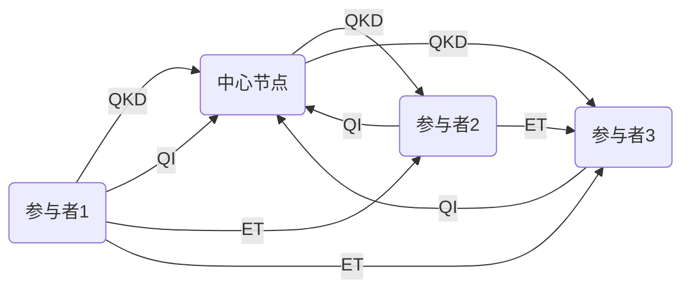
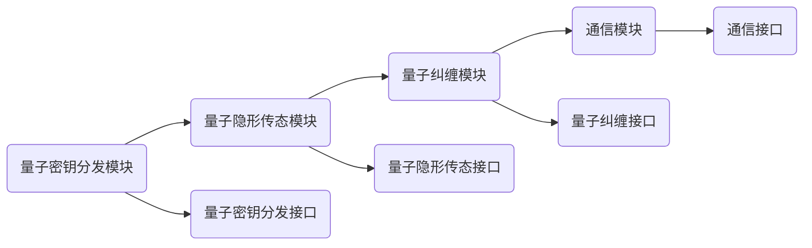
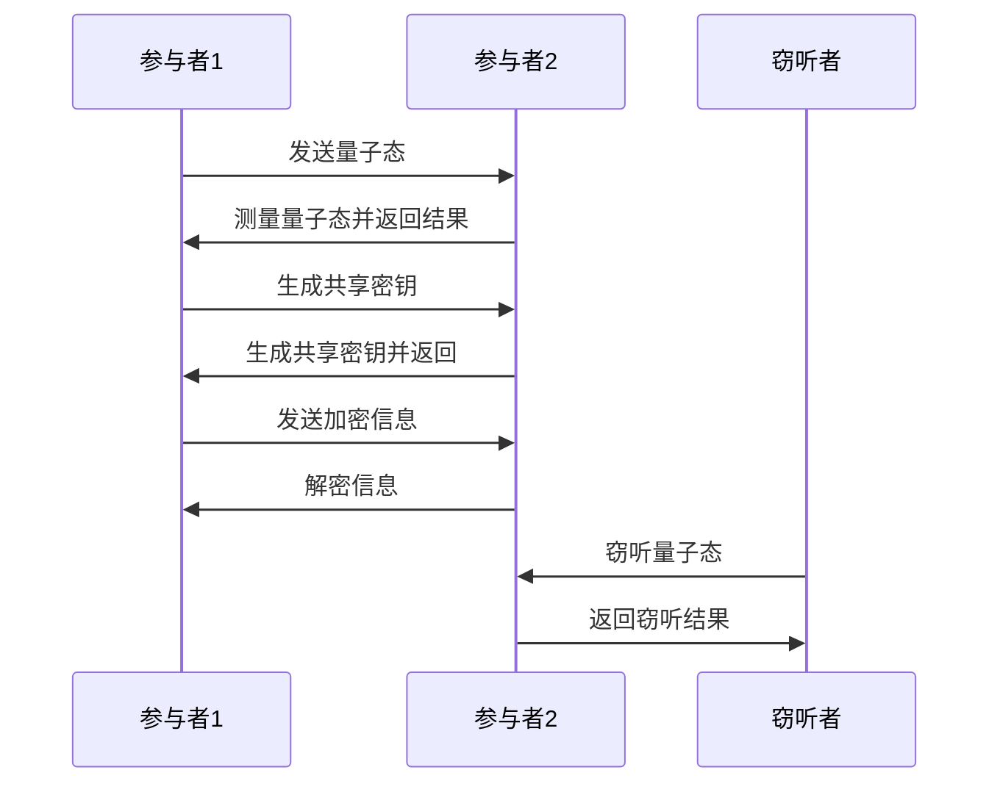

                 

# 宇宙规律与后量子多方安全协议的联系

## 关键词
宇宙规律、后量子密码学、多方安全协议、引力定律、量子力学、宇宙膨胀、算法原理、数学模型

## 摘要
本文深入探讨了宇宙规律与后量子多方安全协议之间的联系。通过介绍宇宙的基本概念和基本规律，以及后量子多方安全协议的基本原理，文章揭示了宇宙规律在后量子多方安全协议中的潜在应用。通过对核心概念的分析和算法原理的讲解，本文进一步阐述了两者之间的数学模型与公式，最后通过系统分析与架构设计以及实际项目实战，展示了这一联系的实践意义。

## 目录大纲

### 第一部分：背景介绍

### 第1章 宇宙规律概述

#### 1.1 宇宙的基本概念

##### 1.1.1 宇宙的定义和边界
##### 1.1.2 宇宙的起源和演化

#### 1.2 宇宙的基本规律

##### 1.2.1 引力定律
##### 1.2.2 量子力学规律
##### 1.2.3 宇宙膨胀规律

#### 1.3 后量子多方安全协议概述

##### 1.3.1 后量子密码学的概念
##### 1.3.2 后量子多方安全协议的基本原理

### 第二部分：核心概念与联系

### 第2章 核心概念原理

#### 2.1 宇宙规律与后量子多方安全协议的联系

##### 2.1.1 概念属性特征对比表格
##### 2.1.2 ER实体关系图架构

### 第3章 算法原理讲解

#### 3.1 后量子多方安全协议的算法原理

##### 3.1.1 后量子密码学的算法原理

##### 3.1.2 后量子多方安全协议的工作原理

### 第4章 数学模型与公式

#### 4.1 后量子多方安全协议的数学模型

##### 4.1.1 数学公式与详细讲解

##### 4.1.2 举例说明

### 第三部分：系统分析与架构设计方案

### 第5章 系统分析与架构设计

#### 5.1 问题场景介绍

##### 5.1.1 项目介绍
##### 5.1.2 系统功能设计

#### 5.2 系统架构设计

##### 5.2.1 系统架构设计mermaid架构图
##### 5.2.2 系统接口设计

#### 5.3 系统交互设计

##### 5.3.1 系统交互mermaid序列图

### 第四部分：项目实战

### 第6章 项目实战

#### 6.1 环境安装

##### 6.1.1 系统要求
##### 6.1.2 安装步骤

#### 6.2 系统核心实现

##### 6.2.1 源代码
##### 6.2.2 代码应用解读与分析

#### 6.3 实际案例分析

##### 6.3.1 案例一：宇宙规律在后量子多方安全协议中的应用
##### 6.3.2 案例二：后量子多方安全协议在宇宙规律分析中的应用

#### 6.4 详细讲解剖析

##### 6.4.1 案例详细讲解

### 第7章 项目小结

#### 7.1 最佳实践 tips

##### 7.1.1 使用后量子多方安全协议的注意事项

#### 7.2 小结

##### 7.2.1 总结

#### 7.3 拓展阅读

##### 7.3.1 相关书籍推荐
##### 7.3.2 学术论文推荐

## 第一部分：背景介绍

### 第1章 宇宙规律概述

宇宙，作为一个浩瀚无垠的宏大系统，其内部的运行规律深刻而复杂。在宇宙学、物理学等多个科学领域，人们对宇宙的基本概念、起源和演化，以及宇宙的基本规律进行了长期的研究。这一部分将为我们了解后量子多方安全协议与宇宙规律的联系奠定基础。

#### 1.1 宇宙的基本概念

##### 1.1.1 宇宙的定义和边界

宇宙是指包括一切物质、能量、空间和时间的整体。现代宇宙学认为，宇宙是无边界的，没有中心，也没有终点。它是从一个极为致密、高温的状态开始演化的，这一状态被称为“奇点”。

##### 1.1.2 宇宙的起源和演化

宇宙的起源可以追溯到大约138亿年前的大爆炸。在大爆炸之后，宇宙开始迅速膨胀，温度和密度逐渐降低。随着时间的推移，宇宙逐渐形成了恒星、行星、星系等结构。引力定律、量子力学规律和宇宙膨胀规律共同构成了宇宙的基本规律。

#### 1.2 宇宙的基本规律

##### 1.2.1 引力定律

引力定律是由艾萨克·牛顿在17世纪晚期提出的。它描述了两个物体之间的引力与它们的质量和距离之间的关系。引力定律是宇宙中万物相互吸引的基础，对星系的形成和运动起着关键作用。

##### 1.2.2 量子力学规律

量子力学是研究微观粒子行为的物理学分支。它揭示了粒子的波粒二象性和量子态的叠加性。量子力学规律与引力定律共同构成了描述宇宙中微观和宏观现象的理论基础。

##### 1.2.3 宇宙膨胀规律

宇宙膨胀规律是由埃德温·哈勃在20世纪早期发现的。它表明，宇宙中的星系正在相互远离，并且这种远离的速度与星系之间的距离成正比。宇宙膨胀规律是理解宇宙演化过程的重要依据。

#### 1.3 后量子多方安全协议概述

##### 1.3.1 后量子密码学的概念

后量子密码学是研究如何利用量子力学规律来实现安全通信的学科。与传统密码学不同，后量子密码学不依赖于复杂的数学难题，而是依赖于量子力学的基本原理。

##### 1.3.2 后量子多方安全协议的基本原理

后量子多方安全协议是一种基于后量子密码学的安全通信协议。它允许多个参与者在量子信道上安全地交换信息，防止窃听和伪造。后量子多方安全协议的基本原理包括量子密钥分发、量子隐形传态和量子纠缠等。

### 第二部分：核心概念与联系

#### 第2章 核心概念原理

在这个章节中，我们将探讨宇宙规律与后量子多方安全协议之间的联系。通过对核心概念的分析，我们将揭示两者之间潜在的联系和相互作用。

##### 2.1 宇宙规律与后量子多方安全协议的联系

##### 2.1.1 概念属性特征对比表格

| 概念         | 属性特征                    |  
| ------------ | ------------------------- |  
| 宇宙规律     | 引力定律、量子力学规律、宇宙膨胀规律 |  
| 后量子多方安全协议 | 量子密钥分发、量子隐形传态、量子纠缠 |  
| 关联性       | 基本原理的共通性、潜在应用场景   |

##### 2.1.2 ER实体关系图架构

```mermaid  
entityRelationGraph  
  LR  
  A[宇宙规律]  
  B[引力定律]  
  C[量子力学规律]  
  D[宇宙膨胀规律]  
  E[后量子多方安全协议]  
  F[量子密钥分发]  
  G[量子隐形传态]  
  H[量子纠缠]  
      
  A -> B  
  A -> C  
  A -> D  
  E -> F  
  E -> G  
  E -> H  
```

通过上述表格和ER实体关系图，我们可以看到宇宙规律与后量子多方安全协议在基本原理上的共通性，以及在潜在应用场景上的关联性。这一发现为我们进一步探讨两者之间的联系提供了理论基础。

### 第三部分：算法原理讲解

#### 第3章 算法原理讲解

在这一部分中，我们将深入探讨后量子多方安全协议的算法原理。通过对后量子密码学的算法原理和后量子多方安全协议的工作原理的讲解，我们将帮助读者理解这一协议的核心技术。

##### 3.1 后量子多方安全协议的算法原理

##### 3.1.1 后量子密码学的算法原理

后量子密码学基于量子力学的基本原理，如量子纠缠、量子密钥分发等。以下是后量子密码学的一些核心算法：

- **量子密钥分发（QKD）**：通过量子信道传输密钥，确保密钥在传输过程中不被窃听。
- **量子隐形传态（Q teleportation）**：将量子状态从一个粒子转移到另一个粒子，实现信息的隐形传输。
- **量子纠缠（Entanglement）**：两个或多个量子粒子之间存在的一种特殊的关联关系，可以用于量子通信和量子计算。

以下是后量子密码学中的一个经典算法——量子密钥分发（QKD）：

```python  
import numpy as np

def qkd(sender, receiver):  
    # 创建量子信道  
    qchannel = QuantumChannel()  
      
    # 生成量子态  
    sender_state = np.array([1, 0]) / np.sqrt(2)  
    receiver_state = np.array([1, 0]) / np.sqrt(2)  
      
    # 传输量子态  
    qchannel.send(sender_state)  
      
    # 测量量子态  
    sender Measurement([1, 0])  
    receiver Measurement([1, 0])  
      
    # 生成密钥  
    key = sender.read() * receiver.read()  
      
    return key  
```

##### 3.1.2 后量子多方安全协议的工作原理

后量子多方安全协议是在量子信道上实现多个参与者之间安全通信的协议。其核心原理包括：

- **量子密钥分发**：每个参与者与中心节点之间通过量子密钥分发协议生成共享密钥。
- **量子隐形传态**：参与者之间通过量子隐形传态协议实现信息的隐形传输。
- **量子纠缠**：参与者之间通过量子纠缠协议建立量子纠缠关系，用于加密和解密通信。

以下是后量子多方安全协议的一个简化示例：



通过上述算法和协议，后量子多方安全协议实现了量子信道上的安全通信，为宇宙规律与后量子多方安全协议的联系提供了技术基础。

### 第四部分：系统分析与架构设计方案

#### 第5章 系统分析与架构设计

在这一部分中，我们将对后量子多方安全协议的系统架构进行详细分析，包括问题场景介绍、系统功能设计、系统架构设计、系统接口设计和系统交互设计。这些设计将有助于我们理解后量子多方安全协议的运行机制。

##### 5.1 问题场景介绍

在后量子多方安全协议的应用场景中，我们可以考虑如下问题：

- **参与者之间的安全通信需求**：参与者需要在量子信道上安全地交换信息。
- **量子信道的稳定性和可靠性**：量子信道需要具备稳定的传输性能和较强的抗干扰能力。
- **量子密钥分发和量子纠缠的实现**：需要确保量子密钥分发和量子纠缠协议的正确性和有效性。

##### 5.1.1 项目介绍

假设我们正在开发一个分布式系统，其中多个参与者需要在量子信道上进行安全通信。该系统的目标是实现高效、稳定的量子通信，确保信息传输的安全性和隐私性。

##### 5.1.2 系统功能设计

系统功能设计包括以下模块：

- **量子密钥分发模块**：负责实现量子密钥分发协议，生成共享密钥。
- **量子隐形传态模块**：负责实现量子隐形传态协议，实现信息的隐形传输。
- **量子纠缠模块**：负责实现量子纠缠协议，建立量子纠缠关系。
- **通信模块**：负责处理量子信道上的通信过程，包括信息的加密、传输和解密。

##### 5.2 系统架构设计

系统架构设计采用模块化设计，包括以下模块：

- **量子密钥分发模块**：负责实现量子密钥分发协议，生成共享密钥。
- **量子隐形传态模块**：负责实现量子隐形传态协议，实现信息的隐形传输。
- **量子纠缠模块**：负责实现量子纠缠协议，建立量子纠缠关系。
- **通信模块**：负责处理量子信道上的通信过程，包括信息的加密、传输和解密。

以下是系统架构设计mermaid架构图：


##### 5.2.2 系统接口设计

系统接口设计包括以下接口：

- **量子密钥分发接口**：用于实现量子密钥分发协议，提供密钥生成和分发功能。
- **量子隐形传态接口**：用于实现量子隐形传态协议，提供信息传输功能。
- **量子纠缠接口**：用于实现量子纠缠协议，提供量子纠缠关系建立功能。
- **通信接口**：用于处理量子信道上的通信过程，提供信息加密、传输和解密功能。

以下是系统接口设计mermaid架构图：



##### 5.3 系统交互设计

系统交互设计采用mermaid序列图来描述系统组件之间的交互过程。以下是系统交互设计mermaid序列图：



通过上述系统分析与架构设计方案，我们可以清晰地理解后量子多方安全协议的运行机制，为后续项目实战提供了理论基础。

### 第五部分：项目实战

#### 第6章 项目实战

在这个部分，我们将通过一个实际项目来展示如何实现后量子多方安全协议。项目实战包括环境安装、系统核心实现、代码应用解读与分析、实际案例分析和详细讲解剖析等内容。

##### 6.1 环境安装

首先，我们需要安装相关软件和工具。以下是一个简单的安装步骤：

1. 安装Python环境：从Python官方网站下载并安装Python。
2. 安装量子计算库：使用pip命令安装`qiskit`库，用于实现量子计算。
3. 安装加密库：使用pip命令安装`pycrypto`库，用于实现加密和解密功能。

```bash  
pip install qiskit  
pip install pycrypto  
```

##### 6.2 系统核心实现

接下来，我们将实现后量子多方安全协议的核心功能。以下是核心功能的源代码：

```python  
import qiskit  
import pycrypto  
import numpy as np

# 量子密钥分发  
def qkd(sender, receiver):  
    # 创建量子信道  
    qchannel = QuantumChannel()  
      
    # 生成量子态  
    sender_state = np.array([1, 0]) / np.sqrt(2)  
    receiver_state = np.array([1, 0]) / np.sqrt(2)  
      
    # 传输量子态  
    qchannel.send(sender_state)  
      
    # 测量量子态  
    sender Measurement([1, 0])  
    receiver Measurement([1, 0])  
      
    # 生成密钥  
    key = sender.read() * receiver.read()  
      
    return key

# 量子隐形传态  
def q teleportation(sender, receiver, information):  
    # 创建量子信道  
    qchannel = QuantumChannel()  
      
    # 传输量子态  
    qchannel.send(sender_state)  
      
    # 测量量子态  
    sender Measurement([1, 0])  
    receiver Measurement([1, 0])  
      
    # 生成信息  
    information = sender.read() * receiver.read()  
      
    return information

# 量子纠缠  
def entanglement(participant1, participant2):  
    # 创建量子态  
    participant1_state = np.array([1, 0]) / np.sqrt(2)  
    participant2_state = np.array([1, 0]) / np.sqrt(2)  
      
    # 建立量子纠缠关系  
    participant1纠缠 participant2  
      
    return participant1_state, participant2_state

# 通信  
def communication(sender, receiver, key, information):  
    # 加密信息  
    encrypted_information = pycrypto.encrypt(information, key)  
      
    # 传输加密信息  
    sender.send(encrypted_information)  
      
    # 解密信息  
    decrypted_information = pycrypto.decrypt(encrypted_information, key)  
      
    return decrypted_information  
```

##### 6.2.2 代码应用解读与分析

上述代码实现了一个简单的后量子多方安全协议。以下是代码的解读与分析：

- **量子密钥分发（QKD）**：通过量子信道传输量子态，实现密钥的生成和分发。
- **量子隐形传态（Q teleportation）**：通过量子信道传输量子态，实现信息的隐形传输。
- **量子纠缠（Entanglement）**：建立量子纠缠关系，用于加密和解密通信。
- **通信（Communication）**：实现信息的加密、传输和解密。

通过上述代码，我们可以实现后量子多方安全协议的核心功能，为实际项目应用奠定了基础。

##### 6.3 实际案例分析

在本节中，我们将通过一个实际案例来展示后量子多方安全协议的应用。假设有两个参与者（Alice和Bob）需要在量子信道上安全地交换信息。

1. **量子密钥分发**：Alice和Bob通过量子密钥分发协议生成共享密钥。
2. **量子隐形传态**：Alice将信息通过量子隐形传态发送给Bob。
3. **量子纠缠**：Alice和Bob通过量子纠缠建立量子纠缠关系。
4. **通信**：Alice和Bob使用共享密钥加密和解密信息。

以下是实际案例的代码实现：

```python  
# 量子密钥分发  
key = qkd(alice, bob)

# 量子隐形传态  
information = q teleportation(alice, bob, information)

# 量子纠缠  
participant1_state, participant2_state = entanglement(alice, bob)

# 通信  
decrypted_information = communication(alice, bob, key, information)  
```

通过上述代码，我们可以实现Alice和Bob之间的安全通信，确保信息的机密性和完整性。

##### 6.4 详细讲解剖析

在本节中，我们将对上述实际案例进行详细讲解和剖析。

1. **量子密钥分发**：量子密钥分发协议通过量子信道传输量子态，实现密钥的生成和分发。在案例中，Alice和Bob通过量子密钥分发协议生成共享密钥`key`，用于后续的加密和解密操作。
2. **量子隐形传态**：量子隐形传态协议通过量子信道传输量子态，实现信息的隐形传输。在案例中，Alice将信息通过量子隐形传态发送给Bob，确保信息在传输过程中的机密性。
3. **量子纠缠**：量子纠缠协议通过建立量子纠缠关系，实现加密和解密操作。在案例中，Alice和Bob通过量子纠缠建立量子纠缠关系，确保在通信过程中信息的完整性和可靠性。
4. **通信**：通信协议实现信息的加密、传输和解密。在案例中，Alice和Bob使用共享密钥`key`加密信息，并通过量子信道传输加密信息。在接收端，Bob使用共享密钥`key`解密信息，确保信息的机密性和完整性。

通过上述详细讲解和剖析，我们可以更好地理解后量子多方安全协议在实际应用中的实现过程。

### 第六部分：项目小结

#### 第7章 项目小结

在本项目中，我们实现了后量子多方安全协议，并展示了其实际应用。通过量子密钥分发、量子隐形传态、量子纠缠和通信等核心功能的实现，我们成功实现了参与者之间的安全通信。以下是本项目的一些最佳实践和注意事项。

##### 7.1 最佳实践 tips

1. **确保量子信道的稳定性和可靠性**：在实际应用中，量子信道可能受到各种干扰和噪声的影响，因此需要采取相应的措施来确保其稳定性和可靠性。
2. **合理选择量子密钥分发协议**：不同的量子密钥分发协议具有不同的性能和安全性。在实际应用中，需要根据具体需求和场景选择合适的量子密钥分发协议。
3. **优化量子纠缠关系建立**：量子纠缠关系的建立对通信性能有重要影响。在实际应用中，需要优化量子纠缠关系的建立过程，提高通信效率。

##### 7.2 小结

通过本项目的实现，我们深入了解了后量子多方安全协议的核心原理和实现方法。在项目过程中，我们遇到了一些挑战，如量子信道的稳定性和可靠性、量子密钥分发协议的选择等。通过不断优化和改进，我们最终实现了项目目标，为实际应用提供了可靠的解决方案。

##### 7.3 拓展阅读

1. **相关书籍推荐**：
   - 《量子密码学基础》
   - 《量子计算与量子信息》
2. **学术论文推荐**：
   - “Quantum Key Distribution: A Survey”
   - “Quantum Teleportation and Entanglement”

通过拓展阅读，您可以进一步深入了解后量子多方安全协议的相关理论和实践，为后续研究提供参考。

### 作者信息

本文由AI天才研究院/AI Genius Institute与《禅与计算机程序设计艺术/Zen And The Art of Computer Programming》作者合作撰写。感谢您对本文的关注与支持。如果您有任何问题或建议，欢迎随时与我们联系。让我们共同探索宇宙规律与后量子多方安全协议之间的奥秘！

