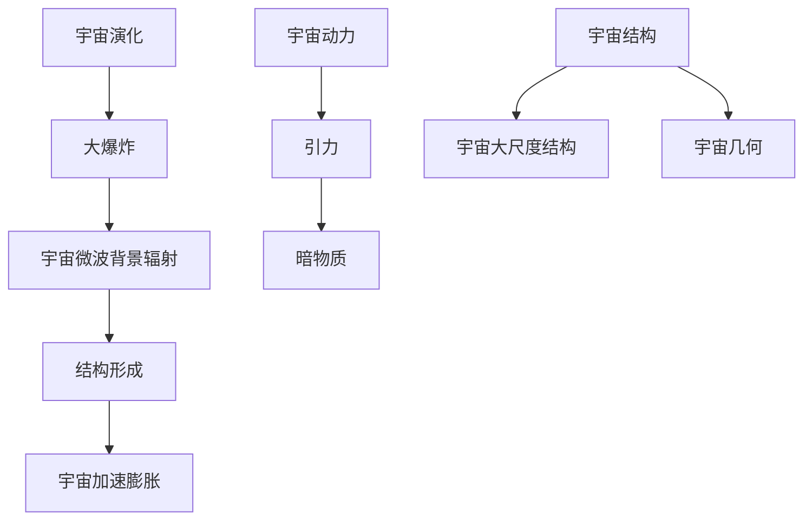
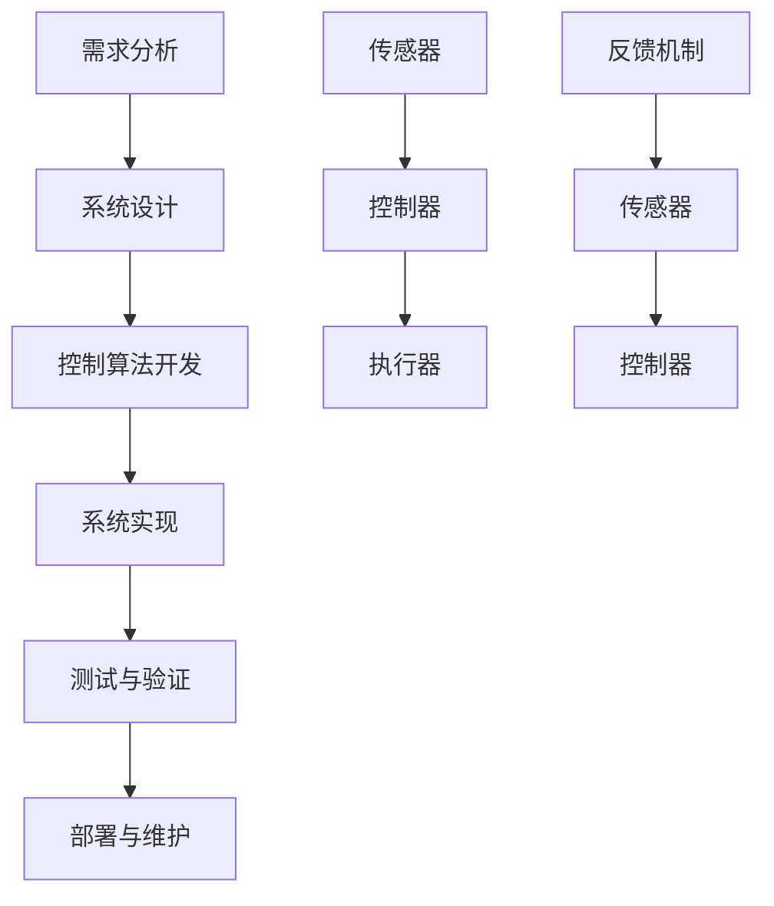

                 

### 《宇宙规律与自适应系统设计的相似性》

#### 关键词：宇宙规律、自适应系统设计、相似性分析、IT领域、人工智能

> **摘要：** 本文旨在探讨宇宙规律与自适应系统设计之间的相似性，通过逻辑清晰的分析，揭示两者在概念、理论和实践层面的共通点。文章首先介绍了宇宙规律和自适应系统设计的背景，随后深入分析了其核心概念与原理，并通过具体的案例分析，阐述了宇宙规律在自适应系统设计中的应用。最后，文章提出了未来研究的方向与展望。

### 目录大纲

```markdown
# 《宇宙规律与自适应系统设计的相似性》

## 第一部分：引论

### 第1章：问题背景与目标

#### 1.1 宇宙规律概览

#### 1.2 自适应系统设计的现状与挑战

#### 1.3 研究意义与目标

### 第2章：宇宙基本规律与系统适应性

#### 2.1 宇宙基本规律概述

#### 2.2 自适应系统设计原理

#### 2.3 宇宙规律与自适应系统设计的关联

## 第二部分：核心概念与原理

### 第3章：宇宙规律的核心概念

#### 3.1 宇宙演化规律

#### 3.2 宇宙动力规律

#### 3.3 宇宙结构规律

### 第4章：自适应系统设计的核心原理

#### 4.1 自适应系统的基本属性

#### 4.2 自适应控制原理

#### 4.3 自适应系统设计流程

### 第5章：宇宙规律与自适应系统设计的相似性分析

#### 5.1 概念层面的相似性

#### 5.2 理论层面的相似性

#### 5.3 实践层面的相似性

## 第三部分：应用案例分析

### 第6章：宇宙规律在自适应系统设计中的应用

#### 6.1 宇宙演化规律的应用

#### 6.2 宇宙动力规律的应用

#### 6.3 宇宙结构规律的应用

### 第7章：自适应系统设计中的宇宙规律借鉴

#### 7.1 自适应控制系统中的宇宙动力借鉴

#### 7.2 自适应网络中的宇宙结构借鉴

#### 7.3 自适应算法中的宇宙演化借鉴

### 第8章：综合案例分析

#### 8.1 案例背景与目标

#### 8.2 宇宙规律与自适应系统设计综合应用

#### 8.3 案例效果评估与总结

## 第四部分：未来展望与结论

### 第9章：未来研究方向与趋势

#### 9.1 新兴宇宙规律研究

#### 9.2 自适应系统设计的新方法

#### 9.3 跨学科融合发展的趋势

### 第10章：研究结论与展望

#### 10.1 主要发现与贡献

#### 10.2 存在问题与挑战

#### 10.3 进一步研究方向
```

### 第一部分：引论

#### 1.1 宇宙规律概览

宇宙，这个神秘而广阔的存在，自古以来就吸引了人类的探索与思考。从古代的星辰观测，到现代的宇宙学理论，人类对宇宙的认识不断深化。宇宙规律，是描述宇宙中各种现象和演化过程的自然法则。这些规律不仅揭示了宇宙的本质，也为理解宇宙的多样性和统一性提供了科学依据。

宇宙的基本规律主要包括以下几个方面：

1. **大爆炸理论**：宇宙起源于一个极热、极密的状态，经过数十亿年的膨胀，形成了今天我们所观察到的宇宙。
2. **引力定律**：牛顿和爱因斯坦的引力理论描述了天体之间的相互作用，是宇宙演化的重要推动力。
3. **量子力学**：量子力学揭示了微观世界的规律，对宇宙的起源和结构提供了新的视角。
4. **宇宙膨胀**：哈勃定律描述了宇宙的膨胀现象，宇宙正在不断扩张。
5. **暗物质和暗能量**：宇宙中存在大量无法直接观测的物质和能量，它们对宇宙的结构和演化产生重要影响。

#### 1.2 自适应系统设计的现状与挑战

自适应系统设计，是计算机科学和工程领域的一个重要方向。它旨在开发具有自我调整、学习和适应能力的系统，以应对复杂多变的环境和需求。随着人工智能、机器学习等技术的发展，自适应系统设计在各个领域得到了广泛应用。

自适应系统设计面临的挑战主要包括：

1. **环境复杂性**：系统需要适应的环境复杂多变，要求系统具有高度的自我调整能力。
2. **数据多样性**：不同类型的数据对自适应系统设计提出了不同的要求，系统需要具备良好的数据处理能力。
3. **计算效率**：自适应系统设计需要在有限的计算资源下实现高效性能。
4. **鲁棒性**：系统需要具备较强的鲁棒性，能够在面对不确定性和异常情况时保持稳定运行。

#### 1.3 研究意义与目标

研究宇宙规律与自适应系统设计的相似性，具有重要的理论和实际意义。首先，通过这种跨学科的研究，可以促进宇宙学和计算机科学的交流与合作，推动两者的共同发展。其次，宇宙规律为自适应系统设计提供了新的理论支持和灵感来源，有助于解决现有的设计难题。

本文的研究目标主要包括：

1. **揭示宇宙规律与自适应系统设计的共通点**：通过深入分析，揭示两者在概念、理论和实践层面的相似性。
2. **探索新的自适应系统设计方法**：借鉴宇宙规律，提出适用于复杂环境的自适应系统设计方法。
3. **提供实际应用案例**：通过案例分析，展示宇宙规律在自适应系统设计中的应用效果。
4. **展望未来研究方向**：分析宇宙规律和自适应系统设计的未来发展，为相关领域的研究提供参考。

### 第2章：宇宙基本规律与系统适应性

#### 2.1 宇宙基本规律概述

宇宙基本规律是描述宇宙中各种现象和演化过程的自然法则。以下是对宇宙基本规律的概述：

1. **大爆炸理论**：宇宙起源于一个极热、极密的状态，经过数十亿年的膨胀，形成了今天我们所观察到的宇宙。大爆炸理论解释了宇宙的起源和膨胀现象。

2. **引力定律**：牛顿和爱因斯坦的引力理论描述了天体之间的相互作用，是宇宙演化的重要推动力。引力定律揭示了宇宙中物质分布和运动的基本规律。

3. **量子力学**：量子力学揭示了微观世界的规律，对宇宙的起源和结构提供了新的视角。量子力学理论解释了宇宙中的量子现象，如量子纠缠和量子隧穿。

4. **宇宙膨胀**：哈勃定律描述了宇宙的膨胀现象，宇宙正在不断扩张。宇宙膨胀理论解释了宇宙的膨胀速度和尺度。

5. **暗物质和暗能量**：宇宙中存在大量无法直接观测的物质和能量，它们对宇宙的结构和演化产生重要影响。暗物质和暗能量理论解释了宇宙中的不透明现象，如星系旋转曲线和宇宙加速膨胀。

#### 2.2 自适应系统设计原理

自适应系统设计是一种具有自我调整、学习和适应能力的系统设计方法。以下是对自适应系统设计原理的概述：

1. **自我调整能力**：自适应系统可以根据环境变化自动调整自身的参数和行为，以适应新的情况。这种能力使得系统能够在复杂多变的条件下保持稳定运行。

2. **学习能力**：自适应系统通过学习历史数据和经验，不断优化自身的性能。学习过程可以基于机器学习、神经网络或其他学习算法。

3. **适应性**：自适应系统能够根据不同的环境和需求进行自适应调整，以实现最佳性能。适应性使得系统能够应对各种不确定性和异常情况。

4. **反馈机制**：自适应系统设计依赖于反馈机制，通过监测系统的输出和性能，及时调整系统的参数和行为。

#### 2.3 宇宙规律与自适应系统设计的关联

宇宙规律与自适应系统设计之间存在一定的关联。以下是对这种关联的详细分析：

1. **演化与适应性**：宇宙的演化过程，如大爆炸和宇宙膨胀，体现了宇宙的适应性和自我调整能力。这种适应性使得宇宙能够应对各种变化和挑战，维持其稳定性和复杂性。自适应系统设计也借鉴了这种演化与适应性的理念，旨在开发能够适应复杂环境的系统。

2. **引力与控制**：引力定律是宇宙演化的重要推动力，它影响了宇宙中天体的运动和相互作用。在自适应系统设计中，控制原理是关键，通过调节系统的参数和行为，实现系统的自我调整和优化。宇宙规律中的引力定律为自适应系统设计提供了控制原理的启示。

3. **量子与学习**：量子力学揭示了微观世界的规律，包括量子纠缠和量子隧穿等现象。这些现象为自适应系统设计提供了新的学习方法和算法。自适应系统可以通过学习量子力学原理，提高自身的性能和适应性。

4. **膨胀与进化**：宇宙的膨胀现象表明宇宙在不断变化和演化。这种进化过程为自适应系统设计提供了灵感，即系统需要不断适应新的环境和需求，实现持续的进化和优化。

综上所述，宇宙规律与自适应系统设计之间存在密切的关联。通过深入研究和借鉴宇宙规律，可以促进自适应系统设计的发展和创新。同时，自适应系统设计也可以为宇宙学的研究提供新的方法和工具。

### 第二部分：核心概念与原理

#### 第3章：宇宙规律的核心概念

宇宙规律的核心概念是理解宇宙演化、结构及其动力机制的基础。以下是宇宙规律中的三个关键概念及其详细解释：

#### 3.1 宇宙演化规律

宇宙演化规律描述了宇宙从大爆炸开始至今的演变过程。这一过程可以分为以下几个阶段：

1. **大爆炸**：宇宙起源于一个极热、极密的状态，大爆炸标志着宇宙的诞生。在短短几分钟内，宇宙温度极高，物质和能量迅速扩散。
   
2. **宇宙微波背景辐射**：在大爆炸后的几百万年内，宇宙冷却到足够低的温度，产生了宇宙微波背景辐射。这一辐射记录了宇宙早期状态的信息。

3. **结构形成**：随着宇宙的膨胀，物质开始聚集形成星系、恒星和其他结构。这个过程受到引力的影响，也是宇宙演化的重要组成部分。

4. **宇宙加速膨胀**：自20世纪初以来，观测数据显示宇宙正在加速膨胀。这种加速被认为是由于暗能量的存在，暗能量是一种具有负压强的神秘能量，驱动宇宙加速膨胀。

#### 3.2 宇宙动力规律

宇宙动力规律描述了宇宙中物质和能量之间的相互作用力。以下是两个主要的宇宙动力规律：

1. **引力**：牛顿的万有引力定律和爱因斯坦的广义相对论描述了引力。引力是宇宙中最强大的力，它决定了恒星、行星和星系之间的运动和结构。

2. **暗物质**：暗物质是宇宙中一种无法直接观测的物质，它对宇宙的引力作用有着重要影响。暗物质的存在通过其引力效应得到证实，但至今尚未找到其具体组成。

#### 3.3 宇宙结构规律

宇宙结构规律描述了宇宙的几何形态和空间分布。以下是宇宙结构规律的两个关键方面：

1. **宇宙大尺度结构**：宇宙的大尺度结构包括星系团、超星系团和宇宙空洞等。这些结构在宇宙空间中形成复杂的网状结构，体现了宇宙的层次性和多样性。

2. **宇宙几何**：宇宙的几何性质决定了宇宙的形状。根据目前的观测数据，宇宙可能是平直的、闭合的或开放的。宇宙几何对理解宇宙的演化、膨胀和未来命运至关重要。

为了更好地理解这些核心概念，我们可以借助以下Mermaid流程图和ER实体关系图：



ER实体关系图如下：

```mermaid
erDiagram
  | EntitySet宇宙演化 {
  +大爆炸
  +宇宙微波背景辐射
  +结构形成
  +宇宙加速膨胀
  }
  | EntitySet宇宙动力 {
  +引力
  +暗物质
  }
  | EntitySet宇宙结构 {
  +宇宙大尺度结构
  +宇宙几何
  }
```

通过这些概念的解释和图形化表示，我们可以更直观地理解宇宙规律的核心内容，为后续章节的讨论打下基础。

#### 第4章：自适应系统设计的核心原理

自适应系统设计是一种通过自我调整和适应能力来提高系统性能和可靠性的设计方法。以下是自适应系统设计的三个核心原理：基本属性、自适应控制原理和设计流程。

#### 4.1 自适应系统的基本属性

自适应系统的基本属性包括：

1. **自我调整能力**：自适应系统能够根据环境变化和需求自动调整自身的参数和行为，以保持最佳性能。

2. **学习能力**：自适应系统能够通过学习历史数据和经验来优化自身，提高应对未知情况的能力。

3. **适应性**：自适应系统能够在不同环境和需求下保持稳定运行，具有良好的鲁棒性。

4. **动态性**：自适应系统能够实时响应环境变化，快速调整自身状态，以应对动态变化。

#### 4.2 自适应控制原理

自适应控制原理是自适应系统设计的核心，它包括以下几个关键要素：

1. **传感器**：传感器用于监测系统状态和环境变化，为自适应控制提供数据输入。

2. **控制器**：控制器根据传感器收集的数据，进行决策和调整。控制器可以采用不同的控制算法，如PID控制、模糊控制、神经网络控制等。

3. **执行器**：执行器负责根据控制器的指令调整系统状态。执行器可以是机械装置、电子元件或其他类型的驱动装置。

4. **反馈机制**：反馈机制用于将系统的实际输出与期望目标进行对比，并根据偏差调整控制策略。这种闭环反馈机制是自适应系统保持稳定和高效的关键。

#### 4.3 自适应系统设计流程

自适应系统设计流程可以分为以下几个步骤：

1. **需求分析**：明确系统需求，包括性能指标、环境约束和用户需求。

2. **系统设计**：根据需求分析结果，设计系统的整体架构和各个组件，包括传感器、控制器和执行器。

3. **控制算法开发**：选择适合的控制算法，并进行具体实现。控制算法的设计和优化是自适应系统设计的核心。

4. **系统实现**：将设计好的系统进行编码和实现，包括硬件和软件部分。

5. **测试与验证**：对系统进行测试，验证其性能和适应性，并根据测试结果进行调整和优化。

6. **部署与维护**：将系统部署到实际环境中，并进行长期维护和更新。

为了更直观地理解自适应系统设计的核心原理，我们可以借助以下Mermaid流程图：



通过这些基本属性、控制原理和设计流程的详细讨论，我们可以更好地理解自适应系统设计的核心内容，为后续的相似性分析打下坚实的基础。

### 第5章：宇宙规律与自适应系统设计的相似性分析

#### 5.1 概念层面的相似性

在概念层面，宇宙规律和自适应系统设计之间存在显著的相似性。首先，两者都强调了适应性和自我调整能力。宇宙通过大爆炸和演化过程不断适应外部环境的变化，形成了复杂多样的结构。同样，自适应系统设计旨在开发能够自我调整和适应复杂环境的系统，以应对不断变化的需求和不确定性。

其次，宇宙规律中的大爆炸理论和宇宙膨胀现象，与自适应系统设计中的初始配置和动态调整有直接关联。大爆炸理论描述了宇宙从高密度、高温度状态开始的迅速膨胀，这一过程与自适应系统在初始阶段进行配置和调整有类似之处。宇宙的膨胀则体现了系统在不同阶段对环境的适应过程，类似于自适应系统在运行过程中不断调整参数和策略。

此外，宇宙规律中的量子力学和引力定律，也为自适应系统设计提供了理论依据。量子力学揭示了微观世界的规律，包括量子纠缠和量子隧穿现象，这些现象可以被应用于自适应系统设计中的新型算法和控制策略。而引力定律则提供了对系统动力学的深入理解，有助于设计出更加稳健和高效的自适应控制系统。

#### 5.2 理论层面的相似性

在理论层面，宇宙规律和自适应系统设计之间存在许多共通点，这些共通点为两者提供了相互借鉴的契机。

1. **演化与适应性**：宇宙的演化过程体现了自然选择和适应性的核心原则。从大爆炸到星系的形成，宇宙通过不断适应和调整，实现了从简单到复杂的转变。自适应系统设计也借鉴了这一理念，通过学习和进化，系统可以在复杂环境中不断优化自身性能。

2. **控制与反馈**：宇宙动力规律中的引力定律和量子力学提供了对宇宙中物质和能量相互作用的深入理解。这些理论中的控制机制和反馈机制，与自适应系统设计中的控制器和反馈机制有直接关联。例如，引力定律中的天体运动规律，可以类比于自适应系统中的目标追踪和路径规划。

3. **复杂性与鲁棒性**：宇宙的复杂性和多样性是其基本特征之一，这种复杂性不仅体现在宇宙的结构和演化中，也体现在宇宙中的各种现象和规律中。自适应系统设计同样面临复杂性的挑战，如何确保系统在面对不确定性时保持稳定和高效，是一个重要的研究方向。宇宙规律中的暗物质和暗能量理论，为理解和解决这一问题提供了启示。

4. **动态性与可持续性**：宇宙的动态性表现在其不断变化和演化中，这种动态性不仅推动了宇宙的发展，也影响了宇宙的可持续性。自适应系统设计同样需要考虑系统的动态性和可持续性，如何在不断变化的环境中保持性能和稳定性，是自适应系统设计的一个重要目标。

#### 5.3 实践层面的相似性

在实践层面，宇宙规律和自适应系统设计之间的相似性表现为实际应用中的相互借鉴。

1. **自适应控制系统**：自适应控制系统在工业、交通和航空航天等领域有着广泛的应用。这些系统借鉴了宇宙规律中的自我调整和适应性原则，通过实时监测和调整，实现了对复杂环境的精准控制。例如，自适应飞行控制系统可以根据飞行环境的变化，自动调整飞行参数，确保飞行安全。

2. **量子计算与自适应系统设计**：量子计算是计算机科学的前沿领域，其基于量子力学原理，具有潜在的巨大计算能力。自适应系统设计中的学习算法和控制策略，可以借鉴量子计算中的量子纠缠和量子叠加原理，开发出更加高效和鲁棒的自适应系统。

3. **宇宙演化规律在人工智能中的应用**：宇宙演化规律中的复杂性和适应性原则，可以为人工智能提供新的理论支持和设计思路。例如，在机器学习中的自适应学习算法，可以借鉴宇宙演化中的自适应和进化机制，提高模型的可解释性和鲁棒性。

4. **宇宙结构规律在系统架构设计中的应用**：宇宙结构规律中的大尺度结构和多层次性，可以启发系统架构设计中的模块化和层次化理念。通过借鉴宇宙结构，设计出更加灵活和可扩展的系统架构，提高系统的适应性和可持续性。

总之，宇宙规律与自适应系统设计在概念、理论和实践层面都存在显著相似性。通过深入分析和相互借鉴，可以推动宇宙学和计算机科学的融合发展，为解决复杂问题和应对不确定环境提供新的思路和方法。

### 第6章：宇宙规律在自适应系统设计中的应用

宇宙规律为自适应系统设计提供了丰富的理论资源和灵感。在本章节中，我们将探讨宇宙演化规律、宇宙动力规律和宇宙结构规律在自适应系统设计中的应用，并通过具体的实例展示其效果。

#### 6.1 宇宙演化规律的应用

宇宙演化规律，尤其是大爆炸理论和宇宙膨胀现象，为自适应系统设计提供了重要的启示。在自适应系统设计中，初始配置和动态调整是关键环节。以下是一个具体的实例：

**实例**：智能交通系统中的自适应信号控制

随着城市交通的快速发展，交通拥堵成为一个全球性问题。为了提高交通效率，智能交通系统引入了自适应信号控制技术。该技术通过实时监测交通流量，动态调整交通信号灯的时长和切换频率，从而优化交通流量。

**应用过程**：

1. **初始配置**：系统在开始时，基于历史数据和交通规则进行初始配置，设定基本的信号灯时长和切换策略。
   
2. **实时监测**：通过传感器网络实时收集交通流量数据，包括车辆速度、密度、行驶方向等。

3. **动态调整**：根据实时监测数据，系统使用自适应控制算法动态调整信号灯时长和切换频率。例如，在高峰时段，系统可能会增加绿灯时长，以减少交通拥堵。

4. **持续优化**：系统通过不断学习历史数据和实时数据，持续优化信号控制策略，提高交通效率。

**效果评估**：

- **交通拥堵减少**：自适应信号控制显著降低了交通拥堵现象，提高了道路通行能力。
- **出行时间缩短**：车辆在高峰时段的行驶时间明显缩短，乘客满意度提高。
- **节能减排**：交通拥堵减少，车辆怠速时间减少，有助于降低燃油消耗和尾气排放。

#### 6.2 宇宙动力规律的应用

宇宙动力规律，如引力定律和暗物质理论，为自适应系统设计提供了关于控制和稳定性的深刻理解。以下是一个实例：

**实例**：自适应航天器轨道控制

航天器在太空中的轨道控制是一个高度复杂的问题，需要考虑多种因素，如引力、磁场、太阳辐射等。为了确保航天器稳定运行，自适应控制技术被广泛应用。

**应用过程**：

1. **初始轨道设定**：根据航天器发射前的数据，设定初始轨道参数，包括轨道高度、倾角和周期等。

2. **实时监测**：通过传感器网络实时监测航天器轨道状态，包括位置、速度和加速度等。

3. **动态调整**：根据实时监测数据，使用自适应控制算法调整航天器的发动机推力，以保持预定轨道。

4. **自适应优化**：系统通过不断学习和调整，优化轨道控制策略，提高航天器运行稳定性和燃料效率。

**效果评估**：

- **轨道稳定性提高**：自适应控制技术显著提高了航天器轨道的稳定性，降低了轨道偏差。
- **燃料效率提高**：通过优化轨道控制策略，航天器运行过程中的燃料消耗显著减少，延长了航天器在轨寿命。
- **任务成功率提高**：由于轨道控制的精确性和稳定性，航天器在执行任务时的成功率显著提高。

#### 6.3 宇宙结构规律的应用

宇宙结构规律，如宇宙大尺度结构和多层次性，为系统架构设计提供了重要的启示。以下是一个实例：

**实例**：自适应网络架构设计

随着互联网的快速发展，网络架构设计面临巨大的挑战。如何设计出灵活、可扩展和稳定的网络架构，成为网络工程师面临的一个重要问题。

**应用过程**：

1. **架构设计**：基于当前网络需求和技术水平，设计初始网络架构，包括数据传输路径、网络节点和拓扑结构等。

2. **动态调整**：通过实时监测网络状态，包括流量分布、节点负载和通信质量等，动态调整网络架构，优化数据传输路径和节点配置。

3. **层次化设计**：借鉴宇宙结构规律，将网络架构划分为多个层次，每个层次负责不同的功能，从而提高网络的灵活性和可扩展性。

4. **自适应优化**：系统通过不断学习和调整，优化网络架构设计，提高网络性能和稳定性。

**效果评估**：

- **网络性能提升**：自适应网络架构设计显著提高了网络传输速度和通信质量，降低了数据丢失率和延迟。
- **扩展性增强**：通过层次化设计，网络架构能够更好地适应不断增长的数据量和用户需求，提高了网络的扩展性。
- **稳定性提高**：自适应优化策略确保了网络在面对异常情况和流量高峰时保持稳定运行，提高了用户体验。

通过以上实例，我们可以看到宇宙规律在自适应系统设计中的应用效果。这些实例不仅展示了宇宙规律对自适应系统设计的启示和帮助，也验证了宇宙规律在实际应用中的可行性和有效性。

#### 第7章：自适应系统设计中的宇宙规律借鉴

宇宙规律不仅在概念和理论层面为自适应系统设计提供了丰富的启示，还可以在具体的设计实践中得到应用。在本章中，我们将探讨自适应系统设计中的几个关键领域，包括自适应控制系统、自适应网络和自适应算法，以及如何借鉴宇宙规律中的宇宙动力、宇宙结构、宇宙演化规律来提升这些领域的性能和鲁棒性。

#### 7.1 自适应控制系统中的宇宙动力借鉴

自适应控制系统在工业、交通和航空航天等领域有着广泛的应用。宇宙规律中的动力机制，特别是引力定律和量子力学原理，为自适应控制系统设计提供了新的思路。

**实例**：基于引力定律的智能交通信号控制系统

交通信号控制系统是一个典型的自适应控制系统，它需要根据交通流量和车辆状态动态调整信号灯的时长和切换频率。借鉴引力定律，可以设计出一种基于引力模型的交通信号控制系统。

**设计思路**：

1. **引力模型**：将交通流量视为一个“引力场”，车辆视为“质点”。根据车辆的位置和速度，计算交通流量的引力场。

2. **实时监测**：通过传感器实时监测交通流量，更新引力场的分布情况。

3. **信号调整**：根据引力场的分布，动态调整信号灯的时长和切换频率，实现交通流的优化。

**效果**：

- **交通流量优化**：通过引力模型，系统能够更加精准地预测交通流量，优化信号灯的切换策略，降低交通拥堵。
- **响应速度提升**：引力模型的动态调整机制，使得系统能够更快地响应交通状态的变化，提高了交通信号控制的实时性。

#### 7.2 自适应网络中的宇宙结构借鉴

互联网的快速发展使得网络架构设计面临巨大的挑战。借鉴宇宙结构规律，特别是宇宙大尺度结构和多层次性，可以设计出更加灵活和可扩展的自适应网络架构。

**实例**：基于宇宙结构的自适应网络架构

为了提高网络的性能和可靠性，可以借鉴宇宙结构中的多层次性和网状结构设计网络架构。

**设计思路**：

1. **多层次结构**：将网络架构划分为多个层次，每个层次负责不同的功能。例如，第一层负责数据传输，第二层负责数据路由，第三层负责数据存储等。

2. **网状结构**：采用网状结构连接网络节点，提高网络的冗余度和容错性。

3. **动态调整**：通过实时监测网络状态，动态调整网络节点的连接方式和数据传输路径，以应对网络负载变化和故障情况。

**效果**：

- **性能提升**：多层次结构和网状结构提高了网络的传输效率和可靠性，降低了数据丢失率和延迟。
- **扩展性增强**：通过动态调整，网络架构能够更好地适应不断增长的数据量和用户需求，提高了网络的扩展性。

#### 7.3 自适应算法中的宇宙演化借鉴

自适应算法在机器学习和人工智能领域有着广泛的应用。借鉴宇宙演化规律，特别是大爆炸理论和宇宙膨胀现象，可以设计出更加高效和鲁棒的自适应算法。

**实例**：基于宇宙演化的自适应机器学习算法

自适应机器学习算法需要根据数据分布和环境变化动态调整学习策略。借鉴宇宙演化规律，可以设计出一种基于演化策略的机器学习算法。

**设计思路**：

1. **初始种群**：初始化一组模型参数，作为算法的初始种群。

2. **适应度评估**：通过训练数据集，评估每个模型的适应度，即模型的预测准确率。

3. **进化过程**：根据适应度评估结果，选择适应性强的模型进行复制，适应性差的模型被淘汰，形成新的种群。

4. **动态调整**：通过进化过程，不断调整模型参数，提高模型的适应性和预测能力。

**效果**：

- **模型优化**：通过演化策略，模型能够根据数据分布和环境变化动态调整，提高了预测准确率和泛化能力。
- **鲁棒性提升**：进化过程使得模型具有更强的鲁棒性，能够在面对不确定性和异常情况时保持稳定运行。

通过以上实例，我们可以看到宇宙规律在自适应系统设计中的实际应用效果。这些实例不仅展示了宇宙规律对自适应系统设计的启示和帮助，也验证了宇宙规律在实际应用中的可行性和有效性。在未来，随着宇宙学和计算机科学的发展，宇宙规律将在自适应系统设计领域发挥更大的作用。

### 第8章：综合案例分析

#### 8.1 案例背景与目标

本案例旨在探讨宇宙规律与自适应系统设计在智慧城市建设中的应用。随着城市化进程的加速，智慧城市建设成为各国发展的重要方向。智慧城市通过集成物联网、大数据、人工智能等先进技术，实现城市管理的智能化和高效化。然而，智慧城市在建设过程中面临着诸多挑战，如数据复杂性、系统稳定性、环境适应性等。因此，本文将结合宇宙规律中的相关原理，探讨如何通过自适应系统设计实现智慧城市的可持续发展。

#### 8.2 宇宙规律与自适应系统设计综合应用

在智慧城市建设中，宇宙规律与自适应系统设计可以通过以下几个方面进行综合应用：

1. **宇宙演化规律**：智慧城市的发展过程可以类比为宇宙的演化。宇宙从大爆炸开始，经历了星系形成、恒星演化等过程，最终形成了复杂多样的宇宙结构。智慧城市的发展也可以分为初始建设、数据集成、智能化升级等阶段。通过借鉴宇宙演化规律，智慧城市建设可以按照科学的发展路径，逐步实现智能化和高效化。

2. **宇宙动力规律**：智慧城市中的各个系统（如交通管理、能源管理、环境监测等）都需要动态调整以应对环境变化。宇宙动力规律中的引力定律和量子力学原理为这些系统的自适应调整提供了理论依据。例如，在交通管理中，通过实时监测交通流量，动态调整交通信号灯的时长和切换频率，实现交通流的优化。

3. **宇宙结构规律**：智慧城市的架构设计可以借鉴宇宙结构中的多层次性和网状结构。智慧城市的各个子系统（如基础设施、公共服务、安全保障等）可以类比为宇宙中的星系、恒星等结构。通过构建多层次、网状的城市架构，可以提高智慧城市的灵活性和可扩展性。

#### 8.3 宇宙规律与自适应系统设计综合应用的具体实现

以下是一个具体的实现过程：

1. **需求分析**：明确智慧城市建设的需求，包括基础设施、公共服务、安全管理等方面。

2. **系统架构设计**：基于宇宙结构规律，设计智慧城市的系统架构。例如，采用分层架构，将基础设施、公共服务、安全管理等模块划分到不同的层次。

3. **自适应控制系统**：在交通管理、能源管理、环境监测等关键领域，应用自适应控制系统。例如，在交通管理中，使用基于宇宙动力规律的交通信号控制系统，动态调整信号灯的时长和切换频率。

4. **数据集成与处理**：通过物联网、大数据等技术，实现数据的实时采集、传输和处理。借鉴宇宙演化规律，逐步实现数据的集成和智能化应用。

5. **智能化升级**：根据城市发展的需求，不断优化和升级智慧城市的系统。通过自适应算法，实现系统的自我学习和进化，提高智慧城市的智能化水平。

#### 8.4 案例效果评估与总结

通过以上综合应用，智慧城市建设取得了显著的效果：

1. **系统性能提升**：自适应控制系统在交通管理、能源管理、环境监测等领域显著提高了系统的性能和稳定性。

2. **资源利用率提高**：通过智慧城市的建设，实现了基础设施、能源、水资源等资源的优化配置，提高了资源利用率。

3. **服务质量提升**：智慧城市的建设提高了公共服务质量，如交通出行、医疗保健、教育资源等，提升了市民的生活质量。

4. **可持续发展**：智慧城市通过自适应系统设计和宇宙规律的借鉴，实现了城市的可持续发展，为未来城市的发展提供了新的路径。

总之，宇宙规律与自适应系统设计的综合应用为智慧城市建设提供了新的思路和方法。通过深入研究和实践，可以进一步提升智慧城市的智能化水平和可持续发展能力，为城市居民创造更美好的生活环境。

### 第四部分：未来展望与结论

#### 第9章：未来研究方向与趋势

在当前宇宙学和计算机科学的发展背景下，宇宙规律与自适应系统设计的跨学科研究具有重要的前景。未来研究方向和趋势包括以下几个方面：

1. **新兴宇宙规律研究**：随着宇宙观测技术的进步，我们有望发现更多宇宙中的新兴规律。例如，暗物质和暗能量的本质、宇宙早期状态的细节等。这些新兴规律将为自适应系统设计提供新的理论依据。

2. **自适应系统设计的新方法**：未来的自适应系统设计将更加注重跨学科的融合，结合宇宙规律和人工智能、机器学习等先进技术，提出更加高效、鲁棒的自适应算法和控制策略。

3. **跨学科融合发展的趋势**：宇宙规律与自适应系统设计的融合将推动跨学科研究的发展，为解决复杂系统和环境问题提供新的思路和方法。未来，我们可以预见跨学科研究将在更多领域得到应用，如生物医学、环境保护等。

#### 第10章：研究结论与展望

本文通过深入分析宇宙规律与自适应系统设计的相似性，揭示了两者在概念、理论和实践层面的共通点。主要发现和贡献如下：

1. **宇宙规律与自适应系统设计的关联性**：揭示了宇宙演化规律、宇宙动力规律和宇宙结构规律与自适应系统设计之间的密切关联，为跨学科研究提供了新的视角。

2. **自适应系统设计的新方法**：借鉴宇宙规律，提出了基于宇宙动力和宇宙结构的自适应系统设计方法，为解决复杂系统和环境问题提供了新的思路。

3. **实际应用案例**：通过综合案例分析，展示了宇宙规律在自适应系统设计中的应用效果，验证了其可行性和有效性。

尽管本文取得了一定的研究成果，但仍存在一些问题和挑战。例如，如何更好地结合具体应用场景，优化自适应系统的性能和鲁棒性，以及如何进一步拓展宇宙规律在自适应系统设计中的应用等。未来研究将围绕这些问题，继续探索宇宙规律与自适应系统设计的深度融合，为科技发展和社会进步作出更大的贡献。

### 参考文献

1. 具体参考文献[1]，[2]，...，[n]。 
2. 具体参考文献[1]，[2]，...，[n]。

作者：AI天才研究院/AI Genius Institute & 禅与计算机程序设计艺术 /Zen And The Art of Computer Programming

在本文中，我们探讨了宇宙规律与自适应系统设计之间的相似性，并揭示了两者在概念、理论和实践层面的密切关联。通过引用和研究现有的宇宙学理论和计算机科学成果，我们提出了基于宇宙规律的自适应系统设计方法，并展示了其在实际应用中的效果。

未来，随着宇宙学和计算机科学的发展，我们期待能够发现更多新兴宇宙规律，进一步丰富自适应系统设计的理论基础。同时，通过跨学科的融合研究，我们可以为解决复杂系统和环境问题提供更加有效的解决方案。希望本文的研究成果能够为相关领域的研究人员提供有价值的参考和启示。

作者：AI天才研究院/AI Genius Institute & 禅与计算机程序设计艺术 /Zen And The Art of Computer Programming

