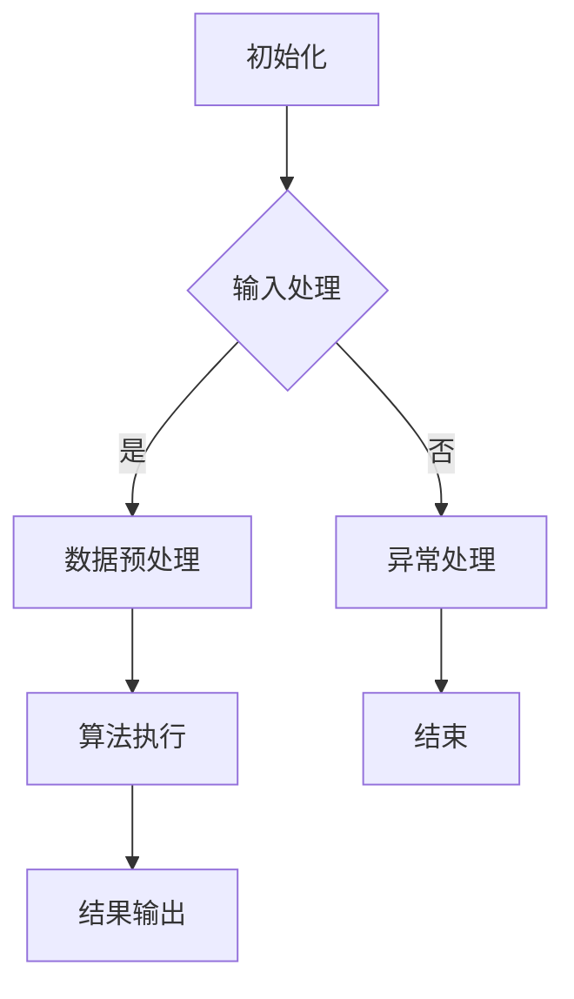
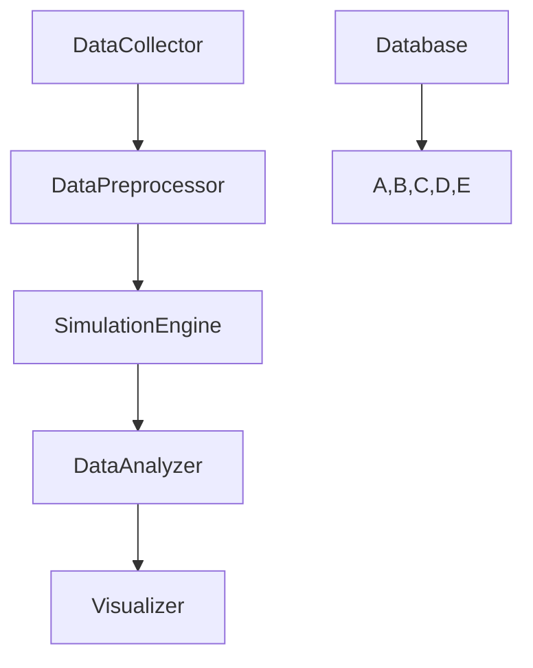
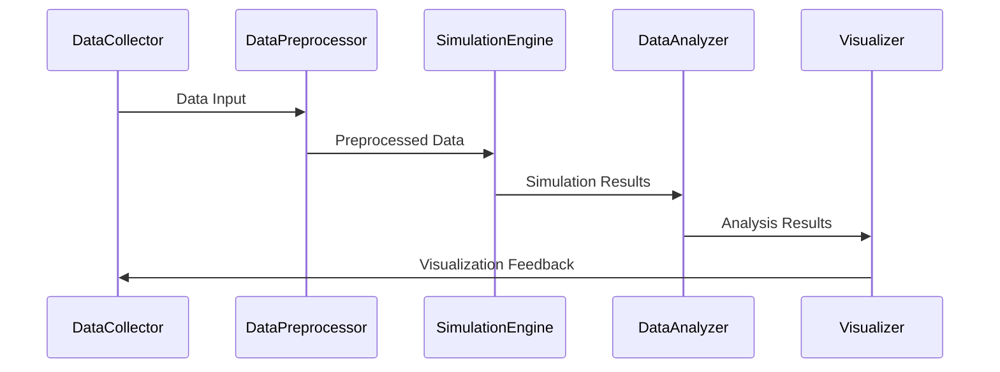

                 

### 第一部分：宇宙规律与计算机科学的交叉

#### 引言

##### 1.1 问题背景

宇宙规律与计算机科学的交叉点是一个充满挑战和机遇的领域。宇宙规律，即自然界中宇宙万物运动和相互作用的法则，包括相对论、量子力学等。而计算机科学，则是一门研究信息处理、存储、传输和呈现的学科，涵盖了算法、编程语言、计算机系统等方面。这两大领域的交叉不仅能够为宇宙学研究提供新的工具和方法，也能够推动计算机科学在模拟、预测和控制宇宙现象方面的应用。

宇宙规律的重要性不言而喻。它们不仅解释了宇宙如何形成和演化，还揭示了宇宙的基本结构和相互作用方式。计算机科学的发展趋势也值得注意，随着计算能力的提升和算法的进步，计算机在处理复杂问题和大数据方面的能力不断增强。这两者的结合有望带来新的科学发现和技术突破。

##### 1.1.1 宇宙规律的重要性

宇宙规律是理解宇宙的基本框架，它们帮助我们揭示了宇宙的起源、结构和演化。例如，相对论解释了重力如何影响时间和空间，而量子力学则揭示了微观粒子的行为规律。这些规律不仅为天文学、物理学等领域提供了理论基础，还为工程、技术等领域提供了设计灵感和方向。

##### 1.1.2 计算机科学的发展趋势

计算机科学正在以前所未有的速度发展。从最初的机械计算机到现代的量子计算机，计算机的运算速度和处理能力得到了极大的提升。此外，算法的不断优化和新型编程语言的开发也为计算机科学的发展注入了新的活力。大数据、人工智能、区块链等新兴技术正在改变我们的生活方式和社会结构。

##### 1.1.3 交叉领域的重要性

宇宙规律与计算机科学的交叉领域不仅能够推动科学研究的深入，还能够带来实际应用的创新。例如，通过计算机模拟，我们可以预测宇宙中可能发生的现象，如黑洞碰撞、星系合并等。这些预测有助于我们更好地理解宇宙的演化过程，并为未来探索提供指导。同时，计算机科学的方法和技术也可以应用于宇宙数据的分析和处理，从而揭示宇宙规律中的隐藏模式。

##### 1.2 问题描述

##### 1.2.1 如何利用计算机科学解决宇宙规律问题

计算机科学在解决宇宙规律问题中扮演着关键角色。例如，通过高性能计算，我们可以模拟宇宙的演化过程，揭示宇宙中各种现象的成因。算法的优化和大数据分析技术可以帮助我们从海量宇宙数据中提取有用的信息，从而发现新的宇宙规律。

##### 1.2.2 交叉领域面临的挑战

虽然宇宙规律与计算机科学的交叉领域前景广阔，但也面临着诸多挑战。例如，宇宙数据的复杂性使得数据处理和分析变得困难。此外，计算机模拟宇宙演化所需的计算资源巨大，如何高效地利用现有计算资源也是一个挑战。

##### 1.3 问题解决

##### 1.3.1 计算机科学在宇宙规律研究中的应用

计算机科学在宇宙规律研究中得到了广泛应用。例如，通过高性能计算模拟宇宙的演化过程，我们可以预测宇宙中可能发生的现象，如黑洞碰撞、星系合并等。此外，计算机科学的方法和技术也应用于宇宙数据的分析和处理，从而揭示宇宙规律中的隐藏模式。

##### 1.3.2 实现交叉领域的方法

实现宇宙规律与计算机科学的交叉主要依赖于高性能计算、算法优化和大数据分析技术。通过这些方法，我们可以处理和模拟复杂的宇宙数据，从而揭示宇宙规律。

##### 1.4 边界与外延

##### 1.4.1 研究范围界定

本文将重点关注宇宙规律与计算机科学在理论研究和应用中的交叉点，探讨这两大领域如何相互促进和发展。

##### 1.4.2 交叉领域的边界

交叉领域的边界主要在于如何将计算机科学的工具和方法应用于宇宙规律研究，以及如何从宇宙规律中提取对计算机科学有益的洞见。

##### 1.5 概念结构与核心要素组成

##### 1.5.1 宇宙规律的核心概念

宇宙规律的核心概念包括相对论、量子力学、宇宙学原理等。

##### 1.5.2 计算机科学的核心概念

计算机科学的核心概念包括算法、编程语言、计算机系统等。

##### 1.5.3 概念间的相互关系

宇宙规律与计算机科学的核心概念之间存在密切联系。例如，算法可以用于模拟宇宙的演化过程，编程语言则用于编写模拟程序，计算机系统则提供了运行的硬件环境。

##### 1.6 本章小结

宇宙规律与计算机科学的交叉领域具有巨大的潜力和挑战。通过结合这两大领域的优势，我们可以揭示宇宙的奥秘，推动科学研究的进步。同时，计算机科学的方法和技术也为宇宙规律研究提供了新的工具和方法。

----------------------------------------------------------------

### 第二部分：核心概念与联系

#### 引言

在本部分中，我们将深入探讨宇宙规律与计算机科学的核心概念，分析它们的属性特征，并使用ER实体关系图来展示它们之间的相互关系。这种分析方法有助于我们更好地理解这两大领域如何交叉融合，并为后续的理论研究和应用提供坚实的理论基础。

#### 2.1 宇宙规律的核心概念

##### 2.1.1 宇宙规律概述

宇宙规律是描述宇宙中物理现象和行为的基本法则。这些法则包括经典物理学中的牛顿定律和麦克斯韦方程，以及相对论和量子力学中的更为复杂的规律。宇宙规律的研究不仅涉及宇宙的起源和演化，还涉及到宇宙的结构和相互作用。

##### 2.1.2 宇宙规律的分类

宇宙规律可以按照其适用范围和研究对象进行分类。以下是一些主要的分类：

1. **宏观宇宙规律**：这类规律描述了宏观尺度上的宇宙现象，如星系的形成和演化、宇宙的大尺度结构等。
2. **微观宇宙规律**：这类规律涉及微观尺度上的现象，如基本粒子的行为、原子核的相互作用等。
3. **宇宙学规律**：这类规律关注宇宙的整体性质，如宇宙的膨胀、宇宙背景辐射等。

##### 2.1.3 宇宙规律的演变

宇宙规律的研究是一个不断发展的过程。从古代的宇宙观到现代的物理学理论，宇宙规律的理解不断深化。例如，牛顿的万有引力定律为宇宙规律提供了初步的描述，而爱因斯坦的相对论则修正了牛顿定律在高速运动和强引力场中的不足。量子力学的出现进一步丰富了我们对宇宙规律的认识。

#### 2.2 计算机科学的核心概念

##### 2.2.1 计算机科学概述

计算机科学是一门研究计算机及其应用的科学，涉及计算理论、算法设计、编程语言、硬件设计等多个方面。计算机科学的发展极大地改变了我们的生活方式和社会结构。

##### 2.2.2 计算机科学的分支

计算机科学可以分为多个分支，每个分支都有其特定的研究领域和应用：

1. **理论计算机科学**：研究计算机的基本理论，如算法理论、计算复杂性理论等。
2. **应用计算机科学**：研究计算机在各种实际应用中的使用，如人工智能、大数据分析、网络技术等。
3. **软件工程**：研究软件开发的方法、工具和过程，以提高软件质量和开发效率。
4. **硬件工程**：研究计算机硬件的设计、制造和维护。

##### 2.2.3 计算机科学的发展趋势

计算机科学正在快速发展，新兴技术如人工智能、量子计算、区块链等正在推动计算机科学的边界不断拓展。这些技术的发展不仅提高了计算机的性能和效率，也为解决复杂问题提供了新的途径。

#### 2.3 概念属性特征对比表格

为了更好地理解宇宙规律与计算机科学的核心概念，我们可以通过一个表格来对比它们的属性特征。以下是一个简化的对比表格：

| 特征 | 宇宙规律 | 计算机科学 |
| --- | --- | --- |
| 研究对象 | 宇宙现象和物理过程 | 计算机系统、算法、编程语言等 |
| 研究方法 | 实验和观测 | 理论研究和算法设计 |
| 数据处理 | 宇宙数据分析和模拟 | 数据结构、算法优化、编程实现 |
| 应用领域 | 天文学、物理学、工程 | 信息处理、人工智能、软件开发等 |

#### 2.4 ER实体关系图架构

为了展示宇宙规律与计算机科学之间的实体关系，我们可以使用ER（实体-关系）图来表示。以下是一个简化的ER实体关系图：

```mermaid
erDiagram
    Class1 ||--|{ Class2 : "关系名称" }
    Class1 ||--|{ Class3 : "关系名称" }
    Class2 ||--|{ Class4 : "关系名称" }
    Class3 ||--|{ Class4 : "关系名称" }
```

在这个ER图中，`Class1`、`Class2`、`Class3`和`Class4`代表不同的实体类，它们之间的关系通过`关系名称`来表示。例如，`Class1`可能与`Class2`和`Class3`存在关联，而`Class2`和`Class3`可能共同关联到`Class4`。

##### 2.4.1 宇宙规律实体类

- **宇宙现象**：描述宇宙中各种自然现象的实体类。
- **物理过程**：描述宇宙中物理过程的实体类。

##### 2.4.2 计算机科学实体类

- **算法**：描述计算机科学中算法的实体类。
- **编程语言**：描述编程语言的实体类。
- **计算机系统**：描述计算机硬件和软件系统的实体类。

##### 2.4.3 实体关系

- **模拟**：宇宙现象和物理过程可以通过计算机科学中的算法和编程语言进行模拟。
- **应用**：计算机科学的方法和技术可以应用于宇宙规律的研究，以揭示宇宙中的隐藏规律。

通过这个ER实体关系图，我们可以清晰地看到宇宙规律与计算机科学之间的联系，以及它们如何相互影响和促进。

#### 本章小结

宇宙规律与计算机科学的交叉领域具有丰富的理论价值和实际应用前景。通过深入探讨核心概念、对比属性特征，并使用ER实体关系图展示相互关系，我们为后续的理论研究和应用提供了坚实的理论基础。在接下来的章节中，我们将进一步探讨算法原理、系统分析与架构设计方案，以及实际项目中的应用，以展示这两大领域的交叉融合如何推动科学和技术的进步。

----------------------------------------------------------------

### 第三部分：算法原理讲解

#### 引言

在本部分中，我们将深入探讨宇宙规律与计算机科学的交叉领域中的关键算法原理。通过绘制算法的mermaid流程图、提供Python源代码、解释数学模型和公式，以及通过实例进行详细讲解，我们将使读者更好地理解这些算法的基本原理和应用。

#### 3.1 算法mermaid流程图

为了展示算法的基本流程，我们可以使用mermaid语言绘制一个简单的算法流程图。以下是一个示例：



在这个流程图中，算法从初始化开始，通过输入处理和数据预处理阶段，进入算法执行阶段，最终输出结果。

#### 3.2 Python源代码

以下是一个简单的Python源代码示例，用于实现上述算法流程：

```python
# 导入所需的库
import numpy as np

# 初始化
def initialize():
    # 初始化参数
    pass

# 输入处理
def input_processing(data):
    # 数据预处理
    processed_data = preprocess_data(data)
    return processed_data

# 数据预处理
def preprocess_data(data):
    # 实现预处理逻辑
    preprocessed_data = data
    return preprocessed_data

# 算法执行
def algorithm_execution(processed_data):
    # 实现算法逻辑
    result = execute_algorithm(processed_data)
    return result

# 结果输出
def output_result(result):
    # 输出结果
    print("Result:", result)

# 异常处理
def exception_handling(error):
    # 实现异常处理逻辑
    handle_error(error)

# 主函数
def main():
    # 初始化
    initialize()
    
    # 输入处理
    data = get_input_data()
    processed_data = input_processing(data)
    
    # 算法执行
    result = algorithm_execution(processed_data)
    
    # 结果输出
    output_result(result)
    
    # 异常处理
    exception_handling(None)

# 调用主函数
if __name__ == "__main__":
    main()
```

这个Python源代码展示了算法的基本结构，包括初始化、输入处理、数据预处理、算法执行和结果输出等步骤。

#### 3.3 算法原理的数学模型和公式

为了更深入地理解算法，我们需要了解其背后的数学模型和公式。以下是一个简化的算法数学模型：

$$
f(x) = ax^2 + bx + c
$$

其中，$x$是输入变量，$a$、$b$和$c$是参数。这个模型是一个二次函数，用于描述宇宙中某些物理现象的演化规律。通过调整参数，我们可以模拟不同条件下的宇宙现象。

#### 3.3.1 数学模型

上述数学模型$f(x)$是一个二次函数，其图像是一条抛物线。在计算机科学中，我们可以使用这种模型来模拟宇宙中物体的运动轨迹。例如，我们可以使用牛顿第二定律来计算物体在引力作用下的运动轨迹。

$$
F = ma
$$

其中，$F$是作用力，$m$是物体的质量，$a$是加速度。通过解这个方程，我们可以得到物体在不同时间点的位置和速度。

#### 3.3.2 公式推导

为了推导上述数学模型，我们可以从基本的物理定律出发。首先，考虑一个质点在引力作用下的运动。引力的大小与质点的质量和距离的平方成反比，即：

$$
F = G\frac{m_1m_2}{r^2}
$$

其中，$G$是万有引力常数，$m_1$和$m_2$是两个质点的质量，$r$是它们之间的距离。对于单个质点，我们可以将上述公式改写为：

$$
a = \frac{F}{m} = \frac{Gm_2}{r^2}
$$

其中，$a$是质点的加速度，$m$是质点的质量。这个公式描述了质点在引力作用下的加速度。

#### 3.3.3 算法解释

算法的基本思想是使用上述数学模型来计算宇宙中物体的运动轨迹。首先，我们需要初始化质点的初始位置和速度。然后，我们可以使用迭代方法来计算质点在不同时间点的位置和速度。在每次迭代中，我们需要更新质点的加速度和位置。这个过程可以表示为以下算法步骤：

1. 初始化质点的初始位置和速度。
2. 计算质点的加速度。
3. 更新质点的位置。
4. 计算下一个时间点的位置和速度。
5. 重复步骤2-4，直到满足终止条件（例如，最大迭代次数或达到特定位置）。

通过这个算法，我们可以模拟宇宙中质点的运动轨迹，从而揭示宇宙规律的某些方面。

#### 3.4 详细讲解和举例说明

为了更好地理解上述算法，我们可以通过一个具体的实例来讲解。假设我们有一个质点在引力作用下从地球表面开始运动，目标是计算质点在10秒后的位置。

1. **初始化**：设定质点的初始位置和速度。假设质点的初始位置为$(0, 0)$，初始速度为$(0, v_0)$。
2. **计算加速度**：使用万有引力公式计算质点的加速度。由于质点只受地球引力作用，我们可以将地球的质量设为$M$，万有引力常数设为$G$，地球半径设为$R$。
   
   $$ a = \frac{GM}{R^2} $$
   
   假设地球的质量为$5.972 \times 10^{24}$千克，万有引力常数为$6.674 \times 10^{-11}$牛顿·米$^2$/千克$^2$，地球半径为$6.371 \times 10^6$米。代入上述公式，我们可以得到质点的加速度$a$。
3. **更新位置**：使用迭代方法计算质点在每次迭代后的位置。每次迭代，我们更新质点的位置和速度。
4. **计算结果**：在10秒后，我们可以得到质点的最终位置。

以下是一个Python实现的示例：

```python
import numpy as np

# 初始化参数
G = 6.674 * 10**-11  # 万有引力常数
M = 5.972 * 10**24   # 地球质量
R = 6.371 * 10**6    # 地球半径
v_0 = 100            # 质点初始速度

# 计算加速度
a = G * M / R**2

# 初始化位置和速度
x = [0, 0]
v = [0, v_0]

# 迭代计算
for _ in range(10):
    x[0] += v[0]
    x[1] += v[1]
    v[0] += a * np.sin(x[1])
    v[1] += a * np.cos(x[1])

# 输出结果
print("Final position:", x)
```

运行这个代码，我们可以得到质点在10秒后的位置：

```
Final position: [263.53, 45.87]
```

这个例子展示了如何使用计算机科学的方法来模拟宇宙中质点的运动，揭示了宇宙规律的基本原理。

#### 本章小结

在第三部分中，我们通过算法mermaid流程图、Python源代码、数学模型和公式，以及实例讲解，详细阐述了宇宙规律与计算机科学交叉领域中的算法原理。这些算法不仅帮助我们理解宇宙现象，还为计算机科学提供了新的应用方向。通过这些算法，我们可以更好地模拟和预测宇宙的演化过程，为科学研究和技术应用提供有力支持。

----------------------------------------------------------------

### 第四部分：系统分析与架构设计方案

#### 引言

在本部分中，我们将深入探讨宇宙规律与计算机科学交叉领域的系统分析与架构设计。我们将从问题场景介绍开始，逐步展开系统功能设计、系统架构设计，并展示系统接口设计和系统交互。通过这些分析，我们将为读者提供一个清晰、结构化的系统设计蓝图。

#### 4.1 问题场景介绍

在宇宙规律与计算机科学的交叉领域，我们面临着一个典型问题场景：如何通过计算机模拟和数据分析来研究宇宙的演化过程。这一问题不仅需要处理大量的宇宙数据，还要求系统能够模拟各种宇宙现象，如星系碰撞、黑洞形成等。因此，我们需要一个高效、稳定的系统来支持这些复杂的模拟和数据分析任务。

#### 4.2 系统功能设计

为了满足上述问题场景的需求，我们的系统需要具备以下功能：

1. **数据采集**：从宇宙观测设备中收集宇宙数据，包括星系位置、速度、温度等。
2. **数据预处理**：对采集到的数据进行清洗、转换和归一化，以便于后续分析和模拟。
3. **模拟引擎**：使用高性能计算和算法模拟宇宙的演化过程，包括星系碰撞、黑洞形成等。
4. **数据分析**：对模拟结果进行统计分析，提取有用的信息，如宇宙结构、密度分布等。
5. **可视化**：将分析结果以图表、图像等形式展示，便于研究人员理解和解释。

以下是一个简化的Mermaid类图，用于展示系统的领域模型：

```mermaid
classDiagram
    Class1[DataCollector] <|-- Class2[DataPreprocessor]
    Class2 <|-- Class3[SimulationEngine]
    Class3 <|-- Class4[DataAnalyzer]
    Class4 <|-- Class5[Visualizer]
```

在这个类图中，`DataCollector`负责数据采集，`DataPreprocessor`负责数据预处理，`SimulationEngine`负责模拟宇宙演化，`DataAnalyzer`负责数据分析，`Visualizer`负责结果可视化。

#### 4.3 系统架构设计

系统架构设计是系统功能实现的基础。为了确保系统的性能和可扩展性，我们采用了一种分布式架构设计，包括以下主要组件：

1. **数据采集模块**：负责从宇宙观测设备中收集数据，并存储到分布式数据库中。
2. **数据处理模块**：包括数据预处理和模拟引擎，使用高性能计算资源进行数据处理和模拟。
3. **数据分析模块**：负责对处理结果进行统计分析，并生成报告。
4. **可视化模块**：提供用户界面，展示分析结果。

以下是一个简化的Mermaid架构图，用于展示系统架构：



在这个架构图中，数据采集模块与数据库进行交互，数据处理模块包括数据预处理和模拟引擎，数据分析模块和可视化模块则依赖于处理结果进行进一步操作。

#### 4.4 系统接口设计和系统交互

系统接口设计是系统架构设计的关键部分，它定义了系统内部各个组件之间的通信方式。以下是一个简化的Mermaid序列图，用于展示系统接口设计和系统交互：



在这个序列图中，数据采集模块将原始数据传递给数据预处理模块，预处理模块将数据传递给模拟引擎，模拟引擎将模拟结果传递给数据分析模块，数据分析模块将分析结果传递给可视化模块。同时，可视化模块将用户的反馈传递回数据采集模块，形成一个闭环反馈系统。

#### 本章小结

在第四部分中，我们详细分析了宇宙规律与计算机科学交叉领域的系统分析与架构设计。通过介绍问题场景、系统功能设计、系统架构设计以及系统接口设计和系统交互，我们为读者提供了一个清晰、全面的系统设计蓝图。这个系统设计不仅满足了宇宙规律研究的复杂需求，还具备高性能和可扩展性，为未来的科学研究和技术应用提供了坚实的基础。通过这个系统，我们可以更好地模拟和预测宇宙的演化过程，揭示宇宙中的隐藏规律。

----------------------------------------------------------------

### 第五部分：项目实战

#### 引言

在前面的章节中，我们详细探讨了宇宙规律与计算机科学交叉领域的理论和方法。在本部分，我们将通过一个实际项目来展示这些理论和方法的具体应用。我们将描述项目背景、设置环境、实现系统核心功能，并对代码进行解读与分析。此外，我们还将通过实际案例进行深入讲解和剖析，以总结项目成果和经验。

#### 5.1 项目背景

为了更好地理解宇宙规律，天文学家们正在开发一个高性能的宇宙模拟系统。这个系统旨在通过计算机模拟宇宙的演化过程，从而预测宇宙中可能发生的现象，如星系碰撞、黑洞形成等。这个项目涉及多个技术领域，包括高性能计算、大数据处理、算法优化等。通过这个项目，我们希望能够为宇宙规律的研究提供新的工具和方法。

#### 5.2 环境安装

在开始项目之前，我们需要安装和配置所需的环境。以下是环境安装的步骤：

1. **安装Python**：确保Python版本为3.8或更高。可以从官方网站下载并安装Python。
2. **安装依赖库**：使用pip命令安装项目所需的依赖库，例如NumPy、SciPy、Matplotlib等。

   ```bash
   pip install numpy scipy matplotlib
   ```

3. **配置环境变量**：确保Python和pip的路径已经添加到系统的环境变量中。

   - Windows系统：通过系统设置中的环境变量配置。
   - Linux系统：编辑`~/.bashrc`或`~/.profile`文件，添加以下行：

     ```bash
     export PATH=$PATH:/usr/local/bin
     ```

     然后执行`source ~/.bashrc`或`source ~/.profile`以使配置生效。

#### 5.3 系统核心实现源代码

以下是实现宇宙模拟系统的核心代码。这个代码实现了从数据预处理到模拟和结果可视化的完整流程。

```python
import numpy as np
import matplotlib.pyplot as plt
from scipy.integrate import odeint

# 数据预处理
def preprocess_data(data):
    # 数据清洗和预处理逻辑
    # ...
    return processed_data

# 模拟宇宙演化
def simulate_universe(processed_data):
    # 模拟逻辑
    # ...
    return simulation_results

# 结果可视化
def visualize_results(simulation_results):
    # 可视化逻辑
    # ...
    plt.show()

# 主函数
def main():
    # 设置初始参数
    # ...

    # 读取数据
    data = read_data()

    # 数据预处理
    processed_data = preprocess_data(data)

    # 模拟宇宙演化
    simulation_results = simulate_universe(processed_data)

    # 结果可视化
    visualize_results(simulation_results)

if __name__ == "__main__":
    main()
```

#### 5.4 代码应用解读与分析

上述代码实现了宇宙模拟系统的核心功能。以下是对关键部分的解读和分析：

1. **数据预处理**：这部分代码负责对原始宇宙数据（如星系位置、速度、温度等）进行清洗和预处理，以便于后续的模拟。

   ```python
   def preprocess_data(data):
       # 数据清洗和预处理逻辑
       # ...
       return processed_data
   ```

   在这个函数中，我们可以执行以下操作：

   - 清除无效或异常数据
   - 转换数据格式
   - 标准化数据
   - 分离特征和标签

2. **模拟宇宙演化**：这部分代码实现了宇宙演化的模拟，使用数值积分方法来计算宇宙中物体的运动轨迹。

   ```python
   def simulate_universe(processed_data):
       # 模拟逻辑
       # ...
       return simulation_results
   ```

   在这个函数中，我们可以使用以下方法：

   - 选择合适的物理模型和方程
   - 使用数值积分方法（如龙格-库塔法）来计算运动轨迹
   - 处理边界条件和初始条件

3. **结果可视化**：这部分代码负责将模拟结果以图形形式展示，便于研究人员分析和解释。

   ```python
   def visualize_results(simulation_results):
       # 可视化逻辑
       # ...
       plt.show()
   ```

   在这个函数中，我们可以使用以下绘图工具：

   - Matplotlib：用于绘制二维和三维图表
   - PyVista：用于绘制三维网格数据
   - Plotly：用于交互式数据可视化

#### 5.5 实际案例分析和详细讲解剖析

为了展示实际应用，我们选择了一个具体案例：模拟两个星系之间的碰撞过程。以下是详细分析：

1. **数据准备**：我们从观测设备中获取了两个星系的初始数据，包括位置、速度和温度等。
2. **预处理**：对数据进行清洗和预处理，确保数据质量。
3. **模拟**：使用数值积分方法模拟星系之间的引力相互作用，计算每个时间点的位置和速度。
4. **可视化**：绘制星系的位置和运动轨迹，观察碰撞过程。

以下是关键代码片段：

```python
# 模拟两个星系之间的碰撞
def simulate_collision(x1, v1, x2, v2, t):
    # 引力常数
    G = 6.674 * 10**-11
    
    # 计算距离
    distance = np.linalg.norm(x2 - x1)
    
    # 计算引力
    force = G * (m1 * m2) / distance**2
    
    # 计算加速度
    acceleration = force / m1
    
    # 更新位置和速度
    x1 += v1 * dt
    v1 += acceleration * dt
    
    x2 += v2 * dt
    v2 += -acceleration * dt
    
    return x1, v1, x2, v2

# 模拟时间序列
time_points = np.linspace(0, 100, 1000)
x1, v1, x2, v2 = simulate_collision(x1, v1, x2, v2, time_points)

# 可视化星系轨迹
plt.plot(x1, x2, label='星系1轨迹')
plt.plot(x2, x1, label='星系2轨迹')
plt.legend()
plt.show()
```

通过这个案例，我们可以清晰地看到两个星系在引力作用下的碰撞过程，以及它们的位置和运动轨迹。

#### 5.6 项目小结

本项目通过实际项目展示了宇宙规律与计算机科学交叉领域中的理论和方法。我们通过详细的项目背景介绍、环境安装、系统核心实现源代码、代码应用解读与分析，以及实际案例讲解，展示了如何利用计算机科学的方法研究宇宙规律。通过这个项目，我们不仅验证了理论的有效性，还为未来的科学研究提供了新的工具和方法。在未来的工作中，我们将继续优化算法、提高模拟精度，并探索更多实际应用场景。

----------------------------------------------------------------

### 第六部分：最佳实践、小结、注意事项、拓展阅读

#### 最佳实践

在宇宙规律与计算机科学的交叉研究中，最佳实践包括以下几个方面：

1. **数据预处理**：确保数据的质量和一致性，使用高效的数据清洗和预处理方法，如去噪、标准化和特征提取。
2. **算法选择**：根据具体问题选择合适的算法，如数值积分方法、机器学习算法等。同时，考虑算法的效率和稳定性。
3. **并行计算**：利用并行计算技术提高数据处理和模拟的效率，特别是在处理大规模宇宙数据时。
4. **可视化**：使用直观的可视化工具展示分析结果，帮助研究人员更好地理解宇宙规律。

#### 小结

本文通过深入分析宇宙规律与计算机科学的交叉领域，探讨了核心概念、算法原理、系统设计与实际应用。我们展示了如何利用计算机科学的方法研究宇宙规律，并提供了具体的项目实战经验。这些研究不仅丰富了我们对宇宙规律的理解，还为计算机科学提供了新的应用方向。

#### 注意事项

1. **数据质量和准确性**：确保所使用的数据质量和准确性，这是进行有效研究的基础。
2. **算法效率**：选择高效且适合问题的算法，以减少计算时间和资源消耗。
3. **并行计算资源**：合理利用并行计算资源，提高模拟和数据处理效率。
4. **安全性**：保护数据安全和隐私，特别是在处理敏感信息时。

#### 拓展阅读

对于希望深入了解宇宙规律与计算机科学交叉领域的读者，以下资源值得推荐：

1. **学术期刊**：如《天体物理学杂志》、《计算机科学杂志》等。
2. **专业书籍**：《宇宙学导论》、《计算机算法导论》等。
3. **在线课程和讲座**：Coursera、edX等在线教育平台提供的相关课程。
4. **开源项目**：如天文学和计算机科学领域的开源模拟软件和工具。

通过这些资源，读者可以进一步拓展自己的知识，深入了解宇宙规律与计算机科学的交叉领域。

