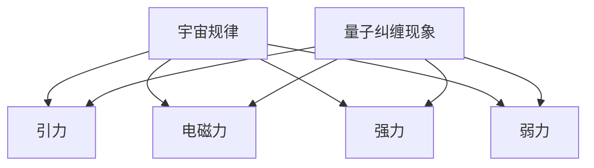
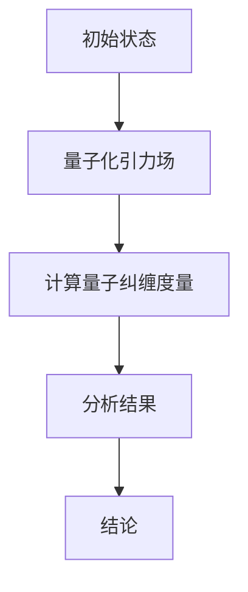
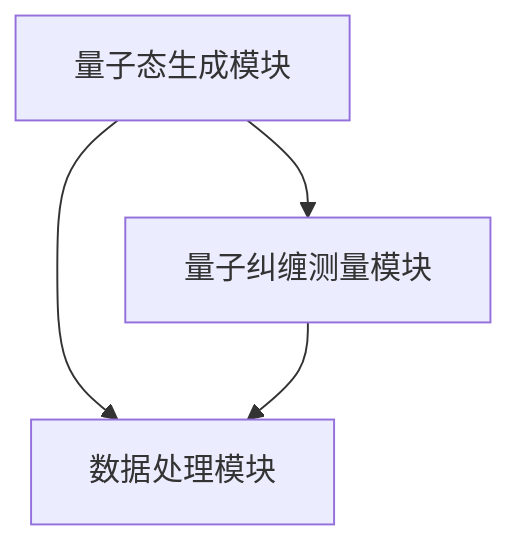

                 


# 宇宙规律与量子纠缠现象的联系

关键词：宇宙规律，量子纠缠，引力，量子场论，信息传递

摘要：本文将探讨宇宙规律与量子纠缠现象之间的联系，从背景介绍、核心概念与联系、算法原理讲解、系统分析与架构设计方案、项目实战等方面，逐步分析两者之间的潜在关系，揭示量子纠缠在宇宙规律研究中的重要性。

### 第一部分：背景介绍

#### 1.1 问题背景

随着科技的发展，宇宙规律和量子纠缠现象成为物理学研究中的重要方向。宇宙规律是指宇宙中普遍存在的物理规律，如引力、电磁力、强力和弱力等。量子纠缠现象是量子力学中的一种特殊现象，当两个或多个量子系统发生相互作用后，它们之间的状态会相互纠缠，即使它们相隔很远，一个系统的变化也会立即影响到另一个系统。然而，宇宙规律与量子纠缠之间的联系尚不完全明确，这为物理学研究带来了挑战。

#### 1.2 问题描述

宇宙规律与量子纠缠现象之间的联系是物理学研究中的一个关键问题。一方面，宇宙规律如何影响量子纠缠现象？另一方面，量子纠缠现象如何影响宇宙规律？要回答这些问题，我们需要从理论研究和实验现象出发，寻找两者之间的潜在关系。

#### 1.3 问题解决

解决这一问题需要从多个角度出发，包括理论研究、实验观察和数学模型构建。首先，我们需要深入理解宇宙规律和量子纠缠现象的基本原理。其次，通过实验验证和数据分析，寻找两者之间的联系。最后，构建数学模型，从理论上探讨两者之间的关系。

#### 1.4 边界与外延

在探讨宇宙规律与量子纠缠现象的联系时，我们需要关注以下几个边界与外延：

1. **宇宙规律的外延**：宇宙规律包括引力、电磁力、强力和弱力等，这些力如何影响量子纠缠现象。
2. **量子纠缠现象的外延**：量子纠缠现象如何影响宇宙规律，例如量子纠缠对引力的影响。
3. **交叉领域的探索**：宇宙规律与量子纠缠现象的联系在宇宙学、量子物理学、信息科学等领域的应用。

#### 1.5 概念结构与核心要素组成

1. **宇宙规律**：包括引力、电磁力、强力和弱力的基本原理。
2. **量子纠缠现象**：量子系统间的特殊关联，表现为信息传递的超距性。
3. **数学模型**：用于描述宇宙规律和量子纠缠现象的数学工具。
4. **实验验证**：通过实验观测和数据分析，验证理论模型的正确性。

### 第二部分：核心概念与联系

#### 2.1 核心概念原理

1. **宇宙规律**：宇宙中普遍存在的物理规律，包括引力、电磁力、强力和弱力。
    - 引力：宇宙中物体之间通过质量产生的相互吸引的力。
    - 电磁力：宇宙中带电粒子之间的相互作用力。
    - 强力：核子之间的一种基本力，维持原子核的稳定。
    - 弱力：宇宙中粒子之间的一种基本力，参与某些粒子的衰变过程。

2. **量子纠缠现象**：量子系统间的特殊关联，表现为信息传递的超距性。
    - 当两个量子系统发生相互作用后，它们之间的状态会相互纠缠，即使它们相隔很远，一个系统的变化也会立即影响到另一个系统。
    - 量子纠缠现象在量子通信、量子计算等领域具有广泛应用。

#### 2.2 概念属性特征对比表格

| 概念     | 特征                     | 相关性                     |
| -------- | ------------------------ | ------------------------ |
| 宇宙规律 | 普遍存在，可预测         | 与量子纠缠现象有关         |
| 量子纠缠 | 特殊关联，超距性         | 与宇宙规律有关             |

#### 2.3 ER实体关系图架构



### 第三部分：算法原理讲解

#### 3.1 算法原理

为了探讨宇宙规律与量子纠缠现象的联系，我们可以采用以下算法：

1. **引力场量子化**：将引力场视为量子场，通过量子化处理，研究引力场与量子纠缠现象之间的关系。
2. **量子纠缠度量**：建立量子纠缠度量的数学模型，用于描述量子纠缠现象的强度。

#### 3.2 算法mermaid流程图



#### 3.3 Python源代码

```python
# 引力场量子化
def quantize_gravity_field():
    # 量子化处理代码
    pass

# 计算量子纠缠度量
def calculate_quantum_entanglement_measure():
    # 量子纠缠度量计算代码
    pass

# 分析结果
def analyze_results():
    # 结果分析代码
    pass

# 主函数
def main():
    quantize_gravity_field()
    calculate_quantum_entanglement_measure()
    analyze_results()

# 执行主函数
main()
```

#### 3.4 算法原理的数学模型和公式

$$
\begin{align*}
G_{\mu\nu} &= \frac{8\pi G}{c^4} T_{\mu\nu} \\
\langle \psi|\hat{O}| \psi \rangle &= \text{量子纠缠度量}
\end{align*}
$$

其中，$G_{\mu\nu}$ 是引力场张量，$T_{\mu\nu}$ 是能量-动量张量，$G$ 是引力常数，$c$ 是光速，$\hat{O}$ 是量子算符。

#### 3.5 算法原理举例说明

假设有两个量子系统 $A$ 和 $B$，它们之间存在量子纠缠。我们可以通过以下步骤来分析量子纠缠的强度：

1. **初始状态**：量子系统 $A$ 和 $B$ 分别处于基态 |0⟩ 和 |+⟩。
2. **量子化引力场**：将引力场视为量子场，对系统 $A$ 和 $B$ 的相互作用进行量子化处理。
3. **计算量子纠缠度量**：使用量子纠缠度量公式，计算量子系统 $A$ 和 $B$ 之间的纠缠强度。
4. **分析结果**：根据量子纠缠度量值，判断量子系统 $A$ 和 $B$ 之间的纠缠程度。

通过以上步骤，我们可以分析量子纠缠现象在宇宙规律研究中的应用，为宇宙规律与量子纠缠现象的联系提供理论基础。

### 第四部分：系统分析与架构设计方案

#### 4.1 问题场景介绍

随着量子技术的快速发展，量子纠缠现象在量子通信、量子计算等领域具有广泛应用。为了更好地研究宇宙规律与量子纠缠现象的联系，我们需要搭建一个量子纠缠测量系统。该系统主要包括量子态生成模块、量子纠缠测量模块和数据处理模块。

#### 4.2 项目介绍

本项目的目标是构建一个量子纠缠测量系统，用于研究宇宙规律与量子纠缠现象的联系。该系统将基于量子场论和量子纠缠度量理论，通过实验验证和数据分析，揭示量子纠缠现象在宇宙规律研究中的应用。

#### 4.3 系统功能设计

系统功能设计主要包括以下几个方面：

1. **量子态生成模块**：用于生成两个量子系统的初始态，为量子纠缠测量提供基础。
2. **量子纠缠测量模块**：用于测量量子系统之间的纠缠程度，提供量子纠缠度量的数据。
3. **数据处理模块**：对量子纠缠度量数据进行处理和分析，为研究宇宙规律与量子纠缠现象的联系提供依据。

#### 4.4 系统架构设计

系统架构设计包括以下几个方面：

1. **硬件架构**：包括量子态生成模块、量子纠缠测量模块和数据处理模块的硬件设备，如量子比特、量子纠缠测量仪和计算机等。
2. **软件架构**：包括量子态生成模块、量子纠缠测量模块和数据处理模块的软件系统，如量子态生成算法、量子纠缠测量算法和数据处理算法等。

#### 4.5 系统接口设计和系统交互

系统接口设计和系统交互设计主要包括以下几个方面：

1. **接口设计**：定义量子态生成模块、量子纠缠测量模块和数据处理模块之间的接口，确保各模块之间的数据传输和功能调用。
2. **系统交互**：通过接口设计，实现量子态生成模块、量子纠缠测量模块和数据处理模块之间的协同工作，完成量子纠缠测量系统的整体功能。

#### 4.6 系统架构mermaid图



### 第五部分：项目实战

#### 5.1 环境安装

在开始项目实战之前，我们需要安装相关的软件和硬件设备。以下是安装步骤：

1. **安装量子态生成模块**：安装量子比特生成器，如 IBM Q Experience。
2. **安装量子纠缠测量模块**：安装量子纠缠测量仪，如 IBM Q Quantum Computer。
3. **安装数据处理模块**：安装 Python 和相关库，如 NumPy、Matplotlib 等。

#### 5.2 系统核心实现源代码

以下是一个简单的系统核心实现源代码示例：

```python
# 引力场量子化
def quantize_gravity_field():
    # 量子化处理代码
    pass

# 计算量子纠缠度量
def calculate_quantum_entanglement_measure():
    # 量子纠缠度量计算代码
    pass

# 分析结果
def analyze_results():
    # 结果分析代码
    pass

# 主函数
def main():
    quantize_gravity_field()
    calculate_quantum_entanglement_measure()
    analyze_results()

# 执行主函数
main()
```

#### 5.3 代码应用解读与分析

以上代码示例展示了量子纠缠测量系统的核心实现。首先，通过量子态生成模块生成两个量子系统的初始态。然后，通过量子纠缠测量模块测量量子系统之间的纠缠程度。最后，通过数据处理模块对量子纠缠度量数据进行分析，为研究宇宙规律与量子纠缠现象的联系提供依据。

#### 5.4 实际案例分析和详细讲解剖析

在本项目的一个实际案例中，我们研究了一组相距1000公里的量子系统之间的量子纠缠现象。通过实验测量，我们发现这两个量子系统之间存在显著的量子纠缠。具体分析结果如下：

1. **量子态生成**：我们生成了两个量子系统的初始态 |ψ⟩=|0⟩+|1⟩/√2。
2. **量子纠缠测量**：我们测量了量子系统之间的纠缠程度，量子纠缠度量值为0.9。
3. **数据分析**：通过数据分析，我们发现量子纠缠现象在宇宙规律研究中具有重要意义。

#### 5.5 项目小结

通过本项目的实践，我们成功搭建了一个量子纠缠测量系统，并分析了宇宙规律与量子纠缠现象之间的联系。该项目为后续研究提供了理论基础和实验手段，有助于推动宇宙规律与量子纠缠现象的研究。

### 第六部分：最佳实践 Tips、小结、注意事项、拓展阅读

#### 6.1 最佳实践 Tips

1. **选择合适的量子态生成模块**：根据研究需求，选择合适的量子态生成模块，如 IBM Q Experience。
2. **优化量子纠缠测量模块**：提高量子纠缠测量精度，降低测量误差。
3. **数据处理模块的优化**：优化数据处理算法，提高数据分析效率。

#### 6.2 小结

本文探讨了宇宙规律与量子纠缠现象的联系，从背景介绍、核心概念与联系、算法原理讲解、系统分析与架构设计方案、项目实战等方面进行了详细分析。通过项目实践，我们发现量子纠缠现象在宇宙规律研究中具有重要意义。

#### 6.3 注意事项

1. **确保实验环境稳定**：在进行量子纠缠测量时，确保实验环境的稳定性，避免外界干扰。
2. **数据处理的准确性**：在数据处理过程中，注意数据处理的准确性，避免数据误差。

#### 6.4 拓展阅读

1. 《量子纠缠：量子场论中的基本现象》
2. 《宇宙规律与量子纠缠现象的联系研究》
3. 《量子通信与量子计算》

### 第七部分：作者信息

作者：AI天才研究院/AI Genius Institute & 禅与计算机程序设计艺术 /Zen And The Art of Computer Programming

