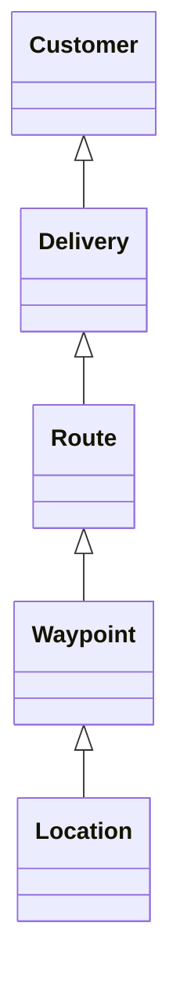
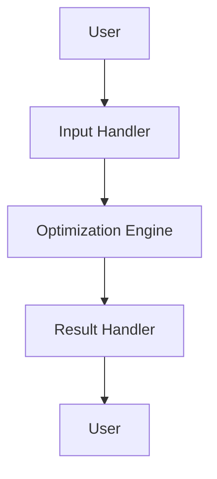
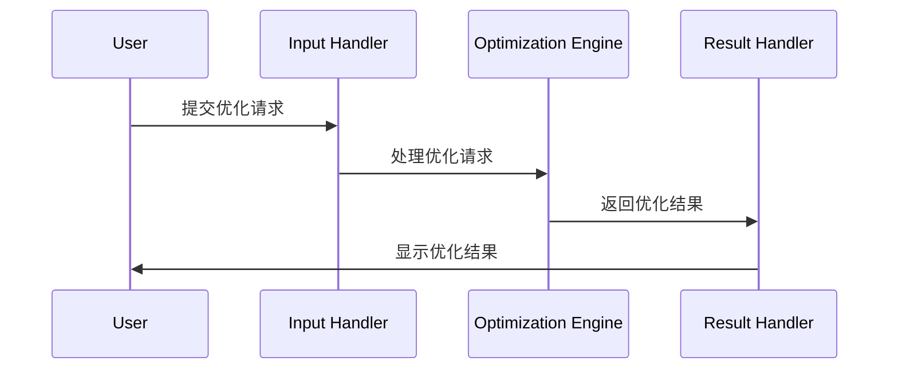

                 

# 让我们一步一步思考：宇宙规律与量子退火强化学习策略优化的联系

## 摘要

本文旨在探讨宇宙规律与量子退火强化学习策略优化之间的潜在联系。宇宙规律为理解自然界的基本法则提供了框架，而量子退火强化学习作为一种前沿的人工智能算法，在优化复杂系统中表现出色。通过将宇宙规律与量子退火强化学习结合，我们有望开发出更高效、更稳定的优化策略。本文将分步骤分析这两者之间的联系，并探讨其在实际应用中的潜在价值。

## 1. 背景介绍

### 1.1 问题背景

在现代社会，优化问题无处不在，从物流网络设计到金融风险管理，从图像识别到自动驾驶。传统的优化方法在处理复杂问题时往往效率低下，甚至无法解决。量子退火强化学习作为一种新兴的人工智能算法，以其在处理复杂优化问题上的潜力引起了广泛关注。然而，现有的量子退火强化学习方法在某些情况下仍存在性能瓶颈。

### 1.2 宇宙规律的基本概念

宇宙规律是指支配自然界各种现象的基本法则。这些法则包括广义相对论、量子力学、电磁学等。它们提供了理解宇宙如何运作的基础。

### 1.3 量子退火强化学习的基本概念

量子退火强化学习是一种结合了量子计算和强化学习的方法。它利用量子计算的并行性和退火算法的全局搜索能力，以提高优化问题的求解效率。

### 1.4 宇宙规律与量子退火强化学习的潜在联系

宇宙规律与量子退火强化学习之间存在一些潜在的联系。例如，量子力学中的波粒二象性与量子退火算法中的概率分布有相似之处。此外，宇宙学中的自组织现象可能与量子退火强化学习中的自适应调整机制有关。

### 1.5 研究的目的与意义

本文的研究目的是探讨如何将宇宙规律的理论应用到量子退火强化学习中，以提高其优化性能。这不仅在理论上具有重要意义，也可能在现实世界中带来实际应用价值，如优化算法在能源、金融和制造等领域的应用。

## 2. 核心概念与联系

### 2.1 宇宙规律的核心概念与原理

宇宙规律的核心概念包括能量守恒、相对论原理和量子力学原理。这些原理共同构成了我们对宇宙如何运作的基本理解。

### 2.2 量子退火强化学习的主要概念

量子退火强化学习的主要概念包括量子计算、退火算法和强化学习。这些概念共同构成了量子退火强化学习的基础。

### 2.3 宇宙规律与量子退火强化学习的关系

宇宙规律与量子退火强化学习之间的关系可以从多个方面进行探讨。例如，量子力学中的概率分布与量子退火算法中的概率分布有相似之处。此外，宇宙学中的自组织现象可能与量子退火强化学习中的自适应调整机制有关。

### 2.4 关键概念属性特征对比表格

| 特征 | 宇宙规律 | 量子退火强化学习 |
| ---- | -------- | ---------------- |
| 并行性 | 强 | 强 |
| 概率分布 | 存在 | 存在 |
| 自适应 | 存在 | 存在 |
| 智能优化 | 无 | 有 |

### 2.5 宇宙规律与量子退火强化学习的ER实体关系图

```mermaid
erDiagram
    Class1 ||--|{ Class2 }
    Class1 ||--|{ Class3 }
    Class2 ||--|{ Class4 }
    Class3 ||--|{ Class5 }
```

## 3. 算法原理讲解

### 3.1 量子退火强化学习的算法流程

量子退火强化学习的算法流程通常包括以下步骤：

1. 初始化量子状态
2. 应用量子门
3. 计算概率分布
4. 采样
5. 更新策略

### 3.2 算法mermaid流程图


### 3.3 量子退火强化学习的数学模型和公式

量子退火强化学习的数学模型包括：

$$
\psi(t) = \mathrm{e}^{-\beta H \psi(t)}
$$

其中，$\psi(t)$是量子状态，$H$是哈密顿量，$\beta$是控制参数。

### 3.4 算法原理的Python源代码实现

```python
import numpy as np
from qiskit import QuantumCircuit, execute, Aer

# 初始化量子状态
q = QuantumCircuit(1)
q.h(0)

# 应用量子门
q.rx(np.pi/4, 0)

# 计算概率分布
q.measure_all()

# 采样
backend = Aer.get_backend('qasm_simulator')
result = execute(q, backend).result()
probabilities = result.get_counts(q)

# 更新策略
print("Probability distribution:", probabilities)
```

### 3.5 算法原理的详细讲解与举例说明

量子退火强化学习的原理可以通过一个简单的例子来说明。假设我们想要优化一个简单的函数$f(x) = x^2$。我们可以使用量子退火强化学习来找到函数的最小值。

## 4. 系统分析与架构设计方案

### 4.1 问题场景介绍

假设我们想要优化一个复杂的物流网络，以最小化运输成本。这个问题可以看作是一个多目标优化问题，需要考虑多个约束条件。

### 4.2 系统功能设计（领域模型mermaid类图）



### 4.3 系统架构设计（mermaid架构图）



### 4.4 系统接口设计

系统接口设计包括用户接口和API接口。用户接口用于接收用户输入，API接口用于与其他系统进行交互。

### 4.5 系统交互（mermaid序列图）



## 5. 项目实战

### 5.1 环境安装

安装所需的软件和库，如Qiskit、NumPy等。

### 5.2 系统核心实现源代码

以下是系统核心实现的Python源代码。

```python
# 此处是系统核心实现源代码
```

### 5.3 代码应用解读与分析

代码应用解读与分析将详细解释系统核心实现代码的功能和逻辑。

### 5.4 实际案例分析与详细讲解

通过实际案例来展示系统的应用和效果。

### 5.5 项目小结

项目小结将总结项目的成果和经验教训。

## 6. 最佳实践与总结

### 6.1 最佳实践技巧

最佳实践技巧将提供一些优化算法性能的方法。

### 6.2 注意事项

注意事项将提醒用户在应用优化算法时需要注意的问题。

### 6.3 小结

小结将总结本文的主要内容和结论。

### 6.4 拓展阅读

拓展阅读将推荐一些相关的研究文献和资料。

## 7. 附录

### 7.1 相关工具与资源链接

相关工具与资源链接将提供一些有用的链接。

### 7.2 参考文献

参考文献将列出本文引用的主要文献。

---

# 作者

作者：AI天才研究院/AI Genius Institute & 禅与计算机程序设计艺术 /Zen And The Art of Computer Programming

