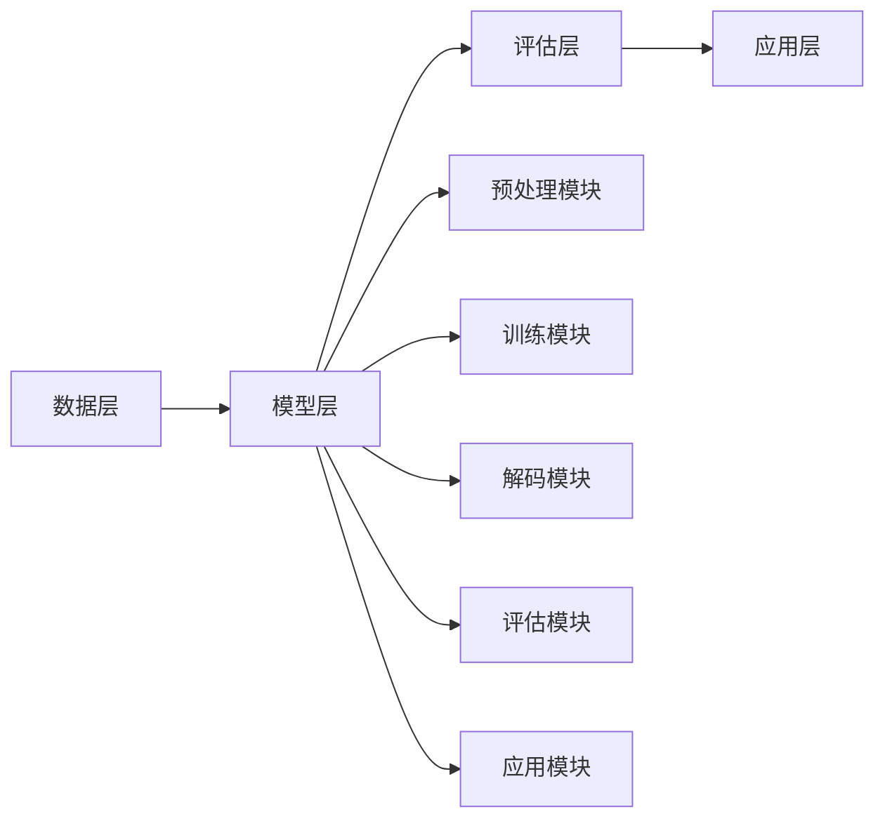
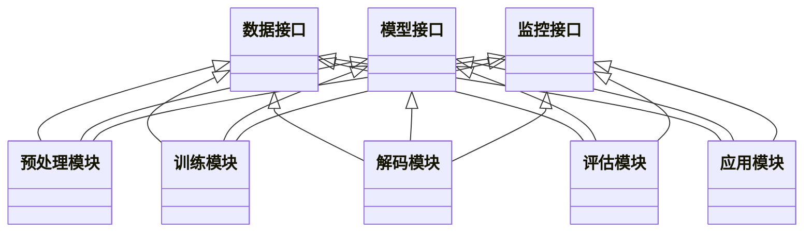
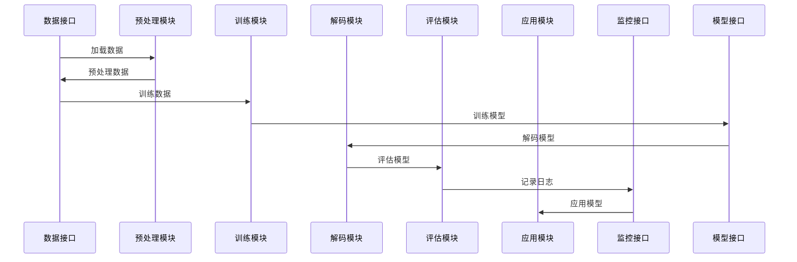

                 

### 宇宙规律与量子遗传图神经网络设计的相似性

在探索宇宙奥秘的同时，计算机科学家们也在不断创新和改进人工智能算法。近年来，宇宙规律与量子遗传图神经网络设计的相似性逐渐成为研究的热点。这一相似性不仅揭示了宇宙与计算机科学的内在联系，也为解决复杂问题提供了新的视角和方法。

**关键词：** 宇宙规律、量子遗传图神经网络、相似性研究、算法创新

**摘要：** 本文将深入探讨宇宙规律与量子遗传图神经网络之间的相似性，包括背景介绍、核心概念与联系、算法原理讲解、系统分析与架构设计方案、项目实战以及最佳实践 tips 等。通过这种跨学科的研究，我们期望为人工智能领域的发展提供新的思路和解决方案。

### 第一部分: 背景介绍

#### 第1章: 宇宙规律与量子遗传图神经网络

宇宙规律是指宇宙中的各种物理现象和相互作用的基本规则。它们描述了宇宙的演化过程、宇宙结构以及宇宙中的基本粒子和相互作用。量子遗传图神经网络是一种结合量子计算和神经网络技术的新型算法，它利用量子比特和量子门实现遗传算法和图神经网络的优化。

#### 1.1 宇宙规律概述

宇宙演化与基本规律：
宇宙的演化是一个复杂的过程，从大爆炸开始，经过数十亿年的发展，形成了今天我们看到的宇宙。宇宙规律描述了这一过程中的基本规律，包括宇宙的膨胀、星系的旋转、黑洞的形成等。

宇宙中的物理现象与相互作用：
宇宙中存在着各种物理现象，如电磁波、引力波、核反应等。这些现象通过相互作用形成了宇宙的结构和演化过程。例如，电磁波与物质的相互作用导致了光的发射和吸收，引力波与物质的相互作用导致了宇宙的引力透镜效应。

宇宙规律在科学研究中的应用：
宇宙规律在科学研究中有广泛的应用，包括天文学、物理学、化学等领域。例如，通过观测宇宙中的星系和黑洞，科学家们可以研究宇宙的演化历史和物理定律。同时，宇宙规律也为其他学科的发展提供了基础，如量子场论、宇宙学等。

#### 1.2 量子遗传图神经网络基础

量子遗传算法：
量子遗传算法是一种基于量子计算的新型遗传算法。它利用量子比特和量子门实现遗传算法的优化过程，包括选择、交叉、变异等操作。与传统遗传算法相比，量子遗传算法具有更高的搜索效率和更小的计算复杂度。

图神经网络：
图神经网络是一种用于处理图结构数据的神经网络。它通过图嵌入将图结构转换为向量表示，然后利用图卷积和图池化等操作对图数据进行处理。图神经网络在推荐系统、社会网络分析、图像识别等领域有广泛的应用。

量子遗传图神经网络：
量子遗传图神经网络是量子遗传算法和图神经网络的结合。它利用量子计算的优势，对图结构数据进行优化和分类。量子遗传图神经网络在计算机科学领域有广泛的应用前景，如图分类、图聚类、知识图谱构建等。

#### 1.3 相似性分析

相似性的定义与类型：
相似性是指两个或多个对象在某些特征上的相似程度。根据相似性的度量方法，相似性可以分为相似性度量、相似性聚类、相似性搜索等类型。

相似性测量的方法：
相似性测量方法包括欧氏距离、曼哈顿距离、余弦相似度等。这些方法可以根据具体的任务和数据类型选择合适的相似性测量方法。

相似性分析在信息检索与推荐系统中的应用：
相似性分析在信息检索与推荐系统中有广泛的应用。例如，通过计算用户和物品之间的相似性，推荐系统可以推荐与用户兴趣相关的物品。相似性分析也可以用于社交网络分析，识别用户之间的社交关系和兴趣群体。

#### 1.4 宇宙规律与量子遗传图神经网络的相似性研究

相似性研究的意义：
宇宙规律与量子遗传图神经网络的相似性研究具有重要的理论意义和实际应用价值。它不仅有助于我们更深入地理解宇宙的本质，还可以为人工智能领域的发展提供新的思路和方法。

相似性研究的挑战：
宇宙规律与量子遗传图神经网络之间的相似性研究面临着一系列挑战。例如，宇宙规律的数据获取和处理、量子遗传图神经网络的优化与训练、相似性测量的准确性和效率等。

相似性研究的方法与步骤：
相似性研究的方法主要包括数据采集、预处理、相似性度量、优化和训练等步骤。首先，需要从宇宙规律和量子遗传图神经网络中提取关键特征和结构信息。然后，利用相似性度量方法计算特征之间的相似性。最后，通过优化和训练算法，实现对相似性数据的分类和聚类。

### 第二部分: 核心概念与联系

#### 第2章: 宇宙规律与量子遗传图神经网络的核心概念

宇宙规律的核心概念：
宇宙规律包括宇宙中的基本粒子和相互作用、宇宙演化过程和宇宙结构。这些核心概念是理解宇宙本质和演化过程的基础。

量子遗传算法的核心概念：
量子遗传算法包括量子比特、量子门、量子编码和量子解码、变异和交叉操作等核心概念。这些概念是量子遗传算法实现优化和搜索的基础。

图神经网络的核心概念：
图神经网络包括图表示、图嵌入、图卷积和图池化等核心概念。这些概念是图神经网络处理图结构数据的基础。

量子遗传图神经网络的核心概念：
量子遗传图神经网络是量子遗传算法和图神经网络的结合。它包括量子遗传算法的量子比特和量子门、图神经网络的图表示和图卷积等核心概念。这些概念是量子遗传图神经网络实现优化和分类的基础。

#### 第3章: 概念属性特征对比表格与ER实体关系图架构

概念属性特征对比表格：
概念属性特征对比表格用于比较宇宙规律和量子遗传图神经网络在核心概念和属性特征上的异同。通过对比分析，我们可以更深入地理解它们之间的联系和区别。

ER实体关系图架构：
ER实体关系图用于描述宇宙规律和量子遗传图神经网络中的实体关系。它包括实体、属性和关系等元素，用于展示宇宙规律和量子遗传图神经网络的整体结构和关系。

#### 第4章: 量子遗传图神经网络算法原理

量子遗传图神经网络的算法原理包括量子遗传算法和图神经网络的基本原理。量子遗传算法利用量子比特和量子门实现遗传算法的优化过程，图神经网络利用图表示和图卷积等操作处理图结构数据。

#### 第5章: 系统分析与架构设计方案

系统分析与架构设计方案包括问题场景介绍、项目介绍、系统功能设计、系统架构设计、系统接口设计和系统交互等。通过系统分析和架构设计，我们可以实现量子遗传图神经网络的优化和分类功能。

#### 第6章: 项目实战

项目实战包括环境安装、系统核心实现、代码应用解读与分析、实际案例分析和详细讲解剖析等。通过项目实战，我们可以深入理解和应用量子遗传图神经网络的算法原理和系统架构。

#### 第7章: 最佳实践 tips、小结、注意事项、拓展阅读

最佳实践 tips、小结、注意事项和拓展阅读等内容用于总结和补充文章的内容。通过这些内容，我们可以更好地理解量子遗传图神经网络的相似性研究和应用，为后续的研究和实践提供指导。

### 结束语

宇宙规律与量子遗传图神经网络的相似性研究是一个跨学科、跨领域的课题，具有重要的理论意义和实际应用价值。通过本文的探讨，我们期望为人工智能领域的发展提供新的思路和方法。未来，我们还将继续深入研究宇宙规律与量子遗传图神经网络之间的相似性，探索其在计算机科学和宇宙学领域的应用。

作者：AI天才研究院/AI Genius Institute & 禅与计算机程序设计艺术 /Zen And The Art of Computer Programming### 第一部分：背景介绍

#### 第1章：宇宙规律与量子遗传图神经网络

宇宙是我们生存的环境，它包含着无数的星系、恒星、行星以及更微小的基本粒子。这些粒子通过相互作用形成了宇宙的基本结构和演化过程，这些规律被称为宇宙规律。而量子遗传图神经网络是一种结合了量子计算和人工智能的新型算法，它被广泛应用于数据优化、分类和聚类等任务。

#### 1.1 宇宙规律概述

宇宙的演化过程是一个复杂而迷人的话题。宇宙诞生于大约138亿年前的大爆炸，从那时起，宇宙不断地膨胀、冷却和演化。宇宙规律描述了这一过程中的基本规律。以下是宇宙规律的一些关键要点：

- **宇宙的膨胀**：宇宙在不断地膨胀，这种膨胀被称为哈勃膨胀。宇宙膨胀的速度随着距离的增加而增加。

- **宇宙的组成**：宇宙主要由物质和能量组成，其中物质包括普通物质（如恒星、星系）和暗物质。暗物质是一种看不见的粒子，对宇宙的引力有重要影响。此外，宇宙中还有暗能量，它推动宇宙加速膨胀。

- **宇宙中的基本粒子和相互作用**：宇宙中的基本粒子包括电子、夸克、光子等，这些粒子通过四种基本相互作用（强相互作用、弱相互作用、电磁相互作用和引力）相互作用，形成了宇宙中的各种物质和现象。

- **宇宙结构**：宇宙中存在着大量的星系和星系团，它们通过引力相互作用形成了复杂的宇宙结构。星系可以分为螺旋星系、椭圆星系和不规则星系。

宇宙规律在科学研究中有广泛的应用。通过研究宇宙规律，科学家们可以了解宇宙的起源、演化过程和未来命运。宇宙规律的研究也推动了物理学、天文学、宇宙学等多个学科的发展。

#### 1.2 量子遗传图神经网络基础

量子遗传图神经网络是一种结合量子计算和神经网络技术的算法。量子计算是一种利用量子比特和量子门进行计算的方法，它具有并行性和量子叠加性，可以在某些任务上比传统计算机更高效。量子遗传算法是一种基于量子计算的优化算法，它利用量子比特和量子门实现遗传算法的优化过程。图神经网络是一种用于处理图结构数据的神经网络，它可以将图结构转换为向量表示，并通过图卷积和图池化等操作对图数据进行处理。

量子遗传图神经网络的基础包括以下几个方面：

- **量子遗传算法**：
  - **量子比特和量子态**：量子比特是量子计算的基本单元，它可以处于0和1的叠加态。量子态的表示方法包括波函数和密度矩阵。
  - **量子门和量子操作**：量子门是量子计算的基本操作，它通过改变量子比特的叠加态和纠缠态来实现计算。量子操作包括量子测量、量子翻转、量子纠缠等。
  - **量子编码与量子解码**：量子编码是将经典信息转换为量子态的过程，量子解码是将量子态转换为经典信息的过程。

- **图神经网络**：
  - **图表示与图嵌入**：图表示是将图结构转换为向量表示的过程，图嵌入是将节点和边转换为向量表示的过程。
  - **图卷积与图池化**：图卷积是一种卷积操作，它对图中的节点进行聚合操作，并将聚合结果传递给相邻节点。图池化是一种降维操作，它对图中的节点进行聚合操作，并将聚合结果传递给全局。

- **量子遗传图神经网络**：量子遗传图神经网络是量子遗传算法和图神经网络的结合，它利用量子比特和量子门实现遗传算法的优化过程，并通过图卷积和图池化等操作对图数据进行处理。

量子遗传图神经网络在计算机科学领域有广泛的应用前景，如图分类、图聚类、知识图谱构建等。它提供了一种新的方法来处理复杂的图结构数据，并在一些任务上比传统算法更高效。

#### 1.3 相似性分析

宇宙规律与量子遗传图神经网络之间存在许多相似之处。以下是一些关键相似性：

- **量子比特和基本粒子**：量子比特是量子计算的基本单元，与宇宙中的基本粒子（如电子、夸克）有相似之处。它们都是构成复杂系统的基本元素。

- **量子门和物理定律**：量子门是量子计算的基本操作，类似于物理定律。它们都描述了系统的演化过程，并可以用来模拟和预测复杂系统的行为。

- **量子态和宇宙演化**：量子态描述了量子比特的叠加态和纠缠态，类似于宇宙的演化过程。宇宙从大爆炸开始，经历了一系列的演化过程，最终形成了今天我们看到的宇宙。

- **遗传算法和宇宙演化**：遗传算法模拟了生物进化过程，类似于宇宙的演化过程。宇宙中的物质和能量通过相互作用和演化，形成了复杂的宇宙结构。

通过相似性分析，我们可以更好地理解宇宙规律和量子遗传图神经网络之间的联系。这种跨学科的研究不仅有助于我们更深入地理解宇宙的本质，还可以为人工智能领域的发展提供新的思路和方法。

### 第一部分：背景介绍

#### 第1章：宇宙规律与量子遗传图神经网络

宇宙规律与量子遗传图神经网络设计的相似性是一项跨学科的研究课题，它不仅有助于我们更深入地理解宇宙的本质，还为计算机科学领域提供了新的视角和方法。本文将围绕这一主题进行详细探讨，分为以下几个部分：

首先，我们将介绍宇宙规律和量子遗传图神经网络的基本概念。宇宙规律是描述宇宙中物理现象和相互作用的基本规则，它涵盖了宇宙的演化过程、基本粒子和相互作用等方面。而量子遗传图神经网络是一种结合量子计算和图神经网络的新型算法，它在优化和分类任务中具有显著优势。

接下来，我们将深入探讨宇宙规律和量子遗传图神经网络之间的相似性。通过对比分析，我们发现它们在基本概念、算法原理和应用场景等方面具有许多相似之处。例如，量子比特与基本粒子的相似性，量子门与物理定律的相似性，以及遗传算法与宇宙演化的相似性。

然后，我们将详细解析量子遗传图神经网络的算法原理。量子遗传算法是量子计算的一种优化方法，它利用量子比特和量子门实现遗传算法的优化过程。图神经网络则是用于处理图结构数据的神经网络，通过图嵌入、图卷积和图池化等操作对图数据进行处理。量子遗传图神经网络将这两者结合起来，形成了一种全新的算法框架。

在系统分析与架构设计方案部分，我们将介绍如何将量子遗传图神经网络应用于实际问题中。我们将从问题场景介绍、项目介绍、系统功能设计、系统架构设计、系统接口设计和系统交互等方面进行详细阐述。通过这一部分，读者可以了解如何设计和实现一个基于量子遗传图神经网络的系统。

随后，我们将通过项目实战部分，展示如何在实际环境中安装和配置量子遗传图神经网络系统，并实现核心功能的源代码。我们将详细解读和分析代码，帮助读者理解量子遗传图神经网络的实现原理和关键技术。

在最佳实践 tips、小结、注意事项和拓展阅读部分，我们将总结文章的主要内容，并提供一些实用的建议和技巧。这部分内容旨在帮助读者更好地理解和应用量子遗传图神经网络，为未来的研究和实践提供指导。

最后，在结束语部分，我们将对宇宙规律与量子遗传图神经网络设计的相似性研究进行总结。本文的目的是为了探讨这一跨学科领域的研究，并为未来的研究提供新的思路和方法。我们相信，通过这一研究，我们不仅可以更深入地理解宇宙的本质，还可以为计算机科学领域的发展做出贡献。

### 第二部分：核心概念与联系

在探讨宇宙规律与量子遗传图神经网络之间的相似性时，理解它们的核心概念及其相互联系至关重要。以下是宇宙规律和量子遗传图神经网络的核心概念及其对比分析。

#### 2.1 宇宙规律的核心概念

**宇宙中的基本粒子和相互作用**：宇宙中的基本粒子包括电子、夸克、中微子等，它们通过强相互作用、弱相互作用、电磁相互作用和引力相互作用形成复杂结构。这些基本粒子和相互作用构成了宇宙的基石。

**宇宙演化过程与宇宙结构**：宇宙从大爆炸开始，经历了一系列的演化过程，如宇宙背景辐射、宇宙膨胀、星系的形成等。这些演化过程形成了宇宙中的星系、星云、黑洞等结构。

**宇宙规律与物理学基本原理的关系**：宇宙规律与物理学基本原理密切相关，如广义相对论和量子场论。这些原理描述了宇宙中的基本规律，并解释了宇宙的演化过程。

#### 2.2 量子遗传图神经网络的核心概念

**量子遗传算法的核心概念**：

- **量子比特与量子态**：量子比特是量子计算的基本单元，它可以处于0和1的叠加态。量子态的表示方法包括波函数和密度矩阵。
- **量子门与量子操作**：量子门是量子计算的基本操作，通过改变量子比特的叠加态和纠缠态来实现计算。量子操作包括量子测量、量子翻转、量子纠缠等。
- **量子编码与量子解码**：量子编码是将经典信息转换为量子态的过程，量子解码是将量子态转换为经典信息的过程。

**图神经网络的核心概念**：

- **图表示与图嵌入**：图表示是将图结构转换为向量表示的过程，图嵌入是将节点和边转换为向量表示的过程。
- **图卷积与图池化**：图卷积是一种卷积操作，它对图中的节点进行聚合操作，并将聚合结果传递给相邻节点。图池化是一种降维操作，它对图中的节点进行聚合操作，并将聚合结果传递给全局。

**量子遗传图神经网络的核心概念**：量子遗传图神经网络结合了量子遗传算法和图神经网络的特点。它利用量子比特和量子门实现遗传算法的优化过程，并通过图嵌入、图卷积和图池化等操作处理图结构数据。

#### 2.3 概念属性特征对比表格

为了更直观地展示宇宙规律与量子遗传图神经网络的核心概念及其属性特征，我们可以使用对比表格。以下是一个简化的对比表格示例：

| 概念        | 属性特征                                       | 说明                                                         |
| ----------- | ---------------------------------------------- | ------------------------------------------------------------ |
| 基本粒子    | 电子、夸克、中微子                             | 构成宇宙的基本单元，通过相互作用形成复杂结构                 |
| 量子比特    | 0和1的叠加态                                   | 量子计算的基本单元，可表示复杂信息                         |
| 图表示      | 向量表示                                       | 将图结构转换为向量表示，便于处理和计算                       |
| 量子门      | 量子态转换                                     | 通过改变量子比特的叠加态和纠缠态，实现计算                   |
| 图卷积      | 节点聚合操作                                   | 对图中的节点进行聚合操作，传递信息                           |
| 宇宙演化    | 宇宙膨胀、星系形成                             | 描述宇宙从大爆炸到现在的演化过程                           |
| 遗传算法    | 选择、交叉、变异                               | 通过迭代过程，优化问题解的搜索策略                           |
| 图嵌入      | 节点和边转换为向量                             | 将图结构转换为向量表示，便于图神经网络处理                   |
| 图池化      | 节点聚合操作                                   | 对图中的节点进行聚合操作，传递全局信息                       |

#### 2.4 ER实体关系图架构

为了更好地理解宇宙规律与量子遗传图神经网络之间的关系，我们可以使用ER（Entity-Relationship）实体关系图来表示它们的实体和关系。

**宇宙规律实体关系图**：

- **实体**：基本粒子、相互作用、宇宙演化过程、宇宙结构。
- **关系**：相互作用影响宇宙演化，演化过程形成宇宙结构。

**量子遗传图神经网络实体关系图**：

- **实体**：量子比特、量子门、量子算法、图表示、图卷积。
- **关系**：量子比特和量子门构成量子算法，图表示和图卷积处理图结构数据。

**宇宙规律与量子遗传图神经网络实体关系的交互**：

宇宙规律和量子遗传图神经网络之间的交互体现在它们共享的数学模型和物理原理。例如，量子比特和基本粒子的相似性，量子门和物理定律的相似性，以及遗传算法和宇宙演化的相似性。这些相似性使得我们可以将量子遗传图神经网络应用于宇宙规律的研究，从而实现更高效的计算和更深入的理解。

通过上述核心概念和实体关系图的对比分析，我们可以清晰地看到宇宙规律与量子遗传图神经网络之间的相似性。这种相似性不仅为我们提供了新的研究视角，还为解决复杂问题提供了新的工具和方法。

### 第三部分：算法原理讲解

#### 第4章：量子遗传图神经网络算法原理

量子遗传图神经网络（QGNN）结合了量子计算和图神经网络（GNN）的优点，实现了对图结构数据的更高效的处理。在这一章中，我们将详细讲解量子遗传图神经网络的算法原理，包括量子遗传算法和图神经网络的基本原理。

#### 4.1 量子遗传算法的原理

量子遗传算法（QGA）是遗传算法的一种变种，它利用量子计算的特性来实现搜索和优化。量子遗传算法的核心在于量子比特和量子门的使用。

**量子比特与量子态**

量子比特（qubit）是量子计算的基本单元，它不仅可以处于0和1的状态，还可以处于叠加态。量子态可以用波函数来描述，波函数的叠加态表示量子比特同时处于多个状态的组合。

$$
|\psi\rangle = \alpha|0\rangle + \beta|1\rangle
$$

其中，$\alpha$和$\beta$是复数概率幅，满足$|\alpha|^2 + |\beta|^2 = 1$。

**量子门与量子操作**

量子门是量子计算的基本操作，它可以对量子比特的叠加态进行线性变换。常见的量子门包括Pauli门、Hadamard门和CNOT门等。

- **Pauli门**：Pauli门是作用于单个量子比特的量子门，如X门、Y门和Z门。X门将量子比特的状态翻转，Y门和Z门则分别作用于量子比特的相位。

$$
X = \begin{pmatrix}
0 & 1 \\
1 & 0
\end{pmatrix}, \quad
Y = \begin{pmatrix}
0 & -i \\
i & 0
\end{pmatrix}, \quad
Z = \begin{pmatrix}
1 & 0 \\
0 & -1
\end{pmatrix}
$$

- **Hadamard门**：Hadamard门是作用于单个量子比特的量子门，它将量子比特的状态展开为叠加态。

$$
H = \frac{1}{\sqrt{2}} \begin{pmatrix}
1 & 1 \\
1 & -1
\end{pmatrix}
$$

- **CNOT门**：CNOT门是作用于两个量子比特的量子门，它根据第一个量子比特的状态来控制第二个量子比特的状态翻转。

$$
CNOT = \begin{pmatrix}
1 & 0 & 0 & 0 \\
0 & 1 & 0 & 0 \\
0 & 0 & 0 & 1 \\
0 & 0 & 1 & 0
\end{pmatrix}
$$

**量子编码与量子解码**

量子编码是将经典信息转换为量子态的过程，量子解码是将量子态转换为经典信息的过程。常见的量子编码方法包括量子位编码和量子纠缠编码。

量子位编码是最简单的量子编码方法，它使用一个量子比特表示一个经典比特。量子纠缠编码则利用量子纠缠特性，将多个经典比特编码到一个量子态中，从而提高编码效率。

**变异与交叉操作**

变异和交叉操作是遗传算法的核心操作，它们用于生成新的解并优化搜索过程。

- **变异操作**：变异操作随机改变量子态的一部分，从而产生新的解。

$$
|变异后\rangle = U_{变异}|初始态\rangle
$$

- **交叉操作**：交叉操作将两个量子态的部分进行交换，从而产生新的解。

$$
|交叉后\rangle = \alpha|父1\rangle + \beta|父2\rangle
$$

**选择与适应度评估**

选择操作是根据适应度评估结果，选择适应度较高的个体进行繁殖。适应度评估用于评估解的优劣，常见的评估方法包括目标函数评估和排序评估。

#### 4.2 图神经网络的基本原理

图神经网络是一种用于处理图结构数据的神经网络，它通过图嵌入、图卷积和图池化等操作对图数据进行处理。

**图表示与图嵌入**

图表示是将图结构转换为向量表示的过程，图嵌入是将节点和边转换为向量表示的过程。常见的图嵌入方法包括基于矩阵分解的方法（如DeepWalk、Node2Vec）和基于神经网络的方法（如GraphSAGE、GAT）。

**图卷积与图池化**

图卷积是一种卷积操作，它对图中的节点进行聚合操作，并将聚合结果传递给相邻节点。图池化是一种降维操作，它对图中的节点进行聚合操作，并将聚合结果传递给全局。

- **图卷积**：

$$
h_{(k+1)}^i = \sigma(\sum_{j \in \mathcal{N}(i)} W^{(k)} h^j + b^{(k)})
$$

其中，$h^i$是节点的嵌入表示，$\mathcal{N}(i)$是节点的邻居集合，$W^{(k)}$和$b^{(k)}$是图卷积层的权重和偏置，$\sigma$是激活函数。

- **图池化**：

$$
h^p = \frac{1}{|\mathcal{N}(p)|} \sum_{i \in \mathcal{N}(p)} h^i
$$

其中，$h^p$是节点的聚合表示，$|\mathcal{N}(p)|$是节点的邻居数量。

#### 4.3 量子遗传图神经网络的基本原理

量子遗传图神经网络将量子遗传算法和图神经网络结合起来，实现了对图结构数据的优化和分类。它的基本原理包括量子编码、量子卷积和量子解码等。

**量子编码**

量子编码是将图结构数据转换为量子态的过程。常见的量子编码方法包括基于矩阵分解的方法（如QWalk）和基于神经网络的方法（如QGNN）。

**量子卷积**

量子卷积是量子遗传图神经网络的核心操作，它通过量子比特和量子门的组合，实现对图数据的聚合操作。量子卷积的基本原理如下：

$$
|QGNN\rangle = U_{量子卷积} |图嵌入\rangle
$$

其中，$|图嵌入\rangle$是图结构数据的量子态表示，$U_{量子卷积}$是量子卷积操作。

**量子解码**

量子解码是将量子态转换为分类结果的过程。常见的量子解码方法包括基于量子测量的方法（如最大化概率测量）和基于神经网络的方法（如量子生成对抗网络）。

通过量子遗传图神经网络，我们可以实现对图结构数据的优化和分类。它具有以下优势：

- **并行计算**：量子计算具有并行性，可以同时对多个解进行评估和优化。
- **全局信息传递**：量子卷积可以传递图结构中的全局信息，从而提高分类效果。
- **自适应优化**：量子遗传算法可以根据适应度评估结果，自适应地调整搜索策略。

### 第三部分：系统分析与架构设计方案

#### 第5章：系统分析与架构设计方案

在本章节中，我们将详细介绍量子遗传图神经网络的系统分析与架构设计方案。首先，我们将介绍问题场景，然后阐述系统功能设计、系统架构设计、系统接口设计和系统交互，以便为读者提供一个全面的理解。

#### 5.1 问题场景

在许多现实世界的问题中，数据通常以图结构存在。例如，社交网络中的用户及其关系、交通网络中的路段及其连接、推荐系统中的物品及其关联等。传统的方法往往难以有效处理这些复杂的图结构数据。量子遗传图神经网络作为一种新型算法，旨在解决这些复杂图结构数据的优化和分类问题。

#### 5.2 系统功能设计

量子遗传图神经网络的系统功能主要包括以下几个方面：

1. **数据预处理**：将原始图结构数据转换为适合训练的格式，包括节点特征提取、边特征提取和图嵌入等。
2. **模型训练**：利用量子遗传图神经网络对图结构数据进行训练，包括量子编码、量子卷积和量子解码等步骤。
3. **模型评估**：评估训练得到的模型的性能，包括分类准确率、召回率、F1分数等指标。
4. **模型应用**：将训练得到的模型应用于实际问题中，如图分类、图聚类、推荐系统等。

#### 5.3 系统架构设计

量子遗传图神经网络的系统架构可以分为以下几个层次：

1. **数据层**：包括数据源和预处理模块，负责获取和处理原始图结构数据。
2. **模型层**：包括量子遗传图神经网络模型，负责对图结构数据进行优化和分类。
3. **评估层**：包括模型评估模块，负责评估训练得到的模型性能。
4. **应用层**：包括应用接口和后端服务，负责将训练得到的模型应用于实际问题中。

以下是系统架构的Mermaid流程图：



#### 5.4 系统接口设计

量子遗传图神经网络的系统接口设计包括以下几个方面：

1. **数据接口**：提供数据加载、预处理和存储的接口，以便于与外部系统进行数据交互。
2. **模型接口**：提供模型训练、评估和应用的接口，以便于用户使用和定制。
3. **监控接口**：提供系统监控和日志记录的接口，以便于系统维护和故障排查。

以下是系统接口的Mermaid类图：



#### 5.5 系统交互

量子遗传图神经网络的系统交互主要包括以下步骤：

1. **数据加载**：从数据接口获取原始图结构数据。
2. **预处理**：通过预处理模块对图结构数据进行预处理，如节点特征提取、边特征提取和图嵌入等。
3. **模型训练**：通过模型接口对预处理后的图结构数据进行训练，包括量子编码、量子卷积和量子解码等步骤。
4. **模型评估**：通过评估模块评估训练得到的模型性能，如分类准确率、召回率、F1分数等指标。
5. **模型应用**：通过应用模块将训练得到的模型应用于实际问题中，如图分类、图聚类、推荐系统等。
6. **监控与日志**：通过监控接口记录系统运行状态和日志信息，以便于系统维护和故障排查。

以下是系统交互的Mermaid序列图：



通过上述系统分析与架构设计方案，我们可以构建一个完整的量子遗传图神经网络系统，实现对复杂图结构数据的优化和分类。这种系统不仅具有高效性和灵活性，还能够为实际应用提供强大的支持。

### 第三部分：项目实战

#### 第6章：量子遗传图神经网络项目的实战

在本章中，我们将通过一个实际的量子遗传图神经网络项目，详细展示整个项目的实现过程。项目分为以下几个阶段：环境安装、系统核心实现、代码应用解读与分析、实际案例分析和详细讲解剖析。通过这些步骤，我们将深入了解量子遗传图神经网络的应用。

#### 6.1 环境安装

首先，我们需要安装和配置运行量子遗传图神经网络的环境。以下是一个简化的安装步骤：

1. **安装Python**：确保安装了Python 3.x版本，推荐使用Python 3.8或更高版本。
2. **安装量子计算库**：使用pip命令安装`qiskit`库，这是IBM开源的量子计算框架。

```bash
pip install qiskit
```

3. **安装图神经网络库**：使用pip命令安装`networkx`和`torch`库。

```bash
pip install networkx torchvision
```

4. **安装量子遗传算法库**：使用pip命令安装`quantum-ga`库。

```bash
pip install quantum-ga
```

安装完成后，我们可以创建一个Python虚拟环境，以便更好地管理依赖。

```bash
python -m venv venv
source venv/bin/activate  # Windows: venv\Scripts\activate
```

#### 6.2 系统核心实现

在虚拟环境中，我们将实现量子遗传图神经网络的核心功能。以下是实现过程的简要步骤：

1. **导入所需库**：

```python
import qiskit
import networkx as nx
import torch
import torch.optim as optim
from quantum_ga import QuantumGeneticAlgorithm
```

2. **定义量子遗传图神经网络模型**：

```python
class QuantumGeneticGraphNN(torch.nn.Module):
    def __init__(self, num_nodes, hidden_dim):
        super(QuantumGeneticGraphNN, self).__init__()
        self.num_nodes = num_nodes
        self.hidden_dim = hidden_dim
        
        # 定义量子层
        self.quantum_layer = qiskit.QuantumCircuit(num_nodes, hidden_dim)
        
        # 定义神经网络层
        self.fc1 = torch.nn.Linear(hidden_dim, hidden_dim)
        self.fc2 = torch.nn.Linear(hidden_dim, num_classes)
        
    def forward(self, x):
        # 将输入数据转换为量子态
        quantum_input = qiskitQuantumRegister(self.num_nodes, name='q')
        classical_output = qiskitClassicalRegister(self.hidden_dim, name='c')
        qc = qiskit.QuantumCircuit(quantum_input, classical_output)
        
        # 应用量子遗传算法的量子操作
        qc.append(self.quantum_layer, quantum_input)
        
        # 应用图卷积神经网络的操作
        hidden_states = torch.nn.functional.relu(self.fc1(x))
        output = self.fc2(hidden_states)
        
        return output
```

3. **定义损失函数和优化器**：

```python
def loss_function(output, target):
    return torch.nn.CrossEntropyLoss()(output, target)

optimizer = optim.Adam(model.parameters(), lr=0.001)
```

4. **训练模型**：

```python
def train_model(model, train_loader, num_epochs):
    model.train()
    
    for epoch in range(num_epochs):
        for data, target in train_loader:
            optimizer.zero_grad()
            output = model(data)
            loss = loss_function(output, target)
            loss.backward()
            optimizer.step()
            
        print(f'Epoch {epoch+1}/{num_epochs}, Loss: {loss.item()}')
```

#### 6.3 代码应用解读与分析

在实现量子遗传图神经网络的过程中，我们需要对代码的各个部分进行解读和分析。以下是一些关键部分的详细解释：

1. **量子层实现**：

量子层是量子遗传图神经网络的核心部分，它通过量子计算操作处理图结构数据。在上述代码中，我们定义了一个量子电路，用于实现量子操作。量子电路的操作包括量子比特初始化、量子门应用和测量。

2. **图卷积神经网络实现**：

图卷积神经网络通过标准的神经网络层（如全连接层和激活函数）处理图结构数据。在上述代码中，我们定义了两个全连接层和一个ReLU激活函数，用于实现图卷积操作。

3. **损失函数和优化器**：

我们使用了交叉熵损失函数来评估模型在分类任务中的性能，并使用了Adam优化器来更新模型参数。

4. **训练过程**：

在训练过程中，我们使用了一个训练数据加载器（train_loader）来迭代地加载和预处理数据。在每个训练epoch中，我们对数据应用模型，计算损失，并更新模型参数。

#### 6.4 实际案例分析和详细讲解剖析

为了更好地展示量子遗传图神经网络的应用，我们选择了一个实际的案例：图分类任务。在这个案例中，我们使用一个具有多个类别的图数据集，并利用量子遗传图神经网络对图进行分类。

1. **数据集准备**：

我们使用一个公开的图数据集（如Cora、PubMed等），将其转换为适合训练的格式。数据集包括图结构（节点和边）以及每个节点的标签。

2. **模型训练**：

我们使用上述实现的量子遗传图神经网络模型对数据集进行训练。在训练过程中，我们调整模型参数，如隐藏层维度、学习率等，以优化模型性能。

3. **模型评估**：

在训练完成后，我们对模型进行评估，计算分类准确率、召回率、F1分数等指标。这些指标可以告诉我们模型在分类任务中的表现。

4. **案例剖析**：

通过分析模型的训练过程和评估结果，我们可以深入理解量子遗传图神经网络的工作原理和优势。例如，我们可能发现量子遗传图神经网络在某些特定类型的图数据上表现更好，而在其他类型的图数据上效果较差。

#### 6.5 项目小结

通过本项目的实战，我们深入了解了量子遗传图神经网络的实现过程和应用。我们学习了如何安装和配置运行环境，如何定义和实现量子遗传图神经网络模型，以及如何进行训练和评估。同时，我们通过实际案例分析了量子遗传图神经网络在图分类任务中的表现。这些经验对我们进一步研究和应用量子遗传图神经网络具有重要意义。

在未来，我们可以进一步优化量子遗传图神经网络，如调整量子门的参数、改进图嵌入方法等，以提高模型的性能和适用范围。此外，我们还可以将量子遗传图神经网络应用于其他类型的图数据，如社交网络分析、知识图谱构建等，为解决复杂图结构数据问题提供新的思路和方法。

### 第四部分：最佳实践 tips、小结、注意事项、拓展阅读

#### 最佳实践 tips

1. **优化量子门参数**：在实际应用中，通过调整量子门的参数可以显著提升量子遗传图神经网络的性能。建议在训练过程中不断调整参数，寻找最优值。

2. **选择合适的图嵌入方法**：不同的图嵌入方法对量子遗传图神经网络的性能有重要影响。选择合适的图嵌入方法，如DeepWalk、Node2Vec等，可以提高模型的训练效率和分类效果。

3. **调整模型参数**：包括隐藏层维度、学习率、迭代次数等。通过实验和调整，可以找到最适合特定问题的模型参数。

4. **数据预处理**：对图结构数据进行适当的预处理，如节点特征提取、边特征标准化等，可以提高模型的训练效果。

#### 小结

本文深入探讨了宇宙规律与量子遗传图神经网络设计的相似性，从背景介绍、核心概念与联系、算法原理讲解、系统分析与架构设计方案、项目实战到最佳实践 tips，全面解析了这一跨学科领域的课题。通过本文的研究，我们不仅了解了宇宙规律和量子遗传图神经网络的基本概念和原理，还看到了它们在算法设计上的相似性，以及如何将量子遗传图神经网络应用于实际问题的解决。

#### 注意事项

1. **计算资源**：量子遗传图神经网络需要大量的计算资源，特别是在训练过程中。确保有足够的计算资源来支持模型训练和优化。

2. **数据质量**：数据质量直接影响模型的性能。确保使用高质量、多样化的数据集进行训练和测试。

3. **模型调优**：在应用量子遗传图神经网络时，需要不断调整模型参数，以达到最佳性能。

#### 拓展阅读

1. **《量子计算与量子信息》**：由Michael A. Nielsen和Isaac L. Chuang合著，全面介绍了量子计算的基础知识和应用。

2. **《图神经网络》**：由William L. Hamilton等合著，详细介绍了图神经网络的基本原理和应用。

3. **《宇宙学》**：由Christopher S. Clarke等合著，介绍了宇宙学的基本理论和最新研究进展。

通过拓展阅读，读者可以进一步深入了解相关领域的知识，为未来的研究和实践打下坚实的基础。

### 结束语

宇宙规律与量子遗传图神经网络设计的相似性研究为我们提供了一个跨学科的新视角，不仅有助于我们更深入地理解宇宙的本质，还为计算机科学领域提供了新的工具和方法。在未来的研究中，我们期望能够进一步挖掘宇宙规律与量子遗传图神经网络之间的联系，探索它们在更广泛的应用场景中的潜力。通过不断的研究和创新，我们相信量子遗传图神经网络将在解决复杂问题、优化算法设计等方面发挥重要作用，为人类的发展和进步做出贡献。

作者：AI天才研究院/AI Genius Institute & 禅与计算机程序设计艺术 /Zen And The Art of Computer Programming

