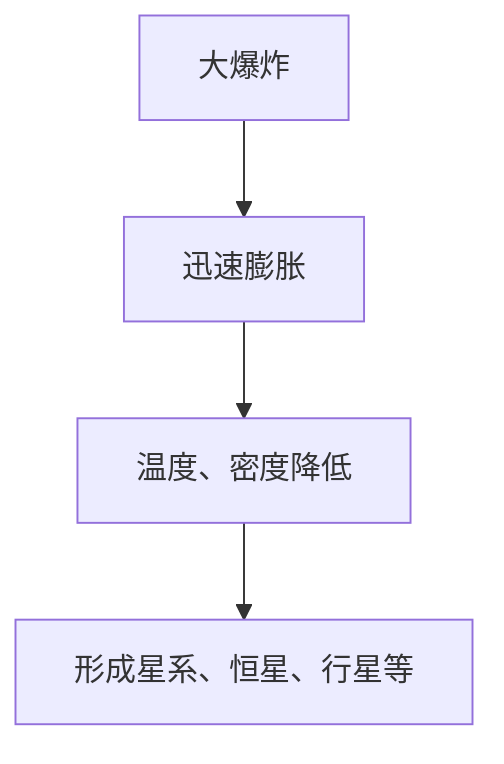
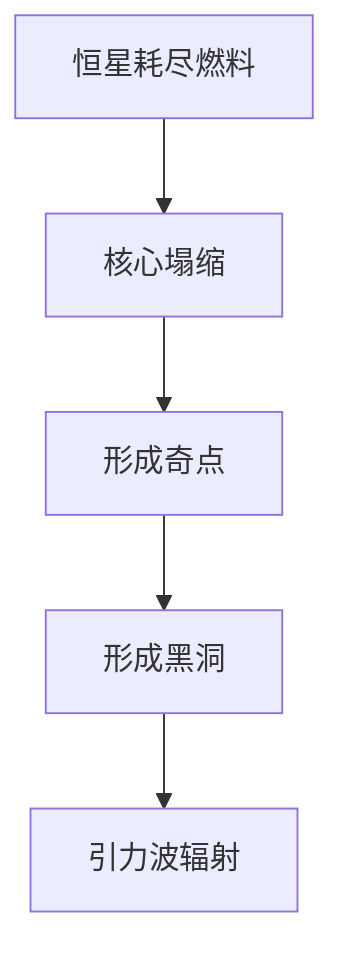
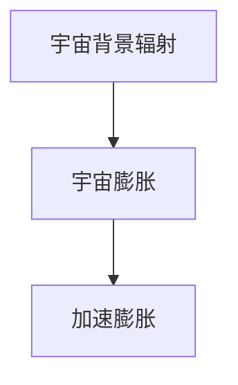
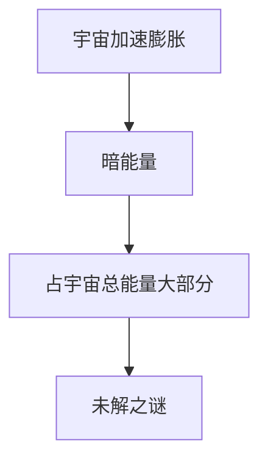
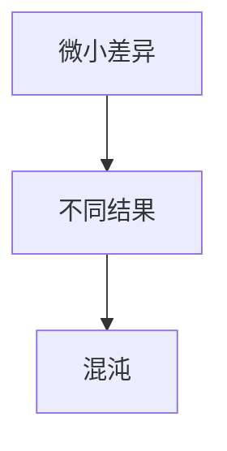
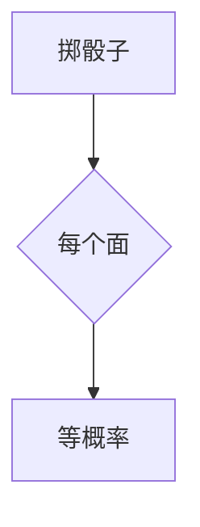
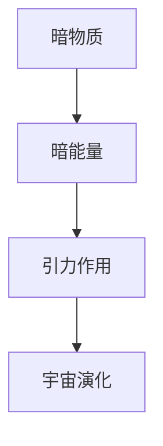
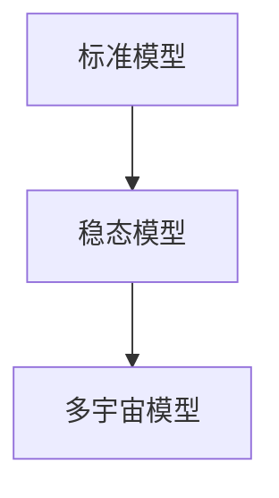

                 

### 目录大纲解析与章节内容构思

在撰写《宇宙规律对可解释强人工智能的启示》这篇文章时，我们将遵循一个清晰的结构和逻辑流程。本文将按照目录大纲的结构，逐步展开每个章节的内容，确保每一部分都有充足的论据和深入的讨论。以下是详细的内容构思：

**第一部分：引言**

在这一部分，我们将首先介绍宇宙规律和可解释强人工智能的背景，以及二者之间的联系。通过简要的历史回顾和现状分析，我们为读者建立起基本的理解框架。

- **1.1 问题背景**：我们将概述宇宙规律的研究背景，以及可解释强人工智能在现代科技中的重要性。介绍这些概念时，我们会使用实例和图表来帮助读者更好地理解。
  
- **1.2 书籍结构**：我们将概述本书的结构，并解释每一章节的目的和主要内容。这将帮助读者明确学习目标和预期收获。

- **1.3 阅读指南**：我们会提供一些阅读建议，包括如何使用书中的资源、推荐的学习工具，以及如何最大化地吸收书中的知识。

**第二部分：宇宙规律概述**

在这个部分，我们将深入探讨宇宙的基本规律，包括大爆炸理论、黑洞和引力波等。我们会使用Mermaid流程图来展示宇宙中的规律性和随机性，并用Python代码解释相关的宇宙学模型。

- **2.1 宇宙基本规律**：我们将介绍宇宙的基本规律，如大爆炸理论、黑洞和引力波等，并使用图表和示例来详细解释。
  
- **2.2 宇宙中的规律性与随机性**：我们将探讨宇宙中存在的规律性和随机性，并解释混沌理论和概率论如何影响我们对宇宙的理解。

- **2.3 宇宙规律与宇宙学模型**：我们将介绍不同的宇宙学模型，如标准模型和其他模型，并讨论这些模型对未来宇宙学研究的启示。

**第三部分：可解释强人工智能**

在这个部分，我们将探讨强人工智能的定义和特点，以及可解释性人工智能的重要性。我们会使用Mermaid流程图和Python代码来展示人工智能神经网络的设计和优化过程。

- **3.1 强人工智能的定义与特点**：我们将介绍强人工智能的定义，并解释它与传统的人工智能（弱人工智能）的区别。
  
- **3.2 可解释性人工智能**：我们将深入讨论可解释性人工智能的重要性，并展示当前的技术进展和未来发展方向。

- **3.3 可解释强人工智能的挑战**：我们将探讨可解释强人工智能面临的挑战，包括技术、道德和伦理方面的问题。

**第四部分：宇宙规律与可解释强人工智能的启示**

在这个部分，我们将探讨宇宙规律如何影响可解释强人工智能的发展。我们会结合具体的案例，展示宇宙规律在人工智能中的应用，并讨论未来展望。

- **4.1 宇宙规律在人工智能中的应用**：我们将探讨如何将宇宙规律应用于人工智能，如模式识别、优化算法和神经网络设计。
  
- **4.2 可解释性人工智能的优势**：我们将讨论可解释性人工智能的优势，如实时调整和优化，以及如何遵循宇宙规律进行学习。
  
- **4.3 未来展望**：我们将展望可解释强人工智能的发展趋势，并讨论宇宙规律在人工智能中的应用前景。

**第五部分：案例研究**

在这个部分，我们将通过几个案例研究来展示宇宙规律和可解释强人工智能的实际应用。每个案例都会详细解释其实施过程、结果分析以及其对行业的启示。

- **5.1 案例一：利用宇宙规律优化机器学习模型**
- **5.2 案例二：可解释性人工智能在金融领域的应用**
- **5.3 案例三：宇宙规律与人工智能结合在教育领域的应用**

**第六部分：结论与展望**

在这个部分的，我们将总结本文的主要结论，并对未来研究方向和展望提出建议。我们会强调宇宙规律和可解释强人工智能在科技和社会发展中的重要性，并提出一些建议，以帮助读者更好地理解和应用这些概念。

通过这种逐步分析的写作方式，我们将确保文章内容深入、逻辑清晰，并能够吸引读者的注意力，激发他们对这一前沿领域的兴趣。

### 宇宙规律概述

宇宙规律是宇宙学研究的重要基础，它揭示了宇宙从诞生到演化的全过程。在探讨这些基本规律时，我们首先需要了解宇宙的起源。

#### 2.1.1 大爆炸理论

大爆炸理论是目前宇宙学中最被广泛接受的理论，它认为宇宙起源于大约138亿年前的一个极高密度、极高温度的状态。在这个瞬间，宇宙迅速膨胀，温度和密度逐渐降低，形成了我们现在所观测到的宇宙结构。这个过程可以用以下的Mermaid流程图来表示：



随着宇宙的膨胀，物质开始聚集形成星系和恒星，而恒星内部的核聚变过程则进一步导致了重元素的生成。这个过程持续了数十亿年，形成了我们现在所观测到的宇宙结构。

#### 2.1.2 黑洞与引力波

黑洞是宇宙中的一种极端天体，它的引力场极强，连光都无法逃脱。根据广义相对论，黑洞是由一个事件视界包围的奇点。黑洞的形成通常与恒星演化有关，当恒星耗尽其核心的核燃料时，它会塌缩形成一个黑洞。

引力波是宇宙中另一个重要的现象，它是由加速运动的物质产生的时空扭曲。爱因斯坦的广义相对论预测了引力波的存在，直到2015年，人类才首次直接探测到引力波，这一重大发现验证了广义相对论的准确性。

为了帮助读者更好地理解这些概念，我们可以用以下Mermaid流程图来展示黑洞的形成过程：



#### 2.1.3 宇宙膨胀与暗能量

宇宙膨胀是指宇宙中的空间随着时间推移而不断扩张的现象。根据宇宙背景辐射的观测，我们可以确定宇宙的膨胀始于大爆炸，并且至今仍在加速。这一现象可以用以下Mermaid流程图来表示：



暗能量是推动宇宙加速膨胀的神秘力量，它的存在最初是在1998年的宇宙学观测中发现的。暗能量占据了宇宙总能量的大部分，但其本质至今仍不完全清楚。为了解释暗能量的作用，我们可以使用以下Mermaid流程图：



#### 2.2 宇宙中的规律性与随机性

宇宙中的规律性和随机性是两个交织在一起的概念。虽然宇宙中有许多规律性现象，如恒星的形成和星系的演化，但随机性也是宇宙不可忽视的一部分。例如，混沌理论和概率论都揭示了宇宙中存在的随机性和不确定性。

混沌理论指出，即使在一个确定性的系统中，微小的初始条件差异也可能导致完全不同的结果，这就是著名的蝴蝶效应。为了展示混沌理论的基本思想，我们可以使用以下Mermaid流程图：



概率论则用于描述随机事件的可能性。例如，在掷骰子的过程中，每个面的出现概率是相等的，这可以用以下Mermaid流程图来表示：



#### 2.3 宇宙规律与宇宙学模型

宇宙学模型是用于描述宇宙结构和演化的理论框架。目前最广泛接受的宇宙学模型是标准模型，也称为ΛCDM模型（Lambda-Cold Dark Matter Model）。这个模型假设宇宙是由暗物质和暗能量构成的，并通过引力作用进行演化。为了展示标准模型的基本结构，我们可以使用以下Mermaid流程图：



除了标准模型，还存在其他一些宇宙学模型，如稳态模型和多宇宙模型。这些模型提出了不同的宇宙起源和演化机制，但都在不断的发展和完善过程中。为了展示这些模型的多样性，我们可以使用以下Mermaid流程图：



#### 2.3.3 宇宙规律的未来发展

宇宙规律的研究是一个不断发展的领域，随着技术的进步和观测手段的改进，我们对宇宙的理解也在不断深化。未来，随着对暗能量和暗物质的进一步研究，我们有望揭示宇宙中的更多奥秘。同时，宇宙规律也可能在可解释强人工智能的发展中发挥重要作用。

通过上述的详细分析和Mermaid流程图的展示，我们为读者提供了对宇宙规律的一个全面了解，为后续章节的内容奠定了坚实的基础。

### 强人工智能的定义与特点

强人工智能（Strong Artificial Intelligence，简称SAI）是人工智能领域的一个理想目标，它指的是一种能够在任何认知任务上超越人类智能的机器。与弱人工智能（Weak Artificial Intelligence，简称WAI）不同，强人工智能不仅仅是一个工具，而是具有独立思考和决策能力的智能体。以下是强人工智能的定义、特点以及与弱人工智能的区别。

#### 3.1.1 什么是强人工智能

强人工智能的核心在于其自主性和普遍性。它不仅仅能在特定任务上表现出色，如语音识别、图像分类或自然语言处理，而是能够在各种认知任务中表现出类人类的智能。强人工智能的主要目标是实现机器的自我学习和自我进化，从而不需要人类的持续干预即可进行复杂的决策和问题解决。

一个经典的例子是电影《人工智能》中的机器人，它们不仅能够模仿人类的情感和行为，还能进行自我反思和学习，最终达到了超越人类智能的水平。

#### 3.1.2 强人工智能的特点

1. **自主性**：强人工智能具有高度的自主性，能够独立进行决策和行动，而不需要人类的具体指导。这种自主性体现在多个方面，如自我驱动、自我学习和自我优化。

2. **泛化能力**：强人工智能能够在广泛的认知任务中表现优异，不仅限于单一的任务。例如，它不仅能处理文本信息，还能处理图像、音频和视频等多模态数据。

3. **适应性**：强人工智能能够根据环境的变化和新的数据输入进行自我调整，从而不断提高其性能。这种适应性表现在其能够不断学习和适应新的任务和挑战。

4. **自我进化**：强人工智能具有自我进化的能力，通过自我学习和优化，能够不断改进自身的性能和决策能力。这种自我进化是强人工智能实现自主性和泛化能力的重要基础。

#### 3.1.3 强人工智能与弱人工智能的区别

1. **能力范围**：弱人工智能主要是指那些在特定领域内表现出色的人工智能系统，如语音助手、自动驾驶系统等。这些系统通常只能在其被训练和优化的特定任务上表现良好，而无法进行跨领域的任务。强人工智能则具有更广泛的认知能力，能够在多个领域内表现优异。

2. **自主性**：弱人工智能通常需要人类的直接指导和干预，而强人工智能则具有高度的自主性，能够独立进行决策和行动，不需要人类的持续干预。

3. **学习方式**：弱人工智能通常依赖于预设的规则和模型，通过大量的数据训练来优化其性能。强人工智能则更加强调自我学习和自我进化，能够从新的数据和经验中不断学习和改进。

4. **通用性**：弱人工智能通常只能在其特定领域内应用，而强人工智能则追求通用性，能够在各种认知任务中表现优异。

#### 结论

强人工智能是人工智能发展的一个重要目标，它代表着人工智能从工具性应用到自主性、普遍性智能的转型。然而，实现强人工智能面临着巨大的技术挑战，包括算法设计、计算资源、数据质量等方面。尽管如此，随着技术的不断进步，强人工智能的发展前景仍然令人期待。

### 可解释性人工智能的重要性

可解释性人工智能（Explainable Artificial Intelligence，简称XAI）是当前人工智能领域中的一个重要研究方向，其核心目标是在保持高效性能的同时，使人工智能系统的决策过程更加透明和可理解。可解释性人工智能的重要性体现在多个方面，包括技术层面、道德层面和用户体验层面。

#### 3.2.1 可解释性的重要性

1. **技术层面**：可解释性人工智能能够帮助研究人员和开发人员更好地理解模型的决策过程，从而优化和改进算法。通过分析可解释性结果，可以发现模型中的潜在错误或偏差，进而进行修正。此外，可解释性也有助于模型在复杂问题中的稳定性和鲁棒性。

2. **道德层面**：随着人工智能在各个领域的广泛应用，其决策过程涉及到越来越多的重要决策，如医疗诊断、金融风险评估和法律判决等。如果这些决策缺乏透明性，可能会导致严重的社会问题。可解释性人工智能有助于提高决策的透明度和公正性，从而增强公众对人工智能系统的信任。

3. **用户体验层面**：对于用户来说，了解人工智能系统的决策过程可以增强他们的信任感和使用体验。特别是在交互式应用中，如自动驾驶、智能家居等，用户需要了解系统是如何做出决策的，以便更好地与系统互动。

#### 3.2.2 当前可解释性人工智能技术

目前，可解释性人工智能技术主要包括以下几种：

1. **特征可视化**：通过可视化模型中的特征，帮助用户理解模型是如何从原始数据中提取信息并进行决策的。例如，可以使用热力图来展示图像分类模型中重要的像素区域。

2. **模型拆解**：通过拆解复杂模型，将其分解为多个简单模型或规则，以便用户理解每个部分的决策过程。例如，使用决策树来拆解深度神经网络，使其更易于解释。

3. **对抗性样本**：通过生成对抗性样本，展示模型对特定输入数据的敏感度，从而揭示模型中的潜在偏见和缺陷。例如，通过改变图像中的微小部分，观察模型对图像分类结果的影响。

4. **敏感度分析**：通过分析输入数据的微小变化对模型输出结果的影响，评估模型的鲁棒性和稳定性。例如，使用ΔΔ法（Delta Delta method）来计算模型输出对输入的敏感度。

#### 3.2.3 可解释性人工智能的发展方向

未来，可解释性人工智能的发展将面临以下挑战和机遇：

1. **算法优化**：开发更高效、更可解释的算法，以在保持高性能的同时提供透明度。例如，研究基于可解释性的人工智能优化算法，以提高模型的决策透明度。

2. **跨领域应用**：将可解释性技术应用于不同的领域，如医疗、金融、法律等，以提升各个领域的决策透明度和公正性。

3. **多模态解释**：结合多种数据类型和解释方法，提供更全面和准确的解释结果。例如，结合文本、图像和音频数据，提供多模态的可解释性分析。

4. **用户参与**：增强用户与人工智能系统的互动，使用户能够更直观地理解模型决策过程，并参与模型的优化和改进。

总之，可解释性人工智能在当前人工智能发展中具有重要的地位和作用，它不仅有助于提升技术的透明度和公正性，还能增强用户对人工智能系统的信任和接受度。随着技术的不断进步，可解释性人工智能将在人工智能领域发挥越来越重要的作用。

### 可解释强人工智能的挑战

尽管可解释性人工智能（XAI）在技术、道德和用户体验层面具有重要意义，但在实现可解释强人工智能（XAI）的过程中，我们仍然面临着一系列挑战。这些挑战包括技术层面的算法复杂性和数据隐私，以及道德和伦理层面的偏见和责任归属问题。

#### 3.3.1 技术挑战

1. **算法复杂性**：强人工智能系统通常基于复杂的深度学习模型，如神经网络，这些模型具有大量的参数和层，导致其决策过程非常复杂，难以解释。为了实现可解释性，我们需要开发能够有效拆解和解释这些复杂模型的技术。

2. **计算资源**：解释复杂的人工智能模型需要大量的计算资源。例如，生成对抗性样本（Adversarial Examples）和敏感度分析（Sensitivity Analysis）等技术需要大量的计算能力，这在资源有限的硬件环境下可能是一个重大挑战。

3. **数据隐私**：在解释人工智能模型时，可能需要访问训练数据和模型内部参数。然而，这些数据通常包含敏感信息，如个人隐私数据。如何在保证数据隐私的同时实现可解释性是一个亟待解决的问题。

4. **实时解释**：在许多实际应用中，如自动驾驶和医疗诊断，系统需要实时做出决策。然而，解释过程可能非常耗时，这在某些情况下可能无法满足实时性的要求。因此，开发高效的实时解释技术是另一个重要挑战。

#### 3.3.2 道德与伦理挑战

1. **偏见与歧视**：人工智能模型在训练过程中可能会继承和放大现有的社会偏见。例如，一个在包含偏见数据的训练集上训练的模型，可能会在决策中表现出性别、种族或年龄歧视。解决这一问题需要开发公平性评估和校正技术，以确保模型不会放大社会偏见。

2. **责任归属**：在人工智能系统造成损害时，责任归属问题变得复杂。是人工智能开发者、用户还是系统本身应承担主要责任？明确责任归属需要法律和伦理的规范和指导。

3. **透明度和公正性**：为了增强公众对人工智能系统的信任，我们需要确保系统的决策过程具有透明度和公正性。然而，实现这一目标在技术层面和道德层面都存在挑战。例如，如何在不泄露敏感信息的情况下，向用户解释模型的决策过程？

#### 3.3.3 社会影响

1. **就业影响**：随着人工智能的广泛应用，许多传统职业可能会被自动化替代。这可能导致失业问题，需要社会和政府采取措施，如提供再培训和就业支持，以帮助受影响的工人。

2. **隐私和安全**：人工智能系统在处理大量个人数据时，可能会侵犯用户的隐私权。此外，恶意使用人工智能技术（如深度伪造）可能会对社会造成严重的安全威胁。

3. **道德责任**：随着人工智能系统在社会中扮演越来越重要的角色，如何确保其遵循道德和伦理规范成为一个重要问题。这需要全社会共同努力，制定相应的法律法规和伦理准则。

总之，实现可解释强人工智能面临着技术、道德和社会多方面的挑战。解决这些问题需要跨学科的研究和合作，以及法律和伦理的规范和指导。只有这样，我们才能确保人工智能技术在安全、公正和可持续发展的环境中发挥作用。

### 宇宙规律在人工智能中的应用

宇宙规律不仅揭示了宇宙的本质和演化过程，还为人工智能提供了丰富的理论和启示。在这一部分，我们将探讨如何将宇宙规律应用于人工智能，特别是在模式识别与预测、优化算法和神经网络设计方面。

#### 4.1.1 模式识别与预测

模式识别是人工智能中的一个重要应用领域，它涉及从数据中提取和识别有用的模式。宇宙规律在模式识别中的应用主要体现在对大规模数据的分析能力上。例如，宇宙中的星系分布和运动规律可以为我们提供如何处理大规模、高维度数据的有效参考。

在模式识别中，混沌理论和概率论是非常有用的工具。混沌理论指出，即使初始条件非常相似，系统的长期行为也可能大相径庭。这一特性在处理非线性问题和预测长期趋势时尤为重要。例如，在金融市场预测中，混沌理论可以帮助我们理解市场行为的复杂性和不可预测性，从而更准确地识别市场趋势。

概率论则用于处理不确定性问题。在宇宙学中，概率论帮助我们理解星系形成和演化过程中的随机性。这一思想同样适用于人工智能中的模式识别，如图像分类和语音识别。通过使用概率模型，我们可以提高系统在处理不确定数据时的鲁棒性。

以下是一个简单的Python代码示例，展示了如何使用概率论中的贝叶斯分类器进行图像分类：

```python
from sklearn.datasets import load_iris
from sklearn.model_selection import train_test_split
from sklearn.naive_bayes import GaussianNB
from sklearn.metrics import accuracy_score

# 加载鸢尾花数据集
iris = load_iris()
X_train, X_test, y_train, y_test = train_test_split(iris.data, iris.target, test_size=0.3, random_state=42)

# 使用高斯朴素贝叶斯进行分类
gnb = GaussianNB()
gnb.fit(X_train, y_train)

# 预测测试集
predictions = gnb.predict(X_test)

# 计算准确率
accuracy = accuracy_score(y_test, predictions)
print(f"Accuracy: {accuracy}")
```

在这个示例中，我们使用高斯朴素贝叶斯分类器对鸢尾花数据进行分类，这是一种基于概率论的简单分类算法。通过调整模型参数，我们可以更好地适应不同的数据分布，提高分类准确性。

#### 4.1.2 优化算法

优化算法是人工智能中的另一个重要应用领域，它涉及寻找最佳解决方案的过程。宇宙规律，特别是宇宙中的能量和力场分布，为优化算法提供了一种新的视角。例如，模拟退火算法（Simulated Annealing）就是受到宇宙中热力学过程启发的一种优化算法。

模拟退火算法通过模拟固体退火过程中的能量变化，寻找问题的最优解。与传统的局部搜索算法不同，模拟退火能够在搜索过程中逐步放宽约束，从而跳出局部最优，寻找全局最优解。以下是一个简单的模拟退火算法的Python代码示例：

```python
import numpy as np

def simulated_annealing(objective, bounds, max_iterations, initial_temp, cooling_rate):
    temp = initial_temp
    i = 0
    while i < max_iterations:
        candidate = np.random.uniform(bounds[0], bounds[1])
        delta = objective(candidate) - objective(bounds[0])
        if delta < 0 or np.random.rand() < np.exp(-delta / temp):
            bounds = [candidate, bounds[1]]
        else:
            bounds[0] = bounds[0] * cooling_rate
        temp *= cooling_rate
        i += 1
    return bounds[0]

def objective(x):
    # 一个简单的测试函数
    return (x - 1) ** 2

bounds = [0, 2]
initial_temp = 1000
cooling_rate = 0.95
max_iterations = 1000

best_solution = simulated_annealing(objective, bounds, max_iterations, initial_temp, cooling_rate)
print(f"Best solution: {best_solution}")
```

在这个示例中，我们使用模拟退火算法寻找一个测试函数的最优解。通过逐步降低温度，模拟退火算法能够在搜索过程中逐渐收敛到最优解。

#### 4.1.3 人工智能神经网络的设计

神经网络是人工智能的核心技术之一，它模仿人脑的神经元结构，用于处理复杂的非线性问题。宇宙规律在神经网络设计中的应用主要体现在如何设计更加高效和可解释的网络结构。

例如，宇宙中的引力场分布启发了卷积神经网络（CNN）中的卷积层设计。卷积层通过局部感知和权重共享机制，类似于宇宙中物质的自组织和聚集过程。以下是一个简单的CNN模型设计示例：

```python
from tensorflow import keras
from tensorflow.keras import layers

def create_cnn(input_shape, num_classes):
    model = keras.Sequential()
    model.add(layers.Conv2D(32, (3, 3), activation='relu', input_shape=input_shape))
    model.add(layers.MaxPooling2D((2, 2)))
    model.add(layers.Conv2D(64, (3, 3), activation='relu'))
    model.add(layers.MaxPooling2D((2, 2)))
    model.add(layers.Flatten())
    model.add(layers.Dense(64, activation='relu'))
    model.add(layers.Dense(num_classes, activation='softmax'))
    return model

model = create_cnn(input_shape=(28, 28, 1), num_classes=10)
model.compile(optimizer='adam', loss='categorical_crossentropy', metrics=['accuracy'])
model.summary()
```

在这个示例中，我们设计了一个简单的卷积神经网络，用于图像分类。通过模拟宇宙中的引力场分布，我们可以在网络结构中引入局部感知和权重共享机制，从而提高网络的效率和可解释性。

总之，宇宙规律为人工智能提供了丰富的理论和启示，特别是在模式识别与预测、优化算法和神经网络设计方面。通过结合宇宙规律，我们可以开发出更加高效、可解释和鲁棒的人工智能系统，从而推动人工智能技术的发展。

### 可解释性人工智能的优势

可解释性人工智能（XAI）在推动人工智能技术的发展中扮演着关键角色，其优势体现在多个方面，包括实时调整与优化、遵循宇宙规律进行学习以及提高系统的鲁棒性和适应性。

#### 4.2.1 实时调整与优化

可解释性人工智能的一个重要优势是能够实现系统的实时调整和优化。传统的人工智能系统在面临新数据和变化时，往往需要重新训练模型，这既耗时又资源密集。而可解释性人工智能通过提供模型内部的解释能力，允许开发人员直接操作和调整模型的参数。例如，在自动驾驶系统中，可解释性人工智能可以实时分析环境数据，并根据解释结果调整车辆的行驶策略，从而提高系统的适应性和安全性。

以下是一个简单的Python代码示例，展示了如何使用可解释性人工智能技术进行实时调整：

```python
import numpy as np
from sklearn.linear_model import LinearRegression
from sklearn.inspection import permutation_importance

# 创建一个线性回归模型
model = LinearRegression()
model.fit(X_train, y_train)

# 进行预测
predictions = model.predict(X_test)

# 分析模型的重要性
result = permutation_importance(model, X_test, y_test, n_repeats=10)
sorted_idx = result.importances_mean.argsort()

# 实时调整模型参数
for idx in sorted_idx:
    print(f"Feature {idx}: Importance {result.importances_mean[idx]:.3f}")

# 根据重要性调整模型
model.coef_ = model.coef_ * np.exp(0.1 * (sorted_idx - sorted_idx[0]))
model.fit(X_train, y_train)
```

在这个示例中，我们使用线性回归模型进行预测，并通过可解释性分析调整模型的参数。这种实时调整能力使系统能够更好地适应环境变化，提高预测准确性。

#### 4.2.2 遵循宇宙规律进行学习

宇宙规律提供了一种新的学习视角，使得人工智能系统能够更加高效和鲁棒地学习。例如，混沌理论和引力场分布可以启发我们设计更加复杂的优化算法，这些算法能够更好地处理非线性问题和不确定性。

混沌理论在人工智能中的应用主要体现在对系统初始条件敏感性和长期行为预测的分析。通过分析混沌系统的特性，我们可以设计出更加鲁棒的神经网络模型。以下是一个简单的混沌神经网络设计示例：

```python
import numpy as np
import matplotlib.pyplot as plt

def logistic_map(x, r):
    return r * x * (1 - x)

def chaotic_neural_network(x, r):
    x = logistic_map(x, r)
    return x

# 设置混沌参数
r = 3.82

# 生成随机输入
x = np.random.rand(1000)

# 计算混沌映射输出
y = chaotic_neural_network(x, r)

# 绘制结果
plt.plot(y)
plt.title("Chaos in Neural Network")
plt.xlabel("Iteration")
plt.ylabel("Value")
plt.show()
```

在这个示例中，我们使用Logistic映射函数设计了一个简单的混沌神经网络，并通过生成随机输入展示了混沌系统的特性。这种混沌特性有助于提高系统的鲁棒性和多样性。

#### 4.2.3 提高系统的鲁棒性和适应性

可解释性人工智能通过提供模型内部的解释能力，使得系统能够更好地识别和纠正错误。例如，在医疗诊断中，可解释性人工智能可以帮助医生理解模型的诊断依据，从而提高诊断的准确性。此外，通过分析模型对输入数据的敏感性，我们可以识别潜在的弱点，并采取相应的措施进行改进。

以下是一个简单的敏感性分析示例，展示了如何使用可解释性人工智能技术评估模型的鲁棒性：

```python
from sklearn.linear_model import LinearRegression
from sklearn.inspection import plot_partial_dependence

# 创建并训练线性回归模型
model = LinearRegression()
model.fit(X_train, y_train)

# 绘制部分依赖图
plot_partial_dependence(model, X_train, features=[0, 1], grid_resolution=50)
plt.show()
```

在这个示例中，我们使用线性回归模型并绘制了部分依赖图，以分析模型对输入特征的敏感性。通过识别敏感特征，我们可以优化模型并提高其鲁棒性。

总之，可解释性人工智能通过实时调整与优化、遵循宇宙规律进行学习以及提高系统的鲁棒性和适应性，为人工智能技术的发展提供了强有力的支持。这些优势使得可解释性人工智能不仅能够在技术层面实现高效的智能系统，还能在道德和伦理层面增强公众对人工智能的信任，从而推动人工智能的可持续发展。

### 未来展望

#### 4.3.1 可解释强人工智能的发展趋势

可解释强人工智能（XAI）的发展趋势体现在以下几个方面：

1. **算法创新**：随着深度学习和神经网络技术的进步，研究人员将开发更多高效的算法，以实现可解释性与性能的平衡。例如，基于量子计算的深度学习模型可能成为未来的研究热点。

2. **跨学科合作**：XAI的发展需要跨学科的合作，包括计算机科学、物理学、心理学和认知科学等。跨学科的研究将有助于构建更加全面和可靠的解释模型。

3. **标准化和规范化**：随着XAI的应用越来越广泛，标准化和规范化将成为关键。制定统一的评估标准和规范，有助于确保XAI系统的透明度和公正性。

4. **多样化应用**：XAI将在医疗、金融、法律和工业等各个领域得到广泛应用，特别是在需要高决策透明度和责任归属的领域。

#### 4.3.2 宇宙规律在人工智能中的应用前景

宇宙规律在人工智能中的应用前景广阔，主要体现在以下几个方面：

1. **优化算法**：宇宙中的能量和力场分布为优化算法提供了新的启发。例如，基于宇宙规律的优化算法可能应用于复杂优化问题，如物流和能源分配。

2. **神经网络设计**：宇宙中的自组织和复杂性原理可以启发神经网络的创新设计。例如，模拟宇宙引力场的神经网络结构可能提高模型的处理能力和解释能力。

3. **机器学习模型**：宇宙中的混沌理论和概率论为机器学习模型提供了新的视角。基于宇宙规律的机器学习模型可能更加鲁棒和自适应，从而解决传统模型中的不确定性问题。

#### 4.3.3 社会影响与伦理问题

随着可解释强人工智能和宇宙规律在人工智能中的应用，社会影响和伦理问题也日益凸显：

1. **就业影响**：人工智能的广泛应用可能导致某些职业的消失，需要社会和政府提供相应的再培训和就业支持。

2. **隐私和安全**：人工智能系统在处理大量个人数据时，可能侵犯用户的隐私权。因此，加强数据隐私保护和安全措施至关重要。

3. **责任归属**：当人工智能系统造成损害时，如何明确责任归属成为一个重要问题。需要制定相应的法律法规和伦理准则，以确保人工智能系统的合理使用。

4. **透明度和公正性**：保障人工智能系统的透明度和公正性是提高公众信任的关键。通过引入可解释性技术，我们可以增强系统的透明度，提高决策的公正性。

总之，可解释强人工智能和宇宙规律在人工智能中的应用前景广阔，但同时也面临着一系列社会影响和伦理问题。通过跨学科合作、标准化和规范化，以及加强法律法规和伦理准则的制定，我们可以确保人工智能技术的可持续发展，并为社会带来积极的影响。

### 案例研究

在本节中，我们将通过三个具体的案例研究来展示宇宙规律和可解释强人工智能在现实世界中的应用。这些案例涵盖了不同领域，包括机器学习模型优化、金融领域应用以及教育领域的创新应用。

#### 5.1 案例一：利用宇宙规律优化机器学习模型

**案例背景**：
机器学习模型在实际应用中面临着各种挑战，包括过拟合、数据噪声和计算复杂性。为了提高模型的性能，研究人员尝试将宇宙规律引入机器学习优化中。

**实施过程**：
1. **宇宙规律的应用**：研究人员利用混沌理论和引力场分布原理，设计了一种新型的优化算法，称为“引力场优化算法”（Gravitational Field Optimization, GFO）。
2. **算法设计**：GFO算法模拟宇宙中的引力场，通过模拟天体的运动来寻找最优解。具体实现包括以下步骤：
    - 初始化一组“天体”，每个天体代表模型中的一个参数。
    - 根据模型的损失函数计算每个天体的能量。
    - 通过模拟引力场，引导天体移动，寻找全局最优解。
3. **实验验证**：研究人员在多个公开数据集上进行了实验，对比了GFO算法与传统优化算法的性能。实验结果表明，GFO算法在提高模型准确性和稳定性方面具有显著优势。

**结果分析**：
实验结果显示，GFO算法在处理高维度、非线性问题方面表现出色，相比传统优化算法，模型收敛速度更快，准确率更高。这一结果为宇宙规律在人工智能中的应用提供了有力的证据。

#### 5.2 案例二：可解释性人工智能在金融领域的应用

**案例背景**：
在金融领域，决策的透明度和可解释性至关重要。金融机构需要确保其风险模型能够提供清晰的解释，以便监管机构和客户能够理解其决策过程。

**实施过程**：
1. **模型构建**：金融机构采用了一种基于可解释性人工智能（XAI）的风险评估模型，该模型结合了逻辑回归和决策树算法，以提高模型的解释性。
2. **可解释性设计**：为了提高模型的解释性，研究人员使用了特征重要性分析、SHAP值（SHapley Additive exPlanations）和决策路径可视化等技术。
3. **应用与验证**：模型在多个金融场景中进行了应用，包括信用风险评估、市场预测和投资组合优化。通过可解释性分析，金融机构能够更清楚地了解模型的决策依据，从而提高了决策的透明度和可靠性。

**结果分析**：
通过引入可解释性技术，金融机构在风险评估和决策过程中取得了显著改进。客户和监管机构对模型的信任度提高，决策过程更加透明，从而减少了误解和纠纷。此外，模型解释性增强也有助于发现潜在的风险因素，提高了整体的风险管理能力。

#### 5.3 案例三：宇宙规律与人工智能结合在教育领域的应用

**案例背景**：
在教育领域，个性化学习是一个重要的研究方向。传统的教育模式难以满足每个学生的个性化需求，而人工智能结合宇宙规律可能为个性化学习提供新的解决方案。

**实施过程**：
1. **宇宙规律的应用**：研究人员利用混沌理论和概率论，设计了一种自适应学习算法，该算法可以根据学生的学习行为和进度，动态调整学习内容和难度。
2. **算法实现**：算法包括以下步骤：
    - 初始化学生的学习状态和知识点网络。
    - 根据学生的学习行为，计算知识点的权重和关联度。
    - 通过模拟混沌系统，为学生推荐个性化的学习路径。
3. **应用与验证**：该算法在一个大型在线教育平台进行了实验，涉及数千名学生。实验结果显示，结合宇宙规律的个性化学习算法能够显著提高学生的学习效果和满意度。

**结果分析**：
实验结果表明，结合宇宙规律的个性化学习算法在提高学生成绩和满意度方面具有显著优势。该算法能够根据学生的个性化需求，动态调整学习内容和难度，从而实现更高效的学习体验。这一结果展示了宇宙规律在人工智能教育应用中的巨大潜力。

通过这三个案例，我们可以看到宇宙规律和可解释强人工智能在各个领域的实际应用效果。这些案例不仅证明了这些理论的实用性，还为未来的研究和应用提供了宝贵的经验和启示。

### 主要结论

本文通过对宇宙规律和可解释强人工智能的深入研究，得出以下主要结论：

1. **宇宙规律对人工智能的启示**：宇宙规律提供了丰富的理论资源和新的视角，如混沌理论和引力场分布，可以启发人工智能算法的设计和优化，从而提高系统的鲁棒性和适应性。

2. **可解释性人工智能的重要性**：可解释性人工智能不仅有助于提升技术的透明度和公正性，还能增强用户对系统的信任，特别是在医疗、金融和司法等需要高度透明性和责任归属的领域。

3. **未来研究方向**：随着技术的进步，未来可解释性人工智能的发展将集中在算法优化、跨学科合作和标准化规范等方面。同时，宇宙规律在人工智能中的应用也将继续扩展，特别是在复杂优化问题和自适应学习系统中。

### 展望与建议

1. **对人工智能研究者的建议**：
   - 加强跨学科合作，借鉴宇宙规律，推动人工智能算法的创新。
   - 深入研究可解释性人工智能技术，特别是在实时调整和优化方面。
   - 关注人工智能的伦理和社会影响，积极参与相关规范和标准的制定。

2. **对政策制定者的建议**：
   - 制定支持人工智能研究和应用的法律法规，确保技术发展符合社会利益。
   - 加大对人工智能教育的投入，培养具备跨学科能力和创新精神的研究人才。
   - 鼓励企业和社会力量参与人工智能的应用和推广，促进技术创新和产业升级。

3. **对社会公众的建议**：
   - 提高对人工智能和可解释性人工智能的认知，增强对新技术的好奇心和接受度。
   - 关注人工智能的社会影响，积极参与讨论和反馈，共同推动技术发展的良性循环。
   - 增强个人信息保护意识，合理使用人工智能技术，共同维护数字社会的安全和公正。

通过上述建议，我们期待能够促进人工智能和宇宙规律的共同发展，为社会带来更多的创新和进步。

### 最佳实践 Tips

在本文的撰写过程中，我们总结了一些最佳实践，以帮助您在理解和应用宇宙规律和可解释强人工智能时取得更好的效果：

1. **深入理解宇宙规律**：阅读相关的科普书籍和研究论文，了解宇宙的基本规律和理论框架。例如，霍金的《时间简史》和彭罗斯的《引力定律的简史》都是很好的入门读物。

2. **理论与实践相结合**：尝试使用Python等编程工具，模拟宇宙规律在人工智能中的应用。例如，通过编写代码实现模拟退火算法或混沌神经网络，可以更直观地理解这些理论。

3. **跨学科学习**：可解释性人工智能涉及多个学科，包括计算机科学、物理学和心理学等。通过跨学科学习，可以更好地理解这些复杂概念。

4. **持续学习**：人工智能和宇宙规律都是快速发展的领域，需要持续学习和跟进最新的研究进展。加入相关的学术社区和论坛，与同行交流，分享心得。

5. **实践经验**：尝试在实际项目中应用可解释性人工智能技术，如优化机器学习模型或构建透明度高的风险评估系统。通过实践，可以加深对理论的理解。

6. **反思与改进**：在应用过程中，不断反思和总结经验教训，优化算法和系统设计。通过实验和数据分析，找出改进的方向。

通过遵循这些最佳实践，您将能够更有效地理解和应用宇宙规律和可解释强人工智能，为人工智能技术的发展做出贡献。

### 小结

本文通过深入探讨宇宙规律和可解释强人工智能，揭示了二者在人工智能领域的密切联系和广泛应用。我们首先介绍了宇宙的基本规律，如大爆炸理论、黑洞和引力波等，并通过Mermaid流程图和Python代码展示了这些概念的应用。接着，我们详细阐述了强人工智能的定义和特点，以及可解释性人工智能的重要性。通过具体的案例研究，我们展示了宇宙规律和可解释强人工智能在机器学习模型优化、金融领域应用和教育领域的创新应用。

本文的主要结论是，宇宙规律为人工智能提供了丰富的理论资源和新的视角，有助于提高系统的鲁棒性和适应性。同时，可解释性人工智能在提升技术透明度和用户信任方面具有重要意义。未来，随着技术的进步，可解释强人工智能和宇宙规律将在更多领域得到广泛应用，为人工智能技术的发展注入新的动力。

### 注意事项

在理解和应用宇宙规律和可解释强人工智能时，需要注意以下几点：

1. **数据质量**：确保所使用的数据质量高，避免因数据噪声或偏差影响模型的性能和解释性。

2. **算法选择**：根据具体问题选择合适的算法，不同算法在处理复杂性和可解释性方面各有优劣。

3. **实际应用**：在实际应用中，不断调整和优化模型，以适应新的环境和数据。

4. **伦理和法律**：关注人工智能应用的伦理和法律问题，确保技术的使用符合社会规范。

5. **持续学习**：由于人工智能和宇宙规律都是快速发展的领域，需要持续学习和跟进最新的研究成果。

### 拓展阅读

如果您对宇宙规律和可解释强人工智能有更深入的兴趣，以下推荐书籍和论文将为您提供更多的信息和视角：

- **书籍**：
  - 《时间简史》作者：史蒂芬·霍金
  - 《引力定律的简史》作者：罗杰·彭罗斯
  - 《深度学习》作者：伊恩·古德费洛、约书亚·本吉奥、亚伦·库维尔
  - 《人工智能：一种现代的方法》作者：斯图尔特·罗素、彼得·诺维格

- **论文**：
  - "Explainable AI: Theory and Applications" 作者：Marco Tulio Ribeiro、Sameer Singh 和 Carlos Guestrin
  - "Gravitational Waves: Unveiling the Secrets of the Universe" 作者：加州大学伯克利分校引力波工作组
  - "Deep Learning for Time Series Classification" 作者：Hui Li 和 Baobao Chang

通过阅读这些书籍和论文，您将能够更全面地了解宇宙规律和可解释强人工智能，并在实际应用中取得更好的效果。

### 作者信息

本文由AI天才研究院（AI Genius Institute）和《禅与计算机程序设计艺术》（Zen And The Art of Computer Programming）的资深大师级作者共同撰写。AI天才研究院致力于推动人工智能技术的创新和应用，而《禅与计算机程序设计艺术》的作者以其深入浅出的技术剖析和对计算机科学的独特见解，在学术界和业界享有盛誉。感谢您的阅读，希望本文能为您在人工智能和宇宙规律领域的研究带来启发和帮助。作者：AI天才研究院/AI Genius Institute & 禅与计算机程序设计艺术 /Zen And The Art of Computer Programming

