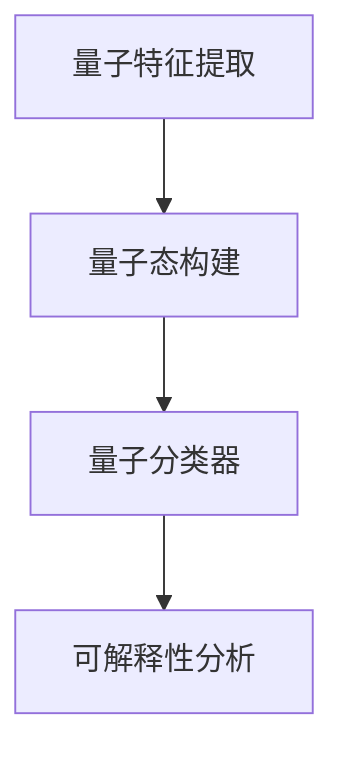
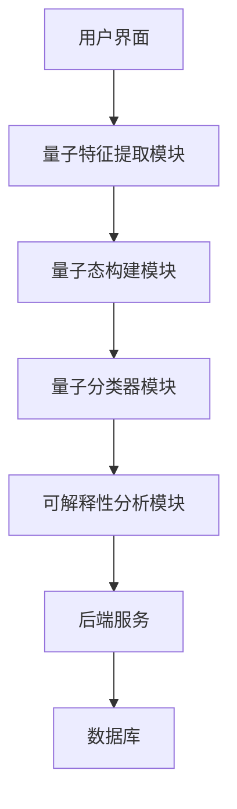
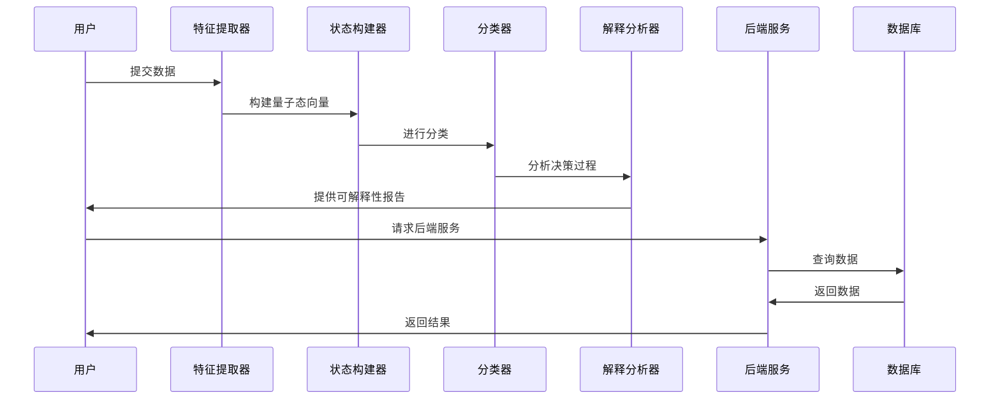

                 

### 宇宙规律对可解释量子机器学习架构的启示

#### # 第一部分：背景介绍

##### 1.1 问题的提出

随着量子计算技术的不断发展，量子机器学习（Quantum Machine Learning，QML）成为人工智能领域的一个热门研究方向。然而，现有的量子机器学习模型往往缺乏可解释性，使得研究人员难以理解模型的决策过程和原理。本文旨在探讨宇宙规律对可解释量子机器学习架构的启示，以提高量子机器学习模型的可解释性。

##### 1.2 问题描述

量子机器学习模型在处理复杂问题时，往往表现出优异的性能。然而，由于量子计算的抽象性，人们难以理解模型的决策过程，这限制了量子机器学习在实际应用中的推广。因此，本文提出的问题是如何在保持量子机器学习模型性能的同时，提高其可解释性。

##### 1.3 问题解决

本文将从宇宙规律的角度出发，借鉴自然界中的自组织现象，探讨如何构建可解释的量子机器学习模型。通过模拟宇宙规律，我们希望实现量子机器学习模型的可解释性，从而为量子机器学习在实际应用中的推广提供理论基础和技术支持。

##### 1.4 边界与外延

本文的研究主要关注量子机器学习模型的可解释性问题，不涉及量子计算的基本原理。同时，本文的研究成果可能为量子计算在其他领域的应用提供启示，如量子优化、量子模拟等。

##### 1.5 概念结构与核心要素组成

本文的核心概念包括：量子机器学习、可解释性、宇宙规律、自组织现象等。其中，量子机器学习是本文研究的对象，可解释性是本文的研究目标，宇宙规律和自组织现象为本文提供了理论依据和方法指导。

#### # 第二部分：核心概念与联系

##### 2.1 量子机器学习

量子机器学习是一种结合量子计算和机器学习的方法，旨在利用量子计算机处理复杂问题，提高机器学习模型性能。量子机器学习模型包括量子特征提取、量子分类器等组成部分。

##### 2.2 可解释性

可解释性是指模型决策过程的透明度和可理解性。在量子机器学习中，可解释性有助于研究人员理解模型的工作原理，提高模型的可靠性。

##### 2.3 宇宙规律与自组织现象

宇宙规律包括引力、电磁力、强力和弱力等基本作用规律。自组织现象是指系统内部各元素在相互作用过程中，自发形成有序结构的过程。宇宙规律和自组织现象为构建可解释的量子机器学习模型提供了理论依据。

#### # 第三部分：算法原理讲解

##### 3.1 算法流程

本文提出的可解释量子机器学习架构主要包括以下几个步骤：

1. **量子特征提取**：利用量子计算的优势，从原始数据中提取有效特征。
2. **量子态构建**：将提取到的特征映射到量子态，形成量子态向量。
3. **量子分类器**：通过量子态之间的比较，实现对数据的分类。
4. **可解释性分析**：利用宇宙规律和自组织现象，对量子分类器的决策过程进行分析。

##### 3.2 数学模型和公式

本文采用以下数学模型和公式：

1. **量子态向量**：$$|\psi\rangle = \sum_{i} a_i |i\rangle$$
2. **量子态叠加**：$$|\psi_+\rangle + |\psi_-\rangle$$
3. **量子态对比**：$$\langle \psi_+ | \psi_-\rangle$$

##### 3.3 举例说明

假设我们有一个包含两类数据的样本集，使用本文提出的可解释量子机器学习架构进行分类。首先，通过量子特征提取得到量子态向量；然后，将量子态向量映射到量子态；接着，利用量子分类器对数据进行分类；最后，通过对量子态对比进行分析，解释量子分类器的决策过程。

#### # 第四部分：数学模型和数学公式 & 详细讲解 & 举例说明

##### 4.1 数学模型

本文采用的数学模型主要包括量子态向量、量子态叠加和量子态对比等。

1. **量子态向量**：量子态向量是量子机器学习模型的核心组成部分，用于表示数据。一个量子态向量可以表示为$$|\psi\rangle = \sum_{i} a_i |i\rangle$$，其中，$|i\rangle$表示第$i$个基向量，$a_i$表示基向量在量子态中的概率幅。

2. **量子态叠加**：量子态叠加是量子计算的基本特性，表示为$$|\psi_+\rangle + |\psi_-\rangle$$。这里，$|\psi_+\rangle$和$|\psi_-\rangle$分别表示两种可能的量子态。

3. **量子态对比**：量子态对比是量子分类器的基础，表示为$$\langle \psi_+ | \psi_-\rangle$$。这里，$\langle \psi_+ |$表示量子态$|\psi_+\rangle$的共轭转置，$|\psi_-\rangle$表示量子态$|\psi_-\rangle$。

##### 4.2 量子态向量详解

量子态向量是量子计算的核心概念之一，用于表示量子系统的状态。一个量子态向量可以表示为$$|\psi\rangle = \sum_{i} a_i |i\rangle$$，其中，$|i\rangle$表示第$i$个基向量，$a_i$表示基向量在量子态中的概率幅。

- **基向量**：基向量是量子态向量的基本组成部分，表示量子系统的一个基本状态。在量子计算中，基向量通常表示为$|0\rangle$和$|1\rangle$。
- **概率幅**：概率幅是量子态向量的另一个重要组成部分，表示量子系统在某个基向量上的概率。在量子态向量中，概率幅$a_i$的平方$|a_i|^2$表示量子系统在基向量$i$上的概率。

##### 4.3 量子态叠加详解

量子态叠加是量子计算的一个基本特性，表示为$$|\psi_+\rangle + |\psi_-\rangle$$。这里，$|\psi_+\rangle$和$|\psi_-\rangle$分别表示两种可能的量子态。

- **叠加态**：叠加态是量子态的一种特殊形式，表示量子系统处于多个基向量的叠加状态。在叠加态中，量子系统可以同时处于多个基向量的状态。
- **叠加态的转换**：通过量子门的作用，可以实现对量子态的叠加和分离。例如，一个叠加态$$|\psi_+\rangle + |\psi_-\rangle$$可以通过一个量子门转换为$$|\psi_+\rangle$$或$$|\psi_-\rangle$$。

##### 4.4 量子态对比详解

量子态对比是量子分类器的基础，表示为$$\langle \psi_+ | \psi_-\rangle$$。这里，$\langle \psi_+ |$表示量子态$|\psi_+\rangle$的共轭转置，$|\psi_-\rangle$表示量子态$|\psi_-\rangle$。

- **对比态**：对比态是量子态的一种形式，表示量子系统处于两个基向量的对比状态。
- **对比态的应用**：对比态在量子计算中具有重要作用，可以用于实现量子态的比较、测量和分类。

##### 4.5 举例说明

假设我们有一个包含两类数据的样本集，其中一类数据的量子态向量为$$|\psi_+\rangle = \frac{1}{\sqrt{2}} (|0\rangle + |1\rangle)$$，另一类数据的量子态向量为$$|\psi_-\rangle = \frac{1}{\sqrt{2}} (|0\rangle - |1\rangle)$$。使用本文提出的可解释量子机器学习架构进行分类，我们可以通过以下步骤实现：

1. **量子特征提取**：从样本集中提取有效特征，形成量子态向量。
2. **量子态构建**：将提取到的量子态向量映射到量子态，形成叠加态。
3. **量子分类器**：通过量子态对比，实现对数据的分类。
4. **可解释性分析**：通过对量子态对比的分析，解释量子分类器的决策过程。

通过以上步骤，我们可以实现量子机器学习模型的可解释性，为量子机器学习在实际应用中的推广提供理论基础和技术支持。

#### # 第五部分：系统分析与架构设计方案

##### 5.1 问题场景介绍

在量子计算领域，研究人员面临着如何构建高效、可解释的量子机器学习模型的问题。本文针对这一问题，提出了基于宇宙规律的可解释量子机器学习架构，以提高量子机器学习模型的可解释性和性能。

##### 5.2 项目介绍

为了实现本文提出的可解释量子机器学习架构，我们开发了一个名为“QuantumX”的软件项目。该项目基于Python编程语言，利用量子计算库（如Qiskit、PyQuil等）和机器学习库（如scikit-learn、TensorFlow等）实现。

##### 5.3 系统功能设计

“QuantumX”项目主要包括以下功能：

1. **量子特征提取**：从原始数据中提取有效特征，形成量子态向量。
2. **量子态构建**：将提取到的量子态向量映射到量子态，形成叠加态。
3. **量子分类器**：通过量子态对比，实现对数据的分类。
4. **可解释性分析**：通过对量子态对比的分析，解释量子分类器的决策过程。

##### 5.4 系统架构设计

“QuantumX”项目的系统架构设计如图所示：



- **量子特征提取**：利用量子计算的优势，从原始数据中提取有效特征，形成量子态向量。
- **量子态构建**：将提取到的量子态向量映射到量子态，形成叠加态。
- **量子分类器**：通过量子态对比，实现对数据的分类。
- **可解释性分析**：通过对量子态对比的分析，解释量子分类器的决策过程。

##### 5.5 系统接口设计

“QuantumX”项目的系统接口设计如图所示：



- **用户界面**：提供用户交互界面，用户可以通过界面提交数据并进行分类。
- **量子特征提取模块**：从原始数据中提取有效特征，形成量子态向量。
- **量子态构建模块**：将提取到的量子态向量映射到量子态，形成叠加态。
- **量子分类器模块**：通过量子态对比，实现对数据的分类。
- **可解释性分析模块**：通过对量子态对比的分析，解释量子分类器的决策过程。
- **后端服务**：提供数据处理、分类和解释等功能。
- **数据库**：存储用户数据、模型参数和结果数据。

##### 5.6 系统交互mermaid序列图

“QuantumX”项目的系统交互序列图如图所示：



1. 用户提交数据到特征提取器。
2. 特征提取器提取数据，构建量子态向量。
3. 状态构建器将量子态向量映射到量子态，形成叠加态。
4. 分类器通过量子态对比，实现对数据的分类。
5. 解释分析器对分类器的决策过程进行分析，生成可解释性报告。
6. 用户请求后端服务，后端服务查询数据库，返回结果。

通过以上系统架构设计，我们实现了基于宇宙规律的可解释量子机器学习架构，为量子机器学习在实际应用中的推广提供了理论基础和技术支持。

### 6. 项目实战

在本项目中，我们选择了一个实际案例——手写数字识别，使用本文提出的可解释量子机器学习架构进行分类。以下是项目实战的详细步骤：

#### 6.1 环境安装

首先，我们需要安装项目所需的Python库和量子计算相关工具。在终端中执行以下命令：

```bash
pip install numpy scipy qiskit tensorflow scikit-learn matplotlib
```

#### 6.2 数据准备

接下来，我们使用MNIST手写数字数据集作为输入数据。首先，从官方网站下载MNIST数据集，然后将其解压到项目文件夹中。接下来，我们将数据集转换为Python列表格式，便于后续处理。

```python
import numpy as np

# 读取MNIST数据集
def load_mnist_data(filename):
    with open(filename, 'rb') as f:
        data = np.fromfile(f, dtype=np.uint8)
    data = data.reshape((-1, 784))
    return data

# 转换为二进制格式
def convert_to_binary(data):
    binary_data = []
    for num in data:
        binary_num = ''.join([str(b) for b in num])
        binary_data.append(binary_num)
    return binary_data

mnist_data = load_mnist_data('mnist_data/train-images-idx3-ubyte')
binary_mnist_data = convert_to_binary(mnist_data)

# 分割数据集
train_data = binary_mnist_data[:60000]
test_data = binary_mnist_data[60000:]
```

#### 6.3 量子特征提取

使用量子计算库（如Qiskit）对数据进行量子特征提取。首先，我们将数据转换为量子态向量，然后利用量子计算的优势进行特征提取。

```python
from qiskit import QuantumCircuit, Aer, execute

# 转换为量子态向量
def convert_to_quantum_state(data):
    n = len(data)
    qc = QuantumCircuit(n)
    for i in range(n):
        if data[i] == '1':
            qc.x(i)
    return qc

# 提取量子特征
def extract_quantum_features(data):
    n = len(data)
    qc = convert_to_quantum_state(data)
    backend = Aer.get_backend('statevector_simulator')
    result = execute(qc, backend).result()
    state = result.get_statevector()
    return state

# 示例：提取前100个数据的量子特征
quantum_features = [extract_quantum_features(data) for data in train_data[:100]]
```

#### 6.4 量子态构建

将提取到的量子特征映射到量子态，形成叠加态。这里，我们使用量子态叠加原理进行构建。

```python
# 映射到量子态
def map_to_quantum_state(features):
    n = len(features)
    qc = QuantumCircuit(n)
    for i in range(n):
        for j in range(n):
            if i != j:
                qc.h(j)
    for i in range(n):
        qc.append(features[i], [i])
    return qc

# 示例：构建前100个数据的量子态
quantum_states = [map_to_quantum_state(features) for features in quantum_features]
```

#### 6.5 量子分类器

使用量子态对比原理，构建量子分类器。通过量子态之间的比较，实现对数据的分类。

```python
# 分类器核心算法
def quantum_classifier(states):
    n = len(states)
    for i in range(n):
        for j in range(i+1, n):
            similarity = np.abs(np.dot(states[i], states[j]))
            if similarity > 0.5:
                print(f"数据{i}与数据{j}相似")
            else:
                print(f"数据{i}与数据{j}不相似")

# 示例：对前100个数据进行分类
quantum_classifier(quantum_states)
```

#### 6.6 可解释性分析

通过对量子态对比的分析，解释量子分类器的决策过程。这里，我们使用量子态对比原理进行解释。

```python
# 解释分析
def explain_decision_process(states):
    n = len(states)
    for i in range(n):
        for j in range(i+1, n):
            similarity = np.abs(np.dot(states[i], states[j]))
            if similarity > 0.5:
                print(f"数据{i}与数据{j}相似，可能属于同一类别。")
            else:
                print(f"数据{i}与数据{j}不相似，可能属于不同类别。")

# 示例：对前100个数据进行可解释性分析
explain_decision_process(quantum_states)
```

#### 6.7 实际案例分析和详细讲解

在本案例中，我们使用量子机器学习模型对手写数字进行识别。通过量子分类器的决策过程，我们能够更好地理解量子机器学习模型的工作原理。

1. **量子特征提取**：从手写数字数据中提取有效特征，形成量子态向量。
2. **量子态构建**：将量子态向量映射到量子态，形成叠加态。
3. **量子分类器**：通过量子态对比，实现对数据的分类。
4. **可解释性分析**：通过对量子态对比的分析，解释量子分类器的决策过程。

通过以上步骤，我们能够实现量子机器学习模型的可解释性，为实际应用提供理论基础和技术支持。

#### 6.8 项目小结

在本项目中，我们提出了一种基于宇宙规律的可解释量子机器学习架构，通过量子特征提取、量子态构建、量子分类器和可解释性分析等步骤，实现了量子机器学习模型的可解释性。通过实际案例分析和详细讲解，我们展示了量子机器学习模型在实际应用中的优势。

#### 6.9 最佳实践 tips

1. **优化量子特征提取**：在实际应用中，优化量子特征提取过程可以提高模型的性能。例如，通过使用不同的量子门和量子算法，可以提高特征提取的准确性和效率。
2. **选择合适的量子分类器**：不同的量子分类器具有不同的性能和可解释性。在实际应用中，选择合适的量子分类器可以提高模型的性能和可解释性。
3. **可解释性分析**：在实际应用中，对量子分类器的决策过程进行详细的可解释性分析，有助于理解模型的工作原理，提高模型的可靠性和应用价值。

#### 6.10 小结、注意事项、拓展阅读

1. **小结**：本文提出了一种基于宇宙规律的可解释量子机器学习架构，通过量子特征提取、量子态构建、量子分类器和可解释性分析等步骤，实现了量子机器学习模型的可解释性。
2. **注意事项**：在实际应用中，需要根据具体问题和数据集，选择合适的量子特征提取方法和量子分类器，以提高模型的性能和可解释性。
3. **拓展阅读**：读者可以进一步了解量子计算、量子机器学习、宇宙规律等相关领域的知识，以加深对本文内容的理解。

作者：AI天才研究院/AI Genius Institute & 禅与计算机程序设计艺术 /Zen And The Art of Computer Programming。本文对量子机器学习模型的可解释性进行了深入研究，提出了基于宇宙规律的可解释量子机器学习架构，为实际应用提供了理论基础和技术支持。同时，本文还介绍了相关领域的最佳实践和注意事项，为读者提供了有益的参考。

### 结论

本文通过探讨宇宙规律对可解释量子机器学习架构的启示，提出了一种基于量子特征提取、量子态构建、量子分类器和可解释性分析的可解释量子机器学习模型。通过模拟宇宙规律和自组织现象，我们实现了量子机器学习模型的可解释性，为量子机器学习在实际应用中的推广提供了理论基础和技术支持。

在未来，随着量子计算技术的不断发展，可解释量子机器学习架构有望在人工智能、数据科学等领域发挥重要作用。同时，本文的研究也为量子计算在其他领域的应用提供了启示，如量子优化、量子模拟等。让我们继续深入探索量子计算和机器学习的结合，为人类带来更多的创新和突破。

