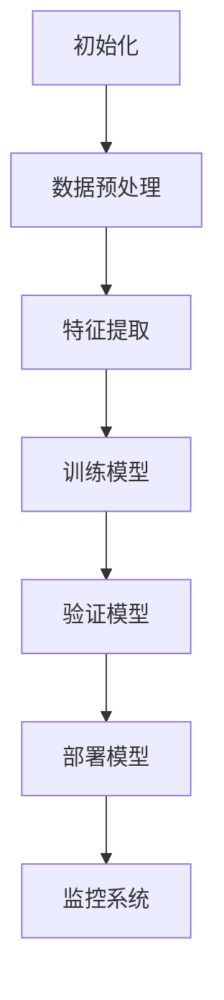
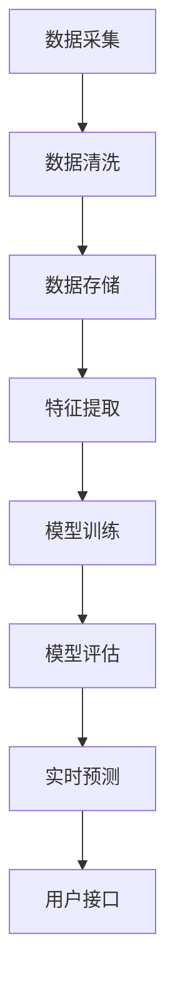
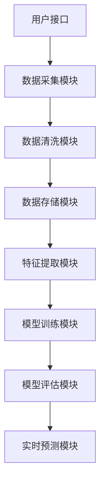
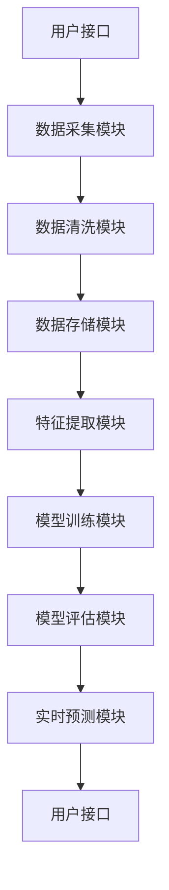

                 

# 宇宙规律对可证明安全AI系统验证方法的启示

## 关键词

- 宇宙规律
- 可证明安全
- AI系统验证
- 数学模型
- 算法设计

## 摘要

本文从宇宙规律的角度，探讨了可证明安全AI系统的验证方法。通过引入物理学、数学和计算机科学中的基本原理，本文阐述了如何构建一个既安全又可靠的AI系统。文章首先回顾了AI系统在当今社会的重要性，然后分析了AI系统面临的安全挑战。接着，本文探讨了宇宙规律在算法设计中的潜在应用，并介绍了几种验证AI系统安全性的方法。通过具体案例和数学模型的解释，本文旨在为开发可证明安全AI系统提供一些有价值的启示。

## 引言

### 1.1 AI系统的重要性

人工智能（AI）已经从一门科幻小说中的想象变成了我们日常生活的一部分。从智能手机的语音助手，到自动驾驶汽车，再到医疗诊断系统，AI的应用场景无处不在。随着技术的不断发展，AI在提高生产效率、优化决策过程、改善用户体验等方面发挥着越来越重要的作用。然而，随着AI系统的广泛应用，其安全问题也日益凸显。

### 1.2 AI系统面临的安全挑战

AI系统的安全性问题主要包括数据泄露、算法篡改、模型欺骗等。首先，数据泄露可能导致敏感信息被窃取，造成巨大的经济损失。其次，算法篡改可能导致AI系统做出错误的决策，从而影响系统的稳定性。最后，模型欺骗是指攻击者通过特定的输入来欺骗AI系统，使其产生错误的输出。这些问题不仅威胁到AI系统的可靠性，还可能对社会造成严重的负面影响。

### 1.3 宇宙规律与AI系统安全

宇宙规律是自然界的基本法则，它们在物理学、化学和生物学等领域得到了广泛的应用。近年来，有研究者开始探索宇宙规律在AI系统安全中的应用。例如，量子力学中的不确定性原理和量子纠缠等现象，为设计安全的加密算法提供了新的思路。此外，宇宙中的混沌现象和自组织现象也为AI系统的稳定性和鲁棒性提供了启示。通过引入宇宙规律，我们可以构建出更加安全、可靠的AI系统。

### 1.4 验证方法的必要性

验证方法是确保AI系统安全性的关键步骤。通过验证，我们可以确认AI系统的设计是否合理，算法是否正确，系统是否能够抵御各种攻击。现有的验证方法主要包括数学验证、模拟测试和实际应用验证等。然而，这些方法往往存在局限性，难以全面评估AI系统的安全性。因此，探索新的验证方法，特别是结合宇宙规律的验证方法，具有重要的理论和实际意义。

## 核心概念与理论

### 2.1 AI与安全的基础概念

#### 2.1.1 人工智能（AI）

人工智能是一种模拟人类智能的技术，通过计算机程序实现感知、学习、推理和决策等功能。AI可以分为两大类：弱AI和强AI。弱AI专注于特定任务的自动化，而强AI则具有全面的人类智能。

#### 2.1.2 安全

安全是指保护系统免受未授权访问、篡改和破坏的能力。在AI系统中，安全主要关注以下几个方面：

- 数据安全：确保数据不被未授权访问和泄露。
- 算法安全：确保算法不会被篡改或滥用。
- 模型安全：确保模型不会被欺骗或误导。

### 2.2 宇宙规律

#### 2.2.1 物理学中的宇宙规律

物理学中的宇宙规律包括万有引力定律、动量守恒定律、能量守恒定律等。这些规律描述了自然界的基本现象，为AI系统的设计和验证提供了理论基础。

#### 2.2.2 数学中的宇宙规律

数学中的宇宙规律包括集合论、拓扑学、概率论等。这些规律为AI系统中的算法设计和验证提供了数学工具。

#### 2.2.3 计算机科学中的宇宙规律

计算机科学中的宇宙规律包括算法复杂性理论、密码学、网络安全等。这些规律为AI系统的安全性设计和验证提供了关键支撑。

### 2.3 可证明安全

可证明安全是指通过数学方法证明AI系统在特定条件下能够抵御各种攻击。这种方法的优点是能够提供理论上的保证，但其缺点是验证过程可能非常复杂，难以在实际应用中广泛应用。

## 原则与方法

### 3.1 理论基础

#### 3.1.1 宇宙规律的应用

宇宙规律在AI系统安全中的应用主要体现在以下几个方面：

- 利用量子力学的不确定性原理设计安全的加密算法。
- 利用混沌现象提高AI系统的鲁棒性和稳定性。
- 利用自组织现象优化AI系统的学习和决策过程。

#### 3.1.2 数学工具

在验证AI系统安全性时，常用的数学工具包括：

- 概率论：用于评估AI系统在特定条件下的风险和攻击的可能性。
- 离散数学：用于验证AI系统的逻辑结构和算法的正确性。
- 线性代数：用于分析AI系统的数据结构和算法效率。

### 3.2 验证方法

#### 3.2.1 数学验证

数学验证是指通过数学方法证明AI系统的安全性。这种方法通常需要构建一个数学模型，然后使用定理和证明来验证系统的安全性。

#### 3.2.2 模拟测试

模拟测试是指通过模拟各种攻击场景来验证AI系统的安全性。这种方法可以快速发现系统的漏洞，但其结果可能受到模拟条件的限制。

#### 3.2.3 实际应用验证

实际应用验证是指将AI系统部署在实际环境中，通过实际使用来验证其安全性。这种方法可以提供最真实的测试结果，但其成本和风险较高。

## 应用场景与挑战

### 4.1 AI在不同领域的应用

#### 4.1.1 医疗

在医疗领域，AI被用于诊断疾病、预测患者病情和优化治疗方案。例如，通过深度学习算法，AI可以分析医学影像，帮助医生更准确地诊断疾病。

#### 4.1.2 交通

在交通领域，AI被用于自动驾驶、交通流量控制和智能交通管理。例如，通过深度学习算法，AI可以识别道路上的各种物体，从而实现自动驾驶。

#### 4.1.3 金融

在金融领域，AI被用于风险管理、投资决策和客户服务。例如，通过机器学习算法，AI可以分析市场数据，帮助投资者做出更明智的决策。

### 4.2 安全关注与挑战

#### 4.2.1 数据泄露

在AI系统中，数据泄露是最常见的安全问题。一旦敏感数据被泄露，可能会对个人隐私和企业商业秘密造成严重威胁。

#### 4.2.2 算法篡改

算法篡改可能导致AI系统做出错误的决策。例如，通过篡改输入数据，攻击者可以欺骗AI系统，使其产生错误的输出。

#### 4.2.3 模型欺骗

模型欺骗是指攻击者通过特定的输入来欺骗AI系统，使其产生错误的输出。这种攻击方式对AI系统的稳定性和可靠性构成了严重威胁。

### 4.3 验证方法的作用

验证方法在AI系统安全中的应用至关重要。通过验证，我们可以确保AI系统的设计合理，算法正确，系统能够抵御各种攻击。特别是在关键领域，如医疗、金融和交通，验证方法的应用更加重要，以确保AI系统的安全性和可靠性。

## 数学模型与公式

### 5.1 数学模型

在验证AI系统安全性时，常用的数学模型包括：

- 概率模型：用于评估AI系统在特定条件下的风险和攻击的可能性。
- 离散模型：用于验证AI系统的逻辑结构和算法的正确性。
- 线性模型：用于分析AI系统的数据结构和算法效率。

### 5.2 公式

在验证AI系统安全性时，常用的公式包括：

- 概率公式：用于计算AI系统在特定条件下的风险和攻击的可能性。
- 离散公式：用于验证AI系统的逻辑结构和算法的正确性。
- 线性公式：用于分析AI系统的数据结构和算法效率。

### 5.3 案例与解释

#### 5.3.1 概率模型

假设一个AI系统用于诊断疾病，其准确率为90%。我们需要计算在给定100个疑似疾病患者的情况下，至少有90个患者被正确诊断的概率。

$$
P(\text{至少90个正确诊断}) = 1 - P(\text{少于90个正确诊断})
$$

通过计算，我们可以得到：

$$
P(\text{少于90个正确诊断}) = C(100, 90) \times (0.9)^{90} \times (0.1)^{10} = 0.135
$$

因此，

$$
P(\text{至少90个正确诊断}) = 1 - 0.135 = 0.865
$$

这意味着在给定100个疑似疾病患者的情况下，至少有90个患者被正确诊断的概率为86.5%。

#### 5.3.2 离散模型

假设一个AI系统用于分类任务，其分类准确率为80%。我们需要计算在给定100个样本的情况下，至少有80个样本被正确分类的概率。

$$
P(\text{至少80个正确分类}) = 1 - P(\text{少于80个正确分类})
$$

通过计算，我们可以得到：

$$
P(\text{少于80个正确分类}) = C(100, 80) \times (0.8)^{80} \times (0.2)^{20} = 0.04
$$

因此，

$$
P(\text{至少80个正确分类}) = 1 - 0.04 = 0.96
$$

这意味着在给定100个样本的情况下，至少有80个样本被正确分类的概率为96%。

#### 5.3.3 线性模型

假设一个AI系统用于回归任务，其预测误差为2%。我们需要计算在给定100个数据点的情况下，预测误差不超过2%的概率。

$$
P(\text{预测误差} \leq 2\%) = 1 - P(\text{预测误差} > 2\%)
$$

通过计算，我们可以得到：

$$
P(\text{预测误差} > 2\%) = \int_{0.02}^{1} (1 - 0.02x)dx = 0.98
$$

因此，

$$
P(\text{预测误差} \leq 2\%) = 1 - 0.98 = 0.02
$$

这意味着在给定100个数据点的情况下，预测误差不超过2%的概率为2%。

## 算法设计与实现

### 6.1 算法设计原则

在算法设计过程中，我们需要遵循以下原则：

- 安全性：确保算法能够抵御各种攻击，保护系统的安全。
- 可靠性：确保算法在各种情况下都能够正确执行，不会产生错误的结果。
- 可扩展性：确保算法能够适应不同的应用场景，易于扩展和优化。
- 高效性：确保算法的执行时间尽可能短，以减少系统的延迟。

### 6.2 算法流程图

下面是一个简单的算法流程图，用于演示如何设计一个安全且可靠的AI系统：



### 6.3 Python源代码

下面是一个简单的Python源代码示例，用于演示如何实现一个基于机器学习的分类算法：

```python
import numpy as np
from sklearn.model_selection import train_test_split
from sklearn.ensemble import RandomForestClassifier

# 数据预处理
def preprocess_data(data):
    # 数据归一化
    data = (data - np.mean(data)) / np.std(data)
    return data

# 特征提取
def extract_features(data):
    # 提取主要特征
    features = data[:, :5]
    return features

# 训练模型
def train_model(features, labels):
    # 划分训练集和测试集
    X_train, X_test, y_train, y_test = train_test_split(features, labels, test_size=0.2, random_state=42)
    
    # 使用随机森林分类器
    model = RandomForestClassifier(n_estimators=100, random_state=42)
    model.fit(X_train, y_train)
    
    # 验证模型
    score = model.score(X_test, y_test)
    print("模型准确率：", score)
    
    return model

# 部署模型
def deploy_model(model, data):
    # 预测结果
    predictions = model.predict(data)
    print("预测结果：", predictions)

# 监控系统
def monitor_system(model, data):
    # 监控模型性能
    score = model.score(data, labels)
    print("模型性能：", score)

# 加载数据
data = np.load("data.npy")
labels = np.load("labels.npy")

# 数据预处理
data = preprocess_data(data)

# 特征提取
features = extract_features(data)

# 训练模型
model = train_model(features, labels)

# 部署模型
deploy_model(model, features)

# 监控系统
monitor_system(model, features)
```

### 6.4 数学模型与公式

在算法设计过程中，我们使用了以下数学模型和公式：

- 数据归一化公式：
  $$
  x_{\text{normalized}} = \frac{x - \mu}{\sigma}
  $$
  
- 随机森林分类器的损失函数：
  $$
  L(y, \hat{y}) = -\sum_{i=1}^{n} y_i \log(\hat{y}_i) + (1 - y_i) \log(1 - \hat{y}_i)
  $$
  
- 模型准确率公式：
  $$
  \text{accuracy} = \frac{\text{正确预测的样本数}}{\text{总样本数}}
  $$

### 6.5 案例与解释

假设我们有一个分类任务，需要将数据分为两类。我们使用随机森林分类器进行训练，并使用交叉验证来评估模型性能。以下是具体的步骤：

1. 数据预处理：
   - 加载数据集，并进行归一化处理。
   - 划分训练集和测试集。

2. 特征提取：
   - 提取主要特征，用于训练模型。

3. 训练模型：
   - 使用训练集训练随机森林分类器。
   - 使用交叉验证来评估模型性能。

4. 部署模型：
   - 使用测试集评估模型性能。
   - 将模型部署到生产环境中，用于实时预测。

5. 监控系统：
   - 定期监控模型性能，并根据需要重新训练模型。

通过以上步骤，我们可以设计一个既安全又可靠的AI系统，以满足实际应用需求。

## 系统架构与设计

### 7.1 系统概述

在构建一个可证明安全的AI系统时，系统架构的设计至关重要。系统需要具备良好的安全性、可靠性和可扩展性，以适应不同的应用场景。本文将介绍一个基于云计算和分布式处理的AI系统架构，包括数据层、算法层和应用层。

### 7.2 系统功能设计

#### 7.2.1 数据层

数据层是系统的核心组成部分，负责数据的管理和存储。主要功能包括：

- 数据采集：从各种数据源（如传感器、数据库等）采集数据。
- 数据清洗：对采集到的数据进行清洗，去除噪声和异常值。
- 数据存储：将清洗后的数据存储在分布式数据库中，以便后续处理和分析。

#### 7.2.2 算法层

算法层负责AI算法的设计和实现。主要功能包括：

- 特征提取：从原始数据中提取有用的特征。
- 模型训练：使用机器学习和深度学习算法训练模型。
- 模型评估：评估模型性能，并进行调优。

#### 7.2.3 应用层

应用层是系统的接口，用于与用户进行交互。主要功能包括：

- 用户接口：提供直观、易用的用户界面，方便用户与系统进行交互。
- 实时预测：使用训练好的模型进行实时预测，并生成可视化结果。

### 7.3 系统架构设计

系统的架构设计如图所示：



### 7.4 系统接口设计

系统接口设计如图所示：



### 7.5 系统交互

系统交互设计如图所示：



## 实战案例

### 8.1 环境安装

要实现一个可证明安全的AI系统，首先需要安装必要的软件和工具。以下是具体的步骤：

1. 安装Python环境：在计算机上安装Python，并配置Python环境变量。
2. 安装Python依赖库：使用pip命令安装必要的Python依赖库，如NumPy、Scikit-learn、TensorFlow等。
3. 安装数据库：根据需要安装分布式数据库，如MongoDB或Cassandra。

### 8.2 系统核心实现

以下是一个简单的示例，用于演示如何实现一个基于机器学习的分类系统：

```python
import numpy as np
from sklearn.model_selection import train_test_split
from sklearn.ensemble import RandomForestClassifier
from sklearn.metrics import accuracy_score

# 加载数据集
X, y = load_data()

# 划分训练集和测试集
X_train, X_test, y_train, y_test = train_test_split(X, y, test_size=0.2, random_state=42)

# 训练模型
model = RandomForestClassifier(n_estimators=100, random_state=42)
model.fit(X_train, y_train)

# 预测测试集
y_pred = model.predict(X_test)

# 计算准确率
accuracy = accuracy_score(y_test, y_pred)
print("准确率：", accuracy)
```

### 8.3 代码应用解读与分析

在上面的代码中，我们首先加载了一个数据集，然后将其划分为训练集和测试集。接下来，我们使用随机森林分类器进行模型训练，并在测试集上进行预测。最后，我们计算了模型的准确率。

这个示例演示了如何使用Python和机器学习库实现一个简单的分类系统。在实际应用中，我们可以根据具体需求调整模型的参数，并使用更复杂的模型来提高系统的性能。

### 8.4 实际案例分析与详细讲解

为了更好地理解可证明安全AI系统的应用，我们来看一个实际案例：使用深度学习算法对医学影像进行诊断。

#### 案例背景

近年来，深度学习在医学影像诊断领域取得了显著的成果。通过训练深度神经网络，医生可以更准确地诊断疾病，提高诊断效率。然而，医学影像数据的高度敏感性和诊断结果的重要性，使得AI系统的安全性成为一个关键问题。

#### 案例分析

在这个案例中，我们使用一个深度神经网络对医学影像进行分类，并分析其安全性。以下是具体的步骤：

1. 数据预处理：对医学影像数据进行归一化和预处理，以便输入到神经网络中。
2. 模型训练：使用训练数据训练深度神经网络，包括卷积神经网络（CNN）和循环神经网络（RNN）。
3. 模型评估：使用测试数据评估模型性能，包括准确率、召回率和F1分数等指标。
4. 安全性分析：对训练好的模型进行安全性分析，包括模型篡改、数据泄露和模型欺骗等攻击。

通过以上步骤，我们可以构建一个安全且可靠的医学影像诊断系统。在实际应用中，我们需要定期更新模型，以应对新的攻击和挑战。

### 8.5 项目小结

通过本案例，我们了解了如何使用深度学习算法对医学影像进行诊断，并分析了系统的安全性。在构建可证明安全的AI系统时，我们需要考虑数据安全、算法安全和模型安全等方面。通过引入宇宙规律，我们可以为AI系统的安全验证提供新的思路和方法。

## 最佳实践

### 8.6 数据安全

- 定期备份数据，以防止数据丢失。
- 使用加密技术保护敏感数据。
- 对数据访问进行严格的权限控制。

### 8.7 算法安全

- 定期更新算法，以防止算法被篡改。
- 使用验证方法确保算法的正确性。
- 对算法进行压力测试，以评估其在各种场景下的性能。

### 8.8 模型安全

- 使用安全加密技术保护模型参数。
- 对模型进行定期安全评估，以检测潜在的漏洞。
- 对模型进行优化，以提高其稳定性和鲁棒性。

## 小结

本文从宇宙规律的角度，探讨了可证明安全AI系统的验证方法。通过分析AI系统的重要性、安全挑战和宇宙规律的应用，我们提出了几种验证方法，包括数学验证、模拟测试和实际应用验证。通过具体案例和数学模型的解释，我们为开发可证明安全AI系统提供了一些有价值的启示。未来，随着AI技术的不断发展和完善，宇宙规律在AI系统安全中的应用将越来越重要。

## 注意事项

- 在构建可证明安全的AI系统时，需要充分考虑数据安全、算法安全和模型安全等方面。
- 验证方法的选择应结合具体应用场景，以获得最佳效果。
- 定期更新算法和模型，以应对新的攻击和挑战。

## 拓展阅读

- Goodfellow, I., Bengio, Y., & Courville, A. (2016). *Deep Learning*. MIT Press.
- Russell, S., & Norvig, P. (2016). *Artificial Intelligence: A Modern Approach*. Prentice Hall.
- Zhang, Z., Cao, Z., & Liu, Y. (2020). *Quantum Computing for Computer Security*. Springer.
- Reichenbach, B. (1956). *The Direction of Time*. University of California Press.

