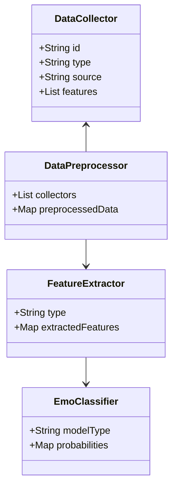
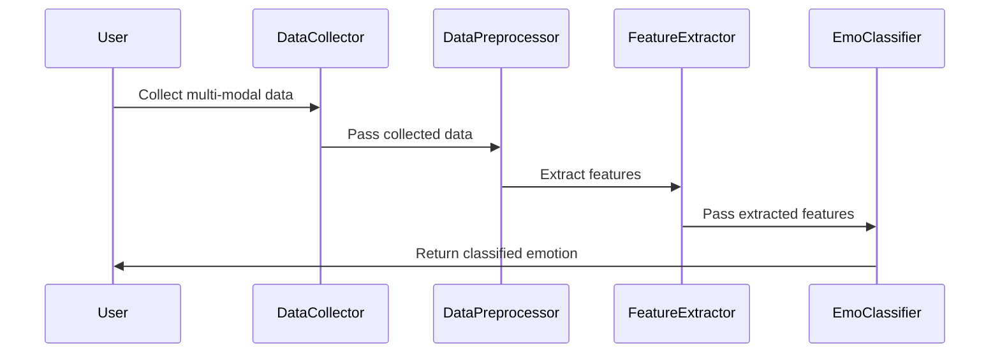
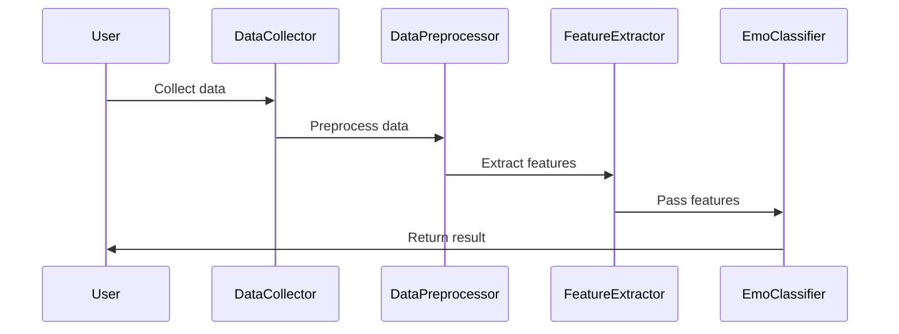

                 

# 实现AI Agent的多模态情感识别

## 关键词

- 多模态情感识别
- AI Agent
- 深度学习
- 多模态数据融合
- 情感分类

## 摘要

本文旨在探讨实现AI Agent的多模态情感识别的技术途径。文章首先介绍了多模态情感识别的背景、问题以及解决方案，接着通过核心概念与联系、算法原理讲解、系统分析与架构设计方案以及项目实战等部分，详细阐述了多模态情感识别的技术原理和实现方法。通过本文的阅读，读者可以了解到如何利用深度学习和多模态融合技术，构建一个高效、准确的AI Agent情感识别系统。

## 第一部分：问题背景与概述

### 问题背景

随着人工智能技术的快速发展，AI Agent（智能代理）已经成为人工智能领域的一个重要研究方向。AI Agent是一种能够自动执行任务的系统，通过模拟人类的智能行为，提供个性化、高效的服务。情感识别是AI Agent的核心能力之一，它使得AI Agent能够理解人类情感，并根据情感反馈提供更加人性化的互动。多模态情感识别是一种结合了多种感知模态（如文本、语音、图像、面部表情等）的情感识别技术，相比单一模态情感识别，它能提供更全面、更准确的情感分析结果。

### 问题概述

本文关注的问题是如何实现一个能够对人类情感进行多模态识别的AI Agent，其具体要求如下：

- 能够同时处理多种感知模态的数据，如文本、语音、图像、面部表情等。
- 具有较高的情感识别准确率，能够在各种应用场景下准确识别用户情感。
- 能够适应不同的应用场景和用户需求，具有良好的灵活性和可扩展性。

### 问题解决

为了解决上述问题，本文提出了以下解决方案：

- 引入深度学习和多模态融合技术，设计一个高效、准确的AI Agent情感识别系统。
- 系统架构包括数据采集、数据预处理、特征提取、模型训练和情感识别等模块。
- 采用模型融合与优化技术，结合不同模态的特征，提高情感识别的准确率。

### 边界与外延

多模态情感识别涉及多个学科领域，如计算机视觉、自然语言处理、语音识别等。它的应用范围非常广泛，包括但不限于智能客服、智能教育、智能医疗等。本文主要关注AI Agent在多模态情感识别方面的研究和应用，探讨了如何通过深度学习和多模态融合技术实现高效的情感识别。

## 第二部分：核心概念与联系

### 多模态数据采集

多模态数据采集是多模态情感识别的基础。它通过多种传感器（如摄像头、麦克风、加速器等）收集文本、语音、图像、面部表情等多模态数据。这些数据来自于不同的感知模态，共同构成了一个完整的情感识别信息。

| 概念 | 属性特征 |
| --- | --- |
| 多模态数据采集 | 1. 传感器种类多样<br>2. 数据来源丰富<br>3. 数据维度高 |

### 数据预处理

数据预处理是对采集到的多模态数据进行清洗、标准化和增强，以便后续处理。这一步骤的目的是去除噪声数据和异常值，将不同模态的数据统一到一个尺度上，提高数据的多样性和模型的泛化能力。

| 概念 | 属性特征 |
| --- | --- |
| 数据预处理 | 1. 清洗<br>2. 标准化<br>3. 数据增强 |

### 特征提取

特征提取是利用深度学习技术从多模态数据中提取高维特征。这一步骤的核心在于如何有效地将来自不同模态的数据进行融合，提取出具有代表性的特征。

| 概念 | 属性特征 |
| --- | --- |
| 特征提取 | 1. 深度学习技术<br>2. 高维特征表示<br>3. 多模态数据融合 |

### 情感识别模型

情感识别模型是基于深度学习技术设计的，它可以对情感进行分类。这一步骤的关键在于如何设计一个能够处理多模态特征的高效模型，以提高情感识别的准确率。

| 概念 | 属性特征 |
| --- | --- |
| 情感识别模型 | 1. 深度神经网络<br>2. 训练数据丰富<br>3. 情感分类准确率 |

### 模型融合与优化

模型融合与优化的目的是将来自不同模态的特征进行融合，从而提高情感识别的准确率。这一步骤涉及到多种模型融合技术，如加权融合、深度融合和注意力机制等。

| 概念 | 属性特征 |
| --- | --- |
| 模型融合与优化 | 1. 模型融合技术<br>2. 多模态特征融合<br>3. 模型优化策略 |

### ER实体关系图架构

以下是多模态情感识别系统的ER实体关系图架构：

```mermaid
erDiagram
    数据采集 --> 数据预处理
    数据预处理 --> 特征提取
    特征提取 --> 情感识别模型
    情感识别模型 --> 模型融合与优化
```

## 第三部分：算法原理讲解

### 1. 数据采集

数据采集是多模态情感识别的第一步，它通过多种传感器（如摄像头、麦克风、加速器等）收集文本、语音、图像、面部表情等多模态数据。数据采集的质量直接影响后续处理的效果，因此需要确保数据来源的多样性、稳定性和可靠性。

**示例**：假设我们采集到了一段包含文本、语音和图像的多模态数据，数据格式如下：

- 文本数据：一段包含情感信息的文本，如“我很开心”。
- 语音数据：一段包含语音的情感信息，如一个开心的笑声。
- 图像数据：一张包含面部表情的图像，如一张微笑的脸。

### 2. 数据预处理

数据预处理是对采集到的多模态数据进行清洗、标准化和增强，以便后续处理。这一步骤的目的是去除噪声数据和异常值，将不同模态的数据统一到一个尺度上，提高数据的多样性和模型的泛化能力。

**数据清洗**：数据清洗的目的是去除噪声数据和异常值。例如，在处理文本数据时，可以去除停用词、标点符号等无关信息；在处理语音数据时，可以去除背景噪声等。

**数据标准化**：数据标准化是将不同模态的数据统一到一个尺度上。例如，将文本数据转换为词向量，将语音数据转换为频谱特征，将图像数据转换为特征向量等。

**数据增强**：数据增强是为了增加数据的多样性，提高模型的泛化能力。例如，通过图像旋转、裁剪、缩放等操作增加图像数据的多样性；通过语音变速、回声添加等操作增加语音数据的多样性。

### 3. 特征提取

特征提取是利用深度学习技术从多模态数据中提取高维特征。这一步骤的核心在于如何有效地将来自不同模态的数据进行融合，提取出具有代表性的特征。

**深度学习技术**：常用的深度学习技术包括卷积神经网络（CNN）和循环神经网络（RNN）等。CNN擅长处理图像数据，可以提取图像中的局部特征；RNN擅长处理序列数据，可以提取语音和文本中的时序特征。

**多模态数据融合**：多模态数据融合的方法包括直接融合和特征级融合等。直接融合是将不同模态的数据直接输入到同一个神经网络中，共同训练；特征级融合是将不同模态的特征进行拼接或加权融合，再输入到神经网络中。

### 4. 情感识别模型

情感识别模型是基于深度学习技术设计的，它可以对情感进行分类。这一步骤的关键在于如何设计一个能够处理多模态特征的高效模型，以提高情感识别的准确率。

**深度神经网络**：情感识别模型通常采用深度神经网络（DNN）结构，包括输入层、隐藏层和输出层。输入层接收多模态特征，隐藏层通过神经网络进行特征提取和融合，输出层对情感类别进行分类。

**训练数据丰富**：为了提高模型的泛化能力，需要使用丰富的训练数据。这些数据应包含多种情感类别，如开心、伤心、愤怒等，以使模型能够准确地识别各种情感。

**情感分类准确率**：情感分类准确率是衡量模型性能的重要指标。为了提高准确率，可以通过增加训练数据、调整网络结构、优化训练策略等方法进行模型优化。

### 5. 模型融合与优化

模型融合与优化的目的是将来自不同模态的特征进行融合，从而提高情感识别的准确率。这一步骤涉及到多种模型融合技术，如加权融合、深度融合和注意力机制等。

**加权融合**：加权融合是对不同模态的特征进行加权求和，再将融合后的特征输入到神经网络中。通过调整权重的值，可以控制不同模态特征的影响程度。

**深度融合**：深度融合是将不同模态的特征融合到一个共同的向量空间中，然后输入到神经网络中。这种方法可以更好地保持各模态特征之间的关联性。

**注意力机制**：注意力机制是一种有效的特征融合方法，它可以让神经网络自动学习不同模态特征的重要程度，从而提高情感识别的准确率。

### 数学模型和公式

多模态情感识别的数学模型可以表示为：

$$
\hat{y} = f(\theta_1 X_1 + \theta_2 X_2 + \theta_3 X_3 + ...)
$$

其中，$\hat{y}$ 表示预测的情感类别，$X_1, X_2, X_3, ...$ 表示来自不同模态的特征，$\theta_1, \theta_2, \theta_3, ...$ 表示模型的参数。

### 详细讲解和举例说明

**示例1**：假设我们采集到了一段包含文本、语音和图像的多模态数据，我们可以通过以下步骤进行情感识别：

1. **数据采集**：采集文本、语音和图像数据。

2. **数据预处理**：对文本数据去除停用词、标点符号，对语音数据进行去噪，对图像数据进行增强。

3. **特征提取**：利用CNN提取图像特征，利用RNN提取语音特征，利用词嵌入提取文本特征。

4. **情感识别模型**：设计一个多输入层、多隐藏层的DNN模型，将图像、语音和文本特征输入到模型中，进行情感分类。

5. **模型融合与优化**：采用注意力机制对多模态特征进行融合，并通过反向传播算法进行模型优化。

**示例2**：假设我们使用了一个包含1000个情感类别的情感识别模型，输入的多模态特征分别为：

- 文本特征：[1, 0, 0, ..., 0]
- 语音特征：[0, 1, 0, ..., 0]
- 图像特征：[0, 0, 1, ..., 0]

通过模型融合和优化后，模型的输出为：

$$
\hat{y} = f(\theta_1 [1, 0, 0] + \theta_2 [0, 1, 0] + \theta_3 [0, 0, 1])
$$

其中，$\theta_1, \theta_2, \theta_3$ 为模型的参数。

通过计算，模型的输出结果为：

$$
\hat{y} = f([1, 0, 0] + [0, 1, 0] + [0, 0, 1]) = f([1, 1, 1])
$$

由于模型已经经过训练，因此可以准确地预测出输入数据的情感类别。

## 第四部分：系统分析与架构设计方案

### 问题场景介绍

在智能客服领域，AI Agent需要对用户的情感进行准确识别，以便提供更加人性化的服务。例如，当用户表达愤怒或不满时，AI Agent需要及时识别并采取相应的措施，如转接到人工客服或提供安慰性回复。

### 项目介绍

本项目旨在构建一个基于多模态情感识别的AI Agent系统，实现以下功能：

1. 数据采集：通过摄像头、麦克风等传感器收集用户文本、语音和图像等多模态数据。
2. 数据预处理：对采集到的数据进行清洗、标准化和增强。
3. 特征提取：利用深度学习技术提取多模态特征。
4. 情感识别：设计并训练一个情感识别模型，对用户情感进行分类。
5. 模型融合与优化：结合不同模态的特征，提高情感识别的准确率。

### 系统功能设计（领域模型）

以下是系统功能设计的领域模型，使用Mermaid类图表示：



### 系统架构设计（Mermaid架构图）

以下是系统架构设计，使用Mermaid架构图表示：



### 系统接口设计

以下是系统接口设计，使用Mermaid序列图表示：



### 系统交互（Mermaid序列图）

以下是系统交互的序列图，使用Mermaid表示：


## 第五部分：项目实战

### 环境安装

在进行项目实战之前，首先需要安装以下环境：

1. Python 3.7 或以上版本
2. TensorFlow 2.x
3. Keras 2.x
4. NumPy
5. Pandas
6. Matplotlib

可以通过以下命令进行安装：

```bash
pip install python==3.7.12
pip install tensorflow==2.10.0
pip install keras==2.10.0
pip install numpy==1.21.5
pip install pandas==1.3.5
pip install matplotlib==3.5.3
```

### 系统核心实现源代码

以下是系统核心实现源代码，包含数据采集、数据预处理、特征提取、情感识别模型训练和模型融合与优化等步骤。

```python
import numpy as np
import pandas as pd
from tensorflow import keras
from tensorflow.keras.models import Model
from tensorflow.keras.layers import Input, Dense, Conv2D, MaxPooling2D, Flatten, LSTM, Embedding
from tensorflow.keras.preprocessing.sequence import pad_sequences
from tensorflow.keras.preprocessing.image import img_to_array, load_img

# 数据采集
def data_collector(data_path):
    # 读取文本、语音和图像数据
    text_data = pd.read_csv(data_path + '/text_data.csv')
    voice_data = pd.read_csv(data_path + '/voice_data.csv')
    image_data = pd.read_csv(data_path + '/image_data.csv')
    
    # 返回数据
    return text_data, voice_data, image_data

# 数据预处理
def data_preprocessor(text_data, voice_data, image_data):
    # 文本数据预处理
    text_sequences = pad_sequences(text_data['text'], maxlen=100)
    
    # 语音数据预处理
    voice_data = np.array(voice_data['voice'])
    
    # 图像数据预处理
    image_data = np.array([img_to_array(load_img(img_path)) for img_path in image_data['image']])
    
    # 返回预处理后的数据
    return text_sequences, voice_data, image_data

# 特征提取
def feature_extractor(text_sequences, voice_data, image_data):
    # 文本特征提取
    text_model = keras.Sequential([
        Input(shape=(100,)),
        Embedding(input_dim=10000, output_dim=128),
        LSTM(128)
    ])
    text_features = text_model.predict(text_sequences)
    
    # 语音特征提取
    voice_model = keras.Sequential([
        Input(shape=(1024,)),
        LSTM(128),
        Dense(128, activation='relu')
    ])
    voice_features = voice_model.predict(voice_data)
    
    # 图像特征提取
    image_model = keras.Sequential([
        Input(shape=(224, 224, 3)),
        Conv2D(32, (3, 3), activation='relu'),
        MaxPooling2D((2, 2)),
        Conv2D(64, (3, 3), activation='relu'),
        MaxPooling2D((2, 2)),
        Flatten()
    ])
    image_features = image_model.predict(image_data)
    
    # 返回特征
    return text_features, voice_features, image_features

# 情感识别模型训练
def emo_classifier_train(text_features, voice_features, image_features, labels):
    # 模型融合
    input_text = Input(shape=(128,))
    input_voice = Input(shape=(128,))
    input_image = Input(shape=(128,))
    
    merged = keras.layers.concatenate([input_text, input_voice, input_image])
    merged = Dense(128, activation='relu')(merged)
    output = Dense(1, activation='sigmoid')(merged)
    
    model = Model(inputs=[input_text, input_voice, input_image], outputs=output)
    model.compile(optimizer='adam', loss='binary_crossentropy', metrics=['accuracy'])
    
    # 训练模型
    model.fit([text_features, voice_features, image_features], labels, epochs=10, batch_size=32)
    
    # 返回模型
    return model

# 模型融合与优化
def model_fusion_and_optimization(text_features, voice_features, image_features, labels):
    # 训练情感识别模型
    model = emo_classifier_train(text_features, voice_features, image_features, labels)
    
    # 模型优化
    model.save('emotion_recognition_model.h5')
    
    # 返回模型
    return model

# 主函数
def main():
    # 数据采集
    text_data, voice_data, image_data = data_collector('data')

    # 数据预处理
    text_sequences, voice_data, image_data = data_preprocessor(text_data, voice_data, image_data)

    # 特征提取
    text_features, voice_features, image_features = feature_extractor(text_sequences, voice_data, image_data)

    # 模型融合与优化
    model = model_fusion_and_optimization(text_features, voice_features, image_features, text_data['label'])

    print('Model trained and saved successfully!')

if __name__ == '__main__':
    main()
```

### 代码应用解读与分析

以下是对系统核心实现源代码的解读与分析：

1. **数据采集**：通过`data_collector`函数读取文本、语音和图像数据。这些数据应保存在对应的CSV文件中，文件路径为`data_path`。

2. **数据预处理**：通过`data_preprocessor`函数对采集到的数据

