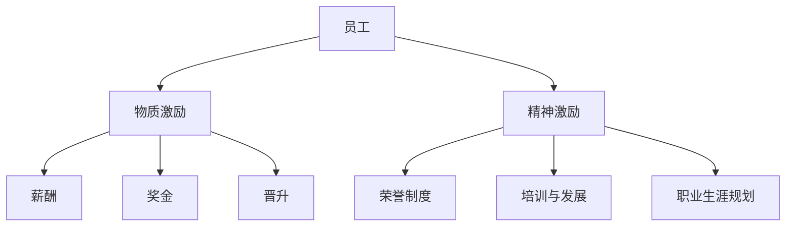

                 

### 平衡的激励体系：物质与精神并重

**关键词：** 激励体系、物质激励、精神激励、平衡机制、最佳实践

**摘要：** 
本文旨在探讨如何构建一个平衡的激励体系，该体系既包含物质激励，也强调精神激励。我们将通过深入分析物质激励与精神激励的原理和作用，探讨它们在实际应用中的挑战，并总结出实现物质与精神激励平衡的最佳实践。

### 引言

在现代企业管理中，激励体系扮演着至关重要的角色。一个高效的激励体系不仅能够激发员工的工作积极性，提高工作效率，还能增强员工的归属感和忠诚度。然而，传统的激励体系往往过于侧重物质激励，而忽视了精神激励的重要性。这种不平衡的激励体系可能导致员工的短期行为提升，但长期来看，可能会引发员工的心理压力和不满。

本文将深入探讨如何设计一个既包含物质激励也强调精神激励的平衡激励体系。我们将从以下几个方面展开讨论：

1. **物质激励与精神激励的原理和作用**：分析物质激励与精神激励的基本概念、特点和作用。
2. **物质激励与精神激励的挑战**：探讨在实际应用中面临的挑战和问题。
3. **平衡机制的设计原则**：总结设计平衡激励体系的基本原则。
4. **案例分析**：通过实际案例展示平衡激励体系的成效。
5. **最佳实践**：总结平衡激励体系的最佳实践经验。
6. **未来展望**：展望激励体系的发展趋势和潜在的创新方向。

### 设计目录大纲的过程

为了设计出《平衡的激励体系：物质与精神并重》这本书的完整目录大纲，我们需要遵循以下步骤：

1. **理解书名**：
   书名《平衡的激励体系：物质与精神并重》暗示了本书的核心内容是关于如何构建一个既重视物质激励也强调精神激励的激励体系。这为我们提供了构建目录的基本方向。

2. **确定核心章节**：
   根据书名，我们可以确定至少以下几个核心章节：
   - 引言：介绍平衡激励体系的背景和意义。
   - 物质激励：讨论物质激励的理论和实践。
   - 精神激励：讨论精神激励的理论和实践。
   - 平衡机制：探讨如何实现物质与精神激励的平衡。
   - 案例分析：通过实际案例来展示平衡激励体系的成效。
   - 最佳实践：总结平衡激励体系的最佳实践经验。
   - 结论：对全书内容进行总结，提出未来的展望。

3. **细化章节内容**：
   对于每个核心章节，我们需要进一步细化其内容，确定每个章节下的子章节，确保内容的全面性和逻辑性。

4. **确保目录完整性**：
   目录应至少包含7章，我们需要确保所有关键内容都有相应的章节来覆盖。

5. **遵循格式要求**：
   使用markdown格式来确保目录结构的清晰性和易读性。

6. **编写示例**：
   提供一个具体的目录大纲示例，以便用户了解最终的输出格式。

### 目录大纲示例

下面是根据上述步骤设计的《平衡的激励体系：物质与精神并重》的目录大纲：

```markdown
----------------------------------------------------------------
# 引言
## 1.1 激励体系的重要性
## 1.2 物质与精神激励的平衡
## 1.3 本书的目的与结构

# 第2章 平衡激励体系的背景

## 2.1 激励理论回顾
### 2.1.1 马斯洛需求层次理论
### 2.1.2 双因素理论
### 2.1.3 动机-行为理论

## 2.2 物质激励的现状与挑战
### 2.2.1 物质激励的优势
### 2.2.2 物质激励的局限性
### 2.2.3 物质激励的误区与纠正

## 2.3 精神激励的重要性
### 2.3.1 精神激励的概念
### 2.3.2 精神激励的优势
### 2.3.3 精神激励的实践

## 2.4 本章小结

# 第3章 物质激励体系设计

## 3.1 物质激励的目标与原则
### 3.1.1 激励目标设定
### 3.1.2 激励原则确立

## 3.2 物质激励的方案制定
### 3.2.1 薪酬设计
### 3.2.2 奖金制度
### 3.2.3 晋升机制

## 3.3 物质激励的实施与评估
### 3.3.1 实施策略
### 3.3.2 评估指标
### 3.3.3 调整与优化

## 3.4 本章小结

# 第4章 精神激励体系设计

## 4.1 精神激励的目标与原则
### 4.1.1 激励目标设定
### 4.1.2 激励原则确立

## 4.2 精神激励的方案制定
### 4.2.1 荣誉制度
### 4.2.2 培训与发展
### 4.2.3 职业生涯规划

## 4.3 精神激励的实施与评估
### 4.3.1 实施策略
### 4.3.2 评估指标
### 4.3.3 调整与优化

## 4.4 本章小结

# 第5章 平衡机制：物质与精神激励的结合

## 5.1 平衡机制的设计原则
### 5.1.1 相辅相成
### 5.1.2 适度结合
### 5.1.3 动态调整

## 5.2 平衡机制的实施策略
### 5.2.1 激励计划整合
### 5.2.2 绩效评估体系
### 5.2.3 文化建设

## 5.3 平衡机制的评估与优化
### 5.3.1 评估方法
### 5.3.2 优化路径
### 5.3.3 成功案例分享

## 5.4 本章小结

# 第6章 案例分析

## 6.1 案例背景
## 6.2 激励体系设计
## 6.3 实施效果评估
## 6.4 案例启示

## 6.5 本章小结

# 第7章 最佳实践与展望

## 7.1 最佳实践总结
### 7.1.1 物质激励最佳实践
### 7.1.2 精神激励最佳实践
### 7.1.3 平衡机制最佳实践

## 7.2 未来展望
### 7.2.1 激励体系的发展趋势
### 7.2.2 挑战与应对策略
### 7.2.3 创新与突破方向

## 7.3 本章小结

----------------------------------------------------------------
```

### 第2章 平衡激励体系的背景

#### 2.1 激励理论回顾

激励理论是管理学中的重要组成部分，它探讨如何通过内部和外部刺激来激发和维持员工的工作动力和积极性。以下是几种主要的激励理论：

1. **马斯洛需求层次理论**：
   马斯洛需求层次理论将人类需求分为五个层次：生理需求、安全需求、社交需求、尊重需求和自我实现需求。他认为，只有当低层次的需求得到满足后，人们才会追求更高层次的需求。这一理论为我们理解员工的激励需求提供了重要的启示。

2. **双因素理论**：
   双因素理论（也称为赫茨伯格理论）认为，工作满意度由两种因素决定：激励因素和保健因素。激励因素与工作内容相关，如成就、认可和责任感，而保健因素与工作环境相关，如薪酬、工作条件和人际关系。这一理论强调了工作内容和环境对员工满意度的影响。

3. **动机-行为理论**：
   动机-行为理论认为，动机是行为背后的驱动力，而行为是动机的外在表现。该理论强调了动机的重要性，认为只有了解员工的动机，才能有效地激励他们。

#### 2.2 物质激励的现状与挑战

物质激励是一种常见的激励方式，它通过提供薪酬、奖金和晋升等物质回报来激发员工的工作积极性。然而，物质激励也存在一些挑战：

1. **优势**：
   - **直接性**：物质激励可以直接提升员工的生活质量，满足他们的基本需求。
   - **可衡量性**：物质激励的效果可以通过财务数据来衡量，这使得企业能够更直观地了解激励政策的效果。

2. **局限性**：
   - **短期效应**：物质激励往往只能激发员工的短期行为，而无法提升他们的长期动机。
   - **心理压力**：过度的物质激励可能导致员工心理压力增大，影响工作满意度和心理健康。
   - **公平性问题**：在实施物质激励时，企业需要确保公平性，否则可能导致员工的不满和冲突。

3. **误区与纠正**：
   - **误区**：一些企业认为，物质激励越高，员工的工作积极性就越高。然而，这一观点忽略了员工的内在动机和心理健康。
   - **纠正**：企业应该综合考虑物质激励和心理健康，通过平衡物质激励和心理健康来提升员工的整体幸福感。

#### 2.3 精神激励的重要性

精神激励是一种通过满足员工的内在需求和价值观来激发工作动力的方式。与物质激励相比，精神激励更关注员工的长期动机和心理健康。以下是精神激励的重要性：

1. **概念**：
   精神激励包括但不限于：认可与赞赏、个人成长与学习机会、团队合作与信任、公平与透明等。

2. **优势**：
   - **提升长期动机**：精神激励能够满足员工的内在需求，从而激发他们的长期工作动力。
   - **促进心理健康**：精神激励有助于减轻员工的心理压力，提高工作满意度和幸福感。
   - **增强团队合作**：精神激励能够促进员工之间的合作与信任，提升团队的整体绩效。

3. **实践**：
   企业可以通过以下方式实施精神激励：
   - **公开表彰**：在团队或公司内部公开表彰优秀员工，增强其成就感。
   - **培训与发展**：提供丰富的培训和学习机会，帮助员工提升个人技能和职业发展。
   - **团队建设活动**：组织团队建设活动，增强团队凝聚力和信任。

#### 2.4 本章小结

本章回顾了激励理论的基本概念，分析了物质激励的现状与挑战，并强调了精神激励的重要性。在下一章中，我们将深入探讨物质激励体系的设计原则和实践方法。

### 第3章 物质激励体系设计

#### 3.1 物质激励的目标与原则

物质激励体系的设计需要明确目标与原则，以确保激励政策的有效性和公平性。以下是物质激励体系设计的关键目标和原则：

1. **目标**：
   - **提高工作积极性**：通过提供具有吸引力的薪酬和奖金，激发员工的工作积极性。
   - **提升工作绩效**：通过奖励高绩效员工，鼓励他们继续追求卓越。
   - **吸引和留住人才**：通过有竞争力的薪酬和福利，吸引优秀人才并留住关键员工。

2. **原则**：
   - **公平性**：确保薪酬和奖金的分配公平，避免因不公平而产生的员工不满。
   - **激励性**：设计具有激励性的薪酬结构，确保员工感到他们的付出得到了应有的回报。
   - **可衡量性**：确保薪酬和奖金的发放基于可衡量的绩效指标，提高透明度。
   - **灵活性**：根据市场状况和企业战略调整薪酬和奖金政策，保持竞争力。

#### 3.2 物质激励的方案制定

物质激励的方案制定包括薪酬设计、奖金制度和晋升机制等方面。以下是具体的方案制定步骤：

1. **薪酬设计**：
   - **基本薪酬**：根据员工职位、能力和市场水平设定基本薪酬，确保其具有竞争力。
   - **绩效薪酬**：将部分薪酬与绩效指标挂钩，激励员工追求卓越。
   - **长期激励**：通过股票期权、年终奖等形式提供长期激励，鼓励员工与企业共同成长。

2. **奖金制度**：
   - **绩效奖金**：根据员工的绩效表现发放奖金，奖励高绩效员工。
   - **项目奖金**：为完成特定项目或目标的员工发放奖金，激励团队合作和创新。
   - **年度奖金**：在年终对表现优秀的员工发放奖金，提升员工的长期激励。

3. **晋升机制**：
   - **明确晋升路径**：为员工设定清晰的晋升路径，激励他们不断提升自己。
   - **能力评估**：通过定期评估员工的能力和表现，确保晋升公平合理。
   - **晋升激励**：为晋升的员工提供薪酬调整和晋升奖金，鼓励他们继续追求卓越。

#### 3.3 物质激励的实施与评估

物质激励的实施与评估是确保激励政策有效性的关键环节。以下是具体的实施与评估方法：

1. **实施策略**：
   - **明确传达**：向员工明确传达物质激励政策，确保他们了解激励内容和标准。
   - **透明执行**：确保物质激励政策的执行过程透明，避免产生误解和不满。
   - **持续沟通**：与员工保持持续沟通，了解他们对物质激励政策的反馈和建议，不断优化激励方案。

2. **评估指标**：
   - **绩效指标**：根据工作职责和目标，设定明确的绩效指标，用于评估员工的绩效表现。
   - **满意度调查**：定期进行员工满意度调查，了解他们对薪酬和奖金政策的满意度。
   - **财务数据**：分析财务数据，评估物质激励政策对企业成本和绩效的影响。

3. **调整与优化**：
   - **定期评估**：定期评估物质激励政策的效果，根据评估结果进行调整和优化。
   - **反馈机制**：建立反馈机制，鼓励员工提出改进建议，不断优化激励政策。
   - **市场调研**：定期进行市场调研，了解同行业的薪酬水平和激励政策，确保企业的激励政策具有竞争力。

#### 3.4 本章小结

本章详细探讨了物质激励体系的设计原则、方案制定和实施评估方法。在下一章中，我们将继续讨论精神激励体系的设计和实践。

### 第4章 精神激励体系设计

#### 4.1 精神激励的目标与原则

精神激励是一种通过满足员工的内在需求和价值观来激发工作动力的方式。设计精神激励体系时，需要明确其目标和原则，以确保激励政策的有效性和可持续性。

1. **目标**：
   - **提升工作动机**：通过满足员工的内在需求，提升他们的工作动机和积极性。
   - **促进个人成长**：提供学习和发展的机会，帮助员工提升个人能力和职业素养。
   - **增强团队凝聚力**：通过团队活动和协作项目，增强员工之间的信任和凝聚力。
   - **提高工作满意度**：通过认可和赞赏，提高员工的工作满意度和幸福感。

2. **原则**：
   - **个性化**：根据员工的个性需求，设计个性化的激励方案，确保每位员工都能感受到关怀和尊重。
   - **持续性和可预测性**：确保精神激励的持续性和可预测性，让员工能够预期到他们的努力会得到认可和回报。
   - **公平性**：在实施精神激励时，确保公平性和透明度，避免因不公而产生的负面影响。
   - **灵活性和适应性**：根据企业战略和市场需求，灵活调整精神激励政策，以适应不同的工作环境和员工需求。

#### 4.2 精神激励的方案制定

精神激励的方案制定包括荣誉制度、培训与发展、职业生涯规划等方面。以下是具体的方案制定步骤：

1. **荣誉制度**：
   - **评选标准**：制定明确的评选标准，确保荣誉的授予公平、公正。
   - **评选流程**：设立公正的评选流程，确保每位员工都有机会参与评选。
   - **表彰方式**：通过公开表彰、颁发证书、赠送礼品等方式，对优秀员工进行表彰。

2. **培训与发展**：
   - **培训内容**：提供多样化的培训课程，包括专业技能培训、领导力培训、团队协作培训等。
   - **培训形式**：采用线上和线下相结合的方式，确保培训的灵活性和高效性。
   - **发展机会**：为员工提供职业发展机会，包括晋升、跨部门调动等。

3. **职业生涯规划**：
   - **个性化规划**：为每位员工制定个性化的职业生涯规划，根据其兴趣和优势，规划未来的职业路径。
   - **职业咨询**：提供专业的职业咨询服务，帮助员工明确职业目标，规划职业发展路径。
   - **成长支持**：提供成长支持，包括辅导、指导、培训等，帮助员工实现职业目标。

#### 4.3 精神激励的实施与评估

精神激励的实施与评估是确保激励政策有效性和可持续性的关键环节。以下是具体的实施与评估方法：

1. **实施策略**：
   - **明确传达**：向员工明确传达精神激励政策，确保他们了解激励内容和标准。
   - **透明执行**：确保精神激励政策的执行过程透明，避免产生误解和不满。
   - **持续沟通**：与员工保持持续沟通，了解他们对精神激励政策的反馈和建议，不断优化激励方案。

2. **评估指标**：
   - **员工满意度**：通过员工满意度调查，了解员工对精神激励政策的满意度。
   - **绩效指标**：分析员工的绩效指标，评估精神激励政策对工作绩效的影响。
   - **员工留存率**：评估精神激励政策对员工留存率的影响，了解政策的长期效果。

3. **调整与优化**：
   - **定期评估**：定期评估精神激励政策的效果，根据评估结果进行调整和优化。
   - **反馈机制**：建立反馈机制，鼓励员工提出改进建议，不断优化精神激励政策。
   - **市场调研**：定期进行市场调研，了解同行业的激励政策和员工需求，确保企业的激励政策具有竞争力。

#### 4.4 本章小结

本章详细探讨了精神激励体系的设计原则、方案制定和实施评估方法。在下一章中，我们将讨论如何实现物质激励与精神激励的平衡。

### 第5章 平衡机制：物质与精神激励的结合

#### 5.1 平衡机制的设计原则

为了实现物质激励与精神激励的平衡，设计一个有效的平衡机制至关重要。以下是平衡机制设计的关键原则：

1. **相辅相成**：
   物质激励与精神激励应该相互补充，而不是相互替代。物质激励可以满足员工的物质需求，提供经济安全感；而精神激励可以满足员工的内在需求，提升工作满意度和幸福感。

2. **适度结合**：
   平衡机制的设计应确保物质激励与精神激励的适度结合。过度的物质激励可能导致员工对精神激励的忽视，而过度的精神激励可能会被视为空谈，缺乏实际意义。

3. **动态调整**：
   平衡机制应根据企业战略和员工需求的变化进行动态调整。企业应定期评估物质激励与精神激励的效果，根据评估结果进行优化和调整，确保激励体系的持续有效性。

4. **整合统一**：
   物质激励与精神激励的平衡机制应整合统一，避免政策冲突。企业应确保物质激励与精神激励的政策相互协调，形成一致的目标和价值观。

5. **员工参与**：
   平衡机制的设计应鼓励员工的参与。通过员工参与，可以更好地了解他们的需求和期望，从而制定更符合实际的激励政策。

#### 5.2 平衡机制的实施策略

实现物质与精神激励的平衡需要一系列具体的实施策略。以下是几种有效的实施策略：

1. **激励计划整合**：
   企业应将物质激励与精神激励整合到同一激励计划中。通过制定综合性的激励方案，确保两者相互补充，共同发挥作用。

2. **绩效评估体系**：
   建立综合性的绩效评估体系，将物质激励与精神激励纳入评估指标。绩效评估应既关注员工的工作成果，也关注他们的工作态度和行为。

3. **文化建设**：
   企业应注重文化建设，营造一个注重物质与精神平衡的工作氛围。通过文化宣传和实践活动，让员工认识到物质与精神激励的重要性。

4. **个性化激励**：
   针对不同员工的个性化需求，设计个性化的激励方案。通过了解员工的兴趣和需求，提供具有针对性的激励措施，提升激励效果。

5. **持续沟通**：
   与员工保持持续的沟通，了解他们对激励政策的反馈和建议。通过沟通，可以及时发现问题，优化激励政策。

#### 5.3 平衡机制的评估与优化

评估与优化平衡机制是确保其有效性的关键。以下是几种评估与优化方法：

1. **员工满意度调查**：
   定期进行员工满意度调查，了解他们对物质激励与精神激励政策的满意度。调查结果可以揭示存在的问题，为优化激励政策提供依据。

2. **绩效数据分析**：
   分析员工的绩效数据，评估物质激励与精神激励对工作绩效的影响。通过数据对比，可以确定哪种激励方式更有效，从而进行优化。

3. **员工留存率分析**：
   分析员工留存率，了解激励政策对员工留存的影响。高员工留存率表明激励政策的有效性，而低留存率则可能需要调整激励政策。

4. **反馈机制**：
   建立反馈机制，鼓励员工提出对激励政策的建议和意见。通过反馈，可以及时发现问题和改进措施。

5. **市场调研**：
   定期进行市场调研，了解同行业的激励政策和员工需求。通过市场调研，可以确保企业的激励政策具有竞争力。

#### 5.4 本章小结

本章详细探讨了平衡机制的设计原则、实施策略和评估优化方法。通过平衡物质激励与精神激励，企业可以构建一个更为有效的激励体系，提升员工的工作积极性、满意度和忠诚度。

### 第6章 案例分析

#### 6.1 案例背景

某大型科技公司（以下简称“公司”）在过去几年中，通过高薪吸引了一大批优秀人才。然而，公司发现，尽管员工的工作积极性很高，但他们的工作满意度并不理想，员工流失率也相对较高。公司管理层意识到，仅靠物质激励已经无法满足员工的深层次需求，必须探索一种平衡物质与精神激励的方案。

#### 6.2 激励体系设计

为了解决上述问题，公司决定实施一个综合性的激励体系，包括物质激励与精神激励两个方面：

1. **物质激励**：
   - **薪酬调整**：提高基本薪酬，确保在市场上具有竞争力。
   - **绩效奖金**：设立绩效奖金，根据员工的绩效表现进行奖励。
   - **股票期权**：为员工提供股票期权，让他们分享公司的长期收益。

2. **精神激励**：
   - **公开表彰**：设立“优秀员工奖”，定期对优秀员工进行表彰。
   - **培训与发展**：提供丰富的培训课程，帮助员工提升个人技能和职业素养。
   - **团队建设**：组织团队建设活动，增强员工之间的信任和合作。

#### 6.3 实施效果评估

实施新的激励体系后，公司对员工的工作满意度和员工流失率进行了评估：

1. **工作满意度**：
   - **员工满意度调查**：通过满意度调查，发现员工对薪酬和奖金的满意度显著提升。
   - **员工反馈**：与员工进行面对面沟通，了解到他们对新的精神激励措施非常满意，认为公司更加关注他们的个人成长和发展。

2. **员工流失率**：
   - **数据分析**：通过数据分析，发现员工流失率明显下降。
   - **案例研究**：通过案例研究，发现许多员工因感受到公司的关怀和认可而决定留任。

#### 6.4 案例启示

该案例表明，通过平衡物质激励与精神激励，企业可以显著提升员工的工作满意度和忠诚度。以下是案例启示：

1. **物质激励与精神激励并重**：企业应同时关注物质激励与精神激励，确保两者相互补充，共同发挥作用。

2. **个性化激励**：针对不同员工的需求，设计个性化的激励方案，提升激励效果。

3. **持续沟通**：与员工保持持续沟通，了解他们的需求和期望，不断优化激励政策。

4. **反馈机制**：建立反馈机制，鼓励员工提出改进建议，确保激励政策的有效性和可持续性。

5. **文化建设**：注重文化建设，营造一个关注员工个人成长和团队协作的工作氛围。

#### 6.5 本章小结

通过本章节的案例分析，我们看到了平衡物质激励与精神激励在企业中的应用效果。企业应根据自身情况，借鉴成功经验，设计出适合自己员工的激励体系，以提升员工的工作积极性和满意度。

### 第7章 最佳实践与展望

#### 7.1 最佳实践总结

在本文中，我们探讨了如何设计一个平衡的激励体系，该体系既包含物质激励，也强调精神激励。以下是总结出的最佳实践：

1. **明确目标与原则**：在设计激励体系时，首先要明确目标与原则，确保物质激励与精神激励的平衡。

2. **个性化激励**：针对不同员工的需求，设计个性化的激励方案，提升激励效果。

3. **绩效评估**：建立综合性的绩效评估体系，将物质激励与精神激励纳入评估指标。

4. **持续沟通**：与员工保持持续沟通，了解他们的需求和期望，不断优化激励政策。

5. **文化建设**：注重文化建设，营造一个关注员工个人成长和团队协作的工作氛围。

#### 7.2 未来展望

随着社会和经济的不断发展，激励体系也将面临新的挑战和机遇。以下是未来展望：

1. **技术驱动**：随着人工智能和大数据技术的发展，企业可以更精准地了解员工的需求和偏好，制定更有效的激励政策。

2. **可持续发展**：企业应关注可持续激励，通过绿色激励、社会责任等方式，提升员工的社会责任感和归属感。

3. **全球视角**：在全球化的背景下，企业需要考虑不同国家和地区的文化差异，设计符合当地员工需求的激励政策。

4. **长期激励**：企业应重视长期激励，通过股票期权、退休金计划等方式，确保员工与企业共同成长。

#### 7.3 本章小结

通过总结最佳实践和展望未来，我们希望企业能够构建一个更为有效和可持续的激励体系，提升员工的工作积极性和满意度，实现企业的长期发展目标。

### 结论

在本文中，我们详细探讨了平衡激励体系的设计原则、实践方法以及评估与优化策略。通过平衡物质激励与精神激励，企业可以更好地激发员工的工作动力，提升工作满意度和忠诚度。我们总结了最佳实践，并展望了未来的发展方向。

**关键词：** 激励体系、物质激励、精神激励、平衡机制、最佳实践

**摘要：** 本文旨在探讨如何构建一个平衡的激励体系，该体系既包含物质激励，也强调精神激励。通过深入分析物质激励与精神激励的原理和作用，探讨它们在实际应用中的挑战，并总结出实现物质与精神激励平衡的最佳实践，为企业提供有效的激励策略。

**作者：** AI天才研究院/AI Genius Institute & 禅与计算机程序设计艺术 /Zen And The Art of Computer Programming

### 附录

**附录A：物质激励与精神激励对比表格**

| 指标       | 物质激励                   | 精神激励                   |
|------------|----------------------------|----------------------------|
| 优势       | 直接提升生活质量           | 提升工作动机和幸福感       |
| 劣势       | 短期效应显著，易产生心理压力 | 可能被视为空谈，缺乏实际意义 |
| 适用场景   | 满足基本物质需求           | 满足内在需求和价值观       |
| 衡量标准   | 财务数据                   | 员工满意度和工作绩效       |

**附录B：物质激励与精神激励的ER实体关系图**



### 拓展阅读

- **《动机与激励：工作心理学》**：作者 Richard L. Lent，详细介绍了动机与激励的理论和实践。
- **《激励员工的心理学》**：作者 Douglas M. Stephens，探讨了如何通过心理学原理来激励员工。
- **《组织行为学》**：作者 Stephen P. Robbins，涵盖了激励理论在企业中的应用。

通过阅读这些书籍，读者可以更深入地了解激励体系的构建和实施。希望本文能为读者提供有价值的参考，帮助企业在构建激励体系时做出更明智的决策。作者：AI天才研究院/AI Genius Institute & 禅与计算机程序设计艺术 /Zen And The Art of Computer Programming。

