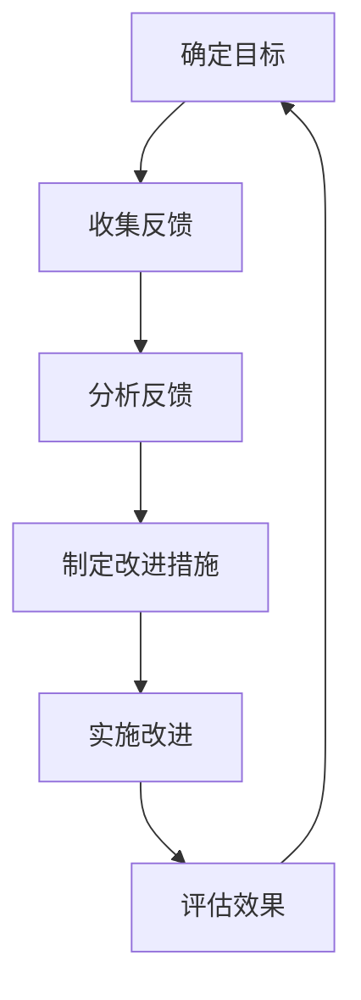
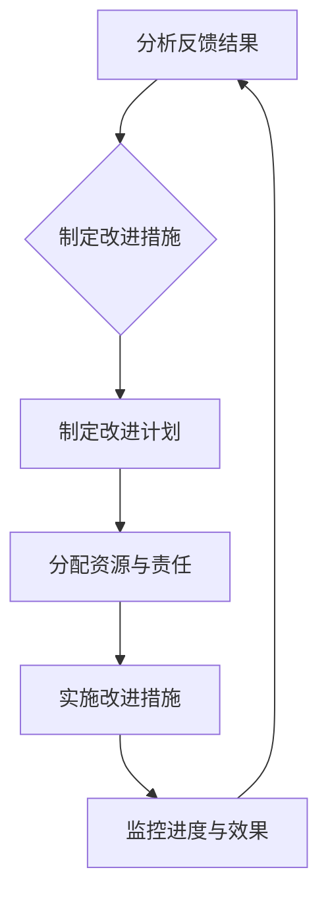

                 

# 建立Feedback Loop：持续改进的团队文化

## 关键词

- **反馈环**
- **持续改进**
- **团队文化**
- **KPI**
- **数据收集与分析**
- **改进措施实施**
- **适应性与创新**

## 摘要

在当今快速变化的工作环境中，建立有效的反馈环成为团队和组织的持续改进的关键。本文深入探讨了反馈环的概念、特点及与传统反馈环的比较，详细阐述了建立反馈环的步骤和方法，包括目标与KPI的确定、反馈机制的设计、反馈的收集与分析、改进措施的实施等。通过案例分析和实践指导，本文旨在帮助团队构建以持续改进为核心的团队文化，提升团队的工作效率和产品质量。

### 第一部分：问题背景与核心概念

#### 第1章：问题背景与核心概念

##### 1.1.1 问题背景

##### 1.1.1.1 问题定义

反馈环（Feedback Loop）是指在系统内引入信息反馈机制，以实现系统持续改进和自我优化的一种方法。反馈环的核心在于通过获取系统输出，分析其与预期目标的偏差，并将此信息返回到系统中进行调整，以实现系统的不断优化。

##### 1.1.1.2 问题描述

在当今快速变化的工作环境中，团队和组织的持续改进变得尤为重要。然而，许多团队在建立和实施反馈环方面面临挑战，包括缺乏明确的目标、难以收集和分析反馈、以及反馈的运用不足等问题。

##### 1.1.1.3 问题解决

通过建立有效的反馈环，团队可以不断获取外部和内部的反馈，分析问题所在，制定改进措施，并执行这些措施。这一过程有助于提升团队的工作效率和产品质量，同时增强团队的适应性和创新能力。

##### 1.1.1.4 边界与外延

反馈环不仅适用于企业内部的团队管理，还可以应用于项目管理、产品开发、客户服务等多个领域。反馈环的建立和实施需要考虑组织的文化、流程和资源等因素。

##### 1.2 核心概念

##### 1.2.1 定义

反馈环由输入、处理、输出和反馈四个基本组成部分构成。输入是指系统接收的原始信息，处理是指对输入信息进行分析和加工，输出是指系统的最终结果，反馈是指将输出结果与预期目标进行比较，并将差异信息返回到系统中。

##### 1.2.2 特点

##### 1.2.2.1 自适应性

反馈环具有高度的适应性，能够根据外部和内部环境的变化进行调整，以实现最佳效果。

##### 1.2.2.2 持续性

反馈环是一个持续的过程，不断收集、分析和应用反馈，以实现系统的持续改进。

##### 1.2.2.3 系统性

反馈环涉及系统的各个方面，包括输入、处理、输出和反馈，需要系统性的思考和实施。

##### 1.2.3 传统反馈环与现代反馈环的对比

##### 1.2.3.1 传统反馈环

传统反馈环通常以手工方式实施，信息反馈周期较长，调整和优化的效率较低。

##### 1.2.3.2 现代反馈环

现代反馈环借助信息技术和数据分析工具，可以实现实时反馈和快速调整，大大提高了系统的响应速度和优化效果。

### 第二部分：建立反馈环的步骤与方法

#### 第2章：建立反馈环的步骤与方法

##### 2.1 确定目标与关键绩效指标（KPI）

##### 2.1.1 定义目标

明确团队的目标是建立有效反馈环的第一步。目标应当具体、可衡量、可实现、相关性强、时限性明确（SMART原则）。

##### 2.1.2 确定关键绩效指标（KPI）

关键绩效指标（KPI）是用来衡量目标实现程度的具体指标。选择合适的KPI是确保反馈环有效性的关键。

##### 2.2 设计反馈机制

##### 2.2.1 反馈渠道设计

设计多种渠道以收集团队内外部的反馈，如问卷调查、定期会议、面对面交流、在线论坛等。

##### 2.2.2 反馈机制流程图

使用Mermaid流程图（如下所示）设计反馈机制的流程，确保每个环节都有明确的责任人和操作步骤。

##### 2.3 收集与分析反馈

##### 2.3.1 数据收集方法

采用定量和定性相结合的方法收集反馈数据，如问卷调查、访谈、观察等。

##### 2.3.2 数据分析工具

使用数据分析工具（如Excel、Python、R等）对收集到的反馈数据进行处理和分析。

##### 2.4 制定改进措施

##### 2.4.1 分析反馈结果

对反馈结果进行深入分析，找出问题所在，识别改进的机会。

##### 2.4.2 制定改进计划

根据反馈结果，制定具体的改进措施和时间表。

##### 2.5 实施改进措施

##### 2.5.1 改进措施执行

按照改进计划，执行具体的改进措施。

### 第三部分：案例分析与实践指导

#### 第3章：反馈环的实践应用

##### 3.1 项目背景

在本章中，我们将通过一个实际项目案例，展示如何建立和实施反馈环，以提升项目管理的效率和产品的质量。

##### 3.2 反馈环的建立

在本节中，我们将详细讨论如何在项目中建立反馈环，包括目标设定、KPI确定、反馈渠道设计等。

##### 3.3 反馈的收集与分析

在本节中，我们将介绍如何收集和分析项目过程中的反馈数据，包括问卷调查、访谈、数据分析工具的使用等。

##### 3.4 改进措施的实施

在本节中，我们将讨论如何根据反馈结果制定和实施改进措施，包括资源分配、责任划分、改进措施的执行等。

##### 3.5 项目小结

在本节中，我们将对项目进行总结，讨论反馈环在项目中的效果，以及未来可以改进的方向。

### 第四部分：最佳实践与未来展望

#### 第4章：最佳实践与未来展望

##### 4.1 最佳实践

在本章中，我们将总结反馈环建立和实施的最佳实践，包括成功案例、常见问题及解决方案等。

##### 4.2 未来展望

在本章中，我们将探讨反馈环在未来团队管理和组织发展中的应用前景，以及可能面临的挑战和机遇。

### 作者

作者：AI天才研究院/AI Genius Institute & 禅与计算机程序设计艺术 /Zen And The Art of Computer Programming

## 结论

建立有效的反馈环是团队持续改进的关键。通过明确目标、设计反馈机制、收集与分析反馈、制定和实施改进措施，团队可以不断提升工作效率和产品质量。本文通过理论和实践相结合的方式，为团队提供了建立和实施反馈环的全方位指导。希望读者能够在实际工作中运用这些方法，构建以持续改进为核心的团队文化，推动团队和组织的持续发展。

