                 

### 文章标题

# 建立feedback文化：促进持续改进

## 关键词

- feedback文化
- 持续改进
- 组织效能
- 团队协作
- 项目管理

## 摘要

在信息技术迅速发展的今天，反馈文化已成为推动组织持续改进的重要动力。本文从反馈文化的概念、建立机制、培养意识、实践应用以及持续改进等多个方面，深入探讨了如何构建一个有效的反馈文化，以促进组织的创新与成长。通过实际案例分析与最佳实践分享，本文旨在为IT从业者和管理者提供一套系统的反馈文化建立与实施指南。

## 目录

1. **第一部分：反馈文化概述**
   1.1 反馈文化的概念与重要性
   1.2 反馈文化在IT行业的应用
   1.3 反馈文化与持续改进的关系
   1.4 本章小结

2. **第二部分：建立反馈机制**
   2.1 构建有效的反馈机制
   2.2 选择与优化反馈渠道
   2.3 反馈反馈：闭环的重要性
   2.4 本章小结

3. **第三部分：培养反馈意识**
   3.1 个人层面的反馈意识培养
   3.2 团队层面的反馈意识培养
   3.3 组织层面的反馈意识培养
   3.4 本章小结

4. **第四部分：反馈文化实践**
   4.1 项目管理中的应用
   4.2 团队协作中的角色
   4.3 案例分析与最佳实践
   4.4 本章小结

5. **第五部分：反馈文化的持续改进**
   5.1 评估与改进策略
   5.2 面临的挑战与应对
   5.3 未来趋势与展望
   5.4 本章小结

6. **附录：反馈文化实践指南**
   - 实践技巧与注意事项
   - 小结与总结
   - 拓展阅读

### 第一部分：反馈文化概述

#### 1.1 反馈文化的概念与重要性

**核心概念术语说明**：
- **反馈文化**：一种组织内部普遍认同并积极实践的价值观念，它鼓励成员通过反馈机制不断改进个人和团队的工作表现。
- **持续改进**：通过不断收集、分析和利用反馈信息，持续优化产品、服务和工作流程。

**问题背景**：
在快速变化的市场环境中，IT行业对创新和效率的要求越来越高。传统的单向沟通模式已经难以满足组织对持续改进的需求。反馈文化作为一种双向互动的机制，能够促进信息流通，提高决策质量，激发创新思维。

**问题描述**：
如何在一个组织中建立并维持反馈文化，使其成为推动组织持续改进的关键因素？

**问题解决**：
解决这一问题的关键在于理解反馈文化的核心概念，并明确其在IT行业中的重要作用。反馈文化不仅仅是一个工具或机制，它更是一种组织文化和价值观的体现。

**边界与外延**：
- **边界**：反馈文化主要涉及组织内部的信息流通和沟通机制，不包括外部客户和市场反馈。
- **外延**：反馈文化可以扩展到个人成长、团队协作、项目管理等多个层面。

**概念结构与核心要素组成**：

1. **反馈机制**：确保反馈信息能够高效、准确地传递和接收的渠道和工具。
2. **反馈意识**：组织成员对反馈的重要性和价值的认知程度。
3. **反馈反馈**：通过反馈机制获取反馈，并将其用于改进产品、服务和流程。

**算法原理讲解**：

反馈文化的构建可以类比为一个闭环控制系统。在这个系统中，反馈机制扮演了传感器和调节器的作用。传感器（收集反馈）检测系统的表现，调节器（反馈机制）根据反馈进行调整，以确保系统能够持续优化。

- **传感器（收集反馈）**：使用多种渠道（如问卷调查、定期会议、一对一反馈等）收集来自客户、团队成员和内部流程的反馈。
- **调节器（反馈机制）**：对收集到的反馈进行分析和评估，制定改进计划，并执行这些计划。

**数学模型和公式**：

在反馈文化中，可以采用以下公式来描述反馈循环：

\[ \text{反馈} = \text{当前状态} - \text{期望状态} \]

**举例说明**：

假设一个软件开发团队希望提高产品的用户满意度。通过定期的用户反馈收集，团队发现用户对某些功能的使用体验不佳。根据收集到的反馈，团队分析了问题的根本原因，并进行了相应的改进。经过一段时间的测试和迭代，最终产品的用户满意度得到了显著提升。

**Mermaid流程图**：

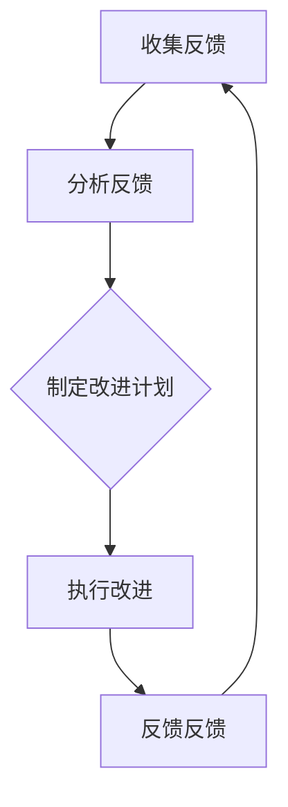

#### 1.2 反馈文化在IT行业的应用

**背景介绍**：

在IT行业，反馈文化已经成为提升产品和服务质量、推动技术创新的重要手段。随着敏捷开发、持续集成和DevOps等现代化软件开发方法的普及，反馈文化在IT行业中的应用越来越广泛。

**项目介绍**：

本文将以一个软件开发项目为例，展示如何在实际项目中应用反馈文化。

**系统功能设计（领域模型Mermaid类图）**：

```mermaid
classDiagram
    UserEntity <<Entity>>
    ProjectEntity <<Entity>>
    FeedbackEntity <<Entity>>
    
    UserEntity --> ProjectEntity
    UserEntity --> FeedbackEntity
    ProjectEntity --> FeedbackEntity
```

**系统架构设计（Mermaid架构图）**：

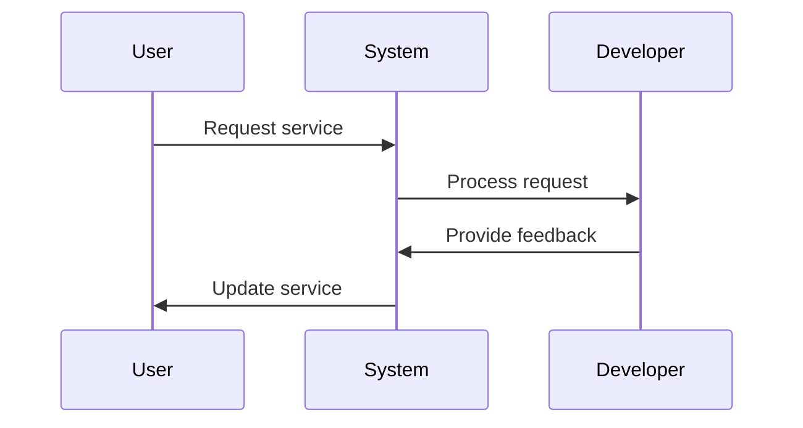

**系统接口设计（Mermaid序列图）**：

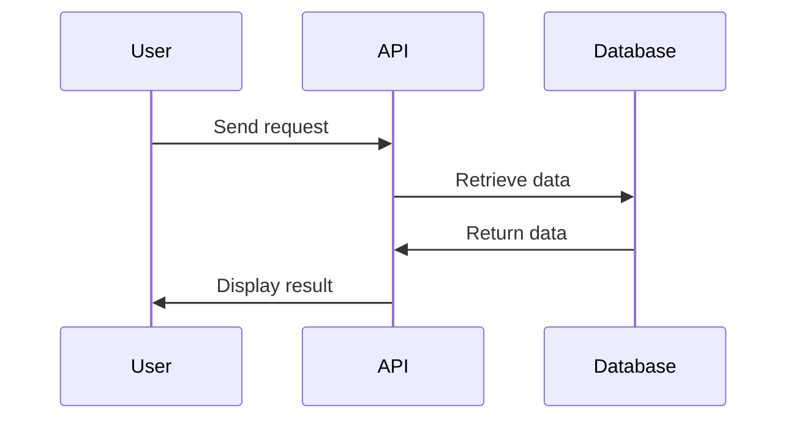

**系统交互（Mermaid序列图）**：

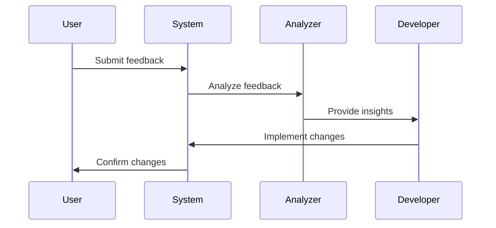

#### 1.3 反馈文化与持续改进的关系

**核心概念原理**：

反馈文化与持续改进紧密相关。持续改进是一种通过不断学习、迭代和优化来提升产品和服务质量的方法。而反馈文化则为持续改进提供了信息反馈的机制和平台。

**概念属性特征对比表格**：

| 特征       | 反馈文化                      | 持续改进                      |
|------------|------------------------------|------------------------------|
| 目的       | 促进信息流通和团队协作        | 提升产品质量和工作效率        |
| 核心机制   | 反馈机制和反馈反馈           | 学习、迭代和优化               |
| 作用范围   | 组织内部（个人、团队、项目）  | 整个组织（产品、流程、服务）  |
| 影响因素   | 成员反馈意识、反馈机制有效性  | 创新能力、执行力、组织文化    |

**ER实体关系图架构**：

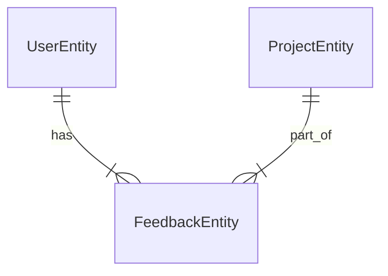

#### 1.4 本章小结

本文从反馈文化的概念、应用和持续改进的关系等方面进行了深入探讨。反馈文化不仅是一种组织内部的信息流通机制，更是推动持续改进的重要动力。通过有效的反馈机制和持续改进的实践，组织可以不断提升产品和服务质量，保持市场竞争力。在下一部分，我们将进一步探讨如何构建和优化反馈机制，以支持持续改进的过程。

### 第二部分：建立反馈机制

#### 2.1 构建有效的反馈机制

**背景介绍**：

建立有效的反馈机制是促进组织持续改进的重要步骤。一个高效的反馈机制能够确保反馈信息的及时传递、准确分析和有效利用。

**项目介绍**：

本文将介绍一个实际项目中构建反馈机制的过程，包括设计原则、实施步骤和预期效果。

**系统功能设计（Mermaid类图）**：

```mermaid
classDiagram
    FeedbackChannel <<Interface>>
    FeedbackProcessor <<Class>>
    FeedbackDatabase <<Database>>

    FeedbackChannel --> FeedbackProcessor
    FeedbackProcessor --> FeedbackDatabase
```

**系统架构设计（Mermaid架构图）**：

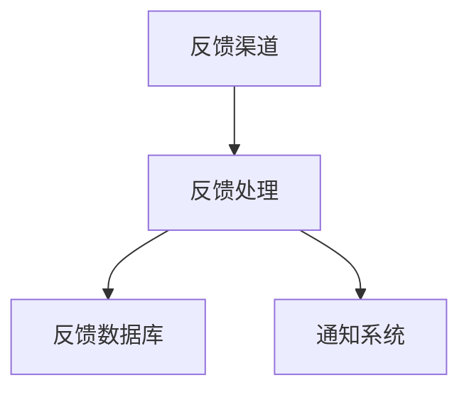

**系统接口设计（Mermaid序列图）**：

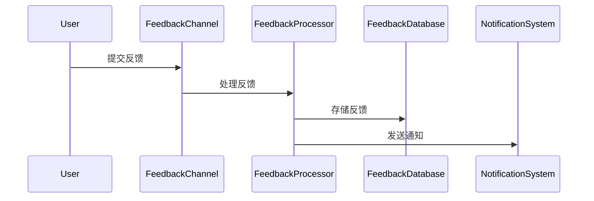

**系统交互（Mermaid序列图）**：

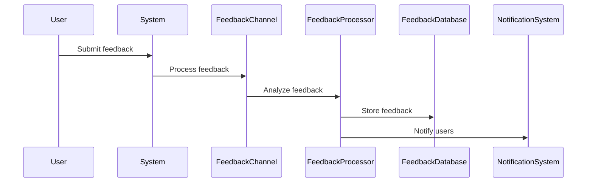

**算法原理讲解**：

在构建反馈机制时，可以采用以下算法原理：

1. **反馈收集**：使用多种渠道（如问卷调查、在线表单、邮件反馈等）收集反馈信息。
2. **反馈处理**：对收集到的反馈进行分类、筛选和分析，提取有价值的信息。
3. **反馈存储**：将分析后的反馈存储在数据库中，以便后续分析和利用。
4. **反馈通知**：将处理结果及时通知相关用户，确保反馈得到有效回应。

**数学模型和公式**：

- **反馈收集率**：\(\text{收集率} = \frac{\text{实际收集到的反馈数量}}{\text{应收集的反馈数量}}\)
- **反馈响应时间**：\(\text{响应时间} = \frac{\text{反馈处理时间}}{\text{反馈收集时间}}\)

**Python源代码**：

```python
import pandas as pd

# 反馈收集
def collect_feedback(feedback渠道):
    return pd.read_csv(feedback渠道)

# 反馈处理
def process_feedback(feedback数据):
    processed_data = feedback数据.groupby('反馈类别').count()
    return processed_data

# 反馈存储
def store_feedback(processed_data, database):
    processed_data.to_csv(database, index=False)

# 反馈通知
def notify_users(users, notification内容):
    for user in users:
        print(f"用户{user}，您的反馈已处理完成，详情如下：{notification内容}")
```

**举例说明**：

假设一个团队希望通过问卷调查收集员工对项目管理工具的反馈。团队设计了反馈问卷，并通过邮件发送给所有员工。收集到问卷后，团队使用Python脚本对反馈进行分析，并将结果存储在数据库中。同时，团队通过邮件通知每个员工他们的反馈已收到并处理。

**Mermaid流程图**：

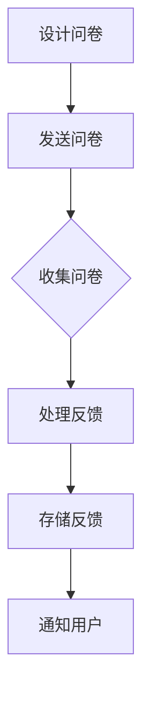

#### 2.2 选择与优化反馈渠道

**背景介绍**：

选择合适的反馈渠道是确保反馈机制有效运行的关键。不同的反馈渠道适用于不同的场景，因此需要根据组织的具体情况来选择和优化。

**项目介绍**：

本文将以一个企业内部的反馈系统为例，介绍如何选择和优化反馈渠道。

**系统功能设计（Mermaid类图）**：

```mermaid
classDiagram
    SurveyChannel <<Channel>>
    MeetingChannel <<Channel>>
    EmailChannel <<Channel>>

    SurveyChannel --> FeedbackProcessor
    MeetingChannel --> FeedbackProcessor
    EmailChannel --> FeedbackProcessor
```

**系统架构设计（Mermaid架构图）**：

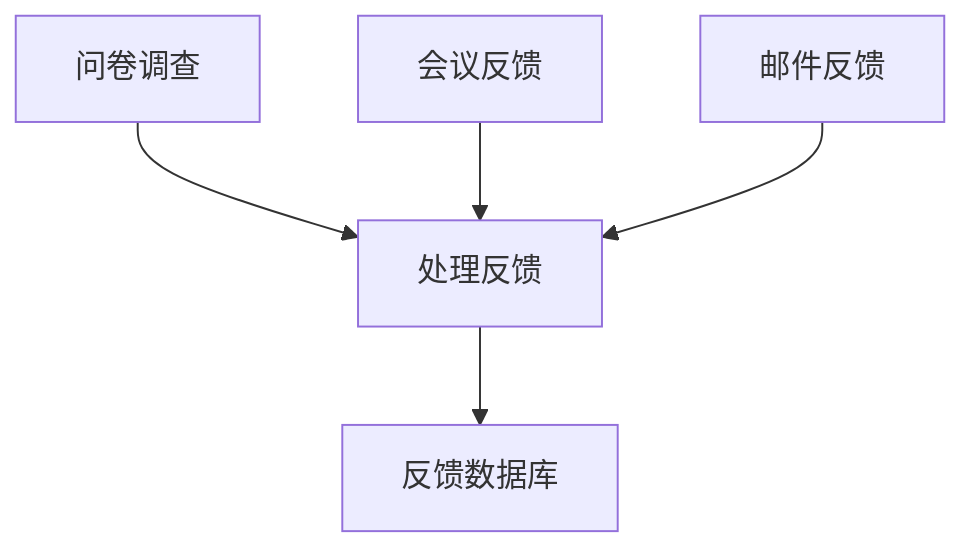

**系统接口设计（Mermaid序列图）**：

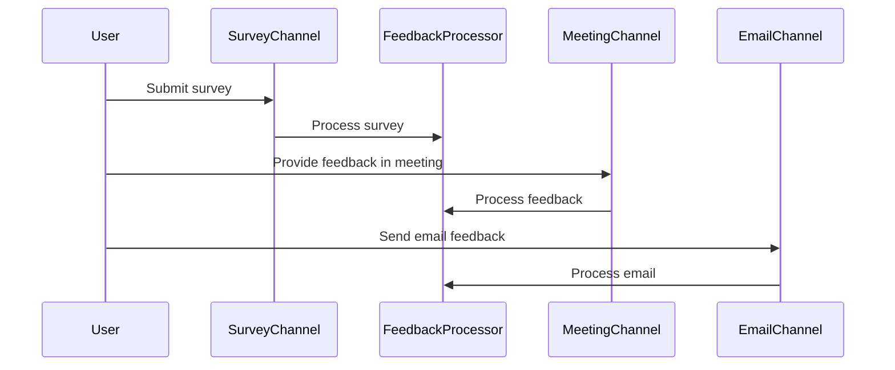

**系统交互（Mermaid序列图）**：

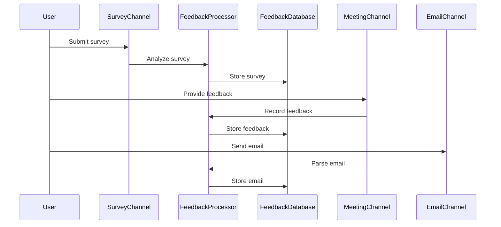

**算法原理讲解**：

选择和优化反馈渠道时，需要考虑以下因素：

1. **反馈类型**：不同的反馈渠道适用于不同类型的反馈，如定量反馈适合问卷调查，定性反馈适合会议讨论。
2. **反馈频率**：高频反馈适合使用在线表单或即时消息，低频反馈适合定期邮件或书面报告。
3. **用户习惯**：根据用户的偏好选择最合适的反馈渠道，以提高反馈提交率。

**Python源代码**：

```python
# 调查问卷渠道
def survey_channel(feedback问卷):
    responses = []
    for question in feedback问卷:
        response = input(question)
        responses.append(response)
    return responses

# 会议反馈渠道
def meeting_channel(feedback记录):
    feedback = input("请提供您的反馈：")
    return feedback

# 邮件反馈渠道
def email_channel(feedback邮件):
    return feedback邮件.strip()
```

**举例说明**：

一个企业选择问卷调查和邮件反馈作为主要反馈渠道。为了提高问卷调查的参与度，团队设计了简洁直观的问卷，并通过邮件发送给所有员工。同时，团队定期通过邮件收集员工对工作和生活环境的反馈，以确保及时了解员工的需求和建议。

**Mermaid流程图**：

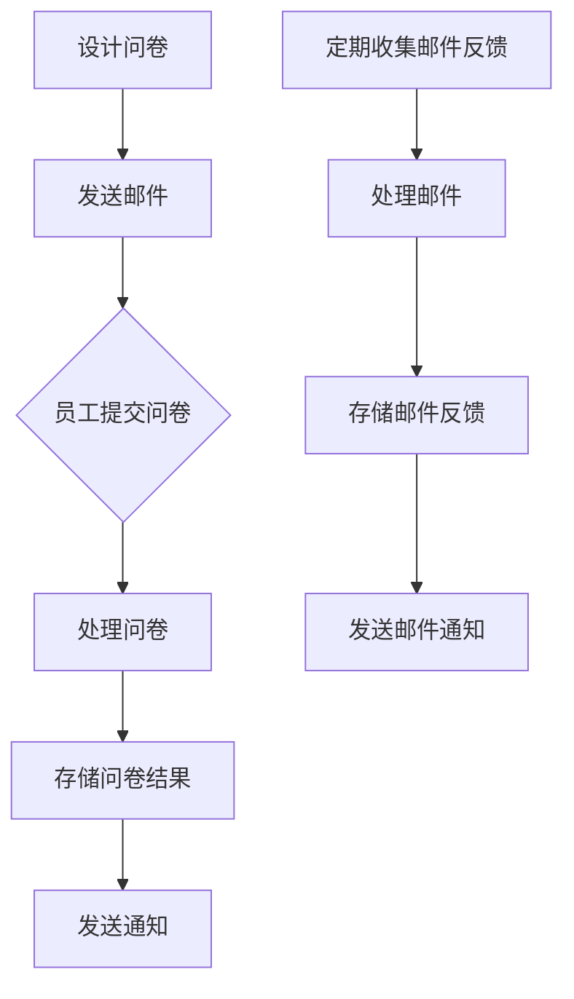

#### 2.3 反馈反馈：闭环的重要性

**背景介绍**：

反馈反馈，即对反馈的反馈，是确保反馈机制有效运行的关键环节。通过反馈反馈，组织可以确保反馈信息的准确性和及时性，从而更好地实现持续改进。

**项目介绍**：

本文将以一个IT公司的项目管理为例，介绍如何实施反馈反馈机制。

**系统功能设计（Mermaid类图）**：

```mermaid
classDiagram
    FeedbackCycle <<Component>>
    FeedbackDatabase <<Database>>
    NotificationSystem <<System>>

    FeedbackCycle --> FeedbackDatabase
    FeedbackCycle --> NotificationSystem
```

**系统架构设计（Mermaid架构图）**：

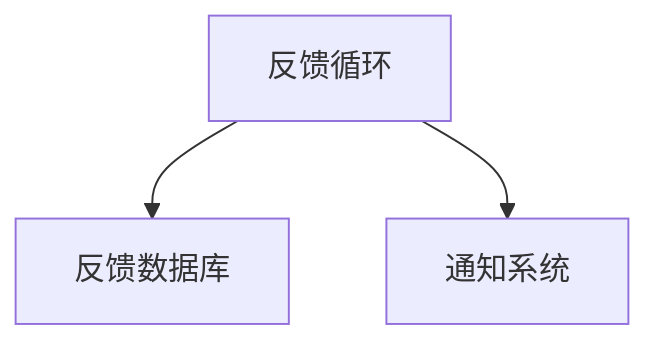

**系统接口设计（Mermaid序列图）**：

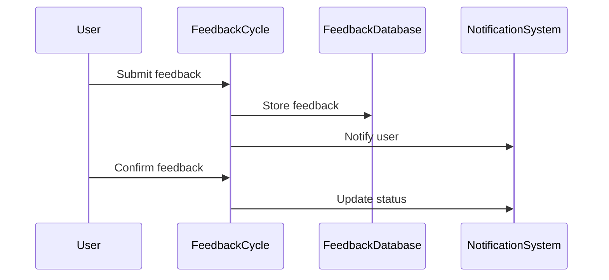

**系统交互（Mermaid序列图）**：

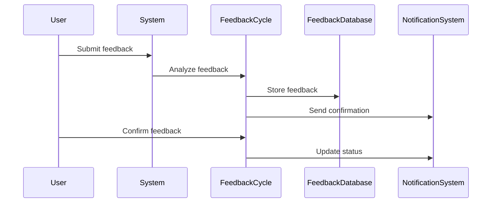

**算法原理讲解**：

反馈反馈机制的核心在于确保反馈信息的闭环处理，即反馈的提交、处理、确认和再处理。通过这个闭环，组织可以确保每个反馈都得到妥善处理，并能够及时反馈给相关用户。

**数学模型和公式**：

- **闭环处理率**：\(\text{闭环处理率} = \frac{\text{闭环处理的反馈数量}}{\text{总反馈数量}}\)
- **反馈响应时间**：\(\text{响应时间} = \frac{\text{反馈处理时间}}{\text{反馈提交时间}}\)

**Python源代码**：

```python
# 反馈确认
def confirm_feedback(feedback_id, feedback数据库):
    feedback = feedback数据库[feedback_id]
    confirmation = input(f"确认反馈：{feedback['内容']}？(是/否)")
    if confirmation.lower() == '是':
        feedback['状态'] = '已确认'
    else:
        feedback['状态'] = '待确认'
    feedback数据库.update(feedback)
    print("反馈确认成功。")

# 反馈处理
def process_feedback(feedback_id, feedback数据库):
    feedback = feedback数据库[feedback_id]
    if feedback['状态'] == '待处理':
        feedback['状态'] = '处理中'
        # 处理反馈逻辑
        feedback['处理结果'] = '已处理'
    print(f"反馈{feedback_id}处理完成。")
```

**举例说明**：

在一个项目管理中，团队成员提交了关于项目进度和资源分配的反馈。项目经理对每个反馈进行分析和处理，并通过系统通知团队成员反馈的处理结果。团队成员可以确认或修改他们的反馈，确保每个反馈都得到妥善处理。

**Mermaid流程图**：

```mermaid
graph TB
    A[提交反馈] --> B[处理反馈]
    B --> C{确认反馈}
    C --> D[反馈闭环]
```

#### 2.4 本章小结

本文详细介绍了如何构建和优化反馈机制，包括设计原则、反馈渠道的选择与优化以及反馈反馈的重要性。通过有效的反馈机制，组织可以确保信息流畅、准确和及时地传递，从而实现持续改进。在下一章中，我们将探讨如何培养个人和团队的反馈意识，为建立全面的反馈文化奠定基础。

### 第三部分：培养反馈意识

#### 3.1 个人层面的反馈意识培养

**背景介绍**：

在反馈文化的建立过程中，个人层面的反馈意识培养至关重要。个人的反馈意识决定了他们是否愿意主动寻求和提供反馈，这对于组织的整体反馈文化有着深远的影响。

**项目介绍**：

本文将介绍一个员工培训项目，旨在提高员工对反馈的认知和接受程度。

**系统功能设计（Mermaid类图）**：

```mermaid
classDiagram
    EmployeeTraining <<System>>
    FeedbackAwareness <<Module>>

    EmployeeTraining --> FeedbackAwareness
```

**系统架构设计（Mermaid架构图）**：

```mermaid
graph TB
    EmployeeTraining[员工培训] --> FeedbackAwareness[反馈意识培养]
    FeedbackAwareness --> KnowledgeBase[知识库]
```

**系统接口设计（Mermaid序列图）**：

```mermaid
sequenceDiagram
    Employee ->> EmployeeTraining: Start training
    EmployeeTraining ->> FeedbackAwareness: Access resources
    FeedbackAwareness ->> KnowledgeBase: Retrieve information
```

**系统交互（Mermaid序列图）**：

```mermaid
sequenceDiagram
    Employee ->> TrainingSystem: Begin training
    TrainingSystem ->> KnowledgeBase: Provide feedback training materials
    KnowledgeBase ->> Employee: Deliver resources
    Employee ->> TrainingSystem: Complete training
    TrainingSystem ->> PerformanceEvaluation: Update feedback skills
```

**算法原理讲解**：

个人反馈意识的培养可以采用以下算法原理：

1. **知识普及**：通过培训和教育，提高员工对反馈概念的理解和认知。
2. **实践操作**：通过实际操作和模拟练习，增强员工提供和接受反馈的能力。
3. **反馈评估**：通过定期评估，监控员工的反馈意识和技能水平。

**数学模型和公式**：

- **反馈意识指数**：\(\text{反馈意识指数} = \frac{\text{反馈积极员工数量}}{\text{总员工数量}}\)

**Python源代码**：

```python
# 反馈意识评估
def feedback_awareness评估(employee技能):
    if employee技能 >= 80:
        return "高"
    elif employee技能 >= 60:
        return "中"
    else:
        return "低"

# 培训记录
def record_training(employee_id, training_system):
    employee = training_system[employee_id]
    employee['培训记录'].append('完成反馈意识培训')
    print(f"员工{employee_id}的培训记录已更新。")
```

**举例说明**：

假设一个公司通过在线培训平台向所有员工提供反馈意识培训。培训完成后，员工可以通过考试来评估自己的反馈技能。根据评估结果，公司为每位员工提供了个性化的反馈提升计划。

**Mermaid流程图**：

```mermaid
graph TB
    A[开始培训] --> B[完成培训]
    B --> C{反馈技能评估}
    C --> D{个性化提升计划}
```

#### 3.2 团队层面的反馈意识培养

**背景介绍**：

团队层面的反馈意识培养是建立整体反馈文化的重要环节。一个团队如果能够积极实践反馈文化，将会极大地提升团队协作效率和工作质量。

**项目介绍**：

本文将介绍一个团队反馈意识培养的项目，包括团队建设活动、定期反馈会议和绩效评估等。

**系统功能设计（Mermaid类图）**：

```mermaid
classDiagram
    TeamBuildingActivity <<System>>
    FeedbackMeeting <<System>>
    PerformanceEvaluation <<System>>

    TeamBuildingActivity --> FeedbackMeeting
    FeedbackMeeting --> PerformanceEvaluation
```

**系统架构设计（Mermaid架构图）**：

```mermaid
graph TB
    TeamBuildingActivity[团队建设活动] --> FeedbackMeeting[反馈会议]
    FeedbackMeeting --> PerformanceEvaluation[绩效评估]
```

**系统接口设计（Mermaid序列图）**：

```mermaid
sequenceDiagram
    Team ->> TeamBuildingActivity: Participate in activity
    TeamBuildingActivity ->> FeedbackMeeting: Conduct feedback meeting
    FeedbackMeeting ->> PerformanceEvaluation: Assess performance
```

**系统交互（Mermaid序列图）**：

```mermaid
sequenceDiagram
    Team ->> TeamBuildingActivity: Engage in team-building
    TeamBuildingActivity ->> FeedbackMeeting: Schedule meeting
    FeedbackMeeting ->> Team: Collect feedback
    Team ->> PerformanceEvaluation: Submit performance data
    PerformanceEvaluation ->> Team: Provide feedback report
```

**算法原理讲解**：

团队层面的反馈意识培养可以采用以下算法原理：

1. **团队活动**：通过团队建设活动，增强团队成员之间的信任和协作。
2. **反馈会议**：定期组织反馈会议，让团队成员分享经验和建议。
3. **绩效评估**：通过绩效评估，激励团队成员积极参与反馈和改进。

**数学模型和公式**：

- **团队反馈参与度**：\(\text{团队反馈参与度} = \frac{\text{参与反馈的团队成员数量}}{\text{总团队成员数量}}\)
- **团队绩效改进率**：\(\text{团队绩效改进率} = \frac{\text{改进后的绩效指标}}{\text{原始绩效指标}}\)

**Python源代码**：

```python
# 团队反馈会议记录
def record_meeting(feedback会议内容):
    meeting内容 = {
        '会议时间': '2023-11-10',
        '会议内容': feedback会议内容,
        '参与人员': ['张三', '李四', '王五']
    }
    return meeting内容

# 绩效评估
def assess_performance(team绩效数据):
    improvement_rate = team绩效数据['改进后绩效'] / team绩效数据['原始绩效']
    if improvement_rate > 1.1:
        return '优秀'
    elif improvement_rate > 1.0:
        return '良好'
    else:
        return '一般'
```

**举例说明**：

一个团队通过定期的团队建设活动和反馈会议，提高了成员之间的沟通和协作。在每次反馈会议后，团队成员会提交绩效数据，通过绩效评估来激励大家持续改进。

**Mermaid流程图**：

```mermaid
graph TB
    A[团队建设活动] --> B[反馈会议]
    B --> C{绩效评估}
    C --> D[团队激励]
```

#### 3.3 组织层面的反馈意识培养

**背景介绍**：

组织层面的反馈意识培养是确保整个组织文化适应持续改进的关键。只有当组织的领导层和所有员工都认识到反馈的重要性并付诸实践时，反馈文化才能真正在组织中扎根。

**项目介绍**：

本文将介绍一个组织层面反馈意识培养的项目，包括领导层的引导、政策支持和文化建设等。

**系统功能设计（Mermaid类图）**：

```mermaid
classDiagram
    LeadershipGuidance <<System>>
    PolicySupport <<System>>
    CulturalEnforcement <<System>>

    LeadershipGuidance --> PolicySupport
    PolicySupport --> CulturalEnforcement
```

**系统架构设计（Mermaid架构图）**：

```mermaid
graph TB
    LeadershipGuidance[领导层引导] --> PolicySupport[政策支持]
    PolicySupport --> CulturalEnforcement[文化强化]
```

**系统接口设计（Mermaid序列图）**：

```mermaid
sequenceDiagram
    Leadership ->> LeadershipGuidance: Provide guidance
    LeadershipGuidance ->> PolicySupport: Develop policies
    PolicySupport ->> CulturalEnforcement: Promote culture
```

**系统交互（Mermaid序列图）**：

```mermaid
sequenceDiagram
    Leadership ->> TrainingProgram: Initiate feedback culture
    TrainingProgram ->> Employees: Conduct training
    Employees ->> PolicyCompliance: Follow policies
    PolicyCompliance ->> CulturalEnforcement: Foster feedback habits
```

**算法原理讲解**：

组织层面的反馈意识培养可以采用以下算法原理：

1. **领导层引导**：通过领导层的示范和倡导，树立反馈文化的榜样。
2. **政策支持**：制定和实施支持反馈文化的政策，如奖励制度、绩效指标等。
3. **文化强化**：通过多种方式（如宣传、活动、表彰等）强化反馈文化的氛围。

**数学模型和公式**：

- **领导层反馈参与度**：\(\text{领导层反馈参与度} = \frac{\text{参与反馈的领导人数}}{\text{总领导人数}}\)
- **员工反馈满意度**：\(\text{员工反馈满意度} = \frac{\text{满意的员工数量}}{\text{总员工数量}}\)

**Python源代码**：

```python
# 领导层反馈参与度评估
def leadership_involvement(leader_list):
    involved_leaders = sum([1 for leader in leader_list if leader['参与反馈'] == '是'])
    return involved_leaders / len(leader_list)

# 员工反馈满意度评估
def employee_satisfaction(feedback满意度_list):
    satisfied_employees = sum([1 for satisfaction in feedback满意度_list if satisfaction >= 4])
    return satisfied_employees / len(feedback满意度_list)
```

**举例说明**：

一个公司通过领导层的积极倡导和制定相关政策，如每月的反馈报告奖励和绩效指标的反馈部分，来培养员工的反馈意识。同时，公司还定期举办反馈文化宣传活动，以强化组织的反馈文化氛围。

**Mermaid流程图**：

```mermaid
graph TB
    A[领导层倡导] --> B[政策制定]
    B --> C{文化强化}
    C --> D{员工激励}
```

#### 3.4 本章小结

本文详细探讨了个人、团队和组织层面的反馈意识培养方法。通过有效的培训、活动和政策支持，组织可以逐步培养和强化成员的反馈意识，为建立全面的反馈文化奠定基础。在下一部分，我们将通过实际案例分析和最佳实践分享，进一步展示如何将反馈文化应用于项目管理、团队协作等具体场景。

### 第四部分：反馈文化实践

#### 4.1 项目管理中的应用

**背景介绍**：

在项目管理中，反馈文化被广泛应用于提高项目效率、质量和用户满意度。通过有效的反馈机制，项目团队能够及时发现和解决潜在问题，从而确保项目的成功实施。

**项目介绍**：

本文将以一个软件开发项目为例，展示如何在项目管理中应用反馈文化。

**系统功能设计（Mermaid类图）**：

```mermaid
classDiagram
    ProjectManagement <<System>>
    FeedbackMechanism <<Module>>

    ProjectManagement --> FeedbackMechanism
```

**系统架构设计（Mermaid架构图）**：

```mermaid
graph TB
    ProjectManagement[项目管理] --> FeedbackMechanism[反馈机制]
    FeedbackMechanism --> IssueTracking[问题跟踪]
    FeedbackMechanism --> PerformanceMonitoring[性能监控]
```

**系统接口设计（Mermaid序列图）**：

```mermaid
sequenceDiagram
    Developer ->> ProjectManagement: Report issue
    ProjectManagement ->> FeedbackMechanism: Analyze issue
    FeedbackMechanism ->> IssueTracking: Log issue
    FeedbackMechanism ->> PerformanceMonitoring: Monitor progress
```

**系统交互（Mermaid序列图）**：

```mermaid
sequenceDiagram
    Developer ->> System: Report a bug
    System ->> IssueTracking: Log the bug
    IssueTracking ->> Developer: Acknowledge receipt
    Developer ->> Tester: Request testing
    Tester ->> System: Confirm fix
    System ->> Developer: Inform of resolution
```

**算法原理讲解**：

在项目管理中，反馈文化可以采用以下算法原理：

1. **问题报告**：项目成员通过反馈机制报告遇到的问题。
2. **问题分析**：反馈机制对报告的问题进行分析和分类。
3. **问题跟踪**：通过问题跟踪系统，记录和跟踪问题的处理进度。
4. **性能监控**：实时监控项目的进展和性能，及时调整项目计划。

**数学模型和公式**：

- **问题解决率**：\(\text{问题解决率} = \frac{\text{已解决的问题数量}}{\text{报告的问题总数}}\)
- **反馈响应时间**：\(\text{反馈响应时间} = \frac{\text{反馈处理时间}}{\text{问题报告时间}}\)

**Python源代码**：

```python
# 问题报告
def report_issue(issue_description, issue_tracking):
    issue = {'描述': issue_description, '状态': '待处理'}
    issue_tracking.append(issue)
    print("问题已报告。")

# 问题解决
def resolve_issue(issue_id, issue_tracking):
    issue = issue_tracking[issue_id]
    if issue['状态'] == '待处理':
        issue['状态'] = '已解决'
    print(f"问题{issue_id}已解决。")
```

**举例说明**：

在一个软件开发项目中，开发者报告了一个功能缺陷。通过问题跟踪系统，项目团队分析了问题，并在测试阶段确认了缺陷的存在。最终，开发者修复了这个问题，并通过反馈机制通知了相关团队成员。

**Mermaid流程图**：

```mermaid
graph TB
    A[报告问题] --> B[问题分析]
    B --> C[问题跟踪]
    C --> D[问题解决]
    D --> E[通知反馈]
```

#### 4.2 反馈文化在团队协作中的角色

**背景介绍**：

团队协作是项目管理中的核心环节，而反馈文化在团队协作中扮演着至关重要的角色。通过有效的反馈，团队可以更好地理解彼此的需求和期望，从而提高协作效率和成果质量。

**项目介绍**：

本文将介绍一个跨部门团队合作项目，展示反馈文化在团队协作中的应用。

**系统功能设计（Mermaid类图）**：

```mermaid
classDiagram
    TeamCollaboration <<System>>
    FeedbackModule <<Module>>

    TeamCollaboration --> FeedbackModule
```

**系统架构设计（Mermaid架构图）**：

```mermaid
graph TB
    TeamCollaboration[团队协作] --> FeedbackModule[反馈模块]
    FeedbackModule --> CommunicationChannel[通信渠道]
    FeedbackModule --> CollaborationTools[协作工具]
```

**系统接口设计（Mermaid序列图）**：

```mermaid
sequenceDiagram
    TeamMember ->> TeamCollaboration: Submit feedback
    TeamCollaboration ->> FeedbackModule: Analyze feedback
    FeedbackModule ->> CommunicationChannel: Distribute feedback
    FeedbackModule ->> CollaborationTools: Implement changes
```

**系统交互（Mermaid序列图）**：

```mermaid
sequenceDiagram
    TeamMember ->> CollaborationTool: Provide feedback
    CollaborationTool ->> FeedbackModule: Log feedback
    FeedbackModule ->> ProjectManager: Report feedback
    ProjectManager ->> TeamMember: Acknowledge feedback
    TeamMember ->> CollaborationTool: Confirm changes
```

**算法原理讲解**：

在团队协作中，反馈文化可以采用以下算法原理：

1. **反馈收集**：通过协作工具和通信渠道，收集团队成员的反馈。
2. **反馈分析**：对收集到的反馈进行分析，识别关键问题和改进点。
3. **反馈实施**：根据分析结果，制定和实施改进措施。

**数学模型和公式**：

- **团队反馈参与度**：\(\text{团队反馈参与度} = \frac{\text{提供反馈的团队成员数量}}{\text{总团队成员数量}}\)
- **团队协作效率**：\(\text{团队协作效率} = \frac{\text{项目完成度}}{\text{团队协作时间}}\)

**Python源代码**：

```python
# 反馈收集
def collect_feedback(feedback渠道):
    feedbacks = []
    while True:
        feedback = input("请提供您的反馈：")
        if feedback.strip() == '':
            break
        feedbacks.append(feedback)
    return feedbacks

# 反馈分析
def analyze_feedback(feedbacks):
    issues = []
    for feedback in feedbacks:
        if '问题' in feedback:
            issues.append(feedback)
    return issues

# 反馈实施
def implement_feedback(issues, collaboration_tool):
    for issue in issues:
        collaboration_tool.update(issue)
```

**举例说明**：

在一个跨部门团队合作项目中，团队成员通过协作工具提交了关于项目进展和协作效率的反馈。项目经理分析了这些反馈，并制定了改进计划。最终，团队成员根据改进计划调整了协作方式，项目进展显著加快。

**Mermaid流程图**：

```mermaid
graph TB
    A[收集反馈] --> B[分析反馈]
    B --> C{实施改进}
    C --> D{确认效果}
```

#### 4.3 案例分析与最佳实践

**案例一：敏捷开发中的反馈文化**

**背景**：

某IT公司采用敏捷开发模式，希望通过反馈文化提高项目质量和团队协作效率。

**解决方案**：

- **每日站会**：每天早上召开站会，团队成员分享项目进展、遇到的问题和需要协助的地方。
- **迭代评审**：在每个迭代结束时，组织迭代评审会议，评估迭代成果，收集用户反馈。
- **迭代回顾**：迭代结束后，团队进行回顾会议，总结成功经验和改进点。

**效果**：

通过这些实践，项目团队及时发现了问题并迅速解决，用户满意度显著提升。

**最佳实践**：

- 定期举行反馈会议，确保反馈信息的及时性和准确性。
- 建立反馈渠道，鼓励团队成员主动提交反馈。
- 对反馈进行分析和分类，制定具体的改进措施。

**案例二：跨部门团队协作中的反馈文化**

**背景**：

某大型企业希望提高不同部门之间的协作效率，实现资源的最大化利用。

**解决方案**：

- **定期跨部门会议**：每个季度组织一次跨部门会议，讨论项目进展和协作中的问题。
- **反馈平台**：建立一个反馈平台，各部门可以提交协作中的问题和建议。
- **绩效指标**：将协作效率作为各部门绩效考核的一部分，鼓励团队成员积极参与协作。

**效果**：

通过这些措施，部门之间的协作效率显著提高，项目完成质量得到保障。

**最佳实践**：

- 明确跨部门协作的目标和期望，确保团队成员对协作有共同的理解。
- 建立反馈机制，及时收集和解决协作中的问题。
- 对协作成果进行评估，激励团队成员持续改进。

#### 4.4 本章小结

通过实际案例分析和最佳实践分享，我们看到了反馈文化在项目管理、团队协作中的应用及其带来的显著效果。有效的反馈文化不仅能够提高项目质量和团队协作效率，还能激发员工的创新和改进意识。在下一部分，我们将探讨如何评估和改进反馈文化，确保其持续优化。

### 第五部分：反馈文化的评估与改进

#### 5.1 评估与改进策略

**背景介绍**：

为了确保反馈文化能够持续推动组织的持续改进，定期的评估和改进至关重要。通过系统化的评估，组织可以了解反馈文化的实施效果，发现潜在问题，并制定相应的改进措施。

**项目介绍**：

本文将介绍一个企业反馈文化评估与改进的项目，展示如何通过定量和定性分析来评估反馈文化的有效性。

**系统功能设计（Mermaid类图）**：

```mermaid
classDiagram
    FeedbackCultureEvaluation <<System>>
    DataCollection <<Module>>
    AnalysisTools <<Module>>
    ImprovementPlanning <<Module>>

    FeedbackCultureEvaluation --> DataCollection
    FeedbackCultureEvaluation --> AnalysisTools
    FeedbackCultureEvaluation --> ImprovementPlanning
```

**系统架构设计（Mermaid架构图）**：

```mermaid
graph TB
    FeedbackCultureEvaluation[反馈文化评估] --> DataCollection[数据收集]
    DataCollection --> AnalysisTools[分析工具]
    AnalysisTools --> ImprovementPlanning[改进规划]
    ImprovementPlanning --> FeedbackCultureEvaluation
```

**系统接口设计（Mermaid序列图）**：

```mermaid
sequenceDiagram
    FeedbackCultureEvaluation -> DataCollection: Collect feedback data
    DataCollection -> AnalysisTools: Analyze feedback
    AnalysisTools -> ImprovementPlanning: Plan improvements
    ImprovementPlanning -> FeedbackCultureEvaluation: Implement changes
```

**系统交互（Mermaid序列图）**：

```mermaid
sequenceDiagram
    EvaluationSystem ->> DataCollection: Retrieve feedback metrics
    DataCollection ->> AnalysisTools: Perform statistical analysis
    AnalysisTools ->> ImprovementPlanning: Identify issues
    ImprovementPlanning ->> DataCollection: Implement corrective actions
    DataCollection ->> EvaluationSystem: Confirm improvements
```

**算法原理讲解**：

评估与改进策略可以采用以下算法原理：

1. **数据收集**：通过多种渠道（如问卷调查、访谈、观察等）收集反馈数据。
2. **数据分析**：使用统计分析、对比分析等方法，分析反馈数据，识别关键问题。
3. **改进规划**：根据分析结果，制定具体的改进措施和行动计划。
4. **实施与监控**：执行改进计划，并监控改进效果，确保反馈文化持续优化。

**数学模型和公式**：

- **反馈参与度**：\(\text{反馈参与度} = \frac{\text{提供反馈的人数}}{\text{总人数}}\)
- **问题解决率**：\(\text{问题解决率} = \frac{\text{已解决的问题数量}}{\text{总问题数量}}\)
- **改进效果评估**：\(\text{改进效果} = \frac{\text{改进后的指标}}{\text{原始指标}}\)

**Python源代码**：

```python
# 数据收集
def collect_data(questionnaire):
    responses = []
    while True:
        response = input(questionnaire)
        if response.strip() == '':
            break
        responses.append(response)
    return responses

# 数据分析
def analyze_data(feedbacks):
    issues = []
    for feedback in feedbacks:
        if '问题' in feedback:
            issues.append(feedback)
    return issues

# 改进规划
def plan_improvements(issues):
    action_plan = []
    for issue in issues:
        action_plan.append({'问题': issue, '措施': '待制定'})
    return action_plan

# 实施与监控
def implement_improvements(action_plan):
    for action in action_plan:
        action['状态'] = '进行中'
    print("改进计划已实施。")
```

**举例说明**：

假设一个企业希望通过问卷调查来评估员工的反馈参与度和问题解决率。问卷结束后，企业收集了所有员工的反馈，并通过Python脚本分析了数据。根据分析结果，企业制定了改进计划，包括改进反馈渠道和加强问题解决机制。在执行改进计划后，企业再次进行了问卷调查，验证改进效果。

**Mermaid流程图**：

```mermaid
graph TB
    A[数据收集] --> B[数据分析]
    B --> C{制定改进计划}
    C --> D[实施改进]
    D --> E[监控效果]
```

#### 5.2 面临的挑战与应对

**挑战一：反馈机制的实施难度**

**背景**：

在建立反馈机制时，很多组织面临实施难度大的挑战，包括技术难题、流程设计和员工接受度等问题。

**解决方案**：

- **技术支持**：引入专业的反馈系统，提供数据收集、分析和通知等功能。
- **流程设计**：设计简洁、高效的反馈流程，确保员工易于理解和操作。
- **员工培训**：通过培训，提高员工对反馈机制的认识和接受度。

**案例**：

某企业引入了专业的反馈管理系统，通过定期的培训提高了员工的使用熟练度。同时，企业简化了反馈流程，使得员工可以轻松提交和查看反馈，有效降低了实施难度。

**挑战二：反馈数据的真实性和可靠性**

**背景**：

反馈数据的真实性和可靠性对反馈文化的有效性至关重要。如果反馈数据不准确或存在偏见，将会影响改进措施的制定和实施。

**解决方案**：

- **匿名反馈**：鼓励员工匿名提交反馈，保护反馈者的隐私。
- **数据验证**：对反馈数据进行分析和筛选，识别异常值和偏见。
- **持续监督**：建立反馈数据的监督机制，确保反馈信息的真实性和可靠性。

**案例**：

某企业采用了匿名反馈机制，并建立了数据验证团队，定期对反馈数据进行分析和验证。通过这些措施，企业确保了反馈数据的真实性和可靠性。

**挑战三：反馈文化的持续推广和维护

**背景**：

在反馈文化初步建立后，如何持续推广和维护是组织面临的重要挑战。

**解决方案**：

- **领导层支持**：获得领导层的持续支持和倡导，确保反馈文化的推广。
- **文化建设**：通过宣传、活动和表彰等方式，营造积极的反馈文化氛围。
- **绩效激励**：将反馈参与度纳入员工绩效指标，激励员工积极参与反馈。

**案例**：

某企业通过领导层的积极倡导和定期的反馈文化活动，成功推广了反馈文化。同时，企业将反馈参与度纳入员工绩效指标，激发了员工的积极参与。

**挑战四：跨部门和跨组织的反馈协作

**背景**：

在大型组织或跨组织合作中，如何实现有效的跨部门和跨组织的反馈协作是组织面临的一个难题。

**解决方案**：

- **统一平台**：建立统一的反馈平台，实现跨部门和跨组织的反馈数据共享。
- **沟通机制**：建立有效的沟通机制，确保各部门和合作伙伴之间的反馈信息流畅。
- **协调管理**：设立专门的协调团队，负责跨部门和跨组织的反馈管理工作。

**案例**：

某大型企业通过建立统一的反馈平台，实现了跨部门和跨组织的反馈协作。同时，企业设立了跨部门协调团队，负责协调和管理跨组织的反馈工作，确保反馈信息的及时传递和处理。

#### 5.3 未来趋势与展望

**趋势一：智能化反馈系统的发展**

随着人工智能和大数据技术的发展，智能化反馈系统将越来越普及。这些系统可以自动收集、分析和处理反馈数据，提供实时和个性化的反馈建议，提高反馈效率和质量。

**趋势二：个性化反馈机制的普及**

未来的反馈文化将更加注重个性化，根据不同员工和项目的需求，设计定制化的反馈机制。个性化反馈机制将更好地满足员工的需求，提高反馈参与度和改进效果。

**趋势三：反馈文化的全球化应用**

随着全球化的发展，反馈文化将在不同国家和地区的组织中得到广泛应用。不同文化背景下的组织将借鉴和融合反馈文化的最佳实践，形成适应全球环境的反馈文化。

**展望**：

未来，反馈文化将成为组织持续改进和创新的重要驱动力。通过智能化、个性化和全球化的反馈文化实践，组织将能够更有效地应对快速变化的市场环境，实现持续成长和成功。

### 第六部分：反馈文化的未来趋势与挑战

#### 6.1 反馈文化的未来趋势

随着信息技术的不断进步和企业管理理念的更新，反馈文化正在经历一系列显著的趋势变化，这些趋势不仅改变了反馈文化的表现形式，也为其在组织中的实践带来了新的机遇和挑战。

**趋势一：智能化反馈系统的广泛应用**

随着人工智能（AI）和大数据技术的发展，智能化反馈系统将成为未来反馈文化的重要组成部分。这些系统能够自动收集、分析和处理大量的反馈数据，提供实时和个性化的反馈建议。例如，AI驱动的反馈分析工具可以识别出反馈中的关键趋势和模式，帮助组织快速采取行动。此外，智能反馈系统还可以通过自然语言处理（NLP）技术，理解和解释员工的非结构化反馈，从而提供更准确的改进建议。

**趋势二：个性化反馈机制的普及**

在传统的反馈机制中，往往存在“一刀切”的问题，即所有员工和项目都使用相同的反馈方法。然而，随着个性化管理的兴起，未来的反馈文化将更加注重个体差异，根据不同员工和项目的需求，设计定制化的反馈机制。这种个性化的反馈机制能够更好地满足员工的需求，提高反馈的参与度和改进效果。例如，对于技术团队，可以设计代码审查和自动测试的反馈流程，而对于客户服务团队，可以设计客户满意度调查和即时反馈机制。

**趋势三：反馈文化的全球化应用**

全球化带来了跨国团队合作和文化交流的需求，反馈文化在全球范围内的应用将成为未来的一大趋势。不同国家和地区的组织将借鉴和融合反馈文化的最佳实践，形成适应全球环境的反馈文化。例如，美国公司的敏捷开发方法与日本公司的精益生产理念相结合，可以在全球范围内的项目管理中实现高效的反馈循环。同时，跨国组织的多样性也将促进反馈文化的创新，通过不同文化的碰撞和融合，形成更加丰富和多样的反馈实践。

**趋势四：反馈与数字化的深度融合**

随着企业数字化转型的推进，反馈文化将与数字技术深度融合。企业将通过数字平台和工具实现反馈的全流程管理，从反馈收集、处理到分析、报告，每一个环节都将数字化。这不仅提高了反馈的效率和准确性，也为数据驱动的决策提供了坚实的基础。例如，企业可以通过在线反馈平台实时收集员工的意见和建议，并通过数据可视化工具展示反馈分析结果，帮助管理层快速做出决策。

#### 6.2 反馈文化面临的挑战

尽管反馈文化在组织中发挥着重要作用，但其推广和应用仍然面临一系列挑战。这些挑战不仅涉及到技术层面，还包括文化、管理和员工心理等方面。

**挑战一：数据隐私和安全**

在智能化反馈系统中，数据隐私和安全是首要考虑的问题。反馈数据往往包含了员工的敏感信息，如个人意见、工作表现等。如何确保这些数据的隐私和安全，防止数据泄露或滥用，是组织需要解决的重要问题。为此，组织需要采用先进的数据加密技术和严格的数据访问控制策略，确保反馈数据的保密性和安全性。

**挑战二：员工接受度和参与度**

尽管反馈文化对于组织的持续改进至关重要，但员工对此的接受度和参与度可能并不高。部分员工可能认为反馈是额外的负担，或者担心反馈会影响他们的工作评价。此外，有些员工可能缺乏提供有效反馈的技能和经验。为了提高员工的接受度和参与度，组织需要通过培训和教育，提高员工对反馈文化的重要性和意义的认识，并为他们提供必要的支持和资源。

**挑战三：反馈质量的不确定性**

反馈的质量直接影响其价值。如果反馈内容过于模糊、主观或缺乏具体的改进建议，那么这些反馈可能难以对组织产生实际的改进效果。因此，组织需要建立有效的反馈质量评估机制，确保收集到的反馈能够提供有价值的信息。例如，可以通过设置反馈模板、明确反馈要求和提供反馈培训等方式，提高反馈的针对性和实用性。

**挑战四：跨部门和跨组织的协作**

在大型组织或跨组织合作中，实现有效的跨部门和跨组织的反馈协作是一个挑战。不同部门之间可能存在信息不对称、沟通不畅和利益冲突等问题，这些都会影响反馈的及时性和有效性。为了解决这些问题，组织需要建立统一的反馈平台和沟通机制，确保各部门和合作伙伴之间的反馈信息流畅。同时，设立专门的协调团队，负责跨部门和跨组织的反馈管理工作，以促进协作和沟通。

**挑战五：反馈文化的持续推广和维护**

反馈文化的推广和维护是一个长期的过程，需要持续的投入和努力。在组织内部，可能会出现反馈文化断层或流失的情况，特别是在管理层更替或组织变革时。为了确保反馈文化的持续推广和维护，组织需要制定长期的文化战略，通过领导层的倡导、定期的培训和持续的激励，确保反馈文化在组织中的扎根和传承。

#### 6.3 应对挑战的策略

为了应对反馈文化面临的挑战，组织可以采取一系列策略，以确保反馈文化的有效实施和持续发展。

**策略一：加强数据隐私和安全保护**

组织应采取严格的措施来保护反馈数据的隐私和安全。这包括采用高级数据加密技术、建立数据访问控制机制、定期进行安全审计和培训员工关于数据保护的最佳实践。此外，组织应明确反馈数据的用途和权限，确保员工了解他们的数据如何被使用和保护。

**策略二：提高员工接受度和参与度**

为了提高员工的接受度和参与度，组织可以采取以下措施：

- **领导层倡导**：高层领导的积极参与和倡导可以树立反馈文化的榜样，激发员工的认同感和参与意愿。
- **培训和教育**：为员工提供关于反馈文化的重要性和技巧的培训，帮助他们更好地理解和运用反馈。
- **激励机制**：建立激励机制，奖励积极参与反馈的员工，如表彰、奖金或职业发展机会。
- **反馈渠道的多样化**：提供多种反馈渠道，如匿名反馈、在线反馈和面对面反馈，以满足不同员工的需求。

**策略三：提高反馈质量**

为了提高反馈质量，组织可以：

- **制定反馈模板**：提供结构化的反馈模板，帮助员工提供具体、有针对性的反馈。
- **反馈质量评估**：建立反馈质量评估机制，定期对反馈进行评估，识别和消除模糊、主观或无效的反馈。
- **反馈培训**：定期为员工提供反馈技巧的培训，帮助他们提高反馈的质量和效果。

**策略四：促进跨部门和跨组织的协作**

为了促进跨部门和跨组织的协作，组织可以：

- **建立统一的反馈平台**：建立一个集成的反馈平台，确保各部门和合作伙伴之间的反馈信息畅通。
- **明确沟通机制**：制定明确的沟通机制，确保反馈信息能够及时、准确地传递。
- **设立协调团队**：设立专门的协调团队，负责跨部门和跨组织的反馈管理工作，确保协作的顺利进行。

**策略五：持续推广和维护反馈文化**

为了确保反馈文化的持续推广和维护，组织可以：

- **制定长期文化战略**：制定明确的文化战略，确保反馈文化在组织中的长期发展和传承。
- **领导层倡导**：高层领导应持续倡导反馈文化，确保其在组织中的持续推广。
- **定期培训**：定期为员工提供反馈文化的培训，更新他们的知识和技能。
- **激励机制**：通过激励机制，鼓励员工积极参与反馈文化和改进活动。

#### 6.4 本章小结

反馈文化在组织中的建立和推广是一个复杂且长期的过程，面临着数据隐私和安全、员工接受度和参与度、反馈质量、跨部门协作以及持续推广和维护等一系列挑战。然而，通过采取有效的策略和措施，组织可以克服这些挑战，实现反馈文化的有效实施和持续发展。未来的反馈文化将更加智能化、个性化、全球化和数字化，为组织的持续改进和创新提供强大的支持。通过不断优化反馈机制和实践，组织可以打造一个积极的反馈文化环境，促进其在快速变化的市场环境中保持竞争优势。

### 附录：反馈文化实践指南

#### 实践技巧与注意事项

1. **明确反馈目标和范围**：在建立反馈机制之前，应明确反馈的目标和范围，确保收集到的反馈能够为改进提供有价值的信息。

2. **建立多样化的反馈渠道**：根据组织的不同需求和场景，设计多样化的反馈渠道，如在线问卷、面对面会议、邮件反馈等。

3. **保护反馈者的隐私**：确保反馈者的隐私得到保护，鼓励员工放心提供真实的反馈。

4. **及时处理反馈**：对反馈进行及时处理和回应，提高反馈者的满意度，并确保反馈能够真正为改进提供支持。

5. **培养反馈习惯**：通过培训和教育，培养员工的反馈习惯，提高反馈的质量和效果。

6. **定期评估和优化**：定期对反馈机制进行评估和优化，确保其持续满足组织的需求。

#### 小结与总结

本文通过详细的分析和案例分享，探讨了建立反馈文化的重要性和实践方法。有效的反馈文化不仅能够提高组织的效率和质量，还能够促进团队的协作和创新。通过遵循实践技巧和注意事项，组织可以逐步建立和优化反馈文化，实现持续改进。

#### 拓展阅读

1. 《敏捷开发实践指南》—— 作者：杰里米·图利
   - 本书详细介绍了敏捷开发的方法和实践，为建立高效的反馈文化提供了重要参考。

2. 《哈佛商业评论：员工反馈的力量》
   - 本文探讨了员工反馈对组织绩效和创新的重要性，提供了实用的反馈管理策略。

3. 《数字化转型的反馈文化》
   - 本书分析了数字化时代反馈文化的变化和挑战，为组织在数字化转型中建立有效的反馈文化提供了指导。

通过这些拓展阅读，读者可以更深入地了解反馈文化的构建和应用，进一步优化组织的反馈机制和实践。

