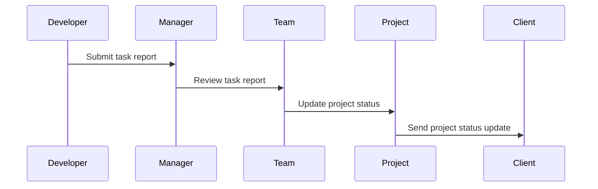
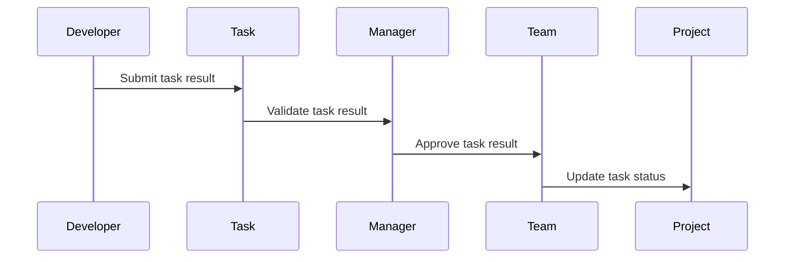
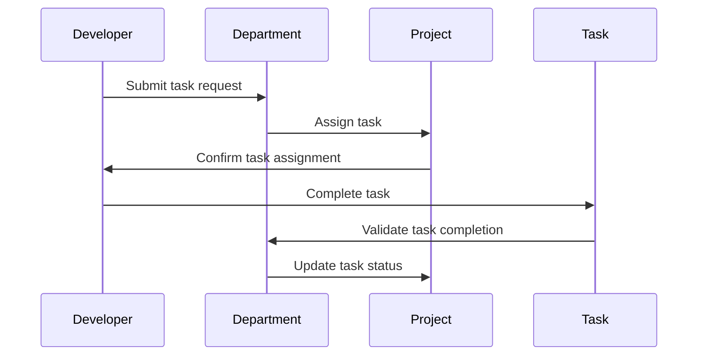
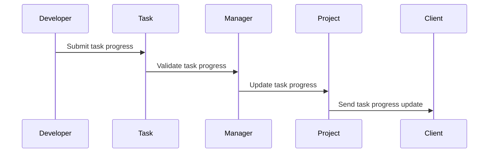

                 

# 建立信任文化：团队效能的基石

关键词：团队效能、信任文化、领导策略、跨部门合作、最佳实践

摘要：本文将探讨信任文化在提升团队效能中的关键作用。通过详细分析信任文化的核心概念、构建与维护方法，以及其在领导、团队和跨部门合作中的应用，提供一套系统的建立信任文化的实践策略。旨在帮助IT领域的企业和团队通过信任文化的建设，提升整体运作效率和项目成功率。

### 目录大纲

1. 第一部分：信任文化的基础
   1.1 信任文化的核心概念
   1.2 信任文化的定义与特征
   1.3 信任文化的重要性

2. 第二部分：信任文化在团队中的应用
   2.1 领导者在建立信任文化中的作用
   2.2 团队成员间的信任建设
   2.3 信任文化在跨部门合作中的应用

3. 第三部分：建立信任文化的最佳实践
   3.1 案例研究一：某企业建立信任文化的实践
   3.2 案例研究二：某国际公司的跨部门信任合作
   3.3 最佳实践总结

4. 小结与拓展阅读

## 第一部分：信任文化的基础

### 1.1 信任文化的核心概念

#### 引言：团队效能与信任文化的关系

在现代社会，IT行业竞争日益激烈，团队效能成为企业成功的关键因素。而信任文化作为团队效能的基石，其重要性不言而喻。一个高效的团队需要成员之间建立相互信任，这不仅能提高沟通效率，还能增强协作能力，减少冲突，提升整体绩效。

#### 问题描述

传统的IT团队常常面临以下问题：

- **沟通不畅**：团队成员之间缺乏信任，导致信息传递不准确、不及时。
- **协作困难**：团队成员互相猜忌，不愿分享资源和知识，导致项目进展缓慢。
- **决策迟缓**：缺乏信任的文化往往导致决策过程冗长，甚至出现无效决策。

#### 问题解决

信任文化的建立，能够有效解决上述问题。它不仅有助于提升团队效能，还能为企业创造可持续的发展动力。

#### 边界与外延

信任文化的边界在于其适用范围，它不仅限于团队内部，还可以扩展到跨部门合作、供应商关系等外部环境中。信任文化的核心在于构建一种相互尊重、透明沟通、共同发展的氛围。

### 1.2 信任的定义与特征

#### 核心概念原理

信任是一种信念，是指个体对另一个体或团队的可靠性和诚实性的信任。它建立在相互了解、相互支持和相互尊重的基础上。

#### 概念属性特征对比表格

| 特征       | 信任       | 不信任       |
|------------|------------|--------------|
| 可靠性     | 高         | 低           |
| 诚实性     | 高         | 低           |
| 透明性     | 高         | 低           |
| 支持性     | 高         | 低           |

#### ER实体关系图架构的Mermaid流程图

```mermaid
erDiagram
  Entity1 ||--|{ Entity2 }|| Member
  Entity1 ||--|{ Entity3 }|| Leader
  Entity2 ||--|{ Entity4 }|| Collaborator
  Entity3 ||--|{ Entity4 }|| Collaborator
```

#### 信任文化的重要性

信任文化的重要性在于其对企业级应用开发的新范式的影响。传统的开发模式强调分工明确、职责清晰，而信任文化则强调团队协作、资源共享、共同目标。

#### 信任文化对企业的影响

- **提高员工满意度**：信任文化能够提高员工的工作满意度和忠诚度。
- **促进创新**：在信任的氛围中，员工更愿意分享创意和想法，促进创新。
- **提升团队效能**：信任文化有助于提高团队的协作效率，缩短项目周期。
- **增强竞争力**：信任文化能够提升企业的整体竞争力，使其在市场中更具优势。

## 第二部分：信任文化在团队中的应用

### 2.1 领导者在建立信任文化中的作用

#### 2.1.1 领导者的角色与责任

领导者在建立信任文化中扮演着关键角色。他们的责任包括：

- **建立信任的愿景**：领导者需要明确表达信任文化的重要性，并制定相关的政策和措施。
- **树立榜样**：领导者需要通过自身行为树立信任的榜样，如诚实、透明、公正等。
- **激励员工**：领导者需要激励员工参与到信任文化的建设过程中，如通过奖励制度等。

#### 2.1.2 建立信任的领导策略

- **开放沟通**：领导者需要与团队成员保持开放沟通，及时回应员工的疑问和需求。
- **公平公正**：领导者需要确保团队中的每一位成员都能公平地获得机会和资源。
- **透明决策**：领导者需要将决策过程透明化，让团队成员了解决策的原因和结果。

#### 2.1.3 领导者的自我提升

- **持续学习**：领导者需要不断学习新的管理理念和技能，以适应不断变化的环境。
- **心理素质**：领导者需要具备良好的心理素质，如耐心、冷静、自信等，以应对团队中的各种挑战。

### 2.2 团队成员间的信任建设

#### 2.2.1 团队成员间的信任关系

团队成员间的信任关系是信任文化的基础。它包括：

- **相互尊重**：团队成员需要尊重彼此的观点和工作方式。
- **诚实交流**：团队成员需要诚实面对问题，积极寻求解决方案。
- **共同目标**：团队成员需要共同为实现团队目标而努力。

#### 2.2.2 促进团队成员信任的建设策略

- **团队建设活动**：通过团队建设活动，如团队拓展训练、团队聚餐等，增强团队成员间的相互了解和信任。
- **定期反馈**：通过定期反馈机制，如周会、月度评估等，促进团队成员间的沟通和合作。
- **资源共享**：通过资源共享，如知识库、工具等，增强团队成员间的协作和信任。

#### 2.2.3 信任冲突的处理

- **冷静分析**：在处理信任冲突时，需要冷静分析问题的原因和影响，避免情绪化的决策。
- **平等对话**：通过平等对话，让双方有机会表达自己的观点和感受，寻找解决问题的最佳方案。
- **第三方调解**：在必要时，可以邀请第三方进行调解，以中立的角度帮助解决信任冲突。

### 2.3 信任文化在跨部门合作中的应用

#### 2.3.1 跨部门合作中的信任问题

跨部门合作中的信任问题主要包括：

- **利益冲突**：不同部门可能有不同的目标和利益，导致合作过程中出现信任问题。
- **信息不对称**：不同部门之间的信息交流不畅，导致信息不对称，影响合作效果。
- **责任界定不清**：跨部门合作中，责任界定不清可能导致信任问题。

#### 2.3.2 跨部门合作中的信任建设策略

- **共同目标**：明确跨部门合作的共同目标，增强团队成员间的信任。
- **信息共享**：建立信息共享平台，促进部门间的信息交流，减少信息不对称。
- **明确责任**：明确跨部门合作中的责任分工，确保每个部门都清楚自己的职责和任务。

#### 2.3.3 跨部门合作中的信任维护

- **定期沟通**：通过定期沟通，如月度会议、季度评估等，保持跨部门合作中的信任关系。
- **合作评估**：对跨部门合作效果进行定期评估，及时发现和解决问题。
- **激励制度**：建立激励制度，鼓励跨部门合作，提升团队成员的信任意识。

## 第三部分：建立信任文化的最佳实践

### 3.1 案例研究一：某企业建立信任文化的实践

#### 3.1.1 项目介绍

某企业在面临市场竞争激烈的情况下，决定通过建立信任文化来提升团队效能。该项目旨在通过一系列策略和措施，建立一种相互信任、共同发展的企业文化。

#### 3.1.2 系统功能设计（领域模型Mermaid类图）

```mermaid
classDiagram
  UserExtends Person
  TeamExtends Group
  ProjectExtends Item
  Person &&--|{ Manager } Manager
  Person &&--|{ Developer } Developer
  Group &&--|{ Team } Team
  Item &&--|{ Task } Task
```

#### 3.1.3 系统架构设计（Mermaid架构图）



#### 3.1.4 系统接口设计和系统交互（Mermaid序列图）



### 3.2 案例研究二：某国际公司的跨部门信任合作

#### 3.2.1 项目介绍

某国际公司通过建立跨部门信任合作，提高了项目交付效率。该项目旨在通过优化跨部门合作流程，减少信息不对称和责任冲突。

#### 3.2.2 系统功能设计（领域模型Mermaid类图）

```mermaid
classDiagram
  DepartmentExtends Group
  ProjectExtends Item
  Person &&--|{ Developer } Developer
  Group &&--|{ Department } Department
  Item &&--|{ Task } Task
```

#### 3.2.3 系统架构设计（Mermaid架构图）



#### 3.2.4 系统接口设计和系统交互（Mermaid序列图）



### 3.3 最佳实践总结

通过以上案例研究，我们可以总结出以下建立信任文化的最佳实践：

- **明确目标和责任**：明确跨部门合作的共同目标和责任分工，确保每个部门都清楚自己的职责和任务。
- **建立信息共享平台**：通过建立信息共享平台，促进部门间的信息交流，减少信息不对称。
- **优化沟通机制**：通过定期沟通和反馈机制，保持跨部门合作中的信任关系。
- **建立激励制度**：通过建立激励制度，鼓励跨部门合作，提升团队成员的信任意识。

## 小结

信任文化是团队效能的基石，它能够提升团队协作效率，减少冲突，促进创新。通过本文的探讨，我们了解了信任文化的核心概念、构建与维护方法，以及其在团队和跨部门合作中的应用。希望本文能为IT领域的团队提供一套系统的建立信任文化的实践策略，助力企业提升整体运作效率和项目成功率。

## 拓展阅读

- 《团队协作的艺术》
- 《跨部门合作指南》
- 《信任：社交网络的逻辑与计算》
- 《领导力：如何成为高效的领导者》

作者：AI天才研究院/AI Genius Institute & 禅与计算机程序设计艺术 /Zen And The Art of Computer Programming

