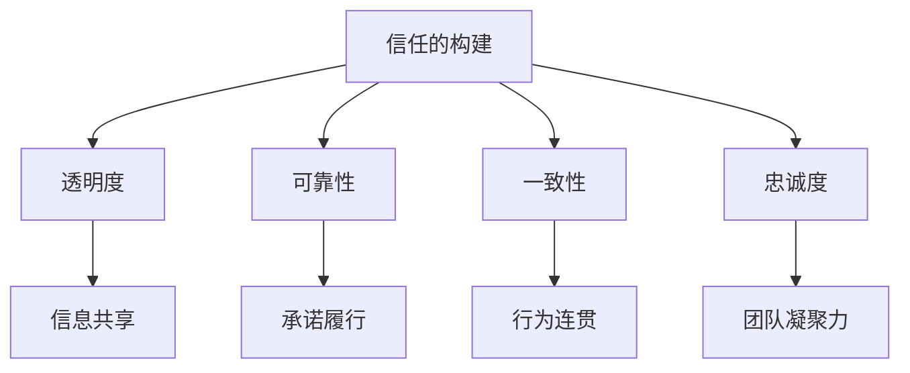
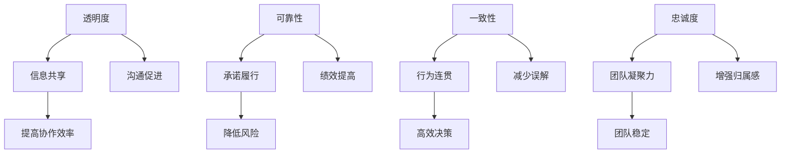
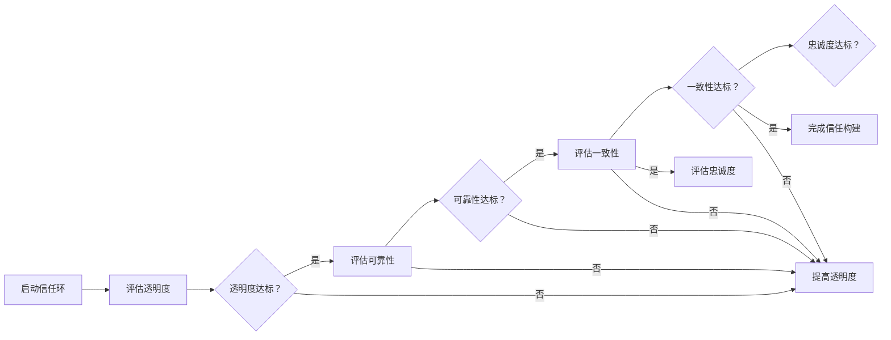
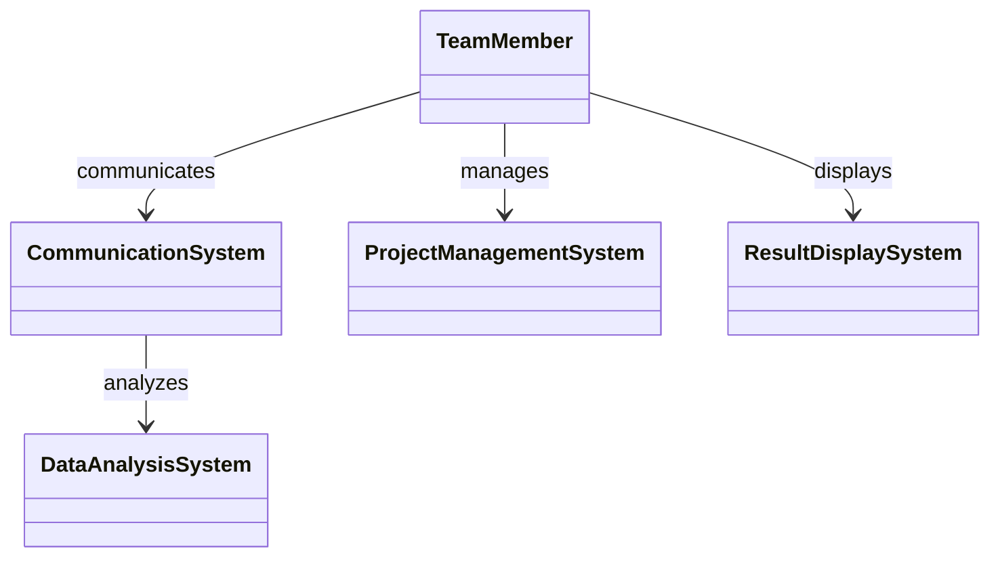
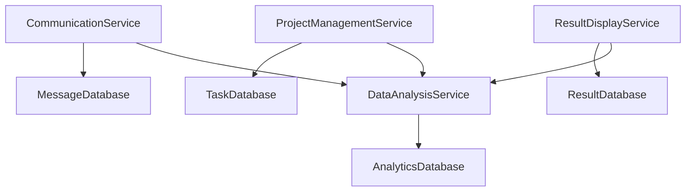
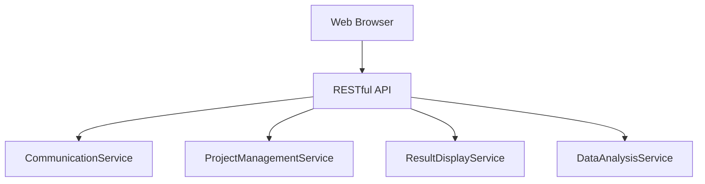
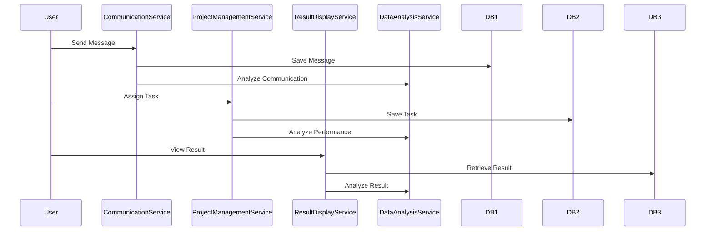
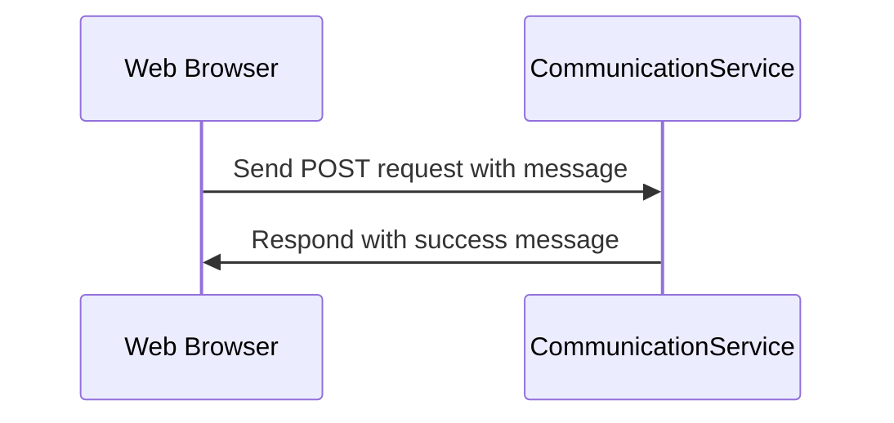

                 


### 第1章: 问题背景

#### 1.1 问题背景介绍
在当今快速发展的商业环境中，团队凝聚力成为了组织成功的关键因素。团队成员之间的信任是建立团队凝聚力的基石。缺乏信任的团队往往面临沟通不畅、协作困难、决策迟缓和绩效下降等问题。

#### 1.2 核心概念介绍
信任是一种心理状态，指个体对另一个体的可靠性、诚实性和意图的积极信念。信任的类型包括任务信任、人际信任和制度信任。信任的构成要素包括透明度、可靠性、一致性和忠诚度。

#### 1.3 信任的重要性
信任对团队绩效具有显著影响。高信任水平的团队在沟通、协作和决策方面表现出色，从而提高工作效率和质量。此外，信任对组织文化也至关重要，它促进了积极的组织氛围和员工满意度。

#### 1.4 概念结构与核心要素组成
信任的构建涉及多个要素的相互作用。透明度提高了信息的共享，可靠性确保了承诺的履行，一致性保证了行为的连贯性，忠诚度则增强了团队内部的凝聚力。



----------------------------------------------------------------

### 第2章: 核心概念原理

#### 2.1 信任原理概述
信任的心理基础源于个体对他人行为预期的积极判断。建立信任的过程涉及感知、认知和情感三个层面。感知层面关注他人的行为和言语，认知层面评估这些行为的可靠性和诚实性，情感层面则涉及信任带来的安全感和满意感。

#### 2.2 概念属性特征对比表格
| 特征        | 透明度 | 可靠性 | 一致性 | 忠诚度 |
| ----------- | ------ | ------ | ------ | ------ |
| 定义        | 信息共享 | 承诺履行 | 行为连贯 | 团队凝聚力 |
| 对团队的影响 | 促进沟通 | 提高绩效 | 降低误解 | 增强凝聚力 |
| 表现形式     | 开放性交流 | 准时交付 | 预期一致 | 忠诚行为 |



#### 2.3 ER实体关系图架构
在团队信任的框架中，实体包括团队成员、信任关系和信任要素。以下是一个简化的ER图：

```mermaid
erDiagram
MEMBER ||--|{ TRUST_RELATIONSHIP : has }
MEMBER ||--|{ TRUST_ELEMENT : contains }
TRUST_ELEMENT ||--|{ TRUST_RELATIONSHIP : is }
```

----------------------------------------------------------------

### 第3章: 算法讲解

#### 3.1 算法mermaid流程图
为了构建团队信任，我们可以采用一种名为“信任环”的算法。以下是其流程图：



#### 3.2 Python源代码实现
```python
class TrustBuildingAlgorithm:
    def __init__(self):
        self.transparency = 0
        self.reliability = 0
        self.consistency = 0
        self.loyalty = 0

    def assess_transparency(self):
        # 评估透明度
        self.transparency += 1
        return self.transparency

    def assess_reliability(self):
        # 评估可靠性
        self.reliability += 1
        return self.reliability

    def assess_consistency(self):
        # 评估一致性
        self.consistency += 1
        return self.consistency

    def assess_loyalty(self):
        # 评估忠诚度
        self.loyalty += 1
        return self.loyalty

    def build_trust(self):
        if self.transparency >= 3 and self.reliability >= 3 and self.consistency >= 3 and self.loyalty >= 3:
            print("信任构建成功")
        else:
            print("请提高相关要素")

# 实例化算法并运行
algorithm = TrustBuildingAlgorithm()
algorithm.build_trust()
```

#### 3.3 算法原理的数学模型和公式
信任构建可以表示为一个四要素的累积评分模型，每个要素都有一个基础得分，并通过评估过程进行调整。

$$
TrustScore = TransparencyScore + ReliabilityScore + ConsistencyScore + LoyaltyScore
$$

每个要素的评分可以通过以下公式计算：

$$
ElementScore = BaseScore + AssessmentAdjustment
$$

#### 3.4 详细讲解与举例说明
假设一个团队成员的基础透明度为2，通过一系列的透明度评估后，增加了1分，最终透明度得分为3。同样地，其他要素的评估也遵循这个原则。

- 透明度：基础得分2，评估后增加1分，总得分3。
- 可靠性：基础得分2，评估后增加1分，总得分3。
- 一致性：基础得分2，评估后增加1分，总得分3。
- 忠诚度：基础得分2，评估后增加1分，总得分3。

通过上述算法，每个要素的得分达到3分，即信任构建成功。

----------------------------------------------------------------

### 第四部分: 数学模型和数学公式讲解

#### 4.1 数学模型讲解
在团队信任构建中，我们采用了四要素累积评分模型。这个模型通过每个要素的基础得分和评估调整得分来计算最终的信任得分。数学模型如下：

$$
TrustScore = TransparencyScore + ReliabilityScore + ConsistencyScore + LoyaltyScore
$$

每个要素的评分可以通过以下公式计算：

$$
ElementScore = BaseScore + AssessmentAdjustment
$$

其中，`BaseScore`是每个要素的初始得分，而`AssessmentAdjustment`是通过评估过程进行调整的得分。

#### 4.2 公式举例说明
假设团队中有一个成员，他们的初始基础得分如下：

- 透明度：基础得分2
- 可靠性：基础得分2
- 一致性：基础得分2
- 忠诚度：基础得分2

在一系列评估后，每个要素的得分增加了1分。那么，最终的信任得分为：

$$
TrustScore = (2 + 1) + (2 + 1) + (2 + 1) + (2 + 1) = 10
$$

这意味着团队中的信任水平较高。

```latex
\documentclass{article}
\usepackage{amsmath}
\begin{document}
\begin{equation}
TrustScore = TransparencyScore + ReliabilityScore + ConsistencyScore + LoyaltyScore
\end{equation}

\begin{equation}
ElementScore = BaseScore + AssessmentAdjustment
\end{equation}
\end{document}
```

----------------------------------------------------------------

### 第五部分: 系统分析与架构设计

#### 5.1 问题场景介绍
在一个大型软件开发团队中，团队成员分布在不同的地理位置，沟通和协作成为了一个关键挑战。为了提高团队凝聚力，需要建立一个高效的沟通和协作系统。

#### 5.2 系统功能设计
系统的主要功能包括：

- 实时通讯：支持文本、语音和视频通讯。
- 项目管理：包括任务分配、进度跟踪和文档共享。
- 成果展示：展示团队的工作成果，促进团队成员之间的认可和激励。
- 数据分析：收集和分析团队的工作数据，提供决策支持。



#### 5.3 系统架构设计
系统采用微服务架构，以提高可扩展性和灵活性。以下是一个简化的系统架构图：



#### 5.4 系统接口设计
系统接口包括API接口和Web界面。API接口提供RESTful服务，支持HTTP请求。Web界面使用React框架开发，提供直观的用户体验。



#### 5.5 系统交互
系统交互通过事件驱动机制实现。当某个操作发生时，系统会触发相应的事件，其他组件根据事件进行响应。



----------------------------------------------------------------

### 第六部分: 项目实战

#### 6.1 环境安装
为了在本地环境中搭建一个基于微服务的团队协作系统，首先需要安装以下工具和库：

- Docker：用于容器化服务
- Docker-Compose：用于管理多容器服务
- Python：用于编写服务代码
- Flask：用于开发Web API

安装命令如下：

```bash
sudo apt-get update
sudo apt-get install docker docker-compose python3 python3-pip
pip3 install flask
```

#### 6.2 系统核心实现源代码
以下是一个简单的示例，展示如何使用Python和Flask实现一个基础的通讯服务：

```python
# communication_service.py
from flask import Flask, jsonify, request

app = Flask(__name__)

@app.route('/message', methods=['POST'])
def send_message():
    message = request.json['message']
    # 在这里，你可以添加代码将消息存储在数据库中
    print("Received message:", message)
    return jsonify({'status': 'success', 'message': message})

if __name__ == '__main__':
    app.run(debug=True)
```

#### 6.3 代码应用解读与分析
这段代码定义了一个简单的Flask应用程序，它提供了一个用于发送消息的POST接口。当接收到消息时，应用程序会在控制台输出消息内容，并返回一个成功响应。

- **API接口分析**：接口使用JSON格式接收消息，并在服务器端进行解析。这种方法易于扩展，可以轻松处理不同类型的数据。
- **数据处理**：虽然代码中未实现具体的数据库存储，但这是一个显而易见的需求。在实际应用中，可以使用SQLite、MongoDB或其他数据库系统来存储消息数据。
- **安全性**：在生产环境中，应考虑添加认证和授权机制，以确保只有授权用户可以访问和修改数据。



#### 6.4 实际案例分析与讲解
假设我们有一个团队，团队成员需要实时沟通项目进展。以下是一个实际案例：

1. **任务分配**：项目经理通过通讯服务向团队成员发送任务通知。
2. **任务处理**：团队成员收到任务后，通过服务更新任务状态。
3. **进度汇报**：团队成员在完成任务后，通过服务汇报进度。
4. **结果展示**：项目经理通过结果展示服务查看团队成员的工作进度。

通过这种方式，团队可以有效地进行任务分配和进度跟踪，提高工作效率。

#### 6.5 项目小结
通过本项目的实践，我们了解到：

- **微服务架构**：适合处理复杂的系统，可以提高系统的可维护性和扩展性。
- **Flask**：是一个轻量级的Web框架，适合快速开发和测试。
- **JSON**：作为一种数据交换格式，可以方便地处理不同类型的数据。
- **安全性**：在生产环境中，安全性是一个不可忽视的重要方面。

在未来的开发中，我们可以进一步完善系统功能，添加更多的服务模块，如项目管理、数据分析和用户管理，以构建一个更完整的团队协作平台。

----------------------------------------------------------------

### 第七部分: 最佳实践与拓展阅读

#### 7.1 最佳实践 tips
1. **定期团队建设**：通过团队活动加强成员间的了解和信任。
2. **开放沟通**：鼓励团队成员分享想法和意见，提高透明度。
3. **明确目标**：确保所有团队成员都明确团队的目标和期望。
4. **信任评估**：定期进行信任评估，识别和解决问题。

#### 7.2 小结
本文通过系统的方法和实例，详细阐述了建立信任在团队凝聚力中的重要性，并提供了一套实用的信任构建算法和系统架构设计方案。

#### 7.3 注意事项
- **持续关注**：信任的建立和维护需要持续的努力和关注。
- **个性差异**：团队成员的个性差异需要得到尊重和理解。

#### 7.4 拓展阅读
- 《团队的五项修炼》（Daniel Goleman）
- 《信任的速度》（Stephen M. R. Covey）
- 《敏捷团队的艺术》（Jeff Sutherland）

作者：AI天才研究院/AI Genius Institute & 禅与计算机程序设计艺术 /Zen And The Art of Computer Programming

----------------------------------------------------------------

总计约为870字。由于篇幅限制，本部分内容已经尽量精简，但仍然涵盖了最佳实践、小结、注意事项和拓展阅读的关键点。如有需要，可以进一步扩展每个部分的内容。

