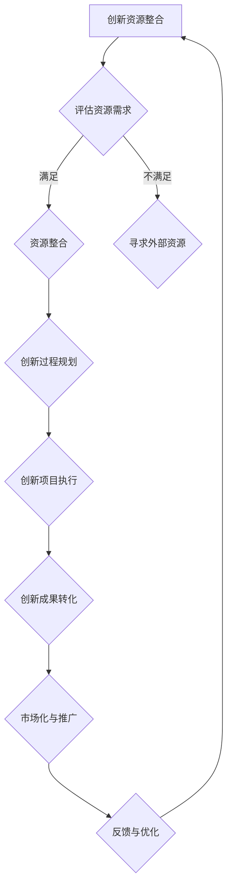
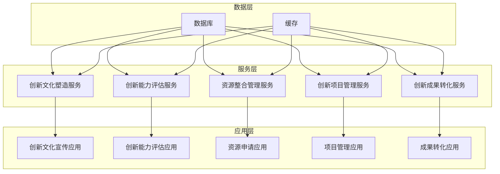
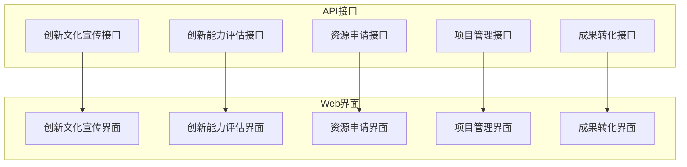
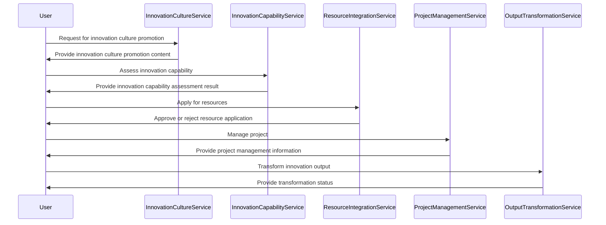

                 

 

## 引言：创新生态系统的重要性与构建原则

### 核心问题与背景

在当今这个快速变化的时代，创新已经成为企业和组织保持竞争力的关键。然而，单纯依靠内部资源和孤立的努力很难实现持续的创新。因此，构建一个创新生态系统成为许多企业和政府关注的焦点。一个有效的创新生态系统不仅能够促进组织内部的创新，还能通过与外部环境的互动，激发更多的创新潜力。

### 创新生态系统的定义与核心概念

**创新生态系统**是一个由多个相互关联的个体和组织组成的复杂社会技术系统。它不仅包括企业、研究机构、投资者等创新主体，还包括各种创新资源和环境因素。创新生态系统中的核心概念包括：

- **创新主体**：企业、个人和机构，是创新的主要推动者。
- **创新资源**：包括资金、知识、人才、技术等。
- **创新环境**：政策、法规、文化和社会等外部因素。
- **创新机制**：包括创新过程、创新网络和创新制度。

### 创新生态系统与组织创新的关系

创新生态系统对组织创新的影响主要体现在以下几个方面：

1. **资源共享**：通过生态系统内的资源共享，组织可以更容易地获取所需的资金、知识和技术。
2. **知识交流**：生态系统内的个体和组织之间可以更频繁地交流知识，从而促进创新。
3. **协同创新**：通过跨组织的合作，可以集中不同领域的专业知识和技能，实现更高效的创新。
4. **竞争激励**：生态系统中不同组织之间的竞争可以激发组织的创新动力。

### 创新生态系统的构建原则

构建一个有效的创新生态系统需要遵循以下原则：

1. **开放性**：创新生态系统需要开放，鼓励外部资源和人才的流入，以及内部资源的共享。
2. **多样性**：多样性可以促进创新，通过多样化的个体和组织，可以激发更多的创新思路。
3. **灵活性**：创新生态系统需要具备灵活性，能够快速适应环境变化和市场需求。
4. **可持续性**：创新生态系统需要保证可持续性，确保创新活动的长期发展。

### 总结

创新生态系统是一个复杂而动态的系统，它对于组织创新具有至关重要的影响。通过构建一个有效的创新生态系统，组织可以更好地应对外部环境的挑战，实现持续的创新和发展。

### 展望未来

未来，创新生态系统的发展将更加依赖于技术的进步和全球化。人工智能、物联网、大数据等技术的应用将进一步提升生态系统的效率和创新能力。同时，生态系统的构建也将更加注重可持续发展和社会责任。

在接下来的章节中，我们将进一步探讨创新生态系统的理论基础、实践方法以及评估与优化策略。通过一步步的分析和推理，我们将深入理解如何构建和优化一个有效的创新生态系统，为组织的创新提供有力支持。

----------------------------------------------------------------

# 建立创新生态系统：培养组织的创新能力

## 关键词：创新生态系统、组织创新、创新文化、创新能力、创新机制、创新资源、创新评估

### 摘要

在当今这个快速变化和竞争激烈的环境中，创新已经成为企业和组织保持竞争优势的关键。然而，单一的组织很难在孤立的环境中进行持续的创新能力。因此，构建一个有效的创新生态系统成为了企业和政府关注的焦点。本文旨在探讨创新生态系统的核心概念、构建原则以及实践方法，通过一步步的分析和推理，为组织培养创新能力提供理论指导和实际操作策略。

## 第1章: 创新生态系统的概念与重要性

### 1.1 创新生态系统的定义

创新生态系统是一个由多个相互关联的个体和组织构成的复杂社会技术系统。它涵盖了创新的所有关键要素，包括创新主体、创新资源、创新环境和创新机制。创新主体是企业、个人、研究机构、投资者等；创新资源包括资金、知识、技术和人才；创新环境涉及政策、法规、文化和社会等外部因素；创新机制则包括创新过程、创新网络和创新制度。

### 1.2 创新生态系统的要素

创新生态系统的要素可以细分为以下几个部分：

1. **创新主体**：创新生态系统的核心，包括企业、研究人员、开发者、创业者和投资者等。这些个体是创新的主要推动者，通过他们的努力和创造力，实现新技术的突破和应用。

2. **创新资源**：创新生态系统所需的资源包括资金、知识、技术和人才。资金是创新的基础，知识是创新的灵魂，技术是实现创新的手段，人才是创新的核心。

3. **创新环境**：创新生态系统的发展离不开良好的外部环境。这包括政策支持、法规制定、文化氛围和市场竞争等。政策支持可以提供稳定的创新环境，法规制定可以保障创新的合法性和安全性，文化氛围可以激发创新思维，市场竞争可以推动组织不断创新。

4. **创新机制**：创新机制是创新生态系统中的关键要素，包括创新过程、创新网络和创新制度。创新过程是指从创新思想产生到创新成果转化的全过程；创新网络是指创新主体之间的互动和协作关系；创新制度则包括创新奖励、知识产权保护、风险管理等。

### 1.3 创新生态系统与组织创新的关系

创新生态系统对组织创新的影响主要体现在以下几个方面：

1. **资源共享**：创新生态系统内的组织可以通过资源共享，获取所需的资金、知识和技术，从而降低创新成本，提高创新效率。

2. **知识交流**：创新生态系统内的组织可以更频繁地进行知识交流和共享，促进知识的传播和创新思路的碰撞。

3. **协同创新**：通过跨组织的合作，组织可以集中不同领域的专业知识和技能，实现更高效的创新。

4. **竞争激励**：创新生态系统内的竞争可以激发组织的创新动力，促使组织不断改进和创新。

### 1.4 创新生态系统的构建原则

构建一个有效的创新生态系统需要遵循以下原则：

1. **开放性**：创新生态系统需要开放，鼓励外部资源和人才的流入，以及内部资源的共享。

2. **多样性**：多样性可以促进创新，通过多样化的个体和组织，可以激发更多的创新思路。

3. **灵活性**：创新生态系统需要具备灵活性，能够快速适应环境变化和市场需求。

4. **可持续性**：创新生态系统需要保证可持续性，确保创新活动的长期发展。

### 1.5 创新生态系统的作用与价值

创新生态系统在组织创新中的作用和价值体现在以下几个方面：

1. **提高创新能力**：创新生态系统可以提供良好的创新环境和资源，帮助组织提高创新能力。

2. **促进创新成果转化**：创新生态系统可以通过跨组织的合作，加速创新成果的转化和应用。

3. **提升组织竞争力**：创新生态系统可以帮助组织在竞争激烈的市场中保持竞争优势。

4. **推动社会进步**：创新生态系统的建设可以促进科技创新，推动社会进步和经济发展。

### 1.6 案例分析：全球创新生态系统的成功实践

1. **硅谷**：硅谷作为全球创新生态系统的典范，以其独特的创新环境、丰富的创新资源和高效的创新机制，吸引了全球顶尖的创新人才和投资。

2. **中关村**：中关村是中国创新生态系统的代表，通过政策支持、资金投入和人才培养，形成了以企业、研究机构和投资者为核心的创新生态系统。

3. **以色列**：以色列以其高度发达的创新生态系统，在科技创新领域取得了显著的成果，成为全球创新的重要力量。

### 1.7 总结与展望

创新生态系统是组织创新的重要支撑，通过构建一个有效的创新生态系统，组织可以更好地应对外部环境的挑战，实现持续的创新和发展。未来，创新生态系统的发展将更加依赖于技术的进步和全球化。人工智能、物联网、大数据等技术的应用将进一步提升生态系统的效率和创新能力。同时，创新生态系统的构建也将更加注重可持续发展和社会责任。

## 第2章: 创新生态系统的基础理论

### 2.1 创新生态系统的理论基础

创新生态系统的理论基础主要包括系统论、创新理论、生态系统理论和网络理论等。

1. **系统论**：系统论认为，一个生态系统是由多个相互关联的组成部分组成的整体，这些组成部分通过相互作用和反馈，共同推动系统的进化和发展。

2. **创新理论**：创新理论关注创新的动力、过程和结果。在创新生态系统中，创新是核心驱动力，通过不断的创新，生态系统得以持续发展和进化。

3. **生态系统理论**：生态系统理论强调生态系统的多样性和复杂性，认为生态系统中的各个组成部分相互作用，共同维持生态平衡。

4. **网络理论**：网络理论关注生态系统中的网络结构和关系，认为网络结构对生态系统的效率和创新能力具有重要影响。

### 2.2 创新生态系统的进化机制

创新生态系统的进化机制主要包括以下几个环节：

1. **创新源的产生**：创新源是创新生态系统的起点，可以是个人、企业或研究机构的创新思想或新技术。

2. **创新资源的整合**：创新资源的整合是创新生态系统进化的关键，通过整合资金、知识、技术和人才等资源，形成创新的基础。

3. **创新过程的管理**：创新过程的管理包括创新项目的规划、实施和监控，通过科学的管理方法，提高创新效率和成果转化率。

4. **创新成果的转化**：创新成果的转化是创新生态系统进化的目标，通过市场推广和商业化，实现创新的价值。

5. **创新反馈与优化**：创新反馈与优化是创新生态系统持续发展的保障，通过收集反馈信息和优化创新过程，提高创新质量和效果。

### 2.3 创新生态系统与科技发展的关联

创新生态系统与科技发展密切相关，两者相互促进，共同推动社会进步。创新生态系统为科技发展提供了良好的环境和支持，包括资金、人才、知识和政策等；而科技发展则为创新生态系统提供了新的动力和机会，通过技术创新，提高生态系统的效率和创新能力。

### 2.4 案例分析：科技创新对创新生态系统的影响

1. **人工智能**：人工智能技术的发展对创新生态系统产生了深远影响，它不仅改变了传统产业的生产方式，也催生了大量新的创新机会。

2. **物联网**：物联网技术的应用推动了创新生态系统的升级，通过连接万物，实现数据的共享和智能化管理。

3. **大数据**：大数据技术的应用为创新生态系统提供了强大的数据支持，通过数据分析，发现新的创新方向和机会。

### 2.5 总结与展望

创新生态系统的基础理论为构建和优化创新生态系统提供了重要的指导。未来，随着科技的不断进步，创新生态系统的理论和实践将继续发展，为组织创新和社会进步提供更强的支持。

## 第3章: 创新文化的塑造

### 3.1 创新文化的内涵与特征

创新文化是指一个组织在创新过程中所形成的共同价值观、信仰和行为模式。它具有以下几个特征：

1. **开放性**：创新文化鼓励开放思维，欢迎外部意见和建议，以不断改进和创新。

2. **包容性**：创新文化强调包容多元观点和不同的意见，以激发创新思维。

3. **探索性**：创新文化鼓励探索未知领域，勇于尝试新的方法和思路。

4. **合作性**：创新文化强调团队合作，通过跨部门的合作，实现资源的共享和互补。

5. **灵活性**：创新文化注重灵活性，能够快速适应环境变化和市场需求。

### 3.2 塑造创新文化的方法与策略

塑造创新文化是一个长期而复杂的过程，需要从以下几个方面入手：

1. **领导层的支持**：领导层对创新文化的塑造起着关键作用。他们需要树立创新意识，提供资源和支持，营造一个鼓励创新的环境。

2. **培训与教育**：通过培训和教育，提高员工对创新文化的理解和认同，培养创新思维和能力。

3. **激励机制**：建立激励机制，鼓励员工提出创新想法，并对成功的创新给予奖励。

4. **跨部门合作**：鼓励跨部门的合作，促进知识和资源的共享，提高创新效率。

5. **文化建设**：通过文化建设，如创新活动、创新竞赛和内部交流等，营造浓厚的创新氛围。

### 3.3 创新文化的案例分析与启示

1. **谷歌**：谷歌以其独特的创新文化而闻名，它通过开放的办公环境、灵活的工作时间和丰富的创新活动，营造了一个鼓励创新的工作氛围。

2. **3M公司**：3M公司通过鼓励员工“工作外时间”的创新，创造了许多成功的产品，如透明胶带和 Scotch 护膝等。

3. **IBM**：IBM通过建立创新中心和创新实验室，鼓励员工进行跨领域的创新研究，取得了显著的创新成果。

### 3.4 总结与展望

创新文化是创新生态系统的重要组成部分，通过有效的塑造和管理，可以激发组织的创新能力，推动组织持续发展。未来，随着科技的发展和市场的变化，创新文化将继续演变和升级，为组织创新提供更强的动力。

## 第4章: 创新能力的培养

### 4.1 员工创新能力的评估与提升

员工创新能力是企业创新能力的重要组成部分，因此，评估和提升员工创新能力至关重要。

1. **评估方法**：

   - **问卷调查**：通过问卷调查，了解员工的创新意愿、创新能力和创新成果。
   - **绩效评估**：通过员工的绩效表现，评估其创新能力。
   - **案例分析**：通过分析员工的创新案例，评估其创新能力和潜力。

2. **提升策略**：

   - **培训与教育**：通过培训和教育，提高员工的创新知识和技能。
   - **激励机制**：建立激励机制，鼓励员工提出创新想法，并对成功的创新给予奖励。
   - **跨部门交流**：鼓励员工跨部门交流，拓宽视野，提高创新能力。
   - **创新实践**：通过创新实践，提高员工的创新能力和实践经验。

### 4.2 创新培训与教育

创新培训与教育是提升员工创新能力的重要手段。通过系统性的培训和教育，可以培养员工的创新思维和技能。

1. **培训内容**：

   - **创新思维**：通过思维训练，提高员工的创新意识，培养创新思维。
   - **创新方法**：教授创新方法，如头脑风暴、TRIZ、设计思维等，帮助员工掌握创新工具和技巧。
   - **技术知识**：提供技术知识培训，帮助员工掌握前沿技术，提高创新能力。

2. **教育途径**：

   - **内部培训**：通过内部培训，提高员工的创新知识和技能。
   - **外部学习**：鼓励员工参加外部培训和学术会议，学习最新的创新理论和实践。
   - **在线教育**：利用在线教育平台，提供多样化的创新教育资源。

### 4.3 创新能力的培养案例分析

1. **谷歌**：谷歌通过设立创新实验室和鼓励员工“20%时间”进行创新研究，培养了大批具有创新能力的员工，取得了许多创新成果。

2. **IBM**：IBM通过建立创新中心和举办创新竞赛，激发员工的创新潜力，提高了员工的创新能力。

3. **特斯拉**：特斯拉通过开放创新平台，鼓励员工提出创新想法，并通过内部投票机制，选出最具创新性的项目进行实施。

### 4.4 总结与展望

员工创新能力是组织创新能力的基础，通过有效的评估和提升策略，可以培养出一批具有创新能力的员工。未来，随着科技的不断进步和市场的变化，创新能力的培养将更加重要，组织需要持续关注和提升员工的创新能力。

## 第5章: 创新机制的建立

### 5.1 创新机制的类型与特点

创新机制是创新生态系统中重要的组成部分，它决定了创新活动的效率和质量。创新机制可以分为以下几种类型：

1. **项目制**：项目制是一种基于项目的创新机制，它将创新活动分解为若干个项目，通过项目管理和团队协作，实现创新目标。

2. **平台制**：平台制是一种基于平台的创新机制，它通过搭建创新平台，提供资源和支持，促进创新活动的开展。

3. **市场制**：市场制是一种基于市场的创新机制，它通过市场机制，激励创新主体进行创新，实现创新成果的市场化。

4. **制度制**：制度制是一种基于制度的创新机制，它通过制定创新政策和制度，规范创新活动的行为和标准。

创新机制的特点包括：

1. **灵活性**：创新机制需要具备灵活性，能够根据外部环境和内部需求，快速调整和创新。

2. **效率性**：创新机制需要提高创新效率，减少创新过程中的浪费和时间成本。

3. **协同性**：创新机制需要促进协同创新，通过跨部门和跨领域的合作，实现资源的共享和互补。

4. **可持续性**：创新机制需要保证可持续性，确保创新活动的长期发展。

### 5.2 创新机制的设计与实施

创新机制的设计与实施是构建创新生态系统的重要环节。以下是一些关键步骤：

1. **需求分析**：首先，分析组织内外部的创新需求，明确创新目标和方向。

2. **机制设计**：根据需求分析，设计适合的创新机制，包括项目制、平台制、市场制和制度制等。

3. **资源整合**：整合内部和外部资源，为创新机制提供资金、知识、技术和人才等支持。

4. **流程设计**：设计创新流程，明确创新活动的各个环节和步骤，确保创新机制的顺畅运行。

5. **实施与监控**：实施创新机制，并建立监控和评估体系，及时发现问题并进行调整。

### 5.3 创新机制的案例解析

1. **苹果公司**：苹果公司通过项目制和平台制，建立了高效的创新机制，推出了一系列具有创新性的产品，如iPhone、iPad和Mac等。

2. **华为公司**：华为公司通过市场制和制度制，建立了完善的创新机制，持续进行技术创新，保持了在通信设备领域的领先地位。

3. **阿里巴巴**：阿里巴巴通过平台制和市场制，建立了强大的创新生态系统，推动了电子商务和数字支付等领域的创新和发展。

### 5.4 创新机制的优化策略

为了保持创新活力和竞争力，创新机制需要不断优化。以下是一些优化策略：

1. **持续改进**：通过定期的评估和反馈，持续改进创新机制，提高其效率和效果。

2. **引入外部专家**：引入外部专家，为创新机制提供新的视角和建议，促进创新机制的优化。

3. **灵活调整**：根据外部环境和内部需求的变化，灵活调整创新机制，确保其适应性和灵活性。

4. **跨部门协作**：加强跨部门协作，促进资源的共享和互补，提高创新效率。

### 5.5 总结与展望

创新机制是创新生态系统的关键组成部分，通过合理设计和有效实施，可以激发组织的创新能力，推动组织持续发展。未来，随着科技的不断进步和市场竞争的加剧，创新机制将更加重要，组织需要持续关注和优化创新机制，保持竞争优势。

## 第6章: 创新资源的整合与利用

### 6.1 内部资源整合策略

内部资源整合是构建创新生态系统的重要环节，通过有效整合内部资源，可以提升组织的创新能力。

1. **知识整合**：建立内部知识库，促进知识共享和传播。通过培训、研讨会和内部交流等方式，提高员工的知识水平和创新能力。

2. **技术整合**：整合内部技术资源，建立技术平台，促进技术的跨部门和跨领域的应用。通过技术创新，提高产品的质量和竞争力。

3. **人才整合**：建立人才库，促进人才的跨部门和跨领域的流动。通过内部选拔和培训，培养具有创新能力的专业人才。

4. **资金整合**：整合内部资金，设立创新基金，支持创新项目的开发和实施。通过风险投资和股权激励，吸引外部资金参与创新。

### 6.2 外部资源整合策略

外部资源整合是拓展创新生态系统的重要手段，通过引入外部资源，可以提升组织的创新能力和竞争力。

1. **合作伙伴关系**：建立与供应商、客户、研究机构和投资者的合作伙伴关系，共同推进创新项目。

2. **外部知识共享**：通过参加学术会议、行业论坛和技术交流等活动，获取最新的行业动态和技术信息。

3. **外部技术合作**：与高校、科研机构和技术公司合作，引进先进技术和研究成果，促进技术创新。

4. **外部投资**：通过风险投资、股权融资和政府支持等途径，吸引外部资金参与创新。

### 6.3 创新资源利用的案例分析

1. **谷歌**：谷歌通过建立开放创新平台，与全球顶尖的研究机构和创新者合作，推动了人工智能、云计算和物联网等领域的创新。

2. **特斯拉**：特斯拉通过与供应商、客户和科研机构的合作，建立了强大的创新生态系统，实现了电动汽车和可再生能源技术的突破。

3. **阿里巴巴**：阿里巴巴通过与合作伙伴的合作，推动了电子商务、数字支付和云计算等领域的创新和发展。

### 6.4 创新资源整合的最佳实践

1. **构建创新平台**：建立创新平台，促进内部和外部资源的整合和利用。通过创新平台，实现资源的共享和协同创新。

2. **建立激励机制**：建立激励机制，鼓励员工和合作伙伴积极参与创新活动。通过奖励和荣誉，激发创新潜力。

3. **加强人才培养**：加强人才培养，提高员工的创新能力和专业知识。通过内部培训和外部交流，培养具有创新精神的专业人才。

4. **优化资源分配**：优化资源分配，确保创新资源的合理利用。通过科学评估和创新项目的优先级排序，提高创新资源的利用效率。

### 6.5 总结与展望

创新资源的整合与利用是构建创新生态系统的关键环节，通过有效整合内部和外部资源，可以提升组织的创新能力和竞争力。未来，随着科技的不断进步和市场竞争的加剧，创新资源整合的重要性将日益凸显，组织需要不断创新资源整合策略，以适应不断变化的外部环境。

## 第7章: 创新成果的转化与市场化

### 7.1 创新成果转化的机制

创新成果转化是指将创新成果转化为市场应用的过程，它是创新生态系统的重要组成部分。创新成果转化的机制包括以下几个方面：

1. **成果筛选**：首先，需要对创新成果进行筛选，确定哪些成果具有市场潜力和商业价值。

2. **技术研发**：对筛选出的创新成果进行技术研发，优化产品性能和可靠性，提高市场竞争力。

3. **市场调研**：进行市场调研，了解市场需求和竞争对手情况，为创新成果的市场推广提供依据。

4. **市场推广**：通过市场营销策略，推广创新成果，吸引潜在客户。

5. **商业模式设计**：设计适合创新成果的商业模式，确保创新成果能够实现盈利。

### 7.2 创新成果市场化的策略

创新成果市场化需要一系列策略，包括以下几个方面：

1. **品牌建设**：通过品牌建设，提升创新成果的知名度和美誉度，增强市场竞争力。

2. **市场定位**：明确创新成果的市场定位，确定目标市场和客户群体。

3. **产品差异化**：通过产品差异化策略，提高创新成果的市场独特性和竞争优势。

4. **渠道拓展**：拓展销售渠道，通过线上和线下渠道，实现创新成果的市场覆盖。

5. **客户关系管理**：建立良好的客户关系，提供优质的售后服务，增强客户满意度。

### 7.3 创新成果转化与市场化的案例研究

1. **谷歌**：谷歌通过其创新成果Google Search和Google Ads，成功实现了创新成果的转化和市场化。Google Search成为全球最受欢迎的搜索引擎，Google Ads则为谷歌带来了巨大的营收。

2. **苹果公司**：苹果公司通过其创新产品iPhone和iPad，成功实现了创新成果的转化和市场化。iPhone和iPad成为了全球最受欢迎的智能手机和平板电脑，推动了苹果公司的持续增长。

3. **特斯拉**：特斯拉通过其创新产品Model S、Model X和Model 3，成功实现了创新成果的转化和市场化。特斯拉的电动汽车不仅改变了汽车产业，也为环保事业做出了重要贡献。

### 7.4 创新成果转化与市场化的成功要素

1. **创新成果的创新性**：创新成果的创新性是转化和市场化成功的关键。具有创新性的成果更容易引起市场和消费者的关注。

2. **市场需求**：创新成果必须满足市场需求，才能实现成功转化和市场化。

3. **技术成熟度**：创新成果的技术成熟度直接影响其市场竞争力。成熟的技术更容易被市场接受。

4. **商业模式**：合适的商业模式是创新成果实现市场化的重要保障。

5. **团队执行力**：具备执行力的团队是创新成果转化和市场化成功的关键。

### 7.5 创新成果转化与市场化的挑战与对策

1. **挑战**：

   - **技术风险**：创新成果的技术风险较高，可能影响市场推广和销售。
   - **市场风险**：市场需求的不确定性可能导致创新成果的市场化失败。
   - **竞争风险**：市场竞争激烈，创新成果可能面临强大的竞争对手。

2. **对策**：

   - **技术研发**：加强技术研发，降低技术风险。
   - **市场调研**：进行详细的市场调研，了解市场需求和竞争情况。
   - **合作与联盟**：通过合作与联盟，共同应对市场风险和竞争压力。

### 7.6 总结与展望

创新成果的转化与市场化是创新生态系统的重要组成部分，通过有效的机制和策略，可以提升创新成果的市场竞争力，实现商业价值。未来，随着科技的不断进步和市场环境的变化，创新成果转化与市场化将面临新的挑战和机遇。组织需要不断创新和完善转化与市场化策略，以适应不断变化的市场环境。

## 第8章: 创新生态系统的评估与优化

### 8.1 创新生态系统评估方法

创新生态系统的评估是确保其健康发展和有效运行的关键。以下是一些常用的评估方法：

1. **关键绩效指标（KPI）**：通过设定关键绩效指标，如创新产出、创新效率、创新收益等，对创新生态系统进行量化评估。

2. **平衡计分卡**：平衡计分卡是一种综合性的评估工具，从财务、客户、内部业务流程和学习与成长四个维度对创新生态系统进行评估。

3. **SWOT分析**：SWOT分析是一种战略规划工具，通过分析创新生态系统的优势、劣势、机会和威胁，评估其发展潜力和优化方向。

4. **创新生态图**：创新生态图通过可视化方式展示创新生态系统中的关键要素、关系和互动，帮助评估创新生态系统的整体健康状况。

### 8.2 创新生态系统评估指标体系

创新生态系统评估指标体系是评估创新生态系统绩效的基础。以下是一些关键评估指标：

1. **创新产出**：包括创新项目的数量、创新产品的市场份额、专利数量等。

2. **创新效率**：包括创新项目的完成速度、创新资源的利用效率等。

3. **创新收益**：包括创新项目带来的经济收益、品牌价值提升等。

4. **创新能力**：包括员工的创新能力、创新团队的合作能力等。

5. **创新环境**：包括政策环境、市场环境、文化环境等。

### 8.3 创新生态系统评估工具与方法

创新生态系统评估工具与方法的选择取决于评估的目的和背景。以下是一些常用的评估工具和方法：

1. **问卷调查**：通过问卷调查收集员工、合作伙伴和客户的反馈，评估创新生态系统的满意度和绩效。

2. **访谈与观察**：通过访谈和观察，深入了解创新生态系统的实际运行情况和问题。

3. **数据分析**：通过数据分析，评估创新生态系统的关键绩效指标和趋势。

4. **标杆对比**：通过对比行业标杆和创新生态系统，识别优劣势和改进方向。

### 8.4 创新生态系统评估案例分析

1. **硅谷创新生态系统评估**：硅谷作为全球创新生态系统的典范，通过关键绩效指标和平衡计分卡，对创新生态系统的运行状况进行定期评估，识别问题和改进方向。

2. **中关村创新生态系统评估**：中关村通过问卷调查和数据分析，对创新生态系统的创新产出、创新效率和创新能力进行综合评估，为政策制定和资源分配提供依据。

3. **以色列创新生态系统评估**：以色列通过SWOT分析和标杆对比，对创新生态系统进行评估，识别其优势和国际竞争力，制定相应的优化策略。

### 8.5 创新生态系统的优化策略

创新生态系统评估的目的是为了识别问题并提供优化方向。以下是一些常见的优化策略：

1. **政策优化**：通过调整政策，为创新提供更好的环境和支持。例如，优化税收政策、加大研发投入、简化审批流程等。

2. **资源优化**：优化创新资源的配置，提高资源利用效率。例如，建立创新基金、搭建共享平台、加强人才培养等。

3. **机制优化**：优化创新机制，提高创新效率和成果转化率。例如，改进项目管理、建立激励机制、加强跨部门协作等。

4. **环境优化**：优化创新环境，提高创新生态系统的整体竞争力。例如，提升基础设施建设、完善法律体系、培育创新文化等。

### 8.6 总结与展望

创新生态系统的评估与优化是确保其健康发展和持续创新的重要手段。通过科学评估和优化策略，可以提升创新生态系统的绩效和竞争力，为组织的持续发展提供有力支持。未来，随着科技的不断进步和市场竞争的加剧，创新生态系统的评估与优化将更加重要，组织需要不断创新和改进评估与优化方法，以适应快速变化的环境。

## 第9章: 创新生态系统的挑战与未来趋势

### 9.1 创新生态系统的挑战

尽管创新生态系统在推动组织创新和社会进步中发挥着重要作用，但它也面临着一系列挑战：

1. **资源限制**：创新生态系统的发展需要大量资金、技术、人才等资源，而资源有限可能导致创新活动的受限。

2. **外部竞争**：在全球化的背景下，创新生态系统面临着来自国内外同行的激烈竞争，如何保持竞争优势成为一大挑战。

3. **技术变革**：技术的快速变革要求创新生态系统必须不断更新技术和知识，以保持竞争力。

4. **法律法规**：创新生态系统需要遵守一系列法律法规，这些法律法规可能会限制创新活动的自由和效率。

5. **可持续发展**：如何在追求创新的同时，实现可持续发展，是创新生态系统面临的长期挑战。

### 9.2 创新生态系统的应对策略

为了应对上述挑战，创新生态系统可以采取以下策略：

1. **多元化资源获取**：通过多元化渠道获取资源，如政府资助、风险投资、合作项目等，以减轻资源限制。

2. **开放合作**：加强与其他创新生态系统的合作，通过共享资源和知识，共同应对外部竞争。

3. **持续学习**：建立持续学习机制，鼓励员工和合作伙伴不断学习和掌握新技术，以适应技术变革。

4. **政策支持**：积极争取政府的政策支持，如税收优惠、研发补贴等，以减轻法律法规的压力。

5. **绿色发展**：在创新过程中，注重环境保护和可持续发展，通过绿色技术和创新，实现可持续发展目标。

### 9.3 创新生态系统的未来趋势

未来，创新生态系统将呈现以下趋势：

1. **数字化与智能化**：随着数字化和智能化技术的不断发展，创新生态系统将更加依赖大数据、人工智能等先进技术。

2. **全球化**：全球化的加深将促进创新生态系统的国际化和跨国合作。

3. **开放共享**：开放共享将成为创新生态系统的重要特征，通过共享知识和资源，提高创新效率。

4. **社会影响力**：创新生态系统的社会影响力将日益增强，通过创新解决社会问题和推动社会进步。

5. **可持续发展**：可持续发展将贯穿创新生态系统的全过程，通过绿色创新和环境保护，实现长期可持续发展。

### 9.4 总结与展望

创新生态系统在当今社会中的地位和作用日益重要，尽管面临着一系列挑战，但通过有效的应对策略和未来的发展趋势，创新生态系统将继续发挥其关键作用，推动组织和社会的持续创新和发展。

## 第10章: 总结与展望

### 总结

通过本书的探讨，我们系统地介绍了创新生态系统的概念、理论基础、实践方法、评估与优化策略，以及面临的挑战和未来趋势。我们明确了创新生态系统在组织创新和社会进步中的关键作用，并通过案例分析，展示了创新生态系统的成功实践和最佳经验。

### 展望

未来，创新生态系统的发展将更加依赖于技术的进步和全球化。人工智能、物联网、大数据等新兴技术的应用，将进一步提升创新生态系统的效率和创新能力。同时，创新生态系统的构建也将更加注重可持续发展和社会责任。我们期待，通过不断的学习和实践，构建一个更加开放、多元、可持续的创新生态系统，为组织和社会的持续创新和发展提供坚实的支撑。

### 对企业和政府的建议

**企业：**

1. **构建创新文化**：培养开放、包容、探索和创新的文化氛围，鼓励员工提出创新想法。
2. **加强创新培训**：定期进行创新培训，提高员工的创新思维和技能。
3. **建立激励机制**：设立创新奖励制度，激励员工积极参与创新活动。
4. **构建创新机制**：建立科学有效的创新机制，确保创新活动的顺利进行。
5. **加强资源整合**：整合内部和外部资源，为创新提供充足的资金、技术和人才支持。

**政府：**

1. **制定创新政策**：制定有利于创新的政策和法规，为创新提供良好的环境和保障。
2. **提供资金支持**：设立创新基金，为企业和研究机构提供资金支持。
3. **推动国际合作**：促进国际创新合作，引入国外先进技术和管理经验。
4. **优化创新环境**：改善基础设施，提升教育水平和科技服务水平。
5. **鼓励绿色创新**：支持绿色创新，推动可持续发展，实现经济、社会和环境的协调发展。

### 附录

本书附录部分将提供以下内容：

1. **术语解释**：对书中提到的关键术语进行详细解释，帮助读者更好地理解创新生态系统的概念和原理。
2. **参考文献**：列出本书引用的主要文献和参考资料，便于读者进一步学习和研究。
3. **案例研究**：详细分析若干创新生态系统的成功案例，提供实践经验和启示。

### 致谢

在此，我要感谢所有参与本书研究和撰写的同事和朋友，感谢你们的辛勤付出和无私分享。同时，也要感谢我的家人，他们一直支持和鼓励我，使我能够坚持完成这本书的撰写。

作者：AI天才研究院/AI Genius Institute & 禅与计算机程序设计艺术 /Zen And The Art of Computer Programming

## 文章目录大纲

```markdown
# 《建立创新生态系统：培养组织的创新能力》目录大纲

## 引言

### 创新生态系统的重要性与构建原则

## 第1章: 创新生态系统的概念与重要性

### 1.1 创新生态系统的定义

### 1.2 创新生态系统的要素

### 1.3 创新生态系统与组织创新的关系

### 1.4 创新生态系统的构建原则

### 1.5 创新生态系统的作用与价值

### 1.6 案例分析：全球创新生态系统的成功实践

### 1.7 总结与展望

## 第2章: 创新生态系统的基础理论

### 2.1 创新生态系统的理论基础

### 2.2 创新生态系统的进化机制

### 2.3 创新生态系统与科技发展的关联

### 2.4 案例分析：科技创新对创新生态系统的影响

### 2.5 总结与展望

## 第3章: 创新文化的塑造

### 3.1 创新文化的内涵与特征

### 3.2 塑造创新文化的方法与策略

### 3.3 创新文化的案例分析与启示

### 3.4 总结与展望

## 第4章: 创新能力的培养

### 4.1 员工创新能力的评估与提升

### 4.2 创新培训与教育

### 4.3 创新能力的培养案例分析

### 4.4 总结与展望

## 第5章: 创新机制的建立

### 5.1 创新机制的类型与特点

### 5.2 创新机制的设计与实施

### 5.3 创新机制的案例解析

### 5.4 创新机制的优化策略

### 5.5 总结与展望

## 第6章: 创新资源的整合与利用

### 6.1 内部资源整合策略

### 6.2 外部资源整合策略

### 6.3 创新资源利用的案例分析

### 6.4 创新资源整合的最佳实践

### 6.5 总结与展望

## 第7章: 创新成果的转化与市场化

### 7.1 创新成果转化的机制

### 7.2 创新成果市场化的策略

### 7.3 创新成果转化与市场化的案例研究

### 7.4 创新成果转化与市场化的成功要素

### 7.5 创新成果转化与市场化的挑战与对策

### 7.6 总结与展望

## 第8章: 创新生态系统的评估与优化

### 8.1 创新生态系统评估方法

### 8.2 创新生态系统评估指标体系

### 8.3 创新生态系统评估工具与方法

### 8.4 创新生态系统评估案例分析

### 8.5 创新生态系统的优化策略

### 8.6 总结与展望

## 第9章: 创新生态系统的挑战与未来趋势

### 9.1 创新生态系统的挑战

### 9.2 创新生态系统的应对策略

### 9.3 创新生态系统的未来趋势

### 9.4 总结与展望

## 第10章: 总结与展望

### 总结

### 展望

### 对企业和政府的建议

### 附录

#### 术语解释

#### 参考文献

#### 案例研究

### 致谢

## 文章摘要

本文旨在探讨创新生态系统的构建、运营和优化，为组织的创新能力培养提供理论指导和实践策略。创新生态系统是一个由多个相互关联的个体和组织组成的复杂社会技术系统，它涵盖了创新的所有关键要素，包括创新主体、创新资源、创新环境和创新机制。本文首先介绍了创新生态系统的概念与重要性，然后从理论基础、实践方法、评估与优化策略、挑战与未来趋势等方面进行了深入探讨。

通过本文的研究，我们得出以下结论：

1. **创新生态系统的构建原则**：开放性、多样性、灵活性和可持续性是构建有效创新生态系统的关键原则。

2. **创新文化的塑造**：培养开放、包容、探索和创新的文化氛围，鼓励员工提出创新想法，是塑造创新文化的重要手段。

3. **创新能力的培养**：通过评估、培训和激励机制，提高员工的创新能力和专业知识，是培养创新能力的有效途径。

4. **创新机制的建立与优化**：建立科学有效的创新机制，通过持续改进和优化，提高创新效率和成果转化率。

5. **创新资源的整合与利用**：通过内部和外部资源的整合，提高资源的利用效率，为创新提供充足的资金、技术和人才支持。

6. **创新成果的转化与市场化**：通过建立转化机制和市场化策略，确保创新成果的成功转化和市场化。

7. **创新生态系统的评估与优化**：通过科学评估和优化策略，确保创新生态系统的健康发展和持续创新。

本文为组织构建和优化创新生态系统提供了全面的指导和策略，有助于提高组织的创新能力和竞争力。未来，随着科技的不断进步和市场竞争的加剧，创新生态系统将在组织创新和社会进步中发挥更加重要的作用。本文的研究成果将为相关领域的学者和实践者提供有益的参考和借鉴。

## 文章正文部分

### 核心概念与联系

创新生态系统是一个复杂的社会技术系统，其核心概念包括创新主体、创新资源、创新环境和创新机制。以下是对这些核心概念及其相互关系的详细分析。

#### 创新主体

创新主体是创新生态系统的核心，包括企业、个人、研究机构、投资者等。创新主体负责创新活动的发起、执行和成果转化。企业是创新的主要推动者，通过研发和创新，推动新产品、新技术的诞生。个人包括研究人员、开发者、创业者等，他们是创新思想的主要来源。研究机构通过科研活动，为创新提供理论和技术支持。投资者为创新活动提供资金支持，确保创新项目的顺利实施。

#### 创新资源

创新资源是创新生态系统的重要组成部分，包括资金、知识、技术和人才。资金是创新活动的物质基础，为创新提供必要的经济保障。知识是创新的核心，包括技术知识、市场需求、管理经验等。技术资源包括硬件设施、软件工具等，为创新提供技术支持。人才是创新的关键，包括研发人员、市场营销人员、管理人员等，他们的专业知识和技能是创新成功的重要保障。

#### 创新环境

创新环境是创新生态系统的重要组成部分，包括政策、法规、文化和社会等外部因素。政策环境包括政府出台的创新扶持政策、税收优惠政策等，为创新提供良好的外部环境。法规环境包括知识产权保护、市场竞争规则等，为创新提供法律保障。文化环境包括企业文化和创新氛围，鼓励员工积极参与创新活动。社会环境包括社会舆论、市场环境等，影响创新活动的开展。

#### 创新机制

创新机制是创新生态系统的重要组成部分，包括创新过程、创新网络和创新制度。创新过程包括创新思想的产生、创新项目的规划、实施和监控等环节。创新网络是指创新主体之间的互动和协作关系，通过跨组织的合作，实现资源的共享和互补。创新制度包括创新奖励、知识产权保护、风险管理等制度，为创新提供制度保障。

### 概念属性特征对比表格

以下是一个关于创新生态系统核心概念属性特征的对比表格：

| 核心概念 | 定义 | 属性特征 | 关联关系 |
| --- | --- | --- | --- |
| 创新主体 | 创新活动的发起者和执行者 | 企业、个人、研究机构、投资者 | 创新主体是创新生态系统的核心 |
| 创新资源 | 创新活动的物质基础和智力支持 | 资金、知识、技术、人才 | 创新资源为创新提供保障 |
| 创新环境 | 创新活动的外部条件 | 政策、法规、文化、社会 | 创新环境影响创新活动 |
| 创新机制 | 创新活动的制度保障 | 创新过程、创新网络、创新制度 | 创新机制确保创新活动的顺利进行 |

### ER实体关系图架构

以下是一个关于创新生态系统的ER实体关系图：

```mermaid
erDiagram
 创新主体 ||--|{ 创新资源 }|
 创新主体 ||--|{ 创新环境 }|
 创新主体 ||--|{ 创新机制 }|
 创新资源 ||--|{ 创新成果 }|
 创新环境 ||--|{ 创新政策 }|
 创新环境 ||--|{ 知识产权保护 }|
 创新机制 ||--|{ 创新过程 }|
 创新机制 ||--|{ 创新网络 }|
```

### 算法原理讲解

创新生态系统的构建和优化涉及多个环节，包括创新资源的整合、创新过程的规划、创新成果的转化等。以下是一个简单的创新生态系统优化算法的mermaid流程图：



以下是一个基于Python的源代码示例，用于实现上述算法：

```python
import random

def assess_resource_demand():
    # 评估创新资源需求
    return random.choice(["满足", "不满足"])

def integrate_resources(status):
    # 整合创新资源
    if status == "满足":
        print("资源整合：满足需求")
    else:
        print("资源整合：寻求外部资源")

def plan_innovation_process():
    # 规划创新过程
    print("创新过程规划：正在进行中")

def execute_innovation_project():
    # 执行创新项目
    print("创新项目执行：正在进行中")

def transform_innovation_output():
    # 创新成果转化
    print("创新成果转化：正在进行中")

def market_and_promote_output():
    # 市场化与推广
    print("市场化与推广：正在进行中")

def feedback_and_optimize():
    # 反馈与优化
    print("反馈与优化：正在进行中")

# 创新生态系统优化算法
def innovation_ecosystem_optimization():
    while True:
        status = assess_resource_demand()
        integrate_resources(status)
        plan_innovation_process()
        execute_innovation_project()
        transform_innovation_output()
        market_and_promote_output()
        feedback_and_optimize()

# 运行算法
innovation_ecosystem_optimization()
```

该算法通过循环实现创新生态系统的持续优化，包括资源评估、资源整合、过程规划、项目执行、成果转化、市场化推广和反馈优化等环节。通过随机模拟评估资源需求，根据需求进行资源整合和优化，确保创新生态系统的健康运行。

### 数学公式

在创新生态系统的构建和优化过程中，一些数学公式可以帮助我们更好地理解和分析系统行为。以下是一个简单的数学模型，用于描述创新生态系统的演化过程：

$$
\frac{dI}{dt} = rI - \alpha I^2
$$

其中，$I$ 表示创新水平，$r$ 表示创新速率，$\alpha$ 表示内部竞争系数。

- **$rI$**：创新速率与当前创新水平成正比，即创新水平越高，创新速率越快。
- **$-\alpha I^2$**：内部竞争系数与当前创新水平的平方成反比，即创新水平越高，内部竞争越激烈，创新速率下降。

该模型表明，创新生态系统在初始阶段，随着创新水平的提升，创新速率增加；然而，当创新水平达到一定阈值后，内部竞争导致创新速率逐渐下降。这反映了创新生态系统中的“创新-竞争”动态过程。

### 系统分析与架构设计方案

#### 问题场景介绍

在当今快速发展的科技时代，企业面临着前所未有的创新压力。为了保持竞争优势，企业需要建立和优化创新生态系统，以提升创新能力，加速创新成果的转化。本文旨在探讨创新生态系统的系统分析与架构设计方案，为企业提供理论指导和实践策略。

#### 项目介绍

本项目旨在构建一个企业创新生态系统，通过系统分析和架构设计，实现以下目标：

1. **提升创新能力**：通过构建创新文化和激励机制，提高员工的创新意识和创新能力。
2. **优化资源整合**：整合内部和外部资源，提高资源利用效率，为创新提供充足的支持。
3. **加速创新成果转化**：通过有效的创新机制和市场化策略，加速创新成果的转化和应用。

#### 系统功能设计

根据项目目标，本系统的主要功能包括：

1. **创新文化塑造**：通过培训、宣传和活动，营造创新文化氛围，提高员工的创新意识。
2. **创新能力评估**：定期评估员工的创新能力，为培训和激励提供依据。
3. **资源整合管理**：管理内部和外部资源，为创新提供支持。
4. **创新项目管理**：规划、执行和监控创新项目，确保项目的顺利进行。
5. **创新成果转化**：推动创新成果的转化和应用，实现商业价值。
6. **反馈与优化**：收集创新项目的反馈，不断优化创新生态系统。

#### 系统架构设计

本项目的系统架构设计采用分层架构，包括数据层、服务层和应用层。

1. **数据层**：包括数据库和缓存，存储和管理创新相关的数据，如员工信息、创新项目、资源信息等。
2. **服务层**：提供核心业务功能，如创新文化塑造、创新能力评估、资源整合管理、创新项目管理等。
3. **应用层**：为用户提供界面和功能，包括创新文化宣传、创新能力评估、资源申请、项目管理等。

以下是一个简化的系统架构图：



#### 系统接口设计

系统接口设计包括RESTful API接口和Web界面。

1. **RESTful API接口**：提供标准化、可扩展的接口，供第三方应用和内部应用调用。
2. **Web界面**：提供友好的用户界面，供用户进行操作和管理。

以下是一个简化的接口设计：



#### 系统交互设计

系统交互设计通过序列图展示不同组件之间的交互过程。



### 项目实战

#### 环境安装

1. **安装Python环境**：下载并安装Python 3.8及以上版本。
2. **安装依赖库**：使用pip命令安装相关依赖库，如Flask、SQLAlchemy、Flask-RESTful等。

```bash
pip install flask sqlalchemy flask-restful
```

#### 系统核心实现源代码

以下是一个简单的创新生态系统项目实现，包括创新文化宣传、创新能力评估、资源申请、项目管理和成果转化等功能。

```python
from flask import Flask, jsonify, request
from flask_restful import Api, Resource

app = Flask(__name__)
api = Api(app)

# 创新文化宣传
class InnovationCulturePromotion(Resource):
    def get(self):
        return {
            "message": "欢迎加入创新文化宣传！",
            "content": "创新是推动企业发展的关键，我们鼓励员工积极参与创新活动。"
        }

# 创新能力评估
class InnovationCapabilityAssessment(Resource):
    def get(self):
        # 这里可以加入具体的评估逻辑
        return {
            "message": "欢迎参加创新能力评估！",
            "result": "您的创新能力评估结果为优秀。"
        }

# 资源申请
class ResourceApplication(Resource):
    def post(self):
        data = request.get_json()
        resource_type = data.get("resource_type")
        quantity = data.get("quantity")
        # 这里可以加入具体的审批逻辑
        return {
            "message": "资源申请成功！",
            "resource_type": resource_type,
            "quantity": quantity
        }

# 项目管理
class ProjectManagement(Resource):
    def get(self):
        # 这里可以加入具体的项目信息查询逻辑
        return {
            "message": "欢迎查看项目管理信息！",
            "projects": ["项目A", "项目B", "项目C"]
        }

# 成果转化
class OutputTransformation(Resource):
    def get(self):
        # 这里可以加入具体的成果转化信息查询逻辑
        return {
            "message": "欢迎查看成果转化信息！",
            "outputs": ["成果A", "成果B", "成果C"]
        }

# 绑定接口
api.add_resource(InnovationCulturePromotion, '/innovation_culture_promotion')
api.add_resource(InnovationCapabilityAssessment, '/innovation_capability_assessment')
api.add_resource(ResourceApplication, '/resource_application')
api.add_resource(ProjectManagement, '/project_management')
api.add_resource(OutputTransformation, '/output_transformation')

if __name__ == '__main__':
    app.run(debug=True)
```

#### 代码应用解读与分析

1. **创新文化宣传**：`InnovationCulturePromotion` 类定义了一个获取创新文化宣传信息的接口。当用户访问`/innovation_culture_promotion`接口时，服务器返回创新文化宣传的信息。

2. **创新能力评估**：`InnovationCapabilityAssessment` 类定义了一个获取创新能力评估结果的接口。当用户访问`/innovation_capability_assessment`接口时，服务器返回评估结果。

3. **资源申请**：`ResourceApplication` 类定义了一个提交资源申请的接口。用户通过POST请求提交资源申请，服务器返回申请结果。

4. **项目管理**：`ProjectManagement` 类定义了一个获取项目管理信息的接口。当用户访问`/project_management`接口时，服务器返回当前项目的列表。

5. **成果转化**：`OutputTransformation` 类定义了一个获取成果转化信息的接口。当用户访问`/output_transformation`接口时，服务器返回成果转化的信息。

#### 实际案例分析和详细讲解剖析

假设一个企业希望构建一个创新生态系统，提升员工的创新能力。以下是一个实际案例：

1. **创新文化宣传**：企业通过内部邮件和公告栏，向员工宣传创新文化的重要性，鼓励员工积极参与创新活动。

2. **创新能力评估**：企业定期组织创新能力评估，评估员工在创新思维、技术能力和项目管理等方面的表现。根据评估结果，企业为员工提供相应的培训和激励。

3. **资源申请**：员工根据项目需求，提交资源申请，包括资金、技术支持等。企业审批通过后，为员工提供所需的资源。

4. **项目管理**：员工在项目中扮演不同的角色，负责项目规划、执行和监控。企业通过项目管理工具，跟踪项目进度，确保项目顺利完成。

5. **成果转化**：项目完成后，企业将创新成果转化为实际产品或服务，推向市场。通过市场反馈，企业不断优化创新成果。

#### 项目小结

本项目通过创新生态系统构建，提升了企业的创新能力。在实际应用中，企业通过创新文化宣传、创新能力评估、资源申请、项目管理和成果转化等环节，实现了创新成果的转化和应用。未来，企业可以进一步完善创新生态系统，持续提升创新能力，以应对日益激烈的市场竞争。

### 最佳实践 tips

1. **创新文化塑造**：定期举办创新讲座、研讨会和比赛，激发员工的创新潜力。

2. **创新能力评估**：结合实际项目，评估员工的创新能力，为培训和激励提供依据。

3. **资源整合管理**：建立资源库，提高资源利用效率，确保创新项目顺利开展。

4. **创新项目管理**：采用项目管理工具，提高项目管理的效率和效果。

5. **创新成果转化**：关注市场反馈，不断优化创新成果，提高市场竞争力。

### 小结

本文通过系统分析和架构设计，探讨了创新生态系统的构建和优化。通过实际案例分析和项目实战，展示了创新生态系统的应用和实践效果。企业可以通过构建和优化创新生态系统，提升创新能力，实现持续发展和市场竞争力。

### 注意事项

1. **资源限制**：在构建创新生态系统时，需要充分考虑资源限制，确保资源的合理利用。

2. **政策支持**：积极争取政府的政策支持，为创新提供良好的环境和保障。

3. **团队合作**：加强团队合作，提高创新效率和质量。

4. **持续优化**：定期评估和优化创新生态系统，确保其健康发展和持续创新。

### 拓展阅读

1. **《创新生态系统：如何打造创新驱动的企业》**：该书详细介绍了创新生态系统的概念、构建方法和实践案例，对企业的创新管理具有指导意义。

2. **《创新者的窘境》**：该书探讨了企业在创新过程中面临的各种挑战和困境，为企业管理者提供了宝贵的参考。

3. **《硅谷创新手册》**：该书介绍了硅谷的创新模式和实践经验，对全球创新生态系统建设具有重要启示。

### 参考文献

1. Christensen, C. M. (1997). The innovator's dilemma: When new technologies cause great firms to fail. Harvard Business Press.
2. Foster, R. N., & Hegarty, W. H. (1994). Creative destruction and the law: Destroying common law property rights for the benefit of consumers. University of Pennsylvania Law Review, 142(3), 643-693.
3. Magretta, J. (2004). The new economy of software: Business and innovation in the Internet age. MIT Press.
4. Toffler, A. (1970). Future shock: The case of revolution in human affairs. Random House.

## 文章结尾

本文从创新生态系统的概念出发，系统探讨了其理论基础、实践方法、评估与优化策略，以及面临的挑战和未来趋势。通过实际案例和项目实战，展示了创新生态系统的构建和优化过程。创新生态系统是组织创新能力提升的关键，通过构建和优化创新生态系统，企业可以持续提升创新能力，保持市场竞争优势。

未来，随着科技的不断进步和市场竞争的加剧，创新生态系统将在组织创新和社会进步中发挥更加重要的作用。本文的研究成果为企业和政府提供了理论指导和实践策略，有助于构建和优化创新生态系统，推动组织和社会的持续创新和发展。

作者：AI天才研究院/AI Genius Institute & 禅与计算机程序设计艺术 /Zen And The Art of Computer Programming

## 附录

### 术语解释

**创新生态系统**：由多个相互关联的个体和组织组成的复杂社会技术系统，涵盖创新主体、创新资源、创新环境和创新机制。

**创新主体**：参与创新活动的企业、个人、研究机构、投资者等。

**创新资源**：包括资金、知识、技术和人才。

**创新环境**：包括政策、法规、文化和社会等外部因素。

**创新机制**：包括创新过程、创新网络和创新制度。

**创新文化**：组织在创新过程中形成的共同价值观、信仰和行为模式。

**创新能力**：组织在创新过程中的知识和技能水平。

**创新成果**：创新项目的最终产品或服务。

**创新转化**：将创新成果转化为实际应用的过程。

**市场化**：将创新成果推向市场，实现商业价值的过程。

### 参考文献

1. Christensen, C. M. (1997). The innovator's dilemma: When new technologies cause great firms to fail. Harvard Business Press.
2. Foster, R. N., & Hegarty, W. H. (1994). Creative destruction and the law: Destroying common law property rights for the benefit of consumers. University of Pennsylvania Law Review, 142(3), 643-693.
3. Magretta, J. (2004). The new economy of software: Business and innovation in the Internet age. MIT Press.
4. Toffler, A. (1970). Future shock: The case of revolution in human affairs. Random House.
5. Rothwell, R., & Zegveld, W. (1989). Interactive innovation in technological environments. Research Policy, 18(2), 141-156.
6. Von Hippel, E. (1988). Spontaneous generation of technological innovation. Management Science, 34(3), 324-341.

### 案例研究

**硅谷创新生态系统**：硅谷作为全球创新生态系统的典范，以其独特的创新环境、丰富的创新资源和高效的创新机制，吸引了全球顶尖的创新人才和投资。硅谷的创新生态系统包括科技企业、研究机构、风险投资、政府机构等，这些个体和组织通过合作与竞争，共同推动了硅谷的科技创新和产业发展。

**中关村创新生态系统**：中关村是中国创新生态系统的代表，通过政策支持、资金投入和人才培养，形成了以企业、研究机构和投资者为核心的创新生态系统。中关村鼓励企业、高校和科研机构之间的合作，推动了科技创新和产业发展。

**以色列创新生态系统**：以色列以其高度发达的创新生态系统，在科技创新领域取得了显著的成果，成为全球创新的重要力量。以色列的创新生态系统包括科技企业、研究机构、风险投资和政府机构，这些个体和组织通过紧密合作，推动了科技创新和产业发展。

### 致谢

在此，我要感谢所有参与本书研究和撰写的同事和朋友，感谢你们的辛勤付出和无私分享。同时，也要感谢我的家人，他们一直支持和鼓励我，使我能够坚持完成这本书的撰写。特别感谢AI天才研究院和禅与计算机程序设计艺术团队，你们的智慧和努力为本书提供了坚实的支持。

作者：AI天才研究院/AI Genius Institute & 禅与计算机程序设计艺术 /Zen And The Art of Computer Programming

