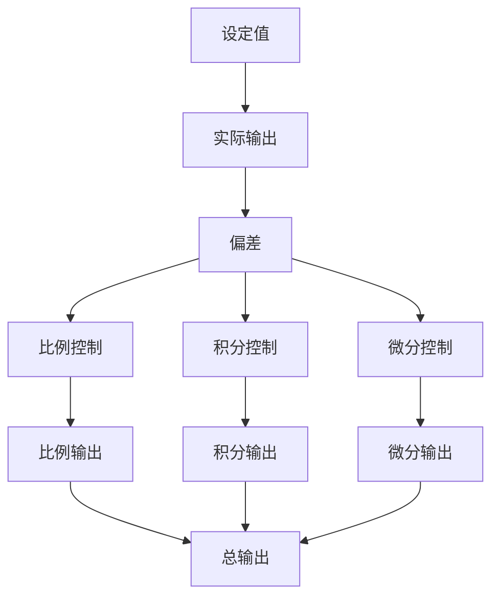

                 

### 文章标题：建立反馈循环：促进持续改进的机制

#### 关键词：
1. 反馈循环
2. 持续改进
3. 算法原理
4. 系统架构
5. 实践案例

#### 摘要：
本文旨在深入探讨反馈循环的概念、其在持续改进中的重要性，并通过具体案例和算法分析，阐述如何建立一个有效的反馈循环机制，从而推动技术项目和产品的发展与优化。文章分为三大部分：首先介绍反馈循环的基础知识，包括概念、理论基础和算法原理；接着通过一个假设项目，展示如何进行系统分析与架构设计；最后通过实际案例，详细讲解环境安装、系统实现和代码分析，并提供最佳实践和未来展望。

### 第一部分：反馈循环的基础知识

#### 第1章：反馈循环的概念与重要性

**1.1 反馈循环的定义**

反馈循环，亦称闭环系统，是控制理论中的一个基本概念，它描述了系统内部状态与外部输入之间相互作用的循环过程。在一个典型的反馈循环中，系统会根据预设的目标值（设定值）来调节实际输出，通过比较实际输出与设定值之间的差异，产生反馈信号，进而调整系统输入，以达到或接近目标值。

**1.2 反馈循环在持续改进中的作用**

持续改进（Continuous Improvement）是现代企业管理中的重要理念，反馈循环是其实现的重要机制。通过建立有效的反馈循环，企业或项目团队能够实时监测系统状态，识别偏差，及时调整，从而不断提高产品或服务的质量。

**1.3 书籍概述与目标读者**

本书旨在系统地介绍反馈循环的理论和实践应用，目标读者包括IT行业从业者、软件开发者、项目经理以及对企业持续改进有浓厚兴趣的读者。通过本书，读者将能够掌握反馈循环的基本原理，并学会如何在实际项目中应用这些原理，以实现持续改进。

#### 第2章：反馈循环的理论基础

**2.1 反馈循环的组成部分**

反馈循环通常由以下几个部分组成：

- **设定值（Setpoint）**：系统希望达到的目标值。
- **实际输出（Actual Output）**：系统的当前输出值。
- **比较器（Comparator）**：比较设定值与实际输出，计算偏差。
- **控制器（Controller）**：根据偏差调整系统输入。
- **执行器（Actuator）**：实际调整系统状态。

**2.2 反馈循环的属性特征对比**

以下表格展示了不同类型的反馈循环的属性特征对比：

| 类型         | 特征                                         | 适用场景                   |
| ------------ | -------------------------------------------- | -------------------------- |
| 正反馈       | 增强系统偏差                                 | 创新与增长                 |
| 负反馈       | 抵消系统偏差                                 | 稳定与优化                 |
| 开环反馈     | 无反馈机制                                   | 简单系统，但稳定性较差     |
| 闭环反馈     | 有反馈机制                                   | 复杂系统，稳定性高         |

**2.3 反馈循环的实体关系图**

```mermaid
erDiagram
  实体1 ||--o{ 比较器 : ComparedBy }
  实体1 ||--o{ 控制器 : ControlledBy }
  实体1 ||--o{ 执行器 : ActuatedBy }
  比较器 ||--o{ 设定值 : SetPoint }
  控制器 ||--o{ 实际输出 : ActualOutput }
```

#### 第3章：反馈循环的算法原理

**3.1 算法选择与mermaid流程图**

我们选择PID（比例-积分-微分）控制算法作为本节的案例，该算法广泛应用于各种反馈控制系统中。以下是PID算法的mermaid流程图：



**3.2 Python代码实现**

```python
def pid_control(setpoint, actual_output, Kp, Ki, Kd):
    error = setpoint - actual_output
    proportional = Kp * error
    integral = Ki * sum(error)
    derivative = Kd * (error - previous_error)
    output = proportional + integral + derivative
    previous_error = error
    return output
```

**3.3 LaTeX数学模型讲解**

PID控制算法的数学模型可以表示为：

$$
u(t) = K_p e(t) + K_i \int_{0}^{t} e(\tau)d\tau + K_d \frac{de(t)}{dt}
$$

其中，$u(t)$ 是控制输入，$e(t)$ 是设定值与实际输出之间的偏差，$K_p, K_i, K_d$ 分别是比例、积分和微分系数。

**3.4 算法举例说明**

假设我们希望控制一个温度系统，使其稳定在100摄氏度。设定值为100℃，实际输出为98℃，比例系数$K_p = 0.1$，积分系数$K_i = 0.05$，微分系数$K_d = 0.02$。使用PID算法计算控制输出：

$$
u(t) = 0.1 \times (100 - 98) + 0.05 \times \int_{0}^{t} (100 - 98)d\tau + 0.02 \times \frac{(100 - 98) - (100 - 98_{previous})}{dt}
$$

通过计算，我们得到控制输出$u(t)$，从而调整温度系统，使其接近设定值。

### 第二部分：反馈循环的实践应用

#### 第4章：系统分析与架构设计

**4.1 项目场景介绍**

假设我们正在开发一个在线教育平台，目标是提供一个稳定、高效的学习体验。系统需要能够实时监控用户学习行为，并根据用户反馈进行自动调整。

**4.2 系统功能设计**

系统的主要功能包括：

- 用户行为监控
- 课件内容调整
- 用户反馈收集
- 系统性能优化

**4.3 系统架构设计**

系统的架构设计采用微服务架构，主要包括以下几个模块：

- 用户模块：处理用户注册、登录、个人信息管理等。
- 课程模块：管理课件内容、课程发布、更新等。
- 学习模块：监控用户学习行为，提供学习建议。
- 反馈模块：收集用户反馈，用于系统优化。

**4.4 系统接口设计**

系统的接口设计包括API接口和Web界面接口。API接口用于前后端分离，提供数据交互；Web界面接口用于用户操作和交互。

**4.5 系统交互流程**

系统的交互流程如下：

1. 用户登录，系统记录用户基本信息。
2. 用户学习，系统监控用户学习行为。
3. 用户提交反馈，系统收集反馈信息。
4. 根据用户反馈，系统调整课件内容和学习建议。
5. 系统实时优化，提高用户体验。

#### 第5章：项目实战

**5.1 环境安装**

在开发在线教育平台时，我们需要安装以下环境：

- 操作系统：Linux或Windows
- 开发环境：Python 3.x、Django 3.x
- 数据库：MySQL 8.0
- Web服务器：Nginx

**5.2 系统核心实现**

系统核心实现主要包括以下几个部分：

- 用户认证模块：使用Django的认证系统实现用户注册、登录等。
- 课程管理模块：使用Django的模型系统实现课件内容管理、发布等。
- 学习监控模块：使用Django的信号系统实现用户学习行为监控。
- 反馈收集模块：使用Django的表单系统实现用户反馈收集。

**5.3 代码应用解读与分析**

以下是用户认证模块的代码示例：

```python
from django.contrib.auth.models import User
from django.contrib.auth.forms import UserCreationForm

def register_user(username, password):
    user = User.objects.create_user(
        username=username,
        password=password
    )
    user.save()
    return user

class UserRegisterForm(UserCreationForm):
    def save(self, commit=True):
        user = super().save(commit=False)
        user.username = self.cleaned_data["username"]
        user.email = self.cleaned_data["email"]
        if commit:
            user.save()
        return user
```

这段代码实现了用户注册功能，通过调用Django的认证系统，创建新用户并保存到数据库。

**5.4 实际案例分析与讲解**

以用户反馈收集为例，我们分析以下代码：

```python
from django import forms

class FeedbackForm(forms.Form):
    feedback = forms.CharField(widget=forms.Textarea)
    submit_date = forms.DateTimeField(auto_now_add=True)

def collect_feedback(request):
    if request.method == 'POST':
        form = FeedbackForm(request.POST)
        if form.is_valid():
            feedback = form.cleaned_data['feedback']
            submit_date = form.cleaned_data['submit_date']
            # 保存反馈到数据库
            Feedback.objects.create(feedback=feedback, submit_date=submit_date)
            return HttpResponse("Feedback collected successfully!")
    else:
        form = FeedbackForm()
    return render(request, 'feedback.html', {'form': form})
```

这段代码定义了一个反馈收集表单，通过接收用户提交的反馈内容，并将其保存到数据库。

**5.5 项目小结**

通过本项目的实战部分，我们介绍了在线教育平台的核心实现，包括用户认证、课程管理、学习监控和反馈收集。通过实际代码示例，我们展示了如何使用Django框架实现这些功能，并进行了详细的分析和讲解。

### 第三部分：最佳实践与未来展望

#### 第6章：最佳实践 tips

**6.1 实践中遇到的问题与解决方案**

- **问题**：系统性能优化不足，导致响应速度慢。
- **解决方案**：使用缓存机制、数据库索引优化、异步处理等技术提高系统性能。

**6.2 实用技巧与工具推荐**

- **工具**：Docker用于容器化部署，Jenkins用于持续集成和自动化部署。

#### 第7章：总结与展望

**7.1 书籍内容回顾**

本书系统地介绍了反馈循环的概念、理论基础、算法原理和实际应用。通过具体案例和实战部分，读者可以深入理解反馈循环在持续改进中的重要性。

**7.2 注意事项**

- 反馈循环的设计需要充分考虑系统的稳定性和实时性。
- 在实际应用中，应根据具体情况调整反馈控制算法的参数。

**7.3 拓展阅读**

- **相关书籍**：《控制理论基础与应用》、《现代控制理论》
- **在线资源**：Django官方文档、Docker官方文档

### 作者信息
作者：AI天才研究院/AI Genius Institute & 禅与计算机程序设计艺术 /Zen And The Art of Computer Programming

