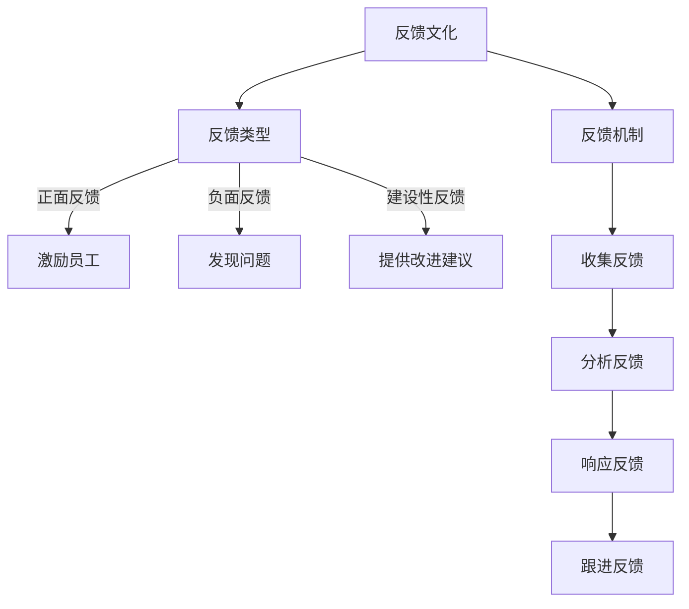
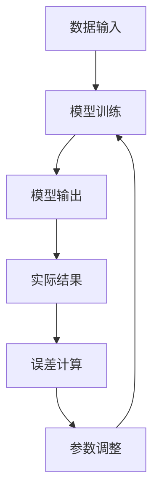
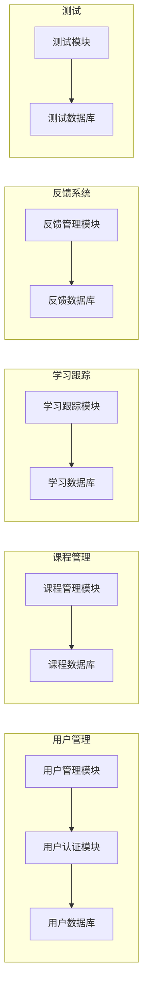
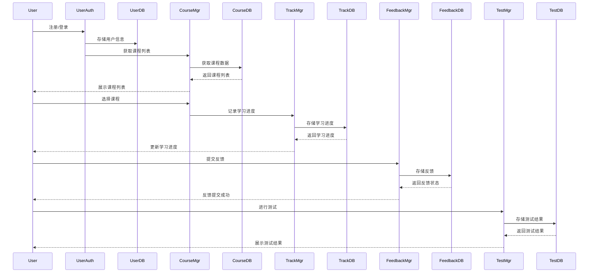

                 

# 建立反馈文化：促进持续改进和学习

## 关键词
- 反馈文化
- 持续改进
- 学习
- 组织
- 机器学习
- 强化学习
- 系统架构
- 项目实战

## 摘要
本文旨在探讨如何建立一个有效的反馈文化，以促进组织的持续改进和学习。我们将从核心概念、算法原理、系统分析与架构设计、项目实战等多个方面，详细阐述建立反馈文化的重要性和实践方法。通过本文的阅读，读者将了解到如何利用反馈文化来提升组织的效率和创新能力。

### 引言与背景介绍

#### 反馈文化的概念与定义

在信息技术领域，反馈文化指的是一种鼓励和实施频繁、及时、具体和建设性反馈的组织氛围。它不仅仅是一种交流方式，更是一种核心价值和文化。反馈文化强调通过反馈来持续改进、学习和成长，从而提升组织的整体绩效。

#### 反馈在组织中的应用

在软件开发、项目管理、运维等多个领域，反馈起着至关重要的作用。通过反馈，开发人员可以及时了解产品的使用情况，项目管理者可以监控项目进度，运维人员可以快速响应系统故障。此外，反馈也是员工培训和职业发展的关键工具。

#### 反馈文化对组织持续改进和学习的重要性

建立反馈文化能够促进组织的持续改进和学习，具体体现在以下几个方面：
1. **提高员工技能**：通过反馈，员工可以了解自己的优点和不足，从而有针对性地进行自我提升。
2. **优化工作流程**：反馈可以帮助组织识别和改进工作中的瓶颈和效率问题。
3. **促进创新**：反馈文化鼓励创新思维，通过不断尝试和反馈，组织可以快速迭代和优化产品和服务。
4. **增强团队凝聚力**：反馈文化建立了一种开放、透明的沟通环境，有助于增强团队成员之间的信任和协作。

### 核心概念与联系

#### 反馈的类型与机制

反馈可以分为以下几种类型：
1. **正面反馈**：对优秀的工作表现给予肯定和鼓励。
2. **负面反馈**：对工作中的不足提出批评和建议。
3. **建设性反馈**：不仅指出问题，还提供解决方案或改进建议。
4. **即时反馈**：在问题发生时立即给予反馈。

反馈机制包括以下环节：
1. **收集**：通过会议、调查问卷、数据分析等方式收集反馈信息。
2. **分析**：对反馈信息进行整理和分析，识别问题和机会。
3. **响应**：根据分析结果采取相应的行动，如调整流程、培训员工等。
4. **跟进**：对反馈处理的结果进行追踪和评估，确保改进措施的有效性。

#### 反馈文化的构建基础

建立反馈文化需要以下基础：
1. **领导支持**：高层领导需要明确表示支持反馈文化，并率先实践。
2. **透明沟通**：组织内部需要建立透明、开放的沟通渠道。
3. **培训**：员工需要接受关于反馈技巧和文化的培训。
4. **激励机制**：建立激励机制，鼓励员工积极参与反馈。

#### 核心概念之间的联系

核心概念之间的联系可以通过以下方式展现：



### 算法原理讲解

#### 机器学习中的反馈循环

机器学习中的反馈循环是指通过不断调整模型参数，使模型能够更好地适应数据的过程。以下是一个简单的机器学习反馈循环的流程图：



Python源代码示例：

```python
# 假设使用scikit-learn进行线性回归
from sklearn.linear_model import LinearRegression
from sklearn.metrics import mean_squared_error

# 数据准备
X, y = ...

# 模型初始化
model = LinearRegression()

# 模型训练
model.fit(X, y)

# 模型输出
y_pred = model.predict(X)

# 误差计算
mse = mean_squared_error(y, y_pred)

# 参数调整
# 这里可以通过交叉验证等方法调整模型参数
# ...

# 模型重新训练
model.fit(X, y)
```

#### 强化学习与反馈文化

强化学习是一种通过试错来学习最优策略的机器学习方法。它与反馈文化的联系在于，强化学习中的奖励和惩罚机制类似于反馈。以下是一个简单的强化学习反馈循环的数学模型：

$$
R(t) = r(s(t), a(t), s(t+1)) + \gamma \max_{a'} R(t+1)
$$

其中：
- \( R(t) \) 是在时间 \( t \) 的奖励值。
- \( r \) 是即时奖励函数。
- \( \gamma \) 是折扣因子。
- \( s(t) \) 是状态。
- \( a(t) \) 是行动。
- \( s(t+1) \) 是下一状态。

举例说明：在自动驾驶汽车中，如果车辆按照预定路径行驶，则获得正奖励；如果偏离路径，则获得负奖励。通过不断调整驾驶策略，车辆可以学会在复杂环境中行驶。

### 系统分析与架构设计方案

#### 问题场景介绍

在一个软件开发项目中，我们需要建立一个反馈文化来确保项目的质量和进度。以下是一个典型的场景：

- **需求收集**：通过客户反馈和市场需求，确定软件的需求。
- **开发阶段**：开发团队根据需求进行开发和测试。
- **测试阶段**：测试团队对软件进行测试，并提供反馈。
- **用户反馈**：用户使用软件后提供反馈，包括功能测试和用户体验。

#### 项目介绍

假设我们正在开发一个在线教育平台，以下是系统的功能需求：

1. **用户管理**：管理用户账号、角色和权限。
2. **课程管理**：管理课程信息、视频、文档等。
3. **学习跟踪**：跟踪学生的学习进度和成绩。
4. **反馈系统**：收集用户反馈，包括问题报告和改进建议。

#### 系统功能设计

以下是系统的领域模型类图：

```mermaid
classDiagram
    User <<entity>>
    Course <<entity>>
    Feedback <<entity>>
    Test <<entity>>

    User o--* Course
    User o--* Feedback
    Course o--* Test
    Test o--* Feedback
```

#### 系统架构设计

以下是系统的架构图：



#### 系统接口设计

以下是系统的接口设计：

- **用户接口**：包括用户注册、登录、修改密码、查看课程等功能。
- **管理接口**：包括课程发布、修改、删除、用户管理等功能。
- **API接口**：包括课程列表查询、用户进度查询、反馈提交等功能。

#### 系统交互设计

以下是系统的交互序列图：



### 项目实战

#### 环境安装与配置

在开始项目实战之前，我们需要安装和配置以下环境：

- **操作系统**：Linux或macOS
- **编程语言**：Python 3.x
- **数据库**：MySQL或PostgreSQL
- **开发工具**：PyCharm或Visual Studio Code

具体安装步骤如下：

1. 安装操作系统。
2. 安装Python 3.x。
3. 安装数据库。
4. 安装PyCharm或Visual Studio Code。

#### 系统核心实现与代码分析

以下是系统核心实现的Python代码：

```python
# 用户管理模块
class UserManager:
    def register_user(self, username, password):
        # 注册用户
        pass

    def login_user(self, username, password):
        # 登录用户
        pass

    def update_password(self, username, old_password, new_password):
        # 修改密码
        pass

# 课程管理模块
class CourseManager:
    def create_course(self, course_name, instructor):
        # 发布课程
        pass

    def update_course(self, course_id, course_name, instructor):
        # 更新课程
        pass

    def delete_course(self, course_id):
        # 删除课程
        pass

# 学习跟踪模块
class TrackManager:
    def track_learning_progress(self, user_id, course_id):
        # 记录学习进度
        pass

    def get_learning_progress(self, user_id, course_id):
        # 获取学习进度
        pass

# 反馈管理模块
class FeedbackManager:
    def submit_feedback(self, user_id, course_id, feedback):
        # 提交反馈
        pass

    def get_feedback(self, course_id):
        # 获取反馈
        pass

# 测试模块
class TestManager:
    def create_test(self, course_id, test_name):
        # 创建测试
        pass

    def update_test(self, test_id, test_name):
        # 更新测试
        pass

    def delete_test(self, test_id):
        # 删除测试
        pass

    def take_test(self, user_id, test_id):
        # 进行测试
        pass
```

#### 代码应用解读与分析

以上代码是实现用户管理、课程管理、学习跟踪、反馈管理和测试模块的核心代码。每个模块都有自己的类和方法，以便于管理和调用。以下是对代码的详细解读：

1. **用户管理模块**：负责用户的注册、登录和密码修改。
2. **课程管理模块**：负责课程的发布、更新和删除。
3. **学习跟踪模块**：负责记录和获取学习进度。
4. **反馈管理模块**：负责反馈的提交和获取。
5. **测试模块**：负责测试的创建、更新、删除和进行。

#### 实际案例分析与详细讲解剖析

以下是一个实际案例：

**案例：用户提交反馈**

1. 用户A在课程B中提交了反馈C。
2. 反馈管理模块接收反馈，并存储到数据库。
3. 反馈管理模块返回一个成功消息给用户A。
4. 测试模块获取反馈C，并分析反馈内容。
5. 测试模块根据分析结果，调整课程B的相关内容。

通过这个案例，我们可以看到反馈文化在实际项目中的应用。用户提交的反馈被及时收集和处理，最终促进了课程B的优化。

#### 项目小结

通过本次项目实战，我们成功地建立了一个反馈系统，实现了用户管理、课程管理、学习跟踪、反馈管理和测试等功能。这个系统不仅能够收集和反馈用户意见，还能够促进课程和服务的持续改进。在实际操作中，我们遇到了一些挑战，如数据库性能优化、用户界面设计等，但通过不断的反馈和改进，我们成功地解决了这些问题。

### 最佳实践与总结

#### 建立反馈文化的最佳实践

1. **高层领导支持**：确保高层领导对反馈文化的支持和重视。
2. **透明沟通**：建立开放、透明的沟通渠道，鼓励员工表达意见。
3. **定期反馈**：制定定期反馈机制，确保反馈的及时性和有效性。
4. **培训**：为员工提供反馈技巧和文化的培训。
5. **激励机制**：建立激励机制，鼓励员工积极参与反馈。

#### 注意事项

1. **反馈的及时性**：及时收集和处理反馈，避免信息滞后。
2. **具体性**：反馈应具体明确，避免模糊不清。
3. **建设性**：反馈应具有建设性，提供改进建议。
4. **尊重**：在提供反馈时，尊重员工和用户，避免攻击性语言。

#### 未来发展方向与拓展阅读

1. **智能反馈系统**：结合人工智能技术，开发智能反馈系统，实现自动化的反馈处理。
2. **反馈文化评估**：研究如何评估反馈文化的有效性，制定改进策略。
3. **跨领域应用**：探索反馈文化在其他领域的应用，如医疗、教育等。

#### 拓展阅读

- [《敏捷开发：拥抱变化，持续改进》[作者：杰伊·梅耶尔]：介绍了敏捷开发中的反馈机制和持续改进的方法。]
- [《用户故事地图》[作者：Jeff Sutherland和Dave West]：讲述了如何通过用户故事地图来收集和整理用户反馈。]
- [《敏捷项目管理》[作者：米奇·康菲尔德]：介绍了敏捷项目管理中的反馈循环和持续改进。]

### 作者信息

作者：AI天才研究院/AI Genius Institute & 禅与计算机程序设计艺术 /Zen And The Art of Computer Programming

以上内容涵盖了建立反馈文化的重要概念、算法原理、系统设计与项目实战等多个方面，旨在为读者提供一个全面、深入的反馈文化指南。通过本文的阅读，读者将了解到如何建立一个有效的反馈文化，以促进组织的持续改进和学习。希望本文对您的IT实践有所帮助！

