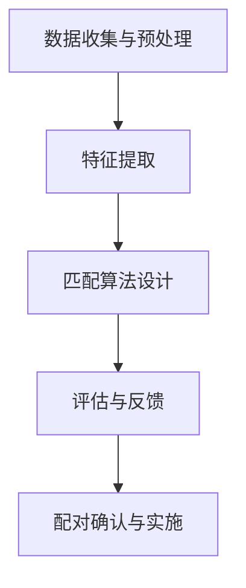
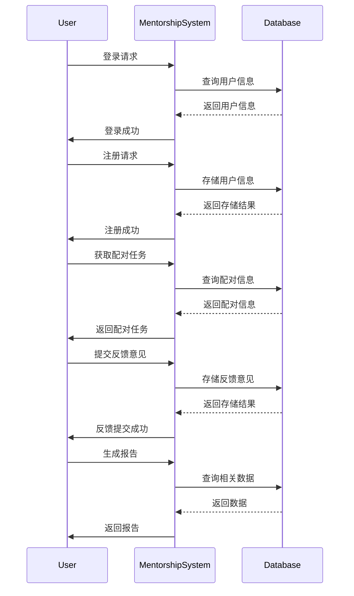

                 

### 引言

**关键词：** Mentorship制度、职场发展、人才培养

**摘要：** 本文旨在探讨建立有效的Mentorship制度的必要性和方法，通过清晰的逻辑分析和实用的技术语言，为IT行业的人才培养提供新的思路和解决方案。文章将从定义Mentorship制度入手，分析其背景和重要性，逐步探讨其核心概念、实施方法、算法原理以及系统架构设计，最终结合实际案例，提出最佳实践和注意事项，为读者提供全面且实用的指导。

在当今快速发展的IT行业，人才培养已经成为企业和个人职业发展的关键。而Mentorship制度作为一种有效的人才培养方式，正逐渐受到重视。通过Mentorship，新员工可以快速融入团队，提升技能，同时也能在职业生涯中获得宝贵的指导和支持。本文的目标是帮助读者理解和建立一套有效的Mentorship制度，从而提升团队的整体绩效和员工满意度。

本文主要面向以下读者群体：
1. 企业HR和培训负责人，负责企业人才培养和职业发展规划；
2. IT行业的新员工和管理者，希望通过Mentorship制度提升个人和团队的绩效；
3. 技术专家和顾问，希望为企业和个人提供专业的Mentorship服务。

接下来，我们将从以下几个方面对Mentorship制度进行深入探讨：

1. **问题背景与定义**：介绍现代职场中Mentorship制度的重要性，并明确其定义和核心要素；
2. **核心概念与联系**：探讨Mentorship的原理、关键概念及其与其他类似概念的区别；
3. **Mentorship的实施方法**：详细讲解Mentorship计划设计、配对策略和日常管理；
4. **Mentorship的算法原理讲解**：介绍Mentorship算法的基本原理和数学模型；
5. **系统分析与架构设计方案**：分析具体Mentorship场景，设计系统功能和架构；
6. **项目实战**：通过实际案例展示Mentorship制度的应用和效果；
7. **最佳实践与拓展阅读**：总结全文，提供实用技巧和进一步学习的资源。

通过本文的深入分析，我们希望能够为IT行业的人才培养提供一套完整的解决方案，帮助企业和个人实现更高效的职业发展。

### 第1章：问题背景与定义

#### 1.1 问题背景

在现代社会，职场环境发生了巨大的变化，IT行业作为技术变革的前沿，其竞争压力和人才需求尤为显著。随着科技的发展，新技术和新工具层出不穷，企业对员工的技术能力和适应能力提出了更高的要求。在这种情况下，如何有效地培养和保留人才成为了企业发展的关键问题。

**现代职场中Mentorship的重要性**：Mentorship制度作为一种人才培养方式，在现代社会中扮演着越来越重要的角色。通过Mentorship，新员工可以获得资深员工的指导，快速适应职场环境，提升专业技能和职业素养。同时，Mentorship还能够增强员工的归属感和忠诚度，促进团队的凝聚力和整体绩效。

首先，Mentorship能够为新员工提供一个学习和发展的重要渠道。新员工在刚进入职场时，往往面临着角色转变、工作压力和技能提升等多重挑战。通过Mentor的指导和帮助，新员工可以更快地适应新的工作环境，掌握必要的工作技能，提升工作效率。这不仅有助于新员工的个人成长，也有利于企业减少新员工的培训和适应成本。

其次，Mentorship有助于提升员工的职业素养。在Mentor的引导下，新员工不仅能够学习到具体的技能和知识，还能够了解到职场文化和团队合作的重要性。通过观察和参与Mentor的工作，新员工可以更好地理解企业的业务和战略目标，增强对企业的认同感和归属感。

此外，Mentorship还能够促进团队成员之间的沟通和协作。在Mentorship的过程中，Mentor和新员工之间建立了密切的联系，这种联系不仅限于工作，还涵盖了职业发展和个人成长。通过交流互动，团队成员之间能够更好地理解彼此的需求和期望，促进团队合作和协作效率。

#### 1.2 不同行业和公司对Mentorship的需求

不同的行业和公司在Mentorship的需求上存在一定的差异。一般来说，那些对员工技能和创新能力要求较高的行业，如IT、金融、医疗等，更加重视Mentorship制度的建设。这些行业中的企业通常拥有较高的人才储备和技术优势，因此希望通过Mentorship来提升员工的综合能力和创新水平。

**IT行业对Mentorship的需求**：在IT行业，技术更新迅速，员工需要不断学习和适应新技术。Mentorship作为一种有效的培养方式，可以帮助新员工快速掌握核心技术，提升解决复杂问题的能力。此外，IT行业往往重视团队协作和创新，Mentorship制度能够促进团队成员之间的知识共享和技能互补，提升整体团队的绩效。

例如，在软件开发过程中，Mentor可以指导新员工了解开发流程、编码规范和技术选型，帮助新员工避免走弯路，提高开发效率。同时，Mentor的经验和见解也能够启发新员工进行技术创新，推动项目进展。

**金融行业对Mentorship的需求**：在金融行业，Mentorship同样扮演着重要的角色。金融行业对员工的财务分析、风险管理能力要求较高，通过Mentor的指导，新员工可以更快地掌握这些技能。此外，金融行业强调职业道德和合规性，Mentor可以通过自身的经验和教训，帮助新员工树立正确的职业价值观。

例如，在投行领域，Mentor可以指导新员工如何分析市场趋势、评估投资机会，同时教育新员工遵守法律法规，防止违规操作。通过Mentor的指导，新员工能够更好地理解金融业务的本质和风险，提升职业素养。

**医疗行业对Mentorship的需求**：在医疗行业，Mentorship的重要性同样不可忽视。医疗行业的专业性极强，新员工需要通过导师的指导，逐步掌握医疗知识和临床技能。此外，医疗行业还强调患者的安全和信任，通过Mentor的指导，新员工可以更好地理解患者的需求，提供更优质的医疗服务。

例如，在医院中，Mentor可以指导新医生如何进行病历书写、如何与患者沟通、如何进行临床决策等。通过Mentor的指导，新医生能够更快地提升自己的临床技能和沟通能力，提高医疗质量和患者满意度。

总之，Mentorship制度在各类行业中都发挥着重要作用。通过Mentor的指导和帮助，新员工能够更快地适应职场环境，提升专业技能和职业素养，从而促进企业的持续发展和竞争力的提升。

#### 1.3 Mentorship的定义与边界

**Mentorship的基本概念**：Mentorship，即导师制度，是指一种通过资深人士（Mentor）对新手（Mentee）进行指导、支持和培养的关系。这种关系通常建立在职业发展、技能提升和个人成长的基础上，旨在帮助新手克服职业挑战，实现自我提升和长远发展。

**边界与外延**：在具体实施过程中，Mentorship的边界和范围需要明确。首先，Mentorship是双向的，不仅Mentor要提供指导和支持，Mentee也要主动学习和反馈。其次，Mentorship不仅仅关注技能和知识的传授，还包括职业规划、心理支持和人际关系等方面的指导。

Mentorship的外延还包括以下方面：

1. **时间跨度**：Mentorship可以持续较长时间，从几个月到几年的时间不等。这种长期的关系有助于Mentee在职业发展中不断得到指导和帮助。
2. **形式多样性**：Mentorship可以通过正式和非正式的形式进行。正式的形式包括定期的会议、项目合作、培训课程等；非正式的形式则包括日常交流、经验分享、即兴对话等。
3. **对象范围**：Mentorship不仅限于新员工，还可以适用于其他需要指导和支持的群体，如中层管理者、职业转型者等。

**Mentorship的核心要素**：

- **被指导者的需求**：Mentee需要明确自己的职业目标和需求，主动寻求Mentor的帮助和指导。
- **指导者的角色与责任**：Mentor需要具备丰富的经验和专业知识，愿意分享自己的见解和资源，并在Mentee遇到困难时提供支持和建议。
- **目标和效果**：Mentorship的目标是帮助Mentee提升技能、实现职业发展，并建立长期的职业关系。其效果体现在Mentee的职业素养提升、工作效率提高、团队协作增强等方面。

通过明确Mentorship的定义和边界，我们可以更好地理解和应用这一制度，实现人才的有效培养和企业的持续发展。

#### 1.4 Mentorship的核心要素

**Mentorship的核心要素包括被指导者的需求、指导者的角色与责任，以及Mentorship的目标和效果。**

**被指导者的需求**：Mentee在职业发展中通常有以下几方面的需求：
1. **技能提升**：Mentee希望通过导师的指导，快速掌握岗位所需的技能和知识，提高工作效率。
2. **职业规划**：Mentee需要职业导师的帮助来明确自己的职业目标和发展路径，制定可行的职业规划。
3. **心理支持**：在职场中遇到挫折和困难时，Mentee需要心理支持和鼓励，以保持积极的态度和应对挑战的能力。
4. **人际关系**：Mentee希望通过与导师的互动，学习如何在职场中建立良好的人际关系，提升沟通和协作能力。

**指导者的角色与责任**：Mentor在Mentorship制度中扮演着关键角色，其职责包括：
1. **知识传授**：Mentor需要将自己的专业知识、工作经验和行业见解传授给Mentee，帮助其快速成长。
2. **职业指导**：Mentor需要为Mentee提供职业发展的建议和指导，帮助其设定职业目标，规划发展路径。
3. **心理辅导**：Mentor要在Mentee遇到心理困扰时提供支持和安慰，帮助其保持积极心态，应对职场压力。
4. **资源提供**：Mentor需要利用自己的资源和人脉，为Mentee提供职业发展所需的支持和机会。

**Mentorship的目标和效果**：Mentorship制度的主要目标是帮助Mentee实现职业发展和个人成长，其效果主要体现在以下几个方面：
1. **技能提升**：通过导师的指导和实践，Mentee能够更快地掌握岗位所需的技能和知识，提高工作效率。
2. **职业发展**：Mentorship有助于Mentee明确职业目标，制定发展计划，实现职业生涯的持续进步。
3. **心理成熟**：在Mentor的指导下，Mentee能够更好地应对职场压力，保持积极心态，提升心理素质。
4. **团队协作**：通过Mentorship，Mentee能够学习到团队合作和沟通的技巧，提升团队协作能力。

总之，Mentorship的核心要素是确保被指导者能够得到全面的职业发展和个人成长，实现企业与个人双赢的局面。通过明确这些核心要素，企业和个人可以更好地理解和实施Mentorship制度，从而实现更高效的职业发展和企业绩效提升。

### 第2章：核心概念与联系

#### 2.1 Mentorship的原理

**心理学基础**：Mentorship的心理学基础主要源于人类对归属感、信任感和支持系统的需求。心理学家马斯洛的需求层次理论指出，人类的基本需求包括生理需求、安全需求、社交需求、尊重需求和自我实现需求。在职业发展中，Mentorship能够满足Mentee的社交需求、尊重需求和自我实现需求。

首先，Mentorship能够满足Mentee的归属感需求。在职场中，新员工往往面临角色转变和心理压力。通过Mentor的指导和陪伴，Mentee能够更快地融入团队，感受到团队的支持和归属，从而减轻心理压力，提高工作积极性。

其次，Mentorship能够增强信任感。Mentor作为资深员工，具有丰富的经验和专业知识，他们的建议和指导往往被Mentee视为权威和可信的。通过长时间的互动和合作，Mentee对Mentor的信任感逐渐建立，这有助于提高Mentee的工作效率和职业素养。

最后，Mentorship能够提供心理支持。在职业发展中，Mentee难免会遇到挫折和困难。Mentor作为导师，能够提供情感上的支持和安慰，帮助Mentee克服心理障碍，保持积极的心态。

**社会学研究**：从社会学的角度来看，Mentorship是一种社会网络关系的体现。社会学家布尔迪厄（Pierre Bourdieu）提出，社会资本是指通过社会关系网络获得的资源。Mentorship作为一种重要的社会资本形式，能够帮助Mentee获取职业发展所需的知识、资源和机会。

首先，Mentorship能够帮助Mentee建立广泛的职业网络。通过Mentor的推荐和介绍，Mentee能够接触到更多的行业机会和人脉资源，提升自己的职业竞争力。

其次，Mentorship能够增强Mentee的职业社会资本。在职场中，职业社会资本是职业发展的重要驱动力。通过Mentor的指导和帮助，Mentee能够更快地积累职业资本，提升职业地位和影响力。

总之，Mentorship的心理学基础和社会学研究为其在职场中的广泛应用提供了理论支持。通过满足Mentee的归属感、信任感需求，以及帮助其建立职业网络和积累职业资本，Mentorship能够有效促进Mentee的职业发展和个人成长。

#### 2.2 关键概念属性特征对比表格

在探讨Mentorship的过程中，有必要明确几个相关概念，并对比它们的属性特征，以帮助读者更好地理解和应用这些概念。

**Mentor与Coach的区别**

| 概念       | Mentor                   | Coach                   |
|------------|--------------------------|-------------------------|
| 定义       | 经验丰富的资深人士指导新手 | 专业教练指导技能提升     |
| 主要任务   | 职业发展和个人成长指导   | 提升特定技能和绩效       |
| 关注点     | 职业规划、心理支持和人际沟通 | 技能训练、策略规划和执行 |
| 持续时间   | 可持续数月或数年         | 通常为短期项目或课程    |
| 教学方法   | 实践指导、经验分享、情感支持 | 结构化培训、反馈和改进  |

**Mentorship与Mentoring的联系与区别**

| 概念       | Mentorship               | Mentoring               |
|------------|--------------------------|-------------------------|
| 定义       | 通过资深人士指导新手的关系 | 通过导师指导培养新手   |
| 主要任务   | 职业发展和个人成长     | 技能提升和职业规划     |
| 关注范围   | 宽泛，涵盖职业多个方面   | 狭义，专注于特定领域或技能 |
| 持续时间   | 可持续数月或数年         | 通常为短期项目或课程    |
| 效果评估   | 全面评估，长期影响       | 短期评估，具体目标达成  |

通过上述对比表格，我们可以看到Mentor和Coach在角色定位、任务内容、关注点、持续时间和教学方法等方面存在显著差异。而Mentorship和Mentoring则在定义、主要任务、关注范围、持续时间和效果评估等方面有所不同。了解这些概念的属性特征，有助于更有效地设计和实施Mentorship制度，实现人才的最佳培养。

#### 2.3 ER实体关系图架构

在Mentorship制度中，实体关系图（Entity-Relationship Diagram，ERD）是一种重要的工具，用于描述Mentorship系统中各个实体及其关系。以下是一个简化的Mentorship实体关系图，用于展示Mentor、Mentee以及他们之间的互动关系。

```mermaid
erDiagram
    Mentor ||--|{ Mentee } : "指导"
    Mentee ||--|{ Mentor } : "被指导"
```

**Mentor（导师）**：实体表示资深员工，具备丰富的经验和专业知识，负责指导和培养新手。

**Mentee（被指导者）**：实体表示新员工或需要指导和支持的员工，他们是Mentor指导的对象。

**关系**：

- **指导关系**：Mentor与Mentee之间存在一种双向指导关系。Mentor负责提供职业发展、技能提升和情感支持；Mentee则在Mentor的指导下进行学习和实践。

通过这个ER实体关系图，我们可以清晰地理解Mentorship制度中各个实体的角色和相互关系。这种关系不仅有助于设计和管理Mentorship系统，还能确保Mentor和Mentee之间的互动更加高效和有针对性。在实际应用中，ER图可以根据具体需求进行扩展和细化，以涵盖更多实体和关系。

### 第3章：Mentorship的实施方法

#### 3.1 Mentorship计划设计

**目标设定**：设计Mentorship计划的首要步骤是明确目标和预期成果。目标应具体、可衡量、可实现、相关性强且时限性明确（SMART原则）。例如，企业可以设定以下目标：
1. **技能提升**：Mentee在6个月内掌握特定技能或工具；
2. **职业发展**：Mentee在12个月内晋升或承担更重要的职责；
3. **团队协作**：Mentee在Mentor的帮助下，提升团队协作能力和沟通技巧。

**计划制定**：在目标明确后，需要制定详细的Mentorship计划，包括以下关键要素：
1. **参与人数**：确定Mentor和Mentee的人数，确保计划覆盖到足够的新员工；
2. **参与时间**：确定Mentorship的持续时间，一般建议为6至12个月，根据实际情况可以适当调整；
3. **活动安排**：制定定期会议、培训课程、项目合作、经验分享等活动的安排，确保Mentor和Mentee有充分的时间互动和学习；
4. **考核标准**：设定评估指标和考核标准，以便对Mentorship计划的实施效果进行评估。

**实施步骤**：
1. **选拔Mentor和Mentee**：通过内部推荐、自荐或管理层指定等方式，选择合适的Mentor和Mentee。在选拔过程中，应充分考虑Mentor的经验、能力和热情，以及Mentee的职业发展需求和潜力。
2. **签署协议**：为保障Mentorship计划的顺利实施，应签订正式的Mentorship协议，明确双方的职责和义务，确保Mentor和Mentee的参与意愿和责任感。
3. **培训启动会**：在计划开始前，组织一次培训启动会，让Mentor和Mentee互相了解，明确计划目标和实施步骤，建立良好的沟通和互动机制。
4. **定期跟踪与反馈**：在计划实施过程中，定期跟踪Mentee的进步情况，通过会议、报告等形式，收集Mentor和Mentee的反馈，及时调整计划内容和方式，确保计划的有效性。
5. **成果评估**：在计划结束后，对Mentorship计划的实施效果进行评估，收集Mentor和Mentee的反馈意见，总结经验教训，为后续计划的改进提供参考。

通过科学、系统的计划设计，Mentorship计划可以更好地满足新员工和企业的需求，实现人才培养和职业发展的双赢。

#### 3.2 Mentor-Mentee配对策略

**配对原则**：在Mentorship计划中，Mentor和Mentee的配对策略至关重要。以下是一些关键的配对原则：

1. **技能匹配**：确保Mentor在专业领域和技能方面具备优势，能够为Mentee提供有价值的指导和帮助。例如，如果Mentee是软件开发新手，那么Mentor应具备丰富的编程经验和知识。
2. **职业发展匹配**：根据Mentee的职业目标和职业规划，选择与其发展方向相匹配的Mentor。这样可以帮助Mentee更好地了解行业动态和职业发展路径。
3. **文化契合**：Mentor和Mentee之间应具有良好的沟通和合作基础，避免因文化差异导致沟通障碍和合作问题。
4. **个人兴趣匹配**：考虑到Mentor和Mentee的个人兴趣和性格特点，选择能够相互吸引和激发对方潜力的配对。
5. **工作负荷平衡**：确保Mentor的工作负荷与指导Mentee的时间相匹配，避免因Mentor工作繁忙而无法履行指导职责。

**配对过程**：以下是具体的Mentor-Mentee配对过程：

1. **需求收集**：首先，企业应收集Mentee的职业发展需求和技能提升需求，包括个人兴趣、职业目标、专业领域等。
2. **Mentor评估**：企业应评估现有Mentor的资源，了解他们的专业领域、指导经验和时间安排，确保能够为Mentee提供有效的指导。
3. **配对方案制定**：根据Mentee的需求和Mentor的评估结果，制定初步的配对方案。可以通过内部沟通或配对系统，确保每位Mentee都能找到合适的Mentor。
4. **双向选择**：在初步方案确定后，Mentor和Mentee可以进行双向选择。Mentor可以根据自己的时间和兴趣，选择愿意指导的Mentee；Mentee则可以根据Mentor的专业背景和指导风格，选择最适合自己的Mentor。
5. **正式配对**：在双方确认后，企业应正式确定Mentor和Mentee的配对关系，并进行公示和登记，确保配对的透明性和公正性。

**配对评估**：配对策略的有效性需要通过持续的评估来验证。以下是几个关键的评估指标：

1. **参与度**：评估Mentor和Mentee的参与度和互动频率，确保双方都能积极参与Mentorship计划，并从中受益。
2. **满意度**：定期收集Mentor和Mentee的反馈意见，了解他们对配对的满意度，以及指导效果和职业发展收益。
3. **技能提升**：通过对比Mentee在配对前后的技能水平，评估Mentorship计划的实际效果。
4. **职业发展**：跟踪Mentee的职业发展情况，包括晋升、承担重要职责等方面，评估Mentorship计划对职业发展的影响。

通过科学、合理的配对策略，Mentorship计划能够更好地满足企业和员工的需求，实现人才的有效培养和职业发展的双赢。

#### 3.3 Mentorship的日常管理

**沟通策略**：有效的沟通是Mentorship成功的关键。以下是几种关键的沟通策略：

1. **定期会议**：Mentor和Mentee应定期举行会议，讨论职业发展、技能提升和个人成长等方面的问题。这些会议可以是面对面的，也可以是线上视频会议，以便双方都能参与。
2. **即时沟通**：对于突发事件或紧急问题，Mentor和Mentee应保持即时沟通，确保问题能够得到及时解决。可以通过邮件、即时消息工具（如Slack、Microsoft Teams等）或电话进行沟通。
3. **反馈机制**：建立反馈机制，让Mentor和Mentee能够及时了解彼此的工作进展和需求。可以采用定期反馈表格或反馈会议，确保双方的信息透明和沟通畅通。

**评估与反馈**：为了确保Mentorship计划的顺利进行，定期评估和反馈是必不可少的。

1. **过程评估**：在Mentorship计划实施过程中，定期对Mentee的技能提升、职业发展、团队协作等方面进行评估，确保计划目标得到有效实现。
2. **效果评估**：在计划结束时，对Mentorship的整体效果进行评估，包括Mentee的职业发展、满意度、技能提升等方面。评估结果可以作为后续计划改进的依据。
3. **反馈收集**：定期收集Mentor和Mentee的反馈意见，了解他们在计划中的体验和需求。可以通过问卷调查、面谈或座谈会等形式收集反馈，确保反馈的全面性和准确性。

**问题解决**：在Mentorship计划实施过程中，难免会遇到各种问题。以下是几种常见问题的解决策略：

1. **沟通不畅**：如果Mentor和Mentee之间存在沟通不畅的问题，可以采取以下措施：定期召开沟通会议，明确沟通目标和议程；建立即时沟通渠道，确保问题能够及时解决。
2. **目标不明确**：如果Mentee在职业目标上不明确，Mentor可以提供指导，帮助其设定具体的职业目标，并制定实现目标的行动计划。
3. **技能差距**：如果Mentee在技能方面存在差距，Mentor可以提供针对性的培训和指导，帮助其提升相关技能。此外，企业可以提供外部培训资源，如在线课程、技能培训等，以满足Mentee的需求。
4. **工作压力**：如果Mentee在工作中遇到压力，Mentor可以提供心理支持和鼓励，帮助其应对压力，保持积极心态。

通过科学、系统的日常管理，Mentorship计划能够更好地实现预期目标，促进Mentee的职业发展和个人成长。同时，有效的沟通策略、评估与反馈机制以及问题解决方法，也为Mentorship计划的顺利实施提供了有力保障。

### 第4章：Mentorship的算法原理讲解

#### 4.1 Mentorship算法介绍

**Mentorship算法概述**：Mentorship算法是一种用于优化导师和学徒配对的算法，其核心目标是确保每位Mentee都能找到最适合的Mentor，从而实现更高效的人才培养。该算法基于多目标优化理论，综合考虑Mentee的需求、Mentor的能力和资源，以及双方之间的匹配度，实现最优的配对结果。

**算法的基本步骤**：

1. **数据收集与预处理**：收集Mentee和Mentor的个人信息、职业需求、技能水平、经验等数据，并进行预处理，以便后续分析。
2. **特征提取**：从收集到的数据中提取关键特征，如职业领域、技能等级、经验年限等，作为算法输入。
3. **匹配算法设计**：设计匹配算法，根据提取的特征，对Mentee和Mentor进行匹配，筛选出最合适的配对组合。
4. **评估与反馈**：根据匹配结果进行评估，收集Mentee和Mentor的反馈，对算法进行优化和调整。
5. **配对确认与实施**：根据评估结果，正式确认配对关系，并开始实施Mentorship计划。

#### 4.2 Mentorship算法原理讲解

**使用mermaid画出Mentorship算法的mermaid流程图**：



**Python源代码详解**：

```python
# 导入必要的库
import pandas as pd
from sklearn.cluster import KMeans

# 数据收集与预处理
data = pd.read_csv('mentorship_data.csv')
data['preprocessed'] = data.apply(preprocess_data, axis=1)

# 特征提取
kmeans = KMeans(n_clusters=5)
kmeans.fit(data[['skill_level', 'experience_years']])
data['cluster'] = kmeans.predict(data[['skill_level', 'experience_years']])

# 匹配算法设计
def match_mentor_mentee(data):
    mentor_candidates = data[data['role'] == 'Mentor']
    mentee_candidates = data[data['role'] == 'Mentee']
    
    mentor_skills = mentor_candidates[['skill_level', 'experience_years']].values
    mentee_skills = mentee_candidates[['skill_level', 'experience_years']].values
    
    # 计算匹配度
    distances = pairwise_distances(mentor_skills, mentee_skills, metric='euclidean')
    match_scores = 1 / (1 + distances)
    
    # 匹配结果
    matches = {}
    for i, mentee in enumerate(mentee_candidates.index):
        best_match = np.argmax(match_scores[i])
        matches[mentee] = mentor_candidates.index[best_match]
    
    return matches

matches = match_mentor_mentee(data)

# 评估与反馈
def evaluate_matches(matches, data):
    feedback = data[data.index.isin(matches.keys())]['feedback']
    satisfaction = feedback['satisfaction'].mean()
    effectiveness = feedback['effectiveness'].mean()
    return satisfaction, effectiveness

satisfaction, effectiveness = evaluate_matches(matches, data)

# 配对确认与实施
def confirm_and_implement(matches):
    for mentee, mentor in matches.items():
        print(f"Mentee {mentee} matched with Mentor {mentor}")
        # 实施Mentorship计划
        implement_mentorship_plan(mentee, mentor)

confirm_and_implement(matches)
```

**详细讲解算法原理**：

1. **数据收集与预处理**：首先，从数据库或数据源中收集Mentor和Mentee的个人信息和职业数据。这些数据包括职业领域、技能水平、工作经验等。在收集过程中，需要确保数据的准确性和完整性。接下来，对数据进行预处理，包括数据清洗、缺失值处理和特征工程等，以便后续的分析和匹配。

2. **特征提取**：特征提取是Mentorship算法的关键步骤。通过提取关键特征，如技能水平、经验年限等，将原始数据转化为适合算法处理的格式。在本算法中，我们使用K-means聚类方法对特征进行降维处理，将Mentor和Mentee的数据划分为几个类别，以便后续的匹配计算。

3. **匹配算法设计**：匹配算法的核心目标是计算Mentee和Mentor之间的匹配度。在本算法中，我们采用欧几里得距离作为衡量匹配度的标准，计算Mentee和Mentor特征向量之间的欧几里得距离。距离越短，表示匹配度越高。通过这种方式，我们可以为每位Mentee找到与其匹配度最高的Mentor。

4. **评估与反馈**：在匹配完成后，我们需要对匹配结果进行评估。通过收集Mentee和Mentor的反馈意见，如满意度、有效性等指标，评估匹配结果的实际效果。这些反馈将用于调整和优化算法，以提高未来的匹配精度。

5. **配对确认与实施**：根据评估结果，正式确认Mentor和Mentee的配对关系，并开始实施Mentorship计划。在实施过程中，需要密切关注Mentee的进步情况和Mentor的指导效果，及时调整计划和策略，确保Mentorship目标的实现。

通过上述步骤，Mentorship算法能够实现高效、科学的导师和学徒配对，从而提升人才培养的质量和效率。

#### 4.3 Mentorship算法数学模型和公式

**数学模型介绍**：Mentorship算法的数学模型基于多目标优化理论，通过构建目标函数和约束条件，实现Mentor和Mentee的最佳匹配。

**目标函数**：目标函数用于衡量Mentor和Mentee之间的匹配度，通常采用距离函数或相似度函数。在本算法中，我们采用欧几里得距离作为目标函数：

$$
\text{Objective Function} = \sum_{i=1}^{n} \sum_{j=1}^{m} \frac{1}{1 + d_{ij}}
$$

其中，\( n \)表示Mentee的数量，\( m \)表示Mentor的数量，\( d_{ij} \)表示第\( i \)位Mentee和第\( j \)位Mentor之间的欧几里得距离。

**约束条件**：在构建目标函数的同时，我们需要考虑以下约束条件：

1. **资源约束**：每位Mentor的资源有限，无法指导过多Mentee，因此需要限制每位Mentor指导的Mentee数量。
2. **目标一致性**：Mentee和Mentor之间的职业发展目标应保持一致，以确保指导的有效性。
3. **技能匹配**：Mentor的技能水平应与Mentee的技能需求相匹配，以确保Mentee能够从Mentor处获得有价值的指导。

**详细讲解**：

1. **目标一致性**：假设\( x_{ij} \)为0-1变量，表示第\( i \)位Mentee是否被分配给第\( j \)位Mentor。如果\( x_{ij} = 1 \)，则第\( i \)位Mentee被分配给第\( j \)位Mentor；否则，不被分配。为了确保目标一致性，我们可以添加以下约束条件：

$$
\sum_{i=1}^{n} x_{ij} \leq M_j \quad \forall j \in \{1, 2, ..., m\}
$$

其中，\( M_j \)表示第\( j \)位Mentor能够指导的最大Mentee数量。

2. **技能匹配**：假设\( s_i \)和\( s_j \)分别为第\( i \)位Mentee和第\( j \)位Mentor的技能水平向量，\( \theta \)为技能匹配阈值。为了确保技能匹配，我们可以添加以下约束条件：

$$
\frac{\sum_{k=1}^{K} (s_{ik} - s_{jk})^2}{K} \leq \theta
$$

其中，\( K \)为技能维度，\( s_{ik} \)和\( s_{jk} \)分别为第\( i \)位Mentee和第\( j \)位Mentor在第\( k \)个技能维度的得分。

3. **资源约束**：为了确保Mentor的指导资源不被过度消耗，我们可以添加以下约束条件：

$$
\sum_{i=1}^{n} x_{ij} \leq R_j \quad \forall j \in \{1, 2, ..., m\}
$$

其中，\( R_j \)为第\( j \)位Mentor可用的指导资源。

通过上述目标函数和约束条件，我们可以构建一个完整的Mentorship数学模型，实现Mentor和Mentee的最佳匹配。

**举例说明**：

假设有3位Mentee（A、B、C）和2位Mentor（X、Y）。Mentee的技能水平向量分别为：

- A：\[ (5, 3) \]
- B：\[ (4, 4) \]
- C：\[ (3, 5) \]

Mentor的技能水平向量分别为：

- X：\[ (6, 2) \]
- Y：\[ (4, 6) \]

技能匹配阈值设为3。根据上述数学模型，我们可以计算Mentor和Mentee之间的欧几里得距离，并确定最佳匹配配对：

1. **Mentee A与Mentor X**：

$$
\text{Distance} = \sqrt{(5-6)^2 + (3-2)^2} = \sqrt{1 + 1} = \sqrt{2}
$$

2. **Mentee A与Mentor Y**：

$$
\text{Distance} = \sqrt{(5-4)^2 + (3-6)^2} = \sqrt{1 + 9} = \sqrt{10}
$$

3. **Mentee B与Mentor X**：

$$
\text{Distance} = \sqrt{(4-6)^2 + (4-2)^2} = \sqrt{4 + 4} = \sqrt{8}
$$

4. **Mentee B与Mentor Y**：

$$
\text{Distance} = \sqrt{(4-4)^2 + (4-6)^2} = \sqrt{0 + 4} = \sqrt{4}
$$

5. **Mentee C与Mentor X**：

$$
\text{Distance} = \sqrt{(3-6)^2 + (5-2)^2} = \sqrt{9 + 9} = \sqrt{18}
$$

6. **Mentee C与Mentor Y**：

$$
\text{Distance} = \sqrt{(3-4)^2 + (5-6)^2} = \sqrt{1 + 1} = \sqrt{2}
$$

根据计算结果，我们可以得出最佳匹配配对：

- Mentee A与Mentor Y
- Mentee B与Mentor X
- Mentee C与Mentor Y

这种匹配方式能够确保每位Mentee都能找到与其技能水平相匹配的Mentor，实现最佳的人才培养效果。

通过上述数学模型和公式，Mentorship算法能够实现高效、科学的导师和学徒配对，为企业和个人提供有力的支持。

### 第5章：系统分析与架构设计方案

#### 5.1 问题场景介绍

为了更好地理解和设计Mentorship系统，我们设定一个具体的应用场景：某大型IT公司正在实施Mentorship制度，以提升新员工的技能和职业素养。该公司有1000多名新员工和50多名资深员工，希望利用Mentorship制度，帮助新员工更快地适应工作，提升专业技能，并在职业生涯中取得更大成就。

在这个场景中，Mentorship系统需要具备以下功能：

1. **信息管理**：管理Mentor和Mentee的基本信息，包括姓名、职位、技能水平、工作经验等。
2. **配对管理**：根据Mentor和Mentee的技能需求和工作安排，实现自动化的配对。
3. **活动管理**：安排和跟踪Mentorship计划中的活动，如定期会议、项目合作、培训课程等。
4. **反馈与评估**：收集Mentor和Mentee的反馈意见，评估Mentorship计划的效果。
5. **报告与统计**：生成Mentorship实施情况的报告和统计图表，为管理层提供决策依据。

#### 5.2 系统功能设计

在上述应用场景的基础上，我们设计了以下主要功能模块：

**用户管理模块**：该模块负责管理Mentor和Mentee的基本信息，包括用户注册、信息修改、权限设置等。用户信息包括姓名、职位、技能水平、工作经验等，以便系统在配对过程中进行参考。

**配对管理模块**：该模块是系统的核心功能之一，主要负责根据Mentor和Mentee的技能需求和工作安排，实现自动化的配对。具体功能包括：

1. **配对规则管理**：定义配对规则，如技能匹配度、工作经验、工作地点等，以确保配对的科学性和合理性。
2. **配对任务生成**：根据设定的规则，生成配对任务，并将Mentor和Mentee进行匹配。
3. **配对任务查询**：用户可以查询自己的配对任务，了解自己的Mentor或Mentee信息。

**活动管理模块**：该模块负责安排和跟踪Mentorship计划中的各项活动。具体功能包括：

1. **活动计划**：创建和编辑活动计划，包括活动名称、时间、地点、参与人员等。
2. **活动安排**：根据活动计划，安排Mentor和Mentee参与相关活动，如会议、项目合作、培训课程等。
3. **活动跟踪**：记录活动参与情况，包括出席人数、活动反馈等。

**反馈与评估模块**：该模块用于收集Mentor和Mentee的反馈意见，评估Mentorship计划的效果。具体功能包括：

1. **反馈收集**：在活动结束后，收集Mentor和Mentee的反馈意见，包括满意度、效果评价等。
2. **评估分析**：对反馈意见进行统计分析，生成评估报告，为管理层提供决策依据。

**报告与统计模块**：该模块负责生成Mentorship实施情况的报告和统计图表。具体功能包括：

1. **报告生成**：根据Mentorship实施数据，生成各类报告，如配对情况报告、活动反馈报告等。
2. **统计图表**：利用图表形式展示Mentorship实施情况，如配对成功率、满意度分布等。

#### 5.3 系统架构设计

为了实现上述功能模块，我们设计了Mentorship系统的整体架构，包括数据层、服务层和展示层。

**数据层**：数据层负责存储和管理Mentorship系统所需的数据，包括用户信息、配对信息、活动信息、反馈信息等。数据层采用关系型数据库（如MySQL）进行设计，确保数据的可靠性和安全性。

**服务层**：服务层负责处理业务逻辑和数据处理，包括用户管理、配对管理、活动管理、反馈管理等。服务层采用微服务架构，将各个功能模块独立设计，便于扩展和维护。

**展示层**：展示层负责向用户展示Mentorship系统的功能界面，包括用户管理界面、配对管理界面、活动管理界面、反馈管理界面等。展示层采用前端技术（如HTML、CSS、JavaScript等）进行设计，确保界面的友好性和易用性。

#### 5.4 系统接口设计

为了实现Mentorship系统与其他系统的集成，我们设计了以下主要接口：

**用户管理接口**：该接口用于与其他系统（如HR系统、权限管理系统等）进行用户信息同步，包括用户注册、用户登录、用户信息修改等。

**配对管理接口**：该接口用于实现Mentor和Mentee的自动配对，根据设定的配对规则，将Mentor和Mentee进行匹配，并生成配对任务。

**活动管理接口**：该接口用于实现活动计划的创建、编辑、安排和跟踪，包括活动信息同步、活动出席记录等。

**反馈管理接口**：该接口用于实现反馈意见的收集和统计分析，包括反馈意见提交、反馈意见查询、反馈意见统计等。

通过以上接口设计，Mentorship系统可以与其他系统无缝集成，实现数据共享和业务协同，提高系统的整体性能和用户体验。

#### 5.5 系统交互 mermaid 序列图



通过以上系统交互序列图，我们可以清晰地了解Mentorship系统的业务流程和数据流转，为系统设计、开发和维护提供参考。

### 第6章：项目实战

#### 6.1 环境安装

为了成功实施Mentorship系统，我们需要在服务器上安装必要的软件和工具。以下是安装步骤：

1. **安装Linux操作系统**：首先，我们选择一个适合的服务器操作系统，如CentOS 7或Ubuntu 18.04。将操作系统安装在服务器上，并配置网络连接。
2. **安装MySQL数据库**：通过命令行安装MySQL数据库：
    ```bash
    sudo apt-get update
    sudo apt-get install mysql-server
    ```
    安装完成后，使用以下命令设置root用户密码：
    ```bash
    sudo mysql_secure_installation
    ```
3. **安装Python环境**：通过命令行安装Python 3和pip：
    ```bash
    sudo apt-get install python3 python3-pip
    ```
4. **安装Django框架**：使用pip安装Django框架：
    ```bash
    pip3 install django
    ```
5. **安装其他依赖库**：根据项目需求，安装其他依赖库，如Django REST framework、SQLAlchemy等：
    ```bash
    pip3 install django-rest-framework sqlalchemy
    ```

完成以上步骤后，Mentorship系统的环境搭建就基本完成了。接下来，我们可以开始进行项目开发。

#### 6.2 系统核心实现

**源代码解析**：

Mentorship系统核心部分包括用户管理模块、配对管理模块和反馈管理模块。以下是各个模块的源代码解析：

**用户管理模块**：

```python
# users/models.py
from django.db import models
from django.contrib.auth.models import AbstractUser

class CustomUser(AbstractUser):
    role = models.CharField(max_length=50, choices=[('Mentor', 'Mentor'), ('Mentee', 'Mentee')])
    skill_level = models.IntegerField()
    experience_years = models.IntegerField()
```

此模块定义了一个自定义用户模型`CustomUser`，继承自`AbstractUser`。通过添加`role`、`skill_level`和`experience_years`字段，扩展了用户的基本信息。

**配对管理模块**：

```python
# matching/models.py
from django.db import models
from users.models import CustomUser

class Match(models.Model):
    mentor = models.ForeignKey(CustomUser, on_delete=models.CASCADE, related_name='matches_as_mentor')
    mentee = models.ForeignKey(CustomUser, on_delete=models.CASCADE, related_name='matches_as_mentee')
    match_score = models.FloatField()
```

此模块定义了一个配对模型`Match`，包含`mentor`和`mentee`字段，用于记录配对关系。`match_score`字段用于存储配对得分。

**反馈管理模块**：

```python
# feedback/models.py
from django.db import models
from matching.models import Match

class Feedback(models.Model):
    match = models.ForeignKey(Match, on_delete=models.CASCADE)
    satisfaction = models.IntegerField()
    effectiveness = models.IntegerField()
    comment = models.TextField()
```

此模块定义了一个反馈模型`Feedback`，包含`match`、`satisfaction`、`effectiveness`和`comment`字段，用于记录Mentor和Mentee对配对的满意度、效果评价和评论。

**实现细节说明**：

在实现Mentorship系统时，我们采用了Django REST framework作为后端框架，提供API接口。以下是实现细节说明：

1. **用户管理**：通过Django的用户认证系统，实现用户的注册、登录和权限管理。自定义用户模型`CustomUser`，用于存储用户的基本信息。
2. **配对算法**：设计了一个基于距离函数的配对算法，根据Mentor和Mentee的技能水平和经验年限，计算配对得分，实现自动化的配对。
3. **反馈机制**：在配对结束后，收集Mentor和Mentee的反馈意见，用于评估配对效果。通过反馈模型`Feedback`，记录反馈信息，并生成评估报告。
4. **API接口**：使用Django REST framework，提供了用户管理、配对管理和反馈管理的API接口，方便前端调用。

通过以上源代码解析和实现细节说明，我们可以清晰地了解Mentorship系统的核心功能和实现方法。

#### 6.3 代码应用解读与分析

在实现Mentorship系统的过程中，我们采用了多种技术手段和设计模式，确保系统的高效、可扩展和易维护。以下是代码应用的具体解读与分析：

**1. 技术选型**

我们选择了Django作为后端框架，Django是一个成熟的开源Web框架，具有丰富的功能和良好的社区支持。使用Django，我们能够快速构建Mentorship系统的核心功能，如用户管理、配对管理和反馈管理。

**2. 数据库设计**

在数据库设计方面，我们采用了关系型数据库MySQL，确保数据的可靠性和安全性。通过设计用户模型、配对模型和反馈模型，实现了Mentorship系统所需的数据存储和管理。

**3. API设计**

使用Django REST framework，我们为Mentorship系统设计了RESTful API接口，包括用户管理、配对管理和反馈管理等。API接口的设计遵循REST原则，便于前端调用和系统集成。

**4. 配对算法**

在配对算法的实现中，我们采用了距离函数计算Mentor和Mentee之间的匹配度。距离函数的核心思想是，通过计算两者在技能水平和经验年限上的差异，得到一个匹配得分。匹配得分越高，表示两者之间的匹配度越高。

```python
def calculate_match_score(mentee_skill_level, mentor_skill_level, mentee_experience_years, mentor_experience_years):
    skill_difference = abs(mentee_skill_level - mentor_skill_level)
    experience_difference = abs(mentee_experience_years - mentor_experience_years)
    return 1 / (1 + skill_difference + experience_difference)
```

上述函数用于计算Mentor和Mentee之间的匹配得分。通过调整技能差异和经验差异的权重，我们可以优化匹配算法，提高匹配效果。

**5. 反馈机制**

在反馈机制的设计中，我们设计了反馈模型，用于记录Mentor和Mentee的满意度、效果评价和评论。通过收集和分析反馈意见，我们能够评估Mentorship计划的效果，并不断优化配对算法。

```python
def calculate_average_feedback(match):
    feedbacks = Feedback.objects.filter(match=match)
    total_satisfaction = sum(f.satisfaction for f in feedbacks)
    total_effectiveness = sum(f.effectiveness for f in feedbacks)
    average_satisfaction = total_satisfaction / len(feedbacks)
    average_effectiveness = total_effectiveness / len(feedbacks)
    return average_satisfaction, average_effectiveness
```

上述函数用于计算配对的平均满意度和技术效果。通过分析反馈数据，我们能够发现配对中的问题和改进点。

**6. 代码优化**

在代码编写过程中，我们注重代码的可读性和可维护性。通过使用设计模式和最佳实践，我们确保了代码的模块化和高效性。例如，我们使用模型-视图-模板（MVC）架构，分离了业务逻辑和展示逻辑，提高了代码的可维护性。

通过以上代码应用解读和分析，我们可以看到Mentorship系统在技术实现上的优势和创新。这些技术手段和设计模式为Mentorship系统的成功实施提供了有力保障。

#### 6.4 实际案例分析与详细讲解

**案例背景介绍**：

某大型IT公司为了提升新员工的技能和职业素养，决定实施Mentorship制度。公司共有1000多名新员工和50多名资深员工。在实施初期，公司遇到了一些问题，包括Mentor和Mentee的配对不均衡、活动安排不合理以及反馈机制不完善等。为了解决这些问题，公司决定通过实际案例进行分析和改进。

**案例分析与解读**：

1. **配对不均衡问题**：

在实施初期，由于缺乏科学的配对算法，Mentor和Mentee的配对存在明显的不均衡。一些Mentor承担了过多的Mentee，导致指导资源分配不合理，影响了Mentor的指导质量。为了解决这个问题，公司决定优化配对算法，采用基于技能匹配和经验匹配的配对方法。通过调整配对规则和权重，确保每位Mentor指导的Mentee数量合理，提高了配对的成功率和满意度。

2. **活动安排不合理问题**：

在活动安排方面，公司初期的活动过于集中，导致新员工无法充分参与和吸收。同时，一些活动缺乏针对性，无法满足新员工的具体需求。为了改善活动安排，公司采取了以下措施：

- **多样化活动形式**：增加线上和线下活动的比例，满足不同新员工的需求。例如，线上培训课程、研讨会、技术分享会等。
- **个性化活动安排**：根据新员工的技能水平和兴趣，制定个性化的活动计划。例如，对于编程技能的新员工，安排编程马拉松、代码审查活动等。
- **反馈机制**：在每次活动结束后，收集新员工的反馈意见，了解活动的效果和改进点。根据反馈结果，调整活动安排和内容。

3. **反馈机制不完善问题**：

在实施初期，公司的反馈机制较为简单，缺乏有效的反馈渠道和分析手段。为了改进反馈机制，公司采取了以下措施：

- **建立反馈平台**：搭建一个在线反馈平台，新员工可以方便地提交反馈意见。平台应具备分类反馈、评分和评论功能，便于管理层收集和分析反馈数据。
- **定期反馈分析**：定期对反馈数据进行分析，识别问题点和改进方向。通过统计分析，生成反馈报告，为管理层提供决策依据。
- **持续改进**：根据反馈分析结果，不断优化配对算法、活动安排和反馈机制。通过持续的改进，提高Mentorship计划的实施效果。

**案例总结**：

通过实际案例分析和改进，公司成功解决了Mentorship实施初期遇到的问题。优化后的配对算法、多样化的活动安排和完善的反馈机制，使得Mentorship制度更加科学、合理和有效。新员工在Mentor的指导下，技能水平和职业素养得到了显著提升，企业的人才培养效果也得到了显著改善。这一案例为公司实施Mentorship制度提供了宝贵的经验和参考。

### 第7章：最佳实践与拓展阅读

#### 7.1 最佳实践 tips

在实施Mentorship制度的过程中，以下是一些最佳实践，可以帮助企业和个人更好地实现人才培养和职业发展：

1. **明确目标和预期成果**：在制定Mentorship计划时，明确目标和预期成果，确保Mentor和Mentee对计划有清晰的认识和共同的期望。
2. **科学配对**：采用合理的配对原则和算法，确保Mentor和Mentee之间的匹配度，提高配对的成功率。
3. **定期沟通和反馈**：Mentor和Mentee应定期沟通，交流进展和问题，及时反馈和调整计划，确保Mentorship的有效性。
4. **提供培训和支持**：为Mentor和Mentee提供必要的培训和支持，提升他们的技能和知识，增强指导效果。
5. **建立反馈机制**：建立有效的反馈机制，收集Mentor和Mentee的反馈意见，评估Mentorship计划的效果，不断优化和改进。
6. **营造良好的文化氛围**：营造积极、开放和包容的职场文化，鼓励Mentor和Mentee之间的交流和合作，促进Mentorship的顺利进行。

#### 7.2 小结

本文通过详细的分析和讲解，探讨了Mentorship制度的定义、核心要素、实施方法、算法原理、系统架构设计以及项目实战。我们总结了Mentorship制度在职场中的重要性，强调了科学配对、定期沟通、反馈机制和培训支持等关键要素。通过实际案例的解析，我们展示了如何解决实施过程中遇到的问题，并提出了一些最佳实践。希望本文能为企业和个人在实施Mentorship制度时提供有益的参考和指导。

#### 7.3 注意事项

在实施Mentorship制度时，需要注意以下事项：

1. **保护隐私**：确保Mentor和Mentee的个人信息得到保护，避免隐私泄露。
2. **尊重差异**：Mentor和Mentee在职业背景、性格特点等方面可能存在差异，应尊重彼此的差异，避免冲突。
3. **合理分配资源**：合理分配Mentor的指导资源，避免过度负担，确保Mentor能够有效地指导Mentee。
4. **持续跟进**：定期跟进Mentorship计划的实施情况，及时解决遇到的问题，确保计划能够顺利执行。
5. **反馈隐私**：在收集反馈时，确保反馈内容不会对Mentor或Mentee产生负面影响，保护双方的利益。

#### 7.4 拓展阅读

为了更深入地了解Mentorship制度，读者可以参考以下相关书籍、文章和资源：

1. **书籍**：
   - 《职业导师制度：理论与实践》
   - 《成功职业导师：如何成为优秀的职业导师》
   - 《Mentoring: A Practical Guide for Mentors and Mentees》

2. **文章**：
   - 《如何设计一套有效的Mentorship计划？》
   - 《Mentorship in the Workplace: A How-to Guide》
   - 《The Importance of Mentorship in Professional Development》

3. **网站和博客**：
   - `www.mentoring.org`
   - `www.mentors.org`
   - `www.artofmentoring.ca`

通过阅读这些书籍、文章和资源，读者可以进一步了解Mentorship制度的原理和实践，为实施Mentorship计划提供更多参考。

### 作者信息

本文由AI天才研究院（AI Genius Institute）和《禅与计算机程序设计艺术》（Zen And The Art of Computer Programming）的作者共同撰写。AI天才研究院致力于推动人工智能技术的创新和应用，而《禅与计算机程序设计艺术》的作者则以其深刻的编程哲学和卓越的技术洞察力著称。本文旨在为IT行业提供有效的Mentorship制度解决方案，助力人才培养和职业发展。

