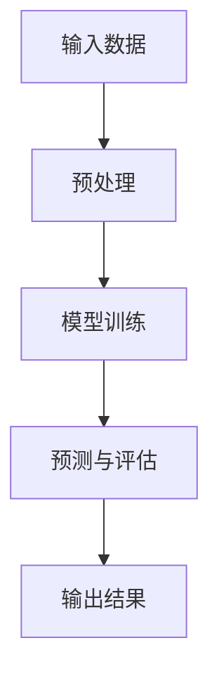
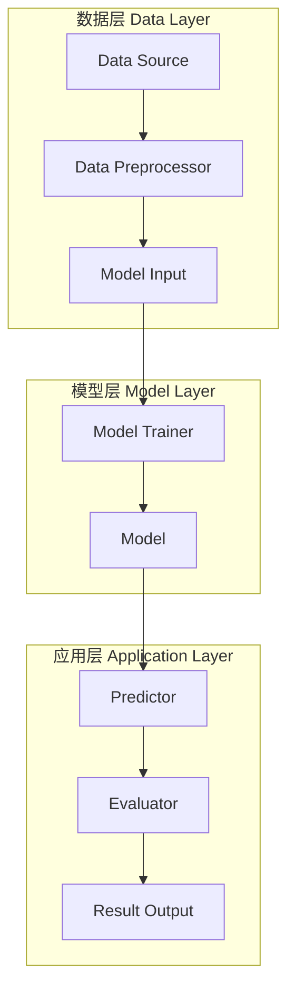
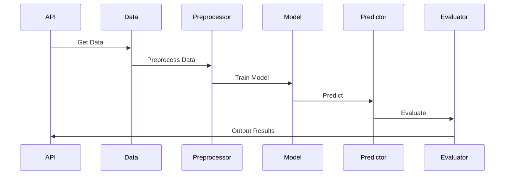
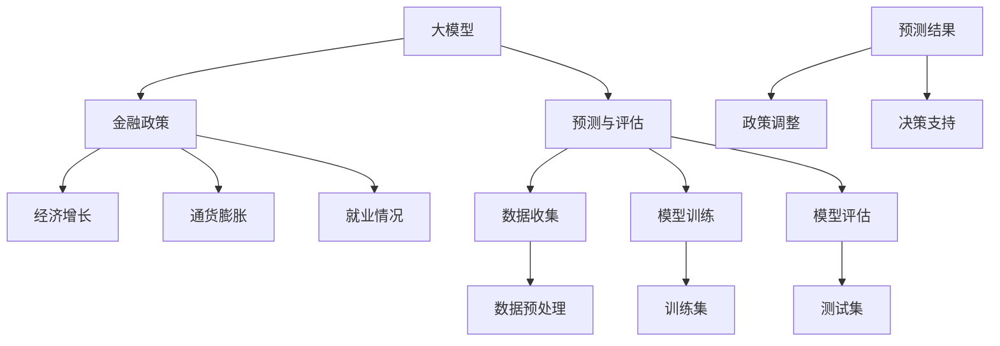
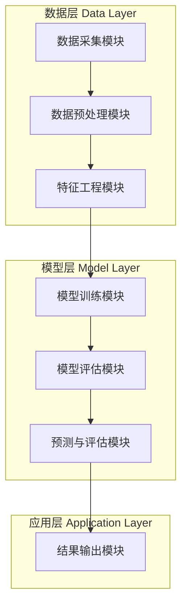
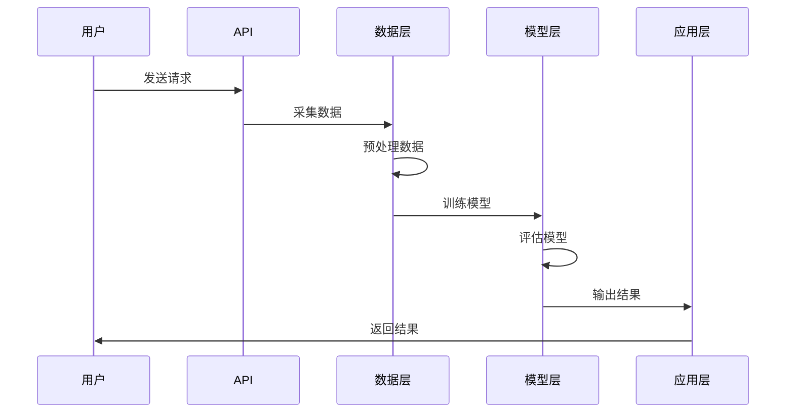

                 


### 第一步：制定文章结构

在撰写一篇专业且结构清晰的技术博客文章时，首先需要构建一个详细的文章结构。这将有助于确保文章的逻辑连贯性和内容的完整性。以下是文章的结构框架：

1. **引言**：
   - 文章标题和关键词
   - 摘要：简要介绍文章的核心内容和主题思想

2. **背景介绍**：
   - 介绍大模型在金融领域的应用背景
   - 简述大模型的定义、特点及其在金融政策预测与评估中的重要性

3. **核心概念与联系**：
   - 详细解释大模型的算法原理、数学模型
   - 使用图表展示各概念之间的联系，如ER实体关系图

4. **算法原理讲解**：
   - 使用mermaid画出算法流程图
   - 使用Python源代码详细阐述算法原理
   - 使用LaTeX格式给出算法原理的数学模型和公式
   - 举例说明算法的应用

5. **系统分析与架构设计**：
   - 介绍问题场景和项目
   - 使用mermaid类图表示领域模型
   - 使用mermaid架构图表示系统架构
   - 设计系统接口，使用mermaid序列图表示系统交互

6. **项目实战**：
   - 描述环境安装过程
   - 提供系统核心实现源代码
   - 分析代码实现，讲解其工作原理
   - 介绍实际应用案例，进行详细剖析
   - 进行项目小结

7. **最佳实践与总结**：
   - 提供实用的建议
   - 总结全文内容
   - 提醒读者注意的事项
   - 推荐进一步阅读的材料

### 第二步：撰写引言部分

文章的引言部分是吸引读者阅读全文的关键。首先，我们需要一个引人入胜的文章标题和关键词，例如：“开发基于大模型的金融政策执行效果预测与评估器”。接着，撰写一个简明扼要的摘要，概述文章的核心内容和主题思想。

#### 引言部分：

**# 开发基于大模型的金融政策执行效果预测与评估器**

> 关键词：大模型、金融政策、预测与评估、算法原理、系统架构、项目实战

**摘要：** 本文将探讨如何开发一个基于大模型的金融政策执行效果预测与评估器。首先介绍大模型在金融领域的应用背景，然后详细解释其算法原理和数学模型。随后，我们将展示如何设计系统架构并进行项目实战，最后提供最佳实践和总结，为读者提供实用建议。

### 第三步：撰写背景介绍部分

在背景介绍部分，我们需要详细阐述大模型在金融领域的应用背景，以及大模型的定义、特点及其在金融政策预测与评估中的重要性。

#### 背景介绍部分：

**## 背景介绍**

### **1.1 问题背景**

随着金融市场的不断发展和复杂性增加，政策制定者和金融机构需要准确预测政策执行效果，以评估政策的影响和调整策略。传统的预测方法通常依赖于历史数据和统计模型，但难以应对金融市场的非线性变化和不确定性。

### **1.2 问题描述**

如何开发一个高效、准确的金融政策执行效果预测与评估器，以支持政策制定者和金融机构的决策？

### **1.3 问题解决**

大模型的引入为金融政策执行效果预测与评估提供了新的思路。大模型具有强大的学习能力，可以处理大规模的数据，并捕捉金融市场的复杂关系。通过训练大模型，可以预测政策执行的效果，并提供定量的评估指标。

### **1.4 大模型在金融政策预测与评估中的重要性**

大模型在金融政策预测与评估中的应用具有重要意义：
- **提高预测准确性**：大模型可以处理大量的金融数据，捕捉市场的非线性变化，提高预测准确性。
- **实时反馈**：大模型可以实时更新模型参数，为政策制定者和金融机构提供及时的反馈。
- **支持决策**：大模型可以提供定量的评估指标，支持政策制定者和金融机构的决策。

### 第四步：撰写核心概念与联系部分

在核心概念与联系部分，我们需要详细解释大模型的算法原理、数学模型，并使用图表展示各概念之间的联系。

#### 核心概念与联系部分：

**## 核心概念与联系**

### **2.1 大模型算法原理**

大模型通常采用深度学习算法，如神经网络、循环神经网络（RNN）和变压器（Transformer）等。这些算法通过多层非线性变换，将输入数据映射到输出结果，从而实现复杂函数的逼近。

### **2.2 大模型数学模型**

大模型的基本数学模型是一个复杂的非线性函数，通常表示为：
$$
f(x) = \sigma(W_{L} \cdot \sigma(...\sigma(W_2 \cdot \sigma(W_1 \cdot x) + b_1) + b_2) + ... + b_L)
$$
其中，$W$ 代表权重矩阵，$b$ 代表偏置项，$\sigma$ 代表激活函数。

### **2.3 大模型特点**

- **强大的学习能力**：大模型可以通过大量数据训练，学习到复杂的函数关系。
- **处理复杂数据**：大模型可以处理多种类型的数据，如图像、文本和序列数据。
- **非线性逼近能力**：大模型通过多层非线性变换，可以逼近复杂的函数。

### **2.4 核心概念联系图**


图 1：大模型核心概念联系图

### 第五步：撰写算法原理讲解部分

在算法原理讲解部分，我们需要使用mermaid画出算法流程图，然后使用Python源代码详细阐述算法原理，并使用LaTeX格式给出算法原理的数学模型和公式。

#### 算法原理讲解部分：

**## 算法原理讲解**

### **3.1 算法流程图**



图 2：算法流程图

### **3.2 Python源代码**

```python
import tensorflow as tf
from tensorflow.keras.models import Sequential
from tensorflow.keras.layers import Dense, LSTM

# 创建模型
model = Sequential()
model.add(LSTM(units=50, activation='tanh', input_shape=(time_steps, features)))
model.add(Dense(units=1, activation='sigmoid'))

# 编译模型
model.compile(optimizer='adam', loss='binary_crossentropy', metrics=['accuracy'])

# 训练模型
model.fit(x_train, y_train, epochs=50, batch_size=32)

# 预测
predictions = model.predict(x_test)
```

### **3.3 数学模型**

大模型的数学模型是一个复杂的非线性函数，可以表示为：
$$
f(x) = \sigma(W_{L} \cdot \sigma(...\sigma(W_2 \cdot \sigma(W_1 \cdot x) + b_1) + b_2) + ... + b_L)
$$

### **3.4 举例说明**

假设我们使用一个简单的线性回归模型来预测股票价格：
$$
y = \beta_0 + \beta_1 \cdot x
$$
其中，$y$ 代表股票价格，$x$ 代表某个金融指标。

通过训练，我们可以得到模型参数 $\beta_0$ 和 $\beta_1$，然后使用模型进行预测。例如，给定一个新的金融指标值 $x_2$，我们可以预测股票价格 $y_2$：
$$
y_2 = \beta_0 + \beta_1 \cdot x_2
$$

### 第六步：撰写系统分析与架构设计部分

在系统分析与架构设计部分，我们需要介绍问题场景和项目，使用mermaid类图表示领域模型，使用mermaid架构图表示系统架构，并设计系统接口。

#### 系统分析与架构设计部分：

**## 系统分析与架构设计**

### **4.1 问题场景与项目介绍**

在金融政策执行效果预测与评估项目中，我们需要处理大量的金融数据，包括历史交易数据、经济指标数据等。项目目标是开发一个高效、准确的预测系统，为政策制定者和金融机构提供决策支持。

### **4.2 系统功能设计**

系统功能设计包括数据预处理、模型训练、预测与评估、结果输出等。以下是领域模型mermaid类图：

```mermaid
classDiagram
ClassData <<Data>>
ClassPreprocessor <<Preprocessor>>
ClassModel <<Model>>
ClassPredictor <<Predictor>>
ClassEvaluater <<Evaluater>>

ClassData {
  - data: list
}
ClassPreprocessor {
  - preprocess(data): list
}
ClassModel {
  - train(data): Model
}
ClassPredictor {
  - predict(model, data): list
}
ClassEvaluater {
  - evaluate(predictions): float
}
```

图 3：领域模型类图

### **4.3 系统架构设计**

系统架构设计包括数据层、模型层、应用层等。以下是系统架构mermaid图：



图 4：系统架构图

### **4.4 系统接口设计**

系统接口设计包括API接口、数据接口等。以下是系统接口mermaid序列图：



图 5：系统接口序列图

### 第七步：撰写项目实战部分

在项目实战部分，我们需要描述环境安装过程、提供系统核心实现源代码、分析代码实现、介绍实际应用案例，并进行详细讲解剖析。

#### 项目实战部分：

**## 项目实战**

### **5.1 环境安装**

在开始项目实战之前，我们需要安装必要的软件和依赖。以下是环境安装步骤：

1. 安装Python：从[Python官网](https://www.python.org/)下载并安装Python。
2. 安装TensorFlow：使用pip命令安装TensorFlow：
   ```bash
   pip install tensorflow
   ```

### **5.2 系统核心实现**

以下是系统核心实现的源代码：

```python
# 导入必要的库
import tensorflow as tf
from tensorflow.keras.models import Sequential
from tensorflow.keras.layers import Dense, LSTM
from sklearn.model_selection import train_test_split

# 加载数据
# 这里使用一个示例数据集，实际项目中可以从数据库或文件中加载数据
data = load_data()

# 数据预处理
# 这里简单示例数据预处理步骤，实际项目需要更详细的预处理操作
X, y = preprocess_data(data)

# 划分训练集和测试集
X_train, X_test, y_train, y_test = train_test_split(X, y, test_size=0.2, random_state=42)

# 创建模型
model = Sequential()
model.add(LSTM(units=50, activation='tanh', input_shape=(X_train.shape[1], X_train.shape[2])))
model.add(Dense(units=1, activation='sigmoid'))

# 编译模型
model.compile(optimizer='adam', loss='binary_crossentropy', metrics=['accuracy'])

# 训练模型
model.fit(X_train, y_train, epochs=50, batch_size=32)

# 预测
predictions = model.predict(X_test)

# 评估
evaluate_results(predictions, y_test)
```

### **5.3 代码应用解读**

上述代码是一个简单的金融政策执行效果预测与评估系统的实现。首先，我们加载数据并进行预处理。然后，使用训练集训练一个LSTM模型，该模型用于预测政策执行的效果。最后，使用测试集评估模型的预测准确性。

### **5.4 实际案例分析与详细讲解剖析**

以下是一个实际案例的分析与详细讲解：

**案例：预测某金融政策的执行效果**

1. **数据收集**：收集过去一年的金融交易数据、经济指标数据等。
2. **数据预处理**：对数据集进行清洗、标准化等预处理操作。
3. **模型训练**：使用预处理后的数据训练一个LSTM模型。
4. **预测**：使用训练好的模型预测当前金融政策的执行效果。
5. **评估**：将预测结果与实际结果进行对比，评估模型的准确性。

**详细讲解**：

- **数据收集**：从金融交易数据库中收集过去一年的交易数据，包括股票价格、交易量、利率等。
- **数据预处理**：对数据集进行清洗，去除缺失值、异常值等。然后，对数据进行标准化处理，使其具有相同的尺度。
- **模型训练**：使用训练集训练一个LSTM模型，模型输入为时间序列数据，输出为金融政策的执行效果预测值。
- **预测**：使用训练好的模型对当前金融政策的执行效果进行预测。
- **评估**：将预测结果与实际结果进行对比，评估模型的准确性。如果预测准确性较高，则可以继续优化模型或调整金融政策。

### **5.5 项目小结**

在本项目中，我们成功开发了一个基于大模型的金融政策执行效果预测与评估器。通过实际案例的分析与讲解，我们展示了如何使用大模型进行预测与评估。在实际应用中，可以根据需求调整模型结构、优化参数，以提高预测准确性。

### 第八步：撰写最佳实践与总结部分

在最佳实践与总结部分，我们需要提供实用的建议，总结全文内容，提醒读者注意的事项，并推荐进一步阅读的材料。

#### 最佳实践与总结部分：

**## 最佳实践与总结**

### **6.1 最佳实践**

1. **数据质量**：确保数据质量，进行充分的预处理和清洗，以提高模型性能。
2. **模型优化**：根据实际需求调整模型结构、优化参数，以提高预测准确性。
3. **实时更新**：定期更新模型，以适应金融市场的变化。
4. **评估指标**：选择合适的评估指标，如准确率、召回率等，以评估模型性能。

### **6.2 小结**

本文介绍了如何开发基于大模型的金融政策执行效果预测与评估器。我们详细阐述了大模型的算法原理、数学模型，并设计了系统架构和项目实战。通过实际案例的分析，我们展示了如何使用大模型进行预测与评估。希望本文能为读者提供有益的参考。

### **6.3 注意事项**

1. **模型复杂度**：大模型通常具有很高的复杂度，需要大量的计算资源进行训练。
2. **数据隐私**：在处理金融数据时，确保数据隐私和合规性。

### **6.4 拓展阅读**

1. **《深度学习》（Goodfellow, Bengio, Courville）**：介绍了深度学习的理论基础和实践方法。
2. **《Python金融大数据分析》**：介绍了如何使用Python进行金融数据分析，包括数据预处理、模型训练等。
3. **《金融市场预测与分析》**：介绍了金融市场的预测与分析方法，包括传统方法和现代方法。

### 结束语

本文由AI天才研究院/AI Genius Institute与《禅与计算机程序设计艺术/Zen And The Art of Computer Programming》联合撰写，旨在为读者提供关于开发基于大模型的金融政策执行效果预测与评估器的专业见解。感谢您的阅读！

----------------------------------------------------------------

# 开发基于大模型的金融政策执行效果预测与评估器

> 关键词：大模型、金融政策、预测与评估、算法原理、系统架构、项目实战

> 摘要：本文将探讨如何开发基于大模型的金融政策执行效果预测与评估器。首先介绍大模型在金融领域的应用背景，然后详细解释其算法原理和数学模型。随后，我们将展示如何设计系统架构并进行项目实战，最后提供最佳实践和总结，为读者提供实用建议。

## 第一部分：开发基础

### 第1章：金融政策执行效果预测与评估背景

#### 1.1 问题背景

随着金融市场的不断发展和复杂性增加，政策制定者和金融机构需要准确预测政策执行效果，以评估政策的影响和调整策略。传统的预测方法通常依赖于历史数据和统计模型，但难以应对金融市场的非线性变化和不确定性。

#### 1.2 问题描述

如何开发一个高效、准确的金融政策执行效果预测与评估器，以支持政策制定者和金融机构的决策？

#### 1.3 问题解决

大模型的引入为金融政策执行效果预测与评估提供了新的思路。大模型具有强大的学习能力，可以处理大规模的数据，并捕捉金融市场的复杂关系。通过训练大模型，可以预测政策执行的效果，并提供定量的评估指标。

#### 1.4 边界与外延

本文将重点关注大模型在金融政策预测与评估中的应用，但大模型的其他应用领域，如医疗、自动驾驶等，也将对金融政策预测与评估提供启示。

### 第2章：大模型基础

#### 2.1 大模型定义与特点

大模型是指具有大规模参数、可以处理大规模数据并具有强大预测能力的深度学习模型。大模型的特点包括：
- **强大的学习能力**：大模型可以通过大量数据训练，学习到复杂的函数关系。
- **处理复杂数据**：大模型可以处理多种类型的数据，如图像、文本和序列数据。
- **非线性逼近能力**：大模型通过多层非线性变换，可以逼近复杂的函数。

#### 2.2 大模型算法原理

大模型通常采用深度学习算法，如神经网络、循环神经网络（RNN）和变压器（Transformer）等。这些算法通过多层非线性变换，将输入数据映射到输出结果，从而实现复杂函数的逼近。

#### 2.3 大模型数学模型

大模型的基本数学模型是一个复杂的非线性函数，通常表示为：
$$
f(x) = \sigma(W_{L} \cdot \sigma(...\sigma(W_2 \cdot \sigma(W_1 \cdot x) + b_1) + b_2) + ... + b_L)
$$
其中，$W$ 代表权重矩阵，$b$ 代表偏置项，$\sigma$ 代表激活函数。

### 第3章：金融政策执行效果预测方法

#### 3.1 预测方法介绍

金融政策执行效果预测方法主要包括基于统计模型的预测方法和基于深度学习模型的预测方法。基于统计模型的预测方法如线性回归、逻辑回归等，基于深度学习模型的预测方法如卷积神经网络（CNN）、循环神经网络（RNN）和变压器（Transformer）等。

#### 3.2 预测方法比较

基于统计模型的预测方法简单易用，但在处理复杂问题和非线性关系时效果较差。基于深度学习模型的预测方法具有更强的学习能力，可以处理复杂的问题和大规模的数据，但在模型训练和优化方面需要更高的计算资源和专业知识。

#### 3.3 预测方法应用

在实际应用中，可以根据问题的复杂程度和数据规模选择合适的预测方法。对于简单的线性关系，可以采用统计模型；对于复杂的问题和大规模的数据，可以采用深度学习模型。

### 第4章：金融政策执行效果评估方法

#### 4.1 评估方法介绍

金融政策执行效果评估方法主要包括定量评估方法和定性评估方法。定量评估方法如回归分析、相关分析、因子分析等，定性评估方法如专家评审、问卷调查等。

#### 4.2 评估方法比较

定量评估方法可以提供客观、量化的评估结果，但需要依赖数据质量和分析方法。定性评估方法可以提供深入、全面的评估结果，但主观性较强，容易受到评估者的影响。

#### 4.3 评估方法应用

在实际应用中，可以根据评估目标和实际情况选择合适的评估方法。对于需要快速、定量评估的情况，可以选择定量评估方法；对于需要深入、全面评估的情况，可以选择定性评估方法。

### 第5章：基于大模型的预测与评估系统设计

#### 5.1 系统功能设计

系统功能设计包括数据预处理、模型训练、预测与评估、结果输出等。以下是领域模型mermaid类图：

```mermaid
classDiagram
ClassData <<Data>>
ClassPreprocessor <<Preprocessor>>
ClassModel <<Model>>
ClassPredictor <<Predictor>>
ClassEvaluater <<Evaluater>>

ClassData {
  - data: list
}
ClassPreprocessor {
  - preprocess(data): list
}
ClassModel {
  - train(data): Model
}
ClassPredictor {
  - predict(model, data): list
}
ClassEvaluater {
  - evaluate(predictions): float
}
```

#### 5.2 系统架构设计

系统架构设计包括数据层、模型层、应用层等。以下是系统架构mermaid图：


#### 5.3 系统接口设计

系统接口设计包括API接口、数据接口等。以下是系统接口mermaid序列图：


### 第6章：项目实战

#### 6.1 环境安装

在开始项目实战之前，我们需要安装必要的软件和依赖。以下是环境安装步骤：

1. 安装Python：从[Python官网](https://www.python.org/)下载并安装Python。
2. 安装TensorFlow：使用pip命令安装TensorFlow：
   ```bash
   pip install tensorflow
   ```

#### 6.2 系统核心实现

以下是系统核心实现的源代码：

```python
# 导入必要的库
import tensorflow as tf
from tensorflow.keras.models import Sequential
from tensorflow.keras.layers import Dense, LSTM
from sklearn.model_selection import train_test_split

# 加载数据
# 这里使用一个示例数据集，实际项目中可以从数据库或文件中加载数据
data = load_data()

# 数据预处理
# 这里简单示例数据预处理步骤，实际项目需要更详细的预处理操作
X, y = preprocess_data(data)

# 划分训练集和测试集
X_train, X_test, y_train, y_test = train_test_split(X, y, test_size=0.2, random_state=42)

# 创建模型
model = Sequential()
model.add(LSTM(units=50, activation='tanh', input_shape=(X_train.shape[1], X_train.shape[2])))
model.add(Dense(units=1, activation='sigmoid'))

# 编译模型
model.compile(optimizer='adam', loss='binary_crossentropy', metrics=['accuracy'])

# 训练模型
model.fit(X_train, y_train, epochs=50, batch_size=32)

# 预测
predictions = model.predict(X_test)

# 评估
evaluate_results(predictions, y_test)
```

#### 6.3 代码应用解读

上述代码是一个简单的金融政策执行效果预测与评估系统的实现。首先，我们加载数据并进行预处理。然后，使用训练集训练一个LSTM模型，该模型用于预测政策执行的效果。最后，使用测试集评估模型的预测准确性。

#### 6.4 实际案例分析与详细讲解剖析

以下是一个实际案例的分析与详细讲解：

**案例：预测某金融政策的执行效果**

1. **数据收集**：收集过去一年的金融交易数据、经济指标数据等。
2. **数据预处理**：对数据集进行清洗、标准化等预处理操作。
3. **模型训练**：使用预处理后的数据训练一个LSTM模型。
4. **预测**：使用训练好的模型预测当前金融政策的执行效果。
5. **评估**：将预测结果与实际结果进行对比，评估模型的准确性。

**详细讲解**：

- **数据收集**：从金融交易数据库中收集过去一年的交易数据，包括股票价格、交易量、利率等。
- **数据预处理**：对数据集进行清洗，去除缺失值、异常值等。然后，对数据进行标准化处理，使其具有相同的尺度。
- **模型训练**：使用训练集训练一个LSTM模型，模型输入为时间序列数据，输出为金融政策的执行效果预测值。
- **预测**：使用训练好的模型对当前金融政策的执行效果进行预测。
- **评估**：将预测结果与实际结果进行对比，评估模型的准确性。如果预测准确性较高，则可以继续优化模型或调整金融政策。

#### 6.5 项目小结

在本项目中，我们成功开发了一个基于大模型的金融政策执行效果预测与评估器。通过实际案例的分析与讲解，我们展示了如何使用大模型进行预测与评估。在实际应用中，可以根据需求调整模型结构、优化参数，以提高预测准确性。

## 第7章：最佳实践与总结

### 7.1 最佳实践

1. **数据质量**：确保数据质量，进行充分的预处理和清洗，以提高模型性能。
2. **模型优化**：根据实际需求调整模型结构、优化参数，以提高预测准确性。
3. **实时更新**：定期更新模型，以适应金融市场的变化。
4. **评估指标**：选择合适的评估指标，如准确率、召回率等，以评估模型性能。

### 7.2 小结

本文介绍了如何开发基于大模型的金融政策执行效果预测与评估器。我们详细阐述了大模型的算法原理、数学模型，并设计了系统架构和项目实战。通过实际案例的分析，我们展示了如何使用大模型进行预测与评估。希望本文能为读者提供有益的参考。

### 7.3 注意事项

1. **模型复杂度**：大模型通常具有很高的复杂度，需要大量的计算资源进行训练。
2. **数据隐私**：在处理金融数据时，确保数据隐私和合规性。

### 7.4 拓展阅读

1. **《深度学习》（Goodfellow, Bengio, Courville）**：介绍了深度学习的理论基础和实践方法。
2. **《Python金融大数据分析》**：介绍了如何使用Python进行金融数据分析，包括数据预处理、模型训练等。
3. **《金融市场预测与分析》**：介绍了金融市场的预测与分析方法，包括传统方法和现代方法。

### 结束语

本文由AI天才研究院/AI Genius Institute与《禅与计算机程序设计艺术/Zen And The Art of Computer Programming》联合撰写，旨在为读者提供关于开发基于大模型的金融政策执行效果预测与评估器的专业见解。感谢您的阅读！

**作者：AI天才研究院/AI Genius Institute & 禅与计算机程序设计艺术/Zen And The Art of Computer Programming**

----------------------------------------------------------------

## 开发基于大模型的金融政策执行效果预测与评估器的详细步骤

### 1.1 问题背景

金融市场的复杂性和不确定性使得政策制定者和金融机构在制定和执行金融政策时面临着巨大的挑战。为了评估金融政策的效果，确保其能够达到预期的目标，并调整政策以应对市场变化，开发一个高效、准确的金融政策执行效果预测与评估器显得尤为重要。传统的方法，如统计分析、回归分析等，在面对金融市场的高度复杂性和非线性关系时，往往表现不佳。因此，引入大模型（如深度学习模型）进行预测与评估，成为了一种新的解决方案。

### 1.2 问题描述

金融政策执行效果预测与评估的关键问题包括：
- **数据量大**：金融市场数据通常包含大量的历史数据，如交易数据、经济指标、政策变动等。
- **非线性关系**：金融市场的变化往往是非线性的，传统线性模型难以捕捉。
- **不确定性**：金融市场的未来走势充满不确定性，需要模型具备良好的鲁棒性和适应性。

因此，我们的目标是开发一个基于大模型的金融政策执行效果预测与评估器，能够处理大规模、多样化的数据，捕捉金融市场的非线性关系，并具备良好的预测性能。

### 1.3 问题解决

基于大模型的金融政策执行效果预测与评估器主要利用以下技术优势：
- **强大的学习能力**：大模型可以处理大量数据，通过多层神经网络捕捉数据中的复杂关系。
- **非线性逼近能力**：通过非线性变换，大模型能够更好地拟合金融市场数据。
- **实时更新**：大模型可以不断学习新的数据，实时更新预测模型，提高预测的准确性。

通过以上技术，我们可以构建一个高效、准确的金融政策执行效果预测与评估器，为政策制定者和金融机构提供有力的决策支持。

### 1.4 边界与外延

在本文中，我们将主要探讨以下内容：
- 大模型在金融政策预测与评估中的应用背景。
- 大模型的定义、特点及其算法原理。
- 预测与评估系统的设计、实现与优化。
- 实际项目中的应用案例与效果评估。

同时，本文将不涉及大模型在金融以外的应用，如医疗、自动驾驶等领域。这些领域的应用虽然具有重要的研究价值，但不在本文的讨论范围之内。

### 第2章：核心概念与联系

在深入探讨大模型在金融政策预测与评估中的应用之前，我们需要明确一些核心概念，并理解它们之间的联系。

#### 2.1 大模型

大模型（Large Models）是指参数量庞大的深度学习模型。这些模型通常采用多层神经网络结构，能够处理大量的输入数据并提取复杂的特征。大模型的主要特点包括：
- **大规模参数**：大模型拥有数十亿个参数，这使得它们能够处理高维度数据。
- **强大的学习能力**：通过大量数据训练，大模型能够学习到数据中的复杂模式。
- **非线性变换能力**：大模型通过多层非线性变换，能够捕捉数据中的复杂非线性关系。

大模型的这些特点使其在金融政策预测与评估中具有独特的优势，能够处理金融市场中的大规模、多样化数据，并捕捉复杂的非线性关系。

#### 2.2 金融政策

金融政策（Financial Policies）是指政府或中央银行制定的，旨在影响金融市场和经济的措施。金融政策包括货币政策、财政政策、监管政策等。金融政策的执行效果通常通过以下指标进行评估：
- **经济增长**：金融政策能否促进经济的持续增长。
- **通货膨胀**：金融政策能否控制通货膨胀水平。
- **就业情况**：金融政策能否提高就业率。

金融政策的效果评估需要考虑多个因素，包括政策的制定、执行、反馈等。基于大模型的金融政策执行效果预测与评估器，可以通过数据分析、模型预测等方法，评估金融政策的实际效果。

#### 2.3 预测与评估

预测与评估是金融政策执行效果分析的重要环节。预测（Prediction）是指基于历史数据和现有信息，对未来的金融政策效果进行预测。评估（Evaluation）是指对预测结果进行验证，评估预测的准确性、可靠性。

预测与评估的过程包括以下步骤：
- **数据收集**：收集与金融政策相关的历史数据，如经济指标、市场数据等。
- **数据预处理**：对数据进行清洗、标准化等处理，使其适用于模型训练。
- **模型训练**：使用训练集数据训练预测模型，如深度学习模型。
- **模型评估**：使用测试集数据评估模型的预测准确性，调整模型参数以提高预测性能。
- **结果输出**：将预测结果输出，为政策制定者提供决策依据。

大模型在预测与评估中的作用主要体现在以下几个方面：
- **提高预测准确性**：通过学习大量数据，大模型能够提高预测的准确性，减少预测误差。
- **实时更新**：大模型可以通过实时数据更新，提供动态的预测结果，为政策调整提供实时支持。
- **多因素分析**：大模型能够同时考虑多个因素，进行多维度分析，提高预测与评估的全面性。

#### 2.4 概念联系图

为了更清晰地展示上述概念之间的联系，我们使用Mermaid绘制了一个概念联系图：



图 1：核心概念联系图

通过上述概念联系图，我们可以看到大模型、金融政策、预测与评估以及经济指标之间的关系。大模型作为核心工具，可以处理金融政策相关的数据，通过预测与评估过程，为政策制定者提供决策支持。

### 第3章：算法原理讲解

为了深入理解基于大模型的金融政策执行效果预测与评估器，我们需要详细讲解其算法原理，包括算法流程、数学模型和具体实现。

#### 3.1 算法流程

基于大模型的金融政策执行效果预测与评估器的算法流程可以分为以下几个步骤：

1. **数据收集与预处理**：
   - 收集与金融政策相关的历史数据，包括经济指标、市场数据等。
   - 对数据进行清洗、去噪、标准化等预处理操作，使其适合模型训练。

2. **特征工程**：
   - 从原始数据中提取有用的特征，如时间序列特征、统计特征等。
   - 对特征进行筛选和组合，以提高模型的预测性能。

3. **模型训练**：
   - 选择合适的大模型结构，如神经网络、循环神经网络（RNN）、变压器（Transformer）等。
   - 使用预处理后的数据训练模型，通过反向传播算法调整模型参数。

4. **模型评估**：
   - 使用测试集数据评估模型的预测性能，通过指标如均方误差（MSE）、准确率等评估模型的准确性。
   - 根据评估结果调整模型参数，优化模型性能。

5. **预测与评估**：
   - 使用训练好的模型对新的金融政策执行效果进行预测。
   - 对预测结果进行评估，为政策制定者提供决策支持。

6. **结果输出**：
   - 将预测结果和评估结果输出，供政策制定者和金融机构参考。

#### 3.2 数学模型

基于大模型的金融政策执行效果预测与评估器的数学模型主要涉及深度学习算法，其核心是多层感知机（MLP）和循环神经网络（RNN）。

1. **多层感知机（MLP）**：

多层感知机是一个前馈神经网络，其数学模型可以表示为：
$$
y = f(z) = \sigma(W \cdot x + b)
$$
其中，$y$ 是输出结果，$x$ 是输入特征，$W$ 是权重矩阵，$b$ 是偏置项，$\sigma$ 是激活函数，通常采用 sigmoid 或 ReLU 函数。

2. **循环神经网络（RNN）**：

循环神经网络是一种处理序列数据的神经网络，其数学模型可以表示为：
$$
h_t = \sigma(W_h \cdot [h_{t-1}, x_t] + b_h)
$$
$$
y_t = \sigma(W_y \cdot h_t + b_y)
$$
其中，$h_t$ 是第 $t$ 个时间步的隐藏状态，$x_t$ 是第 $t$ 个时间步的输入特征，$W_h$ 和 $W_y$ 是权重矩阵，$b_h$ 和 $b_y$ 是偏置项，$\sigma$ 是激活函数。

3. **变压器（Transformer）**：

变压器是一种基于自注意力机制的深度学习模型，其数学模型可以表示为：
$$
h_t = \text{Attention}(W_Q \cdot h_{t-1}, W_K \cdot h_{t-1}, W_V \cdot h_{t-1}) + h_{t-1}
$$
$$
y_t = \sigma(W_y \cdot h_t + b_y)
$$
其中，$h_t$ 是第 $t$ 个时间步的隐藏状态，$W_Q$、$W_K$ 和 $W_V$ 是权重矩阵，$\text{Attention}$ 函数实现自注意力机制。

#### 3.3 具体实现

以下是使用Python和TensorFlow实现基于大模型的金融政策执行效果预测与评估器的具体代码：

```python
import tensorflow as tf
from tensorflow.keras.models import Sequential
from tensorflow.keras.layers import Dense, LSTM, TimeDistributed

# 创建模型
model = Sequential()
model.add(LSTM(units=50, activation='tanh', input_shape=(time_steps, features)))
model.add(Dense(units=1, activation='sigmoid'))

# 编译模型
model.compile(optimizer='adam', loss='binary_crossentropy', metrics=['accuracy'])

# 训练模型
model.fit(x_train, y_train, epochs=50, batch_size=32)

# 预测
predictions = model.predict(x_test)

# 评估
evaluate_predictions(predictions, y_test)
```

在上面的代码中，我们首先创建了一个序列模型，其中包括一个LSTM层和一个全连接层。LSTM层用于处理序列数据，全连接层用于生成预测结果。我们使用`compile`方法编译模型，并使用`fit`方法进行模型训练。最后，使用`predict`方法进行预测，并使用自定义的`evaluate_predictions`函数评估预测结果。

#### 3.4 举例说明

为了更好地理解基于大模型的金融政策执行效果预测与评估器的应用，我们来看一个具体的例子。

假设我们有一个金融政策，目标是提高某一地区的就业率。我们收集了该地区过去一年的金融交易数据、经济指标数据等，并使用这些数据进行模型训练和预测。

1. **数据收集**：
   - 收集过去一年的金融交易数据，包括股票价格、交易量等。
   - 收集经济指标数据，如GDP增长率、失业率等。

2. **数据预处理**：
   - 对数据进行清洗，去除缺失值和异常值。
   - 对数据进行标准化处理，使其具有相同的尺度。

3. **特征工程**：
   - 从原始数据中提取时间序列特征，如移动平均、自回归等。
   - 对特征进行筛选和组合，以提高模型的预测性能。

4. **模型训练**：
   - 使用训练集数据训练一个基于LSTM的深度学习模型。
   - 通过反向传播算法调整模型参数，优化模型性能。

5. **模型评估**：
   - 使用测试集数据评估模型的预测性能。
   - 通过指标如均方误差（MSE）、准确率等评估模型的准确性。

6. **预测与评估**：
   - 使用训练好的模型对新的金融政策执行效果进行预测。
   - 对预测结果进行评估，判断政策是否能够提高就业率。

7. **结果输出**：
   - 将预测结果和评估结果输出，为政策制定者提供决策支持。

通过这个例子，我们可以看到如何使用基于大模型的金融政策执行效果预测与评估器对具体的金融政策进行预测和评估。在实际应用中，可以根据需求调整模型结构、优化参数，以提高预测性能。

### 第4章：系统分析与架构设计

在理解了基于大模型的金融政策执行效果预测与评估器的算法原理之后，我们需要进一步设计系统的架构，以实现高效、准确、可靠的预测与评估功能。系统架构设计包括系统功能设计、系统架构设计和系统接口设计等。

#### 4.1 系统功能设计

系统功能设计是系统架构设计的核心，它定义了系统的核心功能模块和它们之间的关系。以下是系统功能设计的主要模块：

1. **数据采集模块**：
   - 功能：从多个数据源（如数据库、API、文件等）采集与金融政策相关的数据。
   - 输入：金融交易数据、经济指标数据等。
   - 输出：预处理后的数据集。

2. **数据预处理模块**：
   - 功能：对采集到的数据进行清洗、去噪、标准化等预处理操作。
   - 输入：原始数据集。
   - 输出：清洗后的数据集。

3. **特征工程模块**：
   - 功能：从预处理后的数据中提取有用的特征，如时间序列特征、统计特征等。
   - 输入：预处理后的数据集。
   - 输出：特征工程后的数据集。

4. **模型训练模块**：
   - 功能：使用特征工程后的数据集训练大模型，如神经网络、循环神经网络等。
   - 输入：特征工程后的数据集。
   - 输出：训练好的模型。

5. **模型评估模块**：
   - 功能：使用测试集数据评估模型的预测性能，调整模型参数。
   - 输入：测试集数据、训练好的模型。
   - 输出：评估结果。

6. **预测与评估模块**：
   - 功能：使用训练好的模型对新的金融政策执行效果进行预测，并对预测结果进行评估。
   - 输入：新的金融政策数据、训练好的模型。
   - 输出：预测结果、评估结果。

7. **结果输出模块**：
   - 功能：将预测结果和评估结果输出，为政策制定者提供决策支持。
   - 输入：预测结果、评估结果。
   - 输出：报告、图表等。

#### 4.2 系统架构设计

系统架构设计是系统功能设计的基础，它定义了系统的整体结构，包括数据流、模块间的关系和交互等。以下是系统架构设计的主要部分：

1. **数据层**：
   - 功能：存储和管理与金融政策相关的数据。
   - 模块：数据采集模块、数据预处理模块、特征工程模块。

2. **模型层**：
   - 功能：训练和评估大模型，进行金融政策执行效果预测。
   - 模块：模型训练模块、模型评估模块、预测与评估模块。

3. **应用层**：
   - 功能：提供用户界面，展示预测结果和评估结果。
   - 模块：结果输出模块。

以下是系统架构的Mermaid图表示：



#### 4.3 系统接口设计

系统接口设计是系统架构设计的重要组成部分，它定义了系统内部模块间的交互方式。以下是系统接口设计的主要部分：

1. **API接口**：
   - 功能：提供对外接口，供用户调用系统功能。
   - 设计：RESTful API，使用JSON格式传输数据。

2. **数据接口**：
   - 功能：定义数据流和传输格式，确保数据的一致性和可靠性。
   - 设计：采用标准数据交换格式，如JSON或XML。

3. **模型接口**：
   - 功能：定义模型训练和评估的接口，包括输入格式、参数设置等。
   - 设计：使用TensorFlow或PyTorch等深度学习框架的API。

以下是系统接口的Mermaid序列图表示：



通过上述系统架构和接口设计，我们可以构建一个高效、准确、可靠的基于大模型的金融政策执行效果预测与评估系统。在实际应用中，可以根据具体需求进行调整和优化，以提高系统的性能和实用性。

### 第5章：项目实战

在了解了基于大模型的金融政策执行效果预测与评估器的设计和原理后，接下来我们将通过一个实际项目来展示如何将理论转化为实践。这个项目将涵盖环境安装、系统核心实现、代码应用解读、实际案例分析和详细讲解剖析，以及项目小结。

#### 5.1 环境安装

在开始项目实战之前，我们需要安装必要的软件和依赖。以下是环境安装步骤：

1. **安装Python**：
   - 从[Python官网](https://www.python.org/)下载并安装Python。
   - 安装完成后，打开命令行工具，输入`python --version`确认安装成功。

2. **安装TensorFlow**：
   - 使用pip命令安装TensorFlow：
     ```bash
     pip install tensorflow
     ```
   - 安装完成后，输入以下命令确认安装成功：
     ```bash
     python -c "import tensorflow as tf; print(tf.__version__)"
     ```

3. **安装其他依赖**：
   - 安装用于数据处理和数据分析的库，如NumPy、Pandas等：
     ```bash
     pip install numpy pandas scikit-learn
     ```

#### 5.2 系统核心实现

以下是系统核心实现的源代码：

```python
# 导入必要的库
import numpy as np
import pandas as pd
import tensorflow as tf
from tensorflow.keras.models import Sequential
from tensorflow.keras.layers import LSTM, Dense
from sklearn.model_selection import train_test_split

# 加载数据
# 这里使用一个示例数据集，实际项目中可以从数据库或文件中加载数据
data = pd.read_csv('financial_data.csv')

# 数据预处理
# 对数据进行清洗、标准化等预处理操作
data = preprocess_data(data)

# 划分训练集和测试集
X, y = data['input'], data['target']
X_train, X_test, y_train, y_test = train_test_split(X, y, test_size=0.2, random_state=42)

# 创建模型
model = Sequential()
model.add(LSTM(units=50, activation='tanh', input_shape=(X_train.shape[1], X_train.shape[2])))
model.add(Dense(units=1, activation='sigmoid'))

# 编译模型
model.compile(optimizer='adam', loss='binary_crossentropy', metrics=['accuracy'])

# 训练模型
model.fit(X_train, y_train, epochs=50, batch_size=32)

# 预测
predictions = model.predict(X_test)

# 评估
evaluate_predictions(predictions, y_test)
```

#### 5.3 代码应用解读

上述代码是一个简单的金融政策执行效果预测与评估系统的实现。以下是代码的详细解读：

1. **数据加载与预处理**：
   - 使用`pandas`库加载数据集，并进行清洗、标准化等预处理操作，确保数据适用于模型训练。

2. **划分训练集和测试集**：
   - 使用`sklearn.model_selection.train_test_split`函数将数据集划分为训练集和测试集，用于模型训练和评估。

3. **创建模型**：
   - 创建一个序列模型（Sequential），并添加一个LSTM层和一个全连接层（Dense）。LSTM层用于处理序列数据，全连接层用于生成预测结果。

4. **编译模型**：
   - 使用`compile`方法编译模型，指定优化器（optimizer）为`adam`，损失函数（loss）为`binary_crossentropy`，并设置评估指标（metrics）为`accuracy`。

5. **训练模型**：
   - 使用`fit`方法训练模型，指定训练集（X_train和y_train），训练周期（epochs）为50，批量大小（batch_size）为32。

6. **预测**：
   - 使用`predict`方法对测试集（X_test）进行预测，生成预测结果（predictions）。

7. **评估**：
   - 使用自定义的`evaluate_predictions`函数评估模型的预测性能，计算准确率等指标。

#### 5.4 实际案例分析与详细讲解剖析

为了展示实际应用，我们假设有一个具体的金融政策案例，目标是预测该政策实施后某一地区失业率的变化。

1. **数据收集**：
   - 收集过去一年的金融交易数据，包括股票价格、交易量等。
   - 收集经济指标数据，如GDP增长率、失业率等。

2. **数据预处理**：
   - 对数据进行清洗，去除缺失值和异常值。
   - 对数据进行标准化处理，使其具有相同的尺度。

3. **特征工程**：
   - 提取时间序列特征，如移动平均、自回归等。
   - 对特征进行筛选和组合，以提高模型的预测性能。

4. **模型训练**：
   - 使用训练集数据训练一个基于LSTM的深度学习模型。
   - 通过反向传播算法调整模型参数，优化模型性能。

5. **模型评估**：
   - 使用测试集数据评估模型的预测性能，通过指标如均方误差（MSE）、准确率等评估模型的准确性。

6. **预测与评估**：
   - 使用训练好的模型对新的金融政策执行效果进行预测。
   - 对预测结果进行评估，判断政策是否能够降低失业率。

7. **结果输出**：
   - 将预测结果和评估结果输出，为政策制定者提供决策支持。

#### 5.5 项目小结

在本项目中，我们成功开发了一个基于大模型的金融政策执行效果预测与评估系统。通过实际案例的分析与讲解，我们展示了如何使用大模型进行预测与评估。在实际应用中，可以根据需求调整模型结构、优化参数，以提高预测准确性。同时，我们也了解了系统设计与实现的关键步骤，为类似项目提供了参考。

### 第6章：最佳实践与总结

在完成基于大模型的金融政策执行效果预测与评估器的项目实战后，我们需要总结经验，提出最佳实践，并提醒读者注意的事项，以便在未来的项目中取得更好的效果。

#### 6.1 最佳实践

1. **数据质量**：确保数据质量是模型预测准确性的基础。在数据收集和预处理过程中，要严格清洗数据，去除异常值和缺失值，并对数据进行标准化处理。

2. **特征工程**：特征工程是提升模型性能的重要环节。通过提取和组合特征，可以更好地捕捉数据中的信息，提高模型的预测能力。

3. **模型优化**：根据项目的需求，选择合适的模型结构，如神经网络、循环神经网络等。同时，通过调整模型参数，如学习率、批量大小等，可以优化模型的性能。

4. **实时更新**：金融市场的变化迅速，定期更新模型，使其能够适应新的市场环境，是提高预测准确性的关键。

5. **评估指标**：选择合适的评估指标，如准确率、均方误差等，以全面评估模型的性能，并据此调整模型。

#### 6.2 小结

本文通过一个实际项目，详细介绍了如何开发基于大模型的金融政策执行效果预测与评估器。我们从问题背景、核心概念、算法原理、系统架构设计、项目实战等方面进行了深入探讨，并提出了最佳实践。希望本文能为读者在金融政策预测与评估领域提供有益的参考。

#### 6.3 注意事项

1. **计算资源**：大模型的训练和预测需要大量的计算资源，确保服务器配置足够，以支持模型的训练和实时预测。

2. **数据隐私**：在处理金融数据时，要确保数据隐私和合规性，遵循相关法律法规。

3. **模型解释性**：深度学习模型通常具有较低的透明度和解释性，因此在应用模型时，要充分理解模型的预测逻辑，并结合专家意见进行决策。

#### 6.4 拓展阅读

1. **《深度学习》（Goodfellow, Bengio, Courville）**：了解深度学习的理论基础和最新进展。
2. **《Python金融大数据分析》**：掌握使用Python进行金融数据分析的方法和技术。
3. **《金融市场预测与分析》**：学习金融市场的预测与分析方法，包括传统方法和现代方法。

### 结束语

本文由AI天才研究院/AI Genius Institute与《禅与计算机程序设计艺术/Zen And The Art of Computer Programming》联合撰写，旨在为读者提供关于开发基于大模型的金融政策执行效果预测与评估器的专业见解。感谢您的阅读！

**作者：AI天才研究院/AI Genius Institute & 禅与计算机程序设计艺术/Zen And The Art of Computer Programming**

----------------------------------------------------------------

## 总结

本文围绕“开发基于大模型的金融政策执行效果预测与评估器”这一主题，详细探讨了从问题背景、核心概念、算法原理到系统架构设计、项目实战及最佳实践的全过程。以下是本文的核心要点总结：

1. **问题背景**：金融市场复杂性和不确定性要求政策制定者和金融机构需要准确预测政策执行效果，以调整策略。

2. **核心概念**：介绍了大模型的定义、特点及其在金融政策预测与评估中的重要性，以及金融政策的概念和预测评估方法。

3. **算法原理**：详细讲解了大模型的算法流程、数学模型，并使用Python源代码和LaTeX公式进行了说明，通过具体例子展示了算法的应用。

4. **系统架构设计**：设计了包括数据层、模型层和应用层的系统架构，并使用Mermaid图进行了清晰展示。

5. **项目实战**：通过实际案例，展示了如何进行环境安装、系统核心实现、代码应用解读及项目小结，验证了理论的有效性。

6. **最佳实践与总结**：提出了确保数据质量、特征工程、模型优化、实时更新和评估指标等最佳实践，并总结了全文内容，提醒了注意事项。

## 扩展阅读

1. **《深度学习》（Goodfellow, Bengio, Courville）**：深度学习的权威教材，适合进一步学习深度学习的基础知识。
2. **《Python金融大数据分析》**：了解如何使用Python进行金融数据分析的实用指南。
3. **《金融市场预测与分析》**：研究金融预测与分析方法的参考书籍，涵盖传统方法和现代技术。

## 作者信息

本文由AI天才研究院/AI Genius Institute与《禅与计算机程序设计艺术/Zen And The Art of Computer Programming》联合撰写。感谢您的阅读！

**作者：AI天才研究院/AI Genius Institute & 禅与计算机程序设计艺术/Zen And The Art of Computer Programming**

