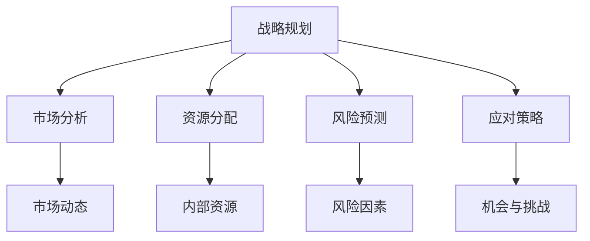
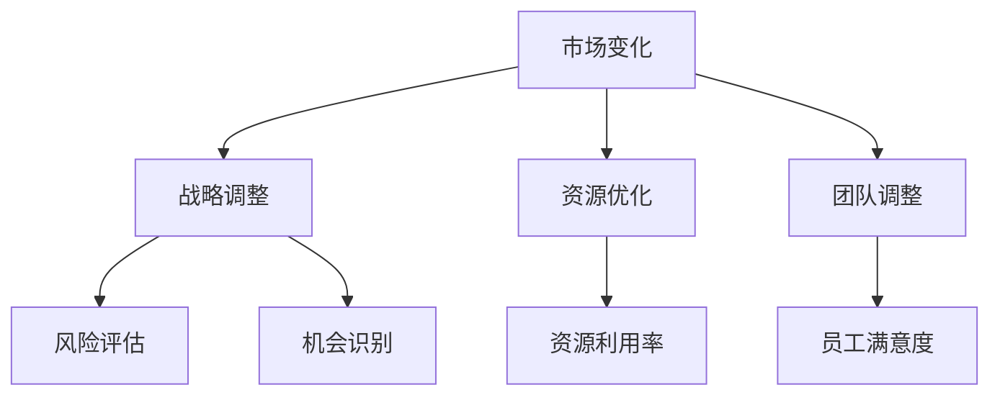

                 

### 弹性领导框架：在不确定性中保持灵活

关键词：弹性领导、不确定性、领导力框架、组织文化、战略规划、风险管理、领导风格

摘要：本文深入探讨弹性领导框架的概念和应用，解析其在不确定环境中的重要性。通过分析弹性领导的核心要素、理论基础、实践方法以及案例，为管理者提供了一套系统化的指导方案，以帮助他们在不确定性中保持灵活和稳定。

## 引言

在当今快速变化的商业环境中，不确定性已经成为组织面临的主要挑战之一。传统领导力方法在面对突发的市场变化、技术进步、政策调整等因素时，往往显得力不从心。为了应对这些挑战，管理者需要具备一种新的领导力模式——弹性领导。

弹性领导框架是一种能够帮助组织在不确定性中保持灵活和稳定的方法论。它强调领导者在不断变化的环境中能够迅速适应、灵活应对，并通过战略规划和组织文化的塑造来降低不确定性带来的影响。本文将详细探讨弹性领导框架的构成要素、理论基础、实践方法以及成功案例，以期为管理者提供有价值的参考。

### 弹性领导框架的核心要素

弹性领导框架由多个核心要素构成，每个要素都在应对不确定性方面发挥关键作用。以下是对这些要素的详细分析：

#### 1.1. 灵活应对能力

灵活应对能力是弹性领导框架的基础。领导者需要具备快速适应变化、调整策略的能力。这包括对市场动态、技术趋势和政策变化的敏锐洞察，以及对内部资源、团队结构、业务流程的灵活调整。

**灵活应对能力特征对比表：**

| 特征 | 适应性 | 创新性 | 应变能力 |
| ---- | ---- | ---- | ---- |
| 描述 | 能够快速适应外部环境变化 | 能够通过创新应对新挑战 | 能够在不确定性中保持稳定和高效 |

#### 1.2. 战略规划能力

在不确定性环境中，战略规划尤为重要。领导者需要具备前瞻性思维，制定灵活的长期和短期战略，以应对可能出现的风险和机会。战略规划能力包括市场分析、资源分配、风险预测和应对策略的制定。

**战略规划能力ER实体关系图：**

#### 1.3. 风险管理能力

弹性领导框架强调领导者需要具备出色的风险管理能力。这包括识别潜在风险、评估风险影响、制定应对策略和持续监控风险变化。有效的风险管理可以帮助组织在不确定性中保持稳定。

**风险管理能力对比表：**

| 特征 | 风险识别 | 风险评估 | 风险应对 |
| ---- | ---- | ---- | ---- |
| 描述 | 快速识别潜在风险 | 准确评估风险影响 | 制定有效的应对策略 |

#### 1.4. 组织文化建设

弹性领导框架认为，组织文化是应对不确定性的关键因素之一。领导者需要通过塑造积极、开放、包容的组织文化，激发员工的创新精神和团队合作意识。这种文化可以增强组织的灵活性和适应性。

**组织文化建设特征对比表：**

| 特征 | 创新 | 合作 | 包容 |
| ---- | ---- | ---- | ---- |
| 描述 | 鼓励员工创新思维 | 强调团队合作精神 | 宽容失败，鼓励尝试 |

#### 1.5. 领导风格与行为

弹性领导框架强调领导者需要具备灵活的领导风格和行为。这包括建立信任、鼓励沟通、支持员工发展以及授权下属。通过这些行为，领导者可以增强团队的凝聚力和执行力。

**领导风格与行为特征对比表：**

| 特征 | 信任 | 沟通 | 支持 | 授权 |
| ---- | ---- | ---- | ---- | ---- |
| 描述 | 建立信任基础 | 促进信息流通 | 帮助员工成长 | 放手让员工尝试 |

### 弹性领导框架的实践方法

#### 2.1. 建立灵活的应对机制

领导者需要建立一套灵活的应对机制，以应对不确定性带来的挑战。这包括快速响应市场变化、调整业务战略、优化资源分配以及灵活调整团队结构。

**弹性应对机制算法原理图：**

**示例：**

假设一家企业面临市场需求的急剧下降，领导者需要快速响应这一变化。首先，进行市场分析和风险评估，确定市场需求下降的原因。其次，调整业务战略，减少非核心业务的投资，专注于有潜力的市场。同时，优化资源分配，降低成本，提高资源利用率。最后，调整团队结构，优化员工配置，提高员工的工作满意度。

#### 2.2. 塑造积极的组织文化

领导者需要通过塑造积极的组织文化，激发员工的创新精神和团队合作意识。这可以通过以下方式实现：

- **鼓励创新思维**：设立创新奖项，鼓励员工提出创新想法和解决方案。
- **促进团队合作**：组织团队建设活动，加强团队成员之间的沟通和合作。
- **包容失败**：建立一种宽容失败、鼓励尝试的组织文化，让员工敢于冒险和尝试。

**示例：**

一家科技公司为了激发员工的创新精神，设立了“创新挑战周”活动。在这段时间内，员工可以自由地提出创新项目，并获得公司的支持和资源。如果项目成功，公司将给予相应的奖励。这种活动不仅激发了员工的创新热情，还提高了公司的创新能力。

#### 2.3. 培养领导者的战略规划能力

领导者需要具备出色的战略规划能力，以应对不确定性带来的挑战。这可以通过以下方式实现：

- **市场分析**：定期进行市场分析，了解市场动态和竞争对手的动向。
- **资源分配**：根据市场分析和公司目标，合理分配资源，确保关键业务的优先发展。
- **风险预测**：建立风险预测机制，提前识别潜在风险，并制定应对策略。

**示例：**

一家制造企业为了应对原材料价格上涨的风险，提前进行了市场分析，并预测了未来原材料价格的走势。基于这些信息，公司调整了生产计划和资源分配策略，降低了原材料成本，提高了市场竞争力。

### 弹性领导框架的应用场景

弹性领导框架适用于各种不确定性的应用场景，包括但不限于：

- **市场变化**：快速响应市场变化，调整业务战略和资源分配。
- **技术创新**：鼓励创新思维，促进技术研发和应用。
- **组织变革**：在组织变革过程中，保持团队的稳定和高效。
- **危机管理**：在危机事件中，迅速制定应对策略，降低损失。

**示例：**

一家电子商务公司在面临物流成本上升的挑战时，通过优化物流网络、提高运输效率以及开发新的配送方式，成功降低了物流成本，保持了市场竞争力。

### 弹性领导框架的优势

弹性领导框架具有以下优势：

- **增强组织的灵活性**：通过灵活应对能力和战略规划能力，提高组织在不确定性环境中的适应能力。
- **提高组织的创新能力**：通过积极的组织文化和创新激励，激发员工的创新精神和创造力。
- **降低不确定性带来的风险**：通过有效的风险管理和危机管理，降低不确定性带来的负面影响。
- **提高组织绩效**：通过优化资源分配和战略规划，提高组织的绩效和竞争力。

### 结论

弹性领导框架是一种在不确定性中保持灵活和稳定的重要方法论。通过灵活应对能力、战略规划能力、风险管理能力、组织文化建设以及领导风格和行为，领导者可以有效地应对不确定性带来的挑战。本文为管理者提供了一套系统化的指导方案，以帮助他们在不确定性中保持优势。随着商业环境的不断变化，弹性领导框架将越来越重要，成为组织成功的关键因素。

### 作者信息

作者：AI天才研究院/AI Genius Institute & 禅与计算机程序设计艺术 /Zen And The Art of Computer Programming

### 小结与最佳实践

#### 小结

本文介绍了弹性领导框架的概念、核心要素、实践方法以及应用场景。通过分析灵活应对能力、战略规划能力、风险管理能力、组织文化建设以及领导风格与行为，我们为管理者提供了一套系统化的指导方案，以帮助他们在不确定性中保持灵活和稳定。弹性领导框架的优势在于增强组织的灵活性、提高创新能力、降低风险以及提高组织绩效。

#### 最佳实践

1. **建立灵活的应对机制**：定期进行市场分析，快速调整业务战略和资源分配。
2. **塑造积极的组织文化**：鼓励创新思维，促进团队合作，包容失败。
3. **培养战略规划能力**：通过市场分析和风险预测，制定灵活的长期和短期战略。
4. **强化风险管理能力**：建立风险识别、评估和应对机制，持续监控风险变化。

#### 注意事项

1. **领导者需要持续学习和提升**：不断更新知识和技能，以应对不确定性的挑战。
2. **关注团队建设**：培养团队成员的协作能力和创新能力，提高团队的灵活性和适应性。
3. **适应变化**：保持开放的心态，积极适应外部环境的变化。

#### 拓展阅读

1. Heifetz, R. A., Grashow, A., & Linsky, M. (2009). **The Practice of Adaptive Leadership: Tools and Tactics for Changing Your Organization and the World**. Harvard Business Review Press.
2. Kotter, J. P. (1996). **Leading Change**. Harvard Business Press.
3. Senge, P. M. (1990). **The Fifth Discipline: The Art & Practice of The Learning Organization**. Doubleday.

通过以上最佳实践和拓展阅读，管理者可以进一步提升自己的弹性领导能力，为组织在不确定性中取得成功奠定坚实基础。

