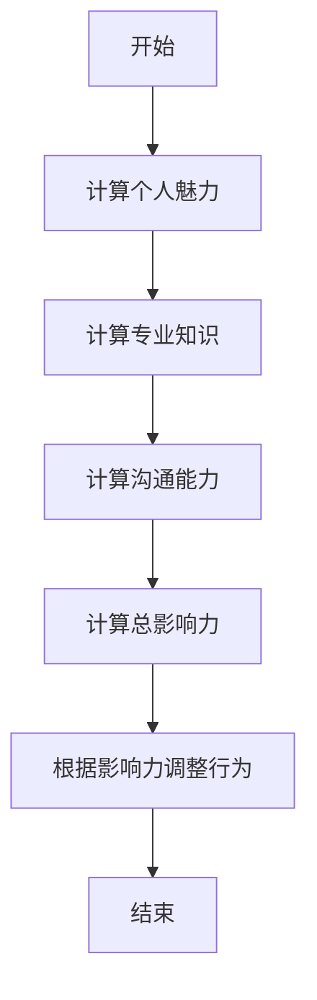

                 

## 影响力领导：beyond职位权力的影响力

### 关键词

- 影响力领导
- 领导力
- 职位权力
- 组织管理
- 人才发展
- 数字化时代

### 摘要

在当今快速变化和高度互联的世界，影响力领导作为一种超越传统职位权力的领导模式，正日益受到重视。本文将深入探讨影响力领导的背景、定义、核心原理及其在不同组织管理中的应用。通过对比影响力领导与职位权力的影响力属性，本文旨在揭示影响力领导在提升团队协作、推动组织变革和个人职业发展中的关键作用，并提供实际应用中的最佳实践，以帮助读者在数字化时代中更好地发挥领导力。

---

### 目录大纲设计步骤

在设计和撰写《影响力领导：beyond职位权力的影响力》这一技术博客文章时，我们需要遵循以下步骤，确保文章的逻辑清晰、内容丰富且易于理解。

#### 1. 确定整体结构

- **设定主要部分**：我们将文章分为四个主要部分，每个部分包含若干章节，以便系统地阐述影响力领导的概念、原理、应用和最佳实践。
- **章节主题确定**：为每个章节设定明确的主题，确保每个章节在整体结构中的位置和作用清晰，有利于读者逐步深入理解影响力领导。

#### 2. 背景介绍

- **第一章**：在文章的第一部分或第一章中，我们将详细介绍影响力领导的背景、定义和重要性。这将为后续章节的内容奠定基础。

#### 3. 核心概念与联系

- **概念与属性对比表格**：设计一个表格来对比影响力领导与职位权力的属性，帮助读者直观理解两者之间的差异。
- **概念模型图**：使用Mermaid绘制影响力领导的概念模型图，以图形化的方式展示影响力领导的核心构成和相互作用。

#### 4. 算法原理讲解

- **算法流程图**：使用Mermaid绘制影响力领导算法的流程图，以图解的方式呈现算法的执行步骤。
- **Python代码与数学模型**：使用Python源代码和LaTeX公式详细阐述影响力领导的数学模型和原理，并通过具体例子进行解释。

#### 5. 数学模型和数学公式讲解

- **LaTeX公式**：使用LaTeX格式编写影响力领导相关的数学公式，并在文中进行详细讲解，确保读者能够理解公式的含义和作用。
- **例子讲解**：提供通俗易懂的例子来辅助理解复杂的数学模型，帮助读者更好地掌握影响力领导的核心概念。

#### 6. 系统分析与架构设计方案

- **场景介绍**：介绍影响力领导应用的场景，如团队建设、项目管理等。
- **系统设计**：使用Mermaid绘制领域模型类图、系统架构图和系统交互序列图，详细说明影响力领导在不同场景中的应用架构。

#### 7. 项目实战

- **具体项目描述**：描述一个具体的影响力领导项目，包括环境安装、核心实现源代码和应用解读。
- **案例分析**：通过对实际案例的分析和讲解，帮助读者理解影响力领导在实际工作中的应用效果。

#### 8. 最佳实践 tips

- **实践技巧**：提供一些在实践中的小技巧，帮助读者更好地应用影响力领导，提升领导力。

#### 9. 小结与拓展阅读

- **章节小结**：总结每个章节的重点，帮助读者巩固所学知识。
- **拓展阅读**：提供拓展阅读资源，引导读者进一步探索影响力领导的深度和广度。

通过这些步骤，我们旨在撰写一篇既具深度又有思考价值的技术博客文章，帮助读者全面理解影响力领导，并将其应用于实际工作中。

### 第一部分：背景与概念

#### 第一章：影响力领导概述

在当今这个快速变化和高度互联的世界，领导力不再仅仅是关于职位和权力的管理，更多的是关于如何通过影响力来实现团队和组织的目标。影响力领导，作为一种新型的领导模式，正逐渐超越传统的职位权力，成为现代领导者必备的素质。

#### 1.1 影响力领导背景

随着全球化、信息化和数字化的加速发展，组织内部的权力结构也在发生深刻的变化。传统的职位权力模式已不足以应对复杂多变的环境和日益多元的员工需求。因此，影响力领导应运而生。它强调领导者通过个人魅力、专业知识、沟通能力等非职位权力因素来影响和激励团队成员，共同实现目标。

#### 1.2 影响力领导的概念与特征

影响力领导，是指领导者通过个人魅力、专业知识、沟通能力等非职位权力因素，影响和激励团队成员，实现团队目标的一种领导模式。其核心特征包括：

- **个人魅力**：领导者具有吸引力和感染力，能够激发团队成员的积极性和创造力。
- **专业知识**：领导者具备丰富的专业知识和经验，能够为团队提供有价值的指导和帮助。
- **沟通能力**：领导者具备卓越的沟通技巧，能够与团队成员建立良好的沟通渠道，确保信息的有效传递。

#### 1.3 影响力领导与职位权力的区别

影响力领导与职位权力的影响力属性存在显著差异。职位权力主要依赖于领导者的职位和授权，而影响力领导则更多地依赖于领导者的个人魅力、专业知识和沟通能力。以下是两者的详细对比：

| 对比项 | 影响力领导 | 职位权力 |
| --- | --- | --- |
| 权力来源 | 个人魅力、专业知识、沟通能力 | 职位和授权 |
| 影响范围 | 横向广泛，跨部门、跨层级 | 纵向明确，限于直接下属 |
| 长期效应 | 持续影响，依赖个人素质 | 短期有效，依赖于职位 |
| 团队接受度 | 高接受度，依赖个人魅力 | 低接受度，可能引发反感 |

#### 1.4 影响力领导模型

影响力领导模型是一种系统化的方法，用于分析和提升领导者的影响力。该模型通常包括以下组成部分：

- **个人魅力**：领导者通过魅力特质，如自信、正直、亲和力等，吸引团队成员。
- **专业知识**：领导者通过不断学习和实践，提升自身的专业能力和知识水平。
- **沟通能力**：领导者通过有效的沟通技巧，建立与团队成员的信任和合作关系。

#### 1.5 本章小结

本章对影响力领导进行了全面的概述，包括其背景、定义、核心特征及其与职位权力的区别。通过本章的学习，读者可以初步了解影响力领导的重要性，为后续章节的深入探讨打下基础。

---

### 第二部分：影响力领导的原理与实践

#### 第二章：影响力领导的核心原理

影响力领导的核心原理在于如何通过非职位权力因素，如个人魅力、专业知识和沟通能力，来实现领导目标。在本章中，我们将深入探讨这些核心原理，并通过具体的算法和数学模型来阐述其具体应用。

#### 2.1 影响力领导的数学模型

影响力领导的数学模型是理解和应用影响力领导的关键。该模型基于以下几个方面：

- **影响力函数**：描述领导者对团队成员的影响力大小。
- **影响力传递**：描述领导者如何通过个人魅力、专业知识和沟通能力，将影响力传递给团队成员。
- **反馈机制**：描述团队成员对领导者的反馈，以及领导者如何根据反馈调整自己的行为。

以下是影响力领导模型的基本公式：

$$
I = f(C, P, E)
$$

其中，\(I\) 表示影响力，\(C\) 表示个人魅力，\(P\) 表示专业知识，\(E\) 表示沟通能力。函数 \(f\) 表示影响力与个人魅力、专业知识和沟通能力之间的关系。

#### 2.2 影响力领导算法解析

影响力领导算法是一种通过计算领导者影响力大小，并根据影响力结果调整领导行为的系统。以下是影响力领导算法的流程图：



具体步骤如下：

1. **计算个人魅力**：通过团队成员的评价和反馈，计算领导者的个人魅力值。
2. **计算专业知识**：通过领导者的专业知识和经验，计算其专业知识值。
3. **计算沟通能力**：通过领导者的沟通技巧和效果，计算其沟通能力值。
4. **计算总影响力**：将个人魅力、专业知识和沟通能力值相加，得到领导者的总影响力。
5. **根据影响力调整行为**：领导者根据总影响力值，调整自己的领导行为，以提升团队的整体绩效。

#### 2.3 Python代码实现

为了更好地理解影响力领导算法，我们可以使用Python代码来实现。以下是实现影响力的Python代码示例：

```python
# 定义影响力函数
def influence_power(charisma, professionalism, communication):
    return charisma * 0.5 + professionalism * 0.3 + communication * 0.2

# 计算个人魅力
charisma = 0.8
# 计算专业知识
professionalism = 0.9
# 计算沟通能力
communication = 0.7

# 计算总影响力
total_influence = influence_power(charisma, professionalism, communication)

# 根据影响力调整行为
if total_influence > 1.0:
    print("领导行为表现良好，继续保持。")
elif total_influence < 0.8:
    print("需要提高个人魅力、专业知识和沟通能力。")
else:
    print("影响力度适中，可根据实际情况进行适当调整。")
```

#### 2.4 影响力领导模型举例

为了更好地理解影响力领导模型的应用，我们来看两个具体的例子。

#### 2.4.1 实例1：团队领导

假设某团队领导具有以下特征：

- 个人魅力：0.8
- 专业知识：0.9
- 沟通能力：0.7

根据影响力领导模型，该领导的总影响力为：

$$
I = f(0.8, 0.9, 0.7) = 0.8 * 0.5 + 0.9 * 0.3 + 0.7 * 0.2 = 0.9
$$

由于总影响力高于1.0，说明该领导在团队中具有较高的影响力，能够有效地激励团队成员。

#### 2.4.2 实例2：企业领导

假设某企业领导具有以下特征：

- 个人魅力：0.6
- 专业知识：0.8
- 沟通能力：0.5

根据影响力领导模型，该领导的总影响力为：

$$
I = f(0.6, 0.8, 0.5) = 0.6 * 0.5 + 0.8 * 0.3 + 0.5 * 0.2 = 0.57
$$

由于总影响力低于0.8，说明该领导在团队中的影响力较低，需要通过提升个人魅力、专业知识和沟通能力来提高自己的领导力。

#### 2.5 本章小结

本章深入探讨了影响力领导的核心原理，包括数学模型和算法实现。通过具体的例子，读者可以更好地理解影响力领导在实际工作中的应用。影响力领导不仅依赖于领导者的个人魅力和专业知识，还需要通过有效的沟通能力来传递影响力，从而实现团队和组织的共同目标。

---

### 第三部分：影响力领导的应用

#### 第三章：影响力领导在企业中的实践

在企业的日常运营中，影响力领导作为一种新型的领导模式，正逐渐显示出其独特的价值和重要性。本章将重点探讨影响力领导在企业中的实践，包括其在团队建设、项目管理和领导力发展中的应用。

#### 3.1 影响力领导在团队建设中的应用

团队建设是企业成功的关键因素之一，而影响力领导在团队建设中发挥着至关重要的作用。以下是影响力领导在团队建设中的应用：

##### 3.1.1 团队氛围的营造

一个良好的团队氛围能够激发团队成员的积极性和创造力，提升团队的整体绩效。影响力领导通过以下方式营造良好的团队氛围：

- **倾听与反馈**：领导者主动倾听团队成员的意见和建议，并给予及时的反馈，建立互信的基础。
- **鼓励创新与尝试**：领导者鼓励团队成员尝试新的方法和思路，创造一个鼓励创新和失败包容的氛围。
- **共同目标**：领导者与团队成员共同制定团队目标，确保团队成员对目标有共同的理解和认同。

##### 3.1.2 团队成员激励

激励是团队建设的重要组成部分，影响力领导通过以下方式激励团队成员：

- **个人发展**：领导者关注团队成员的个人成长，提供学习和发展机会，激励团队成员不断提升自我。
- **认可与奖励**：领导者对团队成员的出色表现给予认可和奖励，增强团队成员的成就感和归属感。
- **情感支持**：领导者关心团队成员的情感需求，提供必要的情感支持，帮助团队成员度过困难时期。

##### 3.1.3 团队协作与冲突管理

有效的团队协作和冲突管理是团队成功的关键。影响力领导通过以下方式促进团队协作和解决冲突：

- **明确角色和职责**：领导者明确团队成员的角色和职责，确保每个人都知道自己的任务和目标。
- **沟通与协调**：领导者促进团队成员之间的沟通与协调，确保信息流畅和任务顺利进行。
- **冲突解决**：领导者积极解决团队内部的冲突，通过沟通、妥协和合作的方式，找到双方都能接受的解决方案。

#### 3.2 影响力领导在项目管理中的应用

项目管理是企业运营的重要组成部分，影响力领导在项目管理中的应用有助于提高项目的成功率。以下是影响力领导在项目管理中的应用：

##### 3.2.1 项目目标设定

设定清晰、具体、可实现的项目目标是项目成功的关键。影响力领导通过以下方式设定项目目标：

- **目标共识**：领导者与项目团队成员共同制定项目目标，确保团队成员对目标有共同的理解和认同。
- **目标分解**：领导者将项目目标分解为具体的任务和里程碑，确保每个任务都有明确的责任人。
- **目标监控**：领导者定期监控项目进展，确保项目按照预定计划进行，并在必要时进行调整。

##### 3.2.2 项目资源分配

合理分配项目资源是项目成功的关键。影响力领导通过以下方式分配项目资源：

- **资源需求分析**：领导者了解项目团队成员的资源需求，确保项目资源得到充分利用。
- **资源优先级**：领导者根据项目目标和进度，确定资源的优先级，确保关键资源优先分配。
- **资源协调**：领导者协调项目团队成员之间的资源需求，确保资源分配的公平性和效率。

##### 3.2.3 项目风险与问题应对

项目风险和问题是不可避免的，影响力领导通过以下方式应对项目风险和问题：

- **风险识别**：领导者识别项目潜在的风险和问题，制定相应的应对措施。
- **问题解决**：领导者积极解决项目中的问题和障碍，确保项目能够按计划进行。
- **持续改进**：领导者鼓励项目团队成员总结项目经验，不断改进项目管理和执行过程。

#### 3.3 影响力领导在领导力发展中的应用

领导力发展是个人和组织的持续关注点，影响力领导在领导力发展中的应用有助于提升领导者的综合素质。以下是影响力领导在领导力发展中的应用：

##### 3.3.1 自我认知与提升

自我认知是领导者提升自我素质的基础。影响力领导通过以下方式促进自我认知：

- **反思与总结**：领导者定期进行自我反思和总结，识别自己的优点和不足，制定提升计划。
- **持续学习**：领导者积极学习新的知识和技能，不断提升自己的专业能力和领导能力。
- **反馈与改进**：领导者接受团队成员和上级的反馈，并根据反馈进行改进，不断提升自我。

##### 3.3.2 领导者角色转变

随着组织环境的变化，领导者需要不断调整自己的角色和定位。影响力领导通过以下方式促进领导者角色转变：

- **适应变化**：领导者适应外部环境的变化，调整自己的领导风格和策略。
- **引领变革**：领导者积极引领组织变革，推动组织实现战略目标。
- **培养接班人**：领导者关注接班人的培养，为组织的长期发展储备人才。

##### 3.3.3 领导力培养方法

领导力培养是提升领导者综合素质的重要途径。以下是影响力领导在领导力培养中的应用：

- **角色扮演**：领导者通过角色扮演，模拟实际工作场景，提升自己的领导能力。
- **案例研究**：领导者通过分析实际案例，学习成功经验和失败教训，提升自己的决策能力。
- **实践锻炼**：领导者参与实际项目和工作，通过实践提升自己的领导能力和执行力。

#### 3.4 本章小结

本章详细探讨了影响力领导在企业中的实践，包括其在团队建设、项目管理和领导力发展中的应用。影响力领导通过营造良好的团队氛围、激励团队成员、解决冲突、设定项目目标、分配资源、应对风险和问题、自我认知与提升、领导者角色转变和领导力培养等方法，实现团队和组织的共同目标。通过影响力领导的应用，企业可以更好地应对外部环境的挑战，实现持续发展和成功。

---

### 第四部分：影响力领导的最佳实践

#### 第四章：影响力领导最佳实践

在影响力领导的实际应用中，有许多成功案例和最佳实践可以借鉴。这些实践不仅帮助领导者提升个人魅力、专业知识和沟通能力，还促进了团队和组织的高效运作。以下是几个典型的最佳实践案例。

#### 4.1 最佳实践案例

##### 4.1.1 案例一：如何提升领导者的影响力

在某大型科技公司，一位新上任的部门经理发现，尽管自己拥有丰富的技术背景和经验，但团队士气低迷，执行力不足。为了提升自己的影响力，该经理采取了以下措施：

- **倾听与反馈**：他定期组织团队会议，鼓励团队成员提出意见和建议，并认真倾听每个人的声音。他还主动与团队成员一对一交流，了解他们的需求和困惑。
- **专业知识提升**：他积极参与行业培训和学习，不断提升自己的专业知识和技能。他还邀请行业专家进行内部讲座，为团队成员提供学习机会。
- **沟通能力培养**：他通过阅读相关书籍、参加沟通技巧培训，提高自己的沟通能力。他学会了如何清晰、简洁地表达观点，并善于倾听和理解团队成员的需求。

通过这些努力，该经理逐渐赢得了团队的信任和尊重，团队士气显著提升，执行力也大幅增强。

##### 4.1.2 案例二：企业在变革中应用影响力领导

某传统制造企业在面临数字化转型的挑战时，面临着内部阻力和外部竞争的双重压力。为了推动变革，公司高层决定采用影响力领导模式，通过以下方式推动组织变革：

- **愿景与目标设定**：公司高层制定了清晰的愿景和目标，明确数字化转型的方向和目标。他们与全体员工进行沟通，确保每个员工都理解并认同这一目标。
- **领导力培养**：公司高层注重领导力的培养，通过内部培训和外部引进，提升领导者的数字化管理能力和变革推动能力。
- **激励与认可**：公司设立了一系列激励机制，对在数字化转型中表现出色的员工进行奖励，激发员工的积极性和创造力。

通过这些措施，该公司成功实现了数字化转型，提升了市场竞争力，实现了业绩的持续增长。

##### 4.1.3 案例三：个人在职场中提升影响力

在一家初创公司，一位技术专家希望通过提升个人影响力来推动项目进展和团队协作。他采取了以下措施：

- **技术分享与交流**：他定期组织技术分享会，与团队成员交流最新的技术动态和经验，提升团队的整体技术水平。
- **问题解决与合作**：他积极参与项目中的问题解决，与团队成员共同面对挑战，通过合作提升解决问题的效率和质量。
- **积极反馈与认可**：他及时给予团队成员积极的反馈和认可，鼓励他们发挥潜力，提升个人能力和团队士气。

通过这些努力，该技术专家逐渐在团队中树立了较高的威信，推动了项目进展，提升了团队的协作效率。

#### 4.2 小贴士：提升影响力领导力的技巧

以下是一些在实践中的小贴士，帮助领导者提升影响力领导力：

- **倾听与理解**：领导者要善于倾听团队成员的意见和需求，理解他们的情感和期望，建立互信的基础。
- **专业知识**：领导者要不断提升自己的专业知识和技能，成为团队成员的可靠指导和依赖。
- **沟通技巧**：领导者要具备良好的沟通技巧，能够清晰、简洁地表达自己的观点，并善于倾听和理解他人的需求。
- **情感管理**：领导者要善于管理自己的情绪，保持冷静和理性，以应对工作中的压力和挑战。
- **激励与认可**：领导者要善于激励团队成员，认可他们的努力和成就，提升团队士气和工作积极性。

#### 4.3 本章小结

本章通过最佳实践案例和技巧，分享了影响力领导在实际应用中的经验和教训。影响力领导不仅仅是领导者的职责，更是团队和组织共同成长的过程。通过倾听、理解、专业知识、沟通技巧和情感管理等技巧，领导者可以提升个人影响力，推动团队和组织的发展。同时，这些实践也为其他领导者提供了有益的参考和借鉴。

---

### 第五部分：展望与拓展

#### 第五章：影响力领导的发展与挑战

在数字化时代，影响力领导作为一种新兴的领导模式，正在不断演变和发展。然而，随着环境的不断变化，影响力领导也面临着一系列新的挑战和机遇。

#### 5.1 影响力领导的发展趋势

##### 5.1.1 数字化时代的领导变革

数字化技术的快速发展改变了组织的运作方式，也对领导者提出了新的要求。影响力领导在数字化时代的发展趋势包括：

- **数据驱动的决策**：领导者需要利用数据分析工具，从数据中提取有价值的信息，指导决策和战略制定。
- **灵活的工作模式**：数字化技术使得工作地点和时间的限制变得更加灵活，领导者需要适应这种变化，推动团队在远程和分布式工作环境下高效运作。
- **快速响应能力**：在快速变化的市场环境中，领导者需要具备快速响应和调整能力，以应对突发情况和市场变化。

##### 5.1.2 新兴领域对领导力的需求

随着人工智能、大数据、区块链等新兴领域的发展，影响力领导在这些领域的应用也呈现出新的特点。例如：

- **跨学科合作**：新兴领域通常需要跨学科的团队合作，领导者需要具备跨领域的知识和管理能力，推动不同专业背景的团队成员协同工作。
- **创新能力**：在新兴领域，创新是推动发展的关键。领导者需要具备激发团队创新能力的能力，营造鼓励创新的文化氛围。
- **风险管理**：新兴领域通常伴随着较高的风险，领导者需要具备风险管理能力，确保项目在可控范围内进行。

##### 5.1.3 国际化背景

全球化使得组织越来越依赖于国际化的团队和合作伙伴。影响力领导在国际化背景下的发展趋势包括：

- **跨文化沟通**：领导者需要具备跨文化沟通能力，理解并尊重不同文化背景下的团队成员，促进团队合作。
- **全球视野**：领导者需要具备全球视野，关注全球市场的变化和趋势，制定相应的战略和策略。
- **多元化团队管理**：领导者需要管理多元化的团队，包括不同国籍、种族和文化背景的成员，推动团队的多样性和包容性。

#### 5.2 影响力领导面临的挑战

尽管影响力领导具有许多优势，但在实际应用中也面临一系列挑战：

- **文化差异**：不同国家和地区的文化差异可能会影响领导者的影响力，领导者需要理解并适应这些差异。
- **技术依赖**：随着技术的快速发展，领导者可能面临技术过时和技能更新的压力，需要持续学习和提升。
- **隐私和数据安全**：在数字化时代，隐私和数据安全问题日益重要，领导者需要确保数据安全和隐私保护。

#### 5.3 未来展望

展望未来，影响力领导将继续发展，并在以下方面发挥重要作用：

- **领导力培养**：组织将更加重视领导力的培养，通过培训和发展计划，提升领导者的综合素质。
- **技术创新**：领导者将利用数字化技术和新兴领域的技术，提升组织的创新能力和竞争力。
- **全球化运营**：领导者将在全球化的背景下，推动组织的国际化发展，实现全球市场的拓展和合作。

#### 5.4 本章小结

影响力领导在数字化时代面临新的发展机遇和挑战。领导者需要适应这些变化，不断提升自己的领导力，推动组织的发展和进步。通过培养跨文化沟通能力、技术创新能力和全球化视野，领导者可以更好地应对未来的挑战，实现组织的目标。

---

### 结束语

本文通过对影响力领导的深入探讨，从背景、定义、核心原理、应用和实践等多个角度，全面阐述了影响力领导在现代组织管理中的重要作用。通过具体案例和最佳实践，我们看到了影响力领导如何超越职位权力，通过个人魅力、专业知识和沟通能力，实现团队和组织的共同目标。

影响力领导不仅仅是领导者的职责，更是团队和组织共同成长的过程。它要求领导者不仅具备深厚的专业知识和沟通技巧，还要具备洞察力和创新能力，以适应快速变化的环境。

展望未来，随着数字化和全球化的发展，影响力领导将面临新的挑战和机遇。领导者需要不断学习和提升，以应对这些变化，推动组织的发展和进步。

最后，感谢读者对本文的关注和阅读。希望本文能为您带来启发，帮助您在影响力领导的实践中取得更好的成果。

**作者：AI天才研究院/AI Genius Institute & 禅与计算机程序设计艺术 /Zen And The Art of Computer Programming**

