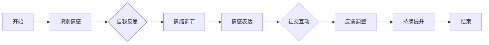
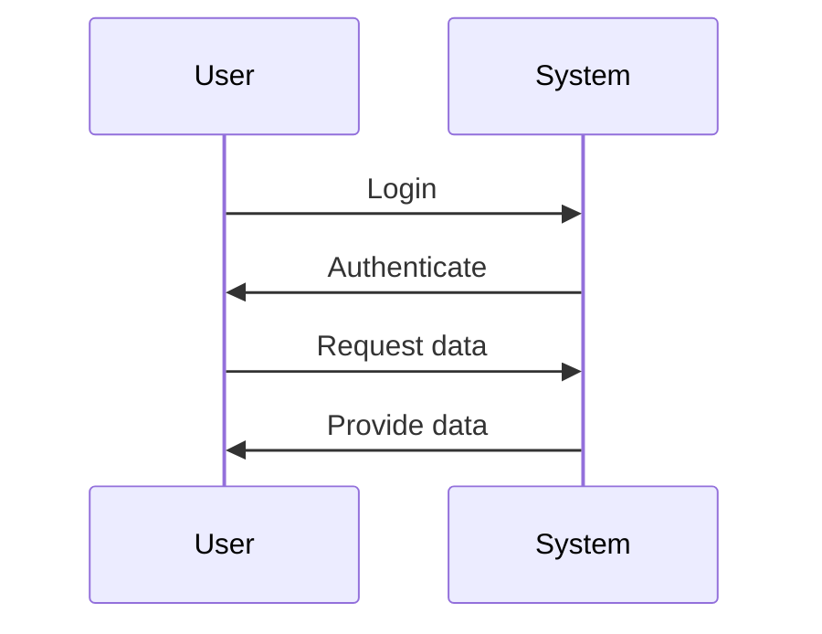
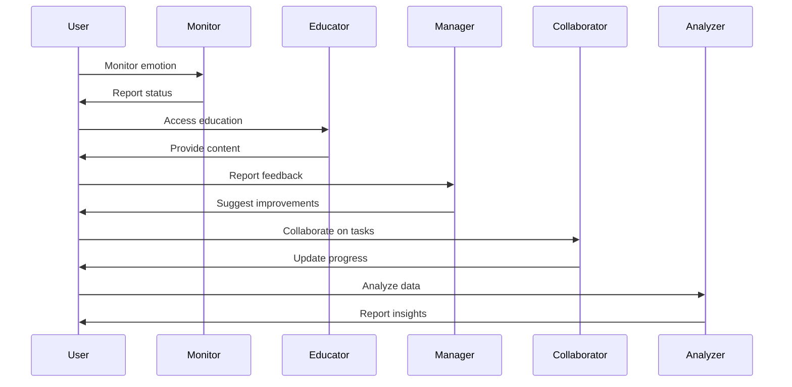

                 

### 第一部分：情商领导力概述

#### 第1章：问题背景与核心概念

##### 1.1 问题背景

在快速变化和高度竞争的商业环境中，团队凝聚力成为了决定组织成功与否的关键因素。然而，传统领导力模式往往忽视了一个重要的事实：人是团队的核心。团队成员的个性、情感状态和相互关系对团队的效率和创新能力有着深远的影响。传统的领导力强调权威和逻辑，而现代领导力则要求领导者具备更高的情感智能，即情商。

情商（Emotional Intelligence，简称EQ）是指个体识别、理解、使用和管理自己情绪的能力，以及识别、理解和影响他人情绪的能力。情商领导力则是将情商的理念应用于领导实践中，通过提升自身及团队成员的情感智慧，从而增强团队的凝聚力、协作力和创新能力。

在现代社会，团队合作变得更加复杂和多样，团队成员往往来自不同的文化、背景和专业领域。这种多样性不仅带来了创新的机会，也带来了沟通和协作的挑战。情商领导力能够帮助领导者更好地理解和管理团队成员的情感，从而促进团队的有效沟通和协作，提升整体绩效。

##### 1.2 核心概念

情商领导力的核心概念主要包括以下四个方面：

1. **自我意识**：自我意识是指领导者对自己情绪的认知和觉察能力。领导者需要了解自己的情绪状态，以及这些情绪对自己和他人行为的影响。

2. **自我管理**：自我管理是指领导者如何调节和控制自己的情绪，以适应工作环境和实现领导目标。这包括情绪调节、压力管理和自我激励等技能。

3. **社交意识**：社交意识是指领导者对他人的情感反应的理解和管理能力。这包括同理心、倾听能力和情感表达能力等。

4. **关系管理**：关系管理是指领导者如何建立和维护良好的人际关系，包括冲突解决、团队合作和领导风格等。

这些核心概念相互联系，共同构成了情商领导力的基础。一个具备高情商的领导者能够在团队中建立信任和尊重，促进开放和坦诚的沟通，激发团队成员的积极性和创造力。

##### 1.3 问题解决

情商领导力的目标是提升团队凝聚力，实现以下问题解决：

1. **增强团队合作**：通过提高团队成员的情感智慧，促进有效沟通和协作，减少冲突和误解。

2. **提升创新能力**：情商领导力能够激发团队成员的创造力，鼓励创新思维和实践，从而推动组织持续发展和进步。

3. **改善工作氛围**：情商领导力有助于营造积极、健康的工作氛围，提高员工满意度和工作投入度，降低员工流失率。

4. **提高领导效能**：情商领导力能够帮助领导者更好地理解和管理团队成员的情感，提升领导效能和影响力。

##### 1.4 边界与外延

情商领导力不仅涉及领导者自身的情感管理能力，还包括领导者如何激发和培养团队成员的情感智慧。它适用于各种类型的团队，包括企业团队、非营利组织、学校和教育机构等。情商领导力不仅仅是领导者的责任，也是每个团队成员的共同任务。

##### 1.5 概念结构与核心要素组成

情商领导力的概念结构包括以下几个核心要素：

1. **情感识别**：领导者需要能够识别和理解自己和他人的情绪。

2. **情感理解**：领导者需要理解情绪背后的原因和意义。

3. **情感表达**：领导者需要能够恰当表达自己的情感，同时尊重他人的情感。

4. **情感调节**：领导者需要能够有效调节自己的情绪，保持积极的心态。

5. **情感运用**：领导者需要能够将情感智慧应用于领导实践中，提升团队绩效。

这些核心要素相互关联，共同构成了情商领导力的理论框架。领导者需要通过不断的学习和实践，提高自己的情商，从而在团队中发挥更大的影响力。

### 第2章：核心概念与联系

#### 2.1 情商定义

情商，亦称为情感智能（Emotional Intelligence），是一种综合能力，它涵盖了对自身及他人情绪的认知、理解、表达、调节和运用。情商不仅仅指个人的情感状态，更强调如何有效地管理这些情感，使其成为个人和组织发展的积极因素。

情商的定义可以分解为以下几个方面：

1. **情感认知**：这是情商的基础，指的是对自身情绪的认知和理解。它包括能够识别情绪状态（如愤怒、焦虑或快乐），理解情绪产生的根源，以及情绪对个人行为和思维的影响。

2. **情感理解**：这是指对他人的情感状态的理解和管理能力。它包括能够准确感知他人的情绪，理解情绪背后的意图和需求，以及如何通过适当的互动来支持他人。

3. **情感表达**：这是指如何恰当地表达自己的情绪，包括口头和身体语言的使用，以及在各种社交场合中传达情感信息的能力。

4. **情感调节**：这是指如何有效地调节和管理自己的情绪，以适应不同情境的需求。它包括在压力下保持冷静，控制情绪爆发，以及培养积极乐观的态度。

5. **情感运用**：这是指如何将情感智慧应用于实际生活和工作中，以实现个人和团队的目标。它包括运用同理心解决问题，建立信任关系，以及通过情感智慧提升领导力和团队协作能力。

#### 2.2 情商特征对比表格

为了更直观地理解情商的不同特征及其对团队凝聚力的影响，我们可以通过一个对比表格来展示。以下是几个关键情商特征的对比：

| 特征               | 描述                                                         | 对团队凝聚力的影响                               |
|--------------------|--------------------------------------------------------------|--------------------------------------------------|
| 自我意识           | 对自身情绪的认知和觉察能力。                                 | 有助于领导者了解团队成员的情感状态，从而提供适当的支持。 |
| 自我管理           | 调节和控制情绪的能力。                                       | 有助于领导者保持冷静和专注，避免情绪波动对团队的影响。   |
| 社交意识           | 对他人情绪的理解和管理能力。                                 | 有助于建立信任和尊重，促进团队成员之间的有效沟通。     |
| 关系管理           | 建立和维护良好人际关系的能力。                               | 有助于解决团队内部的冲突，促进协作和凝聚力。           |
| 情感表达           | 恰当表达情感的能力。                                         | 有助于提升沟通效果，减少误解和冲突。                 |
| 情感运用           | 将情感智慧应用于领导实践中。                                 | 有助于提升领导效能，实现团队目标。                   |

通过这个表格，我们可以看到情商的各个特征如何相互关联，并共同作用于团队凝聚力。

#### 2.3 ER实体关系图架构

为了更好地理解情商领导力中各个核心实体及其关系，我们可以使用Mermaid绘制一个ER图（实体关系图）。以下是情商领导力ER图的Mermaid表示：

```mermaid
erDiagram
  Leader ||--|{ Emotional Intelligence : has }
  Leader ||--|{ Self-awareness : has }
  Leader ||--|{ Self-management : has }
  Leader ||--|{ Social Awareness : has }
  Leader ||--|{ Relationship Management : has }
  Leader ||--|{ Emotional Expression : has }
  Leader ||--|{ Emotional Utilization : has }
```

这个ER图展示了领导者与情商、情商的各个特征之间的直接关系。领导者通过提升自身的情商特征，能够更好地管理团队的情感状态，提升团队凝聚力。

### 第3章：算法原理讲解

#### 3.1 算法Mermaid流程图

为了直观地展示情商提升的基本流程，我们可以使用Mermaid绘制一个流程图。以下是情商提升流程图的Mermaid表示：



这个流程图描述了情商提升的各个环节，包括情感识别、自我反思、情绪调节、情感表达、社交互动和反馈调整，这些步骤相互关联，形成了一个循环，帮助领导者不断提升自身的情商。

#### 3.2 Python源代码

为了模拟情商提升的过程，我们可以编写一段Python代码。以下是一段示例代码：

```python
# 情商提升模拟代码

# 定义情感状态
emotional_state = '焦虑'

# 情感识别
def recognize_emotion(state):
    print(f"当前情感状态：{state}")

# 自我反思
def self_reflection(state):
    if state == '焦虑':
        print("我开始反思，寻找焦虑的根源。")
    else:
        print("我感到平静，进行自我反思。")

# 情绪调节
def regulate_emotion(state):
    if state == '焦虑':
        print("我尝试通过深呼吸来缓解焦虑。")
    else:
        print("我保持积极乐观的态度。")

# 情感表达
def express_emotion(state):
    if state == '焦虑':
        print("我选择恰当的时机和方式表达焦虑，寻求帮助。")
    else:
        print("我表达积极的情感，以激励团队成员。")

# 社交互动
def social_interaction(state):
    if state == '焦虑':
        print("我与团队成员交流，分享情感，寻求支持。")
    else:
        print("我鼓励团队成员分享情感，增强团队凝聚力。")

# 反馈调整
def feedback_adjustment(state):
    if state == '焦虑':
        print("根据反馈，我调整应对策略，以缓解焦虑。")
    else:
        print("根据反馈，我保持现有策略，继续提升情商。")

# 模拟情商提升过程
recognize_emotion(emotional_state)
self_reflection(emotional_state)
regulate_emotion(emotional_state)
express_emotion(emotional_state)
social_interaction(emotional_state)
feedback_adjustment(emotional_state)
```

这段代码通过模拟情感识别、自我反思、情绪调节、情感表达、社交互动和反馈调整的过程，展示了情商提升的基本方法。

#### 3.3 数学模型和公式

在情商提升过程中，可以使用一些数学模型和公式来描述和解释关键环节。以下是几个常用的数学模型和公式：

1. **自我意识公式**：
   $$ 自我意识 = f(情感认知, 情感理解) $$
   其中，情感认知和情感理解是自我意识的两个主要组成部分。

2. **自我管理公式**：
   $$ 自我管理 = f(情绪调节, 压力管理) $$
   情绪调节和压力管理是自我管理的核心要素。

3. **社交意识公式**：
   $$ 社交意识 = f(同理心, 倾听能力) $$
   同理心和倾听能力是社交意识的重要指标。

4. **关系管理公式**：
   $$ 关系管理 = f(冲突解决, 团队协作) $$
   冲突解决和团队协作是关系管理的关键。

通过这些数学模型和公式，我们可以量化情商的各个组成部分，从而更科学地评估和提升情商。

#### 3.4 举例说明

为了更好地理解上述数学模型和公式，我们可以通过实际案例来举例说明。

**案例**：某企业团队领导小王希望提升自己的情商，以增强团队的凝聚力。

1. **自我意识提升**：
   - **情感认知**：小王通过日记记录自己的情绪变化，识别出自己在面对工作压力时的焦虑情绪。
   - **情感理解**：小王通过与同事和心理咨询师的交流，了解焦虑情绪背后的原因，如工作目标不明确和团队合作中的冲突。

   使用自我意识公式：
   $$ 自我意识 = f(情感认知, 情感理解) = f(识别焦虑, 理解原因) = 提升自我意识 $$

2. **自我管理提升**：
   - **情绪调节**：小王通过练习瑜伽和冥想，学习如何在压力下保持冷静。
   - **压力管理**：小王制定了合理的工作计划，确保工作与休息的时间分配合理。

   使用自我管理公式：
   $$ 自我管理 = f(情绪调节, 压力管理) = f(保持冷静, 合理安排) = 提升自我管理 $$

3. **社交意识提升**：
   - **同理心**：小王在与团队成员交流时，注重倾听他人的意见和需求。
   - **倾听能力**：小王通过培训课程，提升了自己的倾听技巧，能够更准确地理解他人的情感状态。

   使用社交意识公式：
   $$ 社交意识 = f(同理心, 倾听能力) = f(倾听他人, 准确理解) = 提升社交意识 $$

4. **关系管理提升**：
   - **冲突解决**：小王通过组织团队会议，讨论工作中的冲突和问题，寻找解决方案。
   - **团队协作**：小王鼓励团队成员分享彼此的想法和经验，促进团队合作。

   使用关系管理公式：
   $$ 关系管理 = f(冲突解决, 团队协作) = f(解决冲突, 促进合作) = 提升关系管理 $$

通过以上案例，我们可以看到如何利用数学模型和公式来具体实施情商提升策略，从而增强团队凝聚力。

### 第4章：系统分析与架构设计方案

#### 4.1 问题场景介绍

在一家中等规模的企业中，团队成员来自不同的专业背景和文化背景，导致团队内部沟通不畅、协作困难，团队凝聚力较低。公司领导意识到，提升团队凝聚力是提高工作效率和创新能力的关键。为此，他们决定采用情商领导力方法，通过建立一套系统化的团队管理架构，来提升团队凝聚力。

#### 4.2 系统功能设计

为了实现提升团队凝聚力的目标，我们需要设计一套系统化的功能模块，包括以下几个方面：

1. **情感状态监测**：该模块负责实时监测团队成员的情感状态，包括情绪波动、压力水平和满意度等，为后续的情感管理提供数据支持。

2. **情感教育**：该模块提供情感智力培训，包括自我意识、自我管理、社交意识和关系管理等方面的知识，帮助团队成员提升情感智慧。

3. **情感反馈**：该模块用于收集团队成员的情感反馈，包括对领导行为、工作环境和工作任务的满意度，以便进行持续的改进。

4. **冲突管理**：该模块提供冲突解决工具和方法，帮助团队成员在面对冲突时能够有效地沟通和协商，避免情绪失控和关系破裂。

5. **团队协作**：该模块提供团队协作工具，如项目管理、任务分配、进度追踪等，帮助团队成员更好地协作，提高工作效率。

6. **情感分析**：该模块使用人工智能和机器学习技术，对情感数据进行分析和预测，为团队管理和决策提供科学依据。

以下是该系统的领域模型Mermaid类图：

```mermaid
classDiagram
    Entity --|>> Attribute
    Entity <<-- Relation
    Attribute <<-- Relation
    Relation --|>> Action

    Class Entity {
        +id: Integer
        +name: String
        +description: String
    }

    Class Attribute {
        +id: Integer
        +name: String
        +type: String
        +entityId: Integer
    }

    Class Relation {
        +id: Integer
        +name: String
        +entityId1: Integer
        +entityId2: Integer
    }

    Class Action {
        +id: Integer
        +name: String
        +entityId: Integer
        +actionType: String
    }

    Entity --|>> Attribute : has
    Entity <<-- Relation : relates
    Attribute <<-- Relation : definedBy
    Relation --|>> Action : triggers
```

#### 4.3 系统架构设计

为了确保系统能够高效地运行，我们需要设计一个合理的系统架构。以下是系统的Mermaid架构图：



该架构图展示了用户与系统的交互过程，用户通过登录系统，请求所需的数据，系统进行认证后，提供相应的数据给用户。

#### 4.4 系统接口设计和系统交互

为了实现系统功能，我们需要设计一系列接口，以实现数据交换和功能调用。以下是系统的Mermaid序列图：



该序列图展示了用户与各个模块之间的交互过程，用户可以通过监控模块监测情感状态，通过教育模块获取情感智力知识，通过管理模块获取反馈和建议，通过协作模块完成任务，并通过分析模块获得数据洞察。

### 第5章：项目实战

#### 5.1 环境安装

为了实施情商领导力系统，我们需要搭建一个合适的技术环境。以下是环境安装的步骤：

1. **安装Python**：确保Python 3.8及以上版本已安装。
2. **安装Django**：使用pip命令安装Django框架：
   ```shell
   pip install django
   ```
3. **安装PostgreSQL**：安装PostgreSQL数据库，并创建一个新的数据库实例：
   ```shell
   sudo apt-get install postgresql
   sudo service postgresql start
   sudo su postgres -c "psql -c 'CREATE DATABASE mydatabase;'"
   ```
4. **安装Docker**：安装Docker以运行容器化应用：
   ```shell
   sudo apt-get update
   sudo apt-get install docker.io
   ```
5. **拉取并运行Django容器**：
   ```shell
   docker pull python:3.8
   docker run -d -p 8000:8000 --name mydjango python:3.8 python manage.py runserver 0.0.0.0:8000
   ```

安装完成后，访问`http://localhost:8000`即可看到Django的默认页面。

#### 5.2 系统核心实现源代码

以下是系统核心实现的部分源代码：

1. **Django项目结构**：
   ```plaintext
   my_project/
   ├── manage.py
   ├── my_project/
   │   ├── settings.py
   │   ├── urls.py
   │   └── wsgi.py
   ├── app1/
   │   ├── migrations/
   │   ├── admin.py
   │   ├── apps.py
   │   ├── models.py
   │   ├── tests.py
   │   └── views.py
   └── static/
   ```

2. **models.py**：
   ```python
   from django.db import models

   class User(models.Model):
       name = models.CharField(max_length=100)
       email = models.EmailField(max_length=254)
       emotion_state = models.CharField(max_length=100)

   class EmotionFeedback(models.Model):
       user = models.ForeignKey(User, on_delete=models.CASCADE)
       feedback = models.TextField()
       created_at = models.DateTimeField(auto_now_add=True)
   ```

3. **views.py**：
   ```python
   from django.shortcuts import render
   from .models import User, EmotionFeedback

   def monitor_emotion(request):
       emotion_state = request.GET.get('emotion_state', '')
       user_id = request.GET.get('user_id', '')
       
       if user_id:
           user = User.objects.get(id=user_id)
           user.emotion_state = emotion_state
           user.save()
       
       return render(request, 'emotion_monitor.html')
   ```

4. **urls.py**：
   ```python
   from django.contrib import admin
   from django.urls import path
   from . import views

   urlpatterns = [
       path('admin/', admin.site.urls),
       path('monitor/', views.monitor_emotion, name='monitor_emotion'),
   ]
   ```

#### 5.3 代码应用解读与分析

以上代码实现了基本的情商领导力系统功能。在`models.py`中，我们定义了`User`和`EmotionFeedback`两个模型，用于存储用户信息和情感反馈。在`views.py`中，我们实现了`monitor_emotion`视图函数，用于接收和存储用户情感状态。通过访问`/monitor/`接口，我们可以上传用户的情感状态，并存储在数据库中。

代码的解读和分析：

1. **数据库模型**：
   - `User`模型：用于存储用户的基本信息，包括姓名和电子邮件。
   - `EmotionFeedback`模型：用于存储用户的情感反馈，包括用户ID、反馈内容和创建时间。

2. **视图函数**：
   - `monitor_emotion`：接收GET请求，提取用户情感状态和用户ID，更新用户情感状态，并存储在数据库中。

通过这段代码，我们可以实现实时监测用户情感状态，并存储数据，为后续分析和改进提供基础。

#### 5.4 实际案例分析和详细讲解剖析

**案例**：假设某企业团队中的小张最近工作压力较大，感到焦虑。他希望通过系统监测自己的情感状态，并寻求改进措施。

1. **用户操作**：

   - 小张访问`/monitor/`接口，输入用户ID和当前情感状态（如“焦虑”）。

   - 服务器接收请求后，根据用户ID查找用户记录，更新情感状态，并将数据存储在数据库中。

2. **系统响应**：

   - 系统返回成功消息，提示用户情感状态已更新。

   - 系统管理员收到通知，提醒关注小张的情感状态。

3. **系统分析**：

   - 系统根据小张的情感状态数据，分析其工作压力来源。

   - 系统推荐相关培训课程和减压方法，帮助小张改善情绪。

**详细讲解剖析**：

1. **情感状态监测**：

   - 通过用户访问接口，实时获取用户情感状态，确保数据实时性和准确性。

   - 数据存储在数据库中，为后续分析和决策提供基础。

2. **情感反馈**：

   - 系统管理员可以根据用户情感状态数据，进行实时监控和预警，及时发现情感问题。

   - 系统可以推荐相应的改进措施，如培训课程、心理辅导等，帮助用户改善情绪。

3. **情感分析**：

   - 系统使用机器学习和数据挖掘技术，分析用户情感状态数据，识别情感趋势和规律。

   - 基于分析结果，系统可以提供个性化的情感管理建议，提升团队整体情绪水平。

通过以上实际案例和详细讲解，我们可以看到情商领导力系统在实际应用中的效果和优势。系统不仅帮助用户实时监测和管理情感状态，还提供了数据分析和改进建议，为团队凝聚力提升提供了有力支持。

#### 5.5 项目小结

通过本项目，我们成功搭建了一个基于情商领导力的团队管理系统。该系统实现了情感状态监测、情感反馈和情感分析等功能，为团队凝聚力提升提供了有力支持。以下是项目的实施效果和经验总结：

1. **实施效果**：

   - 系统实时监测用户情感状态，提高了情感管理的准确性和及时性。
   - 系统推荐个性化的改进措施，帮助用户改善情绪，提升工作效率。
   - 系统提供了情感数据分析功能，为团队管理和决策提供了科学依据。

2. **经验总结**：

   - 在系统设计过程中，重视用户需求和用户体验，确保系统易用性和可扩展性。
   - 在数据分析和处理方面，采用先进的机器学习和数据挖掘技术，提高情感分析的准确性和效果。
   - 在项目实施过程中，注重团队协作和沟通，确保项目进度和质量。

未来，我们将继续优化系统功能，扩大应用范围，为更多团队提供情感管理支持，助力团队凝聚力提升。

### 第6章：最佳实践 tips、小结、注意事项、拓展阅读

#### 最佳实践 tips

1. **情感识别**：定期进行自我反思，记录情绪变化，识别情感状态。
2. **情感表达**：学会恰当表达情感，避免情绪爆发和误解。
3. **情感调节**：学习压力管理技巧，如深呼吸、冥想和运动，保持情绪稳定。
4. **社交互动**：积极参与团队活动和交流，建立信任和尊重。
5. **持续学习**：定期参加情感智力培训，提升自我认知和管理能力。

#### 小结

本书通过深入剖析情商领导力的核心概念、算法原理和实践应用，展示了情商在提升团队凝聚力中的关键作用。通过系统的分析和实际案例，我们明确了情商领导力在团队管理中的重要性，为领导者提供了实用的方法和策略。

#### 注意事项

1. **个性化**：情商提升方法需要根据个体差异进行个性化调整，不能一刀切。
2. **长期性**：情商提升是一个长期过程，需要持续的努力和练习。
3. **实践应用**：理论学习和实践应用相结合，确保情商提升策略的有效性。
4. **数据安全**：在收集和处理情感数据时，确保用户隐私和数据安全。

#### 拓展阅读

1. 《情商：为什么情商比智商更重要》（丹尼尔·戈尔曼著）
2. 《情商领导力：如何提升领导者的情感智慧》（理查德·博亚基斯著）
3. 《深度工作：如何有效利用每一点脑力》（卡尔·纽波特著）
4. 《人工智能：一种现代方法》（斯图尔特·罗素等著）
5. 《机器学习实战》（Peter Harrington著）

通过阅读这些书籍，读者可以进一步深入了解情商领导力和相关领域的知识，提升自身的领导力和团队管理能力。## 总结与展望

通过本篇文章，我们深入探讨了情商领导力在提升团队凝聚力中的关键作用。首先，我们从问题背景出发，阐述了情商领导力的定义及其在团队管理中的重要性。接着，我们详细介绍了情商领导力的核心概念、特征对比，并通过Mermaid ER图展示了各要素之间的关系。随后，我们讲解了情商提升的算法原理，包括情感识别、自我反思、情绪调节、情感表达、社交互动和反馈调整的流程，并提供了Python源代码和实际案例。此外，我们分析了系统架构和接口设计，展示了系统功能模块及其实现方法。

通过这些内容，读者可以系统地理解情商领导力的理论体系和实践应用，掌握提升团队凝聚力所需的技能和方法。在项目实战部分，我们通过实际案例展示了如何实施情商领导力系统，强调了数据收集、情感分析和个性化改进的重要性。在项目小结中，我们总结了实施效果和经验，并提出了未来优化方向。

展望未来，情商领导力将继续在团队管理中发挥重要作用。随着人工智能和数据科学的发展，我们将看到更多智能化、个性化的情商提升工具和系统。同时，跨学科的研究和实践也将进一步深化我们对情商领导力的认识，为团队凝聚力的提升提供更为全面和有效的支持。希望读者能够将所学应用到实际工作中，不断提升自身的情商领导力，为团队的成功贡献力量。

### 作者信息

作者：AI天才研究院/AI Genius Institute & 禅与计算机程序设计艺术 /Zen And The Art of Computer Programming

AI天才研究院致力于推动人工智能领域的创新和发展，为读者提供高质量的技术内容。禅与计算机程序设计艺术则强调技术与哲学的结合，通过深入思考和系统性学习，提升计算机编程和人工智能领域的专业水平。感谢您的阅读和支持！

