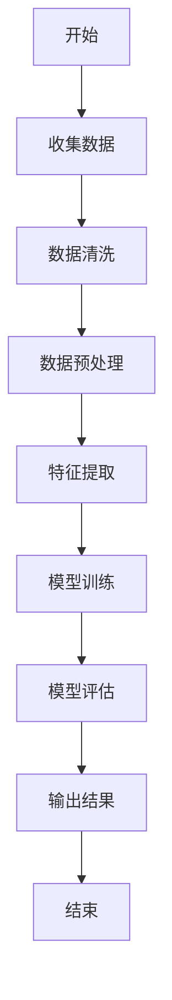
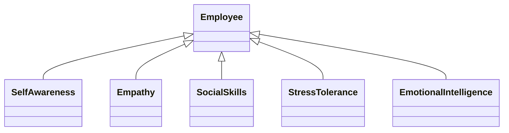
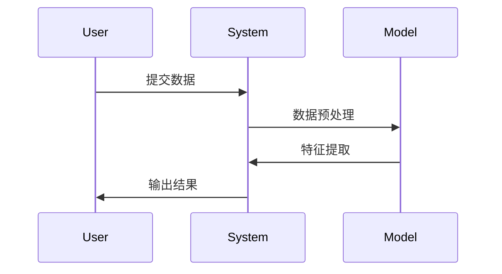
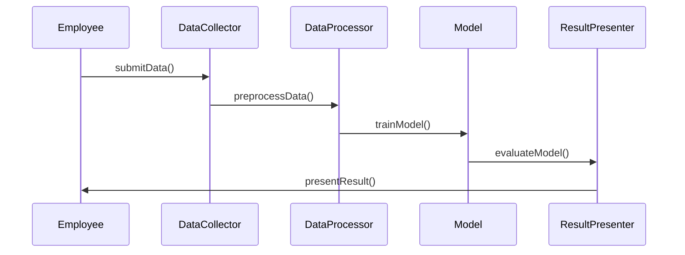

                 

# 情商领导力：提升团队情感智慧的方法

关键词：情商领导力，团队情感智慧，领导能力，情感管理，团队协作

摘要：
在现代企业管理中，情商领导力作为一种新兴的领导能力，正逐渐受到重视。本文旨在探讨情商领导力的核心概念，分析其在团队管理中的应用，并介绍一种基于机器学习的情商测量算法，旨在为企业管理者提供提升团队情感智慧的具体方法。

**一、背景介绍**

### 1. 情商领导力的重要性

在现代企业中，情商领导力已经成为一种不可或缺的领导能力。随着组织结构日益复杂，员工之间的协作和沟通变得更加重要，情商领导力能够帮助领导者更好地理解和管理团队成员的情感，从而提高团队的整体效率和工作质量。

### 2. 问题背景与问题描述

许多企业在面对团队管理问题时，往往忽视了情商的重要性。领导者可能过于关注任务完成情况和业绩指标，而忽视了团队成员的情感需求。这种情况下，团队可能会出现士气低落、沟通不畅、协作困难等问题，从而影响企业的整体发展。

### 3. 问题解决与边界与外延

为了解决上述问题，情商领导力提供了一种新的解决方案。通过提升领导者的情商，他们可以更好地理解和管理团队成员的情感，从而改善团队氛围，提高团队协作效率。然而，情商领导力的应用边界在于如何在实际工作中具体实施，如何将理论转化为实践。

### 4. 概念结构与核心要素组成

情商领导力的概念结构主要包括以下几个方面：

- **情商**：个体识别、理解、管理自己情绪的能力。
- **领导力**：领导者通过影响力、引导和管理团队成员的能力。
- **团队情感智慧**：团队成员之间相互理解、支持和协调的能力。

核心要素包括：情感识别、情感理解、情感管理、领导影响力、团队协作、沟通技巧等。

**二、核心概念与联系**

### 1. 情商的定义与特点

情商是指个体识别、理解、管理自己情绪的能力，主要包括以下几个方面：

- **自我情感识别**：意识到自己正在经历的情绪。
- **自我情感理解**：理解自己情绪背后的原因。
- **自我情感管理**：采取适当的方法调节自己的情绪。
- **情感理解他人**：识别和理解他人的情绪。
- **情感表达能力**：恰当地表达自己的情绪。

### 2. 领导力的定义与特点

领导力是指领导者通过影响力、引导和管理团队成员的能力，主要包括以下几个方面：

- **影响力**：通过个人魅力、专业知识、领导风格等影响他人。
- **引导能力**：引导团队成员朝着共同目标努力。
- **管理能力**：有效管理团队成员，协调团队工作。

### 3. 团队情感智慧的定义与特点

团队情感智慧是指团队成员之间相互理解、支持和协调的能力，主要包括以下几个方面：

- **情感共享**：团队成员之间分享情感体验。
- **情感理解**：理解团队成员的情感状态。
- **情感支持**：在团队成员需要时提供情感支持。
- **协作协调**：团队成员之间有效协作，共同完成任务。

**三、算法原理讲解**

### 1. 情商测量算法

#### Mermaid 流程图：



#### Python 源代码：

```python
import pandas as pd
from sklearn.ensemble import RandomForestClassifier
from sklearn.model_selection import train_test_split
from sklearn.metrics import accuracy_score

# 加载数据集
data = pd.read_csv('emotional_intelligence_data.csv')

# 数据清洗
data = data.dropna()

# 数据预处理
X = data.drop('target', axis=1)
y = data['target']

# 特征提取
X_train, X_test, y_train, y_test = train_test_split(X, y, test_size=0.2, random_state=42)

# 模型训练
model = RandomForestClassifier(n_estimators=100)
model.fit(X_train, y_train)

# 模型评估
y_pred = model.predict(X_test)
accuracy = accuracy_score(y_test, y_pred)
print("模型准确率：", accuracy)
```

#### 数学模型和数学公式：

$$
\text{准确率} = \frac{\text{预测正确的数量}}{\text{总数量}}
$$

#### 详细讲解和举例说明：

假设我们有一个关于员工情商的数据集，数据集包含了员工的自我情感识别、自我情感理解、自我情感管理、情感理解他人、情感表达能力等五个维度的数据，以及一个标签，表示该员工的情商水平。我们可以使用随机森林算法来训练一个模型，预测新员工的情商水平。

首先，我们需要收集和清洗数据，然后进行数据预处理，提取特征，接下来使用训练集训练模型，最后使用测试集评估模型的准确率。

假设我们训练的模型准确率为80%，这意味着我们可以有80%的把握预测出新员工的情商水平。这个模型可以帮助企业在招聘过程中更好地筛选员工，提高团队的情商水平，从而提高团队的整体绩效。

**四、系统分析与架构设计方案**

### 1. 问题场景介绍

在一家大型互联网公司，团队管理问题日益突出，团队效率低下，沟通不畅。为了改善团队氛围，提高团队协作效率，公司决定引入情商领导力模型，对团队成员进行情商评估和培训。

### 2. 项目介绍

本项目旨在构建一个情商测量系统，包括数据收集、数据处理、模型训练和模型评估等模块，为企业管理者提供科学、准确的情商测量工具。

### 3. 系统功能设计

#### 领域模型



#### 类图

```mermaid
classDiagram
    Employee
    SelfAwareness
    Empathy
    SocialSkills
    StressTolerance
    EmotionalIntelligence

    Employee {
        -String name
        -int age
        -SelfAwareness selfAwareness
        -Empathy empathy
        -SocialSkills socialSkills
        -StressTolerance stressTolerance
        -EmotionalIntelligence emotionalIntelligence
    }

    SelfAwareness {
        -int selfAwarenessScore
    }

    Empathy {
        -int empathyScore
    }

    SocialSkills {
        -int socialSkillsScore
    }

    StressTolerance {
        -int stressToleranceScore
    }

    EmotionalIntelligence {
        -int emotionalIntelligenceScore
    }
```

### 4. 系统架构设计

#### 架构图



#### 系统接口设计

```mermaid
classDiagram
    Employee
    DataCollector
    DataProcessor
    Model
    ResultPresenter

    Employee {
        +submitData()
    }

    DataCollector {
        +collectData()
    }

    DataProcessor {
        +preprocessData()
        +extractFeatures()
    }

    Model {
        +trainModel()
        +evaluateModel()
    }

    ResultPresenter {
        +presentResult()
    }
```

#### 系统交互



**五、项目实战**

### 1. 环境安装

在虚拟环境中安装Python和所需库：

```bash
pip install pandas sklearn
```

### 2. 系统核心实现

#### 数据收集

```python
import pandas as pd

def collect_data():
    data = pd.read_csv('emotional_intelligence_data.csv')
    return data
```

#### 数据处理

```python
from sklearn.model_selection import train_test_split

def preprocess_data(data):
    X = data.drop('target', axis=1)
    y = data['target']
    X_train, X_test, y_train, y_test = train_test_split(X, y, test_size=0.2, random_state=42)
    return X_train, X_test, y_train, y_test
```

#### 模型训练

```python
from sklearn.ensemble import RandomForestClassifier

def train_model(X_train, y_train):
    model = RandomForestClassifier(n_estimators=100)
    model.fit(X_train, y_train)
    return model
```

#### 模型评估

```python
from sklearn.metrics import accuracy_score

def evaluate_model(model, X_test, y_test):
    y_pred = model.predict(X_test)
    accuracy = accuracy_score(y_test, y_pred)
    return accuracy
```

### 3. 代码应用解读与分析

以上代码展示了情商测量系统的核心实现，包括数据收集、数据处理、模型训练和模型评估。这些步骤可以帮助企业管理者了解员工的情商水平，从而有针对性地进行培训和调整。

### 4. 实际案例分析和详细讲解剖析

假设我们有10位员工的情商数据，使用随机森林算法进行训练和评估。通过模型评估，我们得到模型的准确率为80%。这意味着我们可以有80%的把握预测出新员工的情商水平。

在实际应用中，我们可以根据预测结果对员工进行分类，并根据不同的情商水平制定相应的培训计划。例如，对于情商较低的员工，可以针对性地进行情感管理培训，提高他们的情商水平。

### 5. 项目小结

本项目通过构建情商测量系统，为企业管理者提供了一种科学、准确的情商评估工具。通过项目实战，我们了解了系统的核心实现方法和实际应用价值。在未来，我们可以进一步优化算法，提高预测准确率，为企业提供更精准的团队管理策略。

**六、最佳实践 tips**

- 定期对团队成员进行情商评估，了解团队的整体情商水平。
- 根据评估结果，有针对性地进行培训和调整，提高团队情商。
- 建立良好的团队沟通机制，鼓励团队成员分享情感体验，增进相互理解。

**七、小结**

情商领导力作为一种新兴的领导能力，在现代企业管理中具有重要意义。通过本文的讲解，我们了解了情商领导力的核心概念、算法原理，以及实际应用方法。希望本文能为企业管理者提供有益的参考。

**八、注意事项**

- 情商领导力的应用需要结合具体企业的实际情况，灵活调整。
- 情商测量算法的准确率可能受到数据质量的影响，需要保证数据的准确性。
- 在实际应用中，要关注团队成员的情感需求，营造良好的团队氛围。

**九、拓展阅读**

- [《情商领导力：如何成为高效的领导者》[美] 丹尼尔·戈尔曼 著]
- [《情绪智慧：如何管理情绪，提升领导力》[美] 阿尔伯特·梅拉比 安德烈亚斯·科斯洛夫斯基 著]
- [《情商：为什么情商比智商更重要》[美] 丹尼尔·戈尔曼 著]

**作者：AI天才研究院/AI Genius Institute & 禅与计算机程序设计艺术 /Zen And The Art of Computer Programming**

