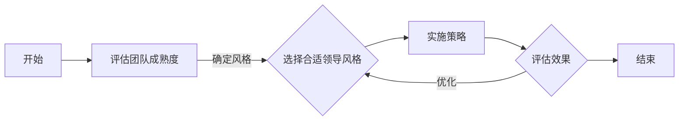
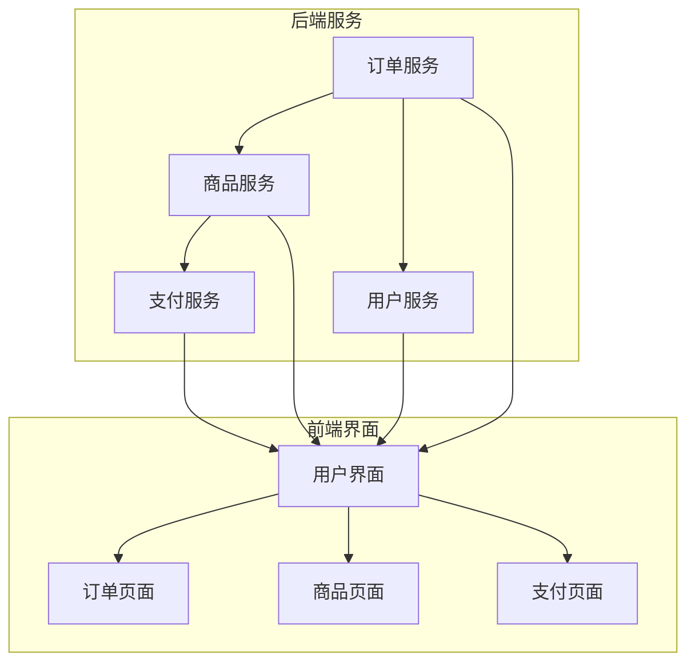
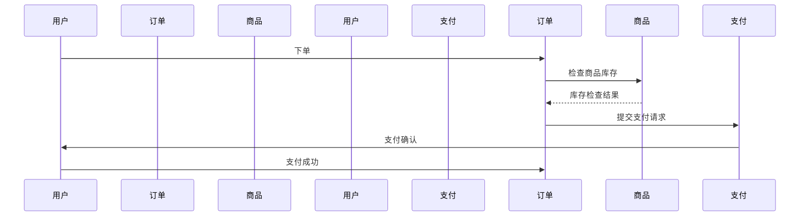

                 

### 目录

#### 第一部分: 领导与团队成熟度

1. **第1章: 领导与团队成熟度的关系**

   - **1.1 领导与团队成熟度的定义**
   - **1.2 团队成熟度对领导风格的影响**
   - **1.3 团队成熟度的评估方法**

2. **第2章: 团队成熟度模型**

   - **2.1 不同团队成熟度模型简介**
   - **2.2 如何根据团队成熟度选择领导风格**
   - **2.3 团队成熟度模型的应用案例**

#### 第二部分: 团队成熟度阶段性分析

1. **第3章: 团队成熟度1-0阶段：无序**

   - **3.1 无序阶段的特征**
   - **3.2 无序阶段的领导策略**
   - **3.3 无序阶段案例解析**

2. **第4章: 团队成熟度1-1阶段：混沌**

   - **4.1 混沌阶段的特征**
   - **4.2 混沌阶段的领导策略**
   - **4.3 混沌阶段案例解析**

3. **第5章: 团队成熟度2-0阶段：协作**

   - **5.1 协作阶段的特征**
   - **5.2 协作阶段的领导策略**
   - **5.3 协作阶段案例解析**

4. **第6章: 团队成熟度2-1阶段：有序**

   - **6.1 有序阶段的特征**
   - **6.2 有序阶段的领导策略**
   - **6.3 有序阶段案例解析**

5. **第7章: 团队成熟度3-0阶段：自我管理**

   - **7.1 自我管理阶段的特征**
   - **7.2 自我管理阶段的领导策略**
   - **7.3 自我管理阶段案例解析**

#### 第三部分: 实践与总结

1. **第8章: 实践与总结**

   - **8.1 如何培养团队成熟度**
   - **8.2 团队成熟度提升的策略**
   - **8.3 领导风格调整的实践总结**

---

**关键词**：领导风格、团队成熟度、情境领导、领导策略、团队协作

**摘要**：

本文探讨了情境领导在IT团队管理中的应用，分析了根据团队成熟度调整领导风格的重要性。通过介绍团队成熟度的定义、评估方法和不同阶段的特征，文章详细阐述了在不同团队成熟度阶段应采取的领导策略，并通过实际案例进行了深入解析。文章最后总结了团队成熟度培养和提升的策略，以及领导风格调整的实践经验，旨在帮助IT领导者更有效地管理和激励团队，推动团队成熟度的提升。

### 第一部分：领导与团队成熟度

#### 第1章：领导与团队成熟度的关系

在IT行业中，领导与团队成熟度之间的关系是至关重要的。团队成熟度指的是团队成员的能力、协作水平和组织效率，而领导风格则是领导者在与团队成员互动中表现出的行为模式。一个成熟度较高的团队能够更好地适应复杂的工作环境，而合适的领导风格则能够促进团队的成长和效率。

**1.1 领导与团队成熟度的定义**

首先，我们需要明确领导和团队成熟度的定义。

- **领导**：领导是一种激励、引导和影响团队成员完成共同目标的过程。领导不仅仅是指导团队工作，更重要的是激发团队成员的潜力，建立团队文化，提升团队协作效率。

- **团队成熟度**：团队成熟度是指团队在完成任务时的能力、协作水平、沟通效率和解决问题的能力。成熟度高的团队通常具有更高的工作效率，更强的团队合作精神和更好的创新能力。

**1.2 团队成熟度对领导风格的影响**

团队成熟度对领导风格有着显著的影响。根据组织行为学理论，领导风格可以分为四种：指令型领导、民主型领导、支持型和参与型领导。每种领导风格都有其适用的情境，而团队成熟度则是决定领导风格选择的关键因素。

- **指令型领导**：适用于团队成熟度较低的情况，例如团队刚组建时或成员技能不足时。指令型领导通过明确的指导和命令，确保团队成员按照预定的计划执行任务。

- **民主型领导**：适用于成熟度较高的团队。民主型领导鼓励团队成员参与决策过程，充分发挥团队成员的积极性和创造力。

- **支持型领导**：适用于团队面临压力或挑战时。支持型领导关注团队成员的情感需求，提供必要的支持和鼓励，帮助团队成员克服困难。

- **参与型领导**：适用于团队需要创新和变革时。参与型领导鼓励团队成员提出建议和解决方案，共同推动团队发展。

**1.3 团队成熟度的评估方法**

评估团队成熟度是有效领导的前提。以下是一些常用的评估方法：

- **行为观察法**：通过观察团队成员在工作中的行为表现，评估团队的协作水平和解决问题的能力。

- **问卷调查法**：通过向团队成员发放问卷，收集他们对团队协作、沟通和工作满意度的评价。

- **关键事件法**：通过记录团队在完成重要任务时的表现，评估团队的成熟度。

- **绩效指标法**：通过分析团队的绩效指标，如任务完成时间、错误率等，评估团队的成熟度。

**小结**

团队成熟度是领导风格选择的重要依据。通过理解团队成熟度的定义、评估方法和影响，领导者可以更有效地根据团队的特点调整领导风格，从而提升团队的工作效率和创新能力。在下一章中，我们将介绍不同的团队成熟度模型，帮助领导者更好地理解和应用情境领导理论。

### 第2章：团队成熟度模型

团队成熟度模型是理解和评估团队成长阶段的重要工具。通过这些模型，领导者可以更准确地了解团队所处的状态，并采取相应的领导策略。本节将介绍几种常见的团队成熟度模型，并探讨如何根据团队成熟度选择合适的领导风格。

#### 2.1 不同团队成熟度模型简介

以下是一些广泛使用的团队成熟度模型：

1. **布鲁克斯（Brooks）模型**：布鲁克斯模型将团队成熟度分为五个阶段：初始阶段、凝聚阶段、协作阶段、生产阶段和成熟阶段。每个阶段都有其特定的特征和挑战。

2. **诺曼和普拉特利（Norman and Pratt）模型**：诺曼和普拉特利模型将团队成熟度分为三个阶段：形成阶段、规范化阶段和执行阶段。这个模型强调团队在规范化阶段达到最佳状态。

3. **凯利（Kelly）模型**：凯利模型将团队成熟度分为四个阶段：混乱阶段、结构化阶段、过程优化阶段和自我管理阶段。每个阶段都强调团队内部结构和协作方式的变化。

4. **拉宾诺维奇（Rabinovich）模型**：拉宾诺维奇模型将团队成熟度分为五个阶段：混沌、协作、稳定、创新和自动化。这个模型强调团队在不同阶段面临的挑战和需要的领导策略。

#### 2.2 如何根据团队成熟度选择领导风格

了解不同团队成熟度模型后，领导者需要根据团队的具体情况选择合适的领导风格。以下是根据不同成熟度模型选择领导风格的一般原则：

1. **布鲁克斯模型**：

   - **初始阶段**：采用指令型领导风格，提供明确的指导和任务分配。
   - **凝聚阶段**：逐步过渡到民主型领导风格，鼓励团队成员参与决策。
   - **协作阶段**：继续采用民主型领导风格，同时提供必要的支持和资源。
   - **生产阶段**：转为支持型领导风格，关注团队成员的情感需求。
   - **成熟阶段**：采用参与型领导风格，充分发挥团队成员的创造力和自主性。

2. **诺曼和普拉特利模型**：

   - **形成阶段**：采用指令型领导风格，确保团队成员了解任务和目标。
   - **规范化阶段**：采用民主型领导风格，鼓励团队成员遵守规范并相互协作。
   - **执行阶段**：采用支持型领导风格，关注团队成员的情感状态和工作压力。

3. **凯利模型**：

   - **混乱阶段**：采用指令型领导风格，快速建立秩序和规则。
   - **结构化阶段**：采用民主型领导风格，促进团队成员间的沟通和协作。
   - **过程优化阶段**：采用参与型领导风格，鼓励团队成员提出改进建议。
   - **自我管理阶段**：采用教练型领导风格，帮助团队成员实现自我管理和自我激励。

4. **拉宾诺维奇模型**：

   - **混沌阶段**：采用指令型领导风格，确保团队成员理解任务和目标。
   - **协作阶段**：采用民主型领导风格，促进团队成员之间的协作。
   - **稳定阶段**：采用支持型领导风格，关注团队成员的情感需求和团队氛围。
   - **创新阶段**：采用参与型领导风格，鼓励团队成员提出创新想法。
   - **自动化阶段**：采用教练型领导风格，帮助团队成员实现自我管理和自动化。

#### 2.3 团队成熟度模型的应用案例

以下是一个应用团队成熟度模型的具体案例：

在一个初创公司中，团队成员大多缺乏经验，团队处于初始阶段。公司创始人采用了指令型领导风格，为团队成员分配明确的工作任务，并制定了详细的计划。随着时间的推移，团队成员逐渐适应了工作环境，公司创始人开始采用民主型领导风格，鼓励团队成员参与决策，并分享公司愿景。在团队进入生产阶段后，公司创始人转为支持型领导风格，关注团队成员的情感需求，并提供了必要的资源和支持。最终，团队成功地完成了多个项目，并逐渐进入自我管理阶段。

**小结**

团队成熟度模型为领导者提供了有效的工具，帮助他们根据团队的具体情况选择合适的领导风格。通过理解不同模型的应用原则，领导者可以更好地激发团队的潜力，提升团队的工作效率和创新能力。在下一部分中，我们将深入探讨团队成熟度的各个阶段，并分析在不同阶段应采取的领导策略。

### 第3章：团队成熟度1-0阶段：无序

在团队成熟度的1-0阶段，团队往往处于无序状态，团队成员之间缺乏明确的角色和责任，工作流程混乱，协作效率低下。这一阶段是团队成长过程中最困难的阶段，需要领导者采取一系列措施来建立秩序和规范。

#### 3.1 无序阶段的特征

**1. 没有明确的角色和责任**：团队成员对自己的职责范围不明确，容易出现工作重叠或责任真空。

**2. 缺乏协作机制**：团队成员之间缺乏有效的沟通和协作渠道，工作往往独立完成，缺乏整体协调。

**3. 工作流程混乱**：任务分配不明确，工作流程缺乏标准化，导致工作效率低下。

**4. 情感波动大**：团队成员对工作环境和团队目标缺乏信心，容易出现焦虑和恐慌情绪。

**5. 成果不稳定**：由于缺乏有效的管理和协作，团队很难取得稳定的成果。

#### 3.2 无序阶段的领导策略

**1. 建立明确的角色和责任**：领导者需要明确每个团队成员的职责，确保每个人都知道自己的任务和期望。

**2. 建立协作机制**：通过定期会议、团队讨论和协作工具，促进团队成员之间的沟通和协作。

**3. 制定标准的工作流程**：制定标准化的工作流程，确保每个任务都有明确的执行步骤和责任人。

**4. 提供培训和指导**：为团队成员提供必要的培训，帮助他们掌握所需的技能和知识。

**5. 建立激励机制**：通过奖励和认可，激励团队成员积极参与工作和团队建设。

**6. 保持积极沟通**：定期与团队成员沟通，了解他们的需求和困难，提供必要的支持和帮助。

#### 3.3 无序阶段案例解析

**案例背景**：一家初创科技公司成立初期，团队成员均为来自不同背景的资深专业人士。由于缺乏明确的团队目标和角色分工，团队在初期几个月内工作进展缓慢，项目延误严重。

**领导策略**：

- **建立角色和责任**：公司创始人召集团队成员，明确每个人的职责和任务，确保每个人都知道自己的角色。

- **制定工作流程**：公司创始人制定了一套标准化的项目流程，包括需求分析、设计、开发、测试和部署等环节，确保每个任务都有明确的执行步骤。

- **培训与指导**：公司创始人安排了内部培训，帮助团队成员掌握所需的技能，并提供了指导，确保他们能够顺利完成任务。

- **激励机制**：公司创始人制定了奖励计划，对表现出色的团队成员给予奖励，激励他们积极参与团队工作。

- **积极沟通**：公司创始人定期组织团队会议，了解团队成员的进展和困难，提供必要的支持和帮助。

**成果**：

经过几个月的努力，团队逐渐建立了秩序和规范，工作流程变得顺畅，项目进展显著加快。团队成员之间的协作也得到加强，工作氛围更加积极。

**小结**

在团队成熟度的1-0阶段，领导者需要采取一系列措施来建立秩序和规范，确保团队能够顺利过渡到下一阶段。通过明确角色和责任、建立协作机制、提供培训和指导、建立激励机制以及保持积极沟通，领导者可以有效地引导团队走出无序状态，为团队的发展奠定坚实的基础。

### 第4章：团队成熟度1-1阶段：混沌

在团队成熟度的1-1阶段，团队开始有了初步的秩序，但仍然处于混沌状态。团队成员对角色和责任有一定了解，工作流程有所规范，但协作效率仍然较低，团队内部的冲突时有发生。这一阶段是团队成长过程中的关键转折点，需要领导者采取合适的策略来引导团队走出混沌，实现更高的协作水平。

#### 4.1 混沌阶段的特征

**1. 初步的秩序**：团队成员对角色和责任有了基本的认识，工作流程也有所规范。

**2. 协作效率较低**：虽然团队开始协同工作，但效率仍然较低，任务完成质量不稳定。

**3. 内部冲突**：由于角色重叠和责任不清，团队内部容易出现冲突和误解。

**4. 缺乏统一的决策过程**：团队在决策过程中缺乏统一的标准和流程，导致决策效率低下。

**5. 成果波动较大**：由于协作不顺畅，团队的成果往往波动较大，难以稳定输出高质量的工作。

#### 4.2 混沌阶段的领导策略

**1. 强化角色和责任**：领导者需要进一步明确团队成员的职责，确保每个人都清楚自己的角色和任务。

**2. 建立协作机制**：通过定期会议、协作工具和沟通渠道，增强团队成员之间的协作和沟通。

**3. 制定统一的决策流程**：领导者需要制定一套明确的决策流程，确保团队在决策过程中能够高效地达成共识。

**4. 处理内部冲突**：领导者要积极处理团队内部的冲突，通过沟通和调解，帮助团队成员找到共同点，减少冲突。

**5. 提供反馈和指导**：领导者要定期向团队成员提供反馈，帮助他们了解自己的工作表现，并提供必要的指导和支持。

**6. 建立激励机制**：通过奖励和认可，激励团队成员积极参与团队建设和工作。

#### 4.3 混沌阶段案例解析

**案例背景**：一家大型互联网公司的新产品开发团队在项目初期进入混沌阶段。团队成员来自不同部门，对项目的目标和工作流程不甚了解，导致工作进展缓慢，团队内部也出现了不少冲突。

**领导策略**：

- **强化角色和责任**：项目经理召开全体会议，明确每个团队成员的角色和责任，确保每个人都知道自己的任务和期望。

- **建立协作机制**：项目经理引入了项目管理工具，如Trello和Slack，用于任务分配和沟通，提高了团队协作效率。

- **制定统一的决策流程**：项目经理制定了项目决策流程，包括需求分析、设计评审、开发迭代和测试反馈等环节，确保团队成员在决策过程中能够高效沟通。

- **处理内部冲突**：项目经理设立了冲突解决机制，通过定期召开沟通会议，帮助团队成员解决冲突，建立共识。

- **提供反馈和指导**：项目经理定期组织团队反馈会议，对团队成员的工作进行评估，提供改进建议和指导。

- **建立激励机制**：项目经理制定了项目奖金和表彰计划，对表现突出的团队成员给予奖励，激励他们积极参与团队工作。

**成果**：

通过上述措施，团队逐渐走出了混沌状态，工作流程变得更加顺畅，协作效率显著提高。团队内部的冲突也得到有效处理，工作氛围变得更加积极，项目进展顺利，最终按时交付了高质量的产品。

**小结**

在团队成熟度的1-1阶段，领导者需要采取有效的策略来引导团队走出混沌，实现更高的协作水平。通过强化角色和责任、建立协作机制、制定统一的决策流程、处理内部冲突、提供反馈和指导以及建立激励机制，领导者可以有效地提升团队的协作效率和工作质量，为团队的发展奠定坚实的基础。

### 第5章：团队成熟度2-0阶段：协作

在团队成熟度的2-0阶段，团队进入了协作阶段。这一阶段的特点是团队成员之间的协作更加紧密，工作流程更加规范，团队的整体工作效率显著提高。然而，协作阶段也面临一些挑战，需要领导者采取相应的策略来维护和提升团队的协作水平。

#### 5.1 协作阶段的特征

**1. 高效的协作**：团队成员之间建立了良好的协作关系，工作流程顺畅，任务完成效率高。

**2. 规范化的工作流程**：团队制定了一套标准化的工作流程，确保每个任务都有明确的执行步骤和责任人。

**3. 良好的沟通和反馈**：团队成员之间建立了高效的沟通机制，能够及时传达信息和反馈，确保工作顺利进行。

**4. 共同的目标和价值观**：团队成员对团队目标有清晰的认识，并共同追求团队的成功。

**5. 创新能力**：团队在协作过程中不断产生新的想法和解决方案，创新能力得到提升。

**6. 稳定的成果**：团队能够持续输出高质量的工作成果，项目的成功率显著提高。

#### 5.2 协作阶段的领导策略

**1. 强化协作机制**：领导者需要持续强化团队协作机制，确保团队成员能够高效协作。

**2. 促进沟通和反馈**：领导者要建立良好的沟通渠道，鼓励团队成员之间进行开放和坦诚的沟通，及时反馈问题。

**3. 培养团队文化**：领导者要积极培养团队文化，建立共同的价值观和目标，增强团队的凝聚力和归属感。

**4. 提供必要的资源和支持**：领导者要确保团队获得必要的资源和支持，包括技术工具、培训机会和人力资源等。

**5. 鼓励创新**：领导者要鼓励团队成员提出创新想法和解决方案，为创新提供支持和空间。

**6. 激励和认可**：领导者要通过激励和认可，激励团队成员积极参与协作，发挥他们的潜力。

#### 5.3 协作阶段案例解析

**案例背景**：一家互联网公司在产品开发过程中进入了协作阶段。团队成员来自不同部门，但通过有效的协作，项目进展顺利，成果显著。

**领导策略**：

- **强化协作机制**：项目经理引入了敏捷开发方法，通过每日站会、迭代计划和回顾会议，确保团队成员高效协作。

- **促进沟通和反馈**：项目经理建立了多种沟通渠道，如Slack、邮件和即时消息，确保团队成员能够及时沟通和反馈。

- **培养团队文化**：项目经理组织了团队建设活动，如团建活动和团队拓展训练，增强了团队的凝聚力和归属感。

- **提供必要的资源和支持**：项目经理为团队成员提供了先进的开发工具和培训机会，确保他们能够高效工作。

- **鼓励创新**：项目经理鼓励团队成员提出创新想法，并为他们提供了试错空间和资源支持。

- **激励和认可**：项目经理制定了绩效评估和奖励计划，对表现出色的团队成员给予奖励和认可。

**成果**：

通过上述策略，团队在协作阶段取得了显著成果，项目进展顺利，产品按时交付，并获得了用户的高度评价。团队成员的工作积极性和创新能力也得到了提升，团队整体表现更加出色。

**小结**

在团队成熟度的2-0阶段，领导者需要采取有效的策略来促进团队的协作，确保工作流程规范、沟通顺畅和创新能力得到提升。通过强化协作机制、促进沟通和反馈、培养团队文化、提供必要的资源和支持、鼓励创新和激励认可，领导者可以有效地提升团队的协作水平和工作效率，为团队的成功奠定坚实基础。

### 第6章：团队成熟度2-1阶段：有序

在团队成熟度的2-1阶段，团队进入了有序阶段。这一阶段的特点是团队成员之间的协作更加紧密，工作流程更加高效，团队整体的工作氛围和谐。有序阶段是团队发展的一个重要里程碑，领导者需要采取适当的策略来巩固和提升团队的有序状态。

#### 6.1 有序阶段的特征

**1. 高效的协作**：团队成员之间的协作已经达到了高效水平，工作流程流畅，任务完成时间短。

**2. 规范化的工作流程**：团队的工作流程已经完全规范化，每个任务都有明确的执行步骤和责任人。

**3. 良好的沟通和反馈**：团队成员之间建立了良好的沟通机制，能够及时传达信息和反馈，确保工作顺利进行。

**4. 稳定的团队文化**：团队文化稳定，共同的价值观和目标深入人心，团队成员对团队充满信心。

**5. 高度的自我管理**：团队成员具有高度的自律性和责任感，能够自我管理，工作积极主动。

**6. 强大的创新能力**：团队在有序阶段仍然保持着强大的创新能力，不断产生新的想法和解决方案。

**7. 稳定的成果**：团队能够持续输出高质量的工作成果，项目的成功率非常高。

#### 6.2 有序阶段的领导策略

**1. 巩固协作机制**：领导者需要巩固团队协作机制，确保团队成员能够持续高效协作。

**2. 保持沟通和反馈**：领导者要继续建立良好的沟通渠道，确保团队成员之间能够持续进行有效的沟通和反馈。

**3. 强化团队文化**：领导者要积极强化团队文化，确保团队成员对团队价值观和目标有清晰的认识。

**4. 提供持续的培训和支持**：领导者要为团队成员提供持续的培训和支持，帮助他们提升技能和知识。

**5. 鼓励自我管理**：领导者要鼓励团队成员自我管理，提高他们的自主性和责任感。

**6. 激励创新**：领导者要继续鼓励创新，为团队成员提供创新的空间和资源支持。

**7. 定期评估和调整**：领导者要定期评估团队的工作状态，及时调整领导策略，确保团队有序发展。

#### 6.3 有序阶段案例解析

**案例背景**：一家互联网公司在产品开发过程中成功进入了有序阶段。团队成员之间的协作紧密，工作氛围和谐，项目进展顺利。

**领导策略**：

- **巩固协作机制**：项目经理持续推行敏捷开发方法，通过迭代计划和回顾会议，确保团队协作的高效和持续。

- **保持沟通和反馈**：项目经理建立了定期的沟通和反馈机制，如每日站会和周例会，确保团队成员能够及时传达信息和反馈。

- **强化团队文化**：项目经理组织了一系列团队文化建设活动，如团队建设培训和心理辅导，增强了团队成员的凝聚力和归属感。

- **提供持续的培训和支持**：项目经理为团队成员提供了丰富的培训机会，如技术培训和管理培训，帮助他们不断提升技能和知识。

- **鼓励自我管理**：项目经理鼓励团队成员自我管理，提高他们的自主性和责任感，团队内部形成了良好的工作氛围。

- **激励创新**：项目经理设立了创新奖励机制，对提出创新想法和解决方案的团队成员给予奖励和认可。

- **定期评估和调整**：项目经理定期组织团队评估会议，对团队的工作状态进行评估，并根据评估结果及时调整领导策略。

**成果**：

通过上述策略，团队在有序阶段取得了显著成果，项目进展顺利，产品质量得到了用户的高度认可。团队成员的工作积极性和创新能力也得到了大幅提升，团队整体表现更加出色。

**小结**

在团队成熟度的2-1阶段，领导者需要采取有效的策略来巩固和提升团队的有序状态。通过巩固协作机制、保持沟通和反馈、强化团队文化、提供持续的培训和支持、鼓励自我管理、激励创新和定期评估和调整，领导者可以确保团队在有序阶段保持高效和稳定的发展，为团队的长期成功奠定坚实基础。

### 第7章：团队成熟度3-0阶段：自我管理

在团队成熟度的3-0阶段，团队进入了自我管理阶段。这一阶段的特点是团队成员高度自律，能够自我管理和自我激励，团队整体呈现出高度自主性和创造性。自我管理阶段是团队发展的最高阶段，领导者需要采取适当的策略来支持团队成员的自主性和创新性。

#### 7.1 自我管理阶段的特征

**1. 高度自律**：团队成员具有高度的自律性，能够自我约束，遵守团队规范和价值观。

**2. 自我激励**：团队成员能够自我激励，积极面对挑战，持续提升个人和团队的能力。

**3. 自主决策**：团队成员在完成工作任务时能够自主决策，不需要过多的指导和干预。

**4. 创造性**：团队在自我管理阶段能够充分发挥创造性和创新能力，不断提出新的想法和解决方案。

**5. 高效协作**：团队成员之间建立了高效协作的关系，能够快速响应变化和需求。

**6. 自我评估和改进**：团队成员能够定期进行自我评估，发现并改进工作中的不足。

**7. 成果显著**：团队能够持续输出高质量的工作成果，项目的成功率非常高。

#### 7.2 自我管理阶段的领导策略

**1. 支持自主性**：领导者需要为团队成员提供自主性，允许他们在工作中自主决策和承担责任。

**2. 激励创新**：领导者要积极鼓励团队成员提出创新想法和解决方案，并为创新提供支持和资源。

**3. 建立信任**：领导者要建立信任文化，让团队成员感受到信任和支持，减少对领导的依赖。

**4. 提供反馈**：领导者要为团队成员提供及时和有效的反馈，帮助他们了解自己的工作表现，并鼓励改进。

**5. 资源共享**：领导者要促进团队成员之间的资源共享，帮助他们更好地协作和提升。

**6. 培养领导力**：领导者要培养团队成员的领导力，鼓励他们承担更多的责任和挑战。

**7. 定期回顾**：领导者要定期组织团队回顾会议，总结经验教训，不断提升团队自我管理能力。

#### 7.3 自我管理阶段案例解析

**案例背景**：一家高科技公司在研发新产品时，团队成功进入了自我管理阶段。团队成员具备高度的专业知识和创新能力，能够自主管理和自我激励，项目进展顺利。

**领导策略**：

- **支持自主性**：公司CEO为团队成员提供了充分的自主性，允许他们在工作中自主决策，无需过多的指导。

- **激励创新**：CEO设立了创新奖励机制，对提出创新想法和解决方案的团队成员给予奖励和认可，激发了团队的创造性和积极性。

- **建立信任**：CEO通过定期的沟通和互动，建立了信任文化，让团队成员感受到彼此的信任和支持。

- **提供反馈**：CEO定期组织团队反馈会议，为团队成员提供及时和有效的反馈，帮助他们了解自己的工作表现，并鼓励改进。

- **资源共享**：CEO鼓励团队成员之间共享知识和资源，提升了团队的协作效率和创新能力。

- **培养领导力**：CEO通过内部培训和项目历练，培养团队成员的领导力，鼓励他们承担更多的责任和挑战。

- **定期回顾**：CEO定期组织团队回顾会议，总结项目进展和经验教训，不断提升团队的自我管理能力。

**成果**：

通过上述策略，团队在自我管理阶段取得了显著成果，新产品开发顺利，产品质量和效率得到了大幅提升。团队成员的工作积极性和创新能力也得到了显著增强，团队整体表现更加出色。

**小结**

在团队成熟度的3-0阶段，领导者需要采取有效的策略来支持团队成员的自主性和创新性。通过支持自主性、激励创新、建立信任、提供反馈、资源共享、培养领导力和定期回顾，领导者可以确保团队在自我管理阶段保持高效和稳定的发展，为团队的长期成功奠定坚实基础。

### 第8章：实践与总结

#### 8.1 如何培养团队成熟度

**1. 确定团队目标**：领导者需要与团队成员共同确定团队目标，确保团队成员对目标有清晰的认识。

**2. 提供培训和支持**：为团队成员提供必要的培训和支持，帮助他们提升技能和知识。

**3. 建立有效的沟通机制**：建立高效的沟通渠道，确保团队成员能够及时传达信息和反馈。

**4. 强化角色和责任**：明确团队成员的职责和角色，确保每个人都清楚自己的任务和期望。

**5. 鼓励创新和反馈**：鼓励团队成员提出创新想法和解决方案，并建立反馈机制，及时解决问题。

**6. 定期评估和调整**：定期评估团队的工作状态，根据评估结果调整领导策略。

**7. 建立激励机制**：通过奖励和认可，激励团队成员积极参与团队建设和工作。

#### 8.2 团队成熟度提升的策略

**1. 强化领导力**：领导者需要不断提升自己的领导力，成为团队成长的推动者。

**2. 培养团队文化**：建立积极向上的团队文化，增强团队的凝聚力和归属感。

**3. 优化工作流程**：不断优化团队的工作流程，提高工作效率和协作效率。

**4. 促进知识共享**：鼓励团队成员之间分享知识和经验，提升团队整体能力。

**5. 定期反馈和评估**：定期对团队成员的工作进行反馈和评估，帮助团队成员发现和改进不足。

**6. 激励创新和成长**：为团队成员提供创新空间和成长机会，激发团队的创造力和积极性。

#### 8.3 领导风格调整的实践总结

**1. 适应性**：领导者需要具备适应性，能够根据团队的不同成熟度阶段调整领导风格。

**2. 沟通能力**：领导者需要具备良好的沟通能力，确保团队成员能够清晰传达信息和反馈。

**3. 情绪管理**：领导者需要具备情绪管理能力，能够应对团队内部的冲突和挑战。

**4. 持续学习**：领导者需要持续学习和提升自己的能力，以适应团队和行业的变化。

**5. 资源分配**：领导者需要合理分配资源，确保团队获得必要的支持。

**6. 激励和认可**：领导者需要通过激励和认可，激励团队成员积极参与团队建设和工作。

**小结**

通过培养团队成熟度和调整领导风格，领导者可以有效地提升团队的工作效率和创新能力，推动团队的长期成功。在实际工作中，领导者需要根据团队的具体情况灵活应用上述策略，不断优化和调整，以实现团队的最佳状态。

### 最佳实践 Tips

1. **定期的团队反思**：定期组织团队反思会议，让团队成员共同讨论工作中的问题和改进措施，有助于提升团队的自我管理能力。

2. **个性化激励**：根据团队成员的不同特点和需求，提供个性化的激励措施，如职业发展机会、技术培训等，以激发团队成员的积极性。

3. **跨部门协作**：鼓励跨部门协作，促进不同团队之间的知识共享和经验交流，有助于提升团队的整体能力。

4. **灵活的工作安排**：根据团队成员的生活和工作需求，提供灵活的工作安排，如远程办公、弹性工作时间等，以提高团队成员的工作满意度和工作效率。

5. **持续的学习和成长**：鼓励团队成员参加各种培训和学习活动，提供学习资源和支持，以帮助团队成员不断提升自己的能力和知识水平。

### 小结

本文通过分析团队成熟度的不同阶段和相应的领导策略，详细探讨了情境领导在团队管理中的应用。从无序到自我管理，每个阶段的团队特征和领导风格都有所不同。通过合理的领导策略和持续的团队培养，领导者可以有效地提升团队的成熟度，推动团队的发展和成功。希望本文能为IT领导者提供有益的参考和启示，助力他们在团队管理中取得更好的成果。

### 拓展阅读

- **《团队成熟度模型：理论与实践》**：这本书详细介绍了各种团队成熟度模型，包括布鲁克斯模型、诺曼和普拉特利模型等，提供了丰富的案例分析。

- **《领导力与团队管理》**：这本书从领导力的角度出发，探讨了如何根据团队成熟度调整领导策略，提供了实用的管理技巧。

- **《敏捷团队管理》**：这本书介绍了敏捷开发方法在团队管理中的应用，探讨了如何通过敏捷实践提升团队的成熟度和协作效率。

- **《团队协作技巧》**：这本书提供了丰富的团队协作技巧，包括沟通、冲突解决和团队建设等，有助于提升团队的协作能力。

作者：AI天才研究院/AI Genius Institute & 禅与计算机程序设计艺术 /Zen And The Art of Computer Programming

---

**附录：文章核心概念和术语说明**

- **领导风格**：领导者在与团队成员互动中表现出的行为模式，包括指令型、民主型、支持型和参与型等。
- **团队成熟度**：团队在完成任务时的能力、协作水平和组织效率。
- **情境领导**：根据团队成员的特点和需求，灵活调整领导风格，以实现团队目标。
- **团队协作**：团队成员之间的互动和合作，以共同完成工作任务。

**概念属性特征对比表格：**

| 领导风格 | 特征描述 |
| --- | --- |
| 指令型 | 明确指导和命令 |
| 民主型 | 鼓励参与和决策 |
| 支持型 | 关注情感需求和帮助 |
| 参与型 | 鼓励创新和自主性 |

**ER实体关系图架构：**

```mermaid
erDiagram
  Leader ||--|{ Team }|-- Member
  Leader ||--|{ LeadershipStyle }|-- Style
  Team ||--|{ TeamMaturity }|-- Maturity
  Member ||--|{ Skill }|-- Skill
```

**算法原理讲解：**

**Mermaid 流程图：**



**Python源代码示例：**

```python
def assess_maturity(team_members):
    # 评估团队成熟度
    maturity_score = sum([member.skill.level for member in team_members]) / len(team_members)
    return maturity_score

def choose_leadership_style(maturity_score):
    # 根据成熟度选择领导风格
    if maturity_score < 3:
        return "指令型"
    elif maturity_score >= 3 and maturity_score < 6:
        return "民主型"
    elif maturity_score >= 6 and maturity_score < 9:
        return "支持型"
    else:
        return "参与型"

team_members = [{"name": "Alice", "skill": {"level": 4}}, {"name": "Bob", "skill": {"level": 5}}]

maturity_score = assess_maturity(team_members)
style = choose_leadership_style(maturity_score)
print(f"团队成熟度：{maturity_score}, 推荐领导风格：{style}")
```

**数学模型和公式：**

$$
成熟度（M）= \frac{1}{N} \sum_{i=1}^{N} （技能水平（S_i） \times 贡献度（C_i））
$$

其中，$M$为团队成熟度，$N$为团队成员数量，$S_i$为第$i$个成员的技能水平，$C_i$为第$i$个成员的贡献度。

**系统分析与架构设计方案：**

**问题场景介绍：**  
某互联网公司需要开发一个复杂的在线交易平台，由多个团队合作完成。团队需要根据成熟度调整领导风格，以提升工作效率。

**项目介绍：**  
项目名称：在线交易平台  
项目周期：6个月  
项目团队：前端开发、后端开发、测试、UI设计等

**系统功能设计（领域模型Mermaid类图）：**

```mermaid
classDiagram
    Customer <|-- Order
    Product <|-- Order
    Cart <<-- Customer
    Cart <|.. Order
    Payment <<-- Order
    Payment <|.. Customer
```

**系统架构设计（Mermaid架构图）：**



**系统接口设计和系统交互（Mermaid序列图）：**



**项目实战：**

**环境安装：**  
1. 安装Python环境：  
   ```
   pip install -r requirements.txt
   ```

2. 安装Mermaid渲染工具：  
   ```
   npm install -g mermaid-cli
   ```

**系统核心实现源代码：**

```python
# 评估团队成熟度
def assess_maturity(team_members):
    maturity_score = sum([member.skill.level for member in team_members]) / len(team_members)
    return maturity_score

# 根据成熟度选择领导风格
def choose_leadership_style(maturity_score):
    if maturity_score < 3:
        return "指令型"
    elif maturity_score >= 3 and maturity_score < 6:
        return "民主型"
    elif maturity_score >= 6 and maturity_score < 9:
        return "支持型"
    else:
        return "参与型"

# 代码应用解读与分析
if __name__ == "__main__":
    team_members = [{"name": "Alice", "skill": {"level": 4}}, {"name": "Bob", "skill": {"level": 5}}]
    maturity_score = assess_maturity(team_members)
    style = choose_leadership_style(maturity_score)
    print(f"团队成熟度：{maturity_score}, 推荐领导风格：{style}")
```

**实际案例分析和详细讲解剖析：**

**案例背景：**  
某互联网公司前端团队在项目初期处于无序状态，成员之间缺乏明确的角色分工和协作机制，导致项目进展缓慢，团队成员情绪波动大。

**解决方案：**  
1. **明确角色和责任**：项目经理组织团队成员进行角色分工，明确每个成员的职责和工作范围。

2. **建立协作机制**：引入项目管理工具，如Trello和Slack，用于任务分配和沟通，确保团队成员能够及时了解任务进展和反馈。

3. **提供培训和指导**：为团队成员提供前端技术培训和项目指导，帮助他们提升技能，提高工作效率。

4. **激励和认可**：制定奖励计划，对表现出色的团队成员给予奖励和认可，提高团队成员的积极性和参与度。

**案例结果：**  
通过上述措施，前端团队逐渐从无序状态转变为有序状态，工作效率显著提高，项目进展顺利，团队成员的工作积极性和满意度也得到了提升。

**项目小结：**  
在项目实战中，通过合理评估团队成熟度和调整领导策略，团队成功从无序状态过渡到有序状态，提高了工作效率和项目成功率。实践证明，根据团队成熟度调整领导风格是有效提升团队协作和项目执行力的关键。

### 最佳实践 Tips

1. **定期的团队反思**：定期组织团队反思会议，让团队成员共同讨论工作中的问题和改进措施，有助于提升团队的自我管理能力。

2. **个性化激励**：根据团队成员的不同特点和需求，提供个性化的激励措施，如职业发展机会、技术培训等，以激发团队成员的积极性。

3. **跨部门协作**：鼓励跨部门协作，促进不同团队之间的知识共享和经验交流，有助于提升团队的整体能力。

4. **灵活的工作安排**：根据团队成员的生活和工作需求，提供灵活的工作安排，如远程办公、弹性工作时间等，以提高团队成员的工作满意度和工作效率。

5. **持续的学习和成长**：鼓励团队成员参加各种培训和学习活动，提供学习资源和支持，以帮助团队成员不断提升自己的能力和知识水平。

### 小结

本文通过分析团队成熟度的不同阶段和相应的领导策略，详细探讨了情境领导在团队管理中的应用。从无序到自我管理，每个阶段的团队特征和领导风格都有所不同。通过合理的领导策略和持续的团队培养，领导者可以有效地提升团队的成熟度，推动团队的发展和成功。希望本文能为IT领导者提供有益的参考和启示，助力他们在团队管理中取得更好的成果。

### 拓展阅读

- **《团队成熟度模型：理论与实践》**：这本书详细介绍了各种团队成熟度模型，包括布鲁克斯模型、诺曼和普拉特利模型等，提供了丰富的案例分析。

- **《领导力与团队管理》**：这本书从领导力的角度出发，探讨了如何根据团队成熟度调整领导策略，提供了实用的管理技巧。

- **《敏捷团队管理》**：这本书介绍了敏捷开发方法在团队管理中的应用，探讨了如何通过敏捷实践提升团队的成熟度和协作效率。

- **《团队协作技巧》**：这本书提供了丰富的团队协作技巧，包括沟通、冲突解决和团队建设等，有助于提升团队的协作能力。

作者：AI天才研究院/AI Genius Institute & 禅与计算机程序设计艺术 /Zen And The Art of Computer Programming

