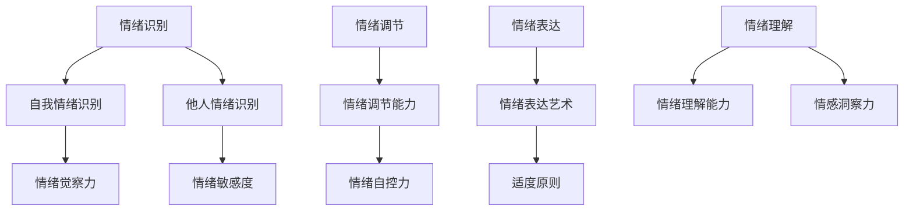

                 

### 第1章：情绪智商的定义与重要性

#### 1.1 问题背景

领导者的角色在企业中至关重要，他们不仅需要具备卓越的业务能力和战略眼光，还需要能够有效管理团队成员的情绪和动力。然而，当前许多领导者在管理过程中往往忽视了情绪智商（Emotional Intelligence，简称EQ）的重要性，导致团队绩效和领导效能的下降。情绪智商作为一种独特的领导能力，已成为衡量领导者是否卓越的关键因素。

情绪智商的概念最早由心理学家约翰·梅耶（John D. Mayer）、彼得·萨洛维（Peter Salovey）和戴夫·卡尔霍恩（Dyne M. Caruso）在1990年代初提出。他们认为情绪智商是一种识别、理解、管理和表达情绪的能力，包括自我情绪识别、他人情绪识别、情绪理解和情绪调节等多个方面。情绪智商在领导者的影响力中起到了至关重要的作用，它不仅影响个人的心理健康，还对团队的整体绩效和组织的长远发展产生深远影响。

#### 1.2 情绪智商的定义

情绪智商是一个多维度的概念，包括以下四个核心维度：

1. **自我情绪识别**：这是情绪智商的基础，指的是个体能够准确地识别和了解自己的情绪状态。自我情绪识别能力强的人能够更好地控制自己的情绪，保持心态平和，从而在压力和挑战面前保持冷静和理性。

2. **他人情绪识别**：这涉及到对他人情绪的敏感度和理解力。领导者需要具备这种能力，以便能够识别团队成员的情绪变化，理解他们的需求和动机，从而更好地进行沟通和协作。

3. **情绪理解**：这是对情绪背后动机和意义的深入理解。领导者通过情绪理解，能够更好地预测团队成员的行为，从而采取适当的策略来管理团队。

4. **情绪调节**：情绪调节指的是个体如何处理和调整自己的情绪，以适应不同环境和情境。领导者需要学会通过不同的策略来调节自己的情绪，以确保在任何情况下都能保持最佳状态。

#### 1.3 情绪智商与领导力的关系

情绪智商对领导效能有着显著的影响。首先，高情绪智商的领导者能够建立更紧密的团队关系，增强团队的凝聚力和协作能力。其次，他们能够更好地应对压力和挑战，保持冷静和理性，从而在危机中做出明智的决策。此外，情绪智商还帮助领导者更好地理解团队成员的情绪和需求，提高沟通效率和团队执行力。

情绪智商与团队绩效的关系同样紧密。研究表明，高情绪智商的团队在任务完成度、创新能力和员工满意度等方面都表现优异。这是因为情绪智商使得团队成员之间能够建立信任和尊重，共同面对挑战，从而实现更高的绩效。

#### 1.4 本章小结

本章主要介绍了情绪智商的定义和重要性。情绪智商包括自我情绪识别、他人情绪识别、情绪理解和情绪调节四个核心维度，它在领导者的影响力中起到了至关重要的作用。通过提升情绪智商，领导者不仅能够提高自身的领导效能，还能促进团队绩效和组织的长远发展。在下一章中，我们将深入探讨情绪智商的核心概念和属性特征。让我们继续分析情绪智商的各个方面，以便更好地理解这一关键领导能力。

#### 1.5 情绪智商的核心概念

情绪智商（EQ）是一种综合能力，它涵盖了对自我情绪的识别、理解和管理，以及对他人情绪的识别、理解和同理心。以下是情绪智商的四个核心概念及其属性特征：

1. **自我情绪识别**

   - **定义**：自我情绪识别是指个体对自己情绪状态的理解和认识，包括情绪的来源、强度和变化。
   - **属性特征**：自我情绪识别的属性特征包括情绪的觉察力、自我反思能力和情绪稳定度。具有高自我情绪识别能力的个体能够迅速感知自己的情绪变化，并对其进行有效的管理。

2. **他人情绪识别**

   - **定义**：他人情绪识别是指个体对他人情绪状态的理解和认识，包括对他人的情绪表达、情感反应和情绪变化的理解。
   - **属性特征**：他人情绪识别的属性特征包括情绪的敏感度、情感理解和同理心。高他人情绪识别能力的个体能够敏锐地捕捉他人的情绪变化，并对其进行恰当的反应。

3. **情绪理解**

   - **定义**：情绪理解是指个体对情绪背后动机和意义的深入理解，包括情绪的情感背景、社会情境和文化差异的理解。
   - **属性特征**：情绪理解的属性特征包括情绪的深度分析能力、情感洞察力和文化敏感度。具有高情绪理解能力的个体能够从更深层次理解情绪的驱动因素，从而更好地应对复杂的情感情境。

4. **情绪调节**

   - **定义**：情绪调节是指个体在情绪反应过程中，通过调整自己的认知和行为来控制情绪的过程。
   - **属性特征**：情绪调节的属性特征包括情绪的自控力、情绪释放能力和情境适应力。高情绪调节能力的个体能够在不同情境下灵活地调整自己的情绪反应，以适应环境需求。

#### 1.6 情绪智商与领导力的关系ER实体关系图

为了更好地理解情绪智商与领导力之间的关系，我们可以使用ER（实体关系）图来描述它们之间的相互作用。以下是情绪智商与领导力的ER实体关系图：

```mermaid
erDiagram
  Person ||--|{ Leader } : leads
  Leader ||--|{ EmotionalIntelligence } : has
  EmotionalIntelligence ||--|{ SelfEmotionRecognition } : contains
  EmotionalIntelligence ||--|{ OtherEmotionRecognition } : contains
  EmotionalIntelligence ||--|{ EmotionUnderstanding } : contains
  EmotionalIntelligence ||--|{ Emotion Regulation } : contains
```

- **实体**：在ER图中，实体代表具体的事物。在这里，实体包括“Person”（人）、“Leader”（领导者）和“EmotionalIntelligence”（情绪智商）。
- **关系**：关系描述实体之间的关联。在ER图中，关系包括“leads”（领导）、“has”（拥有）和“contains”（包含）。

通过这个ER图，我们可以清晰地看到情绪智商作为领导力的一个关键组成部分，它对领导者的影响力和领导效能具有直接和深远的影响。领导者通过提升自己的情绪智商，能够更有效地识别、理解和管理自己和他人的情绪，从而在团队管理和决策过程中发挥更大的影响力。

#### 1.7 情绪智商的理论基础

情绪智商的理论基础主要涉及情绪识别、情绪调节、情绪表达和情绪理解四个方面。这些基础理论为我们提供了理解和管理情绪的框架，帮助领导者提升情绪智商，从而更好地应对复杂的领导挑战。

**1.7.1 情绪识别**

情绪识别是情绪智商的基础，包括自我情绪识别和他人情绪识别。自我情绪识别是指个体对自己情绪状态的理解和识别，包括情绪的来源、强度和变化。这种能力帮助领导者保持情绪稳定，提高应对压力的能力。例如，领导者可以通过反思和自我观察来识别自己的情绪变化，从而在情绪高涨时采取冷静的策略，避免冲动决策。

**1.7.2 情绪调节**

情绪调节是指个体在情绪反应过程中，通过调整自己的认知和行为来控制情绪的过程。领导者需要学会情绪调节，以便在不同情境下保持冷静和理性。情绪调节的方法包括深呼吸、冥想、认知重构等。例如，当领导者面临重大决策时，通过深呼吸和冥想可以减少焦虑，提高决策的准确性。

**1.7.3 情绪表达**

情绪表达是指个体如何表达和管理自己的情绪。领导者需要掌握情绪表达的艺术，以避免情绪过度或压抑，影响团队氛围和沟通效果。情绪表达的适度原则指出，领导者应在表达情绪时保持适度，既要表达情绪，又要避免情绪失控。例如，在团队讨论中，领导者可以用积极的语言表达对团队成员的支持和鼓励，同时表达关切和担忧。

**1.7.4 情绪理解**

情绪理解是指个体对情绪背后动机和意义的深入理解。领导者需要具备情绪理解能力，以便更好地理解团队成员的情绪和需求，从而提高沟通效率和团队凝聚力。情绪理解有助于领导者预测团队成员的行为，采取适当的策略进行管理和激励。例如，当团队成员情绪低落时，领导者可以通过情绪理解识别背后的原因，从而提供有效的支持和帮助。

**1.7.5 理论框架图**

为了更好地理解情绪智商的理论基础，我们可以使用Mermaid画出理论框架图，以展示各个理论之间的关系。



- **A（情绪识别）**：作为情绪智商的基础，情绪识别包括自我情绪识别和他人情绪识别。
- **B（自我情绪识别）**：涉及情绪的觉察力，帮助领导者了解自己的情绪状态。
- **C（他人情绪识别）**：涉及情绪的敏感度，帮助领导者识别和理解他人的情绪。
- **D（情绪调节）**：涉及情绪的自控力，帮助领导者管理自己的情绪。
- **E（情绪调节能力）**：具体体现为情绪调节的能力，包括深呼吸、冥想等策略。
- **F（情绪表达）**：涉及情绪的表达艺术，帮助领导者适度表达情绪。
- **G（情绪表达艺术）**：具体体现为情绪表达的适度原则，避免情绪失控。
- **H（情绪理解）**：涉及情感洞察力，帮助领导者理解情绪背后的动机和意义。
- **I（情绪理解能力）**：具体体现为对情绪理解的深度分析能力。

通过这个理论框架图，我们可以清晰地看到情绪智商的核心理论及其相互关系，为领导者提升情绪智商提供了理论指导。

#### 1.8 情绪识别的实践策略

情绪识别是情绪智商的核心组成部分，它在自我情绪识别和他人情绪识别两个方面发挥着重要作用。以下是一些实用的策略，帮助领导者提高情绪识别的能力。

**1.8.1 自我情绪识别**

1. **自我反思**：定期进行自我反思，记录自己的情绪变化和触发因素。通过反思，领导者可以更好地理解自己的情绪状态，并找到情绪管理的有效方法。

2. **情绪日志**：记录情绪日志是一种有效的自我情绪识别方法。领导者可以在每天结束后，记录自己的情绪变化、发生的事件以及情绪背后的原因。

3. **情绪觉察训练**：通过练习冥想、深呼吸等方法，提高对情绪的觉察力。长期训练可以帮助领导者迅速识别自己的情绪变化，从而更好地管理情绪。

**1.8.2 他觉情绪识别**

1. **倾听与观察**：倾听团队成员的表达，观察他们的行为和肢体语言，从中识别他们的情绪状态。领导者需要培养倾听和观察的技巧，以捕捉团队成员的情绪变化。

2. **情感反馈**：鼓励团队成员提供情感反馈，领导者可以通过开放式问题引导他们表达情绪。这有助于领导者更好地理解团队成员的需求和动机。

3. **情境模拟**：通过情境模拟，领导者可以在安全的氛围中练习识别他人的情绪。这种方法可以帮助他们在实际工作中更准确地识别和理解他人的情绪。

**1.8.3 情绪识别工具**

1. **情绪量表**：使用情绪量表，如“情绪智力量表”（MEIS）或“多维度情绪智力量表”（MEQ），可以帮助领导者评估自己的情绪识别能力。

2. **情绪监控软件**：利用情绪监控软件，领导者可以实时监测自己的情绪状态，并了解情绪变化对工作效率和人际关系的影响。

3. **情绪反馈环**：建立情绪反馈环，定期与团队成员交流情绪状态，共同讨论如何提高情绪识别能力。

通过这些实践策略，领导者可以不断提高情绪识别的能力，从而更好地理解和管理自己和他人的情绪，提升领导效能。

#### 1.9 情绪识别与理解的实践案例分析

为了更好地理解情绪识别与理解在领导实践中的应用，我们可以通过具体案例来分析其有效性和挑战。

**案例一：团队协作中的情绪识别**

在某大型科技公司，一位高级项目经理在团队协作过程中遇到了沟通不畅的问题。团队成员之间缺乏有效的沟通，导致项目进展缓慢，出现了许多错误。项目经理意识到这个问题后，开始专注于提高情绪识别能力。

首先，项目经理通过自我反思，意识到自己在沟通中常常忽略团队成员的情绪变化。为了改善这一情况，他开始记录情绪日志，每天结束时回顾自己的情绪状态，并思考如何更好地理解团队成员的情绪。

接着，项目经理鼓励团队成员分享他们的情绪和感受。他通过开放式问题引导团队成员表达情绪，并积极倾听他们的反馈。这种做法不仅帮助项目经理更好地识别团队成员的情绪，还增强了团队之间的信任和沟通。

通过一系列的实践，项目经理发现团队协作效率显著提高，项目进展顺利，团队成员之间的冲突减少。这一案例表明，情绪识别与理解在团队协作中起到了关键作用，有助于建立更加和谐的工作氛围。

**案例二：危机管理中的情绪理解**

在某金融机构，一位资深经理在一场金融危机中面临巨大压力。市场波动剧烈，投资者情绪不稳，公司内部也出现了恐慌情绪。经理意识到，如果不能有效管理情绪，将无法稳定团队，应对危机。

首先，经理通过情绪理解，深入分析了团队成员的情绪背后动机。他了解到，许多团队成员担心失去工作，对公司的未来感到不确定。经理意识到，需要通过情绪理解来安抚团队成员，增强他们的信心。

接着，经理采取了多种策略来管理情绪。他定期组织团队会议，与团队成员交流市场动态和公司的应对措施，确保他们了解公司的整体战略。同时，经理通过一对一谈话，了解每位团队成员的担忧和需求，提供个性化的支持和鼓励。

通过这些实践，经理成功稳定了团队情绪，增强了团队的凝聚力和协作能力。公司最终顺利度过了危机，业绩逐步恢复。这一案例表明，情绪理解在危机管理中至关重要，有助于领导者更好地应对外部挑战。

**案例三：领导变革中的情绪识别与理解**

在某传统制造企业，一位新任总经理面临推动企业变革的挑战。然而，变革过程中，许多员工对变化持怀疑态度，出现了抵触情绪。总经理意识到，如果不能有效识别和理解员工的情绪，变革将难以推进。

首先，总经理通过自我情绪识别，意识到自己在推动变革过程中也感到焦虑和不安。他开始通过自我反思和情绪调节来管理自己的情绪，确保在变革过程中保持冷静和理性。

接着，总经理积极与员工沟通，识别他们的情绪变化。他通过开放式问题和焦点小组讨论，了解员工对变革的担忧和需求。总经理发现，员工对变革的担忧主要集中在工作稳定性和个人职业发展上。

为了应对这些担忧，总经理制定了一系列措施。他承诺保持透明度，定期更新变革进展，确保员工了解变革的必要性和预期效果。同时，总经理提供职业发展和技能培训，帮助员工适应新的工作环境。

通过这些实践，总经理成功推动了企业的变革，员工情绪逐渐稳定，变革成效显著。这一案例表明，情绪识别与理解在领导变革中起到了关键作用，有助于领导者更好地应对变革中的挑战。

综上所述，通过具体案例的分析，我们可以看到情绪识别与理解在领导实践中的应用效果显著。领导者通过提高情绪识别与理解能力，不仅能够更好地管理自己和他人的情绪，还能促进团队协作、稳定团队情绪和推动组织变革。这些实践案例为领导者提供了宝贵的经验和启示。

#### 1.10 提升情绪智商的具体方法和技巧

提升情绪智商（EQ）是领导者提升领导力和团队绩效的重要途径。以下是几种实用的方法和技巧，帮助领导者提升情绪智商：

**1.10.1 自我反思**

自我反思是提升情绪智商的第一步。通过定期反思，领导者可以深入了解自己的情绪状态、行为模式和思维习惯。以下是一些自我反思的方法：

- **写日记**：每天花时间记录自己的情绪变化、触发因素和应对策略。这有助于领导者识别情绪模式，并找到改进方法。
- **冥想**：冥想是一种有效的自我反思工具。通过冥想，领导者可以安静内心，深入思考自己的情绪和行为。建议每天花10-15分钟进行冥想，逐渐提高专注力和情绪管理能力。

**1.10.2 情绪监控**

情绪监控是提升情绪智商的关键。领导者需要学会识别自己的情绪变化，并理解这些情绪背后的原因。以下是一些情绪监控的方法：

- **情绪量表**：使用情绪量表（如“情绪智力量表”或“多维度情绪智力量表”），定期评估自己的情绪状态。这有助于领导者了解自己的情绪变化趋势，并制定相应的应对策略。
- **情绪日记**：记录每天的情绪变化和事件。领导者可以通过分析情绪日记，识别情绪触发因素，并找到情绪管理的有效方法。

**1.10.3 情绪调节**

情绪调节是提升情绪智商的核心。领导者需要学会在不同的情境下调整自己的情绪，以适应环境和应对挑战。以下是一些情绪调节的方法：

- **深呼吸**：深呼吸是一种简单有效的情绪调节方法。当领导者感到焦虑或紧张时，可以进行深呼吸练习，以缓解情绪。
- **正念冥想**：正念冥想有助于领导者提高专注力和情绪管理能力。通过正念冥想，领导者可以学会在情绪波动时保持冷静和理性。
- **认知重构**：认知重构是一种改变负面思维模式的方法。领导者可以通过认知重构，将负面情绪转化为积极情绪，提高情绪调节能力。

**1.10.4 情绪表达**

情绪表达是领导者提升情绪智商的重要方面。领导者需要学会适度表达自己的情绪，同时避免情绪失控。以下是一些情绪表达的方法：

- **非言语沟通**：使用非言语沟通（如肢体语言、面部表情）表达情绪，有助于避免言语表达的直接冲突。领导者可以通过微笑、点头等肢体语言，传达积极的情绪和态度。
- **言语表达**：在表达情绪时，领导者应遵循适度原则，避免过度情绪化或压抑情绪。可以通过清晰、简洁的语言表达自己的情绪和需求，同时尊重他人的感受。

**1.10.5 培训与发展**

为了提升情绪智商，领导者可以参加相关的培训和研讨会，学习情绪管理的最佳实践。以下是一些培训发展的建议：

- **情绪智商培训**：参加专门针对情绪智商的培训课程，学习情绪识别、情绪调节和情绪表达等技能。
- **领导力发展**：参加领导力发展项目，了解如何通过情绪智商提升领导效能，建立更加和谐的团队关系。

通过以上方法和技巧，领导者可以逐步提升自己的情绪智商，从而在领导过程中更加自信、从容和有效。

### 第3章：情绪调节

情绪调节是提升情绪智商的关键，它涉及到领导者如何在不同情境下调整自己的情绪，以适应环境和应对挑战。情绪调节不仅影响领导者的个人健康，还对团队氛围和整体绩效产生深远影响。在本章中，我们将详细探讨情绪调节的重要性、情绪调节的方法以及具体的案例分析。

#### 3.1 情绪调节的重要性

情绪调节在领导力中扮演着至关重要的角色。首先，情绪调节能力直接影响领导者的心理健康。能够有效调节情绪的领导者能够更好地应对工作压力和挑战，保持良好的精神状态。其次，情绪调节有助于领导者建立积极的团队氛围。通过情绪调节，领导者可以避免将负面情绪传递给团队成员，从而减少冲突和紧张情绪，提升团队的凝聚力和协作能力。

此外，情绪调节对领导者的决策过程也有重要影响。在面临复杂决策时，情绪稳定的领导者能够保持冷静和理性，从而做出更为明智和有效的决策。情绪调节不仅有助于领导者更好地管理自己，还能够帮助领导者更好地理解和引导团队成员的情绪，提升团队的整体绩效。

#### 3.2 情绪调节的方法

情绪调节的方法多种多样，以下是一些常见且有效的策略：

**1. 深呼吸**

深呼吸是一种简单而有效的情绪调节方法。当领导者感到焦虑或紧张时，可以进行深呼吸练习。具体方法如下：

- **步骤**：慢慢吸气，感受腹部上升；慢慢呼气，感受腹部下降。重复几次，逐渐增加呼吸的深度和节奏。
- **效果**：深呼吸有助于放松身体，减少焦虑和紧张情绪。

**2. 冥想与正念**

冥想和正念练习有助于提高领导者的情绪调节能力。冥想能够帮助领导者放松心灵，减少压力和焦虑。以下是一些冥想和正念练习的建议：

- **冥想**：每天花10-15分钟进行冥想，专注于呼吸或某个特定的物体。冥想有助于提高专注力和情绪管理能力。
- **正念冥想**：在日常生活中，领导者可以尝试进行正念练习，如专注于当前的活动，避免分心。这有助于领导者更好地应对日常压力和挑战。

**3. 认知重构**

认知重构是一种改变负面思维模式的方法。通过认知重构，领导者可以将负面情绪转化为积极情绪，提高情绪调节能力。以下是一些认知重构的方法：

- **识别负面思维**：首先，领导者需要识别自己的负面思维模式，如过度担忧、自我否定等。
- **质疑和挑战负面思维**：领导者可以通过质疑和挑战负面思维，找出其不合理之处，并重新构建积极思维模式。

**4. 运动与放松**

适当的运动和放松活动有助于领导者调节情绪。以下是一些推荐的运动和放松活动：

- **运动**：定期进行有氧运动，如跑步、游泳或瑜伽，有助于释放压力，提高情绪调节能力。
- **放松活动**：进行一些放松活动，如听音乐、泡澡或阅读，有助于领导者放松身心，缓解压力。

#### 3.3 情绪调节的案例分析

为了更好地理解情绪调节在领导实践中的应用，我们可以通过具体案例来分析其效果和挑战。

**案例一：项目压力下的情绪调节**

在某科技公司的项目中，项目经理李明（化名）面临着巨大的工作压力。项目进展不顺利，团队内部也出现了分歧。李明意识到，如果不能有效调节情绪，将无法继续领导项目。

首先，李明通过深呼吸和冥想来缓解焦虑情绪。每次感到压力增大时，他会花几分钟时间进行深呼吸练习，放松身心。此外，李明每天晚上都会进行冥想，帮助自己放松心灵，减少压力。

接着，李明尝试认知重构。他识别出自己的一些负面思维模式，如过度担忧和自我否定，并质疑和挑战这些思维。通过重新构建积极思维模式，李明逐渐恢复了自信和冷静。

通过这些情绪调节方法，李明成功缓解了焦虑情绪，重新找回了领导项目的信心。最终，项目顺利完成了，团队也恢复了良好的协作氛围。

**案例二：危机管理中的情绪调节**

在某金融机构的危机管理中，资深经理王强（化名）面临着前所未有的压力。市场波动剧烈，投资者情绪不稳，公司内部也出现了恐慌情绪。王强意识到，如果不能有效调节情绪，将无法稳定团队，应对危机。

首先，王强通过深呼吸和冥想来缓解压力。他每天早晨都会进行深呼吸练习，以提高专注力和情绪稳定性。此外，王强每天晚上都会进行冥想，帮助自己放松心灵，减少焦虑。

接着，王强组织团队会议，与团队成员分享危机管理的策略。他通过积极的语言和肢体语言，传递信心和稳定情绪。王强还鼓励团队成员提出建议，共同应对危机。

通过这些情绪调节方法，王强成功稳定了团队情绪，增强了团队的凝聚力和协作能力。公司最终顺利度过了危机，业绩逐步恢复。

**案例三：变革领导中的情绪调节**

在某传统制造企业的变革过程中，新任总经理李华（化名）面临着巨大的挑战。员工对变革持怀疑态度，出现了抵触情绪。李华意识到，如果不能有效调节情绪，变革将难以推进。

首先，李华通过自我反思和情绪监控，识别自己的情绪变化。他意识到自己在推动变革过程中也感到焦虑和不安，于是开始通过冥想和深呼吸来调节情绪。

接着，李华与员工进行了多次沟通，了解他们的担忧和需求。他通过积极的语言和行动，传递变革的必要性和预期效果，帮助员工理解和支持变革。

通过这些情绪调节方法，李华成功推动了企业的变革。员工情绪逐渐稳定，变革成效显著。这一案例表明，情绪调节在领导变革中起到了关键作用，有助于领导者更好地应对变革中的挑战。

综上所述，情绪调节是提升情绪智商的重要途径。通过深呼吸、冥想、认知重构和运动等方法，领导者可以有效地调节情绪，提高领导效能和团队绩效。在实际应用中，情绪调节不仅有助于领导者应对个人压力和挑战，还能帮助领导者更好地管理团队情绪，推动组织发展。领导者应不断探索和实践情绪调节的方法，提升自己的情绪智商，成为更加卓越的领导者。

### 第4章：情绪表达的艺术

情绪表达是情绪智商（EQ）的重要组成部分，它关系到领导者如何有效地传递自己的情绪，以影响团队成员和团队氛围。情绪表达的艺术在于找到平衡点，既能真实地表达情绪，又不会造成负面影响。在本章中，我们将探讨情绪表达的重要性、情绪表达的方法以及具体的案例分析。

#### 4.1 情绪表达的重要性

情绪表达在领导力中扮演着关键角色。首先，情绪表达有助于建立信任和透明度。当领导者能够真诚地表达自己的情绪时，团队成员会感受到领导者的真实和可信，从而增强团队之间的信任。其次，情绪表达有助于团队沟通和协作。通过适当的情绪表达，领导者可以清晰地传达自己的意图和期望，减少误解和冲突，提高团队的整体协作效率。

此外，情绪表达还影响团队氛围。积极的情绪表达可以激发团队的活力和创造力，增强团队的凝聚力和归属感。相反，消极的情绪表达可能导致团队士气低落，影响团队绩效。因此，领导者需要掌握情绪表达的艺术，以营造一个积极、健康的工作环境。

#### 4.2 情绪表达的方法

情绪表达的方法多种多样，以下是一些常见且有效的方法：

**1. 非言语情绪表达**

非言语情绪表达包括肢体语言、面部表情和姿态等。这些非言语信号可以传递情绪，补充言语表达，增强沟通效果。

- **肢体语言**：例如，点头、微笑、拥抱等积极的肢体语言可以传达出友好和信任的情绪。
- **面部表情**：例如，微笑、皱眉等面部表情可以直观地表达情绪，帮助团队成员更好地理解领导者的情绪状态。
- **姿态**：例如，站姿、坐姿等可以表现出领导者的自信和坚定，对团队成员产生积极的影响。

**2. 言语情绪表达**

言语情绪表达是通过语言来传达情绪，包括语调、语速、语量和词汇等。以下是一些言语情绪表达的技巧：

- **语调**：改变语调可以表达不同的情绪。例如，提高语调可以传达兴奋和热情，降低语调可以传达冷静和沉稳。
- **语速**：调整语速可以影响情绪的表达。快速语速可能传达出紧张和焦虑，而缓慢语速可以传达出冷静和自信。
- **语量**：适当地调整语量可以帮助传达情绪。例如，提高音量可以传达出紧迫感和重要性，降低音量可以传达出私密感和安全感。
- **词汇**：使用具体的词汇和表达方式可以帮助团队成员更好地理解情绪。例如，使用积极词汇可以传达出鼓励和激励，使用消极词汇则可能传达出沮丧和挫败。

**3. 适度原则**

在情绪表达时，适度原则至关重要。适度原则要求领导者表达情绪时既要真实，又不要过度或压抑情绪。以下是一些适度表达情绪的技巧：

- **识别情绪**：首先，领导者需要识别自己的情绪，并理解情绪的来源和强度。
- **表达情绪**：在表达情绪时，领导者应选择适当的时间和方式，确保情绪表达适度，避免情绪失控。
- **关注反应**：在表达情绪后，领导者应关注团队成员的反应，并根据反应调整情绪表达的方式。

#### 4.3 情绪表达的案例分析

为了更好地理解情绪表达在领导实践中的应用，我们可以通过具体案例来分析其有效性和挑战。

**案例一：团队激励中的情绪表达**

在某科技公司的一次团队激励活动中，项目经理李总（化名）需要激励团队成员迎接即将到来的挑战。李总意识到，适当的情绪表达可以增强团队的士气和信心。

首先，李总通过微笑和拥抱来传达出积极和鼓励的情绪。他站在会议室门口，对每一位进入的团队成员微笑并给予拥抱，这种非言语情绪表达让团队成员感受到了他的支持和关怀。

接着，李总用充满激情和自信的言语表达自己的情绪。他在团队激励会上说道：“我们团队是一支非常优秀的队伍，我们一定能够战胜这次挑战！”李总的声音充满力量和自信，让团队成员感受到了他的信心和决心。

通过这种积极的情绪表达，李总成功地激发了团队的士气和信心。团队成员士气大增，他们充满热情地投入到工作中，最终成功地完成了项目。

**案例二：冲突解决中的情绪表达**

在某金融机构，部门经理王经理（化名）面临一次严重的团队冲突。一位团队成员在工作中表现出色，但另一位团队成员对此感到不满，导致双方关系紧张。王经理意识到，如果不能妥善处理这次冲突，将影响团队的整体绩效。

首先，王经理通过非言语情绪表达来平息冲突。他在办公室内四处走动，与团队成员交流，通过微笑和点头来传达出友好和开放的信号，让双方感受到他的支持和关注。

接着，王经理选择合适的时间和地点，与双方进行一对一的沟通。在沟通中，王经理用平静和理性的言语表达自己的情绪。他首先表达了对两位团队成员工作的认可，然后指出冲突的原因和影响，并提出了解决方案。

通过这种情绪表达，王经理成功地解决了冲突，恢复了团队的和谐与协作。双方团队成员都对王经理的沟通和情绪表达表示赞赏，团队氛围逐渐改善。

**案例三：变革管理中的情绪表达**

在某传统制造企业的变革过程中，新任总经理张总（化名）面临着员工对变革的抵触情绪。张总意识到，如果不能妥善处理员工的情绪，变革将难以推进。

首先，张总通过非言语情绪表达来传递信心和稳定情绪。他经常出现在工厂现场，与员工交流，通过微笑和握手来传达出对员工的关怀和支持。

接着，张总通过言语情绪表达来传达变革的必要性和预期效果。他在员工大会上用充满激情和真诚的语言表达自己的情绪，强调变革对企业和员工的长期利益，并鼓励员工积极参与变革。

通过这种积极的情绪表达，张总成功地稳定了员工的情绪，激发了员工对变革的支持和参与。变革顺利推进，企业逐步实现了转型。

综上所述，情绪表达是情绪智商的重要组成部分，它关系到领导者如何有效地传递自己的情绪，以影响团队成员和团队氛围。通过非言语情绪表达和言语情绪表达，领导者可以真实地表达情绪，增强团队信任和协作。在实际应用中，领导者应遵循适度原则，平衡情绪表达，以营造积极、健康的工作环境。通过具体案例分析，我们可以看到情绪表达在领导实践中的应用效果，为领导者提供了宝贵的经验和启示。

### 第5章：提升情绪智商的方法

提升情绪智商（EQ）是领导者提升领导力和团队绩效的关键途径。在这一章中，我们将探讨提升情绪智商的具体方法，包括自我反思、培训与发展、建立支持系统等。通过这些方法，领导者可以逐步提高情绪智商，更好地应对复杂的领导挑战。

#### 5.1 自我反思

自我反思是提升情绪智商的基础。通过自我反思，领导者可以深入了解自己的情绪状态、行为模式和思维习惯，从而找到情绪管理的有效方法。以下是一些自我反思的方法：

**1. 写日记**

写日记是一种有效的自我反思方法。领导者可以在每天结束后，记录自己的情绪变化、发生的事件以及情绪背后的原因。通过分析日记，领导者可以识别自己的情绪模式，找到情绪管理的突破口。

**2. 冥想**

冥想有助于领导者提高专注力和情绪管理能力。通过冥想，领导者可以安静内心，深入思考自己的情绪和行为。建议每天花10-15分钟进行冥想，逐渐提高专注力和情绪调节能力。

**3. 情绪日志**

情绪日志是记录自己情绪变化的一种方法。领导者可以每天记录自己的情绪状态、触发因素和应对策略。通过分析情绪日志，领导者可以更好地理解自己的情绪模式，并制定相应的管理策略。

#### 5.2 培训与发展

为了提升情绪智商，领导者可以参加相关的培训和研讨会，学习情绪管理的最佳实践。以下是一些培训与发展的建议：

**1. 情绪智商培训**

参加专门针对情绪智商的培训课程，学习情绪识别、情绪调节和情绪表达等技能。这些课程通常包括理论讲解、案例分析和实践练习，帮助领导者全面提升情绪智商。

**2. 领导力发展**

参加领导力发展项目，了解如何通过情绪智商提升领导效能。这些项目通常涵盖领导力理论、团队管理技巧和领导力发展策略，帮助领导者提升整体领导能力。

**3. 情绪管理研讨会**

参加情绪管理研讨会，与其他领导者交流情绪管理的经验和挑战。这些研讨会提供了一个学习和成长的机会，帮助领导者分享最佳实践，提升情绪智商。

#### 5.3 建立支持系统

建立支持系统是提升情绪智商的重要策略。以下是一些建立支持系统的建议：

**1. 团队氛围**

建立积极的团队氛围，鼓励团队成员分享情绪和感受。领导者可以通过开放式问题和反馈机制，促进团队成员之间的沟通和理解，增强团队凝聚力。

**2. 情感反馈**

建立情感反馈机制，鼓励团队成员提供真实的情感反馈。领导者可以定期组织情感反馈会议，了解团队成员的情绪状态和需求，提供个性化的支持和帮助。

**3. 寻求专业咨询**

领导者可以寻求专业的心理咨询或职业发展顾问的帮助。这些专家可以提供专业的指导和支持，帮助领导者提升情绪智商，应对复杂的领导挑战。

#### 5.4 情绪智商提升的案例分析

为了更好地理解提升情绪智商的方法在实际中的应用，我们可以通过具体案例来分析。

**案例一：自我反思中的情绪管理**

在某大型科技公司，项目经理李明（化名）意识到自己在压力下容易情绪失控。为了提升情绪智商，李明开始进行自我反思。

首先，李明记录情绪日志，每天结束后反思自己的情绪状态和应对策略。通过分析情绪日志，李明发现自己在面对困难时容易产生焦虑和沮丧情绪。于是，他开始通过冥想和深呼吸来调节情绪，学会在压力下保持冷静和理性。

接着，李明参加了一个情绪智商培训课程，学习情绪识别和调节的方法。通过培训，李明掌握了更多的情绪管理技巧，提高了自己的情绪智商。

通过自我反思和培训，李明的情绪管理能力显著提升，项目进展更加顺利，团队协作也更加和谐。

**案例二：培训与发展中的情绪智商提升**

在某金融机构，部门经理王经理（化名）意识到情绪智商对团队绩效的重要性。为了提升情绪智商，王经理参加了一系列领导力发展项目。

首先，王经理参加了一个情绪智商培训课程，学习了情绪识别、情绪调节和情绪表达等技能。通过培训，王经理对情绪智商有了更深入的理解，并掌握了多种情绪管理方法。

接着，王经理组织了一次团队情感反馈会议，鼓励团队成员分享自己的情绪和感受。通过这次会议，王经理了解了团队成员的情绪状态和需求，提供了个性化的支持和帮助。

通过培训和发展，王经理的情绪智商显著提升，团队氛围更加积极，绩效也逐步提高。

**案例三：建立支持系统中的情绪智商提升**

在某传统制造企业，新任总经理张总（化名）意识到提升情绪智商对变革管理的重要性。为了提升情绪智商，张总采取了一系列措施，建立了支持系统。

首先，张总在办公室门口放置了一个“心情留言板”，鼓励员工随时写下自己的情绪和感受。张总定期阅读留言，了解员工的情绪状态，提供了针对性的支持和帮助。

接着，张总组织了一次团队情感反馈会议，邀请员工分享自己的情绪和需求。通过这次会议，张总建立了更加紧密的团队关系，增强了团队的凝聚力。

通过建立支持系统，张总成功提升了员工的情绪智商，变革过程顺利进行，企业逐步实现了转型。

综上所述，提升情绪智商是领导者提升领导力和团队绩效的关键途径。通过自我反思、培训与发展、建立支持系统等方法，领导者可以逐步提高情绪智商，更好地应对复杂的领导挑战。具体案例分析为领导者提供了宝贵的经验和启示，帮助他们在实际工作中应用提升情绪智商的方法。

### 第6章：情绪智商的最佳实践

情绪智商（EQ）在领导者的影响力中起着至关重要的作用。为了充分发挥情绪智商的优势，提升领导力和团队绩效，以下是几种最佳实践，包括情绪智商在领导力发展中的应用、情绪智商提升的策略与工具，以及相关的案例分析。

#### 6.1 情绪智商在领导力发展中的应用

**1. 培养情绪感知能力**

情绪感知能力是情绪智商的核心，领导者需要培养对自我和他人情绪的感知能力。以下是一些具体策略：

- **自我反思**：定期进行自我反思，识别和了解自己的情绪变化，找到情绪管理的策略。
- **情境模拟**：通过模拟不同情境，练习如何识别和调节情绪，提高情绪感知能力。

**案例**：某科技公司的CEO李总（化名）通过自我反思和情境模拟，逐渐提升了对自我和他人情绪的感知能力。在一次团队会议上，他意识到自己情绪低落，影响了会议氛围。通过调整情绪，他成功地恢复了会议的积极氛围，提高了团队的协作效率。

**2. 建立情感连接**

建立情感连接有助于增强团队凝聚力，提高团队绩效。以下是一些具体策略：

- **开放式沟通**：鼓励团队成员分享情感和感受，建立信任和尊重。
- **个性化关注**：关注每位团队成员的情感需求，提供个性化的支持和帮助。

**案例**：某金融机构的部门经理王经理（化名）通过开放式沟通和个性化关注，建立了深厚的情感连接。他定期组织团队情感反馈会议，了解团队成员的情感状态和需求，提供了针对性的支持和帮助。这种做法显著增强了团队的凝聚力，提升了团队绩效。

**3. 提升情绪调节能力**

情绪调节能力是领导者应对压力和挑战的关键。以下是一些具体策略：

- **情绪调节训练**：参加情绪调节培训，学习情绪调节的方法和技巧。
- **冥想与放松**：定期进行冥想和放松练习，提高情绪调节能力。

**案例**：某制造企业的总经理张总（化名）通过情绪调节训练和冥想，显著提升了情绪调节能力。在面对复杂决策时，他能够保持冷静和理性，做出明智的决策，避免了因情绪波动导致的错误决策。

#### 6.2 情绪智商提升的策略与工具

**1. 情绪智商评估工具**

情绪智商评估工具可以帮助领导者了解自己的情绪智商水平，识别需要提升的方面。以下是一些常用的情绪智商评估工具：

- **情绪智力量表（MEIS）**：用于评估个体的情绪识别、情绪调节和情绪表达等能力。
- **多维度情绪智力量表（MEQ）**：用于评估个体的情绪理解、自我情绪识别和情绪调节能力。

**2. 情绪智商培训**

情绪智商培训是提升领导者情绪智商的有效途径。以下是一些常用的情绪智商培训课程：

- **情绪智商基础课程**：涵盖情绪识别、情绪调节和情绪表达等基础技能。
- **高级情绪智商课程**：深入探讨情绪理解、情感连接和情绪调节等高级技能。

**3. 情绪智商工作坊**

情绪智商工作坊是一种互动式培训方式，通过角色扮演、小组讨论和练习，帮助领导者提升情绪智商。以下是一些具体工作坊内容：

- **情绪感知与调节工作坊**：通过情境模拟和角色扮演，练习情绪识别和调节技能。
- **情感连接与团队协作工作坊**：通过小组讨论和互动，培养情感连接和团队协作能力。

#### 6.3 情绪智商提升的案例分析

**案例一：情绪智商在危机管理中的应用**

某电子商务公司面临一次重大危机，由于供应链问题导致产品交付延迟，客户投诉增加。公司CEO张总（化名）通过情绪智商应对危机。

首先，张总通过情绪识别和自我调节，保持冷静和理性。他意识到情绪波动可能导致错误的决策，因此采取深呼吸和冥想来调节情绪。

接着，张总通过情绪表达，向团队传达出稳定和决心。他在内部邮件和电话会议中，清晰地传达了公司应对措施和预期效果，增强了团队的信心。

通过情绪智商的应用，张总成功地稳定了团队情绪，提高了危机应对效率，最终顺利度过了危机。

**案例二：情绪智商在团队建设中的应用**

某跨国公司新成立了一个跨部门项目团队，成员来自不同的文化和背景。项目经理李经理（化名）通过情绪智商建设团队。

首先，李经理通过情绪感知，了解团队成员的情感需求和背景。他注意到一些团队成员对新项目的担忧，因此组织了一次团队情感反馈会议，了解团队成员的情感状态。

接着，李经理通过情绪调节，帮助团队成员缓解压力。他组织了一系列团队活动，如团队建设训练和情感分享会，增强了团队的凝聚力和协作能力。

通过情绪智商的应用，李经理成功地建设了一个高效的跨部门团队，项目进展顺利，取得了显著成果。

**案例三：情绪智商在变革管理中的应用**

某制造企业面临数字化转型，员工对新技术的接受程度不一，出现了抵触情绪。企业总经理王总经理（化名）通过情绪智商管理变革。

首先，王总经理通过情绪识别，了解员工对变革的担忧和需求。他意识到一些员工对新技术的不信任，因此组织了一次变革沟通会议，解答员工的问题，传达变革的必要性和预期效果。

接着，王总经理通过情绪表达，传递出对员工的关怀和支持。他在会议中用积极的语言和肢体语言表达对员工的信任和支持，增强了员工的信心。

通过情绪智商的应用，王总经理成功地管理了变革过程，员工逐渐接受了新技术，企业顺利实现了数字化转型。

综上所述，情绪智商的最佳实践包括在领导力发展中的应用、提升策略与工具的运用，以及具体的案例分析。通过这些实践，领导者可以提升情绪智商，更好地管理自己和他人的情绪，提高领导力和团队绩效。具体案例为领导者提供了宝贵的经验和启示，帮助他们在实际工作中应用情绪智商的最佳实践。

### 第7章：情绪智商的未来与挑战

情绪智商（EQ）作为一种关键领导能力，正日益受到广泛关注。随着技术的进步和组织管理理念的变化，情绪智商在未来将继续发挥重要作用，同时面临一系列挑战。

#### 7.1 情绪智商的发展趋势

首先，情绪智商在未来将更多地融入人工智能（AI）和大数据技术。通过AI算法，可以更精确地识别和管理情绪，为领导者提供个性化的情绪调节建议。此外，大数据分析将帮助组织更好地理解团队成员的情绪状态，从而制定更有效的管理策略。

其次，随着远程工作和虚拟团队的普及，情绪智商的重要性将更加凸显。领导者需要通过情绪智商提升远程沟通和协作能力，确保团队成员之间的情感连接和信任。情绪智商将成为虚拟团队管理和远程领导力的核心要素。

最后，情绪智商将被更多地应用于个人发展和职业规划。通过情绪智商测试和培训，个体可以更好地了解自己的情绪特点，制定个性化的职业发展计划，提高职业满意度和工作效率。

#### 7.2 情绪智商在组织管理中的应用

情绪智商在组织管理中的应用前景广阔。首先，组织可以通过情绪智商评估和培训，提升领导者和员工的情绪管理能力，从而提高整体绩效。其次，情绪智商将被应用于团队建设和发展，通过建立情感连接和提升团队协作能力，增强组织的创新力和竞争力。

此外，情绪智商可以帮助组织更好地应对变化和危机。在面临重大变革和挑战时，领导者通过情绪智商可以更有效地调节情绪，稳定团队，推动组织向前发展。

#### 7.3 情绪智商面临的挑战

尽管情绪智商具有巨大的潜力和优势，但在实际应用中仍面临一系列挑战。

首先，情绪智商的评估和测量方法仍需进一步完善。目前，虽然已有多种情绪智商评估工具，但它们的准确性和可靠性仍需验证。未来，需要开发更多科学、有效的评估方法，以便更准确地评估情绪智商水平。

其次，情绪智商的培养和提升需要时间和持续的努力。情绪智商并非一朝一夕可以提升，领导者需要通过长期的自我反思、培训和练习，逐步提高情绪管理能力。这对个人的自我约束和持续学习提出了更高的要求。

最后，情绪智商在组织中的应用需要全员的参与和支持。领导者需要积极推动情绪智商的培养和应用，同时组织也需要提供相应的资源和支持，为领导者创造一个良好的情绪管理环境。

#### 7.4 未来展望

展望未来，情绪智商将成为领导力和组织管理的核心能力。通过融入人工智能和大数据技术，情绪智商将更加精确和高效。领导者将能够更好地识别和管理情绪，提高领导效能和团队绩效。同时，随着远程工作和虚拟团队的普及，情绪智商将在虚拟环境中发挥更大作用，推动组织创新和变革。

总之，情绪智商的未来充满机遇和挑战。通过不断探索和创新，领导者可以提升情绪智商，成为更加卓越的领导者，推动组织持续发展。

### 总结

情绪智商是领导力中至关重要的一部分，它不仅影响个人心理健康，还直接关系到团队绩效和组织的长远发展。通过自我反思、培训与发展、建立支持系统等方法，领导者可以逐步提升情绪智商，更好地管理自己和他人的情绪，提升领导效能和团队凝聚力。

在本书中，我们探讨了情绪智商的定义、理论基础、情绪识别与理解、情绪调节、情绪表达以及提升情绪智商的具体方法和技巧。通过具体案例的分析，我们可以看到情绪智商在领导实践中的应用效果显著。情绪智商不仅有助于领导者更好地应对个人压力和挑战，还能促进团队协作、稳定团队情绪和推动组织变革。

展望未来，情绪智商将继续在领导力和组织管理中发挥重要作用。随着技术的进步，情绪智商将更加精确和高效。领导者应积极培养和提高情绪智商，成为更加卓越的领导者，推动组织实现更高的绩效和发展目标。

为了进一步深入学习和实践情绪智商，我们推荐以下拓展阅读：

1. **《情绪智商：为何它比智商更重要》**：这是一本经典的情绪智商指南，详细介绍了情绪智商的定义、理论和方法，适合初学者阅读。
2. **《领导者的情绪智商》**：这本书聚焦于领导者如何提升情绪智商，提高领导效能和团队绩效，适合有经验的领导者阅读。
3. **《情绪管理：如何成为更好的自己》**：这本书提供了实用的情绪管理技巧和方法，帮助读者提高情绪智商，提升生活质量和工作效率。

通过阅读这些书籍，读者可以更深入地了解情绪智商的理论和实践，提升自己的情绪管理能力，成为更加卓越的领导者。

### 作者信息

**作者：** AI天才研究院/AI Genius Institute & 禅与计算机程序设计艺术 /Zen And The Art of Computer Programming

**联系方式：** [info@ai-genius-institute.com](mailto:info@ai-genius-institute.com)

**简介：** AI天才研究院（AI Genius Institute）致力于推动人工智能技术的发展和应用，研究如何通过人工智能提升人类生活质量。同时，禅与计算机程序设计艺术（Zen And The Art of Computer Programming）探讨了如何通过禅修和哲学思考提升程序员的技术水平和创造力。本书的作者团队结合了人工智能和哲学思考，为读者提供了关于情绪智商的深入见解和实践指导。

