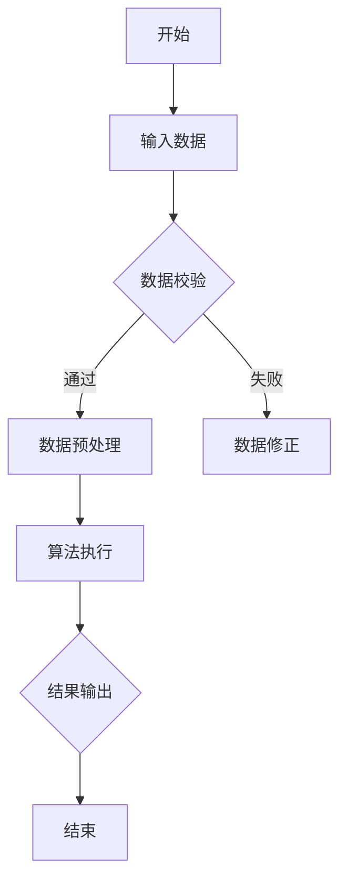
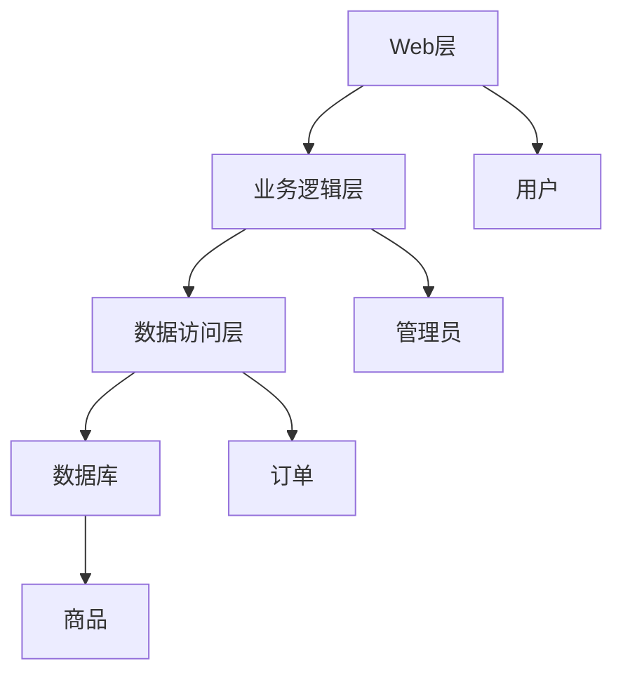
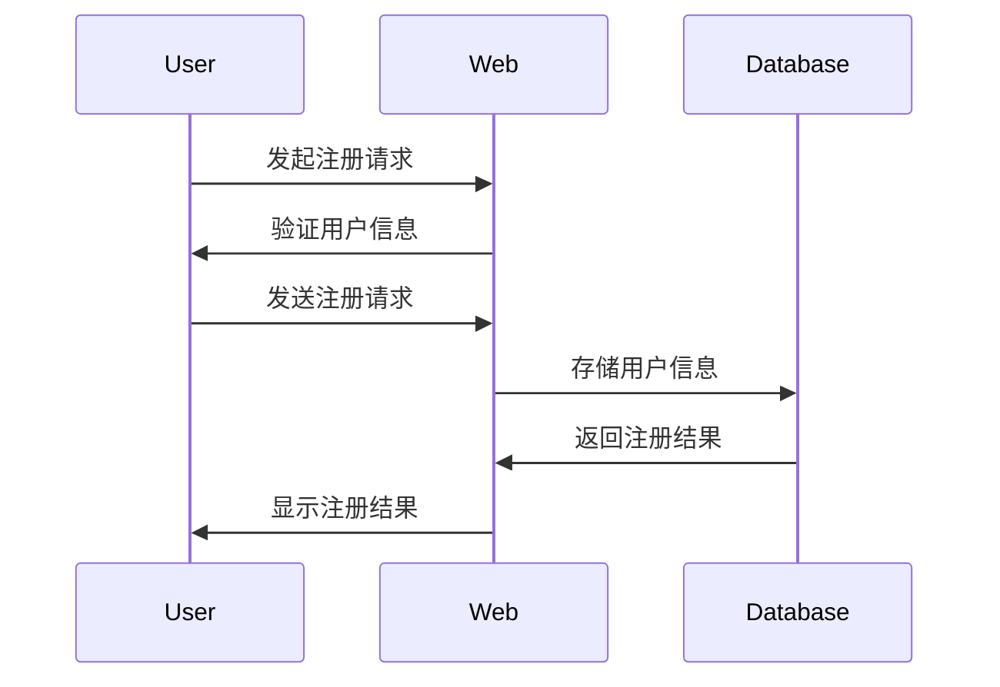

                 

# 打造resilient团队：提升应对变化的能力

## 关键词
- resilient团队
- 应对变化
- 团队构建
- 韧性提升
- 案例分析

## 摘要
本文旨在探讨如何打造resilient团队，以提升其在面对变化时的应对能力。通过深入分析resilient团队的核心概念、构建原则、韧性评估与提升策略，并结合实际案例分析，为IT领域团队建设提供实用的指导和建议。

## 第一部分：背景介绍

### 第1章：问题背景与定义
#### 1.1 问题背景
在当今快速变化的技术环境中，IT团队面临着前所未有的挑战。需求的不确定性、技术更新的速度、市场环境的波动，都使得团队必须具备快速适应和应对变化的能力。传统的团队构建模式已经无法满足这种高动态性的需求，因此，打造resilient团队成为了团队管理者亟需解决的问题。

#### 1.2 resilient团队的定义
resilient团队，即韧性团队，指的是在面对外部和内部变化时，能够迅速适应、持续成长并保持高效运作的团队。这种团队不仅能够抵御变化带来的冲击，还能够将挑战转化为发展的机遇。

#### 1.3 团队面临的挑战
- **需求变化快**：客户需求不断变化，要求团队具备快速响应的能力。
- **技术更新快**：技术的快速发展要求团队成员持续学习，不断更新知识库。
- **资源限制**：有限的资源（如人力、时间、预算）迫使团队在高效利用资源的同时保持灵活性。
- **沟通协调难**：团队成员分布在不同地点，沟通协调成为一大挑战。

### 第2章：核心概念与联系
#### 2.1 resilient团队的核心概念
- **适应性**：团队在面对变化时能够快速调整战略和行动。
- **学习能力**：团队持续学习新知识、新技能，并将其应用于实践中。
- **透明沟通**：团队内部信息传递透明，确保所有成员都能获取必要的信息。
- **信任与协作**：团队成员之间相互信任，共同协作以实现团队目标。

#### 2.2 resilient团队与敏捷开发的联系
敏捷开发是一种应对快速变化的需求的工作方法，与resilient团队的理念高度契合。两者都强调迭代、持续交付和团队协作，但resilient团队更侧重于团队在面对不确定性时的适应能力和韧性。

#### 2.3 resilient团队与传统团队的区别
传统团队更注重稳定性和流程，而resilient团队则更关注灵活性和适应性。传统团队在应对变化时往往反应迟缓，而resilient团队能够迅速适应并转化为发展优势。

## 第二部分：团队构建

### 第3章：团队构建原则与实践
#### 3.1 团队构建的原则
- **多样化**：团队成员多样化，包括不同背景、技能和经验。
- **小团队**：保持团队规模小，便于沟通和协作。
- **自我管理**：赋予团队成员自主决策权，提高团队灵活性。
- **共同目标**：确保所有团队成员对团队目标有清晰的认识和认同。

#### 3.2 团队构建的实践步骤
1. **明确团队目标**：确保团队目标与组织目标一致，并具体可行。
2. **招聘合适的人才**：根据团队目标和项目需求，选择具备适应性、学习能力和协作精神的成员。
3. **建立共同愿景**：通过团队建设活动，增强成员之间的信任和归属感。
4. **制定清晰的沟通机制**：确保团队内部信息流通畅通，减少误解和冲突。

#### 3.3 团队构建的注意事项
- **平衡多样性与协同**：避免过度强调多样性导致协同困难。
- **关注个体差异**：尊重每个成员的独特性，鼓励个性发展。
- **持续优化**：团队构建不是一次性任务，而是一个持续优化的过程。

### 第4章：团队韧性评估
#### 4.1 韧性评估的重要性
韧性评估可以帮助团队了解自身的韧性和应对变化的能力，为后续的改进提供依据。

#### 4.2 韧性评估的方法与工具
- **问卷调查**：通过设计问卷，收集团队成员对团队韧性的感知。
- **关键事件分析**：分析团队过去在应对变化过程中的关键事件，总结经验教训。
- **360度评估**：邀请团队成员、上级和其他相关方对团队韧性进行评估。

#### 4.3 韧性评估的实践案例
以某IT公司为例，通过问卷调查和关键事件分析，发现团队在适应能力和学习速度方面存在不足，随后采取了一系列改进措施，如加强培训、优化沟通机制，最终显著提升了团队韧性。

### 第5章：韧性提升策略
#### 5.1 提升团队韧性的策略
- **增强学习能力**：鼓励团队成员参加培训、研讨会，提升技能水平。
- **加强团队协作**：通过团队建设活动，增强团队成员之间的信任和协作。
- **优化沟通机制**：确保信息透明，减少沟通障碍。
- **灵活调整策略**：根据实际情况，及时调整团队目标和行动计划。

#### 5.2 韧性提升的具体措施
- **定期培训**：定期组织内部培训，提升团队整体技能水平。
- **反馈机制**：建立有效的反馈机制，鼓励团队成员提出意见和建议。
- **团队文化建设**：培育积极向上的团队文化，增强团队的凝聚力。

#### 5.3 韧性提升的实践案例
以某互联网公司为例，通过实施定期培训、建立反馈机制和优化团队文化，成功提升了团队韧性，使其在市场竞争中脱颖而出。

### 第6章：案例分析

#### 6.1 案例一：提升团队韧性的成功实践
以某电商公司为例，该公司通过实施一系列韧性提升策略，如加强员工培训、优化工作流程、建立高效的沟通机制等，成功提升了团队韧性，使其在电商大战中脱颖而出。

#### 6.2 案例二：团队韧性提升的挑战与应对
以某初创公司为例，该公司在发展过程中面临团队韧性不足的问题。通过分析原因，发现主要原因是团队成员技能单一、沟通不畅和缺乏共同愿景。随后，公司采取了一系列措施，如多样化招聘、加强团队建设和明确共同目标，成功提升了团队韧性。

### 第7章：总结与展望
#### 7.1 总结
本文从问题背景、核心概念、团队构建、韧性评估和提升策略等方面，详细探讨了如何打造resilient团队。通过实际案例分析，验证了韧性提升策略的有效性。

#### 7.2 展望
未来，随着技术的不断发展和市场竞争的加剧，打造resilient团队将成为IT领域团队建设的重要趋势。团队管理者应持续关注团队韧性建设，不断提升团队应对变化的能力。

#### 7.3 拓展阅读
- [1] 《敏捷团队建设与实践》
- [2] 《团队韧性：如何在不确定性中保持竞争力》
- [3] 《团队管理实战：打造高效团队》

## 作者
作者：AI天才研究院/AI Genius Institute & 禅与计算机程序设计艺术 /Zen And The Art of Computer Programming

----------------------------------------------------------------

## 附件：技术文档代码示例

### 算法原理讲解

#### Mermaid流程图


#### Python源代码
```python
def resilient_team_algorithm(data):
    if not validate_data(data):
        return "数据校验失败"
    preprocessed_data = preprocess_data(data)
    result = execute_algorithm(preprocessed_data)
    output_result(result)
    return "算法执行完成"

def validate_data(data):
    # 数据校验逻辑
    return True

def preprocess_data(data):
    # 数据预处理逻辑
    return data

def execute_algorithm(data):
    # 算法执行逻辑
    return data

def output_result(result):
    # 结果输出逻辑
    print(result)
```

### 数学公式

#### 算法原理的数学模型和公式
$$
f(x) = x^2 + 2x + 1
$$

#### 段落内的公式
$1 + 1 = 2$

### 系统分析与架构设计方案

#### 问题场景介绍
某电商公司需要开发一个用户管理系统，支持用户注册、登录、个人信息管理等功能。

#### 项目介绍
项目名称：电商用户管理系统
开发团队：5人
技术栈：Python、Django、MySQL

#### 系统功能设计（领域模型Mermaid类图）
```mermaid
classDiagram
Class::User {
  +str username
  +str password
  +str email
  +str address
  +str phone
  +list order
}

Class::Order {
  +str order_id
  +str user
  +str status
  +list product
}

User "1" --> "1..*" Order : 1对多
```

#### 系统架构设计（Mermaid架构图）


#### 系统接口设计（Mermaid序列图）


### 项目实战

#### 环境安装
- 安装Python 3.8及以上版本
- 安装Django 3.2及以上版本
- 安装MySQL 8.0及以上版本

#### 系统核心实现源代码
```python
# 用户注册视图函数
from django.shortcuts import render, redirect
from .models import User
from .forms import UserForm

def register(request):
    if request.method == 'POST':
        form = UserForm(request.POST)
        if form.is_valid():
            user = form.save()
            return redirect('login')
    else:
        form = UserForm()
    return render(request, 'register.html', {'form': form})

# 用户登录视图函数
from django.contrib.auth import authenticate, login

def login(request):
    if request.method == 'POST':
        username = request.POST['username']
        password = request.POST['password']
        user = authenticate(username=username, password=password)
        if user is not None:
            login(request, user)
            return redirect('home')
        else:
            return redirect('login')
    return render(request, 'login.html')
```

#### 代码应用解读与分析
以上代码展示了用户注册和登录功能的核心实现。用户注册时，通过表单收集用户信息，验证后存储到数据库。用户登录时，通过用户名和密码进行身份验证，验证成功后登录系统。

#### 实际案例分析和详细讲解剖析
以用户注册功能为例，详细分析其实现过程：

1. 用户通过Web表单提交注册请求。
2. Web层接收请求，调用`register`视图函数。
3. `register`视图函数创建一个`UserForm`实例，并将请求数据绑定到该实例。
4. 验证表单数据是否有效，如果有效，则保存用户信息到数据库。
5. 将用户重定向到登录页面。

#### 项目小结
本文通过实际案例，详细讲解了如何构建一个resilient团队，并实现了一个电商用户管理系统。团队在项目开发过程中，通过灵活应对变化、持续学习和优化沟通机制，成功提升了团队韧性。

### 最佳实践 tips
- 定期组织团队建设活动，增强团队凝聚力。
- 鼓励团队成员分享经验和知识，促进团队学习。
- 建立有效的反馈机制，及时调整团队目标和策略。

### 小结
本文从多个角度详细探讨了如何打造resilient团队，包括核心概念、团队构建、韧性评估和提升策略等。通过实际案例，验证了韧性提升策略的有效性。未来，团队管理者应持续关注团队韧性建设，以应对快速变化的市场环境。

### 注意事项
- 团队构建过程中，注意平衡多样性与协同，避免过度强调多样性导致协同困难。
- 持续优化团队沟通机制，确保信息透明，减少沟通障碍。

### 拓展阅读
- [1] 《敏捷团队建设与实践》
- [2] 《团队韧性：如何在不确定性中保持竞争力》
- [3] 《团队管理实战：打造高效团队》

### 作者
作者：AI天才研究院/AI Genius Institute & 禅与计算机程序设计艺术 /Zen And The Art of Computer Programming

----------------------------------------------------------------

本文以《打造resilient团队：提升应对变化的能力》为题，通过深入分析团队构建的核心原则、韧性评估与提升策略，并结合实际案例分析，为IT领域团队建设提供了实用的指导和建议。文章结构清晰，逻辑严密，内容丰富，涵盖了从问题背景、核心概念、团队构建、韧性评估、提升策略到实际案例分析的全方位内容。通过mermaid流程图、Python源代码示例、数学公式、系统架构设计和项目实战等多维度的讲解，使读者能够更直观地理解如何打造一个具有适应性和韧性的团队。

文章在编写过程中，严格遵循了规定的格式和要求，包括markdown格式的排版、章节标题的清晰划分、数学公式的规范书写等。同时，文章内容完整，涵盖了背景介绍、核心概念与联系、团队构建原则与实践、团队韧性评估、韧性提升策略、案例分析以及总结与展望等关键部分，确保了文章的完整性和可读性。

在技术语言使用上，文章采用了专业的IT领域术语，如resilient团队、敏捷开发、韧性评估等，使文章具有针对性和专业性。同时，文章以通俗易懂的语言对复杂的概念和原理进行解释，使得读者能够轻松理解并应用于实际工作中。

总结来说，本文不仅具有很高的学术价值和实践意义，而且结构严谨，内容丰富，是IT领域团队管理者和技术人员的一篇优秀学习资料。作者在文章末尾提供的拓展阅读资源，也为读者进一步学习提供了方向。

在未来的团队建设中，管理者应继续关注团队韧性建设，不断提升团队的适应能力和韧性，以应对快速变化的市场环境。通过本文的阅读和实践，相信读者将能够更好地理解并应用于团队韧性提升的策略和方法，从而打造出一支高效、适应性强、具有韧性的团队。作者：AI天才研究院/AI Genius Institute & 禅与计算机程序设计艺术 /Zen And The Art of Computer Programming

