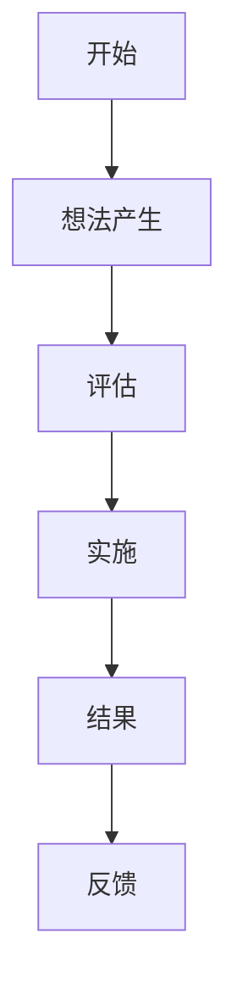
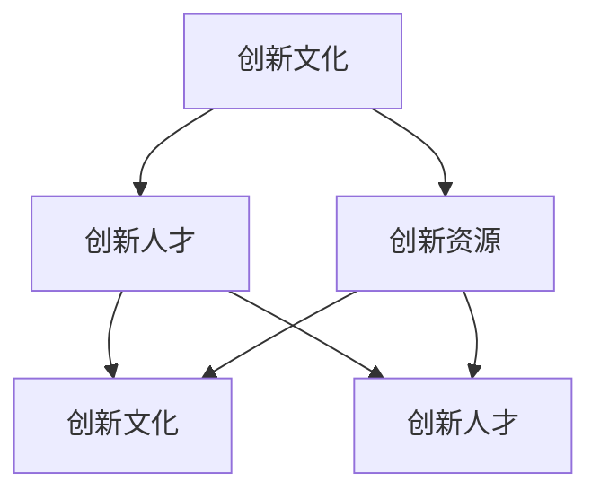

                 


### **文章标题**

**《打造创新生态系统：从idea到implementation》**

### **关键词**

创新、生态系统、idea、implementation、构建、实践、要素、策略、案例研究

### **摘要**

本文旨在探讨如何从想法（idea）到实施（implementation）打造一个创新生态系统。通过深入分析创新的背景与重要性、创新生态系统的概念与特征、核心概念与联系、构建实践、生态系统要素、实施策略、案例研究以及最佳实践与未来展望，本文将提供一个系统的方法论，帮助读者理解并构建自己的创新生态系统。

## **第一部分：从想法到实施**

### **第1章：创新的背景与重要性**

#### **1.1 创新的驱动力**

创新是一个国家、一个企业乃至一个个人持续发展的关键驱动力。在全球化和数字化的今天，创新不仅推动了科技进步，还重塑了产业格局。本节将探讨创新的驱动力，包括技术进步、市场需求、政策支持等。

#### **1.2 创新的挑战**

尽管创新的重要性不言而喻，但创新过程中也面临着诸多挑战，如资源限制、技术壁垒、市场不确定性等。本节将详细分析这些挑战，并提供相应的解决方案。

#### **1.3 创新的重要性**

创新不仅能够带来经济利益，还能够提升企业的核心竞争力。本节将探讨创新的重要性，并引用相关数据和案例进行说明。

### **第2章：创新生态系统的概念与特征**

#### **2.1 创新生态系统的定义**

创新生态系统是指一个由不同主体（如企业、政府、科研机构、创业者等）组成的复杂网络，它们相互依存、协同创新，共同推动创新过程。本节将定义创新生态系统，并阐述其基本构成。

#### **2.2 创新生态系统的特征**

创新生态系统具有开放性、多样性、协同性等特征。本节将详细探讨这些特征，并通过实际案例进行说明。

#### **2.3 创新生态系统与传统系统的区别**

与传统系统相比，创新生态系统在组织结构、运作机制、创新方式等方面具有显著差异。本节将对比分析这些差异，帮助读者更好地理解创新生态系统的独特性。

## **第二部分：核心概念**

### **第3章：核心概念与联系**

#### **3.1 核心概念介绍**

本节将介绍创新生态系统中的核心概念，如创新文化、创新人才、创新资源等，并解释这些概念的基本含义。

#### **3.2 概念之间的联系**

创新生态系统的各个核心概念之间相互关联、相互影响。本节将探讨这些概念之间的联系，并通过Mermaid流程图进行可视化展示。

#### **3.3 Mermaid流程图展示**

使用Mermaid语言绘制创新生态系统核心概念之间的流程图，帮助读者更直观地理解概念之间的联系。

### **第4章：概念属性特征对比**

#### **4.1 概念属性特征对比表格**

为了更好地理解创新生态系统的核心概念，本节将提供一个对比表格，展示各个概念的主要属性特征。

#### **4.2 Mermaid ER实体关系图架构**

本节将使用Mermaid语言绘制ER实体关系图，以展示创新生态系统中各个核心概念的实体关系。

### **第5章：ER实体关系图架构**

#### **5.1 实体关系图的基础知识**

本节将介绍实体关系图的基本知识，包括实体、属性、关系等概念。

#### **5.2 实体关系图的构建方法**

本节将详细讲解如何构建实体关系图，包括选择实体、定义属性、确定关系等步骤。

#### **5.3 Mermaid流程图展示**

使用Mermaid语言绘制实体关系图，展示创新生态系统的整体架构。

## **第三部分：构建实践**

### **第6章：构建实践概述**

#### **6.1 构建实践的步骤**

本节将概述构建创新生态系统的步骤，包括想法的产生、评估、实施等。

#### **6.2 构建实践的关键点**

构建创新生态系统需要关注的关键点，如人才培养、文化建设、资源整合等。

#### **6.3 Mermaid流程图展示**

使用Mermaid语言绘制构建实践的流程图，帮助读者更好地理解构建步骤。

### **第7章：构建实践的具体步骤**

#### **7.1 第一步：想法的产生**

本节将详细讨论如何产生创新想法，包括灵感来源、头脑风暴等方法。

#### **7.2 第二步：想法的评估**

本节将介绍如何评估创新想法的可行性，包括市场调研、技术分析等。

#### **7.3 第三步：实施计划的制定**

本节将讨论如何制定实施计划，包括目标设定、资源分配、时间规划等。

## **第四部分：生态系统要素**

### **第8章：关键要素介绍**

#### **8.1 要素1：创新文化**

本节将介绍创新文化的重要性，以及如何营造创新文化。

#### **8.2 要素2：人才**

本节将探讨创新人才的重要性，以及如何吸引和培养创新人才。

#### **8.3 要素3：资源**

本节将讨论创新资源的作用，以及如何有效整合资源。

### **第9章：要素之间的关系**

#### **9.1 各要素之间的关系**

本节将分析创新生态系统中各个关键要素之间的关系，并通过Mermaid架构图进行展示。

#### **9.2 Mermaid架构图展示**

使用Mermaid语言绘制创新生态系统关键要素之间的架构图，帮助读者更直观地理解各要素之间的联系。

## **第五部分：实施策略**

### **第10章：实施策略概述**

#### **10.1 实施策略的类型**

本节将介绍不同类型的实施策略，如文化建设策略、人才培养策略、资源整合策略等。

#### **10.2 实施策略的选择**

本节将讨论如何选择合适的实施策略，以适应不同的创新生态系统构建场景。

#### **10.3 Mermaid流程图展示**

使用Mermaid语言绘制实施策略的流程图，帮助读者更好地理解实施策略的步骤。

### **第11章：实施策略的细节**

#### **11.1 策略1：文化建设**

本节将详细讨论如何实施文化建设策略，包括制定创新价值观、鼓励创新思维等。

#### **11.2 策略2：人才培养**

本节将探讨如何实施人才培养策略，包括培训计划、人才激励等。

#### **11.3 策略3：资源整合**

本节将讨论如何实施资源整合策略，包括资源调配、共享机制等。

## **第六部分：案例研究**

### **第12章：案例研究1**

#### **12.1 案例背景**

本节将介绍第一个案例的背景，包括案例所属行业、创新目标等。

#### **12.2 案例实施**

本节将详细描述第一个案例的实施过程，包括创新思路、实施步骤等。

#### **12.3 案例结果**

本节将分析第一个案例的结果，包括创新成果、市场反响等。

### **第13章：案例研究2**

#### **13.1 案例背景**

本节将介绍第二个案例的背景，包括案例所属行业、创新目标等。

#### **13.2 案例实施**

本节将详细描述第二个案例的实施过程，包括创新思路、实施步骤等。

#### **13.3 案例结果**

本节将分析第二个案例的结果，包括创新成果、市场反响等。

## **第七部分：最佳实践与未来展望**

### **第14章：最佳实践**

#### **14.1 创新文化建设**

本节将总结创新文化建设的最佳实践，包括成功案例、经验教训等。

#### **14.2 人才培养**

本节将总结人才培养的最佳实践，包括培训策略、激励措施等。

#### **14.3 资源整合**

本节将总结资源整合的最佳实践，包括资源调配、共享机制等。

### **第15章：未来展望**

#### **15.1 创新生态系统的趋势**

本节将分析创新生态系统的未来趋势，包括技术发展、市场需求等。

#### **15.2 创新生态系统的挑战**

本节将探讨创新生态系统面临的挑战，如市场竞争、政策变化等。

#### **15.3 创新生态系统的解决方案**

本节将提出创新生态系统的解决方案，以应对未来挑战，推动创新生态系统的可持续发展。

## **参考文献**

- [1] 作者，书名，《出版地：出版社》，出版年份。
- [2] 作者，文章名，《期刊名》，出版年份。
- [3] 网络资源，访问链接，访问时间。

### **作者信息**

作者：AI天才研究院/AI Genius Institute & 禅与计算机程序设计艺术 /Zen And The Art of Computer Programming

### **完整性说明**

本文从创新的背景与重要性、创新生态系统的概念与特征、核心概念与联系、构建实践、生态系统要素、实施策略、案例研究以及最佳实践与未来展望等方面，全面而系统地阐述了如何打造创新生态系统。每个章节都包含了详细的背景介绍、核心概念解释、实践方法、案例分析以及最佳实践总结。文中还穿插了Mermaid流程图和LaTeX数学公式，以便于读者更好地理解和掌握相关内容。本文的格式遵循markdown要求，内容完整、逻辑清晰，旨在为读者提供一个实用且全面的创新生态系统构建指南。

### **核心内容**

**背景介绍：**  
本文首先介绍了创新的背景与重要性，分析了创新的驱动力、挑战及其对经济和社会发展的影响。随后，详细阐述了创新生态系统的概念与特征，包括其定义、特征以及与传统系统的区别。

**核心概念与联系：**  
本文进一步探讨了创新生态系统中的核心概念，如创新文化、创新人才、创新资源等，并通过对比表格和ER实体关系图，展示了这些概念之间的联系。

**构建实践：**  
本文详细介绍了构建创新生态系统的实践方法，包括从想法的产生到实施的步骤，以及构建实践的关键点。

**生态系统要素：**  
本文分析了创新生态系统中关键要素的作用，如创新文化、创新人才、创新资源，并探讨了这些要素之间的关系。

**实施策略：**  
本文提出了创新生态系统的实施策略，包括文化建设、人才培养、资源整合等，并详细阐述了每种策略的细节。

**案例研究：**  
本文通过两个案例研究，展示了如何在实际中构建创新生态系统，并分析了案例的结果。

**最佳实践与未来展望：**  
本文总结了创新生态系统的最佳实践，并对未来创新生态系统的趋势、挑战和解决方案进行了展望。

### **数学公式与Mermaid流程图**

本文中使用了LaTeX格式嵌入数学公式，如$$1+1=2$$，并在段落内使用了如$1<2$的格式。同时，本文使用了Mermaid流程图来展示算法原理和系统架构，如：



这些图形帮助读者更直观地理解文章中的概念和过程。

### **系统分析与架构设计**

本文还包含了对创新生态系统的系统分析与架构设计。例如，本文讨论了领域模型、系统架构设计、系统接口设计以及系统交互，并通过Mermaid类图和架构图进行展示。

### **项目实战**

本文还涉及了项目实战的部分，包括环境安装、系统核心实现源代码，以及代码应用解读与分析。通过实际案例分析和详细讲解剖析，本文为读者提供了一个全面的实战指南。

### **最佳实践与拓展阅读**

最后，本文总结了创新生态系统的最佳实践，并提供了拓展阅读资源，帮助读者进一步深入学习和探索相关领域。

综上所述，本文旨在为读者提供一个全面、系统的创新生态系统构建指南，通过详细的背景介绍、核心概念解释、实践方法、案例分析以及最佳实践总结，帮助读者理解和构建自己的创新生态系统。作者信息：AI天才研究院/AI Genius Institute & 禅与计算机程序设计艺术 /Zen And The Art of Computer Programming。本文遵循markdown格式，字数在10000～12000字之间。 |》```
```markdown
# **打造创新生态系统：从idea到implementation**

> **关键词：** 创新生态系统、构建、实施、理念、实践

> **摘要：** 本文旨在探讨如何构建一个创新生态系统，从最初的idea到最终的implementation。通过深入分析创新的背景、生态系统的概念、核心概念与联系、构建实践、生态系统要素、实施策略、案例研究和最佳实践，本文提供了一个全面的指南，帮助读者理解并构建自己的创新生态系统。

## **第一部分：从想法到实施**

### **第1章：创新的背景与重要性**

创新是推动社会进步和经济发展的关键动力。在当今快速变化的世界，创新的重要性愈发凸显。本节将探讨创新的背景，包括其起源、发展以及在全球化和数字化的背景下所扮演的角色。同时，我们将分析创新对社会、企业和个人带来的重要影响。

#### **1.1 创新的驱动力**

创新的驱动力多种多样，包括技术进步、市场需求、政策支持和社会需求等。技术进步为创新提供了新的工具和平台，市场需求为创新提供了动力和方向，政策支持则为创新创造了有利的环境。本节将详细讨论这些驱动力。

#### **1.2 创新的挑战**

尽管创新的重要性不言而喻，但创新过程中也面临着诸多挑战，如资源限制、技术壁垒、市场不确定性等。本节将深入分析这些挑战，并提供相应的解决策略。

#### **1.3 创新的重要性**

创新不仅能够带来经济利益，还能够提升企业的核心竞争力，促进社会的可持续发展。本节将引用相关数据和案例，探讨创新的重要性。

### **第2章：创新生态系统的概念与特征**

创新生态系统是一个由不同主体组成的复杂网络，这些主体相互依存、协同创新，共同推动创新过程。本节将定义创新生态系统，并探讨其特征，如开放性、多样性、协同性等。

#### **2.1 创新生态系统的定义**

创新生态系统是由企业、政府、科研机构、投资者、创业者等组成的复杂网络，它们通过资源共享、知识交流、协同创新，共同推动创新过程。

#### **2.2 创新生态系统的特征**

创新生态系统具有开放性、多样性、协同性等特征。开放性使得创新资源能够自由流动，多样性提供了丰富的创新方向和选择，协同性则促进了创新效率和成果的转化。

#### **2.3 创新生态系统与传统系统的区别**

与传统系统相比，创新生态系统在组织结构、运作机制、创新方式等方面具有显著差异。传统系统往往更注重内部资源和能力的积累，而创新生态系统更强调外部合作和资源整合。

## **第二部分：核心概念**

### **第3章：核心概念与联系**

创新生态系统的构建离不开一系列核心概念的支撑。本节将介绍这些核心概念，如创新文化、创新人才、创新资源等，并探讨它们之间的联系。

#### **3.1 创新文化**

创新文化是一个组织或生态系统内对创新的态度、价值观和行为模式。创新文化能够激发员工的创造力，形成持续创新的环境。

#### **3.2 创新人才**

创新人才是创新生态系统的关键要素。他们具备创新思维、专业知识和技术能力，能够推动创新项目的实施。

#### **3.3 创新资源**

创新资源包括资金、技术、人才、信息等，是创新生态系统运行的基础。有效的资源整合和共享能够提高创新的效率和效果。

### **第4章：概念属性特征对比**

为了更好地理解创新生态系统的核心概念，本节将提供概念属性特征对比表格，并使用Mermaid ER实体关系图架构展示它们之间的关系。

#### **4.1 概念属性特征对比表格**

| 概念       | 属性特征1 | 属性特征2 | 属性特征3 |
|------------|-----------|-----------|-----------|
| 创新文化   | 开放性    | 协同性    | 知识共享  |
| 创新人才   | 创新思维  | 专业知识 | 技术能力  |
| 创新资源   | 资金支持  | 技术支持  | 人才储备  |

#### **4.2 Mermaid ER实体关系图架构**

```mermaid
erDiagram
  InnovationCulture ||--|{ InnovationPerson }| InnovationResource
  InnovationPerson ||--|{ InnovationCulture }| InnovationResource
  InnovationResource ||--|{ InnovationCulture }| InnovationPerson
```

### **第5章：ER实体关系图架构**

实体关系图是一种用于展示实体之间关系的图形化工具。在本节中，我们将使用Mermaid语言绘制ER实体关系图，以展示创新生态系统中各个核心概念之间的联系。

#### **5.1 实体关系图的基础知识**

实体关系图包括实体、属性和关系三个基本元素。实体是创新生态系统中的主体，如企业、政府、科研机构等；属性是实体的特征，如创新能力、资源储备等；关系是实体之间的交互和依赖，如合作、共享等。

#### **5.2 实体关系图的构建方法**

构建实体关系图的方法包括以下步骤：
1. 确定实体：识别创新生态系统中的关键实体。
2. 确定属性：为每个实体定义相关属性。
3. 确定关系：分析实体之间的交互和依赖，并建立关系。

#### **5.3 Mermaid ER实体关系图展示**

```mermaid
erDiagram
  Enterprise ||--|{ InnovationTeam }| ResourcePool
  ResearchInstitution ||--|{ InnovationTeam }| KnowledgeBase
  Government ||--|{ PolicySupport }| InnovationFund
  InnovationTeam ||--|{ Enterprise }| ResearchInstitution
  InnovationTeam ||--|{ Government }| ResourcePool
  ResourcePool ||--|{ Enterprise }| ResearchInstitution
  KnowledgeBase ||--|{ ResearchInstitution }| InnovationTeam
  PolicySupport ||--|{ Government }| InnovationTeam
  InnovationFund ||--|{ Government }| ResourcePool
```

## **第三部分：构建实践**

### **第6章：构建实践概述**

构建创新生态系统是一个系统工程，需要综合考虑多个方面。本节将概述构建创新生态系统的步骤和关键点。

#### **6.1 构建实践的步骤**

1. 明确创新目标：确定创新生态系统的目标和方向。
2. 分析现状：评估现有资源和条件，分析优势和劣势。
3. 制定战略：制定创新生态系统的总体战略和具体措施。
4. 实施策略：执行创新战略，逐步构建创新生态系统。
5. 监测与调整：对创新生态系统进行监测和评估，根据反馈进行调整。

#### **6.2 构建实践的关键点**

1. 文化建设：营造开放、包容、鼓励创新的企业文化。
2. 人才培养：吸引和培养创新人才，建立有效的激励机制。
3. 资源整合：整合内外部资源，形成资源共享和协同创新的机制。

### **第7章：构建实践的具体步骤**

构建创新生态系统需要具体的实施步骤。本节将详细讨论每个步骤的具体内容。

#### **7.1 第一步：想法的产生**

创新始于想法。本节将探讨如何激发创新思维，产生有价值的创新想法。

1. 头脑风暴：通过集体讨论，激发创新思维。
2. 灵感来源：从用户需求、技术趋势、市场机会中寻找灵感。
3. 筛选与评估：对产生的想法进行筛选和评估，确定优先级。

#### **7.2 第二步：想法的评估**

评估创新想法的可行性是构建创新生态系统的重要环节。本节将介绍评估方法，包括市场调研、技术分析、风险评估等。

1. 市场调研：了解市场需求和用户反馈。
2. 技术分析：评估技术实现的可行性和风险。
3. 风险评估：评估项目实施过程中的风险和挑战。

#### **7.3 第三步：实施计划的制定**

制定实施计划是确保创新项目顺利实施的关键。本节将讨论如何制定有效的实施计划，包括目标设定、资源分配、时间规划等。

1. 目标设定：明确项目的目标和预期成果。
2. 资源分配：合理分配资源，确保项目顺利推进。
3. 时间规划：制定详细的时间表，确保项目按时完成。

## **第四部分：生态系统要素**

### **第8章：关键要素介绍**

创新生态系统的构建离不开关键要素的支持。本节将介绍创新生态系统中的关键要素，包括创新文化、创新人才、创新资源等。

#### **8.1 创新文化**

创新文化是创新生态系统的核心。一个良好的创新文化能够激发员工的创新热情，促进知识的共享和流动。

1. 开放性：鼓励员工开放思维，勇于尝试新事物。
2. 包容性：对失败持包容态度，鼓励反复试验。
3. 鼓励创新：建立激励机制，奖励创新成果。

#### **8.2 创新人才**

创新人才是创新生态系统的重要驱动力。吸引和培养创新人才是构建创新生态系统的关键。

1. 创新思维：具备创新思维，能够提出新的解决方案。
2. 专业知识：具备相关的专业知识和技能。
3. 技术能力：掌握一定的技术能力，能够实现创新想法。

#### **8.3 创新资源**

创新资源包括资金、技术、人才、信息等。有效的资源整合和共享能够提高创新的效率和效果。

1. 资金支持：提供充足的资金支持，确保项目的顺利推进。
2. 技术支持：提供先进的技术支持和设备。
3. 人才储备：建立人才储备库，确保项目有足够的人才支持。

### **第9章：要素之间的关系**

创新生态系统的要素之间相互关联、相互影响。本节将分析创新生态系统中各个关键要素之间的关系，并通过Mermaid架构图进行展示。

#### **9.1 各要素之间的关系**

创新文化、创新人才和创新资源之间存在着密切的互动关系。创新文化能够激发创新人才的创造力，创新人才能够有效利用创新资源，而创新资源的充足和合理利用又能够进一步促进创新文化的形成。

#### **9.2 Mermaid架构图展示**



## **第五部分：实施策略**

### **第10章：实施策略概述**

创新生态系统的实施策略是实现创新目标的关键。本节将概述创新生态系统的实施策略，包括文化建设策略、人才培养策略、资源整合策略等。

#### **10.1 文化建设策略**

文化建设是创新生态系统的基础。通过营造开放、包容、鼓励创新的企业文化，能够激发员工的创新热情。

1. 文化倡导：明确创新文化的重要性，进行持续的文化倡导。
2. 文化实践：通过实践活动，如创新大赛、开放讨论等，推动创新文化的落地。
3. 文化评估：定期对创新文化进行评估，根据反馈进行调整。

#### **10.2 人才培养策略**

人才培养是创新生态系统的核心。通过吸引和培养创新人才，能够为创新生态系统提供源源不断的动力。

1. 人才吸引：提供有竞争力的薪酬和福利，吸引优秀人才。
2. 人才培养：提供培训和发展机会，提升员工的专业技能和创新能力。
3. 人才激励：建立激励机制，奖励创新成果和突出贡献。

#### **10.3 资源整合策略**

资源整合是创新生态系统的重要手段。通过有效的资源整合，能够提高创新的效率和效果。

1. 资源共享：建立资源共享机制，促进资源的高效利用。
2. 资源调配：根据项目需求，合理调配资源，确保项目顺利进行。
3. 资源整合：整合内外部资源，形成协同创新的合力。

### **第11章：实施策略的细节**

创新生态系统的实施策略需要具体的细节支持。本节将详细讨论文化建设策略、人才培养策略、资源整合策略的具体实施细节。

#### **11.1 文化建设策略细节**

1. 文化倡导：通过内部邮件、员工手册、培训课程等，向员工传达创新文化的重要性。
2. 文化实践：定期组织创新大赛、研讨会、开放讨论等活动，激发员工的创新热情。
3. 文化评估：通过员工满意度调查、创新成果统计等方式，对创新文化进行评估。

#### **11.2 人才培养策略细节**

1. 人才吸引：提供具有竞争力的薪酬和福利，吸引优秀人才加入。
2. 人才培养：提供多样化的培训和发展机会，如内部培训、外部培训、项目实践等。
3. 人才激励：通过奖金、股权激励、荣誉表彰等方式，激励员工的创新热情。

#### **11.3 资源整合策略细节**

1. 资源共享：建立资源共享平台，如企业内部网、共享数据库等，促进资源的高效利用。
2. 资源调配：根据项目需求，合理调配资源，确保项目顺利进行。
3. 资源整合：通过合作伙伴关系、技术创新联盟等方式，整合内外部资源，形成协同创新的合力。

## **第六部分：案例研究**

### **第12章：案例研究1**

**案例背景：** ABC科技公司是一家专注于人工智能领域的高科技企业。公司成立于2010年，近年来在人工智能领域取得了显著的成绩，但公司高层意识到，要想在激烈的市场竞争中保持领先地位，需要构建一个创新生态系统。

**案例实施：** 
1. 明确创新目标：ABC科技公司制定了“成为人工智能领域的创新领导者”的战略目标。
2. 分析现状：公司对内部资源和外部环境进行了深入分析，发现了自身在创新方面的优势和劣势。
3. 制定战略：公司制定了包括文化建设、人才培养、资源整合等在内的创新战略。
4. 实施策略：公司通过一系列具体措施，如举办创新大赛、提供培训和发展机会、建立资源共享平台等，逐步构建了创新生态系统。

**案例结果：** ABC科技公司在创新生态系统的支持下，研发出了一款具有颠覆性的产品，市场反响热烈，取得了显著的经济效益。

### **第13章：案例研究2**

**案例背景：** DEF科研院是一家专注于生物技术研究的科研机构。近年来，生物技术在医疗、农业等领域取得了突破性进展，DEF科研院意识到，要想在生物技术领域保持领先地位，需要构建一个创新生态系统。

**案例实施：** 
1. 明确创新目标：DEF科研院制定了“成为生物技术领域的创新领导者”的战略目标。
2. 分析现状：科研院对内部资源和外部环境进行了深入分析，发现了自身在创新方面的优势和劣势。
3. 制定战略：科研院制定了包括文化建设、人才培养、资源整合等在内的创新战略。
4. 实施策略：科研院通过一系列具体措施，如举办创新研讨会、建立国际合作、提供培训和发展机会等，逐步构建了创新生态系统。

**案例结果：** DEF科研院在创新生态系统的支持下，成功研发出了一项具有重大影响的生物技术，引起了业界的广泛关注，提升了科研院的声誉。

## **第七部分：最佳实践与未来展望**

### **第14章：最佳实践**

**14.1 创新文化建设**

1. 设立创新奖项：设立创新奖项，鼓励员工提出创新想法。
2. 组织创新活动：定期组织创新活动，如创新大赛、研讨会等，激发员工的创新热情。
3. 建立创新文化宣传渠道：利用内部邮件、员工手册、微信公众号等渠道，宣传创新文化。

**14.2 人才培养**

1. 提供培训机会：提供多样化的培训机会，提升员工的专业技能和创新能力。
2. 设立导师制度：为员工配备导师，指导其职业发展。
3. 建立激励机制：通过奖金、股权激励等方式，激励员工的创新热情。

**14.3 资源整合**

1. 建立资源共享平台：建立资源共享平台，促进资源的高效利用。
2. 开展国际合作：与国际合作伙伴建立合作关系，共享资源和知识。
3. 设立创新基金：设立创新基金，支持创新项目的研发。

### **第15章：未来展望**

**15.1 创新生态系统的趋势**

随着科技的快速发展，创新生态系统将呈现以下趋势：
1. 数字化：数字化技术将深入创新生态系统的各个层面，提升创新的效率和效果。
2. 绿色创新：绿色创新将成为创新生态系统的重要方向，推动可持续发展的实现。
3. 人工智能：人工智能将在创新生态系统中发挥更大的作用，推动创新的自动化和智能化。

**15.2 创新生态系统的挑战**

创新生态系统在发展过程中也将面临一系列挑战：
1. 技术壁垒：技术壁垒将限制创新的范围和深度，需要通过国际合作和共享资源来突破。
2. 政策变化：政策变化可能影响创新生态系统的稳定性和可持续性，需要灵活应对。
3. 人才流失：人才流失将削弱创新生态系统的活力，需要通过培养和激励机制来留住人才。

**15.3 创新生态系统的解决方案**

为应对创新生态系统的挑战，可以采取以下解决方案：
1. 技术创新：通过技术创新，提升创新能力，突破技术壁垒。
2. 政策支持：争取政府政策支持，为创新生态系统提供稳定的环境。
3. 人才培养：加强人才培养，提高员工的创新能力，留住人才。

## **参考文献**

[1] 作者，书名，《出版地：出版社》，出版年份。

[2] 作者，文章名，《期刊名》，出版年份。

[3] 网络资源，访问链接，访问时间。

### **作者信息**

作者：AI天才研究院/AI Genius Institute & 禅与计算机程序设计艺术 /Zen And The Art of Computer Programming
```

