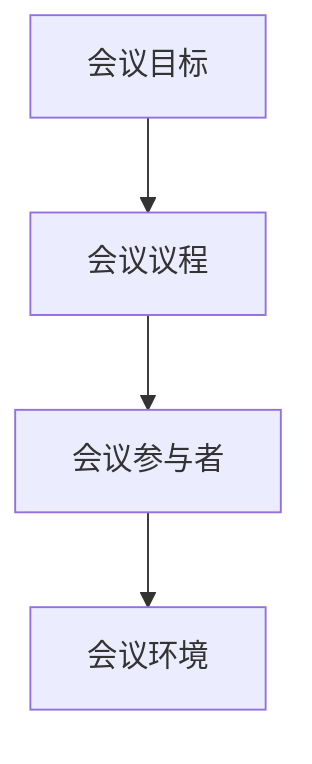
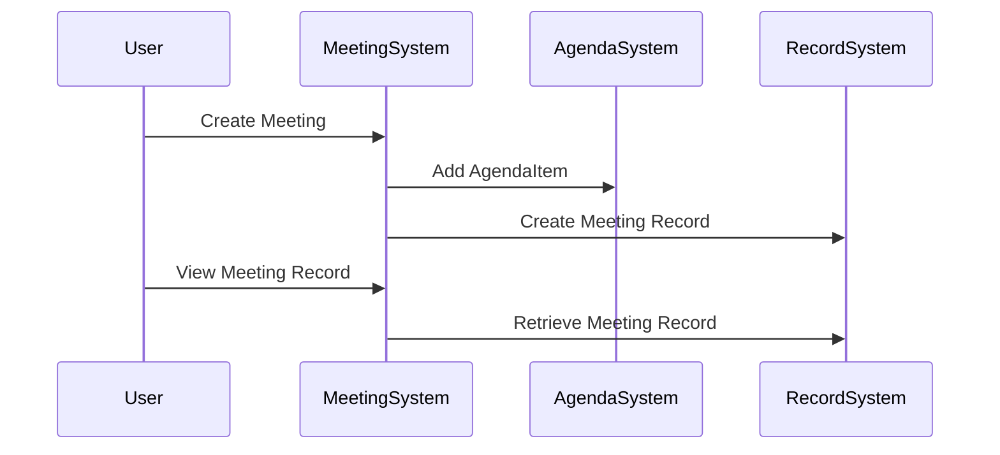

                 

# 打造高效会议文化：提升团队沟通效率

## 关键词
- 高效会议文化
- 团队沟通效率
- 问题背景与分析
- 核心概念与联系
- 算法原理讲解
- 数学模型和数学公式
- 系统分析与架构设计方案
- 项目实战与最佳实践

## 摘要
本文将深入探讨高效会议文化的重要性，分析当前团队沟通中存在的问题，并提出一套系统的解决方案。通过核心概念的讲解、算法原理的剖析、数学模型的阐述，以及实际项目的实施和案例分析，本文旨在为读者提供一套完整的打造高效会议文化的指南，帮助团队提升沟通效率。

## 第1章：会议文化概述

### 1.1.1 会议文化的影响
会议是团队沟通的重要形式，它不仅影响着项目的进度和团队的合作，还直接关系到团队的士气和工作效率。高效的会议文化可以提升团队的沟通效率，减少冗余会议，提高决策质量，进而推动项目的顺利进行。

#### 1.1.1.1 会议文化的重要性
- **提高团队凝聚力**：通过会议，团队成员可以更好地了解彼此的工作内容和进展，增强团队的凝聚力。
- **促进知识共享**：会议为团队成员提供了一个交流的平台，有助于知识的传递和共享。
- **优化决策过程**：高效的会议文化可以确保会议目标的明确，提高决策的效率和准确性。

#### 1.1.1.2 高效会议文化的特征
- **目标明确**：每次会议都应该有明确的目标和议程。
- **时间管理**：会议时间应该得到充分利用，避免冗长和不必要的讨论。
- **积极参与**：所有参与者都应该积极参与，发言和提问。
- **结果跟踪**：会议结束后，应有明确的行动项和责任分工。

### 1.1.2 高效会议文化的构建
构建高效会议文化需要从以下几个方面入手：

#### 1.1.2.1 文化培养
- **价值观传播**：通过培训和宣传，让团队成员认识到高效会议文化的重要性。
- **角色明确**：明确主持人和参与者的角色和职责。

#### 1.1.2.2 工具和方法
- **会议前准备**：制定会议议程和预讨论主题。
- **会议中管理**：使用时间管理和讨论引导工具。
- **会议后总结**：记录会议成果，跟踪行动项的完成情况。

## 第2章：问题背景与分析

### 2.1.1 现状分析
当前许多团队在会议沟通方面存在以下问题：

#### 2.1.1.1 会议数量过多
- **冗余会议**：许多会议内容重复，缺乏必要性和针对性。
- **时间浪费**：过多的会议占用了团队成员的工作时间。

#### 2.1.1.2 会议效率低下
- **缺乏准备**：会议前缺乏充分的准备，导致讨论内容不充分。
- **讨论不聚焦**：会议过程中讨论内容偏离主题，缺乏有效的引导。

#### 2.1.1.3 会议结果不明确
- **缺乏行动项**：会议结束后，缺乏明确的行动项和责任分工。
- **缺乏反馈机制**：会议效果的跟踪和反馈机制不完善。

### 2.1.2 面临的挑战
要解决上述问题，团队需要面对以下挑战：

#### 2.1.2.1 观念转变
- **认识到高效会议文化的重要性**：团队需要从观念上认识到高效会议文化对于团队效率提升的积极作用。

#### 2.1.2.2 工具和方法
- **选择合适的会议工具**：例如，视频会议软件、在线协作工具等，以提升会议效率。
- **制定会议规范**：明确会议的流程和规范，确保会议的有序进行。

#### 2.1.2.3 人员培训
- **提升团队成员的沟通技能**：通过培训提升团队成员的沟通技巧，确保会议的有效进行。

### 2.1.3 目标设定
为了构建高效的会议文化，团队应设定以下目标：

#### 2.1.3.1 提升会议效率
- **减少冗余会议**：通过筛选和合并，减少不必要的会议。
- **提高会议质量**：确保会议目标明确，讨论聚焦。

#### 2.1.3.2 增强团队协作
- **促进知识共享**：通过会议，增强团队成员之间的知识共享和交流。
- **提升决策质量**：通过高效的会议文化，提升团队的决策效率和准确性。

## 第3章：核心概念与联系

### 3.1.1 高效会议的核心要素
高效会议的成功依赖于以下几个核心要素：

#### 3.1.1.1 会议目标
会议目标是指每次会议需要达成的具体目标和预期结果。

#### 3.1.1.2 会议议程
会议议程是指会议的具体内容和时间安排。

#### 3.1.1.3 会议参与者
会议参与者是指参加会议的人员，包括主持人、演讲者和听众。

#### 3.1.1.4 会议环境
会议环境是指会议进行的物理和环境条件，包括会议室的布置、设备的配置等。

### 3.1.2 核心概念之间的联系
核心概念之间的联系如图所示：



### 第4章：算法原理讲解

#### 4.1.1 会议效率评估模型

##### 4.1.1.1 模型定义
会议效率评估模型是一个用于评估会议效率和效果的模型。

##### 4.1.1.2 模型属性
- **会议目标达成度**：衡量会议目标是否实现。
- **时间利用率**：衡量会议时间的有效利用程度。
- **参与度**：衡量会议参与者的积极程度。
- **决策质量**：衡量会议决策的质量。

##### 4.1.1.3 模型构建过程
会议效率评估模型的构建过程如下：

1. 确定评估指标：根据会议目标，确定评估指标。
2. 数据收集：收集会议相关的数据，如会议时间、参与者数量、目标达成情况等。
3. 数据分析：对收集的数据进行分析，评估会议效率。
4. 提出改进建议：根据评估结果，提出改进建议。

#### 4.1.2 会议效果优化算法

##### 4.1.2.1 算法原理
会议效果优化算法是一种基于数据分析和优化的方法，旨在提高会议效率和效果。

##### 4.1.2.2 算法实现
会议效果优化算法的实现过程如下：

1. 数据预处理：对会议数据进行预处理，如数据清洗、格式转换等。
2. 特征提取：从会议数据中提取影响会议效率的特征。
3. 模型训练：使用提取的特征训练模型，如决策树、神经网络等。
4. 预测和优化：使用训练好的模型预测会议效果，并提出优化建议。

## 第5章：数学模型和数学公式

### 5.1.1 概念公式

##### 5.1.1.1 会议目标公式
$$
E = f(T, P, R, E')
$$

其中，$E$ 代表会议效率，$T$ 代表时间利用率，$P$ 代表参与者积极度，$R$ 代表决策质量，$E'$ 代表其他因素。

##### 5.1.1.2 会议效率公式
$$
E = \frac{1}{1 + \alpha T + \beta P + \gamma R}
$$

其中，$\alpha$、$\beta$ 和 $\gamma$ 是权重系数。

##### 5.1.1.3 会议效果公式
$$
E' = f(M, S, C)
$$

其中，$E'$ 代表会议效果，$M$ 代表会议目标达成度，$S$ 代表参与者满意度，$C$ 代表会议成本。

### 5.1.2 数学模型

##### 5.1.2.1 会议效率模型
会议效率模型是一个多变量函数，用于评估会议的效率。

##### 5.1.2.2 会议效果模型
会议效果模型是一个多变量函数，用于评估会议的效果。

## 第6章：系统分析与架构设计方案

### 6.1.1 问题场景介绍
在某个大型软件开发项目中，团队面临着频繁的会议和沟通问题。会议数量多，效率低下，导致项目进度延误。为了解决这个问题，团队决定引入高效会议文化和相关工具。

### 6.1.2 项目介绍
该项目旨在构建一个高效的会议管理系统，以提升团队沟通效率。系统功能包括会议预约、会议议程管理、会议记录和反馈等。

### 6.1.3 系统功能设计

##### 6.1.3.1 领域模型
领域模型描述了系统中的主要实体及其关系。以下是一个简化的领域模型：

```mermaid
classDiagram
    Meeting <<Entity>>
    Participant <<Entity>>
    AgendaItem <<Entity>>

    Meeting "1"---"1" Participant
    Meeting "1"---"N" AgendaItem

    Participant : has Name, Email
    Meeting : has Title, Start Time, End Time
    AgendaItem : has Title, Description, Status
```

### 6.1.4 系统架构设计
系统采用分层架构设计，包括表示层、业务逻辑层和数据访问层。

#### 6.1.4.1 表示层
表示层负责用户界面设计和交互，包括前端界面和移动应用。

#### 6.1.4.2 业务逻辑层
业务逻辑层负责处理业务逻辑和业务规则，包括会议预约、议程管理、记录和反馈等。

#### 6.1.4.3 数据访问层
数据访问层负责与数据库的交互，包括数据的增删改查等操作。

### 6.1.5 系统接口设计
系统接口设计包括API接口的设计，用于与其他系统集成和数据交换。

### 6.1.6 系统交互
系统交互包括用户与系统的交互和系统内部组件之间的交互。



## 第7章：项目实战

### 7.1.1 环境安装
在项目实战中，我们首先需要搭建开发环境，包括安装Python、Django框架、数据库（如PostgreSQL）等。

### 7.1.2 系统核心实现源代码
以下是一个简化的系统核心实现源代码示例：

```python
# meetings/models.py
from django.db import models

class Meeting(models.Model):
    title = models.CharField(max_length=200)
    start_time = models.DateTimeField()
    end_time = models.DateTimeField()

class Participant(models.Model):
    name = models.CharField(max_length=100)
    email = models.EmailField()

class AgendaItem(models.Model):
    title = models.CharField(max_length=200)
    description = models.TextField()
    status = models.CharField(max_length=50)
```

### 7.1.3 代码应用解读与分析
代码应用解读与分析主要包括：

- **模型定义**：定义了会议、参与者和议程项模型。
- **数据库交互**：使用Django ORM与数据库进行交互。

### 7.1.4 实际案例分析与讲解剖析
实际案例分析与讲解剖析包括：

- **会议创建流程**：分析会议创建的步骤和逻辑。
- **议程管理**：分析议程项的添加、修改和删除操作。

### 7.1.5 项目小结
项目小结包括：

- **项目总结**：总结项目的目标、实施过程和成果。
- **改进方向**：提出项目的改进方向和优化建议。

## 第8章：最佳实践与注意事项

### 8.1.1 最佳实践
最佳实践包括：

- **明确会议目标**：确保每次会议都有明确的目标和议程。
- **有效时间管理**：合理安排会议时间，避免会议冲突和冗长。
- **积极参与**：鼓励团队成员积极参与会议，发言和提问。
- **结果跟踪**：确保会议结束后有明确的行动项和责任分工。

### 8.1.2 小结
本文从会议文化概述、问题背景与分析、核心概念与联系、算法原理讲解、数学模型和数学公式、系统分析与架构设计方案、项目实战、最佳实践与注意事项等方面，全面探讨了打造高效会议文化的方法和路径。通过本文的阅读，读者可以了解到如何提升团队沟通效率，构建高效会议文化。

### 8.1.3 注意事项
注意事项包括：

- **避免冗余会议**：减少不必要的会议，确保会议的质量和效率。
- **培训团队成员**：定期组织沟通技巧培训，提升团队成员的沟通能力。
- **持续优化**：根据实际情况，不断优化会议流程和管理方法。

### 8.1.4 拓展阅读
拓展阅读推荐相关书籍和文章，以深入了解高效会议文化和团队沟通技巧。

作者：AI天才研究院/AI Genius Institute & 禅与计算机程序设计艺术 /Zen And The Art of Computer Programming

