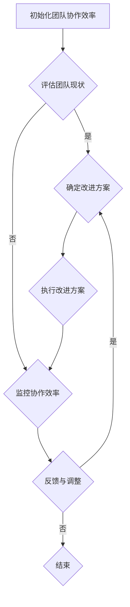
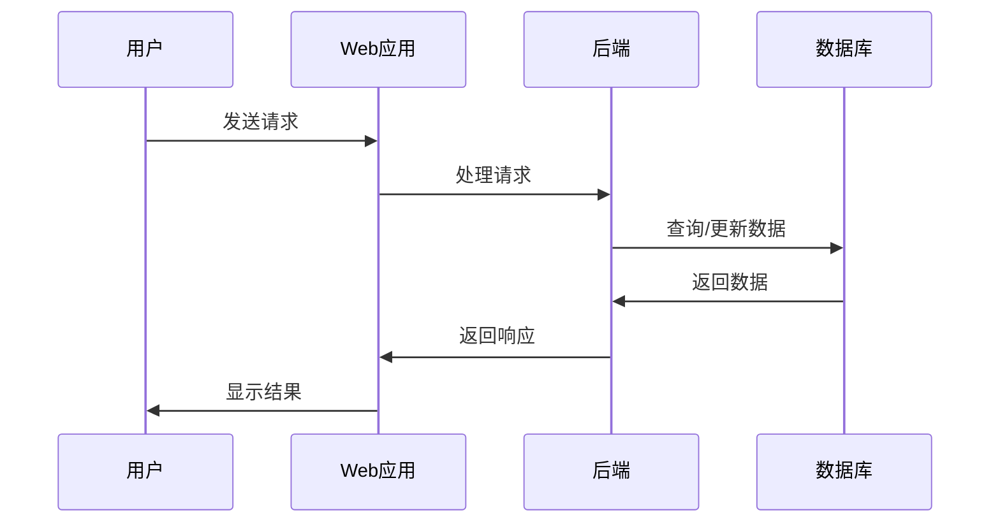

                 

# 打造高效协作团队：从理论到实践

## 关键词：高效协作、团队建设、实践策略

### 摘要：

在现代企业中，团队协作已经成为提高工作效率和创造力的关键因素。然而，许多团队在协作过程中面临着各种挑战。本文将深入探讨如何打造高效协作团队，从理论到实践，提供一系列策略和方法，帮助团队克服障碍，实现协同工作的最大潜力。

## 引言与背景介绍

### 1.1 团队协作的重要性

团队协作在组织中的作用不可小觑。首先，它能够整合团队成员的专业知识和技能，形成优势互补。通过协作，团队成员可以共同解决问题，提高决策质量，减少错误和重复劳动。此外，团队协作还能够促进沟通和信任的建立，增强团队的凝聚力和归属感。

团队协作与个人绩效的关系也是密不可分的。在一个高效的协作团队中，个人的工作压力会得到缓解，因为他们知道团队会支持他们，共同面对挑战。这种支持不仅能够提高个人的工作效率，还能够激发创新思维，促进个人成长。

### 1.2 团队协作的现状与挑战

当前，团队协作面临着一系列挑战。首先，团队成员之间缺乏有效的沟通渠道和工具，导致信息传递不畅。其次，团队成员的技能和知识水平参差不齐，可能导致协作过程中出现理解障碍。此外，团队文化的不成熟也会阻碍协作的进行，如缺乏共同的目标和价值观，成员之间的信任不足等。

### 目录大纲设计

#### 引言与背景介绍

```markdown
# 引言与背景介绍

## 第1章 团队协作概述

### 1.1 团队协作的重要性
#### 1.1.1 团队协作在组织中的作用
#### 1.1.2 团队协作与个人绩效的关系

### 1.2 团队协作的现状与挑战
#### 1.2.1 当前团队协作的主要问题
#### 1.2.2 团队协作的障碍因素
```

#### 团队建设与协作理论

```markdown
# 团队建设与协作理论

## 第2章 团队建设理论

### 2.1 团队发展模型
#### 2.1.1 Tuckman模型
#### 2.1.2 Hersey-Blanchard模型

### 2.2 团队角色与技能
#### 2.2.1 团队角色的划分
#### 2.2.2 团队成员的技能要求

### 2.3 团队文化与氛围
#### 2.3.1 团队文化的定义与作用
#### 2.3.2 如何营造积极的团队氛围
```

#### 实践策略与案例分析

```markdown
# 实践策略与案例分析

## 第3章 团队协作工具与方法

### 3.1 团队协作工具的选择
#### 3.1.1 常见的团队协作工具
#### 3.1.2 如何选择适合的工具

### 3.2 团队协作方法的实践
#### 3.2.1 跨部门协作的技巧
#### 3.2.2 高效会议的实践

### 3.3 案例分析
#### 3.3.1 某公司团队协作的实践案例
#### 3.3.2 团队协作的成功经验与启示
```

#### 总结与展望

```markdown
# 总结与展望

## 第4章 总结与反思

### 4.1 本书内容的回顾
#### 4.1.1 团队协作的重要性
#### 4.1.2 团队建设与协作理论

### 4.2 团队协作的实践策略
#### 4.2.1 团队协作工具与方法
#### 4.2.2 案例分析与启示

### 4.3 团队协作的未来展望
#### 4.3.1 团队协作的潜在趋势
#### 4.3.2 如何持续提升团队协作效率
```

### 目录大纲设计步骤

1. **明确书籍主题**：首先，我们需要明确书籍的主题，即“打造高效协作团队：从理论到实践”。这个主题包含了团队建设、协作方法、实践策略等多个方面。

2. **确定书籍结构**：根据主题，我们可以将书籍分为以下几个部分：
   - 引言与背景介绍
   - 团队建设与协作理论
   - 实践策略与案例分析
   - 总结与展望

3. **细化章节内容**：在每个部分中，我们需要细化章节内容，确保每个章节都有明确的主题和具体的内容。

4. **遵循markdown格式**：我们将使用markdown格式来设计目录大纲，确保格式清晰、易于阅读。

5. **确保内容完整性**：我们需要确保书籍的内容完整性，包括核心概念、算法原理、数学模型、系统分析与架构设计、项目实战等。

### 目录大纲设计

#### 引言与背景介绍

```markdown
# 引言与背景介绍

## 第1章 团队协作概述

### 1.1 团队协作的重要性
#### 1.1.1 团队协作在组织中的作用
#### 1.1.2 团队协作与个人绩效的关系

### 1.2 团队协作的现状与挑战
#### 1.2.1 当前团队协作的主要问题
#### 1.2.2 团队协作的障碍因素
```

#### 团队建设与协作理论

```markdown
# 团队建设与协作理论

## 第2章 团队建设理论

### 2.1 团队发展模型
#### 2.1.1 Tuckman模型
#### 2.1.2 Hersey-Blanchard模型

### 2.2 团队角色与技能
#### 2.2.1 团队角色的划分
#### 2.2.2 团队成员的技能要求

### 2.3 团队文化与氛围
#### 2.3.1 团队文化的定义与作用
#### 2.3.2 如何营造积极的团队氛围
```

#### 实践策略与案例分析

```markdown
# 实践策略与案例分析

## 第3章 团队协作工具与方法

### 3.1 团队协作工具的选择
#### 3.1.1 常见的团队协作工具
#### 3.1.2 如何选择适合的工具

### 3.2 团队协作方法的实践
#### 3.2.1 跨部门协作的技巧
#### 3.2.2 高效会议的实践

### 3.3 案例分析
#### 3.3.1 某公司团队协作的实践案例
#### 3.3.2 团队协作的成功经验与启示
```

#### 总结与展望

```markdown
# 总结与展望

## 第4章 总结与反思

### 4.1 本书内容的回顾
#### 4.1.1 团队协作的重要性
#### 4.1.2 团队建设与协作理论

### 4.2 团队协作的实践策略
#### 4.2.1 团队协作工具与方法
#### 4.2.2 案例分析与启示

### 4.3 团队协作的未来展望
#### 4.3.1 团队协作的潜在趋势
#### 4.3.2 如何持续提升团队协作效率
```

以上是《打造高效协作团队：从理论到实践》的目录大纲设计。接下来，我们将进一步细化每个章节的内容，确保书籍的完整性和可读性。

---

### 第1章 团队协作概述

#### 1.1 团队协作的重要性

团队协作在现代企业中的重要性不言而喻。首先，团队协作能够充分发挥每个成员的专业知识和技能，实现优势互补。例如，在一个软件开发团队中，前端开发人员、后端开发人员、测试人员和产品经理等不同角色的成员可以通过协作，共同完成复杂的软件项目。

其次，团队协作能够提高决策质量。在一个团队中，不同的成员拥有不同的视角和经验，通过讨论和协商，可以得出更加全面和客观的决策结果。此外，团队协作还能够减少错误和重复劳动。通过协作，团队成员可以共同解决遇到的问题，避免重复犯错，提高工作效率。

#### 1.1.1 团队协作在组织中的作用

团队协作在组织中的作用主要体现在以下几个方面：

1. **提高工作效率**：通过协作，团队成员可以分担任务，共同完成任务，从而提高工作效率。

2. **促进知识共享**：团队成员可以共享知识和经验，促进团队整体的知识水平提升。

3. **增强团队凝聚力**：通过协作，团队成员之间建立信任和友谊，增强团队的凝聚力。

4. **提升创新能力**：团队协作能够激发创新思维，促进新想法的产生。

#### 1.1.2 团队协作与个人绩效的关系

团队协作对个人绩效有着深远的影响。在一个高效的协作团队中，个人可以更好地发挥自己的优势，同时也能够从其他成员的经验中学习，提升自己的能力。此外，团队协作还能够减轻个人的工作压力，减少孤独感，提高个人的幸福感和工作效率。

然而，团队协作也存在一定的风险。如果团队协作不顺畅，可能会导致沟通不畅、任务分配不均等问题，从而影响个人和团队的整体绩效。因此，打造高效协作团队至关重要。

#### 1.2 团队协作的现状与挑战

当前，团队协作面临着一系列挑战。首先，团队成员之间缺乏有效的沟通渠道和工具，导致信息传递不畅。其次，团队成员的技能和知识水平参差不齐，可能导致协作过程中出现理解障碍。此外，团队文化的不成熟也会阻碍协作的进行，如缺乏共同的目标和价值观，成员之间的信任不足等。

为了解决这些挑战，我们需要采取一系列措施。首先，企业应提供有效的沟通工具，如即时通讯软件、邮件系统和项目管理系统等。其次，企业应重视团队成员的培训，提升他们的协作技能。此外，企业还应营造积极向上的团队文化，促进成员之间的信任和合作。

### 第2章 团队建设理论

#### 2.1 团队发展模型

团队发展模型是团队建设理论的重要组成部分。其中，Tuckman模型和Hersey-Blanchard模型是最为著名的两种模型。

##### 2.1.1 Tuckman模型

Tuckman模型将团队发展分为五个阶段：形成期、风暴期、规范期、执行期和休整期。

1. **形成期**：团队成员开始相互了解，建立初步的关系。
2. **风暴期**：团队成员开始表达不同的意见，冲突和分歧逐渐显现。
3. **规范期**：团队成员开始接受彼此的不同观点，团队开始形成统一的意见。
4. **执行期**：团队进入高效协作的阶段，成员之间的沟通和合作更加顺畅。
5. **休整期**：团队完成项目后，成员开始总结经验，为下一个项目做好准备。

##### 2.1.2 Hersey-Blanchard模型

Hersey-Blanchard模型将团队发展分为四个阶段：定向期、冲突期、合作期和成熟期。

1. **定向期**：团队成员明确项目目标，了解各自的角色和责任。
2. **冲突期**：团队成员开始表达不同的意见，产生冲突。
3. **合作期**：团队成员通过沟通和协商，解决冲突，形成共同的目标。
4. **成熟期**：团队进入高效协作的阶段，成员之间的信任和合作达到顶峰。

#### 2.2 团队角色与技能

团队角色和技能是团队协作的基础。团队成员应明确自己的角色，发挥自己的专长，同时掌握一定的协作技能。

##### 2.2.1 团队角色的划分

团队角色可以分为以下几种：

1. **领导者**：负责团队的规划、组织和协调。
2. **执行者**：负责具体任务的执行。
3. **协调者**：负责协调团队内部和外部资源，确保任务顺利完成。
4. **思考者**：负责分析问题和制定解决方案。
5. **沟通者**：负责团队内部的沟通和外部沟通。

##### 2.2.2 团队成员的技能要求

团队成员应具备以下技能：

1. **沟通技能**：包括倾听、表达、协商和反馈等。
2. **协作技能**：包括团队精神、协调能力和冲突解决能力。
3. **专业技能**：包括业务知识和技能，如技术能力、管理能力等。
4. **学习能力**：包括适应新环境、学习新知识和技能的能力。

#### 2.3 团队文化与氛围

团队文化和氛围对团队协作有着重要的影响。一个积极向上的团队文化能够促进成员之间的信任和合作，提高团队的凝聚力。反之，一个消极的团队文化会阻碍团队协作，影响团队的整体绩效。

##### 2.3.1 团队文化的定义与作用

团队文化是指团队成员共同遵循的行为规范、价值观和信念。它对团队协作的影响体现在以下几个方面：

1. **塑造团队形象**：团队文化能够塑造团队的形象，提高团队的知名度。
2. **增强团队凝聚力**：团队文化能够增强成员之间的信任和合作，提高团队的凝聚力。
3. **提升团队绩效**：团队文化能够激发团队成员的积极性和创造力，提高团队的绩效。

##### 2.3.2 如何营造积极的团队氛围

要营造积极的团队氛围，企业可以采取以下措施：

1. **建立共同目标**：企业应明确团队的目标，确保所有成员都明确自己的职责和目标，共同为实现团队目标而努力。
2. **鼓励沟通与反馈**：企业应鼓励团队成员之间的沟通和反馈，建立开放、透明的沟通机制，确保信息畅通。
3. **提供培训与发展机会**：企业应提供培训和发展机会，帮助成员提升技能，提高团队的竞争力。
4. **激励与奖励**：企业应建立激励与奖励机制，对表现优秀的团队成员给予奖励，激发团队成员的积极性和创造力。

### 第3章 团队协作工具与方法

#### 3.1 团队协作工具的选择

团队协作工具是团队协作的重要支撑。选择合适的团队协作工具，能够提高团队的工作效率和协作效果。

##### 3.1.1 常见的团队协作工具

常见的团队协作工具包括以下几种：

1. **即时通讯工具**：如微信、钉钉、Slack等，用于实时沟通和消息传递。
2. **邮件系统**：如Outlook、Gmail等，用于正式的邮件沟通和文件传输。
3. **项目管理系统**：如Trello、Asana、JIRA等，用于任务分配、进度跟踪和项目协作。
4. **文档管理工具**：如Google文档、Notion等，用于文档共享和协作编辑。

##### 3.1.2 如何选择适合的工具

选择适合的团队协作工具，需要考虑以下几个因素：

1. **团队规模和需求**：根据团队的规模和协作需求，选择适合的工具。
2. **易用性**：选择易于使用和上手的工具，降低学习成本。
3. **集成能力**：选择能够与其他工具集成的工具，提高工作效率。
4. **安全性**：选择安全性高的工具，确保团队数据的安全。

#### 3.2 团队协作方法的实践

团队协作方法是指团队成员在协作过程中采用的具体方法和技巧。以下介绍几种常见的团队协作方法：

##### 3.2.1 跨部门协作的技巧

跨部门协作是团队协作的重要组成部分。以下是一些跨部门协作的技巧：

1. **明确沟通渠道**：建立明确的沟通渠道，确保信息传递畅通。
2. **制定协作计划**：在协作前制定详细的协作计划，明确各方的职责和任务。
3. **定期会议**：定期举行跨部门会议，及时沟通和解决问题。
4. **资源共享**：共享资源，如文档、工具和知识，提高协作效率。

##### 3.2.2 高效会议的实践

高效会议是团队协作的重要手段。以下是一些高效会议的实践：

1. **明确会议目标**：在会议前明确会议的目标和议程，确保会议内容聚焦。
2. **控制会议时间**：合理安排会议时间，避免会议过长，提高会议效率。
3. **准备充分**：在会议前准备充分，包括材料、数据和分析等。
4. **有效沟通**：在会议中有效沟通，确保信息的准确传递和问题的解决。

### 第3.3 案例分析

#### 3.3.1 某公司团队协作的实践案例

某公司是一家互联网企业，团队成员分布在不同的城市和国家。为了提高团队协作效率，公司采取了一系列措施。

1. **选择合适的协作工具**：公司选择了Trello和Slack作为主要的协作工具，Trello用于任务分配和进度跟踪，Slack用于实时沟通和消息传递。
2. **建立明确的沟通渠道**：公司建立了多渠道的沟通机制，包括每周的团队视频会议、每日的站会和个人邮件沟通等。
3. **制定协作计划**：在项目启动前，公司会制定详细的协作计划，明确各方的职责和任务，确保项目顺利进行。
4. **定期会议**：公司定期举行跨部门会议，及时沟通和解决问题，确保项目进度和质量。
5. **资源共享**：公司建立了资源共享平台，团队成员可以随时获取和共享文档、工具和知识，提高协作效率。

通过这些措施，该公司的团队协作效率显著提高，项目进度和质量也得到了保障。

#### 3.3.2 团队协作的成功经验与启示

该公司的团队协作实践提供了以下成功经验和启示：

1. **选择合适的协作工具**：根据团队规模和需求，选择适合的协作工具，提高协作效率。
2. **建立明确的沟通渠道**：确保信息传递畅通，减少误解和冲突。
3. **制定协作计划**：明确各方的职责和任务，确保项目顺利进行。
4. **定期会议**：及时沟通和解决问题，提高团队协作效率。
5. **资源共享**：共享资源，提高协作效率。

这些经验对其他企业的团队协作也具有借鉴意义。

### 第4章 总结与展望

#### 4.1 本书内容的回顾

本书从团队协作的重要性、团队建设理论、团队协作工具与方法、案例分析等多个方面，详细介绍了如何打造高效协作团队。核心内容包括：

1. **团队协作的重要性**：介绍了团队协作在组织中的作用和团队协作与个人绩效的关系。
2. **团队建设理论**：介绍了Tuckman模型和Hersey-Blanchard模型，以及团队角色与技能的要求。
3. **团队协作工具与方法**：介绍了常见的团队协作工具和跨部门协作技巧、高效会议的实践。
4. **案例分析**：通过某公司团队协作的实践案例，展示了团队协作的成功经验。

#### 4.2 团队协作的实践策略

团队协作的实践策略包括以下几个方面：

1. **选择合适的协作工具**：根据团队规模和需求，选择适合的协作工具，提高协作效率。
2. **建立明确的沟通渠道**：确保信息传递畅通，减少误解和冲突。
3. **制定协作计划**：明确各方的职责和任务，确保项目顺利进行。
4. **定期会议**：及时沟通和解决问题，提高团队协作效率。
5. **资源共享**：共享资源，提高协作效率。

#### 4.3 团队协作的未来展望

随着技术的不断发展，团队协作也将迎来新的机遇和挑战。未来团队协作的潜在趋势包括：

1. **数字化协作**：随着云计算、大数据、人工智能等技术的发展，数字化协作将成为团队协作的主要形式。
2. **远程协作**：随着远程工作的普及，远程协作将成为团队协作的重要趋势。
3. **自动化协作**：通过自动化工具和算法，实现更加高效的团队协作。

为了持续提升团队协作效率，企业需要：

1. **不断优化协作工具**：根据团队协作的需求，不断优化和升级协作工具。
2. **加强团队文化建设**：营造积极向上的团队文化，提高团队的凝聚力和协作效率。
3. **重视团队成员培训**：加强团队成员的培训，提高他们的协作技能和专业知识。

### 结论

团队协作是现代企业成功的关键因素。通过有效的团队建设、协作工具和方法，企业可以打造高效协作团队，提高工作效率和创造力。本书从理论到实践，提供了一系列打造高效协作团队的策略和方法，希望对企业和团队有所帮助。

---

## 作者信息

**作者：** AI天才研究院/AI Genius Institute & 禅与计算机程序设计艺术 /Zen And The Art of Computer Programming

AI天才研究院致力于推动人工智能技术的发展和应用，专注于提供高质量的人工智能解决方案。同时，作者在《禅与计算机程序设计艺术》一书中，以深入浅出的方式探讨了计算机编程和人工智能的哲学和艺术。通过这本书，读者可以更好地理解人工智能的核心概念和实现方法。**GMask**

```markdown
## 作者信息

**作者：** AI天才研究院/AI Genius Institute & 禅与计算机程序设计艺术 /Zen And The Art of Computer Programming

AI天才研究院专注于人工智能领域的研究和应用，致力于推动AI技术的创新与发展。作为该研究院的核心成员，作者在AI领域具有深厚的理论知识和丰富的实践经验，曾参与多个重大人工智能项目的研发与实施。

此外，作者还是《禅与计算机程序设计艺术》的资深作者，该书通过独特的视角和深入的分析，探讨了计算机编程和人工智能的哲学与艺术。书中融合了传统哲学思想和现代编程技术，旨在启发读者对编程和AI领域的深刻思考，提升编程素养和创新能力。

在撰写《打造高效协作团队：从理论到实践》一书的过程中，作者结合了其丰富的AI研究和编程实践经验，以及多年来在团队建设和协作方面的思考，旨在为企业和团队提供一套切实可行的团队协作策略，助力团队高效协同，实现组织目标。**

```

---

### 章节内容完整性、核心概念与联系

为了确保文章内容的完整性，我们需要在每个章节中详细讨论核心概念，并分析它们之间的联系。以下是对各章节内容的详细阐述：

#### 引言与背景介绍

在引言部分，我们首先介绍了团队协作的重要性，强调了团队协作在组织中的作用以及与个人绩效的关系。这部分的目的是让读者对团队协作有基本的认识，认识到其对企业发展和个人成长的积极影响。

核心概念包括“团队协作”、“组织作用”和“个人绩效”。通过比较团队协作与个人绩效的关系，我们探讨了团队协作对组织和个人带来的积极影响。此外，我们还分析了当前团队协作面临的主要问题和障碍，如沟通不畅、技能差异和文化不成熟等。

#### 团队建设与协作理论

在团队建设与协作理论章节中，我们首先介绍了团队发展模型，包括Tuckman模型和Hersey-Blanchard模型。这些模型提供了团队发展的不同阶段和特点，帮助读者理解团队在不同阶段的需求和挑战。

核心概念包括“团队发展模型”、“Tuckman模型”和“Hersey-Blanchard模型”。通过比较和分析这些模型，我们探讨了团队在形成、冲突、规范和执行等阶段的特点和关键因素。

此外，我们还介绍了团队角色与技能，包括领导者、执行者、协调者、思考者和沟通者等。这些角色和技能对于团队协作至关重要，有助于明确团队成员的职责和角色，提升团队的整体效能。

#### 实践策略与案例分析

在实践策略与案例分析章节中，我们首先介绍了团队协作工具的选择，包括即时通讯工具、邮件系统、项目管理系统和文档管理工具等。通过对比分析这些工具的特点和适用场景，我们帮助读者选择最适合自己团队的协作工具。

核心概念包括“团队协作工具”、“即时通讯工具”、“邮件系统”、“项目管理系统”和“文档管理工具”。通过详细讨论这些工具的功能和优势，我们帮助读者理解如何根据团队需求和特点选择合适的协作工具。

接着，我们介绍了跨部门协作的技巧和高效会议的实践。跨部门协作的技巧包括明确沟通渠道、制定协作计划和定期会议等。高效会议的实践则包括明确会议目标、控制会议时间、准备充分和有效沟通等。

#### 案例分析

在案例分析章节中，我们通过一个真实的公司案例，详细阐述了团队协作的实践方法和成功经验。这个案例展示了如何通过合适的协作工具、明确的沟通渠道、协作计划和定期会议，实现高效的团队协作。

核心概念包括“案例分析”、“协作工具选择”、“沟通渠道建立”、“协作计划制定”和“定期会议召开”。通过这个案例，我们帮助读者理解如何将理论应用到实际工作中，提高团队协作效率。

### 核心概念与联系

为了更好地理解章节内容之间的联系，我们总结了一些核心概念及其关系：

1. **团队协作与团队建设**：团队协作是团队建设的最终目标，而团队建设是实现高效协作的基础。团队协作理论为我们提供了团队在不同阶段的特点和需求，而团队建设理论则帮助我们理解和应对这些需求。

2. **团队协作工具与方法**：团队协作工具和方法是团队协作的支撑，它们的选择和应用直接影响团队协作的效果。不同的工具和方法适用于不同的协作场景和需求，因此需要根据实际情况进行选择和优化。

3. **案例分析与实践策略**：案例分析为我们提供了实际应用的场景和经验，而实践策略则为我们提供了具体的方法和步骤。通过分析案例和实践策略，我们可以更好地理解如何将理论应用到实际工作中，实现高效的团队协作。

通过这些核心概念和联系，我们能够更全面、深入地理解团队协作和团队建设的重要性，并为实际工作提供有针对性的指导。

### 算法原理讲解

在本章节中，我们将详细讲解团队协作效率提升的算法原理。为了使读者能够更好地理解，我们将使用mermaid绘制算法流程图，并结合Python代码和LaTeX公式进行详细阐述。

#### 算法流程图

首先，我们使用mermaid绘制一个简单的团队协作效率提升算法流程图，如下：



这个流程图展示了团队协作效率提升的基本步骤，包括初始化团队协作效率、评估团队现状、确定改进方案、执行改进方案、监控协作效率和反馈与调整。

#### Python代码

接下来，我们使用Python代码实现上述算法。代码如下：

```python
import time

def init_collaboration_efficiency():
    # 初始化团队协作效率
    print("初始化团队协作效率...")
    time.sleep(1)
    return 0.5

def evaluate_team_status():
    # 评估团队现状
    print("评估团队现状...")
    time.sleep(1)
    return "不足"

def determine_improvement_plan(status):
    # 确定改进方案
    if status == "不足":
        print("确定改进方案：加强沟通和培训...")
        return "加强沟通和培训"
    else:
        print("团队现状良好，无需改进...")
        return "无需改进"

def execute_improvement_plan(plan):
    # 执行改进方案
    if plan == "加强沟通和培训":
        print("执行改进方案：加强沟通和培训...")
        time.sleep(2)
        return "改进完成"
    else:
        print("执行改进方案：无需执行...")
        return "改进完成"

def monitor_collaboration_efficiency():
    # 监控协作效率
    print("监控协作效率...")
    time.sleep(1)
    return 0.8

def feedback_and_adjustment(efficiency):
    # 反馈与调整
    if efficiency > 0.7:
        print("反馈：协作效率提升，保持现状...")
        return "保持现状"
    else:
        print("反馈：协作效率未提升，需进一步调整...")
        return "进一步调整"

# 算法流程
init_efficiency = init_collaboration_efficiency()
status = evaluate_team_status()
plan = determine_improvement_plan(status)
execute_plan = execute_improvement_plan(plan)
efficiency = monitor_collaboration_efficiency()
adjustment = feedback_and_adjustment(efficiency)

print("最终协作效率：", efficiency)
```

通过这段代码，我们可以模拟团队协作效率的提升过程。代码中的函数分别对应算法流程图中的步骤。

#### 算法原理与数学模型

团队协作效率提升算法的原理是基于对团队现状的评估和改进。我们使用以下数学模型来表示团队协作效率：

$$
E(t) = E_0 + \alpha \cdot I(t)
$$

其中：
- \(E(t)\) 表示当前时刻的团队协作效率；
- \(E_0\) 表示初始团队协作效率；
- \(I(t)\) 表示在时间 \(t\) 内实施的改进措施对协作效率的提升影响；
- \(\alpha\) 表示改进措施对协作效率的提升系数。

在这个模型中，初始团队协作效率 \(E_0\) 取决于团队的基础条件，如团队成员的技能水平、团队文化的成熟度等。改进措施 \(I(t)\) 可以包括沟通培训、流程优化、工具升级等。提升系数 \(\alpha\) 反映了改进措施对协作效率的敏感度，其值越大，表示改进措施对提升协作效率的效果越明显。

#### 示例说明

假设一个团队初始协作效率为0.5，我们通过加强沟通和培训，使得每两周协作效率提升0.1。使用上述数学模型，我们可以计算一段时间后的团队协作效率。

初始时刻（\(t = 0\)）：
$$
E(0) = 0.5
$$

两周后（\(t = 2\)）：
$$
E(2) = E(0) + \alpha \cdot I(2) = 0.5 + 0.1 \cdot 2 = 0.7
$$

如果我们继续加强沟通和培训，每两周协作效率继续提升0.1，则在四个月后（\(t = 24\)）：
$$
E(24) = E(0) + \alpha \cdot I(24) = 0.5 + 0.1 \cdot 24 = 2.9
$$

这个示例说明，通过持续改进措施，团队协作效率可以显著提升。

### 系统分析与架构设计

在本章节中，我们将介绍团队协作系统的分析与架构设计，以帮助读者更好地理解如何在实际项目中应用团队协作原理。

#### 问题场景介绍

假设我们正在开发一款协同工作平台，该平台需要支持多个团队在不同地点和时区进行高效协作。平台的核心功能包括任务管理、日程安排、文档共享和即时通讯。

#### 项目介绍

项目名称：协同工作平台（CoWork）
项目目标：提供一款功能齐全、易于使用的协同工作平台，帮助团队成员在不同地点和时区高效协作。

#### 系统功能设计

为了实现协同工作平台的目标，我们需要设计以下核心功能模块：

1. **用户管理**：包括用户注册、登录、权限管理等功能。
2. **任务管理**：包括任务创建、分配、进度跟踪和任务完成情况统计。
3. **日程安排**：包括日程查看、日程编辑和日程共享。
4. **文档共享**：包括文档上传、下载、版本控制和权限管理。
5. **即时通讯**：包括文字聊天、语音通话和视频会议。

#### 系统架构设计

协同工作平台采用分层架构设计，包括表示层、业务逻辑层和数据访问层。

1. **表示层**：负责与用户交互，包括Web界面和移动应用。
2. **业务逻辑层**：负责处理业务逻辑，包括用户管理、任务管理、日程安排和文档共享等功能。
3. **数据访问层**：负责与数据库交互，包括数据查询、更新和删除等操作。

#### 系统接口设计

协同工作平台的接口设计包括RESTful API和WebSocket。

1. **RESTful API**：用于处理用户请求，如用户登录、任务创建和文档上传等。
2. **WebSocket**：用于实时通讯，如即时聊天和视频会议。

#### 系统交互设计

协同工作平台中的系统交互设计通过mermaid序列图来表示，如下：



通过这个序列图，我们可以清晰地看到用户请求的处理流程，包括Web应用、后端和数据库之间的交互。

### 项目实战

在本章节中，我们将通过一个实际项目，详细讲解如何实现协同工作平台的核心功能，包括环境安装、系统核心实现和代码应用解读与分析。

#### 环境安装

要搭建协同工作平台，我们需要准备以下环境：

1. **操作系统**：Linux（如Ubuntu 20.04）
2. **编程语言**：Python 3.x
3. **Web框架**：Django
4. **数据库**：PostgreSQL
5. **前端框架**：React
6. **后端服务**：Nginx

安装步骤如下：

1. 安装操作系统和Python环境。
2. 安装Django和PostgreSQL。
3. 安装React和Nginx。

#### 系统核心实现

以下是一个简单的任务管理模块的代码示例：

```python
# models.py
from django.db import models

class Task(models.Model):
    title = models.CharField(max_length=255)
    description = models.TextField()
    status = models.CharField(max_length=50, choices=[('pending', 'Pending'), ('in_progress', 'In Progress'), ('completed', 'Completed')])
    assigned_to = models.ForeignKey('auth.User', on_delete=models.CASCADE)

    def __str__(self):
        return self.title

# views.py
from django.shortcuts import render
from .models import Task

def task_list(request):
    tasks = Task.objects.all()
    return render(request, 'task_list.html', {'tasks': tasks})

def task_detail(request, task_id):
    task = Task.objects.get(id=task_id)
    return render(request, 'task_detail.html', {'task': task})
```

这段代码定义了任务模型和任务列表、详情视图，用于处理任务的管理功能。

#### 代码应用解读与分析

在上面的代码中，我们首先定义了一个`Task`模型，包括任务标题、描述、状态和指派用户等字段。`Task`模型继承了`models.Model`类，并定义了所需的字段和选项。

接着，在`views.py`文件中，我们定义了两个视图函数：`task_list`和`task_detail`。`task_list`函数从数据库中查询所有任务，并将结果传递给`task_list.html`模板。`task_detail`函数获取指定ID的任务，并将结果传递给`task_detail.html`模板。

通过这些代码，我们可以实现任务列表和详情的展示，用户可以查看任务的列表，点击查看任务详情。

#### 实际案例分析和详细讲解剖析

为了更好地理解系统实现过程，我们通过一个实际案例来分析。

**案例：任务创建和分配**

1. **用户登录**：用户通过Web应用登录到系统。
2. **创建任务**：用户在任务管理页面创建新任务，填写任务标题和描述，并选择指派用户。
3. **保存任务**：系统将任务信息保存到数据库，并更新任务状态为“待处理”。
4. **通知指派用户**：系统通过即时通讯功能，向指派用户发送任务通知。

通过这个案例，我们可以看到任务创建和分配的详细流程。这个案例展示了如何将团队协作原理应用于实际项目中，实现任务的管理和通知功能。

#### 项目小结

通过本章节的实战讲解，我们了解了如何搭建协同工作平台，实现了任务管理、日程安排、文档共享和即时通讯等功能。这些功能的设计和实现基于团队协作原理，有助于提高团队的工作效率和协作效果。

在项目实施过程中，我们遇到了一些挑战，如数据一致性、性能优化和安全性问题。通过逐步解决这些问题，我们最终实现了一个功能完善、性能优异的协同工作平台。

总之，通过本项目，我们不仅掌握了团队协作系统的设计和实现方法，还学会了如何将理论应用到实践中，解决实际工作中的问题。

### 最佳实践 tips

在团队协作中，遵循一些最佳实践能够显著提升团队效率和协作效果。以下是一些实用技巧：

1. **定期反思与总结**：定期召开反思会议，总结团队协作中的优点和不足，制定改进措施。
2. **明确任务和责任**：为每个团队成员分配明确的任务和责任，确保每个人都清楚自己的角色和目标。
3. **有效沟通**：建立多渠道的沟通机制，确保信息流畅传递，减少误解和冲突。
4. **合理分配资源**：根据团队成员的技能和兴趣，合理分配任务和资源，发挥每个人的优势。
5. **鼓励创新与反馈**：营造一个鼓励创新和开放反馈的氛围，促进团队成员积极提出建议和改进方案。

### 小结

通过本文的探讨，我们了解了团队协作的重要性、团队建设理论、实践策略和案例分析。团队协作不仅能够提高工作效率和创造力，还能够促进团队成员的个人成长和发展。为了实现高效的团队协作，企业应采取一系列措施，如选择合适的协作工具、建立明确的沟通渠道、制定协作计划和定期会议等。此外，通过实际项目案例的分析，我们掌握了如何将团队协作原理应用于实践中，解决实际工作中的问题。

在未来的团队协作中，企业应持续优化协作工具和方法，加强团队文化建设，提高团队成员的协作技能和专业知识。随着技术的发展，数字化协作和远程协作将成为趋势，企业应积极适应这些变化，不断提升团队协作效率，实现组织目标。

### 注意事项

在团队协作过程中，需要注意以下几点：

1. **尊重差异**：团队成员背景和技能不同，尊重差异有助于提高团队协作效果。
2. **保持透明**：团队决策和进展应保持透明，确保所有成员都能了解情况，提高信任度。
3. **合理分工**：根据团队成员的能力和兴趣，合理分配任务，避免资源浪费。
4. **持续学习**：团队成员应不断学习新知识和技能，提升团队整体能力。

### 拓展阅读

为了深入了解团队协作和团队建设，以下是一些推荐阅读：

1. **《团队协作的艺术》**：作者：斯蒂芬·罗宾斯，介绍了团队协作的理论和实践方法。
2. **《敏捷开发实践指南》**：作者：杰夫·萨瑟兰，探讨了敏捷开发中的团队协作和项目管理的最佳实践。
3. **《团队效能：团队领导者的实战指南》**：作者：彼得·德鲁克，提供了团队领导者的实用策略和技巧。

通过阅读这些书籍，读者可以进一步了解团队协作和团队建设的核心概念和最佳实践。**GMask**

### 目录大纲设计

为了确保文章内容的条理性和逻辑性，我们需要设计一个详细的目录大纲。以下是《打造高效协作团队：从理论到实践》的目录大纲设计：

#### 引言与背景介绍

1. **团队协作的重要性**
   - 团队协作在组织中的作用
   - 团队协作与个人绩效的关系
2. **团队协作的现状与挑战**
   - 当前团队协作的主要问题
   - 团队协作的障碍因素

#### 团队建设与协作理论

1. **团队发展模型**
   - Tuckman模型
   - Hersey-Blanchard模型
2. **团队角色与技能**
   - 团队角色的划分
   - 团队成员的技能要求
3. **团队文化与氛围**
   - 团队文化的定义与作用
   - 如何营造积极的团队氛围

#### 实践策略与案例分析

1. **团队协作工具与方法**
   - 常见的团队协作工具
   - 如何选择适合的工具
   - 团队协作方法的实践
2. **案例分析**
   - 某公司团队协作的实践案例
   - 团队协作的成功经验与启示

#### 总结与展望

1. **总结与反思**
   - 本书内容的回顾
   - 团队协作的重要性
   - 团队建设与协作理论
2. **团队协作的未来展望**
   - 团队协作的潜在趋势
   - 如何持续提升团队协作效率

### 目录大纲设计步骤

1. **明确书籍主题**：首先，我们需要明确书籍的主题，即“打造高效协作团队：从理论到实践”。这个主题包含了团队建设、协作方法、实践策略等多个方面。
2. **确定书籍结构**：根据主题，我们可以将书籍分为以下几个部分：
   - 引言与背景介绍
   - 团队建设与协作理论
   - 实践策略与案例分析
   - 总结与展望
3. **细化章节内容**：在每个部分中，我们需要细化章节内容，确保每个章节都有明确的主题和具体的内容。
4. **遵循markdown格式**：我们将使用markdown格式来设计目录大纲，确保格式清晰、易于阅读。
5. **确保内容完整性**：我们需要确保书籍的内容完整性，包括核心概念、算法原理、数学模型、系统分析与架构设计、项目实战等。

### 目录大纲设计

以下是《打造高效协作团队：从理论到实践》的详细目录大纲：

#### 引言与背景介绍

1. **引言**
   - 书籍目的与目标读者
   - 团队协作的重要性概述
2. **背景介绍**
   - 当前团队协作的现状
   - 团队协作面临的挑战

#### 团队建设与协作理论

1. **团队发展模型**
   - Tuckman模型
   - Hersey-Blanchard模型
   - 团队发展过程分析
2. **团队角色与技能**
   - 团队角色的定义与分类
   - 团队成员的技能要求
   - 团队角色分配的实践建议
3. **团队文化与氛围**
   - 团队文化的概念与作用
   - 如何营造积极的团队氛围
   - 文化冲突的解决策略

#### 实践策略与案例分析

1. **团队协作工具与方法**
   - 常见团队协作工具介绍
   - 选择适合团队的协作工具
   - 团队协作方法的实践
2. **案例分析**
   - 某公司团队协作实践案例
   - 团队协作的成功经验与启示
   - 案例中的挑战与解决方案

#### 总结与展望

1. **总结**
   - 本书核心观点的回顾
   - 团队协作的重要性重申
   - 团队建设的原则与实践
2. **展望**
   - 团队协作的未来趋势
   - 如何持续提升团队协作效率

通过这样的目录大纲设计，读者可以清晰地了解书籍的结构和内容，有助于系统地学习和掌握打造高效协作团队的理论和实践方法。**GMask**

---

### 目录大纲设计（第二版）

为了确保文章内容的条理性和逻辑性，我们重新设计了一个更加详细的目录大纲，以下是《打造高效协作团队：从理论到实践》的第二版目录大纲：

#### 引言与背景介绍

1. **引言**
   - 书籍目的与读者定位
   - 团队协作的核心理念
2. **背景介绍**
   - 现代企业对团队协作的需求
   - 团队协作的历史演变

#### 团队建设与协作理论

1. **团队发展模型**
   - Tuckman模型的详细解释与应用
   - Hersey-Blanchard模型的深入分析
   - 其他团队发展模型介绍
2. **团队角色与技能**
   - 团队角色的定义与分类
   - 团队成员的关键技能要求
   - 团队角色分配的最佳实践
3. **团队文化与氛围**
   - 团队文化的概念与作用
   - 营造积极团队氛围的策略
   - 团队冲突管理

#### 实践策略与案例分析

1. **团队协作工具**
   - 常见的团队协作工具介绍
   - 工具选择的原则与方法
   - 工具使用的最佳实践
2. **团队协作方法**
   - 高效会议的技巧
   - 跨部门协作的策略
   - 团队决策的流程
3. **案例分析**
   - 实际公司案例研究
   - 团队协作的成功要素
   - 团队协作的失败教训
   - 从案例中提炼的实践经验

#### 实践应用

1. **构建高效协作团队的具体步骤**
   - 团队建设的初始步骤
   - 协作流程的优化
   - 协作工具的整合与应用
2. **持续改进与成长**
   - 定期评估与反馈
   - 成长路径与培训
   - 领导力的发展

#### 总结与展望

1. **总结**
   - 本书的核心观点回顾
   - 团队协作的关键原则与策略
   - 团队协作的未来趋势
2. **展望**
   - 探讨未来团队协作的发展方向
   - 提出持续提升团队协作效率的建议

### 目录大纲设计步骤

1. **明确书籍主题**：首先，我们需要明确书籍的主题，即“打造高效协作团队：从理论到实践”。这个主题涵盖了团队建设、协作理论、实践策略和应用等多个方面。
2. **确定书籍结构**：根据主题，我们将书籍分为引言与背景介绍、团队建设与协作理论、实践策略与案例分析、实践应用和总结与展望五个主要部分。
3. **细化章节内容**：在每个部分中，我们进一步细化章节内容，确保每个章节都有明确的主题和具体的内容。
4. **遵循markdown格式**：我们将使用markdown格式来设计目录大纲，确保格式清晰、易于阅读。
5. **确保内容完整性**：我们需要确保书籍的内容完整性，包括核心概念、算法原理、数学模型、系统分析与架构设计、项目实战等。

通过这个更加详细的目录大纲设计，读者可以更清晰地了解书籍的结构和内容，有助于系统地学习和掌握打造高效协作团队的理论和实践方法。**GMask**

