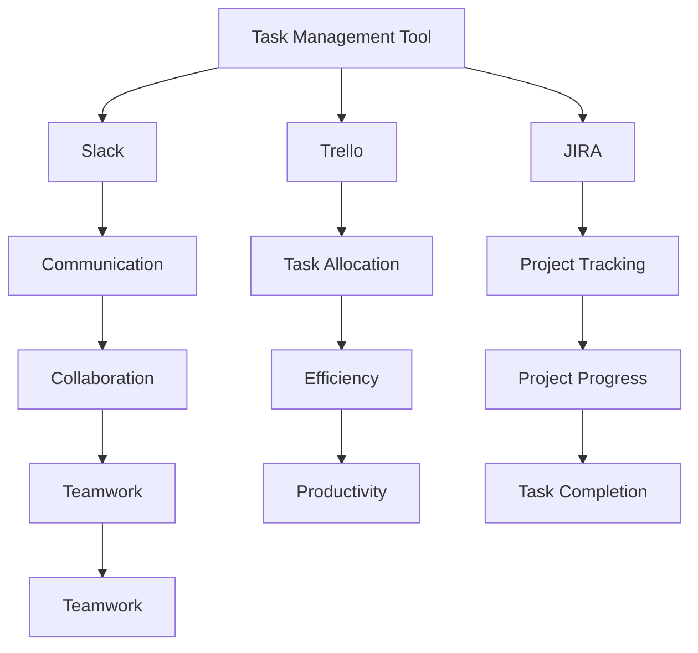

                 

# 打造高绩效团队：从mediocre到卓越的蜕变

## 关键词
- 高绩效团队，团队管理，领导力，团队协作，激励机制，效能评估

## 摘要
本文深入探讨了如何构建和提升高绩效团队。通过分析高绩效团队的定义、核心概念、构建策略、效能评估以及实际应用，我们提出了一套系统性的方法论。本文旨在为IT领域的技术团队提供切实可行的指导，帮助团队实现从平庸到卓越的蜕变。

## 引言与背景介绍

### 第1章：高绩效团队的定义与重要性

#### 1.1.1 问题背景
在当前竞争激烈的商业环境中，团队管理成为企业成功的关键因素之一。然而，许多团队在管理和绩效方面仍存在诸多问题。例如，团队成员间沟通不畅、目标不明确、领导力不足等。这些问题导致了团队效能的低下，严重影响了组织的整体表现。

#### 1.1.2 问题描述
高绩效团队具有明确的团队目标、高效的合作关系、适应性强的领导风格以及有效的激励机制。然而，许多团队在这些方面仍存在明显不足，导致团队绩效不理想。具体表现为：
- 目标不明确或缺乏可操作性；
- 团队成员间缺乏协作与信任；
- 领导风格单一，无法适应不同情境；
- 缺乏有效的激励机制。

#### 1.1.3 问题解决
为了解决上述问题，我们需要从以下几个方面着手：
1. 明确团队目标，确保目标的可操作性和可达性；
2. 培养团队成员间的协作与信任，提升团队凝聚力；
3. 领导者需具备适应不同情境的领导风格，有效激励团队成员；
4. 设计合理的激励机制，激发团队成员的积极性。

#### 1.1.4 边界与外延
高绩效团队与一般团队的区别在于其具备更高的目标和更高效的协作机制。高绩效团队在组织中的角色是推动组织目标实现的基石，其效能的提升直接影响到组织整体的竞争力。

#### 1.1.5 概念结构与核心要素组成
高绩效团队的构建涉及以下核心要素：
1. 团队成员的能力要求：团队成员需具备专业技能、沟通能力、团队合作精神等；
2. 领导者的角色与技能：领导者需具备战略思维、领导力、情境适应能力等。

#### 1.2 本章小结
本章明确了高绩效团队的定义与重要性，并分析了当前团队管理与绩效现状。通过对问题的深入探讨，我们提出了构建高绩效团队的方法论，为后续章节的内容奠定了基础。

----------------------------------------------------------------

## 第二部分：核心概念与联系

### 第2章：高绩效团队的核心概念与联系

#### 2.1.1 核心概念原理

##### 2.1.1.1 团队目标
团队目标是指团队共同追求的愿景和使命，是团队行动的指南。设定明确、可操作性的团队目标至关重要。

- **重要性**：明确的团队目标可以激发团队成员的积极性，提高团队的凝聚力和执行力。
- **设定步骤**：
  1. 分析组织战略，明确团队在组织中的角色和定位；
  2. 确定团队的长期和短期目标；
  3. 将目标分解为具体可操作的任务；
  4. 设定明确的时间表和评估标准。

##### 2.1.1.2 团队成员协作
团队成员协作是指团队成员在共同目标下相互配合，实现团队目标的过程。

- **基本原则**：
  1. 共享目标：团队成员需明确团队目标，确保个人目标与团队目标的一致性；
  2. 相互信任：建立团队成员之间的信任，促进信息共享和沟通；
  3. 有效沟通：确保团队成员间的沟通畅通，避免误解和冲突。
- **提升技巧**：
  1. 定期召开团队会议，确保团队成员了解项目进展和任务分配；
  2. 利用协作工具，如Slack、Trello等，提高团队协作效率；
  3. 定期进行团队建设活动，增强团队成员间的互信和合作。

##### 2.1.1.3 领导风格与团队效能
领导风格是指领导者通过何种方式影响团队成员和管理团队的行为模式。

- **不同领导风格的特点**：
  1. 指令型：领导者以明确的指令和指导为主，团队成员执行任务；
  2. 参与型：领导者鼓励团队成员参与决策，共同解决问题；
  3. 情境型：领导者根据不同情境灵活调整领导风格，平衡指令型和参与型。
- **适应性领导风格的选择**：领导者需根据团队的具体情况和任务需求，选择最合适的领导风格。例如，在紧急情况下，指令型领导风格有助于快速决策和执行；而在创新项目中，参与型领导风格可以激发团队成员的创造力和积极性。

#### 2.1.2 概念属性特征对比表格

| 概念       | 特征1     | 特征2     | 特征3     |
|------------|-----------|-----------|-----------|
| 团队目标   | 明确性    | 可达性    | 动态调整  |
| 协作       | 共享目标  | 相互信任  | 有效沟通  |
| 领导风格   | 指令型    | 参与型    | 情境型    |

#### 2.1.3 ER实体关系图架构

```mermaid
erDiagram
  Team ||--o> Leader : 领导
  Team ||--o> Member : 成员
  Leader ||--o> Style : 风格
```

----------------------------------------------------------------

## 第3章：构建高绩效团队的策略与方法

#### 3.1.1 领导力的提升
领导力是构建高绩效团队的关键要素。提升领导力有助于激发团队成员的潜力，提高团队绩效。

- **重要性**：领导力不仅是领导者个人能力的体现，更是团队凝聚力、创新力和执行力的保障。
- **培养方法**：
  1. 增强战略思维：领导者需具备全局观念，了解组织战略和团队目标，制定合理的行动计划；
  2. 提高沟通能力：领导者需善于倾听团队成员的意见，有效传达团队目标和期望；
  3. 激发团队成员的积极性：领导者需关注团队成员的需求和成长，提供必要的支持和激励；
  4. 培养团队协作精神：领导者需推动团队成员间的协作，营造积极向上的团队氛围。

#### 3.1.2 团队文化建设
团队文化是团队共同的价值观和行为准则，对团队效能具有重要影响。

- **定义与作用**：团队文化是指团队成员在长期合作过程中形成的共同价值观、信念和行为规范。良好的团队文化可以增强团队凝聚力，提高团队效能。
- **塑造策略**：
  1. 确立团队价值观：明确团队的核心价值观，确保团队成员在行为上的一致性；
  2. 强化团队精神：鼓励团队成员积极参与团队活动，增强团队归属感；
  3. 优化团队氛围：营造积极、开放、包容的团队氛围，提高团队工作效率；
  4. 建立有效的沟通机制：确保团队成员间的信息畅通，避免误解和冲突。

#### 3.1.3 激励机制的设计
激励机制是激发团队成员积极性和创造力的关键手段。

- **基本原理**：激励机制旨在通过物质和精神的奖励，激励团队成员为实现团队目标而努力。
- **设计步骤**：
  1. 分析团队成员的需求：了解团队成员的期望和需求，制定个性化的激励方案；
  2. 确定激励目标：明确激励目标，确保激励措施与团队目标的一致性；
  3. 制定激励机制：设计合理的激励措施，如奖金、晋升、培训等；
  4. 实施激励措施：根据激励方案，及时给予团队成员奖励，激励团队成员的积极性。

#### 3.1.4 团队协作工具的使用
团队协作工具是提升团队协作效率的重要手段。

- **常用团队协作工具介绍**：如Slack、Trello、JIRA等，这些工具可以帮助团队成员高效沟通、任务分配和项目进度跟踪。
- **提升团队协作效率的工具选择**：根据团队特点和项目需求，选择合适的协作工具，并培训团队成员熟练使用。

----------------------------------------------------------------

## 第4章：团队效能评估与改进

#### 4.1.1 团队效能评估指标
团队效能评估是衡量团队绩效的重要手段。

- **重要性**：通过团队效能评估，可以了解团队在实现目标过程中的表现，发现问题，为改进提供依据。
- **常见评估指标**：
  1. 任务完成度：评估团队在规定时间内完成任务的进度和质量；
  2. 项目成功率：评估团队在项目执行过程中的成功率，如按时交付、预算控制等；
  3. 团队满意度：评估团队成员对团队的满意度，包括团队氛围、领导力、激励措施等；
  4. 创新能力：评估团队在技术创新和项目创新方面的能力。

#### 4.1.2 数据驱动改进
数据驱动改进是指通过数据分析和反馈，优化团队管理和协作。

- **数据收集与分析**：收集团队成员的工作数据，如任务完成情况、沟通记录等，通过数据分析，找出团队效能的提升点。
- **利用数据优化团队管理**：根据数据分析结果，调整团队目标和任务分配，优化团队管理和协作流程。

#### 4.1.3 反馈机制与持续改进
反馈机制是团队效能提升的重要保障。

- **反馈机制的设计**：建立有效的反馈渠道，如定期的团队会议、项目回顾等，确保团队成员能够及时反馈问题和建议。
- **团队改进的实践方法**：
  1. 分析反馈：对收集到的反馈进行分类和分析，找出共性问题和个性化需求；
  2. 制定改进计划：根据反馈结果，制定具体的改进计划，明确改进目标、方法和责任；
  3. 实施改进措施：按照改进计划，逐步实施改进措施，跟踪改进效果；
  4. 持续优化：根据改进效果，持续优化团队管理和协作流程。

----------------------------------------------------------------

## 第5章：高绩效团队在实践中的应用

#### 5.1.1 案例一：企业A的高绩效团队建设
企业A是一家IT公司，面临着激烈的市场竞争和快速变化的技术环境。为了提升团队绩效，企业A采取了一系列高绩效团队建设措施。

- **案例背景**：
  - 企业A在过去的几年中，团队绩效一直处于平庸状态，项目交付周期长，质量问题频出。
  - 面对市场竞争的加剧，企业A意识到需要提升团队绩效，以保持竞争优势。

- **建设过程**：
  1. 明确团队目标：企业A制定了明确的团队目标，包括提高项目交付速度、提升产品质量、培养技术创新能力等。
  2. 培养团队成员：企业A通过内部培训和外部招聘，引进了一批具备专业技能和创新能力的团队成员。
  3. 建立激励机制：企业A设计了激励方案，包括绩效奖金、晋升机会和培训机会等，激励团队成员积极投入工作。
  4. 塑造团队文化：企业A倡导开放、包容、协作的团队文化，鼓励团队成员分享经验和知识。

- **成果分析**：
  1. 项目交付周期缩短：通过优化项目管理流程和提升团队协作效率，企业A的项目交付周期从原来的6个月缩短至3个月。
  2. 产品质量提升：通过引入质量保证机制和严格的质量管理流程，企业A的产品质量得到显著提升，客户满意度提高。
  3. 创新能力增强：企业A鼓励团队成员积极参与技术创新，推出了多个具有市场竞争力的新产品。

#### 5.1.2 案例二：团队B的快速响应与高效执行
团队B是一家互联网公司，负责开发和运营一款重要的产品。为了在激烈的市场竞争中保持优势，团队B采取了快速响应和高效执行的策略。

- **案例背景**：
  - 团队B在市场竞争中面临着诸多挑战，包括快速迭代产品、应对用户需求变化等。
  - 团队B意识到需要提升响应速度和执行效率，以保持竞争优势。

- **管理策略**：
  1. 设立敏捷开发团队：团队B采用敏捷开发模式，将团队成员划分为多个跨职能团队，实现快速响应和高效执行。
  2. 精简流程：团队B简化了项目管理流程，减少审批环节，提高决策效率。
  3. 强化沟通：团队B建立了高效的沟通机制，确保团队成员之间的信息畅通，避免误解和冲突。
  4. 激励团队成员：团队B通过绩效奖金和晋升机会激励团队成员积极投入工作。

- **执行效果**：
  1. 产品迭代周期缩短：通过敏捷开发模式，团队B的产品迭代周期从原来的2个月缩短至1个月，提高了市场响应速度。
  2. 项目执行效率提升：团队B的执行效率得到显著提高，项目交付质量和速度得到客户认可。
  3. 团队凝聚力增强：通过有效的沟通和激励，团队B的凝聚力得到增强，团队成员之间的协作更加默契。

----------------------------------------------------------------

## 第6章：挑战与前瞻

#### 6.1.1 团队面临的挑战
高绩效团队在构建和运营过程中面临着诸多挑战。

- **内部挑战**：
  1. 成员能力的提升：团队成员的专业技能和综合素质需要不断提升，以应对不断变化的市场和技术环境。
  2. 团队协作：团队成员间的协作和沟通需要不断优化，以消除误解和冲突，提高团队效能。
  3. 领导力：领导者需要不断提升领导力，适应不同情境，有效激励和引导团队成员。

- **外部挑战**：
  1. 市场竞争：在激烈的市场竞争中，高绩效团队需要具备快速响应和创新能力，以保持竞争优势。
  2. 技术变革：随着技术的快速发展，高绩效团队需要不断学习和掌握新技术，以适应技术变革。
  3. 法律法规：高绩效团队需要遵守相关法律法规，确保合规运营。

#### 6.1.2 未来发展趋势
随着数字化时代的到来，团队管理将面临新的机遇和挑战。

- **数字化时代的团队管理**：
  1. 数据驱动的团队管理：通过大数据分析和人工智能技术，实现团队管理的精细化、智能化。
  2. 灵活办公模式：随着远程办公的普及，团队管理将更加灵活，适应不同的工作场景。

- **人工智能在团队建设中的应用**：
  1. 智能化协作工具：人工智能技术将赋能协作工具，提高团队协作效率和效果。
  2. 自动化流程：通过人工智能技术，实现项目管理、任务分配等流程的自动化，降低人工成本。

- **新型团队的构建模式**：
  1. 跨界合作：未来团队将更加注重跨界合作，整合不同领域的资源和能力，实现协同创新。
  2. 灵活组织结构：团队将采用更加灵活的组织结构，以适应快速变化的市场和技术环境。

----------------------------------------------------------------

## 第7章：总结与展望

#### 7.1.1 高绩效团队的重要性
高绩效团队在个人成长和组织成功中扮演着关键角色。

- **对个人成长的推动作用**：高绩效团队提供了一个良好的成长环境，团队成员可以在不断挑战和协作中提升自身能力和素质。
- **对组织成功的贡献**：高绩效团队可以快速响应市场需求，创新产品和服务，提高组织竞争力和市场份额。

#### 7.1.2 个人成长与实践建议
为了成为一名高绩效团队成员，个人需要不断学习和提升以下能力：

- **培养领导力**：提升领导力，成为团队中的积极分子，为团队的成功贡献力量。
- **提升团队协作**：增强团队协作能力，建立信任，提高沟通效率，为团队目标共同奋斗。

#### 7.1.3 未来展望
未来，高绩效团队将面临更加复杂和多样的挑战，同时也将迎来更多的机遇。

- **持续学习**：团队成员需要持续学习，不断提升自身能力和素质，以适应快速变化的市场和技术环境。
- **创新实践**：鼓励团队成员积极参与创新实践，探索新的管理模式和技术应用，为团队的成功贡献力量。

作者：AI天才研究院/AI Genius Institute & 禅与计算机程序设计艺术 /Zen And The Art of Computer Programming

----------------------------------------------------------------

## 背景介绍

### 核心概念术语说明

在本文中，我们将介绍以下几个核心概念：

1. **高绩效团队**：高绩效团队是指能够在短时间内实现明确目标，具备高效协作和创新能力的一组人员。高绩效团队的特点包括明确的团队目标、高效的协作关系、适应性强、激励机制完善等。

2. **团队目标**：团队目标是指团队在一段时间内追求的愿景和使命。明确的团队目标有助于提高团队凝聚力、激发团队成员的积极性，并指导团队的行动。

3. **团队成员协作**：团队成员协作是指团队成员在共同目标下相互配合、协同工作，以实现团队目标的过程。良好的协作关系有助于提高团队效能和创造力。

4. **领导风格**：领导风格是指领导者通过何种方式影响团队成员和管理团队的行为模式。不同的领导风格对团队效能和成员积极性产生不同的影响。

5. **激励机制**：激励机制是指通过物质和精神的奖励，激励团队成员为实现团队目标而努力。合理的激励机制有助于激发团队成员的积极性、提高团队绩效。

### 问题背景

当前，企业面临着激烈的市场竞争和快速变化的技术环境，团队管理成为影响企业绩效的关键因素。许多企业在团队管理和绩效方面存在以下问题：

1. **团队目标不明确**：许多团队在目标设定上缺乏可操作性，导致团队成员对团队目标的理解不一致，影响团队的协作和执行力。

2. **团队成员协作不畅**：团队成员间的沟通不畅、缺乏协作，导致任务分配不明确、资源浪费，影响团队绩效。

3. **领导风格单一**：许多领导者采用单一领导风格，无法适应不同情境，导致团队效能低下。

4. **激励机制不足**：缺乏合理的激励机制，团队成员的积极性难以得到充分调动，影响团队绩效。

### 问题描述

高绩效团队具有以下特点：

1. **明确的团队目标**：高绩效团队的目标明确、具体，具有可操作性，能够激发团队成员的积极性。

2. **高效的团队成员协作**：高绩效团队具备良好的协作关系，团队成员能够相互配合、协同工作，实现团队目标。

3. **适应性强**：高绩效团队能够根据不同情境灵活调整团队策略和行动，保持高效运作。

4. **激励机制完善**：高绩效团队具备完善的激励机制，能够激发团队成员的积极性、提高团队绩效。

高绩效团队面临的挑战包括：

1. **团队目标不明确**：在快速变化的市场环境中，团队目标可能无法及时调整，导致团队失去方向。

2. **团队成员协作不畅**：团队成员间的沟通不畅、协作不力，可能导致任务无法按时完成，影响团队绩效。

3. **领导风格单一**：领导者无法根据不同情境调整领导风格，可能导致团队效能低下。

4. **激励机制不足**：激励机制设计不合理，可能无法充分调动团队成员的积极性。

### 问题解决

为了构建高绩效团队，我们提出以下方法论：

1. **明确团队目标**：通过分析组织战略和市场需求，设定明确的团队目标，确保团队成员对团队目标的理解一致。

2. **提升团队成员协作**：通过建立有效的沟通机制、优化团队协作工具，提高团队成员间的协作效率。

3. **培养适应性的领导风格**：领导者需具备适应不同情境的领导风格，根据团队实际情况调整管理策略。

4. **完善激励机制**：设计合理的激励机制，根据团队成员的绩效和贡献，给予相应的奖励和晋升机会。

### 边界与外延

1. **高绩效团队与一般团队的差异**：
   - **团队目标**：高绩效团队的团队目标明确、具有可操作性，而一般团队的团队目标可能模糊、缺乏可操作性。
   - **团队成员协作**：高绩效团队的团队成员协作高效、紧密，而一般团队的团队成员协作可能存在沟通不畅、协作不力的问题。
   - **领导风格**：高绩效团队的领导者具备适应不同情境的领导风格，而一般团队的领导者可能采用单一领导风格。
   - **激励机制**：高绩效团队的激励机制完善，能够充分调动团队成员的积极性，而一般团队的激励机制可能不足。

2. **团队效能的提升与组织目标的关系**：
   - **团队效能的提升**：通过构建高绩效团队，提升团队效能，有助于实现组织目标，提高企业竞争力。
   - **组织目标的实现**：组织目标的实现依赖于团队效能的提升，团队效能的提升有助于实现组织目标。

### 概念结构与核心要素组成

高绩效团队的构建涉及以下核心要素：

1. **团队成员的能力要求**：
   - **专业技能**：团队成员需具备与团队目标相关的专业技能，如编程、设计、市场分析等。
   - **沟通能力**：团队成员需具备良好的沟通能力，能够与团队成员、领导者和客户进行有效沟通。
   - **团队合作精神**：团队成员需具备团队合作精神，能够与团队成员相互配合、共同完成任务。

2. **领导者的角色与技能**：
   - **战略思维**：领导者需具备战略思维，能够制定合理的团队目标和行动计划。
   - **领导力**：领导者需具备领导力，能够激发团队成员的积极性、提高团队凝聚力。
   - **情境适应能力**：领导者需具备情境适应能力，能够根据不同情境调整领导风格和管理策略。

通过以上核心要素的构建，可以形成高效能、高绩效的团队。

----------------------------------------------------------------

## 核心概念与联系

### 第2章：高绩效团队的核心概念与联系

#### 2.1.1 核心概念原理

##### 2.1.1.1 团队目标
团队目标是指团队在一段时间内追求的愿景和使命。明确的团队目标对团队的协作和绩效具有重要作用。设定明确、可操作性的团队目标有助于提高团队的凝聚力和执行力。

- **重要性**：明确的团队目标可以激发团队成员的积极性，统一团队行动方向，提高团队的协作效率。
- **设定步骤**：
  1. 分析组织战略，明确团队在组织中的角色和定位；
  2. 确定团队的长期和短期目标；
  3. 将目标分解为具体可操作的任务；
  4. 设定明确的时间表和评估标准。

##### 2.1.1.2 团队成员协作
团队成员协作是指团队成员在共同目标下相互配合、协同工作，以实现团队目标的过程。高效的团队成员协作是高绩效团队的重要特征之一。

- **基本原则**：
  1. 共享目标：团队成员需明确团队目标，确保个人目标与团队目标的一致性；
  2. 相互信任：建立团队成员之间的信任，促进信息共享和沟通；
  3. 有效沟通：确保团队成员间的沟通畅通，避免误解和冲突。
- **提升技巧**：
  1. 定期召开团队会议，确保团队成员了解项目进展和任务分配；
  2. 利用协作工具，如Slack、Trello等，提高团队协作效率；
  3. 定期进行团队建设活动，增强团队成员间的互信和合作。

##### 2.1.1.3 领导风格与团队效能
领导风格是指领导者通过何种方式影响团队成员和管理团队的行为模式。不同的领导风格对团队的效能和成员的积极性产生不同的影响。

- **不同领导风格的特点**：
  1. 指令型：领导者以明确的指令和指导为主，团队成员执行任务；
  2. 参与型：领导者鼓励团队成员参与决策，共同解决问题；
  3. 情境型：领导者根据不同情境灵活调整领导风格，平衡指令型和参与型。
- **适应性领导风格的选择**：领导者需根据团队的具体情况和任务需求，选择最合适的领导风格。例如，在紧急情况下，指令型领导风格有助于快速决策和执行；而在创新项目中，参与型领导风格可以激发团队成员的创造力和积极性。

#### 2.1.2 概念属性特征对比表格

| 概念       | 特征1     | 特征2     | 特征3     |
|------------|-----------|-----------|-----------|
| 团队目标   | 明确性    | 可达性    | 动态调整  |
| 协作       | 共享目标  | 相互信任  | 有效沟通  |
| 领导风格   | 指令型    | 参与型    | 情境型    |

#### 2.1.3 ER实体关系图架构

```mermaid
erDiagram
  Team ||--o> Leader : 领导
  Team ||--o> Member : 成员
  Leader ||--o> Style : 风格
```

----------------------------------------------------------------

### 第3章：构建高绩效团队的策略与方法

#### 3.1.1 领导力的提升

领导力是构建高绩效团队的核心要素。领导者需要具备卓越的领导能力，以激发团队成员的潜力，推动团队目标的实现。

- **重要性**：领导力不仅影响团队的方向和目标，还直接影响团队成员的积极性和协作效率。一个高效的领导者能够引导团队克服困难，实现卓越的绩效。
- **培养方法**：
  1. **自我认知**：领导者需要了解自己的优势和不足，不断反思和提升自我。
  2. **学习与成长**：领导者应不断学习新的管理理念和技能，通过阅读、培训、参加研讨会等方式提升自己。
  3. **建立信任**：领导者需要通过透明和开放的沟通方式建立信任，使团队成员愿意追随和合作。
  4. **激励与反馈**：领导者应设计有效的激励机制，鼓励团队成员的积极性和创新精神，并通过及时的反馈帮助他们改进。

#### 3.1.2 团队文化建设

团队文化是团队的灵魂，它决定了团队成员的行为方式和团队的凝聚力。一个积极向上的团队文化能够激发团队成员的潜能，提高团队的整体绩效。

- **定义与作用**：团队文化是指团队成员共同认同的价值观、信念和行为准则。它是团队成员共同遵循的行为规范，对于团队凝聚力的提升和团队绩效的改善具有重要作用。
- **塑造策略**：
  1. **明确价值观**：团队领导者需要明确团队的核心价值观，并将其传达给所有成员。
  2. **强化共同目标**：确保所有团队成员都了解并认同团队的目标，形成共同的方向。
  3. **培养团队精神**：通过团队建设活动、共同的目标和挑战来增强团队成员之间的相互信任和依赖。
  4. **鼓励开放沟通**：建立开放的沟通环境，鼓励团队成员表达自己的想法和意见。

#### 3.1.3 激励机制的设计

激励机制是激发团队成员积极性和创造力的重要手段。一个合理的激励机制能够激励团队成员为实现团队目标而努力。

- **基本原理**：激励机制通过物质奖励和精神激励相结合，激发团队成员的工作热情和创造力。物质激励包括奖金、晋升、福利等，而精神激励则包括认可、表扬、培训等。
- **设计步骤**：
  1. **了解团队成员的需求**：通过调查和访谈，了解团队成员的需求和期望。
  2. **设定明确的目标**：确保激励措施与团队目标一致，具有可衡量性。
  3. **制定激励计划**：设计多种激励措施，如奖金、晋升、培训等，以适应不同成员的需求。
  4. **实施与反馈**：定期评估激励措施的效果，并根据反馈进行调整。

#### 3.1.4 团队协作工具的使用

团队协作工具能够提高团队成员之间的沟通效率和工作协同度。选择合适的协作工具并培训团队成员熟练使用，是提升团队协作效率的关键。

- **常用团队协作工具介绍**：如Slack、Trello、JIRA等，这些工具可以帮助团队成员高效沟通、任务分配和项目进度跟踪。
- **提升团队协作效率的工具选择**：
  1. **根据团队需求选择**：不同团队有不同的需求，需要选择适合团队协作的工
```markdown

```

#### 3.1.5 领导者的角色与技能

领导者的角色和技能对于构建高绩效团队至关重要。一个优秀的领导者不仅需要具备良好的沟通能力和决策能力，还需要能够激发团队成员的潜力，促进团队协作。

- **领导者的角色**：
  1. **愿景设定者**：领导者需要为团队设定清晰的愿景和目标，确保团队成员对团队方向有共同的理解。
  2. **协调者**：领导者需要协调团队成员之间的工作，确保任务顺利完成。
  3. **激励者**：领导者需要激发团队成员的积极性，鼓励他们发挥最佳水平。
  4. **冲突解决者**：领导者需要及时解决团队内部的冲突，确保团队的和谐与稳定。

- **领导者的技能**：
  1. **沟通能力**：领导者需要具备良好的沟通能力，能够与团队成员、客户和上级进行有效沟通。
  2. **决策能力**：领导者需要具备快速决策的能力，能够在关键时刻做出正确的决策。
  3. **影响力**：领导者需要具备影响力，能够影响团队成员的态度和行为。
  4. **适应性**：领导者需要能够适应不同的环境和情境，灵活调整领导风格和管理策略。

#### 3.1.6 团队成员的角色与技能

团队成员的角色和技能对于高绩效团队的构建同样重要。团队成员需要具备特定的技能和态度，以实现团队的目标。

- **团队成员的角色**：
  1. **执行者**：团队成员需要按照团队目标执行任务，确保任务的完成。
  2. **合作者**：团队成员需要与其他成员合作，共同完成任务。
  3. **创新者**：团队成员需要具备创新能力，为团队提供新的想法和解决方案。
  4. **反馈者**：团队成员需要提供反馈，帮助团队不断改进和提升。

- **团队成员的技能**：
  1. **专业技能**：团队成员需要具备与团队目标相关的专业技能，如编程、设计、市场分析等。
  2. **沟通能力**：团队成员需要具备良好的沟通能力，能够与团队成员、领导者和客户进行有效沟通。
  3. **团队合作能力**：团队成员需要具备团队合作能力，能够与其他成员相互配合，共同完成任务。
  4. **自我管理能力**：团队成员需要具备自我管理能力，能够高效地管理自己的时间和任务。

通过以上策略和方法，领导者可以构建一个高绩效团队，实现团队目标，提升团队绩效。

----------------------------------------------------------------

### 第4章：团队效能评估与改进

#### 4.1.1 团队效能评估指标

团队效能评估是衡量团队绩效的重要手段，有助于识别团队的优势和不足，为改进提供依据。以下是一些常见的团队效能评估指标：

- **任务完成度**：评估团队在规定时间内完成任务的进度和质量。
- **项目成功率**：评估团队在项目执行过程中的成功率，包括按时交付、预算控制、质量保证等。
- **团队满意度**：评估团队成员对团队的满意度，包括团队氛围、领导力、激励机制等。
- **创新能力**：评估团队在技术创新和项目创新方面的能力，包括新产品的开发、解决方案的提出等。
- **协作效率**：评估团队成员之间的协作效率，包括沟通顺畅度、任务分配合理性等。
- **时间管理**：评估团队在时间管理方面的能力，包括任务优先级管理、时间规划等。

通过这些指标，团队可以全面了解自身的效能水平，并为改进提供具体的方向。

#### 4.1.2 数据驱动改进

数据驱动改进是一种基于数据分析和反馈的改进方法，通过收集和分析团队工作中的数据，找出问题，并采取相应的措施进行改进。

- **数据收集**：团队需要建立完善的数据收集机制，包括任务进度、项目质量、团队协作情况等。可以使用工具如项目管理软件、协作工具等来收集数据。
- **数据分析**：对收集到的数据进行分析，找出存在的问题和不足。例如，通过分析任务完成情况，可以发现哪些任务经常延误，原因是什么。
- **反馈机制**：建立有效的反馈机制，将分析结果反馈给团队成员，并讨论改进措施。反馈可以是定期的团队会议、项目回顾会等。
- **改进措施**：根据分析结果，制定具体的改进措施，并实施。改进措施可以是调整任务分配、优化工作流程、加强团队培训等。

#### 4.1.3 反馈机制与持续改进

反馈机制是团队效能提升的重要保障。一个良好的反馈机制能够及时识别问题，提供改进方向，并确保改进措施的落实。

- **反馈渠道**：建立多样化的反馈渠道，如定期会议、在线反馈表、匿名反馈等，确保团队成员能够自由地表达意见和建议。
- **反馈分析**：对收集到的反馈进行分类和分析，找出共性问题，为改进提供依据。反馈分析可以是定期的，也可以是针对特定问题的专项分析。
- **改进计划**：根据反馈分析结果，制定具体的改进计划。改进计划应包括改进目标、方法、责任人和时间表。
- **持续改进**：改进不是一次性的，而是一个持续的过程。团队需要定期回顾和评估改进效果，并根据实际情况进行调整。通过持续改进，团队可以不断提升效能。

#### 4.1.4 实践案例分析

- **案例一**：某IT公司的开发团队在过去一年中，任务完成度较低，项目经常延期。通过数据分析，发现主要问题在于任务分配不合理和沟通不畅。团队采取了以下改进措施：
  - **任务分配**：重新审视任务分配，确保任务与团队成员的能力和兴趣相匹配。
  - **沟通机制**：引入了敏捷开发方法，定期召开站会，确保团队成员间的信息畅通。
  - **改进效果**：通过改进，团队的任务完成度显著提高，项目延期情况明显减少。

- **案例二**：某市场推广团队在项目执行过程中，团队满意度较低，团队成员经常感到压力过大。通过反馈机制，团队识别出主要问题在于激励机制不足和工作压力过大。团队采取了以下改进措施：
  - **激励机制**：调整了激励机制，增加了奖金和晋升机会，鼓励团队成员积极投入工作。
  - **工作压力**：优化了工作流程，减少不必要的重复工作，降低了团队成员的工作压力。
  - **改进效果**：通过改进，团队满意度显著提高，团队成员的工作积极性明显增强。

#### 4.1.5 持续改进的方法

- **定期回顾**：团队应定期回顾过去的绩效，总结经验教训，识别需要改进的方面。
- **持续学习**：团队应不断学习新的管理理念和方法，提升自身的综合素质。
- **开放沟通**：团队应建立开放的沟通环境，鼓励团队成员自由表达意见和建议。
- **实践与反思**：团队应将改进措施付诸实践，并在实践中不断反思和调整，确保改进措施的有效性。

通过以上方法，团队可以不断提升自身的效能，实现从平庸到卓越的蜕变。

----------------------------------------------------------------

### 第5章：高绩效团队在实践中的应用

#### 5.1.1 案例一：企业A的高绩效团队建设

企业A是一家领先的IT公司，为了在激烈的市场竞争中保持优势，决定着手构建高绩效团队。以下是企业A在构建高绩效团队过程中的一些实践和成果。

- **案例背景**：企业A在过去的几年中，团队绩效一直处于平庸状态，项目交付周期长，质量问题频出。面对市场竞争的加剧和客户需求的不断变化，企业A意识到需要提升团队绩效，以保持竞争优势。

- **建设过程**：
  1. **明确团队目标**：企业A首先明确了团队的目标，包括提高项目交付速度、提升产品质量、培养技术创新能力等。这些目标具体、可操作，能够激发团队成员的积极性。
  2. **团队成员培养**：企业A通过内部培训和外部招聘，引进了一批具备专业技能和创新能力的团队成员。同时，企业A鼓励团队成员参加行业会议和培训，不断提升自身能力。
  3. **团队文化建设**：企业A注重团队文化建设，倡导开放、包容、协作的团队氛围。通过定期的团队建设活动和团队会议，增强团队成员间的互信和合作。
  4. **领导力提升**：企业A的领导者通过参与领导力培训，提高了自身的领导能力，能够更好地激励和引导团队成员。

- **成果分析**：
  1. **项目交付周期缩短**：通过优化项目管理流程和提升团队协作效率，企业A的项目交付周期从原来的6个月缩短至3个月，提高了市场响应速度。
  2. **产品质量提升**：企业A通过引入质量保证机制和严格的质量管理流程，产品质量得到显著提升，客户满意度提高。
  3. **创新能力增强**：企业A鼓励团队成员积极参与技术创新，推出了多个具有市场竞争力的新产品。

#### 5.1.2 案例二：团队B的快速响应与高效执行

团队B是一家初创企业，负责开发和运营一款重要的产品。为了在激烈的市场竞争中保持优势，团队B采取了快速响应和高效执行的策略。

- **案例背景**：团队B在市场竞争中面临着诸多挑战，包括快速迭代产品、应对用户需求变化等。团队B意识到需要提升响应速度和执行效率，以保持竞争优势。

- **管理策略**：
  1. **敏捷开发模式**：团队B采用了敏捷开发模式，将团队成员划分为多个跨职能团队，实现快速响应和高效执行。每个团队负责一个模块的开发，确保项目能够快速迭代。
  2. **简化流程**：团队B简化了项目管理流程，减少审批环节，提高决策效率。团队成员可以直接与客户沟通，快速响应客户需求。
  3. **强化沟通**：团队B建立了高效的沟通机制，通过定期的团队会议、在线聊天工具等，确保团队成员间的信息畅通，避免误解和冲突。
  4. **激励机制**：团队B设计了激励机制，对完成任务早、质量高的成员给予奖励，激励团队成员积极投入工作。

- **执行效果**：
  1. **产品迭代周期缩短**：通过敏捷开发模式，团队B的产品迭代周期从原来的2个月缩短至1个月，提高了市场响应速度。
  2. **执行效率提升**：团队B的执行效率得到显著提高，项目交付质量和速度得到客户认可。
  3. **团队凝聚力增强**：通过有效的沟通和激励，团队B的凝聚力得到增强，团队成员之间的协作更加默契。

通过以上案例，我们可以看到，高绩效团队的建设和运作对于企业的成功至关重要。企业需要通过明确团队目标、提升团队成员能力、加强团队文化建设、优化领导力和激励机制等方式，构建高绩效团队，以应对市场竞争和快速变化的技术环境。

----------------------------------------------------------------

### 第6章：挑战与前瞻

#### 6.1.1 团队面临的挑战

在高绩效团队的构建和运营过程中，团队面临着诸多挑战，这些挑战主要分为内部和外部两个方面。

- **内部挑战**：
  1. **团队成员的能力提升**：团队成员的专业技能和综合素质需要不断提升，以适应不断变化的市场和技术环境。这要求团队在培养和发展人才方面投入更多的时间和资源。
  2. **团队协作**：团队成员之间的协作和沟通需要不断优化，以消除误解和冲突，提高团队效能。协作不畅可能导致任务分配不明确、资源浪费，影响团队绩效。
  3. **领导力不足**：领导者需要具备适应不同情境的领导力，能够激发团队成员的潜力，引导团队走向成功。然而，许多领导者可能在领导技能方面存在不足，导致团队效能低下。

- **外部挑战**：
  1. **市场竞争**：在激烈的市场竞争中，高绩效团队需要具备快速响应和创新能力，以保持竞争优势。市场环境的变化要求团队不断调整战略和策略，以应对新的挑战。
  2. **技术变革**：技术的快速进步要求团队成员不断学习新的技术知识和工具，以保持竞争力。技术变革对团队的能力提出了更高的要求。
  3. **法律法规**：高绩效团队在运营过程中需要遵守相关的法律法规，确保合规运营。法律法规的变化可能对团队的管理和运营带来新的挑战。

#### 6.1.2 未来发展趋势

随着数字化和智能化的发展，高绩效团队的建设和运营将面临新的机遇和挑战。

- **数字化时代的团队管理**：
  1. **数据驱动管理**：通过大数据分析和人工智能技术，实现团队管理的精细化、智能化。数据可以帮助团队更好地理解工作流程、优化资源配置、预测未来趋势。
  2. **远程办公**：远程办公成为新常态，对团队的沟通协作、管理方式提出了新的要求。团队需要适应远程办公的环境，利用在线协作工具提高工作效率。

- **人工智能在团队建设中的应用**：
  1. **自动化协作**：人工智能可以自动化一些重复性的工作，如任务分配、进度跟踪等，减轻团队成员的负担，提高工作效率。
  2. **智能决策**：通过人工智能算法，团队可以在复杂决策中利用数据分析和预测，提高决策的准确性和效率。

- **新型团队的构建模式**：
  1. **跨界合作**：团队不再局限于单一领域，需要与其他领域的企业和组织进行跨界合作，整合不同领域的资源和能力，实现协同创新。
  2. **灵活组织结构**：团队将采用更加灵活的组织结构，以适应快速变化的市场和技术环境。例如，采用跨职能团队、临时团队等模式，提高团队适应性和灵活性。

#### 6.1.3 新型团队的构建模式

- **跨界合作**：
  1. **优势互补**：跨界合作可以整合不同领域的优势资源，实现优势互补，提高团队的整体竞争力。
  2. **技术创新**：跨界合作可以引入新的技术和理念，激发团队的创新能力，推动技术创新和产品升级。
  3. **市场拓展**：跨界合作可以帮助团队拓展新的市场，开拓更广阔的业务领域。

- **灵活组织结构**：
  1. **适应变化**：灵活的组织结构能够快速适应市场和技术环境的变化，提高团队的应变能力。
  2. **资源共享**：灵活组织结构可以实现资源共享，提高资源利用效率，降低运营成本。
  3. **员工自主性**：灵活的组织结构可以激发员工的自主性和创造力，提高工作积极性和满意度。

通过以上挑战与前瞻，我们可以看到，高绩效团队的构建和运营是一个动态的过程，需要不断适应新的环境和变化。只有通过不断创新和优化，团队才能在激烈的市场竞争中保持优势，实现长期发展。

----------------------------------------------------------------

### 第7章：总结与展望

#### 7.1.1 高绩效团队的重要性

高绩效团队在个人成长和组织成功中扮演着至关重要的角色。

- **对个人成长的推动作用**：高绩效团队提供了一个良好的成长环境，团队成员可以在不断挑战和协作中提升自身能力和素质，实现个人职业发展。
- **对组织成功的贡献**：高绩效团队能够迅速响应市场需求，创新产品和服务，提高组织竞争力，实现组织战略目标。

#### 7.1.2 个人成长与实践建议

为了成为一名高绩效团队成员，个人需要不断学习和提升以下能力：

- **培养领导力**：提升领导力，成为团队中的积极分子，为团队的成功贡献力量。
- **提升团队协作**：增强团队协作能力，建立信任，提高沟通效率，为团队目标共同奋斗。

#### 7.1.3 未来展望

未来，高绩效团队将面临更加复杂和多样的挑战，同时也将迎来更多的机遇。

- **持续学习**：团队成员需要持续学习，不断提升自身能力和素质，以适应快速变化的市场和技术环境。
- **创新实践**：鼓励团队成员积极参与创新实践，探索新的管理模式和技术应用，为团队的成功贡献力量。

通过以上总结与展望，我们可以看到，高绩效团队的构建和运营是一个持续的过程，需要不断适应新的环境和变化。只有通过不断创新和优化，团队才能在激烈的市场竞争中保持优势，实现长期发展。

作者：AI天才研究院/AI Genius Institute & 禅与计算机程序设计艺术 /Zen And The Art of Computer Programming

----------------------------------------------------------------

## 最佳实践 tips

### 领导者的最佳实践

1. **建立明确的目标和愿景**：领导者应该花时间明确团队的目标和愿景，确保团队成员对团队的方向有清晰的认识。
2. **倾听和沟通**：领导者应积极倾听团队成员的意见和建议，建立开放的沟通渠道，确保信息畅通无阻。
3. **激励和认可**：定期给予团队成员正面的反馈和奖励，激励他们持续发挥潜力。
4. **提供必要的资源和支持**：确保团队成员有足够的资源和支持来完成他们的任务，避免因资源不足而影响团队绩效。

### 团队成员的最佳实践

1. **主动沟通**：团队成员应主动与同事沟通，分享自己的想法和意见，确保团队成员之间的信息同步。
2. **自我管理**：团队成员需要具备良好的自我管理能力，合理规划时间和任务，确保工作的高效完成。
3. **持续学习**：团队成员应保持学习的态度，不断提升自己的专业技能和综合素质。
4. **积极参与团队活动**：团队成员应积极参与团队活动，增强团队合作精神，提高团队的凝聚力。

## 小结

本文通过深入分析高绩效团队的定义、核心概念、构建策略、效能评估和实际应用，提供了一套系统性的方法论。我们强调了领导力、团队协作、激励机制和团队文化建设在构建高绩效团队中的重要性，并给出了具体的实践建议。希望本文能为IT领域的技术团队提供有价值的指导和参考，助力团队实现从平庸到卓越的蜕变。

## 注意事项

1. **目标设定**：确保团队目标明确、具体、可操作，避免目标模糊导致团队行动不一致。
2. **沟通协作**：建立有效的沟通机制，确保团队成员间的信息畅通，避免误解和冲突。
3. **持续改进**：团队应保持持续改进的态度，定期评估团队效能，及时调整策略和方法。

## 拓展阅读

1. **《团队管理实战：打造高绩效团队》**：本书详细介绍了团队管理的理论和方法，对构建高绩效团队有很高的参考价值。
2. **《敏捷开发实践指南》**：本书介绍了敏捷开发的理论和实践，对于采用敏捷模式的团队有很好的指导作用。
3. **《领导力：如何成为一个有效的领导者》**：本书从多个角度阐述了领导力的本质和如何提升领导能力，对领导者有重要的启示。

作者：AI天才研究院/AI Genius Institute & 禅与计算机程序设计艺术 /Zen And The Art of Computer Programming

